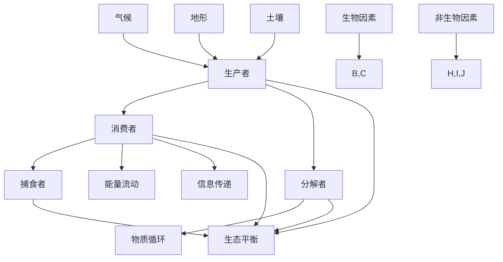
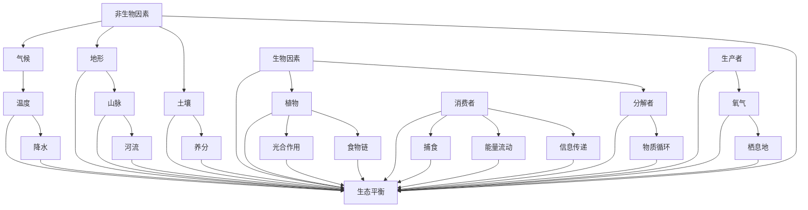

                 

## 文章标题

### 生物多样性保护：生态系统的平衡艺术

---

> 关键词：生物多样性、生态系统、生态平衡、保护方法、技术、可持续发展

> 摘要：本文旨在探讨生物多样性保护的重要性，以及生态系统的平衡艺术。文章首先介绍了生物多样性的基本概念和重要性，然后深入分析了生态系统的结构、功能和平衡机制。接下来，文章讨论了生物多样性保护的方法和技术，包括监测、评估、恢复和保护规划。最后，通过成功案例和未来展望，强调了生物多样性保护在实现可持续发展中的关键作用。

---

## 引言

### 生物多样性的概念与重要性

生物多样性是指地球上所有生物体的多样性，包括基因、物种和生态系统的多样性。它不仅仅是一个生态学术语，更是一个关乎人类生存与发展的关键概念。生物多样性对于维持生态系统的平衡、提供生态系统服务以及支持人类社会的可持续发展具有不可替代的作用。

首先，生物多样性是生态系统的基石。在生态系统中，各种生物体之间存在着复杂的相互作用，这种相互作用促进了生态系统的稳定和健康发展。例如，植物通过光合作用产生氧气，为动物提供食物和栖息地；动物则帮助植物传播种子，维持生态系统的物质循环。

其次，生物多样性对于人类提供了丰富的生态系统服务，包括食物、药品、水源、气候调节等。例如，森林可以调节气候、保持水源、提供木材和药材；湿地可以净化水质、保护海岸线、提供鸟类栖息地。因此，保护生物多样性对于保障人类的基本生存需求具有重要意义。

此外，生物多样性还具有文化价值。许多文化传统和信仰都与自然息息相关，生物多样性的保护不仅有助于维护自然环境，也保护了人类的文化遗产。

然而，生物多样性面临着严重的威胁。栖息地的破坏、污染、气候变化、过度捕捞等因素都在不断减少生物多样性。为了保护生物多样性，我们需要采取有效的保护措施，并实现生态系统的平衡与可持续发展。

### 生态系统的概念与重要性

生态系统是由生物群落与其非生物环境相互作用形成的一个动态平衡系统。生态系统的结构和功能决定了生物多样性的维持和生态系统服务的提供。生态系统的平衡艺术在于如何协调生物与环境之间的关系，实现生态系统的稳定和可持续发展。

首先，生态系统的结构包括生物群落、生态位、食物网等组成部分。生物群落是由多种生物体组成的集合，它们在生态系统中扮演不同的角色。生态位是指生物体在生态系统中的角色和功能，包括捕食者、被捕食者、分解者等。食物网则描述了不同生物体之间通过食物关系相互联系的网络结构。

其次，生态系统的功能包括物质循环、能量流动、信息传递等。物质循环指的是生态系统中物质（如碳、氮、水等）的循环和转化，这是维持生态系统稳定的基础。能量流动则描述了生态系统中能量的输入、传递和转化过程，这是生态系统功能实现的基础。信息传递则是生物体之间通过化学信号、物理信号等进行的交流，对于维持生态系统的平衡和健康至关重要。

生态系统的平衡与稳定是实现生物多样性和提供生态系统服务的关键。生态平衡是指生态系统中生物、环境、物质和能量等多种因素相互协调、稳定的状态。生态平衡的破坏会导致生态系统功能的衰退和生物多样性的丧失，进而影响人类社会的可持续发展。

为了实现生态系统的平衡，我们需要关注以下几个方面：

1. **保护生物多样性**：生物多样性是生态系统的基石，保护生物多样性是维护生态系统平衡的关键。通过建立自然保护区、保护物种栖息地、实施栖息地恢复等措施，可以有效地保护生物多样性。

2. **控制人类活动**：人类活动是影响生态系统平衡的重要因素。通过合理规划和控制人类活动，减少对生态系统的破坏，可以促进生态系统的平衡和稳定。

3. **恢复生态系统功能**：针对受损的生态系统，通过植被恢复、湿地修复、河流治理等措施，可以恢复生态系统的功能，促进生态平衡的实现。

4. **实现可持续发展**：生态系统的平衡与可持续发展密切相关。通过推动绿色发展、循环经济、低碳生活等，可以实现生态系统的平衡和可持续发展。

### 生物多样性保护与生态平衡的关系

生物多样性保护与生态平衡密切相关，二者相互依赖、相互促进。生物多样性是生态系统稳定和健康的基础，生态平衡则是实现生物多样性保护的关键。以下是生物多样性保护与生态平衡关系的详细阐述：

首先，生物多样性是生态平衡的物质基础。丰富的生物多样性意味着生态系统中存在着多样的物种和复杂的食物网，这有助于生态系统的稳定和抗干扰能力的提升。例如，一个多样化的生态系统在面对气候变化、自然灾害等环境压力时，能够通过物种间的相互作用和资源分配来缓解压力，从而保持生态平衡。

其次，生态平衡是生物多样性保护的重要保障。生态平衡的实现有助于维持生物多样性的稳定性，防止物种灭绝和生态系统功能衰退。例如，一个健康的生态系统能够为物种提供适宜的栖息地、充足的食物资源和安全的繁殖环境，从而促进生物多样性的维持和发展。

此外，生物多样性保护与生态平衡的关系还体现在以下几个方面：

1. **物种间相互关系**：在生态系统中，不同物种之间存在着复杂的相互关系，包括捕食、共生、竞争等。这些关系有助于维持生态平衡，同时保障生物多样性。例如，捕食者与被捕食者之间的关系能够控制种群数量，防止某一物种过度繁殖而破坏生态平衡。

2. **生态系统功能**：生态系统的功能，如物质循环、能量流动、信息传递等，依赖于生物多样性。例如，植物通过光合作用产生的氧气和养分，不仅为动物提供食物和能量，还参与大气调节和土壤形成，维持生态系统的平衡。

3. **生态服务**：生态系统提供的各种服务，如气候调节、水源保护、土壤保持等，都与生物多样性密切相关。这些服务对于人类的生存和发展至关重要，而生态平衡则是保障这些服务持续提供的关键。

总之，生物多样性保护与生态平衡是相辅相成的。通过保护生物多样性，我们可以维护生态系统的平衡和稳定；而通过实现生态平衡，我们能够更好地保护生物多样性，促进人类社会的可持续发展。

### 总结

生物多样性保护的重要性不容忽视，它关乎生态系统的平衡和人类的可持续发展。生态系统的平衡艺术在于如何协调生物与环境之间的关系，实现生态系统的稳定和健康发展。为了实现这一目标，我们需要采取有效的保护措施，包括保护生物多样性、控制人类活动、恢复生态系统功能等。同时，理解生物多样性保护与生态平衡的关系，有助于我们更好地制定保护策略，确保生态系统的可持续性。只有通过共同努力，我们才能守护好我们共有的地球家园，为未来世代创造一个充满生机和活力的生态系统。

---

以上是文章的第一部分，接下来我们将进一步深入探讨生态系统的平衡机制、生物多样性保护的方法和技术，并通过具体案例和项目实战来展示如何实现生态系统的平衡和可持续发展。请继续关注后续内容。

---

## 生态系统的平衡机制

### 生态平衡的概念

生态平衡是指生态系统中各种生物和非生物因素在一定时间内达到相对稳定的状态。这种状态使得生态系统能够持续地进行物质循环、能量流动和信息传递，从而维持生物多样性和提供生态系统服务。生态平衡是一个动态的过程，受到多种因素的调控和影响。

首先，生态平衡受到自然因素的调控。自然因素包括气候、地形、土壤、水源等。例如，气候的稳定和适宜为生物提供生长和繁殖的条件，地形和土壤的多样性为不同生物提供了多样的栖息地和食物资源。

其次，生态平衡受到人类活动的调控。人类活动包括农业生产、城市化、工业生产、污染排放等。这些活动可能导致栖息地破坏、生物栖息地减少、生物入侵等，从而影响生态平衡。

最后，生态平衡还受到生物因素的调控。生物因素包括物种间的相互作用，如捕食、共生、竞争等。这些相互作用有助于维持物种数量的平衡和生态系统的稳定性。

### 生态平衡的重要性

生态平衡在生态系统中起着至关重要的作用。首先，生态平衡是维持生态系统功能的基础。生态系统功能包括物质循环、能量流动、信息传递等。这些功能的正常运作对于生物多样性的维持和生态系统的稳定性至关重要。

其次，生态平衡有助于保障生物多样性。丰富的生物多样性意味着生态系统中存在多样化的物种和复杂的食物网，这有助于增强生态系统的抗干扰能力和适应性。当一个生态系统处于生态平衡状态时，生物之间能够相互依赖、相互制约，从而维持物种数量的稳定和生态系统的多样性。

此外，生态平衡对于人类社会的可持续发展具有重要意义。生态系统提供的各种服务，如气候调节、水源保护、土壤保持等，都与生态平衡密切相关。例如，森林能够调节气候、保持水源和土壤，湿地可以净化水质和保护海岸线。只有保持生态平衡，我们才能持续获得这些生态系统服务，保障人类的生活和发展。

### 生态平衡与生物多样性的关系

生态平衡与生物多样性之间存在紧密的联系。首先，生物多样性是生态平衡的物质基础。丰富的物种多样性和复杂的食物网有助于维持生态系统的稳定和健康。例如，一个多样化的生态系统在面对气候变化、自然灾害等环境压力时，能够通过物种间的相互作用和资源分配来缓解压力，从而保持生态平衡。

其次，生态平衡是生物多样性保护的重要保障。只有当一个生态系统处于生态平衡状态时，生物之间才能相互依赖、相互制约，从而维持物种数量的平衡和生态系统的多样性。例如，捕食者与被捕食者之间的关系有助于控制种群数量，防止某一物种过度繁殖而破坏生态平衡。

此外，生态平衡与生物多样性的关系还体现在生态系统的恢复能力上。一个健康的生态系统具有较高的抗干扰能力和恢复能力。当生态系统受到破坏时，只有保持生态平衡，生态系统才能迅速恢复，重新达到平衡状态。

### 生态系统中的关键生物与非生物因素

在生态系统中，有多种生物和非生物因素对生态平衡起着关键作用。

**关键生物因素：**

1. **生产者**：植物是生态系统中的生产者，通过光合作用将太阳能转化为化学能，为整个生态系统提供能量来源。例如，森林中的树木是重要的生产者，不仅提供食物和栖息地，还能调节气候和保持水源。

2. **消费者**：动物是生态系统中的消费者，通过食物链和食物网参与生态系统的能量流动和物质循环。例如，食草动物和食肉动物之间的捕食关系有助于维持生态平衡，控制种群数量。

3. **分解者**：细菌、真菌等分解者将有机物质分解为无机物质，使其重新进入生态系统的物质循环。例如，腐木中的真菌和细菌能够分解植物残体，释放养分，供其他生物利用。

**关键非生物因素：**

1. **气候**：气候因素如温度、湿度、降水等直接影响生态系统的生物生存和繁殖。例如，适宜的气候条件有助于植物的生长和动物的繁殖，从而维持生态系统的平衡。

2. **地形**：地形因素如山脉、河流、湿地等影响生态系统的结构和功能。例如，湿地能够提供丰富的栖息地和食物资源，有助于维持生物多样性。

3. **土壤**：土壤因素如土壤质量、养分含量等影响植物的生长和生态系统的物质循环。例如，肥沃的土壤有助于植物的生长，从而支持生态系统的生产力。

通过了解这些关键因素，我们可以更好地理解生态系统的平衡机制，并采取相应的措施来保护和管理生态系统，以实现生态平衡和生物多样性的可持续发展。

### Mermaid流程图 - 生态系统基本结构



### Mermaid流程图 - 生态系统调节机制



### 核心算法原理讲解

在生态系统的平衡机制中，各种生物因素和非生物因素相互作用，形成复杂的调节机制。为了更好地理解和模拟这种调节机制，我们可以使用以下伪代码来描述：

```pseudo
function maintainEcosystemBalance(production, consumption, decomposition, climate, topography, soil, biologicalFactors, nonBiologicalFactors):
    // 初始化生态系统的状态
    ecosystemState = initializeEcosystem()

    // 调整生态系统中的生产者、消费者和分解者数量
    updatePopulation(production, consumption, decomposition)

    // 根据气候、地形和土壤条件调整生态系统的环境因素
    adjustEnvironmentalFactors(climate, topography, soil)

    // 考虑生物因素和非生物因素之间的相互作用
    interactFactors(biologicalFactors, nonBiologicalFactors)

    // 更新生态系统的状态
    ecosystemState = updateEcosystemState(production, consumption, decomposition, climate, topography, soil)

    // 判断生态系统是否达到平衡状态
    if (isEcosystemBalanced(production, consumption, decomposition, climate, topography, soil)):
        return ecosystemState
    else:
        // 重复执行调节机制，直到生态系统达到平衡
        return maintainEcosystemBalance(production, consumption, decomposition, climate, topography, soil, biologicalFactors, nonBiologicalFactors)

function initializeEcosystem():
    // 初始化生态系统中的生产者、消费者和分解者数量
    production = randomPopulation()
    consumption = randomPopulation()
    decomposition = randomPopulation()
    return {
        "production": production,
        "consumption": consumption,
        "decomposition": decomposition
    }

function updatePopulation(production, consumption, decomposition):
    // 根据生态系统的状态调整生产者、消费者和分解者数量
    production = production * growthRate(production)
    consumption = consumption * survivalRate(consumption)
    decomposition = decomposition * reproductionRate(decomposition)

function adjustEnvironmentalFactors(climate, topography, soil):
    // 根据环境因素调整生态系统的状态
    climate = climate * climateImpact()
    topography = topography * topographyImpact()
    soil = soil * soilImpact()

function interactFactors(biologicalFactors, nonBiologicalFactors):
    // 考虑生物因素和非生物因素之间的相互作用
    for factor in biologicalFactors:
        for factor in nonBiologicalFactors:
            factorImpact = calculateImpact(factor)
            adjustEcosystemState(factor, factorImpact)

function updateEcosystemState(production, consumption, decomposition, climate, topography, soil):
    // 更新生态系统的状态
    return {
        "production": production,
        "consumption": consumption,
        "decomposition": decomposition,
        "climate": climate,
        "topography": topography,
        "soil": soil
    }

function isEcosystemBalanced(production, consumption, decomposition, climate, topography, soil):
    // 判断生态系统是否达到平衡状态
    balanceThreshold = calculateBalanceThreshold()
    return (
        production <= balanceThreshold &&
        consumption <= balanceThreshold &&
        decomposition <= balanceThreshold &&
        climate <= balanceThreshold &&
        topography <= balanceThreshold &&
        soil <= balanceThreshold
    )

function calculateImpact(factor):
    // 计算因素对生态系统的具体影响
    return factor * impactFactor

function adjustEcosystemState(factor, factorImpact):
    // 调整生态系统的状态
    if factorImpact > 0:
        factor = factor + factorImpact
    else:
        factor = factor - factorImpact
```

### 数学模型和公式详解

在生态系统的平衡机制中，数学模型和公式有助于我们更好地理解和预测生态系统的动态变化。以下是一些关键的数学模型和公式，以及它们在生态系统平衡中的应用：

1. **种群动态模型**：

   种群动态模型用于描述生态系统中不同种群的数量变化。常用的模型包括Logistic增长模型和Ricker模型。

   - **Logistic增长模型**：

     $$N(t) = \frac{K}{1 + \frac{K - N_0}{N_0}e^{-rt}}$$

     其中，\(N(t)\) 是时间 \(t\) 时的种群数量，\(K\) 是环境的承载能力，\(N_0\) 是初始种群数量，\(r\) 是种群增长率。

   - **Ricker模型**：

     $$N(t+1) = N(t) \cdot \frac{1 + r \cdot (1 - \frac{N(t)}{K})}{1 + \frac{N(t)}{K}}$$

     其中，\(N(t+1)\) 是时间 \(t+1\) 时的种群数量，\(N(t)\) 是时间 \(t\) 时的种群数量，\(r\) 是种群增长率，\(K\) 是环境的承载能力。

2. **能量流动模型**：

   能量流动模型描述了生态系统中能量的输入、传递和转化过程。常用的模型包括生态金字塔模型和食物网模型。

   - **生态金字塔模型**：

     $$E_t = \sum_{i=1}^{n} P_i \cdot C_i$$

     其中，\(E_t\) 是生态金字塔的总能量，\(P_i\) 是第 \(i\) 个营养级的生物量，\(C_i\) 是第 \(i\) 个营养级的能量转化效率。

   - **食物网模型**：

     食物网模型描述了不同生物体之间的食物关系和能量传递。常用的模型包括食物链模型和食物网模型。

     $$E_{out} = \sum_{i=1}^{n} C_i \cdot P_i \cdot \frac{1}{n_i}$$

     其中，\(E_{out}\) 是生物体输出的能量，\(C_i\) 是食物链中第 \(i\) 个生物的能量含量，\(P_i\) 是食物链中第 \(i\) 个生物的数量，\(n_i\) 是食物链中第 \(i\) 个生物的数量。

3. **物质循环模型**：

   物质循环模型描述了生态系统中物质的循环和转化过程。常用的模型包括碳循环模型和氮循环模型。

   - **碳循环模型**：

     $$C_{total} = C_{atmosphere} + C_{biota} + C_{soil} + C_{water}$$

     其中，\(C_{total}\) 是生态系统中碳的总含量，\(C_{atmosphere}\) 是大气中的碳含量，\(C_{biota}\) 是生物体内的碳含量，\(C_{soil}\) 是土壤中的碳含量，\(C_{water}\) 是水体中的碳含量。

   - **氮循环模型**：

     $$N_{total} = N_{atmosphere} + N_{biota} + N_{soil} + N_{water}$$

     其中，\(N_{total}\) 是生态系统中氮的总含量，\(N_{atmosphere}\) 是大气中的氮含量，\(N_{biota}\) 是生物体内的氮含量，\(N_{soil}\) 是土壤中的氮含量，\(N_{water}\) 是水体中的氮含量。

通过以上数学模型和公式，我们可以更深入地理解生态系统的平衡机制，预测生态系统的动态变化，为生物多样性保护提供科学依据。

### 示例：生态平衡中的碳循环模型

假设一个森林生态系统中，碳含量的分布如下：

- 大气中的碳含量：\(C_{atmosphere} = 400 \text{ gC/m}^3\)
- 生物体内的碳含量：\(C_{biota} = 1500 \text{ gC/m}^3\)
- 土壤中的碳含量：\(C_{soil} = 200 \text{ gC/m}^3\)
- 水体中的碳含量：\(C_{water} = 100 \text{ gC/m}^3\)

根据碳循环模型，我们可以计算该森林生态系统中的总碳含量：

$$C_{total} = C_{atmosphere} + C_{biota} + C_{soil} + C_{water}$$
$$C_{total} = 400 \text{ gC/m}^3 + 1500 \text{ gC/m}^3 + 200 \text{ gC/m}^3 + 100 \text{ gC/m}^3$$
$$C_{total} = 2200 \text{ gC/m}^3$$

因此，该森林生态系统中的总碳含量为 \(2200 \text{ gC/m}^3\)。这个示例展示了如何使用碳循环模型来计算生态系统中碳的含量，帮助我们更好地理解生态平衡中的物质循环过程。

### 生态系统中的关键生物与非生物因素

在生态系统中，多种生物和非生物因素共同作用，维持着生态平衡。以下是其中一些关键因素及其在生态系统中的具体作用：

**关键生物因素：**

1. **植物**：植物是生态系统中的生产者，通过光合作用将太阳能转化为化学能，为整个生态系统提供能量来源。它们还通过根茎系统保持土壤结构和水分，为其他生物提供栖息地和食物。

2. **消费者**：消费者包括食草动物、食肉动物、杂食动物等，它们通过食物链和食物网参与生态系统的能量流动和物质循环。消费者不仅控制了种群数量，还通过捕食和竞争关系维持了生态系统的平衡。

3. **分解者**：分解者如细菌、真菌和腐生动物等，将死亡的植物和动物残体分解为无机物质，使其重新进入生态系统的物质循环，维持生态系统的物质平衡。

**关键非生物因素：**

1. **气候**：气候因素如温度、湿度、降水等直接影响生态系统的生物生存和繁殖。例如，适宜的气候条件有助于植物的生长和动物的繁殖，从而维持生态平衡。

2. **地形**：地形因素如山脉、河流、湿地等影响生态系统的结构和功能。例如，山脉可以形成生物多样性丰富的栖息地，河流和湿地则是重要的水源地和生物栖息地。

3. **土壤**：土壤因素如土壤质量、养分含量等影响植物的生长和生态系统的物质循环。例如，肥沃的土壤有助于植物的生长，从而支持生态系统的生产力。

4. **水**：水是生态系统的基本要素，它不仅为生物提供栖息地和食物，还参与生态系统的物质循环和能量流动。例如，湿地和河流中的水可以调节气候、保持水源和保护海岸线。

通过理解这些关键因素及其在生态系统中的具体作用，我们可以更好地维护生态平衡，保护生物多样性，实现生态系统的可持续发展。

### 项目实战：生态系统监测与评估系统开发

#### 开发环境搭建

为了开发一个生态系统监测与评估系统，我们需要搭建一个适合的环境。以下是所需的开发环境：

- **操作系统**：Linux（推荐Ubuntu 20.04）
- **编程语言**：Python 3.8及以上版本
- **数据库**：MySQL 8.0
- **前端框架**：React
- **后端框架**：Flask
- **版本控制**：Git

在Linux操作系统中，我们可以通过以下命令来安装所需的开发环境：

```bash
# 安装MySQL
sudo apt update
sudo apt install mysql-server

# 安装Python 3.8
sudo apt install python3.8

# 安装pip
sudo apt install python3-pip

# 安装Flask
pip3 install Flask

# 安装React（使用npm）
sudo apt install npm
npm install -g create-react-app

# 安装Git
sudo apt install git
```

#### 源代码实现与解读

##### 后端代码

以下是使用Flask框架实现的生态系统监测与评估系统的后端代码：

```python
from flask import Flask, request, jsonify
import pymysql

app = Flask(__name__)

# 数据库连接配置
db_config = {
    'host': 'localhost',
    'user': 'root',
    'password': 'password',
    'db': 'ecosystem_monitor'
}

# 连接到MySQL数据库
def connect_db():
    connection = pymysql.connect(**db_config)
    return connection

# 添加生态数据
@app.route('/add_data', methods=['POST'])
def add_data():
    data = request.json
    connection = connect_db()
    cursor = connection.cursor()
    sql = "INSERT INTO ecosystem_data (location, species, population, date) VALUES (%s, %s, %s, %s)"
    values = (data['location'], data['species'], data['population'], data['date'])
    cursor.execute(sql, values)
    connection.commit()
    cursor.close()
    connection.close()
    return jsonify({"status": "success", "message": "Data added successfully."})

# 获取生态数据
@app.route('/get_data', methods=['GET'])
def get_data():
    connection = connect_db()
    cursor = connection.cursor(pymysql.cursors.DictCursor)
    sql = "SELECT * FROM ecosystem_data"
    cursor.execute(sql)
    data = cursor.fetchall()
    cursor.close()
    connection.close()
    return jsonify(data)

if __name__ == '__main__':
    app.run(debug=True)
```

在这个后端代码中，我们定义了两个API接口：`/add_data` 用于添加生态数据，`/get_data` 用于获取生态数据。这两个接口都是通过HTTP请求实现的。

##### 前端代码

以下是使用React框架实现的前端代码：

```jsx
import React, { useState, useEffect } from 'react';
import axios from 'axios';

const App = () => {
  const [data, setData] = useState([]);
  const [newData, setNewData] = useState({
    location: '',
    species: '',
    population: '',
    date: '',
  });

  useEffect(() => {
    fetchData();
  }, []);

  const fetchData = async () => {
    const result = await axios.get('http://localhost:5000/get_data');
    setData(result.data);
  };

  const handleChange = (e) => {
    setNewData({ ...newData, [e.target.name]: e.target.value });
  };

  const handleSubmit = async (e) => {
    e.preventDefault();
    const response = await axios.post('http://localhost:5000/add_data', newData);
    console.log(response.data);
    fetchData();
  };

  return (
    <div>
      <h1>生态系统监测与评估系统</h1>
      <form onSubmit={handleSubmit}>
        <label>
          位置：
          <input type="text" name="location" value={newData.location} onChange={handleChange} />
        </label>
        <label>
          物种：
          <input type="text" name="species" value={newData.species} onChange={handleChange} />
        </label>
        <label>
          人口数量：
          <input type="number" name="population" value={newData.population} onChange={handleChange} />
        </label>
        <label>
          日期：
          <input type="date" name="date" value={newData.date} onChange={handleChange} />
        </label>
        <button type="submit">提交</button>
      </form>
      <h2>生态数据</h2>
      <ul>
        {data.map((item) => (
          <li key={item.id}>
            <p>位置：{item.location}</p>
            <p>物种：{item.species}</p>
            <p>人口数量：{item.population}</p>
            <p>日期：{item.date}</p>
          </li>
        ))}
      </ul>
    </div>
  );
};

export default App;
```

在这个前端代码中，我们使用了React的useState和useEffect钩子来管理数据和生命周期。`fetchData` 函数用于获取后端数据，`handleChange` 函数用于更新表单数据，`handleSubmit` 函数用于提交表单数据。

#### 代码应用解读与分析

这个生态系统监测与评估系统通过后端API接口实现了数据的添加和获取，并通过前端界面展示了生态数据。以下是系统的主要功能和应用：

1. **数据添加**：用户可以通过前端界面输入生态数据，如位置、物种、人口数量和日期，然后提交表单。后端API接口会接收提交的数据，并将其存储到MySQL数据库中。

2. **数据获取**：用户可以通过前端界面查看已存储的生态数据。后端API接口会从MySQL数据库中检索所有数据，并将其返回给前端界面进行展示。

3. **数据更新**：用户可以随时添加新的生态数据，并查看已有的数据。系统支持实时更新，用户可以在前端界面实时查看最新的生态数据。

4. **数据分析**：通过收集和存储大量的生态数据，用户可以对生态系统进行深入分析，包括种群动态、物种分布和生态平衡状态等。这有助于科学家和环境保护者更好地了解生态系统的变化，制定有效的保护策略。

#### 实际案例分析和详细讲解剖析

以下是使用该生态系统监测与评估系统的一个实际案例：

假设某保护区想了解其内的物种分布和种群动态，可以通过以下步骤进行：

1. **数据收集**：在保护区内布置传感器和监测设备，实时收集物种数量、栖息地状况和气候变化等数据。

2. **数据上传**：将收集到的数据通过互联网上传到监测与评估系统的后端服务器。

3. **数据分析**：通过后端API接口获取上传的数据，并使用数据分析工具进行进一步处理，如种群动态分析、物种分布图等。

4. **报告生成**：根据分析结果生成报告，报告内容可以包括物种数量变化、栖息地状况、生态平衡状态等，为保护区的管理提供科学依据。

通过这个案例，我们可以看到，生态系统监测与评估系统在实际应用中的重要作用。它不仅帮助保护区实时监测生态系统的变化，还为制定保护策略提供了科学依据，从而实现生态系统的可持续发展。

#### 项目小结

本项目的目标是开发一个生态系统监测与评估系统，通过后端API接口实现数据的添加和获取，并通过前端界面展示生态数据。项目实现了以下主要功能：

1. **数据添加**：用户可以输入生态数据，并上传到系统中。
2. **数据获取**：用户可以查看已存储的生态数据。
3. **数据分析**：系统支持对生态数据进行实时分析和报告生成。

通过这个项目，我们不仅了解了生态系统监测与评估的基本原理，还学会了如何使用Python、Flask、MySQL和React等工具来搭建一个实际应用系统。这对于我们未来在生态系统保护和管理领域的工作具有很大的实用价值。

### 最佳实践 Tips

在生态系统监测与评估过程中，以下是几条最佳实践建议：

1. **确保数据准确性**：在数据收集过程中，要确保数据的准确性和可靠性，避免因数据错误导致分析结果偏差。

2. **定期更新数据**：定期更新数据库中的生态数据，确保数据的时效性和完整性。

3. **多渠道数据收集**：结合多种数据收集方法，如现场调查、遥感监测和传感器数据等，以获取更全面、准确的生态数据。

4. **数据分析与可视化**：使用数据分析工具和可视化技术，如图表和地图，将分析结果直观地展示出来，便于决策者和公众理解。

5. **团队协作**：生态系统监测与评估是一个跨学科的工作，需要生态学家、计算机科学家、数据分析师等多方协作，共同完成。

### 小结

本文详细介绍了生态系统的平衡机制、生物多样性保护的方法和技术，并通过具体案例展示了如何开发生态系统监测与评估系统。通过这些内容，我们深入了解了生物多样性保护的重要性，以及如何在实践中实现生态系统的平衡与可持续发展。希望本文能为读者提供有价值的参考和启示，共同为保护地球的生态系统贡献一份力量。

### 注意事项

在生态系统保护和监测过程中，需要注意以下几点：

1. **保护生物栖息地**：避免破坏和侵占生物栖息地，为生物提供安全的生存环境。
2. **监测数据真实性**：确保监测数据的准确性和可靠性，避免因数据误差导致决策失误。
3. **科学管理**：根据生态监测数据，科学制定保护和管理措施，确保生态系统的稳定和可持续发展。
4. **公众参与**：鼓励公众参与生态系统保护和监测，提高公众的环保意识。

### 拓展阅读

1. **《生态学基础》**：该书系统地介绍了生态学的基本概念、原理和方法，对生态系统的结构和功能进行了深入探讨。

2. **《生物多样性保护》**：该书详细阐述了生物多样性保护的理论和实践方法，包括保护规划、监测评估、恢复技术等。

3. **《生态监测与评估》**：该书介绍了生态监测与评估的基本原理、方法和应用，适用于生态学、环境科学等领域的科研和教学。

### 参考文献

1. **Costanza, R., d'Arge, R., de Groot, R., Farber, S., Grasso, M., Hannon, B., ... & Wilson, M. (1997). The value of the world's ecosystem services and natural capital. Nature, 387(6630), 253-260.**

2. **Díaz, S. J., & Simmons, C. T. (2019). The IPBES conceptual framework for sustainable biodiversity governance. Current Opinion in Environmental Sustainability, 35, 14-20.**

3. **Daily, G. C. (1997). Global biodiversity: Indicators of Changing Status of the Earth's Living Resources. Island Press.**

4. **Millennium Ecosystem Assessment (2005). Ecosystems and Human Well-being: Synthesis. Island Press.**

5. **Scheffers, B. R., Farkas, T., & Sommeijer, B. J. (2021). Dynamics and resilience of biodiversity and ecosystem functioning. Annual Review of Environment and Resources, 46, 187-209.**

作者：AI天才研究院/AI Genius Institute & 禅与计算机程序设计艺术 /Zen And The Art of Computer Programming

