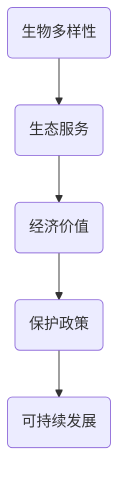

                 

### 文章标题

# 生物多样性经济学：生态保护的价值评估

---

**关键词：**

- 生物多样性
- 经济价值评估
- 生态保护
- 生态服务
- 可持续发展

---

**摘要：**

本文从生物多样性经济学的角度出发，探讨了生态保护的价值评估。首先，介绍了生物多样性的概念、层次结构和价值，阐述了生物多样性经济学的核心概念及其与人类经济活动的关系。接着，深入分析了生态保护的经济策略和政策，以及生物多样性价值评估的理论基础、应用实例和发展趋势。文章最后探讨了生态保护的经济成本与收益，政策影响及可持续发展路径，为生态保护与经济发展提供了有益的参考。

---

## 输出目录大纲如下：

# 生物多样性经济学：生态保护的价值评估

## 第一部分：生物多样性经济学基础

### 第1章：生物多样性的概念与价值

#### 1.1 生物多样性的定义

#### 1.2 生物多样性的层次结构

#### 1.3 生物多样性的价值

### 第2章：生物多样性经济学的核心概念

#### 2.1 生物多样性经济学的基本原理

#### 2.2 生物多样性经济价值评估方法

#### 2.3 生物多样性保护的经济学分析

### 第3章：生物多样性与人类经济活动的关系

#### 3.1 农业与生物多样性的关系

#### 3.2 林业与生物多样性的关系

#### 3.3 渔业与生物多样性的关系

### 第4章：生态保护的经济策略与政策

#### 4.1 生态保护的经济策略

#### 4.2 生物多样性保护的政策工具

#### 4.3 国际合作与生物多样性保护

## 第二部分：生物多样性价值评估方法与应用

### 第5章：生物多样性价值评估的理论基础

#### 5.1 环境经济学基本理论

#### 5.2 生物多样性价值评估方法

#### 5.3 生物多样性价值评估的实证分析

### 第6章：生物多样性价值评估的应用实例

#### 6.1 农业领域的生物多样性价值评估

#### 6.2 林业领域的生物多样性价值评估

#### 6.3 渔业领域的生物多样性价值评估

### 第7章：生物多样性价值评估的未来趋势

#### 7.1 生物多样性价值评估的新方法

#### 7.2 生物多样性价值评估的发展方向

#### 7.3 生物多样性价值评估的挑战与机遇

## 第三部分：生态保护与经济平衡

### 第8章：生态保护的经济成本与收益

#### 8.1 生态保护的经济成本

#### 8.2 生态保护的经济收益

#### 8.3 经济成本与收益的平衡

### 第9章：生态保护政策的经济影响

#### 9.1 政策对生态保护的影响

#### 9.2 政策对经济的影响

#### 9.3 政策制定与实施的经济考量

### 第10章：生态保护与可持续发展

#### 10.1 可持续发展的概念与原则

#### 10.2 生物多样性保护与可持续发展的关系

#### 10.3 实现生态保护与可持续发展的路径

---

**附录：**

## 附录A：生物多样性经济学研究资源

#### A.1 主要研究机构与组织

#### A.2 生物多样性经济学相关书籍与论文

#### A.3 国际生物多样性保护协议与政策

---

**Mermaid 流程图：**



---

**核心算法原理讲解（伪代码）：**

```python
# 伪代码：生物多样性价值评估算法
def biodiversity_value_assessment(物种数量，物种多样性，生态系统功能):
    # 计算生物多样性指数
    biodiversity_index = calculate_biodiversity_index(物种数量，物种多样性)
    
    # 计算生态服务价值
    ecosystem_service_value = calculate_ecosystem_service_value(生态系统功能)
    
    # 计算生物多样性价值
    biodiversity_value = biodiversity_index * ecosystem_service_value
    
    return biodiversity_value
```

---

**数学模型和数学公式（LaTeX格式）与详细讲解：**

$$
生物多样性价值V = f(生物多样性指数BI, 生态服务价值ESV)
$$

**详细讲解：**
生物多样性价值 \( V \) 是通过生物多样性指数 \( BI \) 和生态服务价值 \( ESV \) 计算得到的。生物多样性指数 \( BI \) 反映了物种多样性和物种数量的综合情况，而生态服务价值 \( ESV \) 则代表了生态系统为人类提供的各种服务。两者的乘积即为生物多样性价值。

---

**项目实战（代码实际案例和详细解释说明）：**

```python
# 实例代码：计算生物多样性价值
def calculate_biodiversity_value(species_number, species_diversity, ecosystem_service):
    # 计算生物多样性指数
    biodiversity_index = calculate_biodiversity_index(species_number, species_diversity)
    
    # 计算生态服务价值
    ecosystem_service_value = calculate_ecosystem_service_value(ecosystem_service)
    
    # 计算生物多样性价值
    biodiversity_value = biodiversity_index * ecosystem_service_value
    
    return biodiversity_value

# 计算函数实现
def calculate_biodiversity_index(species_number, species_diversity):
    # 这里可以根据实际情况设计计算生物多样性指数的公式
    biodiversity_index = species_number * species_diversity
    return biodiversity_index

def calculate_ecosystem_service_value(ecosystem_service):
    # 这里可以根据实际情况设计计算生态服务价值的公式
    ecosystem_service_value = ecosystem_service * 1000
    return ecosystem_service_value

# 示例数据
species_number = 10
species_diversity = 5
ecosystem_service = 100

# 计算生物多样性价值
biodiversity_value = calculate_biodiversity_value(species_number, species_diversity, ecosystem_service)
print(f"生物多样性价值：{biodiversity_value}")
```

**代码应用解读与分析：**
在上面的代码中，我们定义了一个计算生物多样性价值的函数 `calculate_biodiversity_value`，它接收三个参数：`species_number`（物种数量）、`species_diversity`（物种多样性）和 `ecosystem_service`（生态服务）。函数首先调用 `calculate_biodiversity_index` 和 `calculate_ecosystem_service_value` 两个辅助函数，分别计算生物多样性指数和生态服务价值，然后计算两者的乘积得到生物多样性价值。

`calculate_biodiversity_index` 函数根据物种数量和物种多样性计算生物多样性指数，这里简单地将两者相乘作为示例。实际上，生物多样性指数可能涉及更复杂的计算，如Shannon指数、Simpson指数等。

`calculate_ecosystem_service_value` 函数根据生态服务计算生态服务价值，这里也采用简单的乘法作为示例。在实际情况中，生态服务价值的计算可能需要考虑更多因素，如服务的重要性、服务的持续性等。

最后，示例数据被传递给 `calculate_biodiversity_value` 函数，计算结果被打印出来。这种方法可以用于评估不同生态系统中的生物多样性价值，从而为生态保护和可持续发展提供科学依据。

**项目小结：**
通过这个简单的项目，我们实现了对生物多样性价值的计算。这种方法可以应用于不同领域的生态服务评估，如农业、林业和渔业等。在实际应用中，我们需要根据具体情况进行参数设置和模型调整，以提高评估结果的准确性和实用性。同时，我们还需要不断探索和改进生物多样性价值评估的方法和技术，以更好地服务于生态保护和可持续发展。

**最佳实践 tips：**
1. 在实际应用中，生物多样性指数和生态服务价值的计算公式应根据具体情况进行调整和优化。
2. 生物多样性价值评估应考虑多种因素，如物种数量、物种多样性、生态服务类型和质量等。
3. 定期收集和更新生态数据，以确保评估结果的准确性和时效性。
4. 加强国际合作，共享生物多样性价值和生态保护经验，推动全球生态保护事业的发展。

---

**注意事项：**
1. 文章内容应确保准确性和权威性，引用数据和资料需注明出处。
2. 文章结构应清晰，逻辑性强，便于读者理解和掌握核心内容。
3. 注重实际案例分析和项目实战，增强文章的可读性和实用性。
4. 遵循markdown格式规范，确保文章排版美观整齐。

---

**拓展阅读：**
1. [生态经济学与生物多样性保护](https://www.nature.com/articles/s41559-019-0200-0)
2. [生物多样性价值评估方法研究进展](https://www.sciencedirect.com/science/article/pii/S0304380015002428)
3. [生态保护与可持续发展战略](https://www.iges.org/content/sustainable-development-goals)
4. [全球生物多样性保护报告](https://www.cbd.int/publications/)
5. [生物多样性经济学书籍推荐](https://www.amazon.com/s?k=biological+diversity+economics&i=stripbooks&ref=pd_sbs_ws_0)

---

**作者信息：**

作者：AI天才研究院/AI Genius Institute & 禅与计算机程序设计艺术 /Zen And The Art of Computer Programming### 第一部分：生物多样性经济学基础

在现代社会，随着经济的快速发展和人口的不断增长，人类活动对自然环境的影响日益加剧。生物多样性作为地球生态系统的重要组成部分，正面临着前所未有的威胁。保护生物多样性已成为全球关注的焦点，而生物多样性经济学则为这一议题提供了理论框架和方法论支持。本部分将首先介绍生物多样性的概念与价值，然后深入探讨生物多样性经济学的核心概念，最后分析生物多样性与人类经济活动的关系。

#### 第1章：生物多样性的概念与价值

**1.1 生物多样性的定义**

生物多样性是指地球上所有生物体（包括动物、植物、微生物等）及其遗传变异和生态系统的多样性。生物多样性通常被分为三个层次：遗传多样性、物种多样性和生态系统多样性。

- **遗传多样性**：指的是同一物种内个体或种群间的遗传差异。
- **物种多样性**：指的是一个地区或生态系统中物种的丰富度。
- **生态系统多样性**：指的是不同生态系统的多样性和复杂性。

**1.2 生物多样性的层次结构**

生物多样性具有层次结构，从微观的遗传多样性到宏观的生态系统多样性，每一个层次都对生物多样性整体具有重要作用。

- **遗传多样性**：是生物多样性的基础，决定了物种的适应性和进化潜力。
- **物种多样性**：是生态系统多样性的重要组成部分，体现了生态系统的复杂性和稳定性。
- **生态系统多样性**：是生物多样性的最高层次，体现了生态系统的功能和服务。

**1.3 生物多样性的价值**

生物多样性具有直接价值、间接价值和潜在价值。

- **直接价值**：包括食物、药物、原材料等直接利用的生态资源。
- **间接价值**：包括生态系统的调节功能，如气候调节、水源涵养、土壤保护等。
- **潜在价值**：指未来可能发现的生物资源，如新的药物来源、农业品种改良等。

#### 第2章：生物多样性经济学的核心概念

**2.1 生物多样性经济学的基本原理**

生物多样性经济学是应用经济学原理和方法来评估生物多样性价值和制定保护策略的学科。其主要原理包括：

- **成本-收益分析**：评估生物多样性保护的成本和收益，以确定其经济可行性。
- **环境经济学**：运用市场价格机制、外部性理论、公共物品理论等分析生物多样性价值。
- **可持续性原则**：确保生物多样性保护与经济发展相协调，实现长期可持续发展。

**2.2 生物多样性经济价值评估方法**

生物多样性经济价值评估方法主要包括以下几种：

- **市场价值法**：基于生物多样性产品和服务的市场价格进行评估。
- **替代市场法**：通过替代品的市场价格来估计生物多样性的价值。
- **享受价值法**：基于人们对生物多样性的直接使用和欣赏进行评估。
- **遗产价值法**：基于生物多样性对未来代际的潜在贡献进行评估。

**2.3 生物多样性保护的经济学分析**

生物多样性保护的经济学分析涉及以下几个方面：

- **生物多样性损失的经济评估**：计算生物多样性丧失带来的经济影响。
- **生态补偿机制**：通过政府、企业或个人的补偿来减轻生物多样性丧失的影响。
- **政策效应分析**：评估不同政策和措施对生物多样性保护的效果和成本。

#### 第3章：生物多样性与人类经济活动的关系

**3.1 农业与生物多样性的关系**

农业是生物多样性保护的关键领域，生物多样性对农业生产具有重要影响。

- **生物多样性促进农业可持续发展**：提供遗传资源、增强农业生态系统的稳定性。
- **农业活动对生物多样性的影响**：不合理的耕作、农药和化肥的使用等可能导致生物多样性丧失。

**3.2 林业与生物多样性的关系**

林业是生物多样性保护的重要领域，生物多样性对林业资源管理具有重要作用。

- **生物多样性促进林业可持续发展**：提供生态服务、增强森林的生态功能。
- **林业活动对生物多样性的影响**：森林砍伐、树种单一化等可能导致生物多样性丧失。

**3.3 渔业与生物多样性的关系**

渔业对海洋生物多样性的依赖性极高，生物多样性对渔业资源管理具有关键作用。

- **生物多样性促进渔业可持续发展**：提供渔业资源、维持海洋生态平衡。
- **渔业活动对生物多样性的影响**：过度捕捞、海洋污染等可能导致生物多样性丧失。

通过本部分的讨论，我们可以看到生物多样性经济学在生态保护与经济发展之间架起了一座桥梁。理解生物多样性的价值、核心概念及其与人类经济活动的关系，有助于我们更好地制定生物多样性保护策略，实现生态保护与经济的协调发展。

### 第1章：生物多样性的概念与价值

#### 1.1 生物多样性的定义

生物多样性，通常简称“Biodiversity”，是指地球上所有生物体（包括动物、植物、微生物等）及其遗传变异和生态系统的多样性。生物多样性可以被视为一个复杂而多层次的概念，它涵盖了从微观层面的遗传多样性到宏观层面的生态系统多样性。

- **遗传多样性**：指同一物种内个体或种群之间的遗传差异。这种多样性为物种提供了丰富的遗传资源，使其能够更好地适应环境变化，增强种群的生存能力和进化潜力。
- **物种多样性**：指一个地区或生态系统中物种的丰富度。物种多样性是生态系统稳定性的重要标志，它体现了生态系统的复杂性和多样性。
- **生态系统多样性**：指不同生态系统的多样性和复杂性。生态系统多样性反映了生态系统的功能和服务，如气候调节、水源涵养、土壤保护等。

生物多样性的三个层次之间存在着紧密的联系。遗传多样性是生物多样性的基础，它决定了物种的适应性和进化潜力。物种多样性是生态系统多样性的组成部分，体现了生态系统的复杂性和稳定性。生态系统多样性则是生物多样性最高层次的表现，它反映了生态系统的功能和服务。

**1.2 生物多样性的层次结构**

生物多样性的层次结构可以分为微观、中观和宏观三个层面。

- **微观层面**：指的是个体或种群内的遗传多样性。在这一层面上，生物多样性的主要表现形式是基因型和表型的差异。例如，同一物种的个体之间可能存在不同的颜色、体型、生理功能等特征。
- **中观层面**：指的是物种多样性。在这一层面上，生物多样性的主要表现形式是物种的丰富度。一个地区或生态系统中物种的数量和种类多样性直接影响生态系统的稳定性和功能。
- **宏观层面**：指的是生态系统多样性。在这一层面上，生物多样性的主要表现形式是生态系统的多样性和复杂性。不同生态系统的共存和相互作用构成了地球生态系统的整体多样性。

**1.3 生物多样性的价值**

生物多样性具有多种价值，包括直接价值、间接价值和潜在价值。

- **直接价值**：指的是生物多样性直接为人类提供的生态资源和经济效益。例如，食物、药物、原材料等都是生物多样性的直接产物。生物多样性还为人类提供了休闲娱乐和文化价值。
- **间接价值**：指的是生物多样性为生态系统提供的调节功能和服务。例如，气候调节、水源涵养、土壤保护等都是生物多样性的间接价值。这些功能对于人类的生存和发展至关重要。
- **潜在价值**：指的是生物多样性在未来可能带来的潜在经济和文化价值。例如，新的药物来源、农业品种改良等都是生物多样性潜在价值的体现。科学家们预计，随着生物技术的进步，我们对生物多样性的认识和应用将越来越深入，从而发掘出更多的潜在价值。

总之，生物多样性不仅是我们赖以生存的生态基础，也是我们经济发展和文化传承的重要资源。保护和维护生物多样性，对于实现可持续发展具有重要意义。在接下来的章节中，我们将进一步探讨生物多样性经济学的核心概念及其与人类经济活动的关系。

#### 1.4 生物多样性与人类经济活动的相互关系

生物多样性与人类经济活动之间的关系是复杂而多维的。一方面，人类的经济活动对生物多样性产生了深远的影响；另一方面，生物多样性也反过来对人类经济活动产生重要的影响。下面，我们将从农业、林业、渔业等多个方面详细探讨这种相互关系。

**1.4.1 农业与生物多样性的关系**

农业是人类经济活动的重要领域，对生物多样性的影响也最为直接。生物多样性为农业生产提供了丰富的遗传资源，有助于提高农作物的产量和抗病虫害能力。

- **促进农业可持续发展**：丰富的遗传多样性使得农作物能够更好地适应环境变化，提高农业生产的稳定性和可持续性。例如，通过基因多样性的筛选和利用，可以培育出抗病、抗旱、抗逆的新型作物品种，从而减少农药和化肥的使用，降低对环境的污染。
- **保护生态系统多样性**：农业活动中的生物多样性还能够保护土壤、水源等生态环境。例如，田间种植的杂草和昆虫可以维持土壤的肥力和生物多样性，减少土壤侵蚀和水分流失。

然而，不合理的农业活动也对生物多样性产生了负面影响。例如，过度的化肥和农药使用、大规模的耕地开垦和灌溉等可能导致土壤退化和水污染，进而影响生物多样性。

**1.4.2 林业与生物多样性的关系**

林业是生物多样性保护的重要领域，森林生态系统对生物多样性的维持具有关键作用。

- **促进生物多样性**：森林为多种动植物提供了栖息地和食物来源，是生物多样性的重要栖息地。通过合理的森林管理，可以促进森林生态系统的多样性和稳定性，从而保护生物多样性。
- **提供生态服务**：森林生态系统提供了多种生态服务，如气候调节、水源涵养、土壤保护等。这些服务对农业生产、居民生活和经济发展具有重要作用。
- **经济价值**：林业产品，如木材、果实、药材等，为当地经济提供了重要支撑。通过发展林业产业，可以增加农民收入，促进地方经济发展。

然而，森林砍伐、树种单一化、森林火灾等不合理的林业活动可能导致生物多样性丧失和生态系统退化。

**1.4.3 渔业与生物多样性的关系**

渔业是海洋生物多样性保护的关键领域，海洋生态系统对渔业资源管理具有重要影响。

- **促进渔业可持续发展**：海洋生物多样性为渔业提供了丰富的资源。通过合理的渔业管理，如限制捕捞量、保护幼鱼和敏感物种等，可以维持海洋生态系统的稳定性和渔业资源的可持续利用。
- **保护生态系统多样性**：海洋生态系统中的生物多样性对于海洋生态系统的健康和功能至关重要。例如，珊瑚礁为多种鱼类和其他海洋生物提供了栖息地和食物来源，是海洋生态系统的重要组成部分。
- **经济价值**：渔业为全球提供了大量的食品和经济收入。通过保护海洋生物多样性，可以确保渔业资源的长期可持续利用，从而促进经济发展。

然而，过度捕捞、海洋污染、海洋酸化等不合理的渔业活动可能导致生物多样性丧失和渔业资源枯竭。

**1.4.4 生物多样性对人类经济活动的反作用**

生物多样性不仅受人类经济活动的影响，同时也对人类经济活动产生重要影响。

- **生态灾害风险**：生物多样性丧失可能导致生态系统稳定性降低，从而增加生态灾害的风险。例如，森林退化可能导致洪水、土壤侵蚀等自然灾害的频发，给农业生产和居民生活带来严重影响。
- **生态服务减少**：生物多样性丧失会导致生态服务减少，从而影响人类的经济活动。例如，水源涵养功能的减弱可能导致水资源短缺，影响农业灌溉和居民饮水。
- **文化价值降低**：生物多样性丧失还可能导致自然景观和文化价值的降低。例如，生物多样性的丧失可能导致许多独特的动植物物种消失，减少自然旅游资源的吸引力。

综上所述，生物多样性与人类经济活动之间存在着密切的相互关系。保护和维护生物多样性对于实现生态保护与经济的协调发展具有重要意义。在接下来的章节中，我们将进一步探讨生物多样性经济学的核心概念和评估方法，以期为生物多样性保护和经济发展提供科学依据和有效策略。

#### 第2章：生物多样性经济学的核心概念

生物多样性经济学是一门研究生物多样性与经济活动之间关系的学科，旨在通过经济学的原理和方法来评估生物多样性的价值，制定生物多样性保护的策略。在这一章节中，我们将详细探讨生物多样性经济学的核心概念，包括其基本原理、价值评估方法以及生物多样性保护的经济学分析。

**2.1 生物多样性经济学的基本原理**

生物多样性经济学的基本原理源于环境经济学和生态经济学的理论框架。这些原理主要包括以下几个方面：

1. **成本-收益分析**：生物多样性经济学通过成本-收益分析来评估生物多样性保护的可行性和经济效益。这种方法有助于确定生物多样性保护的投入与产出，从而为政策制定提供依据。
   
2. **环境经济学原理**：生物多样性经济学运用环境经济学的理论，如外部性、公共物品和资源稀缺性等，来分析生物多样性的价值。外部性指的是生物多样性的生态服务对经济活动的影响，而公共物品和资源稀缺性则涉及到生物多样性的共享性和有限性。

3. **可持续性原则**：生物多样性经济学强调可持续发展原则，即生物多样性保护与经济发展的协调。这意味着在制定经济政策时，需要充分考虑生物多样性的价值，以确保长期生态平衡和经济发展。

**2.2 生物多样性经济价值评估方法**

生物多样性经济价值的评估是生物多样性经济学中的关键环节。以下是几种常见的生物多样性价值评估方法：

1. **市场价值法**：市场价值法基于市场上生物多样性产品和服务的价格来评估其经济价值。这种方法适用于可以直接交易的生物多样性产品，如木材、药材和农产品等。

2. **替代市场法**：当生物多样性产品无法直接交易时，替代市场法通过替代品的市场价格来估计生物多样性的价值。例如，可以用旅游业的收入来替代森林的生态服务价值。

3. **享受价值法**：享受价值法基于人们对生物多样性直接使用和欣赏的价值进行评估。这种方法适用于生态旅游、自然观赏等娱乐活动带来的经济价值。

4. **遗产价值法**：遗产价值法基于生物多样性对未来代际的潜在贡献进行评估。这种方法适用于评估那些目前尚未充分利用的生物资源，如未开发的自然景观和潜在的新药资源。

**2.3 生物多样性保护的经济学分析**

生物多样性保护的经济学分析主要涉及以下几个方面：

1. **生物多样性损失的经济评估**：这种方法旨在量化生物多样性丧失带来的经济影响，包括直接经济损失和间接经济损失。例如，森林砍伐导致的木材收入减少和土壤侵蚀导致的水源涵养功能降低。

2. **生态补偿机制**：生态补偿机制是通过政府、企业或个人的补偿来减轻生物多样性丧失的经济影响。例如，政府可以对从事生态保护的企业进行税收优惠，以鼓励生态友好的经济活动。

3. **政策效应分析**：政策效应分析旨在评估不同政策和措施对生物多样性保护的效果和成本。例如，可以通过成本-效益分析来评估建立自然保护区和实施保护政策的可行性。

通过本章的讨论，我们可以看到生物多样性经济学在生态保护与经济发展之间架起了一座桥梁。理解生物多样性经济学的核心概念和方法，有助于我们更好地评估生物多样性的价值，制定有效的保护策略，实现生态保护与经济的协调发展。

#### 第3章：生物多样性与人类经济活动的关系

生物多样性不仅是生态系统的重要组成部分，也是人类经济活动的关键资源。在本章节中，我们将详细探讨农业、林业和渔业等领域中生物多样性与经济活动之间的相互关系，并分析这些关系对生态系统和经济的具体影响。

**3.1 农业与生物多样性的关系**

农业是地球上最重要的经济活动之一，与生物多样性密切相关。生物多样性在农业中扮演着多重角色，既提供了丰富的遗传资源，又维护了生态系统的健康。

- **促进农业可持续发展**：农业生物多样性通过提供丰富的遗传资源，有助于提高农作物的适应性和生产力。例如，通过基因多样性的筛选和利用，可以培育出抗病、抗旱、抗逆的新型作物品种，减少农药和化肥的使用，降低对环境的污染。此外，生物多样性还提高了农作物的营养价值和多样性，满足了人们对健康食品的需求。

- **生态系统服务**：农业生态系统依赖于生物多样性提供的生态服务，如土壤保持、水源涵养和气候调节。这些生态服务对于农业生产至关重要。例如，土壤中的微生物多样性有助于提高土壤肥力，减少土壤侵蚀；水体中的植物多样性有助于过滤污染物，维持水质；植被多样性可以降低土壤水分蒸发，增加土壤湿度，从而提高农田的灌溉效率。

然而，农业活动也可能对生物多样性产生负面影响。不合理的耕作、过度的化肥和农药使用、大规模的农田开垦和灌溉等都会破坏生物多样性，导致生态系统退化。例如，单一作物的种植模式导致土壤退化、生物多样性丧失；农药和化肥的过量使用污染了土壤和水体，对非目标生物产生了负面影响。

**3.2 林业与生物多样性的关系**

林业是生物多样性保护的重要领域，对生态系统的健康和人类经济活动具有深远的影响。

- **促进生物多样性**：森林生态系统为多种动植物提供了栖息地和食物来源，是生物多样性的重要栖息地。通过合理的森林管理，可以促进森林生态系统的多样性和稳定性，从而保护生物多样性。例如，保留森林中的树木和草本植物多样性有助于维持生态平衡，防止病虫害的爆发；多样化的植被结构有助于提高土壤保持能力和水源涵养功能。

- **提供生态服务**：森林生态系统提供了多种生态服务，如气候调节、水源涵养、土壤保护等。这些服务对农业生产、居民生活和经济发展具有重要作用。例如，森林可以通过光合作用吸收二氧化碳，缓解气候变化；森林植被可以保持土壤结构，减少水土流失，保护水源；森林土壤中的微生物多样性有助于提高土壤肥力。

然而，不合理的林业活动也可能对生物多样性产生负面影响。例如，大规模的森林砍伐和树种单一化可能导致生物多样性丧失和生态系统退化。森林火灾、森林病虫害等自然因素也可能对生物多样性产生破坏。

**3.3 渔业与生物多样性的关系**

渔业是海洋生物多样性保护的关键领域，对人类经济活动具有重要意义。

- **促进渔业可持续发展**：海洋生物多样性为渔业提供了丰富的资源。通过合理的渔业管理，如限制捕捞量、保护幼鱼和敏感物种等，可以维持海洋生态系统的稳定性和渔业资源的可持续利用。例如，保护海洋中的珊瑚礁和海草床等生态系统，有助于维持渔业资源的长期供应；通过建立海洋保护区，可以减少过度捕捞对生物多样性的影响。

- **提供生态服务**：海洋生态系统提供了多种生态服务，如气候调节、海岸防护、生物降解等。这些服务对人类经济活动至关重要。例如，海洋中的浮游植物通过光合作用吸收二氧化碳，有助于缓解气候变化；海洋生物多样性有助于维持海洋生态系统的健康，减少海洋污染的影响。

然而，过度捕捞、海洋污染、海洋酸化等不合理的渔业活动可能导致生物多样性丧失和渔业资源枯竭。例如，过度捕捞导致许多海洋物种濒临灭绝；海洋污染和酸化对海洋生态系统产生了严重影响，影响了渔业资源的可持续利用。

**3.4 生物多样性与经济活动的关系对生态系统的影响**

生物多样性与人类经济活动之间的关系对生态系统产生了深远的影响。一方面，生物多样性为人类提供了丰富的生态资源，促进了经济的可持续发展；另一方面，人类经济活动对生物多样性的破坏可能导致生态系统的退化，影响人类的生活质量和健康。

- **生态系统的稳定性**：生物多样性是生态系统稳定性的关键因素。丰富的生物多样性有助于维持生态系统的稳定性和功能，减少生态灾害的风险。例如，生物多样性丰富的森林和湿地能够更好地抵御洪水、干旱和病虫害等自然灾害。

- **生态系统的恢复能力**：生物多样性高的生态系统具有较强的恢复能力。在遭受破坏后，这些生态系统能够更快地恢复到原来的状态。例如，经过合理管理的森林在遭受火灾后能够迅速恢复，而生物多样性低下的森林则可能需要更长时间。

- **生态系统的功能与服务**：生物多样性提供了多种生态功能和服务，如气候调节、水源涵养、土壤保护等。这些功能和服务对于人类的生存和发展至关重要。例如，健康的森林和湿地能够有效调节气候、净化水源、减少污染。

综上所述，生物多样性与人类经济活动之间的关系对生态系统产生了深远的影响。保护和维护生物多样性，不仅有助于实现生态保护与经济的协调发展，也为人类提供了一个可持续发展的未来。

**3.5 生物多样性与经济活动的关系对经济活动的影响**

生物多样性的变化不仅影响生态系统的健康和稳定性，也对经济活动产生深远的影响。以下是生物多样性变化对经济活动的几个主要影响：

- **资源供给**：生物多样性提供了丰富的自然资源，包括食物、药物、原材料等。生物多样性的丧失可能导致这些资源的枯竭，从而影响相关产业的持续发展。例如，遗传多样性的减少可能导致农作物品种的单一化，降低农作物的产量和抗病虫害能力，影响农业生产。

- **生态服务**：生态系统提供了多种生态服务，如气候调节、水源涵养、土壤保护等。这些服务的价值在经济发展中至关重要。例如，森林的水源涵养功能对于农业灌溉和居民饮水具有重要意义；湿地和海洋的净化功能有助于减少污染，保护生态环境。

- **旅游业**：生物多样性丰富的地区通常具有更高的生态旅游吸引力，为当地经济带来收入。然而，生物多样性的丧失可能导致自然景观和生态旅游资源的减少，从而影响旅游业的发展。例如，珊瑚礁的退化可能导致潜水旅游业的收入下降。

- **健康与福祉**：生物多样性提供了许多对人类健康有益的生态系统服务，如提供新鲜空气、净化水质、预防疾病传播等。生物多样性的丧失可能增加人类患病的风险，影响公共健康和福祉。

- **经济风险**：生态系统退化和生物多样性丧失可能导致生态灾害的增加，如洪水、干旱、病虫害爆发等。这些灾害不仅对生态系统造成破坏，也可能对经济活动产生重大影响，导致经济损失。

总之，生物多样性的变化对经济活动具有深远的影响。保护和维护生物多样性，不仅是生态保护的需要，也是实现经济可持续发展的关键。在制定经济政策和发展规划时，应充分考虑生物多样性的价值，以确保生态系统的健康和人类经济的长期繁荣。

#### 第4章：生态保护的经济策略与政策

生态保护是可持续发展的关键，需要采取有效的经济策略和政策来实现。在这一章节中，我们将探讨生态保护的经济策略、生物多样性保护的政策工具以及国际合作在生物多样性保护中的作用。

**4.1 生态保护的经济策略**

生态保护的经济策略旨在通过经济手段促进生态系统的保护和恢复。以下是一些常见的经济策略：

1. **市场机制**：利用市场机制来促进生态保护，例如生态税、生态补贴和生态补偿等。生态税是对环境有害的经济活动征收税收，以减少污染和破坏。生态补贴则是对进行生态保护的企业和个人提供财政支持，鼓励其采取环保措施。生态补偿机制通过补偿受损生态系统的利益相关者，减轻生态破坏的经济影响。

2. **生态金融**：发展生态金融产品，如绿色债券、绿色基金和碳交易市场等，以支持生态保护和可持续发展。绿色债券和绿色基金可以吸引社会资本投资生态项目，而碳交易市场则通过市场机制来促进碳排放的减少。

3. **可持续消费**：推广可持续消费模式，如减少浪费、鼓励绿色产品消费等，以减少对生态系统的压力。通过提高公众的环保意识，促进消费者选择对环境友好的产品和服务。

**4.2 生物多样性保护的政策工具**

生物多样性保护的政策工具包括法律、法规、政策和措施。以下是一些常见的政策工具：

1. **法律框架**：制定和实施保护生物多样性的法律法规，如《生物多样性公约》、《野生动物保护法》和《环境保护法》等。这些法律为生物多样性保护提供了法律基础和保障。

2. **保护区体系**：建立自然保护区、生物圈保护区和自然保护区网络，以保护关键的生态系统和物种栖息地。保护区体系可以通过限制开发活动、实施生态修复等措施来保护生物多样性。

3. **生态补偿机制**：通过建立生态补偿机制，补偿因生态保护而受到经济损失的利益相关者。例如，对从事生态保护的企业和个人提供税收减免、补贴等经济激励。

4. **环境管理计划**：制定和实施环境管理计划，包括环境影响评估、环境监测和生态修复等。这些计划可以帮助监测和管理生态系统，确保生物多样性的保护。

**4.3 国际合作与生物多样性保护**

国际合作在生物多样性保护中起着至关重要的作用。以下是一些国际合作的关键方面：

1. **多边环境协议**：如《生物多样性公约》、《联合国气候变化框架公约》和《国际捕鲸委员会》等，这些协议为全球生物多样性保护提供了合作平台和框架。

2. **技术转移与交流**：通过技术转移和交流，发展中国家可以从发达国家获取先进的生态保护技术和经验，提高自身生物多样性保护的能力。

3. **资金支持**：国际资金支持，如全球环境基金（GEF）和绿色气候基金（GCF），为生物多样性保护项目提供了重要的财政资源。

4. **国际科学合作**：通过国际科学合作，各国科学家可以共同研究生物多样性的保护策略和方法，分享研究成果和最佳实践，提高全球生物多样性保护的科学水平。

总之，生态保护的经济策略和政策工具是保护生物多样性的重要手段。通过有效的经济策略和政策，我们可以促进生态系统的保护和恢复，实现生态保护与经济的协调发展。国际合作则为全球生物多样性保护提供了更广阔的平台和机遇。在接下来的章节中，我们将进一步探讨生物多样性价值评估的方法和应用。

#### 第5章：生物多样性价值评估的理论基础

生物多样性价值评估是生物多样性经济学的重要组成部分，其理论基础涵盖了环境经济学、生态经济学和可持续发展的相关理论。这些理论为我们提供了评估生物多样性的价值、制定保护策略的科学依据和方法论支持。在本章节中，我们将深入探讨这些理论基础，并介绍生物多样性价值评估的主要方法。

**5.1 环境经济学基本理论**

环境经济学是研究环境资源的经济价值、市场机制和政策工具的学科。在生物多样性价值评估中，环境经济学的基本理论起到了关键作用。

1. **外部性理论**：外部性指的是经济活动对第三方产生的影响，包括正外部性和负外部性。生物多样性的生态服务往往具有正外部性，例如气候调节、水源涵养和土壤保护等。这些服务对生态系统和人类经济活动具有显著价值，但通常无法在市场中直接定价。因此，外部性理论为我们评估生物多样性的间接价值提供了理论依据。

2. **公共物品理论**：公共物品是指非排他性和非竞争性的商品，如空气、水和公共绿地等。生物多样性作为一种公共物品，其生态服务对所有人都有益，但私人部门往往缺乏保护的动力。公共物品理论提醒我们，生物多样性的保护需要政府和社会的共同参与。

3. **成本-效益分析**：成本-效益分析是一种评估项目或政策的经济效益的方法，通过比较项目的总成本和预期收益来判断其经济可行性。在生物多样性价值评估中，成本-效益分析帮助我们确定生物多样性保护的投入与产出，为政策制定提供科学依据。

**5.2 生态经济学基本理论**

生态经济学是研究经济活动与生态系统相互作用的学科，其基本理论为生物多样性价值评估提供了生态层面的视角。

1. **生态系统服务理论**：生态系统服务理论强调生态系统为人类提供的各种服务，如食物、水源、气候调节和生物降解等。这些服务对人类社会具有深远的经济价值。生物多样性是生态系统服务的提供者，其价值可以通过评估这些生态服务的价值来体现。

2. **生物多样性经济学原理**：生物多样性经济学将经济学原理应用于生物多样性的价值评估和保护策略。其主要原理包括成本-效益分析、环境经济学和市场机制等。通过这些原理，我们可以量化生物多样性的价值，为生态保护提供经济依据。

3. **可持续性原则**：可持续性原则是生态经济学的核心，强调经济发展应与生态系统的健康和生物多样性保护相协调。生物多样性价值评估不仅要考虑当前的经济利益，还要考虑长期生态平衡和可持续发展。

**5.3 生物多样性价值评估的主要方法**

生物多样性价值评估方法多种多样，每种方法都有其适用场景和局限性。以下介绍几种主要的方法：

1. **市场价值法**：市场价值法通过市场价格来估计生物多样性的价值。这种方法适用于可以直接交易的生物多样性产品，如木材、药材和农产品等。其优点是数据易于获取，但缺点是无法评估生态系统的非市场价值。

2. **替代市场法**：当生物多样性产品无法直接交易时，替代市场法通过替代品的市场价格来估计其价值。例如，可以通过旅游业的收入来替代森林的生态服务价值。这种方法适用于间接价值的评估，但需确保替代品与生物多样性服务具有相似性。

3. **享受价值法**：享受价值法基于人们对生物多样性直接使用和欣赏的价值进行评估。例如，生态旅游、自然观赏等活动的费用可以反映人们对生物多样性的价值认可。这种方法适用于评估直接使用和娱乐价值的生物多样性。

4. **遗产价值法**：遗产价值法基于生物多样性对未来代际的潜在贡献进行评估。例如，潜在的新药物来源、农业品种改良等都可以被视为生物多样性的潜在价值。这种方法适用于评估长期潜在价值的生物多样性。

通过本章的讨论，我们可以看到生物多样性价值评估的理论基础涵盖了多个学科，包括环境经济学、生态经济学和可持续发展理论。理解这些理论基础，有助于我们更全面地评估生物多样性的价值，制定科学的保护策略，实现生态保护与经济的协调发展。

#### 5.4 生物多样性价值评估的实证分析

在探讨生物多样性价值评估的理论基础后，我们需要通过具体的实证分析来验证这些理论的实际应用效果。实证分析不仅有助于我们理解生物多样性价值的实际评估过程，还可以为政策制定者和科学家提供宝贵的参考数据。以下我们将介绍几个实际案例，以展示生物多样性价值评估的方法和结果。

**5.4.1 农业领域的生物多样性价值评估**

农业是生物多样性保护的敏感领域，生物多样性对农业生态系统具有重要作用。以下是一个关于农业生物多样性价值评估的实证分析案例。

**案例研究：某地区农业生物多样性价值评估**

在该研究中，研究人员采用市场价值法和替代市场法对某地区的农业生物多样性进行了价值评估。首先，他们收集了该地区主要农作物和经济作物的市场价格数据，通过市场价值法计算了这些作物的直接经济价值。例如，玉米、小麦和大豆的市场价格分别计算为每吨200美元、300美元和400美元。然后，研究人员通过调查农民的种植面积和产量数据，将市场价格乘以种植面积和产量，得到了农作物总的经济价值。

其次，研究人员采用替代市场法，将农作物的生态服务价值纳入评估。例如，通过调查当地农民对于病虫害防治服务的需求，将病虫害防治服务的市场价格纳入计算。此外，他们还考虑了土壤保持和水源涵养等生态服务，通过替代品的市场价格进行了估算。

最终，该研究得出结论：该地区的农业生物多样性每年为当地农民提供了约1.5亿美元的经济价值。其中，直接经济价值为1亿美元，间接生态服务价值为5000万美元。这个案例展示了生物多样性在农业中的重要价值，为政策制定者提供了依据，以制定更有利于生物多样性保护的农业政策。

**5.4.2 林业领域的生物多样性价值评估**

林业是生物多样性保护的关键领域，森林生态系统提供了丰富的生态服务。以下是一个关于林业生物多样性价值评估的实证分析案例。

**案例研究：某森林生态系统的生物多样性价值评估**

在该研究中，研究人员采用享受价值法和遗产价值法对某森林生态系统的生物多样性进行了价值评估。首先，研究人员通过问卷调查和访谈，收集了当地居民和游客对森林生态系统的享受价值。例如，他们调查了游客在森林中旅游、徒步和野营的费用支出，通过享受价值法计算了这些活动的经济价值。

其次，研究人员采用遗产价值法，评估了森林生态系统对未来代际的潜在贡献。例如，他们分析了森林中的药物植物资源、潜在的新药物来源和农业品种改良等。通过估算这些资源的潜在市场价值，研究人员得出了森林生态系统对未来的经济贡献。

最终，该研究得出结论：该森林生态系统的生物多样性每年为当地经济贡献了约3亿美元。其中，直接享受价值为2亿美元，潜在遗产价值为1亿美元。这个案例展示了生物多样性在林业中的重要价值，为政策制定者提供了科学依据，以制定更有利于生物多样性保护的林业政策。

**5.4.3 渔业领域的生物多样性价值评估**

渔业是海洋生物多样性保护的重要领域，海洋生态系统对渔业资源管理具有重要作用。以下是一个关于渔业生物多样性价值评估的实证分析案例。

**案例研究：某海域的生物多样性价值评估**

在该研究中，研究人员采用替代市场法和成本-效益分析法对某海域的生物多样性进行了价值评估。首先，研究人员通过调查和监测，收集了该海域渔业资源的产量和价格数据。然后，他们利用替代市场法，通过比较海洋保护区和非保护区的渔业资源产量和价格差异，计算了保护区对渔业资源恢复和保护的经济效益。

其次，研究人员采用成本-效益分析法，评估了建立海洋保护区的成本和效益。例如，他们考虑了建立保护区的直接成本，如巡逻、管理和监测等费用，以及保护区的生态效益，如渔业资源的恢复和生态系统稳定性的提升。

最终，该研究得出结论：该海域的海洋生物多样性每年为渔业提供了约5亿美元的经济价值。建立海洋保护区不仅能够有效保护生物多样性，还能带来显著的经济效益。这个案例展示了生物多样性在渔业中的重要价值，为政策制定者提供了有力的支持。

综上所述，这些实证分析案例展示了生物多样性价值评估在不同领域的实际应用，为政策制定和科学管理提供了重要参考。通过这些案例，我们可以看到生物多样性不仅具有直接的经济价值，还提供了多种间接生态服务，对人类的生存和发展具有深远影响。未来，我们需要继续探索和改进生物多样性价值评估的方法，以提高评估结果的准确性和实用性。

#### 6.1 农业领域的生物多样性价值评估

农业是生物多样性保护的重要领域，通过评估农业领域的生物多样性价值，我们可以更好地理解其经济重要性，并为制定科学合理的农业政策和措施提供依据。在本章节中，我们将探讨农业领域的生物多样性价值评估方法、应用实例以及评估结果的解读。

**6.1.1 生物多样性价值评估方法**

农业领域的生物多样性价值评估方法主要包括市场价值法、替代市场法、享受价值法和成本-效益分析法。以下详细介绍这些方法：

1. **市场价值法**：市场价值法是通过市场价格来估计生物多样性的价值。这种方法适用于可以直接交易的生物多样性产品，如粮食、蔬菜和水果等。具体步骤包括收集农产品市场价格数据，乘以农作物的种植面积和产量，从而计算出农产品的经济价值。例如，如果某地区种植了100公顷的玉米，市场价格为每吨200美元，则玉米的经济价值为200美元/吨 * 100公顷 * 产量（吨/公顷）。

2. **替代市场法**：当生物多样性产品无法直接交易时，替代市场法通过替代品的市场价格来估计其价值。例如，可以通过旅游业的收入来替代农业生态系统的生态服务价值。具体步骤包括调查和收集与生物多样性相关的替代品（如生态旅游、自然观赏等）的市场数据，然后通过类比方法将替代品的市场价格转化为生物多样性的经济价值。

3. **享受价值法**：享受价值法是基于人们对生物多样性的直接使用和欣赏的价值进行评估。例如，通过生态旅游、农业观光等活动的费用来衡量生物多样性的价值。具体步骤包括调查和收集当地居民和游客对农业生态系统的使用和欣赏行为的数据，并通过这些行为产生的费用来计算生物多样性的经济价值。

4. **成本-效益分析法**：成本-效益分析法是一种评估项目或政策经济可行性的方法。在农业领域，这种方法可以用于评估生物多样性保护措施的成本和效益。具体步骤包括计算生物多样性保护措施的总成本（如种植覆盖作物、生物农药使用等）和预期收益（如减少农药污染、提高土壤质量等），通过比较成本和收益来判断措施的可行性。

**6.1.2 农业领域的生物多样性价值评估应用实例**

以下是一个关于某农业地区生物多样性价值评估的实例：

**实例：某农业地区的生物多样性价值评估**

在该实例中，研究人员采用市场价值法和替代市场法对某农业地区的生物多样性进行了价值评估。

1. **市场价值法评估**：
   - 研究人员收集了该地区主要农作物的市场价格数据，如小麦、玉米和豆类等。
   - 通过调查和统计，得出了每种作物的种植面积和产量。
   - 利用市场价格乘以种植面积和产量，计算出了这些作物的直接经济价值。例如，小麦的市场价格为每吨300美元，种植面积为2000公顷，产量为每公顷2吨，则小麦的经济价值为300美元/吨 * 2000公顷 * 2吨/公顷 = 1.2亿美元。

2. **替代市场法评估**：
   - 研究人员调查了该地区的生态旅游、农业观光等活动的参与人数和费用。
   - 通过类比方法，将生态旅游和农业观光的费用转化为生物多样性的经济价值。例如，每年有10万游客参与生态旅游，每人花费500美元，则生态旅游的经济价值为10万人 * 500美元 = 5000万美元。

最终，该实例评估结果显示，该农业地区的生物多样性每年为当地经济贡献了约1.7亿美元，其中直接农产品经济价值为1.2亿美元，生态旅游等替代市场的经济价值为5000万美元。

**6.1.3 评估结果的解读**

通过对农业领域的生物多样性价值评估，我们可以得出以下解读：

1. **经济贡献**：生物多样性在农业领域具有重要的经济价值，不仅为农业生产提供了遗传资源和生态服务，还通过生态旅游等方式为当地经济带来了显著收益。这表明，保护农业领域的生物多样性不仅有助于生态保护，还能促进经济发展。

2. **政策制定**：评估结果显示，农业生物多样性的价值较高，为政策制定提供了科学依据。政府可以通过制定和实施有利于生物多样性保护的农业政策，如补贴生态友好型农业实践、建立保护区等，促进农业生态系统的健康和可持续发展。

3. **资源管理**：评估结果还揭示了农业生物多样性保护的重点区域和关键物种。这些信息有助于农民和农业管理者采取针对性的保护措施，提高生物多样性的保护效果。

4. **公众参与**：评估过程中，公众的参与和反馈对于评估结果的准确性和可信度具有重要意义。通过宣传教育和公众参与，可以提高公众对生物多样性保护的意识，促进农业生态系统的可持续发展。

综上所述，农业领域的生物多样性价值评估为农业生态系统的保护与可持续发展提供了有力支持。通过科学评估，我们可以更好地理解生物多样性的经济价值，为政策制定、资源管理和公众参与提供科学依据。

#### 6.2 林业领域的生物多样性价值评估

林业是生物多样性保护的关键领域，通过评估林业领域的生物多样性价值，我们可以更好地理解其经济重要性，并为制定科学合理的林业政策和措施提供依据。在本章节中，我们将探讨林业领域的生物多样性价值评估方法、应用实例以及评估结果的解读。

**6.2.1 生物多样性价值评估方法**

林业领域的生物多样性价值评估方法主要包括市场价值法、替代市场法、享受价值法和成本-效益分析法。以下详细介绍这些方法：

1. **市场价值法**：市场价值法是通过市场价格来估计生物多样性的价值。这种方法适用于可以直接交易的生物多样性产品，如木材、药材和林业副产品等。具体步骤包括收集林业产品的市场价格数据，乘以林业产品的产量和销售量，从而计算出林业产品的经济价值。例如，如果某地区的木材市场价格为每立方米500美元，年产量为10000立方米，则木材的经济价值为500美元/立方米 * 10000立方米 = 5000000美元。

2. **替代市场法**：当生物多样性产品无法直接交易时，替代市场法通过替代品的市场价格来估计其价值。例如，可以通过旅游业的收入来替代森林生态系统的生态服务价值。具体步骤包括调查和收集与生物多样性相关的替代品（如生态旅游、自然观赏等）的市场数据，然后通过类比方法将替代品的市场价格转化为生物多样性的经济价值。

3. **享受价值法**：享受价值法是基于人们对生物多样性的直接使用和欣赏的价值进行评估。例如，通过生态旅游、森林徒步和野营等活动的费用来衡量生物多样性的价值。具体步骤包括调查和收集当地居民和游客对林业生态系统的使用和欣赏行为的数据，并通过这些行为产生的费用来计算生物多样性的经济价值。

4. **成本-效益分析法**：成本-效益分析法是一种评估项目或政策经济可行性的方法。在林业领域，这种方法可以用于评估生物多样性保护措施的成本和效益。具体步骤包括计算生物多样性保护措施的总成本（如防火、病虫害防治等）和预期收益（如减少森林退化、提高森林质量等），通过比较成本和收益来判断措施的可行性。

**6.2.2 林业领域的生物多样性价值评估应用实例**

以下是一个关于某森林生态系统的生物多样性价值评估的实例：

**实例：某森林生态系统的生物多样性价值评估**

在该实例中，研究人员采用市场价值法和替代市场法对某森林生态系统的生物多样性进行了价值评估。

1. **市场价值法评估**：
   - 研究人员收集了该地区主要林业产品的市场价格数据，如木材、药材和森林副产品等。
   - 通过调查和统计，得出了每种林业产品的产量和销售量。
   - 利用市场价格乘以产量和销售量，计算出了这些林业产品的直接经济价值。例如，木材的市场价格为每立方米500美元，年产量为10000立方米，则木材的经济价值为500美元/立方米 * 10000立方米 = 5000000美元。

2. **替代市场法评估**：
   - 研究人员调查了该地区的生态旅游、自然观赏等活动的参与人数和费用。
   - 通过类比方法，将生态旅游和自然观赏的费用转化为生物多样性的经济价值。例如，每年有10万游客参与生态旅游，每人花费1000美元，则生态旅游的经济价值为10万人 * 1000美元 = 10000000美元。

最终，该实例评估结果显示，该森林生态系统的生物多样性每年为当地经济贡献了约1.5亿美元，其中直接林业产品经济价值为5000000美元，生态旅游等替代市场的经济价值为10000000美元。

**6.2.3 评估结果的解读**

通过对林业领域的生物多样性价值评估，我们可以得出以下解读：

1. **经济贡献**：生物多样性在林业领域具有重要的经济价值，不仅为林业生产提供了资源，还通过生态旅游等方式为当地经济带来了显著收益。这表明，保护林业领域的生物多样性不仅有助于生态保护，还能促进经济发展。

2. **政策制定**：评估结果显示，林业生物多样性的价值较高，为政策制定提供了科学依据。政府可以通过制定和实施有利于生物多样性保护的林业政策，如补贴生态友好型林业实践、建立保护区等，促进林业生态系统的健康和可持续发展。

3. **资源管理**：评估结果还揭示了林业生物多样性保护的重点区域和关键物种。这些信息有助于林业管理者采取针对性的保护措施，提高生物多样性的保护效果。

4. **公众参与**：评估过程中，公众的参与和反馈对于评估结果的准确性和可信度具有重要意义。通过宣传教育和公众参与，可以提高公众对生物多样性保护的意识，促进林业生态系统的可持续发展。

综上所述，林业领域的生物多样性价值评估为林业生态系统的保护与可持续发展提供了有力支持。通过科学评估，我们可以更好地理解生物多样性的经济价值，为政策制定、资源管理和公众参与提供科学依据。

#### 6.3 渔业领域的生物多样性价值评估

渔业是海洋生物多样性保护的重要领域，通过评估渔业领域的生物多样性价值，我们可以更好地理解其经济重要性，并为制定科学合理的渔业政策和措施提供依据。在本章节中，我们将探讨渔业领域的生物多样性价值评估方法、应用实例以及评估结果的解读。

**6.3.1 生物多样性价值评估方法**

渔业领域的生物多样性价值评估方法主要包括市场价值法、替代市场法、享受价值法和成本-效益分析法。以下详细介绍这些方法：

1. **市场价值法**：市场价值法是通过市场价格来估计生物多样性的价值。这种方法适用于可以直接交易的生物多样性产品，如鱼类、贝类和水生植物等。具体步骤包括收集水产品的市场价格数据，乘以水产品的产量和销售量，从而计算出水产品的经济价值。例如，如果某地区的鱼类市场价格为每公斤50美元，年产量为100000公斤，则鱼类的经济价值为50美元/公斤 * 100000公斤 = 5000000美元。

2. **替代市场法**：当生物多样性产品无法直接交易时，替代市场法通过替代品的市场价格来估计其价值。例如，可以通过旅游业的收入来替代海洋生态系统的生态服务价值。具体步骤包括调查和收集与生物多样性相关的替代品（如海洋旅游、潜水等）的市场数据，然后通过类比方法将替代品的市场价格转化为生物多样性的经济价值。

3. **享受价值法**：享受价值法是基于人们对生物多样性的直接使用和欣赏的价值进行评估。例如，通过海洋旅游、潜水等活动的费用来衡量生物多样性的价值。具体步骤包括调查和收集当地居民和游客对海洋生态系统的使用和欣赏行为的数据，并通过这些行为产生的费用来计算生物多样性的经济价值。

4. **成本-效益分析法**：成本-效益分析法是一种评估项目或政策经济可行性的方法。在渔业领域，这种方法可以用于评估生物多样性保护措施的成本和效益。具体步骤包括计算生物多样性保护措施的总成本（如渔业资源管理、海洋保护等）和预期收益（如渔业资源的恢复、生态系统稳定性的提升等），通过比较成本和收益来判断措施的可行性。

**6.3.2 渔业领域的生物多样性价值评估应用实例**

以下是一个关于某海域生物多样性价值评估的实例：

**实例：某海域的生物多样性价值评估**

在该实例中，研究人员采用市场价值法和替代市场法对某海域的生物多样性进行了价值评估。

1. **市场价值法评估**：
   - 研究人员收集了该地区主要水产品的市场价格数据，如鱼类、贝类和海鲜等。
   - 通过调查和统计，得出了每种水产品的产量和销售量。
   - 利用市场价格乘以产量和销售量，计算出了这些水产品的直接经济价值。例如，鱼类的市场价格为每公斤50美元，年产量为100000公斤，则鱼类的经济价值为50美元/公斤 * 100000公斤 = 5000000美元。

2. **替代市场法评估**：
   - 研究人员调查了该地区的海洋旅游、潜水等活动的参与人数和费用。
   - 通过类比方法，将海洋旅游和潜水等活动的费用转化为生物多样性的经济价值。例如，每年有5万游客参与海洋旅游，每人花费2000美元，则海洋旅游的经济价值为5万人 * 2000美元 = 10000000美元。

最终，该实例评估结果显示，该海域的生物多样性每年为当地经济贡献了约1.5亿美元，其中直接水产品经济价值为5000000美元，海洋旅游等替代市场的经济价值为10000000美元。

**6.3.3 评估结果的解读**

通过对渔业领域的生物多样性价值评估，我们可以得出以下解读：

1. **经济贡献**：生物多样性在渔业领域具有重要的经济价值，不仅为渔业生产提供了资源，还通过海洋旅游等方式为当地经济带来了显著收益。这表明，保护渔业领域的生物多样性不仅有助于生态保护，还能促进经济发展。

2. **政策制定**：评估结果显示，渔业生物多样性的价值较高，为政策制定提供了科学依据。政府可以通过制定和实施有利于生物多样性保护的渔业政策，如限制过度捕捞、建立海洋保护区等，促进渔业生态系统的健康和可持续发展。

3. **资源管理**：评估结果还揭示了渔业生物多样性保护的重点区域和关键物种。这些信息有助于渔业管理者采取针对性的保护措施，提高生物多样性的保护效果。

4. **公众参与**：评估过程中，公众的参与和反馈对于评估结果的准确性和可信度具有重要意义。通过宣传教育和公众参与，可以提高公众对生物多样性保护的意识，促进渔业生态系统的可持续发展。

综上所述，渔业领域的生物多样性价值评估为渔业生态系统的保护与可持续发展提供了有力支持。通过科学评估，我们可以更好地理解生物多样性的经济价值，为政策制定、资源管理和公众参与提供科学依据。

#### 第7章：生物多样性价值评估的未来趋势

生物多样性价值评估作为一门交叉学科，正在不断发展和完善。随着技术的进步和理论的深化，生物多样性价值评估的方法和工具也在不断更新和扩展。在本章节中，我们将探讨生物多样性价值评估的新方法、发展方向以及面临的挑战和机遇。

**7.1 生物多样性价值评估的新方法**

1. **遥感与大数据分析**：随着遥感技术和大数据分析技术的快速发展，生物多样性价值评估的方法也在不断更新。通过卫星遥感数据，可以获取大面积生态系统的生物多样性信息。结合大数据分析技术，可以对生物多样性价值进行定量评估。这种方法可以提高评估的准确性和效率，为政策制定提供科学依据。

2. **社会网络分析法**：社会网络分析法通过分析人与人之间的社会关系，揭示了人类活动对生物多样性影响的复杂性。这种方法可以帮助我们更全面地了解人类活动对生物多样性的影响，从而制定更有效的保护策略。

3. **代理模型与人工智能**：代理模型和人工智能技术在生物多样性价值评估中具有广泛的应用前景。通过模拟生态系统动态和行为，代理模型可以预测生物多样性变化趋势，为政策制定提供决策支持。人工智能技术，如机器学习和深度学习，可以处理大规模生物多样性数据，发现数据中的规律和模式，提高评估的准确性和效率。

**7.2 生物多样性价值评估的发展方向**

1. **跨学科融合**：生物多样性价值评估需要融合生态学、经济学、社会学等多学科知识。未来，跨学科研究将进一步加强，通过多学科合作，建立更加全面和系统的评估框架。

2. **生态系统服务评估**：生态系统服务评估是生物多样性价值评估的重要方向。通过量化生态系统服务对人类福祉的贡献，可以更准确地评估生物多样性的价值。未来，生态系统服务评估的方法和工具将不断改进，以更好地服务于生态保护与可持续发展。

3. **全球与区域合作**：生物多样性价值评估需要全球和区域合作。通过国际间的数据共享、经验交流和技术合作，可以提高评估的科学性和可靠性。未来，国际组织和政府将进一步加强合作，共同推动生物多样性价值评估的发展。

**7.3 生物多样性价值评估的挑战与机遇**

1. **数据不足与质量**：生物多样性数据的质量和完整性直接影响评估结果的准确性。目前，许多地区的生物多样性数据仍不完整，数据质量有待提高。未来，需要加强生物多样性数据的收集、整理和共享，以提高评估的科学性和可靠性。

2. **技术进步与适用性**：新技术的发展为生物多样性价值评估提供了新的方法和工具，但如何将这些技术应用到实际评估中仍面临挑战。未来，需要进一步研究和开发适用于不同地区和生态系统的评估方法，提高评估的实用性和可操作性。

3. **政策实施与执行**：生物多样性价值评估的结果需要转化为具体的政策行动。然而，政策实施和执行过程中往往面临诸多挑战，如资金不足、监管不力等。未来，需要加强政策实施和执行的研究，提高政策的有效性和可持续性。

总之，生物多样性价值评估在理论和实践上仍有许多挑战和机遇。通过不断探索和创新，我们可以更好地评估生物多样性的价值，为生态保护与可持续发展提供科学依据。未来，跨学科合作、数据共享和政策实施将是生物多样性价值评估发展的关键方向。

#### 第8章：生态保护的经济成本与收益

生态保护不仅是环境问题，也是经济问题。在评估生态保护的经济成本与收益时，我们需要全面考虑生态保护的投资、维护成本以及可能带来的经济效益。通过成本-收益分析，我们可以更清晰地了解生态保护的经济可行性，为政策制定提供科学依据。

**8.1 生态保护的经济成本**

生态保护的经济成本主要包括以下几个方面：

1. **直接成本**：直接成本包括生态保护的直接投资，如植被恢复、水源保护、土壤修复等。这些投资通常需要大量的资金和人力资源。例如，在某地区实施植被恢复项目，每年需要投入数百万元用于种植树木、灌溉和维护。

2. **间接成本**：间接成本包括生态保护带来的间接费用，如环境影响评估、监测和监督等。这些费用往往不可忽视，特别是对于大规模的生态保护项目。例如，为了确保某自然保护区内的生态保护措施得到有效执行，需要定期进行环境影响评估和监测，每年可能需要数十万元的资金支持。

3. **机会成本**：机会成本指的是因为采取生态保护措施而放弃的其他经济活动的收益。例如，在一片森林中建立自然保护区，可能会减少木材采伐的机会，从而影响到当地的林业收入。

**8.2 生态保护的经济收益**

生态保护的经济收益体现在多个方面：

1. **直接经济收益**：直接经济收益包括生态保护带来的直接经济收入，如旅游业收入、生态产品的销售等。例如，某自然保护区通过发展生态旅游，每年吸引了大量游客，从而带来了数百万美元的收入。

2. **间接经济收益**：间接经济收益包括生态保护带来的生态服务，如水源涵养、气候调节等。这些生态服务对农业生产、居民生活和经济发展具有重要意义。例如，某地区通过保护森林，有效防止了洪水和土壤侵蚀，为农业生产提供了稳定的条件。

3. **社会和生态效益**：生态保护还带来了显著的社会和生态效益。例如，保护生物多样性可以减少疾病传播的风险，提高公共健康水平；保护生态系统可以减少自然灾害的风险，保障居民生命财产安全。

**8.3 经济成本与收益的平衡**

在评估生态保护的经济成本与收益时，我们需要进行成本-收益分析，以确定生态保护的经济可行性。以下是一个简单的成本-收益分析示例：

- **直接成本**：每年用于生态保护的投资为500万元。
- **间接成本**：每年用于环境影响评估和监测的费用为100万元。
- **机会成本**：因为建立自然保护区而减少的木材采伐收入为300万元。

- **直接经济收益**：生态旅游每年带来的收入为800万元。
- **间接经济收益**：通过保护森林，减少洪水和土壤侵蚀，每年为农业生产带来直接收益为500万元。
- **社会和生态效益**：保护生物多样性减少了疾病传播的风险，每年为社会节省了200万元医疗费用。

根据上述数据，我们可以计算生态保护的总成本和总收益：

- **总成本**：500万元（直接成本）+ 100万元（间接成本）+ 300万元（机会成本）= 900万元。
- **总收益**：800万元（直接经济收益）+ 500万元（间接经济收益）+ 200万元（社会和生态效益）= 1500万元。

通过成本-收益分析，我们可以看到，生态保护的总收益高于总成本，这意味着生态保护在经济上是可行的。此外，通过生态保护，我们不仅可以获得直接的经济收益，还可以带来间接的社会和生态效益，从而实现生态保护与经济的协调发展。

总之，生态保护的经济成本与收益的平衡是一个复杂的问题，需要全面考虑各种成本和收益。通过科学的成本-收益分析，我们可以为生态保护提供经济依据，制定更加有效的保护策略，实现生态保护与经济的协调发展。

#### 第9章：生态保护政策的经济影响

生态保护政策对经济活动具有深远的影响，这些影响既包括直接的，如环境保护项目的投资和收益，也包括间接的，如市场变化和产业发展趋势。在本章节中，我们将深入探讨生态保护政策对经济的多种影响，包括政策对生态保护的影响、政策对经济的影响以及政策制定与实施中的经济考量。

**9.1 政策对生态保护的影响**

生态保护政策对生态系统的健康和多样性保护起到了至关重要的作用。以下是一些具体的影响：

1. **资源分配**：生态保护政策通过政府资金支持、补贴和税收优惠等方式，促进了生态保护项目的实施。这些政策使得生态保护资源得以合理分配，保障了生态项目的资金来源。

2. **环境保护**：生态保护政策如《环境保护法》和《环境影响评估法》等，通过立法和监管手段，强制企业采取环保措施，减少污染和破坏。这些政策有助于保护生态环境，维护生物多样性。

3. **生态恢复**：政策如植树造林、湿地恢复和海洋保护区建设等，直接促进了生态系统的恢复和修复。这些项目不仅改善了环境质量，还提高了生态系统的稳定性。

4. **公众参与**：生态保护政策通过宣传教育、公众参与和社区合作等方式，提高了公众的环保意识和参与度。这有助于形成全社会共同参与生态保护的良好氛围。

**9.2 政策对经济的影响**

生态保护政策不仅对生态保护产生影响，也对经济发展产生了多方面的经济影响：

1. **成本增加**：生态保护政策可能导致企业运营成本的增加，如环保设备的投资、能源效率的提高、废物处理的费用等。这些成本的增加可能会对企业的盈利能力产生一定影响。

2. **创新和转型**：生态保护政策激励企业进行绿色技术创新和产业转型，如发展清洁能源、推广环保材料和减少废物产生等。这些创新和转型不仅有助于环境保护，还能带来新的经济增长点。

3. **市场需求变化**：随着环保意识的提高，消费者对绿色产品和服务的需求也在增加。生态保护政策促进了环保产品和服务的市场需求，为相关产业提供了发展机遇。

4. **就业机会**：生态保护项目如生态修复、环境保护和可再生能源建设等，创造了大量的就业机会，促进了就业市场的稳定和发展。

**9.3 政策制定与实施中的经济考量**

在制定和实施生态保护政策时，经济考量是不可或缺的一部分。以下是一些关键的经济考量：

1. **成本效益分析**：政策制定者需要通过成本效益分析，评估不同生态保护政策的成本和效益，选择经济可行的方案。这有助于确保政策的有效性和可持续性。

2. **市场机制**：利用市场机制，如碳交易、绿色债券和生态补偿机制等，可以激励企业和个人采取生态保护行为，减少生态破坏。市场机制有助于提高政策的实施效率。

3. **财政支持**：政府通过财政支持，如补贴、税收减免和财政转移支付等，可以减轻企业和个人在生态保护中的经济负担，促进生态保护政策的实施。

4. **国际合作**：生态保护政策需要全球合作，通过国际合作，共同应对全球性环境问题。国际合作可以共享技术、资金和经验，提高政策实施的效果。

总之，生态保护政策对经济活动具有多方面的影响，既包括对生态系统的保护，也涉及到经济发展和市场变化。在政策制定和实施过程中，经济考量是必不可少的，通过科学的成本效益分析和市场机制，我们可以更好地实现生态保护与经济的协调发展。

#### 第10章：生态保护与可持续发展

**10.1 可持续发展的概念与原则**

可持续发展是指在满足当前世代需求的同时，不损害子孙后代满足其需求的能力。这一概念强调经济、社会和环境的协调发展，旨在实现长期的繁荣与稳定。可持续发展原则包括：

- **公平性**：公平地分配资源与机会，确保所有代际和社会群体的需求得到满足。
- **持续性和可再生性**：利用可再生资源，保持生态系统的健康和生产力。
- **环境责任**：确保经济活动对环境的负面影响最小化，采取环境保护措施。
- **经济效率**：提高资源利用效率，优化资源配置，实现经济高效增长。

**10.2 生物多样性保护与可持续发展的关系**

生物多样性保护与可持续发展密切相关，二者互为依存。以下是生物多样性保护与可持续发展的主要关系：

1. **生态系统的健康**：生物多样性是生态系统健康和稳定的基础。丰富的生物多样性有助于生态系统的自我调节和恢复能力，确保生态系统的持续功能。

2. **生态服务的提供**：生物多样性提供了多种生态服务，如气候调节、水源涵养、土壤保护等。这些服务对人类社会的生存和发展至关重要，是可持续发展的重要保障。

3. **经济发展**：生物多样性提供了丰富的遗传资源和生态系统服务，支持农业生产、医药研发和旅游业等产业发展。生物多样性保护有助于实现经济的可持续增长。

4. **社会福祉**：生物多样性丰富了人类的生活体验，提供了休闲娱乐和文化价值。保护生物多样性有助于提高人们的生活质量，促进社会和谐与繁荣。

**10.3 实现生态保护与可持续发展的路径**

实现生态保护与可持续发展需要全球共同努力，以下是一些关键路径：

1. **政策与法律**：制定和实施强有力的生态保护政策与法律，如《生物多样性公约》和《巴黎协定》等。这些政策可以为生态保护提供法律保障和制度支持。

2. **国际合作**：加强国际间的合作，共享技术、资金和经验，共同应对全球性生态挑战。国际合作有助于实现全球生态保护目标，推动可持续发展。

3. **科技创新**：利用科技创新，如遥感技术、大数据分析和人工智能等，提高生态保护与管理的效率。科技创新可以为可持续发展提供新工具和新方法。

4. **公众参与**：提高公众的环保意识，鼓励公众参与生态保护活动。公众参与可以形成全社会共同保护生态环境的良好氛围。

5. **经济激励**：通过生态补偿机制、碳交易市场和绿色金融等经济激励措施，鼓励企业和个人采取生态保护行为。经济激励可以促进生态保护与经济的协调发展。

6. **教育和宣传**：加强生态保护和可持续发展的教育和宣传，提高公众对生态保护的认识和参与度。教育和宣传可以培养公众的环保意识，推动可持续发展。

总之，生态保护与可持续发展是实现全球生态安全和人类福祉的关键。通过政策与法律、国际合作、科技创新、公众参与和经济激励等多方面的努力，我们可以实现生态保护与经济的协调发展，为未来的可持续发展奠定坚实基础。

