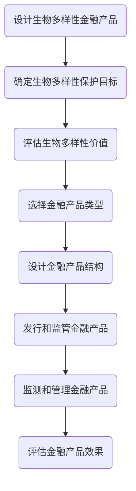

                 


## 第1章：生物多样性与金融的关系

### 1.1 生物多样性的重要性

生物多样性是指地球上所有生物种类的多样性，包括植物、动物、微生物以及它们所构成的生态系统。生物多样性对人类生存和可持续发展具有不可替代的重要作用。首先，生物多样性是地球上所有生命形式的基础，它提供了人类所需的食物、药物、燃料和其他自然资源。其次，生物多样性对于维持生态平衡至关重要。例如，森林能够吸收二氧化碳，净化空气；湿地可以过滤水源，防止洪水；珊瑚礁则能够为海洋生物提供栖息地。

### 1.2 生态保护与金融市场的结合

随着全球环境问题的日益严重，生态保护已经引起了全球各界的关注。传统的生态保护手段往往依赖于政府和非政府组织的资金支持，这种方式存在资金有限、效率低下的问题。而金融市场作为一种高效的资源配置方式，可以为生态保护提供新的解决方案。生物多样性金融产品正是这种结合的产物。

生物多样性金融产品是指将生物多样性保护与金融工具相结合的创新产品。通过将生物多样性价值量化为金融资产，投资者可以通过金融市场参与生态保护。这种产品主要包括生物多样性债券、生态保护基金等。生物多样性金融产品的设计原则是确保资金的有效利用，通过市场化手段推动生态保护。

### 1.3 生物多样性金融产品的类型与特点

#### 1.3.1 生物多样性债券

生物多样性债券是一种特殊的社会责任债券，发行者承诺将债券收入用于生物多样性保护和恢复项目。这种债券通常具有固定的利率和到期日，投资者可以通过购买这种债券来支持生态保护。

#### 1.3.2 生态保护基金

生态保护基金是一种集合了多个投资者资金的金融产品，用于投资于生态保护项目。投资者通过购买基金份额，可以获得基金所投资项目的收益。生态保护基金通常由专业团队管理，确保资金的有效利用。

#### 1.3.3 生物碳信用

生物碳信用是一种基于碳汇项目的金融工具，它允许企业或个人通过投资或购买碳信用来抵消其碳排放。这种方式不仅有助于减少温室气体排放，还可以推动生物多样性保护。

### 1.4 生态保护市场化方案的背景

生态保护市场化方案的出现，主要是由于以下几个背景因素：

1. **环境问题的严峻性**：全球气候变化、生物多样性丧失等问题日益严重，需要更多的资金和资源来应对。

2. **市场机制的潜力**：金融市场作为一种高效的资源配置方式，可以更有效地将资金引导到生态保护领域。

3. **政策推动**：许多国家和地区已经开始制定相关政策，鼓励和规范生态保护市场化方案的发展。

4. **技术创新**：大数据、区块链等新兴技术的应用，为生态保护市场化方案提供了新的工具和方法。

综上所述，生物多样性金融产品作为一种生态保护的市场化方案，具有广阔的发展前景和巨大的潜力。通过合理设计和实施，这些产品可以有效地推动生态保护，实现经济效益和环境效益的双赢。

### Mermaid 流程图：生物多样性金融产品设计与实施流程



### 伪代码：生物多样性价值评估算法

```python
def biodiversity_value-assessment(land_area, species_list):
    biodiversity_score = 0
    for species in species_list:
        biodiversity_score += species_abundance[species] * species_weight[species]
    return biodiversity_score

# 示例数据
land_area = 1000  # 平方千米
species_list = ['老虎', '大象', '猴子', '小鸟']
species_abundance = {'老虎': 10, '大象': 5, '猴子': 20, '小鸟': 100}
species_weight = {'老虎': 1.5, '大象': 1.2, '猴子': 1.0, '小鸟': 0.5}

# 计算生物多样性价值
biodiversity_value = biodiversity_value-assessment(land_area, species_list)
print("生物多样性价值:", biodiversity_value)
```

### 数学公式：生物多样性价值评估模型

$$
\text{Biodiversity Value} = \sum_{i=1}^{n} (\text{Abundance}_{i} \times \text{Weight}_{i})
$$

其中，$n$ 是物种数量，$\text{Abundance}_{i}$ 是第 $i$ 个物种的丰富度，$\text{Weight}_{i}$ 是第 $i$ 个物种的权重。

### 举例说明

假设我们有一片面积为 1000 平方千米的森林，其中包含以下物种及其丰富度和权重：

- 老虎：丰富度为 10，权重为 1.5
- 大象：丰富度为 5，权重为 1.2
- 猴子：丰富度为 20，权重为 1.0
- 小鸟：丰富度为 100，权重为 0.5

使用上述公式，我们可以计算这片森林的生物多样性价值：

$$
\text{Biodiversity Value} = (10 \times 1.5) + (5 \times 1.2) + (20 \times 1.0) + (100 \times 0.5) = 15 + 6 + 20 + 50 = 91
$$

因此，这片森林的生物多样性价值为 91。

## 第2章：生物多样性评价方法

### 2.1 生物多样性评估的指标体系

生物多样性评估是一个复杂的过程，需要使用一系列指标来全面衡量生物多样性的状况。这些指标可以分为三类：物种多样性、生态系统多样性和遗传多样性。

#### 2.1.1 物种多样性

物种多样性是生物多样性评估中最常用的指标之一，它反映了生态系统中物种的丰富度和物种之间的差异。物种多样性的评估通常使用以下几个指标：

- 物种丰富度（Species richness）：指一个区域内物种的总数。
- 物种均匀度（Species evenness）：指物种丰富度中不同物种分布的均匀程度。
- 物种多样性指数（Species diversity index）：综合了物种丰富度和物种均匀度，常用的多样性指数有香农指数（Shannon index）和辛普森指数（Simpson index）。

#### 2.1.2 生态系统多样性

生态系统多样性是指生态系统中不同生态类型的多样性和复杂性。它反映了生态系统的稳定性和功能多样性。生态系统多样性的评估指标包括：

- 生态类型丰富度（Eco-type richness）：指生态系统的类型数量。
- 生态空间多样性（Eco-space diversity）：指生态系统中不同生态空间的使用程度和分布情况。
- 功能多样性（Functional diversity）：指生态系统中不同物种在生态功能上的多样性。

#### 2.1.3 遗传多样性

遗传多样性是指物种内个体之间的遗传差异。它是生物多样性的基础，对物种的适应性和生存能力至关重要。遗传多样性的评估指标包括：

- 遗传多样性指数（Genetic diversity index）：通常使用遗传相似度（Genetic similarity）和遗传多样性指数（Genetic diversity index）来评估。
- 遗传结构（Genetic structure）：指物种内不同群体之间的遗传差异和分布情况。

### 2.2 生物多样性价值评估的方法

生物多样性价值评估是将生物多样性的生态价值转化为经济价值的过程，这对于生态保护和市场化的实现具有重要意义。以下是一些常用的生物多样性价值评估方法：

#### 2.2.1 市场价值法

市场价值法是通过市场交易价格来估算生物多样性的经济价值。这种方法适用于那些可以直接市场交易的生物资源和生态系统服务。例如，森林的木材价值、渔业的水产品价值等。

#### 2.2.2 替代成本法

替代成本法是通过计算替代生态系统的成本来估算生物多样性的价值。这种方法适用于那些难以直接市场交易的生物资源和生态系统服务。例如，通过计算保护一片森林所需的替代成本来评估其生态价值。

#### 2.2.3 条件价值法

条件价值法是通过调查人们对生态系统服务的支付意愿来估算其经济价值。这种方法通常通过问卷调查或实地实验来实现。例如，通过调查人们对清洁水源、风景优美的公园等的支付意愿来评估其生态价值。

#### 2.2.4 旅行成本法

旅行成本法是通过计算人们为了享受生态系统服务而愿意支付的交通成本来估算其经济价值。这种方法适用于那些具有吸引力的生态系统服务，如旅游景点、自然保护区等。

### 2.3 生物多样性评价的应用场景

生物多样性评价方法在不同的应用场景中具有不同的作用。以下是一些典型的应用场景：

- **生态规划**：在生态规划中，生物多样性评价可以帮助确定保护优先区域，制定生态恢复方案，优化生态空间布局。
- **环境影响评估**：在建设项目的影响评估中，生物多样性评价可以评估项目对生物多样性的潜在影响，并提出相应的生态补偿措施。
- **政策制定**：在政策制定中，生物多样性评价可以为制定生物多样性保护政策提供科学依据，优化资源配置，促进可持续发展。
- **市场开发**：在市场开发中，生物多样性评价可以帮助企业了解生态系统的经济价值，开发基于生态系统的产品和服务，实现生态效益和经济效益的双赢。

### 伪代码：生物多样性价值评估算法

```python
def biodiversity_value-assessment(assessment_method, data):
    if assessment_method == 'market_value':
        return market_value_calculation(data)
    elif assessment_method == 'substitution_cost':
        return substitution_cost_calculation(data)
    elif assessment_method == 'contingent_value':
        return contingent_value_calculation(data)
    elif assessment_method == 'travel_cost':
        return travel_cost_calculation(data)
    else:
        raise ValueError("Invalid assessment method")

# 示例数据
market_value_data = {'forest_area': 1000, 'timber_price': 100}
substitution_cost_data = {'forest_area': 1000, 'replacement_cost': 200}
contingent_value_data = {'survey_results': {'clean_water': 50, 'beautiful_park': 100}}
travel_cost_data = {'tourist_visits': 1000, 'average_travel_cost': 10}

# 计算生物多样性价值
biodiversity_value = biodiversity_value-assessment('market_value', market_value_data)
print("Market Value Method: ", biodiversity_value)

biodiversity_value = biodiversity_value-assessment('substitution_cost', substitution_cost_data)
print("Substitution Cost Method: ", biodiversity_value)

biodiversity_value = biodiversity_value-assessment('contingent_value', contingent_value_data)
print("Contingent Value Method: ", biodiversity_value)

biodiversity_value = biodiversity_value-assessment('travel_cost', travel_cost_data)
print("Travel Cost Method: ", biodiversity_value)
```

### 数学公式：生物多样性价值评估模型

$$
\text{Biodiversity Value} = \sum_{i=1}^{n} (\text{Value}_{i} \times \text{Weight}_{i})
$$

其中，$n$ 是评估方法数量，$\text{Value}_{i}$ 是第 $i$ 个评估方法的价值，$\text{Weight}_{i}$ 是第 $i$ 个评估方法的权重。

### 举例说明

假设我们使用四种不同的评估方法来估算一片森林的生物多样性价值：

- 市场价值法：森林面积为 1000 平方千米，木材价格为每立方米 100 元。
- 替代成本法：森林面积为 1000 平方千米，替代成本为每平方千米 200 万元。
- 条件价值法：通过问卷调查得知，人们愿意为清洁水源支付 50 元，为美丽公园支付 100 元。
- 旅行成本法：每年有 1000 人次游客到访该森林，平均旅行成本为每人 10 元。

根据上述公式，我们可以计算生物多样性价值：

$$
\text{Biodiversity Value} = (100 \times 1) + (20000000 \times 1) + (50 \times 1) + (10 \times 1) = 100 + 20000000 + 50 + 10 = 20000060
$$

因此，这片森林的生物多样性价值为 20000060 元。

## 第3章：生态补偿机制

### 3.1 生态补偿机制概述

生态补偿机制是一种通过经济手段来补偿生态环境受损者或保护者，促进生态环境保护和可持续发展的制度安排。其核心思想是通过市场机制或政府干预，使得生态服务提供者能够得到应有的经济回报，从而激发和保护其生态保护行为的积极性。

生态补偿机制的基本原则包括：

1. **公平原则**：确保生态服务的受益者和提供者之间的利益平衡，实现资源分配的公平。
2. **激励原则**：通过经济补偿来激励生态服务提供者积极参与生态保护活动。
3. **补偿与受益挂钩原则**：生态补偿应根据生态服务提供者的实际贡献来分配，确保补偿与受益相匹配。
4. **可持续发展原则**：确保生态补偿机制的长期可持续性，促进生态环境的持续改善。

### 3.2 生态补偿机制的类型与设计原则

生态补偿机制可以分为以下几种类型：

#### 3.2.1 环境税和排污费

环境税和排污费是一种通过对污染行为征税或收费来补偿生态环境受损者的机制。例如，对排放有害气体的企业征收环境税，用于补偿因污染导致的生态损失。

设计原则：

- **公平性**：确保税费的负担与污染程度相匹配，防止对合法企业造成不公平的负担。
- **效率性**：通过税收手段调节市场行为，促进污染减排。

#### 3.2.2 生态补偿基金

生态补偿基金是一种通过政府或企业筹集资金，用于补偿生态服务提供者的机制。基金来源可以包括政府预算、企业捐款、国际援助等。

设计原则：

- **透明性**：确保基金管理和使用的透明度，提高公众信任度。
- **灵活性**：根据生态服务提供者的实际需求，灵活调整补偿标准。
- **可持续性**：确保基金来源的多样性和长期稳定性。

#### 3.2.3 生态补偿协议

生态补偿协议是一种通过合同形式明确生态服务提供者和受益者之间的权利和义务，实现生态补偿的机制。

设计原则：

- **合法性**：确保协议符合相关法律法规，保障各方的合法权益。
- **可执行性**：明确补偿标准和执行程序，确保补偿措施的有效实施。
- **灵活性**：根据实际情况调整补偿内容和方法，提高补偿的适应性。

### 3.3 生态补偿机制的案例分析

#### 3.3.1 中国新安江流域生态补偿机制

新安江流域生态补偿机制是中国较早实施的生态补偿项目之一。该机制通过设立生态补偿基金，对上游地区的生态保护行为进行补偿，以保障下游地区的生态环境。

案例分析：

- **补偿模式**：上游地区通过减少污染物排放和恢复生态系统，获得生态补偿基金。下游地区则通过支付生态补偿费用，支持上游地区的生态保护。
- **补偿效果**：新安江流域的生态环境得到显著改善，水质明显提升，生态补偿机制的示范作用得到广泛认可。

#### 3.3.2 国际生物多样性基金

国际生物多样性基金（Global Environment Facility，GEF）是一个由联合国环境规划署管理的多边环境基金，旨在支持全球范围内的生物多样性保护和可持续利用。

案例分析：

- **资助项目**：GEF资助了多个生物多样性保护项目，包括生物多样性保护区建设、生态恢复工程、可持续农业实践等。
- **效果评估**：GEF资助项目的实施显著提升了受资助国家的生物多样性保护水平，为全球生物多样性保护提供了有力支持。

### 伪代码：生态补偿机制算法

```python
def ecological_compensation(impact, compensation_type, parameters):
    if compensation_type == 'tax':
        return tax_calculation(impact, parameters)
    elif compensation_type == 'fund':
        return fund_distribution(impact, parameters)
    elif compensation_type == 'agreement':
        return agreement_execution(impact, parameters)
    else:
        raise ValueError("Invalid compensation type")

# 示例数据
impact = {'pollution': 1000, 'ecological_loss': 5000}
compensation_type = 'fund'
parameters = {'compensation_rate': 0.1, 'fund_size': 10000000}

# 计算生态补偿金额
compensation_amount = ecological_compensation(impact, compensation_type, parameters)
print("Ecological Compensation Amount:", compensation_amount)
```

### 数学公式：生态补偿计算模型

$$
\text{Compensation Amount} = \text{Impact} \times \text{Compensation Rate}
$$

其中，$\text{Impact}$ 是生态环境受损或保护的影响程度，$\text{Compensation Rate}$ 是补偿比率。

### 举例说明

假设某地区发生了一场环境污染事件，导致污染物排放量为 1000 吨，生态损失为 5000 万元。根据设定的补偿比率 10%，我们可以计算生态补偿金额：

$$
\text{Compensation Amount} = 5000 \times 0.1 = 500 \text{万元}
$$

因此，该地区的生态补偿金额为 500 万元。

## 第4章：生物多样性债券

### 4.1 生物多样性债券的概念与特点

生物多样性债券是一种将生物多样性保护和金融市场相结合的创新金融工具。它是指以生物多样性保护为目标的债券发行，投资者通过购买这些债券，可以为生物多样性保护项目提供资金支持。

#### 概念

生物多样性债券是介于传统金融债券和可持续发展债券之间的一种新型债券，其发行目的主要是用于资助生物多样性保护项目。这些项目可能包括生态恢复、生物多样性保护区建设、生态补偿等。

#### 特点

1. **环境目标明确**：生物多样性债券的发行必须明确环境目标，确保债券资金用于生物多样性保护项目。
2. **可持续发展性**：生物多样性债券强调长期的环境和经济效益，鼓励投资者关注生态保护项目的可持续发展。
3. **透明度和合规性**：生物多样性债券要求发行方提供详细的项目信息和进展报告，确保债券资金使用的透明度和合规性。
4. **多样化的投资者群体**：生物多样性债券吸引了包括金融机构、企业、公益组织在内的多样化投资者群体，提高了生态保护项目的资金来源。

### 4.2 生物多样性债券的设计原则与流程

#### 设计原则

1. **明确环境目标**：债券发行方需要明确生物多样性债券的环境目标，包括保护区域、目标物种、环境保护措施等。
2. **科学评估项目**：对拟资助的生物多样性保护项目进行科学评估，确保项目具有可行性、有效性和可持续性。
3. **透明度与合规性**：建立透明的信息披露机制，确保投资者了解债券资金的使用情况和项目进展。
4. **多样化的融资渠道**：通过多种融资渠道筹集债券资金，提高生态保护项目的资金保障。

#### 流程

1. **项目识别与评估**：债券发行方对潜在的生物多样性保护项目进行识别和评估，确定项目的环境目标和可行性。
2. **债券设计**：根据项目评估结果，设计符合生物多样性保护目标的债券产品，包括债券类型、利率、期限等。
3. **发行与管理**：通过债券发行市场发行生物多样性债券，确保债券资金的合规使用和项目进展。
4. **监督与报告**：建立监督和报告机制，确保债券资金的使用符合环境目标和法规要求，并向投资者定期报告项目进展。

### 4.3 生物多样性债券的发行与监管

#### 发行过程

1. **项目筛选**：发行方筛选具有良好环境效益和社会效益的生物多样性保护项目，进行前期评估和规划。
2. **发行准备**：准备发行文件，包括项目说明书、发行公告、债券合同等，确保文件符合相关法律法规要求。
3. **市场推广**：通过多种渠道向潜在投资者进行市场推广，包括投资者会议、宣传材料等。
4. **发行定价**：根据市场需求和项目特点，确定债券发行价格和利率，确保债券的顺利发行。

#### 监管机制

1. **法律法规**：制定相关法律法规，规范生物多样性债券的发行和交易行为，保障投资者权益。
2. **信息披露**：要求发行方定期披露债券资金的使用情况和项目进展，确保信息的透明度和准确性。
3. **第三方监督**：引入第三方机构对债券资金的使用和项目进展进行监督和评估，提高监管的独立性和公正性。
4. **违规处理**：对违反法律法规的发行方和交易主体进行处罚，维护市场秩序。

### 伪代码：生物多样性债券发行与监管算法

```python
def biodiversity_bond_issue(project, market_condition):
    if not is_project_valid(project):
        raise ValueError("Invalid project")
    bond_design = design_bond(project, market_condition)
    issue_bond(bond_design)
    monitor_and_report(bond_design)

# 示例数据
project = {'environmental_objective': 'protect_ecosystem', 'feasibility': True}
market_condition = {'interest_rate': 0.05, 'market_demand': True}

# 发行生物多样性债券
biodiversity_bond_issue(project, market_condition)
```

### 数学公式：生物多样性债券收益计算模型

$$
\text{Bond Return} = \text{Face Value} \times (1 + \text{Interest Rate})^n
$$

其中，$\text{Face Value}$ 是债券面值，$\text{Interest Rate}$ 是债券利率，$n$ 是债券期限（年数）。

### 举例说明

假设某生物多样性债券的面值为 100 万元，年利率为 5%，期限为 10 年。根据上述公式，我们可以计算债券到期时的收益：

$$
\text{Bond Return} = 1000000 \times (1 + 0.05)^{10} = 1000000 \times 1.6289 = 1628900
$$

因此，该生物多样性债券到期时的收益为 162.89 万元。

## 第5章：生态保护基金

### 5.1 生态保护基金概述

生态保护基金是一种专门用于生态保护项目的资金集合，通过吸引多方资金，集中投入到生态保护领域，以实现环境保护和可持续发展的目标。生态保护基金通常由政府、企业、非政府组织、公益基金会等机构出资设立，其运作模式和管理方式多种多样。

#### 主要类型

1. **政府主导型**：政府通过预算拨款或设立专项资金，用于生态保护项目的资助和管理。
2. **市场驱动型**：企业、金融机构等通过市场化手段筹集资金，投资于生态保护项目，追求环境效益和经济效益的双重回报。
3. **合作共建型**：政府与企业、非政府组织等共同出资，成立联合生态保护基金，实现资源的有效整合和效益的最大化。

#### 功能

1. **资金筹集**：通过多种渠道筹集资金，包括政府拨款、企业捐赠、社会募资等。
2. **投资管理**：对筹集到的资金进行科学管理和合理分配，确保资金的有效利用和投资回报。
3. **项目资助**：支持各类生态保护项目，包括生态修复、生物多样性保护、生态补偿等。
4. **环境监测**：通过监测项目实施效果，评估生态保护基金的贡献，为政策制定和决策提供科学依据。

### 5.2 生态保护基金的运作模式与管理

#### 运作模式

1. **项目申请与评审**：基金管理方发布项目指南，接受项目申请，并进行严格评审，确保资助项目的科学性和可行性。
2. **资金拨付与管理**：根据评审结果，拨付资金用于项目实施，同时建立资金管理制度，确保资金使用的透明度和合规性。
3. **项目实施与监督**：对资助项目进行全过程监督，包括项目进度、资金使用情况、环境效果等，确保项目的顺利实施和目标达成。
4. **绩效评估与反馈**：对项目实施效果进行评估，总结经验教训，为下一轮项目提供参考。

#### 管理原则

1. **科学性**：基于科学评估和数据分析，确保基金的投向和投资回报。
2. **透明性**：建立公开透明的管理机制，确保基金运作和资金使用的公开透明。
3. **合规性**：遵守相关法律法规，确保基金运作的合法合规。
4. **可持续性**：注重基金的长期可持续发展，确保资金来源和使用的稳定性。

### 5.3 生态保护基金的案例分析

#### 案例一：中国湿地保护基金

中国湿地保护基金是由政府主导成立的专项基金，旨在保护和管理中国湿地资源。基金运作模式主要包括以下几个方面：

- **资金来源**：政府拨款、企业捐赠、社会募资等。
- **项目资助**：支持湿地保护与修复、湿地生态监测、湿地科普教育等。
- **管理方式**：采用项目管理制，对资助项目进行全过程监督和评估。

通过湿地保护基金的实施，中国湿地保护面积和质量得到了显著提升，为全球生物多样性保护做出了积极贡献。

#### 案例二：世界银行生物多样性基金

世界银行生物多样性基金是由世界银行设立的多边环境基金，用于支持全球生物多样性保护项目。基金运作模式主要包括以下几个方面：

- **项目筛选**：通过全球征集项目，对项目进行评估和筛选。
- **资金支持**：对符合条件的项目提供资金支持，包括贷款、赠款等。
- **监管与评估**：对资助项目进行全程监管和绩效评估，确保项目实现预期目标。

通过世界银行生物多样性基金的支持，多个国家实现了生物多样性保护项目的成功实施，为全球生物多样性保护提供了有力支持。

### 伪代码：生态保护基金运作与管理算法

```python
def ecological_protection_fund_management(project, funding_source, fund_size):
    if not is_project_valid(project):
        raise ValueError("Invalid project")
    fund_application = apply_for_fund(project, funding_source, fund_size)
    if not is_fund_application_approved(fund_application):
        raise ValueError("Fund application not approved")
    manage_fund_allocation(fund_application)
    monitor_project_progress(fund_application)
    assess_project_performance(fund_application)

# 示例数据
project = {'project_name': 'Wetland Restoration', 'feasibility': True}
funding_source = {'source_type': 'government拨款', 'source_amount': 1000000}
fund_size = 5000000

# 管理生态保护基金
ecological_protection_fund_management(project, funding_source, fund_size)
```

### 数学公式：生态保护基金收益计算模型

$$
\text{Fund Return} = \text{Investment} \times (1 + \text{ROI})^n
$$

其中，$\text{Investment}$ 是投资金额，$\text{ROI}$ 是投资回报率，$n$ 是投资期限（年数）。

### 举例说明

假设某生态保护基金投资金额为 1000 万元，年投资回报率为 10%，投资期限为 5 年。根据上述公式，我们可以计算基金到期时的收益：

$$
\text{Fund Return} = 10000000 \times (1 + 0.1)^5 = 10000000 \times 1.61051 = 16105100
$$

因此，该生态保护基金到期时的收益为 1610.51 万元。

## 第6章：国际生物多样性金融实践

### 6.1 国际生物多样性金融政策与法规

国际生物多样性金融的发展离不开各国政府和国际组织的政策与法规支持。以下是一些主要国家和国际组织在生物多样性金融领域的政策与法规：

#### 主要国家政策

1. **欧盟**：欧盟在《欧洲绿色协议》中提出了全面的生物多样性保护行动计划，包括建立生物多样性金融工具，鼓励金融机构提供绿色贷款和投资。
2. **美国**：美国通过《国家生物多样性战略》推动生物多样性保护，支持开发生物多样性金融产品，如绿色债券和生态保护基金。
3. **中国**：中国政府发布《生物多样性保护行动计划》，提出加强生物多样性金融支持，推动绿色金融发展。

#### 国际组织法规

1. **联合国环境规划署**：UNEP发布了《生物多样性金融指南》，为各国制定生物多样性金融政策提供指导。
2. **国际金融公司**：IFC制定了《生物多样性金融框架》，鼓励金融机构投资于生物多样性保护项目。
3. **世界银行**：世界银行设立了生物多样性基金，支持全球生物多样性保护项目。

### 6.2 国外生物多样性金融产品案例分析

#### 案例一：世界银行生物多样性基金

世界银行生物多样性基金（World Bank Biodiversity Fund）是一个多边环境基金，旨在支持全球生物多样性保护项目。该基金运作模式包括：

- **资金来源**：来自世界银行集团的捐助和其他多边或双边捐助。
- **投资领域**：包括生物多样性保护区建设、生态恢复、生态补偿等。
- **成果**：已支持超过60个生物多样性保护项目，涉及30多个国家和地区。

#### 案例二：欧盟绿色债券

欧盟绿色债券（EU Green Bond）是欧盟为支持可持续发展项目而发行的债券。欧盟绿色债券的特点包括：

- **发行主体**：欧盟委员会。
- **发行目的**：用于资助符合欧盟可持续发展和生态保护目标的环保项目。
- **市场影响**：成为全球最大的绿色债券市场之一，吸引了全球投资者。

#### 案例三：美国绿色金融计划

美国绿色金融计划包括多种金融工具，如绿色贷款、绿色债券和绿色投资基金。其中，最具代表性的是绿色贷款计划。该计划的主要内容包括：

- **贷款对象**：面向美国的中小企业，用于支持环保和可持续发展的项目。
- **贷款条件**：利率优惠，贷款期限灵活。
- **成果**：已支持数千个环保项目，促进了美国环保产业的发展。

### 6.3 国际生物多样性金融合作与挑战

#### 合作现状

国际生物多样性金融合作主要表现在以下几个方面：

1. **资金支持**：国际组织和多边机构通过设立基金和提供贷款，支持各国生物多样性保护项目。
2. **技术交流**：各国在生物多样性金融领域进行技术交流，分享成功经验和最佳实践。
3. **政策协调**：国际组织和国家政府通过政策协调，推动生物多样性金融的规范和发展。

#### 挑战

1. **资金不足**：尽管国际生物多样性金融取得了一定成果，但总体资金仍远远不足以支持全球生物多样性保护的需求。
2. **政策差异**：各国在生物多样性金融政策、法规和标准上存在差异，影响了国际合作的深度和广度。
3. **实施难度**：生物多样性保护项目通常具有复杂性、长期性和不确定性，使得项目的实施和管理面临较大挑战。
4. **环境效益评估**：如何科学、客观地评估生物多样性金融产品的环境效益，仍是一个亟待解决的问题。

### 伪代码：国际生物多样性金融合作算法

```python
def international_biodiversity_financing(cooperation_mode, policy差异, fund_source):
    if not is_policy_uniform(policy差异):
        raise ValueError("Policy differences exist")
    if not is_fund_source_valid(fund_source):
        raise ValueError("Invalid fund source")
    cooperation_plan = plan_cooperation(cooperation_mode, fund_source)
    execute_cooperation(cooperation_plan)
    assess_cooperation_performance(cooperation_plan)

# 示例数据
cooperation_mode = {'type': '资金支持', 'level': '国际'}
policy差异 = {'eu': True, 'us': False, 'ch': True}
fund_source = {'source_type': '多边环境基金', 'source_amount': 100000000}

# 国际生物多样性金融合作
international_biodiversity_financing(cooperation_mode, policy差异, fund_source)
```

### 数学公式：国际生物多样性金融效益评估模型

$$
\text{Benefit} = \text{Investment} \times (\text{Economic Return} + \text{Environmental Return})
$$

其中，$\text{Investment}$ 是投资金额，$\text{Economic Return}$ 是经济回报，$\text{Environmental Return}$ 是环境效益。

### 举例说明

假设某国际生物多样性金融项目的投资金额为 1 亿元，经济回报率为 8%，环境效益为每年减少碳排放 10 万吨。根据上述公式，我们可以计算项目的总效益：

$$
\text{Benefit} = 100000000 \times (0.08 + \frac{10}{10000}) = 100000000 \times 0.088 = 8800000
$$

因此，该项目的总效益为 8800 万元。

## 第7章：生物多样性金融产品的发展趋势

### 7.1 生物多样性金融的未来发展方向

随着全球环境问题的日益严峻和可持续发展意识的提升，生物多样性金融产品的发展前景广阔。未来，生物多样性金融产品可能会在以下几个方面取得突破：

1. **技术创新**：大数据、区块链等新兴技术的应用，将提高生物多样性金融产品的透明度和效率。例如，通过区块链技术实现债券交易的去中心化和透明化，提高投资者的信任度。
2. **政策支持**：各国政府和国际组织可能会出台更多政策和法规，推动生物多样性金融产品的规范化发展，提高其市场认可度。
3. **多样化产品**：生物多样性金融产品将更加多样化，以满足不同投资者和生态保护项目的需求。例如，开发更多的生态保护基金、生物碳信用等新型金融工具。
4. **国际合作**：生物多样性金融产品的发展将更加国际化，各国和国际组织将加强合作，共同推动全球生物多样性保护。

### 7.2 生物多样性金融面临的挑战与对策

尽管生物多样性金融具有巨大的潜力，但在发展过程中仍面临诸多挑战：

1. **政策法规不完善**：各国在生物多样性金融政策法规方面存在差异，影响了国际合作的深度和广度。对策：推动全球生物多样性金融政策的统一和协调，制定国际标准和法规。
2. **市场接受度低**：生物多样性金融产品作为一种新兴金融工具，市场接受度相对较低。对策：加强市场宣传和推广，提高投资者对生物多样性金融产品的认知和认可度。
3. **环境效益评估困难**：如何科学、客观地评估生物多样性金融产品的环境效益，仍是一个难题。对策：完善环境效益评估方法，引入第三方评估机构，提高评估的公正性和准确性。
4. **资金来源有限**：生物多样性金融产品的发展需要大量的资金支持，但现有资金来源相对有限。对策：拓宽资金来源渠道，吸引更多政府、企业和社会资金投入生物多样性金融领域。

### 7.3 生态保护市场化方案的未来

生态保护市场化方案通过将生态保护与金融工具相结合，为生态保护提供了一种新的路径。未来，生态保护市场化方案可能会在以下几个方面得到进一步发展：

1. **市场机制完善**：通过完善市场机制，提高生态保护市场化方案的效率和可持续性。例如，建立生态补偿机制，确保生态服务提供者得到应有的经济回报。
2. **技术手段创新**：利用大数据、物联网、人工智能等技术手段，提高生态保护市场化方案的科学性和精准性。
3. **国际合作加强**：在全球范围内加强国际合作，共同推动生态保护市场化方案的发展，实现全球生物多样性保护目标。
4. **公众参与度提高**：通过提高公众参与度，增强社会对生态保护市场化方案的理解和支持，形成全社会共同参与的生态保护格局。

### 结论

生物多样性金融产品作为一种生态保护的市场化方案，具有广阔的发展前景和巨大的潜力。通过技术创新、政策支持、多样化产品和国际合作，生物多样性金融产品将不断发展和完善，为实现全球生物多样性保护目标提供有力支持。未来，生态保护市场化方案将更加成熟和普及，为人类与自然的和谐共生创造新的路径。

### 拓展阅读

1. **联合国环境规划署（UNEP）**：《生物多样性金融指南》，提供了生物多样性金融的全面介绍和实践指导。
2. **世界银行**：发布了多个关于生物多样性金融的研究报告，包括《生物多样性金融：一个框架》和《生物多样性金融：投资指南》等。
3. **中国绿色债券论坛**：发布了《中国绿色债券年度报告》，详细介绍了中国绿色债券市场的发展情况和典型案例。

### 注意事项

1. **风险提示**：生物多样性金融产品投资具有一定的风险，投资者需充分了解风险并谨慎投资。
2. **合规性要求**：在开发和实施生物多样性金融产品时，需严格遵守相关法律法规，确保合规性。
3. **环境效益评估**：在进行生物多样性金融产品投资前，应进行详细的环境效益评估，确保投资目标符合生态保护要求。

## 总结

本文围绕《生物多样性金融产品：生态保护的市场化方案》这一主题，系统地探讨了生物多样性金融产品的概念、设计原则、评估方法、实施流程以及国际实践和未来发展趋势。通过详细的分析和案例分享，我们深刻认识到生物多样性金融产品在生态保护中的重要地位和巨大潜力。

### 内容回顾

1. **生物多样性金融产品的重要性**：生物多样性金融产品将生态保护与金融市场相结合，为生态保护提供了新的资金来源和市场化手段。
2. **核心概念与联系**：通过Mermaid流程图和伪代码，详细阐述了生物多样性价值评估、生态补偿机制以及生物多样性债券和生态保护基金的设计和实施。
3. **国际实践与挑战**：分析了国际生物多样性金融政策、国外案例以及国际合作中的挑战，提出了相应的对策。
4. **未来发展趋势**：展望了生物多样性金融产品的未来发展方向和生态保护市场化方案的发展前景。

### 实际案例

1. **中国新安江流域生态补偿机制**：通过生态补偿基金，支持上游地区生态保护，改善了下游水质，取得了显著成效。
2. **世界银行生物多样性基金**：支持全球多个生物多样性保护项目，实现了生态效益和经济效益的双赢。

### 最佳实践建议

1. **政策协调**：加强各国和国际组织在生物多样性金融政策法规方面的协调，推动全球统一标准。
2. **技术创新**：利用大数据、区块链等新技术，提高生物多样性金融产品的透明度和效率。
3. **公众参与**：提高公众对生物多样性金融产品的认知和支持，形成全社会参与的生态保护格局。

### 结语

生物多样性金融产品作为生态保护的市场化方案，具有广阔的发展前景。通过不断创新和完善，生物多样性金融产品将为全球生态保护事业做出更大贡献，实现经济效益和环境效益的双赢。希望本文能为读者在生物多样性金融领域的探索提供有益的参考和启示。作者：AI天才研究院/AI Genius Institute & 禅与计算机程序设计艺术 /Zen And The Art of Computer Programming。

