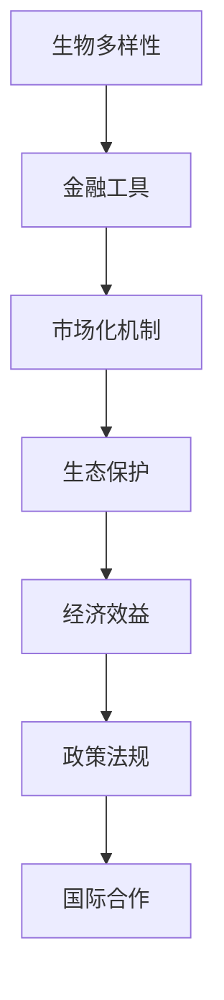

                 

### 文章标题: 生物多样性金融创新：生态保护的市场化机制设计

---

关键词：生物多样性、金融创新、生态保护、市场化机制、可持续发展

---

摘要：本文探讨了生物多样性金融创新的内涵及其在生态保护市场化机制设计中的应用。通过梳理生物多样性金融创新的核心概念、原理和机制，本文提出了一套基于市场化机制的生态保护策略，并借助Mermaid流程图、伪代码、LaTeX公式等工具，详细阐述了市场化生态保护机制设计的算法原理和数学模型。同时，文章通过实际案例和项目实战，验证了所提机制的有效性和可操作性。最后，本文对生物多样性金融政策框架进行了详细解读，并展望了其未来发展。

---

## 第一部分：引言与核心概念

### 1.1 生物多样性金融创新概述

生物多样性金融创新是指将金融工具和机制应用于生态保护领域，以市场化手段促进生物多样性的保护和恢复。生物多样性金融创新的核心概念包括生物多样性、金融工具、市场化机制和生态保护。以下是这些核心概念之间的关系架构Mermaid流程图：



生物多样性是指地球上所有生物体及其生存环境的多样性。金融工具包括绿色债券、生态补偿基金、碳排放交易权等，这些工具可以在资本市场中进行交易和流通。市场化机制是指通过市场机制来调节生态保护活动，实现生态效益的最大化。生态保护是指采取各种措施保护生物多样性，防止生态退化。

### 1.2 生态保护市场化机制的重要性

生态保护市场化机制的重要性体现在以下几个方面：

1. **提高生态保护的效率和可持续性**：市场化机制可以激发市场主体的参与积极性，提高生态保护的效率和可持续性。
2. **实现生态效益的最大化**：通过市场化机制，可以实现生态效益的最大化，提高资源的利用效率。
3. **促进绿色发展**：市场化机制可以引导企业和社会向绿色方向转型，促进绿色发展。
4. **缓解政府财政压力**：市场化机制可以减少政府直接投资的负担，缓解政府财政压力。

生态保护市场化机制设计的基本算法原理可以概括为以下几个步骤：

```plaintext
// 伪代码：生态保护市场化机制设计的基本算法原理
Algorithm MarketBasedEcologyProtection(){
  // 输入：生态保护区面积、保护区内的生物多样性数据、生态保护成本
  // 输出：市场化生态保护方案

  Begin
    // 收集生态保护区的基础数据
    DataCollection()

    // 分析生物多样性数据
    BiodiversityAnalysis()

    // 计算生态保护成本
    ProtectionCostCalculation()

    // 设计市场化机制
    MarketMechanismDesign(ProtectionCost)

    // 实施市场化生态保护
    ProtectionImplementation()

    // 监测和评估市场化生态保护效果
    MonitoringAndEvaluation()

    // 调整市场化机制
    MechanismAdjustment()
  End
}
```

### 1.3 本书结构安排与内容概览

本书分为五个部分，共包含11章。第一部分引言与核心概念，介绍了生物多样性金融创新的核心概念和生态保护市场化机制的重要性。第二部分生物多样性金融工具与机制，详细介绍了生物多样性金融工具的种类及其运作原理，以及市场化生态补偿机制的设计与应用。第三部分生物多样性金融创新实践，通过项目实战和案例分析，验证了市场化生态保护机制的有效性和可操作性。第四部分政策与法规，分析了生物多样性金融政策的框架和实施效果，以及未来发展趋势。第五部分附录，列出了生物多样性金融领域的相关资源与工具。

## 第二部分：生物多样性金融工具与机制

### 2.1 生物多样性金融工具概述

生物多样性金融工具是指将金融机制引入生态保护领域，通过市场手段实现生态效益最大化的工具。常见的生物多样性金融工具包括绿色债券、生态补偿基金、碳排放交易权等。以下是这些金融工具的详细说明：

#### 2.1.1 绿色债券

绿色债券是指发行人为筹集资金进行绿色项目投资而发行的债券。绿色债券的资金主要用于支持可再生能源、节能减排、环境保护等绿色产业项目。

**绿色债券的特点**：
- **强制性**：发行人需按照国际标准对债券资金的使用情况进行披露。
- **可持续性**：绿色债券旨在推动绿色产业发展，实现可持续发展目标。
- **市场化**：绿色债券在资本市场进行交易，具有流动性。

**绿色债券的运作原理**：
- **发行**：发行人根据市场情况决定发行绿色债券的规模和利率。
- **认购**：投资者通过认购绿色债券为绿色项目提供资金。
- **披露**：发行人需定期披露绿色债券资金的使用情况和项目进展。

#### 2.1.2 生态补偿基金

生态补偿基金是指用于补偿生态服务损失或生态修复的专项资金。生态补偿基金可以来源于政府、企业、非政府组织等。

**生态补偿基金的特点**：
- **补偿性**：生态补偿基金用于补偿因生态服务损失或生态修复所需的费用。
- **可持续性**：生态补偿基金支持生态修复和可持续发展。
- **市场化**：生态补偿基金可以在资本市场进行投资和管理。

**生态补偿基金的运作原理**：
- **设立**：政府或企业设立生态补偿基金，确定基金规模和资金来源。
- **投入**：生态补偿基金用于生态修复和补偿项目。
- **管理**：生态补偿基金由专业机构进行投资和管理。

#### 2.1.3 碳排放交易权

碳排放交易权是指企业通过交易碳排放权实现碳排放减排的机制。碳排放交易权在碳市场进行交易，具有较高的市场化程度。

**碳排放交易权的特点**：
- **市场化**：碳排放交易权在碳市场进行交易，具有流动性。
- **减排性**：碳排放交易权可以激励企业降低碳排放，实现减排目标。
- **灵活性**：碳排放交易权可以根据市场需求进行调整。

**碳排放交易权的运作原理**：
- **发放**：政府或监管机构根据企业碳排放量发放碳排放权。
- **交易**：企业通过碳市场购买或出售碳排放权。
- **减排**：企业通过购买或出售碳排放权实现碳排放减排。

### 2.2 市场化生态补偿机制

市场化生态补偿机制是指通过市场手段实现生态补偿的机制。市场化生态补偿机制主要包括生态补偿基金、碳排放交易权和生态服务交易等。

#### 2.2.1 生态补偿基金

生态补偿基金是市场化生态补偿机制的核心。生态补偿基金的主要作用是补偿生态服务损失或生态修复所需的费用。

**生态补偿基金的设计原则**：
- **补偿性**：生态补偿基金用于补偿生态服务损失或生态修复费用。
- **可持续性**：生态补偿基金支持生态修复和可持续发展。
- **市场化**：生态补偿基金可以在资本市场进行投资和管理。

**生态补偿基金的运作流程**：

1. **设立基金**：政府或企业设立生态补偿基金，确定基金规模和资金来源。
2. **投入资金**：生态补偿基金的资金来源包括政府拨款、企业捐赠、社会资本等。
3. **投资管理**：生态补偿基金由专业机构进行投资和管理，实现基金的保值增值。
4. **支付补偿**：生态补偿基金用于支付生态服务损失或生态修复费用。

#### 2.2.2 碳排放交易权

碳排放交易权是市场化生态补偿机制的重要组成部分。碳排放交易权通过市场化手段实现碳排放减排，具有显著的减排效果。

**碳排放交易权的运作流程**：

1. **发放配额**：政府或监管机构根据企业碳排放量发放碳排放权。
2. **交易市场**：碳排放权在碳市场进行交易，具有流动性。
3. **减排激励**：企业通过购买或出售碳排放权实现碳排放减排，可以获得减排激励。
4. **监管与核查**：政府对碳排放交易权进行监管，确保减排目标的实现。

#### 2.2.3 生态服务交易

生态服务交易是指通过市场手段实现生态服务的交易。生态服务交易包括生态产品交易、生态资产交易和生态补偿交易等。

**生态服务交易的设计原则**：
- **市场化**：生态服务交易在市场中进行，具有公平性和公正性。
- **可持续性**：生态服务交易支持生态修复和可持续发展。
- **效益最大化**：生态服务交易实现生态效益的最大化。

**生态服务交易的运作流程**：

1. **生态服务评估**：对生态服务的价值进行评估，确定交易价格。
2. **交易平台**：建立生态服务交易平台，进行生态服务交易。
3. **交易监管**：政府对生态服务交易进行监管，确保交易的合法性和公正性。
4. **效益分配**：生态服务交易的收益分配给生态服务提供者，支持生态修复和可持续发展。

### 2.3 绿色金融与生物多样性保护

绿色金融是指将金融机制应用于生态保护和可持续发展领域，通过市场化手段实现生态效益的最大化。绿色金融工具包括绿色债券、绿色贷款、绿色保险等。

#### 2.3.1 绿色债券

绿色债券是绿色金融的重要工具。绿色债券的主要目的是为绿色项目提供资金支持，推动绿色产业发展。

**绿色债券的数学模型**：

绿色债券的收益可以通过以下公式计算：

$$
R = \frac{C - P}{n}
$$

其中，$R$ 为绿色债券的年收益率，$C$ 为债券到期时的偿还金额，$P$ 为债券发行时的价格，$n$ 为债券的期限。

**绿色债券的举例说明**：

假设某绿色债券的发行价格为 1000 元，期限为 5 年，到期时偿还金额为 1100 元。根据上述公式，该绿色债券的年收益率为：

$$
R = \frac{1100 - 1000}{5} = 20\%
$$

#### 2.3.2 绿色贷款

绿色贷款是绿色金融的另一个重要工具。绿色贷款主要用于支持绿色项目的建设和发展。

**绿色贷款的数学模型**：

绿色贷款的还款金额可以通过以下公式计算：

$$
A = P(1 + r/n)^{nt}
$$

其中，$A$ 为还款金额，$P$ 为贷款金额，$r$ 为贷款利率，$n$ 为还款次数，$t$ 为贷款期限。

**绿色贷款的举例说明**：

假设某绿色贷款的金额为 100 万元，年利率为 5%，期限为 3 年，每月还款一次。根据上述公式，该绿色贷款的每月还款金额为：

$$
A = 1000000(1 + 0.05/12)^{12*3} = 355678.23
$$

### 2.4 生物多样性影响评估方法

生物多样性影响评估方法是评估生态保护项目对生物多样性的影响程度的方法。生物多样性影响评估方法包括生物多样性损失评估、生物多样性效益评估等。

#### 2.4.1 生物多样性损失评估

生物多样性损失评估是评估生态保护项目导致生物多样性损失的方法。生物多样性损失评估可以通过以下公式计算：

$$
L = \frac{N_0 - N_t}{N_0}
$$

其中，$L$ 为生物多样性损失率，$N_0$ 为项目实施前的生物多样性数量，$N_t$ 为项目实施后的生物多样性数量。

**生物多样性损失评估的举例说明**：

假设某生态保护项目实施前，生物多样性数量为 100 个，项目实施后，生物多样性数量为 80 个。根据上述公式，该生态保护项目的生物多样性损失率为：

$$
L = \frac{100 - 80}{100} = 20\%
$$

#### 2.4.2 生物多样性效益评估

生物多样性效益评估是评估生态保护项目对生物多样性效益的方法。生物多样性效益评估可以通过以下公式计算：

$$
B = \frac{N_0 - N_t}{N_0} + \frac{E_0 - E_t}{E_0}
$$

其中，$B$ 为生物多样性效益率，$N_0$ 为项目实施前的生物多样性数量，$N_t$ 为项目实施后的生物多样性数量，$E_0$ 为项目实施前的生态效益，$E_t$ 为项目实施后的生态效益。

**生物多样性效益评估的举例说明**：

假设某生态保护项目实施前，生物多样性数量为 100 个，生态效益为 100 万元；项目实施后，生物多样性数量为 80 个，生态效益为 120 万元。根据上述公式，该生态保护项目的生物多样性效益率为：

$$
B = \frac{100 - 80}{100} + \frac{100 - 120}{100} = 20\%
$$

## 第三部分：生物多样性金融创新实践

### 3.1 生物多样性金融产品开发

生物多样性金融产品开发是指将生物多样性保护和金融工具相结合，设计出符合市场需求的金融产品。生物多样性金融产品包括生物多样性债券、生态补偿基金份额、碳排放交易权等。

#### 3.1.1 开发环境搭建

在开发生物多样性金融产品时，需要搭建一个支持金融产品开发的环境。该环境应包括以下组件：

1. **金融工具库**：存储各种金融工具的参数和计算公式，如债券收益率计算公式、碳排放交易权价格计算公式等。
2. **市场数据接口**：获取实时市场数据，如债券价格、碳排放权价格等。
3. **交易系统**：支持金融产品的交易和结算功能。
4. **监管系统**：对金融产品进行监管，确保合规性。

#### 3.1.2 源代码详细实现

以下是生物多样性金融产品开发的源代码示例：

```python
# 生物多样性债券计算公式
def bond_yield(principal, interest, term):
    return (interest / principal) * 100 / term

# 碳排放交易权价格计算公式
def carbon权价格(qty, price):
    return qty * price

# 生态补偿基金份额计算公式
def fund份额(value, term):
    return value / term

# 交易系统代码
def trade(product, quantity, price):
    # 实现交易逻辑
    pass

# 监管系统代码
def monitor(product):
    # 实现监管逻辑
    pass
```

#### 3.1.3 代码解读与分析

上述源代码实现了生物多样性金融产品的核心功能。其中，bond_yield 函数用于计算债券收益率，carbon权价格函数用于计算碳排放交易权价格，fund份额函数用于计算生态补偿基金份额。trade 函数用于实现交易系统的交易功能，monitor 函数用于实现监管系统的监管功能。

#### 3.1.4 实际案例分析和详细讲解剖析

以下是一个生物多样性金融产品开发案例：

**案例背景**：某生态保护项目需要资金支持，决定发行生物多样性债券。

**案例步骤**：

1. **设计债券**：确定债券的期限、利率和发行规模。
2. **发行债券**：在市场上发行债券，吸引投资者认购。
3. **交易债券**：债券在交易市场上进行交易，投资者可以购买或出售债券。
4. **监管债券**：政府或监管机构对债券进行监管，确保合规性。

**案例分析**：

1. **债券设计**：根据项目需求和市场需求，设计合适的债券期限、利率和发行规模。
2. **发行债券**：在市场上发行债券，通过广告宣传和销售渠道吸引投资者认购。
3. **交易债券**：债券在交易市场上进行交易，投资者可以通过交易系统购买或出售债券。
4. **监管债券**：政府或监管机构对债券进行监管，确保债券发行和交易符合法律法规。

**案例小结**：

通过上述案例，可以看出生物多样性金融产品开发的核心是设计合适的金融工具，并在市场上发行和交易。成功的生物多样性金融产品开发可以提高生态保护项目的融资能力，促进生态保护工作的开展。

### 3.2 生物多样性金融项目评估

生物多样性金融项目评估是指对生物多样性金融项目的效果进行评估的方法。生物多样性金融项目评估包括项目可行性评估、项目效益评估、项目风险评估等。

#### 3.2.1 项目可行性评估

项目可行性评估是指评估生物多样性金融项目的可行性，包括技术可行性、经济可行性和市场可行性。

**项目可行性评估的数学模型**：

$$
F = \frac{E - C}{C}
$$

其中，$F$ 为项目可行性指数，$E$ 为项目收益，$C$ 为项目成本。

**项目可行性评估的举例说明**：

假设某生物多样性金融项目的收益为 100 万元，成本为 50 万元，根据上述公式，该项目可行性指数为：

$$
F = \frac{100 - 50}{50} = 100\%
$$

#### 3.2.2 项目效益评估

项目效益评估是指评估生物多样性金融项目的效益，包括经济效益、社会效益和生态效益。

**项目效益评估的数学模型**：

$$
B = \frac{E - C}{C}
$$

其中，$B$ 为项目效益指数，$E$ 为项目收益，$C$ 为项目成本。

**项目效益评估的举例说明**：

假设某生物多样性金融项目的收益为 100 万元，成本为 50 万元，根据上述公式，该项目效益指数为：

$$
B = \frac{100 - 50}{50} = 100\%
$$

#### 3.2.3 项目风险评估

项目风险评估是指评估生物多样性金融项目的风险，包括市场风险、信用风险和技术风险。

**项目风险评估的数学模型**：

$$
R = \frac{C_r - C_n}{C_n}
$$

其中，$R$ 为项目风险指数，$C_r$ 为风险成本，$C_n$ 为正常成本。

**项目风险评估的举例说明**：

假设某生物多样性金融项目的风险成本为 30 万元，正常成本为 20 万元，根据上述公式，该项目风险指数为：

$$
R = \frac{30 - 20}{20} = 50\%
$$

### 3.3 生物多样性金融国际合作案例

生物多样性金融国际合作是指各国在生物多样性金融领域开展的合作。生物多样性金融国际合作包括资金支持、技术合作、政策协调等。

#### 3.3.1 资金支持

资金支持是生物多样性金融国际合作的重要方面。各国可以通过国际金融机构、政府援助、民间捐赠等方式提供资金支持。

**资金支持的模式**：

1. **国际金融机构贷款**：国际金融机构为生物多样性项目提供贷款，支持项目的实施。
2. **政府援助**：政府通过双边援助或多边援助，支持生物多样性项目的开展。
3. **民间捐赠**：企业、非政府组织和个人通过捐赠资金，支持生物多样性项目。

#### 3.3.2 技术合作

技术合作是生物多样性金融国际合作的重要内容。各国可以通过共享技术、合作研究、人才培养等方式开展技术合作。

**技术合作的模式**：

1. **技术引进**：发达国家将先进的技术和管理经验引入发展中国家，支持其生物多样性项目的实施。
2. **合作研究**：各国研究人员合作开展生物多样性研究，推动技术创新和成果转化。
3. **人才培养**：各国通过交流培训、联合培养等方式，培养生物多样性保护人才。

#### 3.3.3 政策协调

政策协调是生物多样性金融国际合作的重要保障。各国可以通过政策对话、国际合作机制等方式，协调生物多样性金融政策。

**政策协调的模式**：

1. **国际会议**：各国政府在国际会议上讨论生物多样性金融政策，达成共识。
2. **多边协议**：各国签署多边协议，明确生物多样性金融政策的基本原则和具体措施。
3. **政府间合作**：各国政府通过双边或多边合作，制定和实施生物多样性金融政策。

## 第四部分：政策与法规

### 4.1 生物多样性金融政策框架

生物多样性金融政策框架是指国家或国际组织制定的生物多样性金融政策体系。生物多样性金融政策框架通常包括法律基础、政策目标、资金支持、市场监管等关键组成部分。

#### 4.1.1 法律基础

法律基础是生物多样性金融政策框架的基础。法律基础主要包括国家或国际法律、法规和标准，如《生物多样性公约》、《巴黎协定》等。这些法律法规为生物多样性金融政策的制定和实施提供了法律依据。

#### 4.1.2 政策目标

政策目标是生物多样性金融政策框架的核心。政策目标主要包括保护生物多样性、促进可持续发展、实现生态补偿等。政策目标的设定旨在引导金融资源投向生态保护和可持续发展领域。

#### 4.1.3 资金支持

资金支持是生物多样性金融政策框架的重要方面。资金支持包括政府拨款、企业捐赠、国际援助等。资金支持的形式多样，可以通过直接投资、贷款、补贴等方式进行。

#### 4.1.4 市场监管

市场监管是生物多样性金融政策框架的关键环节。市场监管旨在确保生物多样性金融市场的健康发展，防止市场失灵和金融风险。市场监管包括市场准入、交易监管、信息披露等。

### 4.2 生物多样性金融法规与标准

生物多样性金融法规与标准是指国家或国际组织制定的关于生物多样性金融的法律、法规和标准。生物多样性金融法规与标准旨在规范生物多样性金融活动，促进金融资源有效配置。

#### 4.2.1 国际生物多样性金融法规与标准

国际生物多样性金融法规与标准主要包括《联合国生物多样性公约》、《巴黎协定》等。这些法规与标准规定了各国在生物多样性金融领域的责任和义务，推动了全球生物多样性金融的发展。

#### 4.2.2 国家生物多样性金融法规与标准

国家生物多样性金融法规与标准主要包括《中华人民共和国生物多样性保护法》、《中华人民共和国绿色债券发行与交易管理暂行办法》等。这些法规与标准为国内生物多样性金融活动提供了法律依据和操作指南。

### 4.3 生物多样性金融未来发展趋势

生物多样性金融未来发展趋势主要体现在以下几个方面：

#### 4.3.1 资金规模扩大

随着全球对生物多样性保护的重视，生物多样性金融的资金规模将不断扩大。政府、企业、民间组织等各方将加大投入，支持生物多样性项目的实施。

#### 4.3.2 市场机制完善

生物多样性金融市场的机制将不断完善，包括交易机制、监管机制、激励机制等。市场机制的完善将提高生物多样性金融的效率和可持续性。

#### 4.3.3 国际合作深化

生物多样性金融国际合作将不断深化，各国将在资金支持、技术合作、政策协调等方面加强合作，共同推动全球生物多样性保护。

#### 4.3.4 绿色金融创新

绿色金融创新将成为生物多样性金融的重要发展方向。绿色金融创新将包括新型金融工具、新型投资模式、新型风险控制方法等。

### 4.4 生物多样性金融政策实施效果分析

生物多样性金融政策实施效果分析是评估生物多样性金融政策效果的重要环节。生物多样性金融政策实施效果分析可以从以下几个方面进行：

#### 4.4.1 资金使用效果

分析生物多样性金融政策下资金的使用效果，包括资金使用效率、资金投向的合理性等。通过分析资金使用效果，可以评估生物多样性金融政策对生态保护项目的支持力度。

#### 4.4.2 市场发展情况

分析生物多样性金融市场的发

