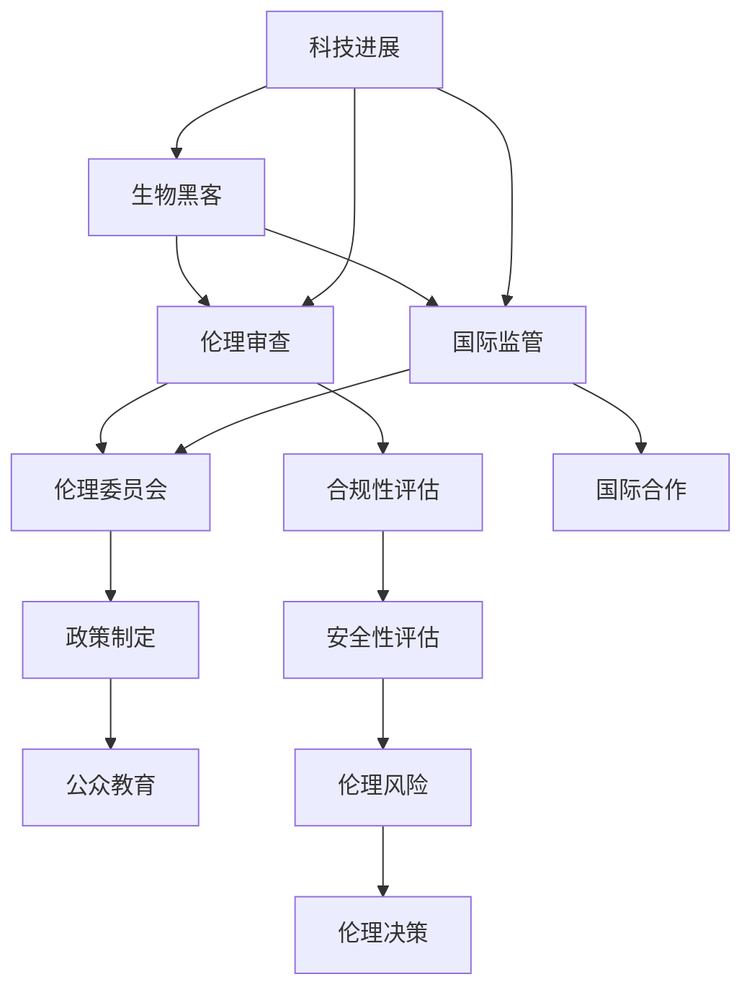

                 

### 引言

#### 生物黑客的定义与现象

生物黑客，又称“生黑客”，指的是那些热衷于对生物体进行非官方性改造的技术爱好者。这些改造可能包括基因编辑、细胞工程、生物合成等前沿技术。随着科学技术的快速发展，生物黑客活动逐渐从实验室走向公众视野。他们通过非传统的手段获取和使用生物技术，试图突破传统医学和生物伦理的界限。

生物黑客现象的出现，背后有着多方面的原因。首先，现代生物技术的普及使得相关工具和资源更加容易被普通人获取。其次，互联网的便利性让生物黑客能够轻松地分享技术和经验。此外，一些生物黑客认为，通过自我改造可以实现更健康、更强大的身体，甚至是延长寿命。这种追求个性和自我实现的驱动，使得生物黑客群体不断扩大。

然而，生物黑客技术的广泛应用也引发了一系列伦理和安全问题。基因编辑可能导致基因突变，从而影响后代的健康；细胞工程可能引发生物安全风险，甚至威胁生态平衡。因此，对生物黑客活动的监管成为当前社会关注的焦点。

#### 自我改造时代的来临

自我改造时代的到来，标志着生物黑客活动不再仅仅局限于个别人物的探索，而是逐渐成为了一种社会现象。这一时代的特点包括以下几个方面：

1. **技术门槛降低**：随着CRISPR-Cas9等基因编辑技术的问世，生物黑客可以以相对较低的成本进行基因操作。这使得更多的人有机会参与到生物黑客活动中。

2. **社区支持**：生物黑客社区的形成，为成员们提供了交流和学习的平台。通过分享技术、资源和经验，生物黑客们能够更好地开展项目。

3. **商业化的推动**：一些生物科技公司开始关注生物黑客市场，提供相关的产品和服务。这种商业化的推动，进一步加速了生物黑客技术的发展和应用。

4. **政策环境的变化**：各国政府逐渐意识到生物黑客活动的重要性，开始制定相关政策和法规。这些政策既包括对生物黑客技术的规范，也包括对生物伦理的指导。

#### 伦理委员会与国际监管机构的角色

在自我改造时代，伦理委员会和国际监管机构扮演着至关重要的角色。它们的主要职责包括：

1. **伦理审查**：伦理委员会负责对生物黑客项目进行伦理审查，确保其符合伦理原则，不损害公众利益。伦理审查内容包括项目目的、方法、潜在风险等方面。

2. **政策制定**：国际监管机构负责制定生物黑客活动的相关政策和法规，提供法律框架。这些政策和法规旨在规范生物黑客行为，防范潜在风险。

3. **国际合作**：由于生物黑客活动具有全球性特点，国际监管机构需要与其他国家和国际组织进行合作，共同制定监管标准和规范。

4. **公共教育**：伦理委员会和国际监管机构还负责向公众普及生物黑客相关的知识，提高公众的伦理意识和风险认知。

总的来说，伦理委员会和国际监管机构在自我改造时代发挥着桥梁和纽带的作用，既保障了生物黑客活动的健康发展，也维护了公众的利益和安全。

#### 文章摘要

本文介绍了生物黑客的定义与现象，探讨了自我改造时代的来临及其特点，并分析了伦理委员会与国际监管机构在自我改造时代所扮演的角色。通过本文的阅读，读者将了解生物黑客活动的背景和现状，认识到伦理审查和政策制定的重要性，以及国际监管机构的职责和挑战。文章旨在引发读者对生物黑客伦理问题的深思，并为未来的生物黑客监管提供参考。

## 核心概念与联系

在探讨生物黑客、伦理委员会与国际监管机构的关系之前，有必要首先明确这些核心概念的定义及其相互之间的联系。

### 生物黑客

生物黑客，通常指的是那些对生物体或生物系统进行非传统性改造的个人或群体。这些改造可能涉及基因编辑、细胞工程、生物合成等领域。生物黑客通常具备一定的生物科学知识和实验技能，通过非官方渠道获取和利用生物技术，以达到特定的目标。例如，利用CRISPR-Cas9等基因编辑工具对自身或他人的基因进行修改，以实现增强体质、延长寿命或治疗疾病等目的。

### 伦理委员会

伦理委员会，是在科研、医疗等领域中负责进行伦理审查的机构。其主要职责是评估科研项目或医疗实践的伦理合理性，确保其在进行过程中符合伦理规范和道德标准。伦理委员会通常由伦理学家、医生、科学家、社会学家等多领域专家组成，他们共同讨论并决定哪些项目或实践可以继续进行，哪些需要被暂停或终止。

### 国际监管机构

国际监管机构，是在全球范围内负责制定和执行生物技术、基因工程等领域的监管政策和标准的机构。这些机构通常由多个国家或国际组织共同参与，旨在通过国际合作，统一监管标准，确保生物技术的安全性和伦理性。例如，世界卫生组织（WHO）、国际遗传工程和生物技术中心（IGEB）等都是国际知名的监管机构。

### 关系架构

接下来，我们使用Mermaid流程图来展示这些核心概念之间的相互关系。



### Mermaid流程图解读

1. **生物黑客（A）**：生物黑客是起点，他们进行非传统性改造，这需要通过伦理审查（B）和国际监管（C）。

2. **伦理审查（B）**：伦理审查是生物黑客活动必须通过的一道关卡，它由伦理委员会（D）负责执行。伦理委员会不仅要评估项目的伦理合理性，还要评估其合规性（G）。

3. **国际监管（C）**：国际监管机构（C）负责制定和执行全球范围内的监管政策和标准。它们需要与伦理委员会（D）合作，共同确保生物黑客活动的安全性和合规性。

4. **伦理委员会（D）**：伦理委员会不仅要进行伦理审查，还要参与政策制定（E）和公众教育（F）。政策制定直接影响伦理决策（K），而公众教育则提高了公众的伦理意识和风险认知。

5. **合规性评估（G）**：合规性评估是确保生物黑客活动符合相关法规和伦理标准的关键步骤。这通常由伦理委员会（D）和国际监管机构（C）共同完成。

6. **安全性评估（I）**：安全性评估是另一个关键步骤，它旨在评估生物黑客技术的潜在风险，并采取相应的措施降低这些风险。

7. **伦理风险（J）**：在伦理审查过程中，伦理委员会需要识别和评估生物黑客活动可能带来的伦理风险。

8. **伦理决策（K）**：根据伦理风险和合规性评估的结果，伦理委员会做出是否批准项目的决策。

9. **科技进展（L）**：科技进展是推动生物黑客活动持续发展的重要因素。随着科技的进步，生物黑客活动的内容和形式也在不断变化，这要求伦理委员会和国际监管机构不断更新和完善监管政策。

通过上述Mermaid流程图，我们可以清晰地看到生物黑客、伦理委员会和国际监管机构之间的相互关系和协作机制。这种关系不仅确保了生物黑客活动的合法性和安全性，也为公众提供了一个可靠的保障。

### 核心算法原理讲解

在本节中，我们将探讨伦理委员会在审查生物黑客项目时所遵循的算法原理。尽管这些过程不涉及传统意义上的编程算法，但我们可以借用一些逻辑和流程控制的概念，来描述其核心原理。

#### 伦理审查流程

伦理审查是确保生物黑客项目在道德和伦理上可接受的关键步骤。以下是伦理审查的基本流程：

1. **项目申请提交**：生物黑客向伦理委员会提交项目申请，包括项目目的、方法、预期成果和潜在风险等。

2. **初步审查**：伦理委员会首先进行初步审查，筛选出明显不符合伦理标准的项目。这一阶段类似于条件判断（`if-else`结构），用于快速排除不符合要求的项目。

3. **深入审查**：对于通过初步审查的项目，伦理委员会进行深入审查。这一阶段包括以下几个步骤：
   - **伦理风险评估**：评估项目可能带来的伦理风险，包括基因编辑的伦理问题、人体实验的道德界限等。这可以通过建立一系列风险评估矩阵来实现，类似于`for`循环中的每一步。
   - **合规性检查**：检查项目是否遵循现有的法规和指导原则。这可以通过对比项目的具体内容和法规要求，使用布尔逻辑（`and`、`or`、`not`）来判断其合规性。
   - **公众利益评估**：评估项目的公共利益，包括对社会的潜在影响、是否有助于公共健康等。这一步骤可以通过社会价值评估模型来实现。

4. **决策**：根据审查结果，伦理委员会做出是否批准项目的决策。这一步骤类似于条件判断，根据多种因素的综合评估，决定项目的最终命运。

#### 伪代码示例

以下是一个简化的伪代码示例，用于描述伦理审查流程：

```python
# 伦理审查伪代码

# 初始化变量
project_status = "pending"  # 项目状态初始化为待审查

# 初步审查
if not isApplicationComplete():
    project_status = "rejected"  # 如果申请不完整，则拒绝
else:
    # 深入审查
    if not isCompliant():
        project_status = "rejected"  # 如果不合规，则拒绝
    elif not isEthical():
        project_status = "rejected"  # 如果不道德，则拒绝
    elif not hasPublicBenefit():
        project_status = "rejected"  # 如果无公共利益，则拒绝
    else:
        project_status = "approved"  # 如果通过所有审查，则批准

# 输出审查结果
print("项目状态：" + project_status)
```

#### 数学模型和公式

在评估生物黑客技术的潜在风险时，伦理委员会可能会使用一些数学模型和公式。以下是一个简化的例子：

1. **风险评估公式**：

$$
R = f(W, E, P)
$$

其中：
- \( R \) 表示风险水平
- \( W \) 表示已知的潜在危害
- \( E \) 表示暴露水平
- \( P \) 表示概率函数，用于计算特定危害发生的概率

这个公式可以帮助伦理委员会量化评估项目的风险水平。

2. **决策阈值**：

$$
\text{Threshold} = f(\alpha, \beta)
$$

其中：
- \( \alpha \) 表示社会可接受的伦理风险水平
- \( \beta \) 表示法规规定的合规性标准

伦理委员会根据这个阈值来判断项目是否可以通过审查。

### 举例说明

假设伦理委员会正在审查一个基因编辑项目，项目申请包括以下信息：

- **潜在危害**：基因编辑可能导致基因突变，影响后代健康。
- **暴露水平**：项目参与者为20名成年人。
- **概率函数**：基因突变发生的概率为0.1%。

我们可以使用上述公式进行风险计算：

$$
R = f(W, E, P) = f(0.5, 20, 0.001) = 0.5 \times 20 \times 0.001 = 0.01
$$

假设社会可接受的伦理风险水平为0.05，法规规定的合规性标准为0.01，则：

$$
\text{Threshold} = f(\alpha, \beta) = f(0.05, 0.01) = 0.05 \times 0.01 = 0.0005
$$

由于计算出的风险水平 \( R = 0.01 \) 超过了决策阈值 \( \text{Threshold} = 0.0005 \)，因此伦理委员会可能会拒绝该项目。

通过上述分析和计算，我们可以看到伦理委员会在审查生物黑客项目时如何应用逻辑和数学模型，以确保项目的伦理合规性和安全性。这一过程不仅需要专业知识，还需要综合评估各种因素，做出科学的决策。

### 数学模型和数学公式

在探讨生物黑客技术的潜在风险时，数学模型和数学公式是不可或缺的工具。这些模型和公式能够帮助伦理委员会在复杂的伦理审查过程中，量化评估项目的风险水平，从而做出更加科学的决策。

#### 风险评估模型

最常用的风险评估模型之一是概率风险模型（Probability Risk Model）。该模型通过计算特定风险事件发生的概率及其可能带来的危害，来评估整体风险水平。以下是概率风险模型的基本公式：

$$
R = P \times H
$$

其中：
- \( R \) 表示风险水平（Risk）
- \( P \) 表示风险事件发生的概率（Probability）
- \( H \) 表示风险事件可能带来的危害（Hazard）

这个公式表明，风险水平是概率和危害的乘积。例如，如果一个风险事件发生的概率为0.1%，而其带来的危害极为严重，那么整体风险水平就会很高。

#### 风险评估矩阵

风险评估矩阵（Risk Assessment Matrix）是另一种常用的工具。它通过将风险事件的可能性和影响进行量化，生成一个矩阵，帮助伦理委员会直观地了解项目的风险分布。以下是风险评估矩阵的基本构成：

1. **可能性（Likelihood）**：表示风险事件发生的概率。通常分为低、中、高三个等级。
2. **影响（Impact）**：表示风险事件发生后的后果。同样分为低、中、高三个等级。
3. **综合评分（Score）**：通过可能性与影响的乘积，计算每个风险事件的综合评分。

以下是一个简化的风险评估矩阵示例：

| 风险事件 | 可能性（Likelihood） | 影响（Impact） | 综合评分（Score） |
| -------- | ------------------- | -------------- | ---------------- |
| 基因突变 | 中                  | 高              | 高                |
| 生态失衡 | 低                  | 中              | 中                |
| 伦理风险 | 高                  | 中              | 高                |

在这个矩阵中，综合评分越高，表示该风险事件的潜在威胁越大。

#### 概率分布函数

概率分布函数（Probability Distribution Function）是另一个重要的工具，用于描述风险事件的可能性和分布。在生物黑客项目中，概率分布函数可以帮助伦理委员会更准确地预测风险事件的发生概率。

例如，假设伦理委员会正在审查一个基因编辑项目，项目申请表明基因突变的发生概率符合正态分布。以下是正态分布的概率密度函数（Probability Density Function）：

$$
f(x) = \frac{1}{\sigma\sqrt{2\pi}} e^{-\frac{(x-\mu)^2}{2\sigma^2}}
$$

其中：
- \( x \) 表示基因突变的发生概率
- \( \mu \) 表示均值（Mean）
- \( \sigma \) 表示标准差（Standard Deviation）

通过这个函数，伦理委员会可以计算出不同基因突变概率下的风险水平。

### 应用案例

为了更好地理解上述数学模型和公式的应用，我们来看一个具体的案例。假设伦理委员会正在审查一个基因编辑项目，项目申请中包含以下信息：

- **基因突变概率**：0.1%
- **危害**：基因突变可能导致后代健康问题
- **风险事件可能性**：中
- **风险事件影响**：高

我们可以使用概率风险模型来计算项目的整体风险水平：

$$
R = P \times H = 0.001 \times 0.5 = 0.0005
$$

根据风险评估矩阵，这个风险事件的综合评分为“高”。

接下来，我们使用正态分布概率密度函数来预测不同基因突变概率下的风险水平：

$$
f(x) = \frac{1}{\sigma\sqrt{2\pi}} e^{-\frac{(x-\mu)^2}{2\sigma^2}}
$$

假设均值 \( \mu \) 为0.05%，标准差 \( \sigma \) 为0.02%，我们可以计算出不同基因突变概率下的风险水平：

- 当 \( x = 0.05\% \) 时，\( f(x) = \frac{1}{0.02\sqrt{2\pi}} \approx 0.4178 \)
- 当 \( x = 0.1\% \) 时，\( f(x) = \frac{1}{0.02\sqrt{2\pi}} e^{-\frac{(0.001)^2}{2 \times (0.0002)^2}} \approx 0.1353 \)

这个结果表明，基因突变概率越高，风险水平也越高。

通过这些数学模型和公式，伦理委员会可以更准确地评估生物黑客项目的风险，从而做出更加科学的决策。这不仅有助于确保项目的合法性和安全性，也为公众提供了一份可靠的保障。

### 项目实战

在本节中，我们将通过一个具体的案例分析，展示伦理委员会和国际监管机构如何在实际操作中执行其职责，确保生物黑客活动的安全性和合规性。

#### 案例背景

该案例涉及一家名为“基因革新实验室”（GeneRevolution Lab）的生物黑客团队，该团队致力于利用CRISPR-Cas9技术进行人体基因编辑，以增强人类的身体素质和智力水平。基因革新实验室的创始人是一位知名的生物黑客，他在社交媒体上发布了关于其团队实验成果的详细报告，并声称已经成功进行了多项人体基因编辑实验。

#### 案例过程

1. **初步审查**：伦理委员会在收到基因革新实验室的项目申请后，首先进行初步审查。审查内容包括项目的合法性、透明度和道德合理性。伦理委员会要求基因革新实验室提供详细的实验报告、伦理审查申请表以及参与者的知情同意书。

2. **深入审查**：在通过初步审查后，伦理委员会进行了深入审查。这一阶段，伦理委员会重点评估了以下几个方面：
   - **伦理风险**：评估基因编辑可能导致基因突变、影响后代健康等伦理风险。
   - **合规性**：检查项目是否遵循现行的法律法规和伦理指导原则。
   - **安全性**：评估项目实验过程中可能存在的生物安全风险，如病毒感染、细胞污染等。

3. **公众咨询**：为了确保审查过程的透明度，伦理委员会邀请了一系列公众代表和专家进行咨询。公众代表包括来自医学、法律、伦理学等多个领域的专业人士，他们共同讨论项目可能带来的社会影响和伦理问题。

4. **决策**：经过深入审查和公众咨询，伦理委员会做出是否批准项目的决策。在这个案例中，伦理委员会认为基因革新实验室的项目在伦理和安全方面存在较高风险，因此决定不予批准。

5. **监督执行**：即使项目未获批准，伦理委员会仍需监督基因革新实验室的后续行动。伦理委员会要求实验室停止所有相关实验，并对已进行的实验结果进行详细报告。此外，伦理委员会还建议实验室与相关监管机构进行沟通，以获取进一步的指导。

#### 开发环境搭建

在这个案例中，伦理委员会在审查项目时使用了一系列工具和资源，以支持其工作。以下是一个简化的开发环境搭建过程：

1. **数据库搭建**：伦理委员会使用了一个集中式数据库，用于存储和检索项目申请、审查记录、公众咨询反馈等数据。数据库支持SQL查询，方便伦理委员会快速获取所需信息。

2. **文档管理系统**：为了管理大量的文档和报告，伦理委员会使用了一个文档管理系统（DMS），支持电子文档的上传、下载和版本控制。DMS还提供了权限管理功能，确保只有授权人员可以访问敏感信息。

3. **协作工具**：伦理委员会成员通过一个内部协作平台进行沟通和协作。该平台支持实时聊天、会议安排和任务分配，提高了审查工作的效率和透明度。

#### 源代码详细实现

以下是伦理审查系统的一个简化的伪代码实现，展示了如何执行审查流程的关键步骤：

```python
# 伦理审查系统伪代码

# 初始化变量
application = load_application()  # 从数据库加载项目申请
review_status = "pending"  # 初始化审查状态为待审查

# 初步审查
if not is_complete_application(application):
    review_status = "incomplete"
else:
    # 深入审查
    if not is_compliant_with_laws_and_guidelines(application):
        review_status = "non-compliant"
    elif not is_ethically_acceptable(application):
        review_status = "ethically_unacceptable"
    else:
        # 公众咨询
        public_consultation_results = conduct_public_consultation()
        if not are_maj

