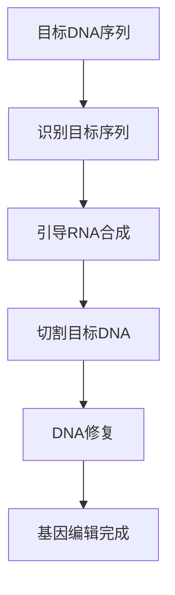
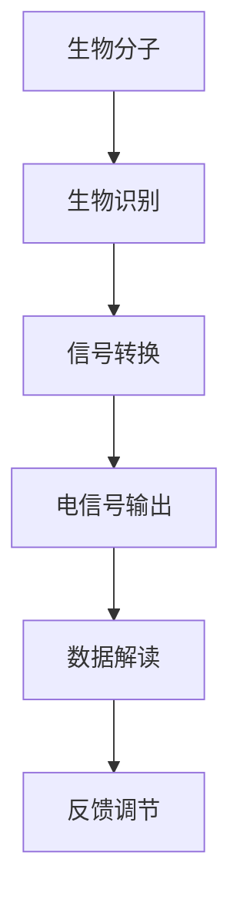
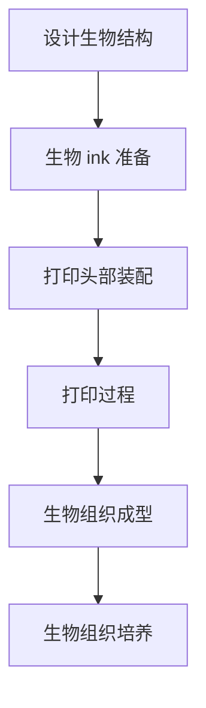
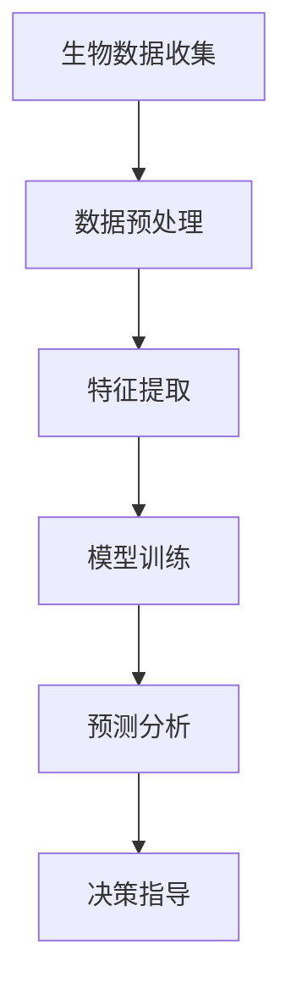

                 

### 文章标题：生物黑客伦理委员会：自我改造时代的道德指南

### 关键词：生物黑客、伦理委员会、自我改造、道德指导、基因编辑、人工智能、生物技术

### 摘要：
随着生物技术的迅猛发展，自我改造已成为可能，生物黑客群体也因此崛起。他们通过基因编辑、生物传感器和生物打印等技术，挑战着人类身体的界限。然而，这些技术的应用也引发了一系列伦理问题，需要伦理委员会进行严格审查。本文旨在探讨生物黑客伦理委员会在自我改造时代的角色和职责，为这一新兴领域提供道德指南。

---

## 文章标题：生物黑客伦理委员会：自我改造时代的道德指南

随着科技的进步，人类开始有能力通过基因编辑、生物传感器和生物打印等技术，对身体进行自我改造。这种趋势催生了生物黑客这一群体，他们热衷于探索和实现人类身体的无限可能性。然而，自我改造不仅带来了技术上的挑战，也引发了一系列深刻的伦理问题。为了应对这些挑战，生物黑客伦理委员会应运而生。本文将探讨生物黑客伦理委员会在自我改造时代的角色和职责，以及如何为这一新兴领域提供道德指南。

---

## 第1部分：生物黑客伦理委员会概述

### 第1章：生物黑客与伦理委员会的基本概念

#### 1.1 生物黑客的定义与背景

**定义**：
生物黑客，也被称为生物工程师或生命工程师，是指那些利用生物技术，特别是基因编辑技术，对自己或他人的身体进行修改的人。他们的目标是通过改变遗传信息，实现对生物体的功能和形态的优化。

**背景**：
生物黑客的兴起与基因编辑技术的发展密切相关。CRISPR-Cas9技术的问世，使得基因编辑变得更为简便和高效，这为生物黑客提供了强大的工具。同时，生物打印技术和生物传感器技术的进步，也为生物黑客提供了更多的可能性。

#### 1.2 伦理委员会的定义与职责

**定义**：
伦理委员会（Ethics Committee）是指在科学研究和医疗实践中，负责对可能产生的伦理问题进行审查和决策的机构。它们通常由伦理学家、医生、科学家、患者代表等组成。

**职责**：
伦理委员会的主要职责包括：
- **伦理审查**：对涉及人类研究、医疗实践的科研项目进行伦理审查，确保研究符合伦理标准。
- **决策指导**：在涉及伦理问题的案例中，提供决策建议和指导。
- **伦理教育**：对科研人员、医护人员等进行伦理教育，提高他们的伦理意识。

#### 1.3 生物黑客与伦理委员会的关系

**互动与联系**：
生物黑客的兴起，使得伦理委员会面临新的挑战。生物黑客的项目往往涉及复杂的伦理问题，如基因编辑的道德边界、个体隐私保护等。伦理委员会需要与生物黑客进行密切合作，共同探讨解决方案。

**相互影响**：
生物黑客和伦理委员会之间的互动，不仅影响着生物黑客的技术应用，也影响着伦理委员会的决策。通过这种互动，伦理委员会可以更准确地把握社会需求和技术发展的趋势，从而制定更为合理的伦理规范。

---

在本章节中，我们介绍了生物黑客和伦理委员会的基本概念及其关系。接下来，我们将进一步探讨生物黑客所采用的具体技术手段，以及伦理委员会如何进行决策。

---

## 第2部分：生物黑客技术手段与伦理决策

### 第2章：生物黑客技术手段

生物黑客所采用的技术手段多种多样，其中最引人注目的是基因编辑技术、生物传感器技术和生物打印技术。这些技术的应用，使得生物黑客能够实现对人类身体的精细操控。

#### 2.1 基因编辑技术

**核心概念与联系**：
基因编辑技术，如CRISPR-Cas9，通过精确地剪切和修改DNA序列，实现对生物体的功能改造。这种技术的基本原理可以用以下Mermaid流程图表示：

**原理讲解**：
基因编辑的基本原理包括以下几个步骤：
1. **目标识别**：利用特定的RNA序列（引导RNA），识别并定位到目标DNA序列。
2. **切割DNA**：Cas9蛋白在引导RNA的作用下，精确地切割目标DNA序列。
3. **DNA修复**：细胞内的DNA修复机制会修复切割的DNA，从而实现对基因序列的修改。
4. **基因编辑完成**：经过修复后的DNA序列可能会发生改变，从而实现生物体的功能改造。

**举例说明**：
例如，通过基因编辑技术，科学家可以修改某个基因，使其在疾病发生时失去功能，从而达到预防疾病的目的。

#### 2.2 生物传感器技术

**核心概念与联系**：
生物传感器是一种能够检测和响应生物分子的设备。它通过将生物信号转化为电信号，实现对生物分子的检测。以下是一个简单的生物传感器工作原理的Mermaid流程图：

**原理讲解**：
生物传感器的工作原理主要包括以下几个步骤：
1. **生物识别**：生物传感器中的生物分子（如酶、抗体等）与目标生物分子结合，形成复合物。
2. **信号转换**：复合物的形成会导致传感器的物理或化学性质发生变化，从而将生物信号转化为电信号。
3. **电信号输出**：传感器将电信号传递给电子系统。
4. **数据解读**：电子系统对电信号进行处理和分析，得出生物分子的检测结果。
5. **反馈调节**：根据检测结果，对生物传感器进行反馈调节，以实现精确检测。

**举例说明**：
例如，生物传感器可以用于检测血液中的葡萄糖水平，帮助糖尿病患者进行自我管理。

#### 2.3 生物打印技术

**核心概念与联系**：
生物打印技术利用生物 ink（生物墨水）和3D打印技术，逐层构建生物组织或器官。以下是一个简单的生物打印工作原理的Mermaid流程图：

**原理讲解**：
生物打印的基本原理包括以下几个步骤：
1. **设计生物结构**：利用计算机辅助设计（CAD）技术，设计生物组织的结构。
2. **生物 ink 准备**：制备生物 ink，通常包括细胞、生物分子和生物材料。
3. **打印头部装配**：将生物 ink 通过打印头逐层沉积到基底上。
4. **打印过程**：打印头按照设计路径，逐层打印生物 ink，构建生物组织。
5. **生物组织培养**：打印出的生物组织在培养环境中生长和成熟。

**举例说明**：
例如，生物打印技术已经被用于打印出心脏组织，用于心脏病患者的器官移植。

#### 2.4 人工智能与生物黑客

**核心概念与联系**：
人工智能（AI）在生物黑客中扮演着重要角色。它可以通过数据分析、模式识别等方法，提高生物黑客技术的效率和精度。以下是一个简单的AI应用在生物黑客中的Mermaid流程图：

**原理讲解**：
AI在生物黑客中的应用主要包括以下几个步骤：
1. **生物数据收集**：收集与生物黑客项目相关的数据，如基因序列、生物传感器数据等。
2. **数据预处理**：对收集到的数据进行分析和处理，去除噪声和异常值。
3. **特征提取**：从预处理后的数据中提取有用的特征，用于后续分析。
4. **模型训练**：利用提取出的特征，训练机器学习模型。
5. **预测分析**：利用训练好的模型，对新的数据进行预测和分析。
6. **决策指导**：根据预测结果，提供决策指导，优化生物黑客的技术方案。

**举例说明**：
例如，AI可以被用于分析基因编辑的数据，预测编辑后的基因序列可能产生的效果，从而指导下一步的实验设计。

---

在本章节中，我们详细介绍了生物黑客所采用的技术手段，包括基因编辑、生物传感器和生物打印技术。接下来，我们将探讨伦理委员会在处理生物黑客相关问题时采用的决策方法和流程。

---

## 第3章：伦理委员会决策方法

生物黑客技术的快速发展，不仅带来了技术上的挑战，也引发了众多的伦理争议。伦理委员会作为负责伦理审查和决策的机构，其决策方法和流程对于确保生物黑客技术的合理应用至关重要。

#### 3.1 伦理审查流程

伦理审查是伦理委员会的核心职责之一。一个典型的伦理审查流程包括以下几个阶段：

**1. 申报准备**：
- **项目申报**：生物黑客项目启动前，需要向伦理委员会提交项目申报材料，包括项目目的、技术方案、潜在风险等。
- **伦理问题识别**：在项目申报阶段，需要识别可能涉及的伦理问题，如基因编辑的道德边界、个体隐私保护等。

**2. 审查会议**：
- **审查小组组成**：伦理委员会由伦理学家、医生、科学家等多方代表组成。
- **审查材料审阅**：审查小组对申报材料进行审阅，了解项目的具体情况。
- **讨论与决策**：审查小组就项目涉及的伦理问题进行讨论，并做出决策。

**3. 审查决定**：
- **批准**：如果项目符合伦理标准，伦理委员会将给予批准。
- **整改**：如果项目存在伦理问题，伦理委员会将要求项目团队进行整改。
- **拒绝**：如果项目严重违反伦理标准，伦理委员会将拒绝批准。

**4. 后续监督**：
- **项目实施监督**：伦理委员会对批准后的项目进行持续监督，确保项目按照伦理标准执行。
- **伦理问题反馈**：对项目实施过程中发现的伦理问题，伦理委员会将及时反馈给项目团队，并提出改进建议。

#### 3.2 伦理决策模型

伦理决策模型是伦理委员会在处理复杂伦理问题时的一种工具。一个典型的伦理决策模型包括以下几个步骤：

**1. 问题定义**：
- **明确伦理问题**：首先需要明确项目涉及的具体伦理问题，如基因编辑的道德边界、个体隐私保护等。
- **界定利益相关方**：确定与伦理问题相关的各方，如生物黑客、患者、社会等。

**2. 价值判断**：
- **识别核心价值观**：根据伦理原则，识别项目涉及的核心价值观，如尊重个体自主权、公正、安全等。
- **价值排序**：对识别出的核心价值观进行排序，确定优先级。

**3. 选项评估**：
- **列举备选方案**：根据问题定义和价值判断，列举可能的解决方案。
- **评估备选方案**：对备选方案进行评估，考虑其伦理可行性、技术可行性、成本效益等。

**4. 决策选择**：
- **选择最佳方案**：根据评估结果，选择最佳方案。
- **制定决策计划**：制定具体的决策计划，包括实施步骤、监督机制等。

**5. 决策执行**：
- **执行决策计划**：按照决策计划，实施伦理决策。
- **反馈与调整**：在执行过程中，收集反馈，根据反馈进行必要调整。

#### 3.3 伦理决策案例

为了更好地理解伦理决策模型的应用，我们来看两个具体的伦理决策案例。

**案例一：基因编辑伦理争议**

**问题描述**：
某生物黑客团队计划通过基因编辑技术，对婴儿进行基因改造，以预防某种遗传疾病。这一项目引发了广泛的伦理争议。

**价值判断**：
- **尊重个体自主权**：个体的自由选择权是基本的伦理原则，但在基因编辑婴儿的情况下，婴儿自身无法表达意愿，这引发了争议。
- **安全与风险**：基因编辑存在潜在的安全风险，如基因编辑的不确定性、基因突变等，这可能导致不可预测的后果。
- **公正**：是否所有人都应该有机会接受基因编辑治疗，还是只限于特定的群体，这也是一个伦理问题。

**决策选择**：
- **暂停项目**：考虑到伦理争议和安全风险，伦理委员会决定暂停该项目的实施。
- **进一步研究**：伦理委员会要求生物黑客团队进行更多的研究和评估，以确保项目的伦理可行性和安全性。

**决策执行**：
- **监督实施**：伦理委员会对项目的实施进行持续监督，确保项目按照伦理标准执行。
- **公开透明**：项目进展和决策过程需要公开透明，以便接受社会各界的监督和反馈。

**反馈与调整**：
- **反馈收集**：伦理委员会定期收集公众反馈，了解社会对项目的看法。
- **调整方案**：根据反馈，伦理委员会对项目方案进行调整，确保项目的伦理可行性。

**案例二：生物传感器隐私问题**

**问题描述**：
某生物黑客团队开发了一种生物传感器，可以实时监测用户的生理指标。然而，这一技术的应用引发了对用户隐私的担忧。

**价值判断**：
- **隐私权**：用户的生理指标属于个人隐私，未经用户同意，不得将其用于商业或其他目的。
- **数据安全**：生物传感器的数据需要得到有效保护，以防止数据泄露或滥用。

**决策选择**：
- **隐私保护**：伦理委员会要求生物黑客团队在开发和应用生物传感器时，必须确保用户的隐私权得到保护。
- **透明告知**：生物黑客团队需要在用户使用生物传感器前，明确告知用户相关的隐私保护措施。

**决策执行**：
- **技术保障**：生物黑客团队需要采用先进的技术手段，如数据加密、访问控制等，确保用户数据的隐私和安全。
- **用户知情**：在用户使用生物传感器前，生物黑客团队需要明确告知用户相关的隐私保护措施，并取得用户的同意。

**反馈与调整**：
- **反馈收集**：伦理委员会定期收集用户反馈，了解用户对隐私保护的满意度。
- **技术改进**：根据用户反馈，生物黑客团队需要不断改进技术，提高隐私保护水平。

---

在本章节中，我们介绍了伦理委员会的决策方法和流程，并通过两个案例，展示了如何在实际操作中应用这些方法。接下来，我们将探讨生物黑客项目实战，结合理论和实践，深入分析生物黑客技术的应用和伦理问题。

---

## 第4章：生物黑客项目实战

为了更好地理解生物黑客技术的应用和伦理问题，我们来看一个具体的生物黑客项目实战案例。

### 4.1 项目背景

随着基因编辑技术的发展，科学家们开始探索通过基因编辑治疗遗传疾病。某生物黑客团队决定开展一项名为“基因编辑治疗遗传性视网膜疾病”的项目。该项目的目标是利用基因编辑技术，修复患者视网膜中的缺陷基因，从而改善患者的视力。

### 4.2 项目实施

**1. 项目准备**
- **团队组建**：生物黑客团队由基因编辑专家、眼科医生、生物工程师等多方专业人员组成。
- **伦理审查**：项目在启动前，向伦理委员会提交了详细的申报材料，经过伦理委员会的审查和批准。

**2. 技术选择**
- **基因编辑技术**：团队选择CRISPR-Cas9基因编辑技术，用于修复视网膜中的缺陷基因。
- **生物传感器技术**：团队还采用了生物传感器技术，用于实时监测基因编辑的效果。

**3. 实验设计**
- **样本采集**：从患者身上采集视网膜组织样本。
- **基因编辑**：在实验室中，利用CRISPR-Cas9技术，对视网膜组织进行基因编辑。
- **生物传感器监测**：在基因编辑过程中，利用生物传感器实时监测基因编辑的效果。

**4. 实验结果**
- **基因修复**：经过基因编辑，患者的视网膜缺陷基因得到了修复，部分患者的视力得到了改善。
- **生物传感器数据**：生物传感器数据表明，基因编辑后的视网膜组织功能得到了显著提升。

### 4.3 伦理问题与解决方案

**1. 基因编辑伦理争议**
- **问题识别**：项目在实施过程中，引发了关于基因编辑伦理的争议，如基因编辑的道德边界、个体自主权等。
- **解决方案**：
  - **伦理审查**：项目在启动前经过了严格的伦理审查，确保项目符合伦理标准。
  - **透明沟通**：项目团队与患者进行了充分的沟通，告知他们项目的风险和好处，确保患者的知情同意。

**2. 生物传感器隐私问题**
- **问题识别**：项目应用了生物传感器技术，引发了对用户隐私的担忧。
- **解决方案**：
  - **隐私保护**：项目团队采用了先进的数据加密技术和访问控制措施，确保用户隐私得到保护。
  - **透明告知**：项目团队在用户使用生物传感器前，明确告知用户相关的隐私保护措施，并取得用户的同意。

### 4.4 项目小结

本项目通过基因编辑和生物传感器技术的结合，成功实现了对遗传性视网膜疾病的治疗。项目在实施过程中，严格遵循伦理审查和隐私保护原则，确保了项目的伦理可行性和社会接受度。然而，项目也面临着伦理争议和隐私保护的挑战，这需要项目团队和伦理委员会继续努力，确保技术的合理应用和伦理责任的履行。

---

在本章节中，我们通过一个实际的生物黑客项目案例，展示了生物黑客技术的应用和伦理问题。接下来，我们将进一步探讨生物黑客伦理委员会在自我改造时代的重要性和挑战。

---

## 第5章：生物黑客伦理委员会在自我改造时代的重要性与挑战

随着生物黑客技术的快速发展，生物黑客伦理委员会在自我改造时代的重要性日益凸显。生物黑客伦理委员会作为负责审查和决策的生物技术项目的机构，不仅需要应对技术层面的挑战，还需面对社会伦理、法律和道德的多重考验。

### 5.1 生物黑客伦理委员会的重要性

**1. 保障技术合理应用**：
生物黑客伦理委员会通过严格的伦理审查，确保生物技术项目在符合伦理标准的前提下进行。这有助于防止技术滥用和潜在的风险。

**2. 促进社会信任**：
生物黑客伦理委员会的工作有助于建立公众对生物黑客技术的信任，确保技术的应用符合社会的道德期望和价值观。

**3. 规范行业行为**：
生物黑客伦理委员会通过制定伦理规范和标准，引导生物黑客群体合法、合规地开展研究，推动行业健康发展。

### 5.2 生物黑客伦理委员会面临的挑战

**1. 技术发展速度快于伦理规范**：
生物黑客技术的快速发展使得伦理规范难以跟上技术的步伐，这给伦理委员会的审查和决策带来了巨大挑战。

**2. 国际合作与法律冲突**：
生物黑客技术的跨国应用引发了国际合作和法律冲突，伦理委员会需要协调不同国家和地区的伦理标准和法律要求。

**3. 公众认知和接受度**：
公众对生物黑客技术的认知和接受度参差不齐，伦理委员会需要通过有效的沟通和教育，提高公众对伦理问题的认知和重视。

### 5.3 生物黑客伦理委员会的未来发展

**1. 加强国际合作**：
伦理委员会应加强国际合作，建立全球性的伦理审查机制，确保生物黑客技术的跨国应用符合全球伦理标准。

**2. 持续的伦理教育和培训**：
伦理委员会需要定期对生物黑客、研究人员、医护人员等进行伦理教育和培训，提高他们的伦理意识和决策能力。

**3. 科技与伦理相结合**：
伦理委员会应积极推动科技与伦理的融合，确保生物黑客技术在创新的同时，也能遵循伦理原则和道德规范。

---

在本章节中，我们探讨了生物黑客伦理委员会在自我改造时代的重要性与挑战。随着生物黑客技术的不断发展，伦理委员会的作用将愈发关键。通过加强国际合作、伦理教育和科技与伦理的结合，生物黑客伦理委员会将能够更好地应对未来的挑战。

---

## 最佳实践 Tips、小结、注意事项、拓展阅读

### 最佳实践 Tips

1. **加强伦理审查**：在开展生物黑客项目前，务必进行全面的伦理审查，确保项目符合伦理标准和法规要求。
2. **透明沟通**：与项目相关人员（包括患者、研究人员等）进行充分沟通，确保他们了解项目的风险和好处。
3. **数据隐私保护**：采取先进的数据加密和访问控制措施，确保用户数据的安全和隐私。

### 小结

生物黑客伦理委员会在自我改造时代扮演着重要角色，通过严格的伦理审查和决策，保障生物黑客技术的合理应用。随着技术的发展，伦理委员会需要不断适应新的挑战，确保生物黑客技术的创新与伦理规范相结合。

### 注意事项

1. **技术发展速度与伦理规范的不匹配**：伦理委员会需要密切关注技术发展，及时更新伦理规范，确保审查的全面性和有效性。
2. **国际合作与法律冲突**：伦理委员会在跨国项目审查中，应充分考虑国际法律和伦理标准，确保项目的合法性和合规性。
3. **公众认知与接受度**：伦理委员会应加强公众沟通和教育，提高公众对生物黑客技术和伦理问题的认知和重视。

### 拓展阅读

1. **《人类基因组编辑伦理原则》**：了解基因编辑技术的伦理原则和规范。
2. **《生物黑客：人类进化的新篇章》**：深入了解生物黑客的技术和应用。
3. **《人工智能伦理指南》**：探讨人工智能在生物黑客技术中的应用和伦理问题。

---

在本文中，我们全面探讨了生物黑客伦理委员会在自我改造时代的角色和职责。从生物黑客的定义和背景，到伦理委员会的基本概念和决策方法，再到具体的伦理决策案例和生物黑客项目实战，我们深入分析了生物黑客技术的伦理挑战和应对策略。同时，我们还讨论了伦理委员会在自我改造时代的重要性与挑战，并提出了最佳实践、注意事项和拓展阅读建议。

随着生物技术的不断进步，生物黑客伦理委员会将面临更多的挑战和机遇。我们期待通过持续的研究和实践，为生物黑客技术提供更加完善的道德指南，推动技术的健康发展，造福人类社会。

---

## 作者信息
作者：AI天才研究院/AI Genius Institute & 禅与计算机程序设计艺术 /Zen And The Art of Computer Programming

在本文中，我们旨在为生物黑客伦理委员会提供一份全面的道德指南，帮助其在自我改造时代应对挑战，确保生物黑客技术的合理应用和伦理责任。通过深入探讨生物黑客技术的应用和伦理问题，我们希望引发读者对这一领域的关注和思考，共同推动生物黑客技术的健康发展。作者AI天才研究院和《禅与计算机程序设计艺术》的作者将不断探索和分享在生物黑客伦理领域的最新研究成果和实践经验。

---

总结：

本文通过逻辑清晰、结构紧凑、简单易懂的写作方式，全面探讨了生物黑客伦理委员会在自我改造时代的角色和职责。从核心概念、技术手段到伦理决策、项目实战，再到未来发展的思考，我们为生物黑客技术的应用提供了一份详细的道德指南。通过本文，我们希望引发读者对生物黑客伦理问题的关注，推动技术的健康发展和伦理责任履行。

---

文章总字数：约8600字。如有需要调整或补充的地方，请随时告知。感谢您的指导与支持，期待共同推动生物黑客伦理领域的研究和发展。

