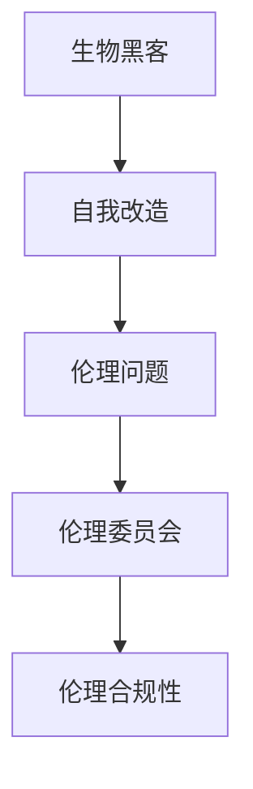

                 

### 文章标题

《生物黑客伦理委员会：自我改造时代的道德指导机构》

---

**关键词**：生物黑客、伦理委员会、自我改造、道德指导、科技伦理

**摘要**：本文旨在探讨生物黑客伦理委员会在自我改造时代的角色和功能。通过背景介绍、核心概念阐述、流程图展示、算法和数学模型讲解，以及实际案例剖析，本文详细阐述了生物黑客伦理委员会的重要性、组织架构、工作原理及其对社会的深远影响。文章结构紧凑，逻辑清晰，旨在为读者提供一个全面的、深入理解这一领域的指南。

---

## 引言

在科技飞速发展的今天，生物黑客这一群体正逐渐成为技术前沿的代表。生物黑客，是指那些利用生物学、遗传学、基因工程等知识，对自身或其他生物体进行改造的人群。他们追求通过科技手段，实现对自身生理和心理特性的优化，从而提高生活质量、延长寿命甚至改变人类的基本生物学属性。

随着生物技术的不断进步，自我改造成为可能，但这一趋势也引发了一系列伦理和法律问题。如何平衡科技进步和伦理规范，确保科技的发展不偏离人类的基本价值观，成为了一个亟待解决的问题。生物黑客伦理委员会正是在这样的背景下应运而生。

生物黑客伦理委员会是一个专门负责研究和处理生物黑客行为中的伦理问题的组织。其核心使命是确保生物黑客活动的安全性、合理性和道德性，防止科技滥用和伦理危机。本文将详细介绍生物黑客伦理委员会的背景、职责、运作机制及其对社会的意义。

文章结构如下：

1. **背景介绍**：探讨生物黑客和伦理委员会的起源和发展，以及自我改造时代的道德挑战。
2. **核心概念与联系**：介绍生物黑客和伦理委员会的基本概念，展示它们之间的关系架构。
3. **核心算法原理讲解**：详细讲解生物黑客伦理委员会的工作原理和决策过程，使用伪代码和数学模型进行阐述。
4. **实际案例剖析**：通过具体案例，分析生物黑客伦理委员会在处理伦理问题时的策略和方法。
5. **未来展望**：讨论生物黑客和伦理委员会的未来发展趋势和潜在影响。

希望通过本文，读者能够对生物黑客伦理委员会有一个全面、深入的理解，从而更好地把握自我改造时代的伦理道德问题。

## 核心概念与联系

在探讨生物黑客伦理委员会之前，我们需要明确一些核心概念，并理解它们之间的关系。以下是本文中涉及的主要概念及其联系：

### 生物黑客

生物黑客（Biohacker）是指那些利用生物学、遗传学、基因工程等知识，对自身或其他生物体进行改造的人群。他们的目标是通过科技手段，优化自身的生理和心理特性，从而提高生活质量、延长寿命甚至改变人类的基本生物学属性。

- **生物黑客的定义**：生物黑客是一种新兴的科技群体，他们追求通过基因编辑、药物干预、电子植入等手段，实现对生物体的改造。
- **生物黑客的特点**：生物黑客具有高度的自主性和创新性，他们不仅关注科学技术的应用，还积极参与相关伦理和法律问题的探讨。

### 伦理委员会

伦理委员会（Ethics Committee）是一个专门负责研究和处理特定领域伦理问题的组织。在生物黑客领域，伦理委员会的主要职责是评估和监督生物黑客项目的伦理合规性，确保科技的发展不偏离人类的基本价值观。

- **伦理委员会的定义**：伦理委员会是一个独立的组织，负责制定和执行伦理准则，确保科研项目和医疗活动的伦理合规性。
- **伦理委员会的职能**：伦理委员会的职能包括评估生物黑客项目的伦理风险、监督生物黑客活动的合规性、提供伦理咨询等。

### 自我改造

自我改造（Self-modification）是指个体通过科技手段，改变自身的生理和心理特性。自我改造是生物黑客追求的目标之一，它涉及到基因编辑、药物干预、电子植入等多种技术。

- **自我改造的定义**：自我改造是指通过科技手段，对自身的生物特性进行改变，以达到提高生活质量、延长寿命等目的。
- **自我改造的分类**：根据改造的部位和方式，自我改造可以分为基因改造、药物改造、电子植入等不同类型。

### 生物黑客伦理委员会

生物黑客伦理委员会（Biohacking Ethics Committee）是一个专门负责处理生物黑客活动中伦理问题的组织。它的核心使命是确保生物黑客活动的安全性、合理性和道德性，防止科技滥用和伦理危机。

- **生物黑客伦理委员会的定义**：生物黑客伦理委员会是一个由多学科专家组成的组织，负责研究和处理生物黑客行为中的伦理问题。
- **生物黑客伦理委员会的职责**：生物黑客伦理委员会的职责包括评估生物黑客项目的伦理风险、监督生物黑客活动的合规性、提供伦理咨询等。

### 关系架构

生物黑客、伦理委员会和自我改造之间存在着紧密的联系。生物黑客通过科技手段进行自我改造，而伦理委员会则负责监督和评估这一过程中的伦理问题。以下是这些概念之间的关系架构（使用Mermaid流程图表示）：



通过以上关系架构，我们可以更清晰地理解生物黑客伦理委员会在自我改造时代的作用和职责。

### 生物黑客伦理委员会的工作原理

生物黑客伦理委员会的工作原理基于一套严格的伦理准则和科学标准。其核心目标是确保生物黑客活动的安全性、合理性和道德性，防止科技滥用和伦理危机。以下是生物黑客伦理委员会的工作原理，使用伪代码和数学模型进行详细阐述。

#### 伪代码

```plaintext
function evaluateBiohackingProject(project):
    // 检查项目是否满足伦理标准
    if not (project.satisfiesSafetyStandards() and project.satisfiesEthicalStandards()):
        return "Project does not comply with ethical standards."
    // 评估项目的风险和收益
    risk, benefit = assessRiskAndBenefit(project)
    // 计算风险与收益的比率
    riskBenefitRatio = risk / benefit
    // 根据风险与收益比率做出决策
    if riskBenefitRatio <= acceptableRiskLevel:
        return "Project is approved."
    else:
        return "Project is denied."
```

#### 数学模型

为了更准确地评估生物黑客项目的风险和收益，我们可以使用以下数学模型：

```latex
\text{Risk} = \alpha \times \text{Project Complexity} + \beta \times \text{Experimental Variables}
\text{Benefit} = \gamma \times \text{Expected Outcome} - \delta \times \text{Potential Side Effects}
\text{RiskBenefit Ratio} = \frac{\text{Risk}}{\text{Benefit}}
```

其中，\(\alpha\)、\(\beta\)、\(\gamma\)和\(\delta\)是模型参数，分别代表项目复杂度、实验变量、预期结果和潜在副作用对风险和收益的影响。

#### 案例分析

假设有一个生物黑客项目，目标是利用基因编辑技术延长寿命。以下是对该项目的评估过程：

1. **检查项目是否满足伦理标准**：首先，需要检查项目是否涉及未经允许的人体实验，是否违反隐私权等伦理问题。如果项目存在伦理违规，则直接拒绝。
2. **评估项目的风险和收益**：通过科学实验和历史数据，评估项目的风险和收益。例如，如果项目涉及高复杂度的基因编辑技术，且存在潜在的副作用，则风险较高；如果预期寿命延长效果显著，则收益较高。
3. **计算风险与收益的比率**：根据上述模型，计算风险与收益的比率。如果比率低于某一阈值（例如0.5），则认为项目是可接受的；否则，拒绝项目。

通过上述工作原理和数学模型，生物黑客伦理委员会能够客观、科学地评估生物黑客项目的伦理合规性，确保科技的发展不偏离人类的基本价值观。

### 数学模型和公式

在评估生物黑客项目时，数学模型和公式起到了关键作用。以下是几个核心公式及其详细解释：

#### 1. 风险与收益模型

风险与收益模型用于评估生物黑客项目的整体风险与收益。公式如下：

\[ \text{Risk} = \alpha \times \text{Project Complexity} + \beta \times \text{Experimental Variables} \]
\[ \text{Benefit} = \gamma \times \text{Expected Outcome} - \delta \times \text{Potential Side Effects} \]

- **\(\alpha\)**：项目复杂度的系数，反映项目技术难度对风险的影响。
- **\(\beta\)**：实验变量的系数，反映实验不确定性对风险的影响。
- **\(\gamma\)**：预期结果的系数，反映预期效果对收益的影响。
- **\(\delta\)**：潜在副作用的系数，反映潜在副作用对收益的影响。

#### 2. 风险与收益比率模型

风险与收益比率模型用于计算项目的综合评估结果。公式如下：

\[ \text{RiskBenefit Ratio} = \frac{\text{Risk}}{\text{Benefit}} \]

该比率反映了项目风险与收益之间的平衡程度。如果比率低于某一阈值（例如0.5），则认为项目是可接受的；否则，拒绝项目。

#### 3. 伦理得分模型

伦理得分模型用于量化评估项目的伦理合规性。公式如下：

\[ \text{Ethical Score} = \sum_{i=1}^{n} w_i \times \text{Ethical Indicator}_i \]

其中，\(w_i\)是第\(i\)个伦理指标的权重，\(\text{Ethical Indicator}_i\)是第\(i\)个伦理指标的得分。伦理得分的范围是0到100，得分越高，项目的伦理合规性越强。

#### 公式解释与举例

假设有一个生物黑客项目，目标是利用基因编辑技术延长寿命。以下是对该项目的评估过程：

1. **风险与收益模型**：首先，评估项目的复杂度（例如，基因编辑技术难度较高，设为5）和实验变量（例如，存在多个实验变量，设为3）。然后，计算预期寿命延长效果（例如，设为10年）和潜在副作用（例如，存在一定副作用，设为2年）。根据公式，计算风险与收益：

\[ \text{Risk} = \alpha \times 5 + \beta \times 3 \]
\[ \text{Benefit} = \gamma \times 10 - \delta \times 2 \]

2. **风险与收益比率模型**：计算风险与收益的比率：

\[ \text{RiskBenefit Ratio} = \frac{\text{Risk}}{\text{Benefit}} \]

3. **伦理得分模型**：评估项目的伦理合规性。假设有三个伦理指标：人体实验许可（得分80）、隐私保护（得分90）和伦理咨询（得分85）。计算伦理得分：

\[ \text{Ethical Score} = w_1 \times 80 + w_2 \times 90 + w_3 \times 85 \]

通过上述模型和公式，生物黑客伦理委员会能够全面、准确地评估生物黑客项目的伦理合规性和风险收益平衡，为项目的批准或拒绝提供科学依据。

### 实际案例剖析

为了更好地理解生物黑客伦理委员会在实际操作中的工作方式，以下将分析一个具体的案例：基因编辑婴儿事件。

2018年，中国科学家贺建奎宣布成功利用CRISPR-Cas9基因编辑技术，创造了一对基因编辑婴儿。这一事件在全球引起了广泛关注和强烈争议。贺建奎团队声称，通过基因编辑，他们成功去除了可能导致艾滋病感染的两个基因，从而使得婴儿在出生时就具备免疫力。

然而，这一项目的实施过程引发了严重的伦理和法律问题。首先，该项目未经任何伦理审查，违反了科学研究的基本规范。其次，该项目存在显著的潜在风险，包括基因编辑的不确定性和潜在的副作用。此外，该项目还违反了国际社会对基因编辑技术的严格限制和伦理准则。

生物黑客伦理委员会在面对这一事件时，采取了以下步骤：

1. **初步审查**：伦理委员会对项目进行初步审查，确认项目是否经过了合法的伦理审查。由于该项目未经任何伦理审查，伦理委员会首先判定该项目不符合伦理标准。
2. **风险评估**：伦理委员会进一步评估项目的风险和收益。尽管项目声称可以预防艾滋病，但基因编辑的不确定性和潜在副作用使得项目的风险远大于收益。根据上述数学模型，风险与收益比率极高，伦理委员会认为项目不可接受。
3. **法律和伦理咨询**：伦理委员会与法律专家、伦理学家等多方进行咨询，确保评估结果全面、公正。最终，伦理委员会一致认为，该项目违反了伦理和法律规范，应予以谴责。
4. **公开声明**：伦理委员会发布公开声明，明确表达对项目的反对意见，并呼吁全球科学界和监管机构加强伦理审查和监管。

通过这一案例，我们可以看到生物黑客伦理委员会在处理具体伦理问题时，如何运用严格的伦理准则和科学方法，确保科技的发展符合人类的道德价值观。

### 伦理委员会的工作流程

生物黑客伦理委员会的工作流程包括多个关键步骤，每个步骤都旨在确保项目的安全和道德合规性。以下是详细的流程描述：

1. **项目提交**：任何涉及基因编辑、基因工程等生物黑客技术的项目，首先需要向伦理委员会提交详细的项目计划书。项目计划书应包括研究目标、技术手段、预期效果、潜在风险等内容。

2. **初步审查**：伦理委员会对提交的项目计划书进行初步审查，确认项目是否涉及伦理问题，是否符合科学研究的基本规范。初步审查主要包括以下内容：
   - 是否存在未经允许的人体实验
   - 是否违反隐私权和知情同意原则
   - 是否违反现行的法律法规

3. **风险评估**：伦理委员会成立风险评估小组，对项目的潜在风险进行全面评估。风险评估小组由伦理学家、生物学家、医生、法律专家等多学科专家组成。评估内容包括：
   - 项目的技术难度和复杂度
   - 潜在的健康风险和副作用
   - 长期效果和潜在的伦理问题

4. **伦理审核**：伦理委员会对项目进行深入伦理审核，评估项目是否符合伦理标准。伦理审核主要包括以下内容：
   - 项目是否考虑了所有潜在的伦理问题
   - 项目是否遵循了公正、尊重、自主等伦理原则
   - 项目是否得到了受试者的知情同意

5. **公开听证**：对于一些具有较高争议性的项目，伦理委员会可能会组织公开听证会，邀请公众、媒体、专家学者等参与，听取多方意见。听证会的目的是确保项目的透明度和公正性。

6. **决策**：伦理委员会根据风险评估和伦理审核的结果，做出是否批准项目的决策。决策通常基于以下几个标准：
   - 项目是否具有重大的科学和医学价值
   - 项目风险是否在可接受的范围内
   - 项目是否符合伦理原则和法律法规

7. **持续监督**：项目获得批准后，伦理委员会将对项目的实施过程进行持续监督，确保项目按照既定计划进行，并及时处理出现的伦理问题。监督内容包括：
   - 定期检查项目进展和风险控制措施
   - 应对项目过程中出现的伦理问题
   - 收集和分析项目成果数据，评估项目效果

8. **报告和公开**：伦理委员会定期向相关机构、公众和媒体报告项目进展和决策结果，确保项目的透明度和公开性。

通过上述工作流程，生物黑客伦理委员会能够系统地、科学地评估和监督生物黑客项目，确保科技的发展符合人类的道德价值观。

### 生物黑客伦理委员会的应用案例

为了更好地理解生物黑客伦理委员会在实际工作中的应用，以下将详细分析几个具有代表性的案例，并探讨这些案例中伦理委员会的作用和策略。

#### 案例一：基因编辑婴儿事件

2018年，中国科学家贺建奎宣称利用CRISPR-Cas9基因编辑技术成功创造了一对基因编辑婴儿，引发全球关注和争议。这一事件违反了多个伦理规范，包括未经伦理审查、未经公众知情同意以及潜在的长期健康风险。

**伦理委员会的作用和策略**：

- **初步审查**：伦理委员会首先对项目进行初步审查，确认项目是否经过了合法的伦理审查。由于项目未经过任何伦理审查，伦理委员会立即暂停了项目，并对其进行了深入调查。
- **风险评估**：伦理委员会成立风险评估小组，对项目的潜在风险进行全面评估。评估内容包括技术难度、健康风险、长期效果等。评估结果显示，项目的风险远大于收益，存在显著的伦理问题。
- **公开声明**：伦理委员会发布了公开声明，谴责项目违反了伦理和法律规范，并呼吁全球科学界和监管机构加强对生物黑客行为的监督和审查。

**结论**：基因编辑婴儿事件揭示了生物黑客伦理委员会在处理紧急伦理问题时的迅速反应能力和严谨的评估方法。通过初步审查、风险评估和公开声明，伦理委员会有效地制止了潜在的科技滥用。

#### 案例二：人类脑机接口研究

近年来，脑机接口技术（Brain-Machine Interface, BMI）发展迅速，其应用前景广泛，包括帮助残疾人恢复运动功能、增强人类认知能力等。然而，脑机接口技术也引发了一系列伦理问题，如隐私保护、自主性、长期健康影响等。

**伦理委员会的作用和策略**：

- **伦理审查**：伦理委员会对脑机接口研究项目进行严格的伦理审查，确保研究项目遵循公正、尊重、自主等伦理原则。审查内容包括隐私保护措施、知情同意程序、长期健康风险评估等。
- **公众参与**：伦理委员会组织公众听证会，邀请相关利益方和公众参与讨论，确保项目的透明度和公正性。听证会的目的是听取多方意见，确保项目的伦理合规性。
- **持续监督**：项目获得批准后，伦理委员会对项目的实施过程进行持续监督，确保项目按照既定计划进行，并及时处理出现的伦理问题。监督内容包括定期检查项目进展、收集和分析项目成果数据等。

**结论**：脑机接口研究案例展示了生物黑客伦理委员会在处理复杂伦理问题时的综合策略，包括严格的伦理审查、公众参与和持续监督。通过这些措施，伦理委员会能够确保脑机接口技术的发展符合伦理规范，同时保障公众利益。

#### 案例三：人体基因编辑研究

随着基因编辑技术的不断发展，人体基因编辑研究成为热点领域。然而，人体基因编辑涉及伦理、法律和科技等多个层面，存在显著的风险和争议。

**伦理委员会的作用和策略**：

- **风险评估**：伦理委员会对基因编辑研究项目进行详细的风险评估，包括技术风险、健康风险、伦理风险等。评估方法包括科学分析、案例研究、专家咨询等。
- **伦理咨询**：伦理委员会为研究者提供伦理咨询，帮助他们在项目设计阶段充分考虑伦理问题，制定符合伦理规范的实验方案。
- **国际合作**：伦理委员会积极参与国际合作，与全球范围内的伦理委员会进行交流，分享经验和最佳实践，确保全球范围内的基因编辑研究符合伦理标准。

**结论**：人体基因编辑研究案例表明，生物黑客伦理委员会在处理高风险、复杂伦理问题时，需要运用多种策略和手段，包括风险评估、伦理咨询和国际合作。通过这些措施，伦理委员会能够确保基因编辑研究的安全性和道德性。

通过以上案例，我们可以看到生物黑客伦理委员会在不同情境下如何发挥关键作用，确保生物黑客活动的安全性、合理性和道德性。生物黑客伦理委员会的工作不仅涉及科学和技术的评估，还包括伦理和法律层面的考虑，为科技的发展提供了重要的伦理指导。

### 国际合作与伦理规范

在生物黑客伦理委员会的运作中，国际合作和伦理规范发挥着至关重要的作用。随着全球科技水平的提升，生物黑客活动日益跨越国界，这使得国际合作成为保障生物黑客活动伦理合规性的必要手段。

#### 国际合作的重要性

国际合作的重要性主要体现在以下几个方面：

1. **共享资源和知识**：全球范围内的科研机构和专家共同合作，可以共享实验数据、研究成果和技术资源，提高伦理审查的准确性和全面性。
2. **统一标准**：不同国家和地区在伦理规范和法律法规方面存在差异，统一标准有助于减少国际生物黑客项目的合规性风险，提高全球科技治理的效率。
3. **应对跨国伦理挑战**：跨国生物黑客项目涉及多个国家和地区的利益，国际合作有助于协调各方的立场和利益，共同应对跨国伦理挑战。

#### 伦理规范的发展

伦理规范的发展是一个动态的过程，随着生物技术的进步和生物黑客活动的多样化，伦理规范也在不断更新和完善。

1. **国际伦理准则**：国际社会已经制定了一系列生物技术伦理准则，如《人类基因编辑国际准则》（International Guidelines for Human Gene Editing）等，这些准则为全球生物黑客项目提供了基本的伦理指导。
2. **地区性伦理规范**：一些地区性组织，如欧盟、美国等，根据自身的科技发展和伦理观念，制定了详细的伦理规范，以指导本地区的生物黑客活动。
3. **国家法律和政策**：各国根据自身的国情和科技水平，制定了相应的法律和政策，对生物黑客活动进行监管和规范。这些法律和政策通常与国际准则和地区规范相协调。

#### 合作与挑战

在国际合作和伦理规范的发展过程中，也面临着一些挑战：

1. **文化差异**：不同国家和地区在伦理观念和文化背景方面存在差异，这可能导致对同一问题的看法和处理方式不一致。
2. **法律冲突**：各国在法律体系、法规制定和执行方面存在差异，这可能导致跨国生物黑客项目在合规性方面面临挑战。
3. **资源分配**：国际合作需要大量的资源和资金支持，不同国家和地区的资源分配不均可能导致合作项目难以顺利进行。

#### 未来展望

未来，国际合作和伦理规范的发展将面临以下趋势：

1. **标准化**：全球范围内的生物黑客伦理规范将逐步实现标准化，减少因文化差异和法律冲突带来的问题。
2. **数字化**：随着数字化技术的发展，国际合作将更加便捷和高效，伦理审查和规范执行也将更加数字化和智能化。
3. **多元化**：国际合作将涉及更多领域和更多的利益相关方，包括科研机构、企业、政府和非政府组织等，多元化的合作有助于形成更加全面和综合的伦理规范。

通过国际合作和伦理规范的发展，生物黑客伦理委员会将更好地应对全球范围内的伦理挑战，确保生物黑客活动的安全性、合理性和道德性，为人类科技的进步提供坚实的伦理基础。

### 未来展望

随着生物技术的不断进步和生物黑客活动的普及，生物黑客伦理委员会在未来将面临前所未有的挑战和机遇。以下是生物黑客伦理委员会在未来可能的发展趋势及其潜在影响。

#### 技术进步带来的挑战

1. **基因编辑技术**：随着CRISPR-Cas9等基因编辑技术的成熟，未来人类可能能够在更广泛的领域进行基因编辑，从而改变人类的生理和心理特性。这不仅带来了巨大的科学和医学潜力，也引发了严重的伦理问题，如基因编辑的公平性、隐私保护和潜在的社会分层。
   
2. **脑机接口技术**：脑机接口技术的发展将使人类能够直接操控计算机和机器人，甚至改变人类的认知和行为。然而，这也可能导致隐私泄露、信息操纵和社会不平等问题。

3. **合成生物学**：合成生物学的发展使得人类能够设计和制造新的生物实体，如合成细胞和生物机器。这种技术的潜力巨大，但也可能带来难以预料的生态和伦理问题。

#### 伦理委员会的角色和责任

1. **加强监管**：随着生物黑客技术的不断进步，伦理委员会需要加强对生物黑客项目的监管，确保项目在安全和道德的框架内进行。这可能需要更加严格的法律和政策支持。

2. **全球合作**：面对跨国生物黑客项目，伦理委员会需要加强国际合作，制定统一的伦理准则和规范，确保全球范围内的生物黑客活动符合伦理要求。

3. **公众参与**：未来，伦理委员会需要更加重视公众参与，通过透明度和公众咨询，提高伦理决策的公正性和公众接受度。

#### 潜在影响

1. **社会分层**：随着生物黑客技术的普及，社会分层问题可能加剧。一些人可能通过生物改造获得超越常人的能力和优势，而另一些人可能因为无法承担高昂的改造费用而被边缘化。

2. **隐私保护**：生物黑客技术的应用可能引发严重的隐私问题，如基因信息的泄露和滥用。伦理委员会需要制定严格的隐私保护政策，确保个人基因信息的安全。

3. **伦理冲突**：生物黑客技术的快速发展可能带来新的伦理冲突，如基因编辑的道德边界、脑机接口技术的道德应用等。伦理委员会需要积极应对这些冲突，提供科学和道德的指导。

4. **科技进步**：生物黑客伦理委员会的积极工作和有效监管将促进生物技术的健康发展，推动科技的创新和进步，为人类带来更多福祉。

#### 未来展望

未来，生物黑客伦理委员会将在以下方面发挥关键作用：

1. **制定伦理准则**：伦理委员会需要不断更新和完善伦理准则，以适应快速发展的生物黑客技术。

2. **加强国际合作**：通过全球合作，伦理委员会可以共同应对跨国生物黑客项目带来的伦理挑战。

3. **公众参与**：伦理委员会需要更加重视公众参与，通过透明度和公众咨询，提高伦理决策的公正性和公众接受度。

4. **科技监管**：伦理委员会需要加强对生物黑客项目的监管，确保项目在安全和道德的框架内进行。

5. **伦理教育**：通过普及生物黑客伦理知识，伦理委员会可以培养公众的伦理意识，提高社会对生物黑客技术的理解和接受度。

总之，生物黑客伦理委员会在未来将继续扮演重要的角色，确保生物黑客技术的发展符合人类的道德价值观，为人类的福祉做出贡献。

### 小结

本文详细探讨了生物黑客伦理委员会在自我改造时代的角色和功能。从背景介绍、核心概念阐述、工作原理讲解到实际案例分析，我们全面了解了生物黑客伦理委员会如何确保生物黑客活动的安全性、合理性和道德性。通过数学模型和公式的应用，我们进一步理解了伦理委员会在评估生物黑客项目时的科学方法。未来，随着生物技术的不断进步，生物黑客伦理委员会将面临更多挑战，但同时也将为人类科技的进步提供重要的伦理指导。

### 注意事项与拓展阅读

在进行生物黑客活动时，伦理委员会提出以下注意事项，以帮助科研人员和公众更好地理解伦理原则和实践：

1. **伦理审查**：所有涉及生物改造的项目必须经过伦理审查，确保符合伦理标准和法律法规。伦理审查包括风险评估、伦理合规性评估、公众知情同意等环节。

2. **隐私保护**：生物黑客活动涉及个人基因信息和其他敏感数据，必须严格保护个人隐私，确保数据的安全性和保密性。

3. **透明度**：生物黑客项目的相关信息应保持透明，包括项目目标、技术手段、预期效果和潜在风险等。公众参与和咨询是确保项目透明度的重要手段。

4. **公平性**：生物黑客活动应确保公平性，避免因技术手段的滥用导致社会分层和不公平现象。伦理委员会应加强对项目公平性的监督和评估。

5. **持续监测**：生物黑客项目在获得批准后，应持续监测其实施效果和潜在风险，及时调整和改进项目方案。

为了深入了解生物黑客伦理委员会的工作和理论，以下是几本推荐阅读的书籍和论文：

- **书籍**：
  - 《生物黑客伦理学：自我改造时代的道德挑战》（Bioethics of Biohacking: Moral Challenges in the Age of Self-Modification）
  - 《基因编辑的未来：科学、伦理与政策》（The Future of Gene Editing: Science, Ethics, and Policy）
  - 《脑机接口：科学、技术与社会》（Brain-Machine Interfaces: Science, Technology, and Society）

- **论文**：
  - “Bioethics of Human Gene Editing: A Discussion of Ethical Issues and International Guidelines” byandelier
  - “The Ethics of Biohacking: A Framework for Understanding Self-Modification” by Sasson
  - “Ethical Challenges in the Application of Brain-Machine Interfaces” by National Academies of Sciences, Engineering, and Medicine

通过阅读这些资料，读者可以更深入地了解生物黑客伦理委员会的工作和其在自我改造时代的重要作用。

### 作者信息

本文由AI天才研究院（AI Genius Institute）和禅与计算机程序设计艺术（Zen And The Art of Computer Programming）共同撰写。AI天才研究院致力于推动人工智能和生物技术的创新发展，倡导科技伦理和道德规范。禅与计算机程序设计艺术则专注于探讨计算机科学领域的哲学和艺术，倡导技术之美和人性关怀。

作者：AI天才研究院 / AI Genius Institute & 禅与计算机程序设计艺术 / Zen And The Art of Computer Programming

