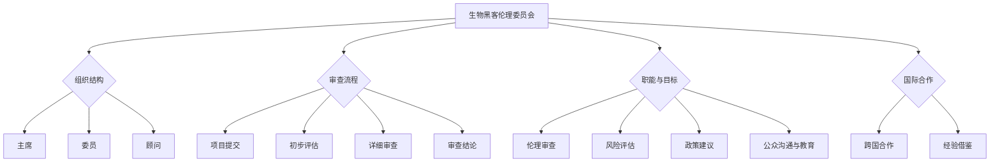

                 

### 前言

在现代社会，生物技术的发展日新月异，自我改造已成为可能。自我改造，指的是通过生物技术手段，如基因编辑、纳米技术、生物电子等，对自身的生物学特征进行改变，以满足个人需求或提升个人能力。这种技术的进步无疑为人类带来了前所未有的机遇，但也伴随着巨大的伦理挑战。

生物黑客，是指那些利用生物学和生物工程学的知识，对自身或他人进行非传统医疗手段改造的人。他们追求个性化的身体改造，探索技术的边界。然而，这种追求往往超越了现有伦理和法律的框架，引发了一系列的伦理问题。例如，基因编辑技术的滥用可能导致遗传不公，纳米技术的应用可能引发新的疾病，生物电子的植入可能侵犯个人隐私等。

面对这些伦理挑战，设立一个专门的道德监管机构——生物黑客伦理委员会，显得尤为重要。生物黑客伦理委员会的作用在于，通过对生物黑客项目进行伦理审查，确保这些项目在符合伦理标准的前提下进行。此外，委员会还需要评估项目可能带来的风险，并向政府和社会提供政策建议，以促进生物技术的健康发展。

本书旨在探讨生物黑客伦理委员会的作用和重要性，以及如何构建一个有效的自我改造的道德监管机构。通过详细分析生物黑客的定义、特点、自我改造的种类和趋势，以及生物黑客伦理委员会的职能和目标，我们将逐步揭示这一领域的复杂性和挑战性。同时，通过实际案例的剖析，我们将更好地理解如何应对这些挑战，并探讨未来生物黑客伦理委员会的发展方向。

在此过程中，我们将使用逻辑清晰、结构紧凑、简单易懂的专业技术语言，确保读者能够全面、深入地理解生物黑客伦理委员会的运作机制和重要性。我们希望这本书能够为研究人员、政策制定者、伦理学家以及广大公众提供有价值的参考，共同推动生物技术的发展，同时确保其在伦理和道德的框架内进行。

### 1. 生物黑客与自我改造

在探讨生物黑客伦理委员会的作用之前，我们首先需要了解什么是生物黑客，以及自我改造的具体含义和种类。生物黑客和自我改造不仅是当前生物技术领域的重要话题，也是伦理和社会学研究的重点。

#### 1.1 生物黑客的定义与特点

生物黑客，也称为“生物工程师”或“生物艺术家”，是指那些利用生物学和生物工程学的知识，对自身或他人进行非传统医疗手段改造的人。与传统的医疗手段不同，生物黑客更倾向于通过技术手段来改变自身的生物学特征，以达到个人化的医疗或提升个人能力的目的。

生物黑客的特点主要包括以下几点：

1. **个性化需求**：生物黑客追求个性化的身体改造，根据个人的需求和愿望来定制医疗方案，这与传统医学强调“标准化”治疗形成鲜明对比。
   
2. **技术创新**：生物黑客往往擅长使用最新的生物技术，如基因编辑、纳米技术、生物电子等，来探索和实现自我改造的目标。

3. **跨学科知识**：生物黑客需要具备丰富的生物学、工程学、计算机科学等多学科知识，以便更好地理解和应用这些先进技术。

4. **伦理争议**：由于生物黑客的技术手段超越了传统的医疗和法律框架，因此他们在进行自我改造时往往会引发伦理和法律上的争议。

#### 1.2 自我改造的种类与趋势

自我改造的种类繁多，涵盖了从基因层面到身体植入物等多个层次。以下是一些常见的自我改造种类和其发展趋势：

1. **基因编辑**：基因编辑技术，如CRISPR-Cas9，允许科学家对DNA序列进行精确修改。这使得人类可以修改自身的遗传信息，预防和治疗遗传性疾病，甚至改变个人的外貌和智力水平。随着基因编辑技术的不断进步，其应用范围也在不断扩大。

2. **纳米技术**：纳米技术在生物黑客中的应用日益广泛，包括纳米机器人、纳米药物等。纳米机器人可以用来治疗疾病，如清除血管中的血栓，而纳米药物则可以精确地递送到目标细胞，提高治疗效果。

3. **生物电子**：生物电子技术的应用包括将生物传感器和电子设备植入人体，以监测生物信号或增强人体功能。例如，心脏起搏器和人工耳蜗就是生物电子技术的典型应用。

4. **生物材料**：生物材料可以用来制造植入物，如人工关节、心脏瓣膜等。这些植入物可以与人体组织实现更好的兼容，延长使用寿命。

#### 1.3 技术进步与自我改造的可行性

随着生物技术的进步，自我改造的可行性不断增加。以下是几个关键因素：

1. **基因编辑技术的精确性和效率**：现代基因编辑技术使得对DNA的修改更加精准和高效，降低了操作的风险和成本。

2. **纳米技术的突破**：纳米技术的快速发展使得纳米机器人和纳米药物等应用成为可能，这些技术有望在未来改变医疗模式。

3. **生物电子的进步**：生物电子设备的小型化和智能化使得植入人体的电子设备更加便捷和高效，为生物黑客提供了新的工具。

4. **生物材料的改进**：新型生物材料的开发，如可降解材料、具有生物相容性的材料，使得植入物的长期效果和安全性得到了显著提升。

总之，生物黑客和自我改造已经成为生物技术领域的一个重要现象。随着技术的不断进步，自我改造的可行性和应用范围将不断扩大。然而，这也带来了新的伦理挑战，需要通过设立专门的道德监管机构，如生物黑客伦理委员会，来确保这些技术的发展不会对社会和个人造成不可逆转的伤害。

### 2. 生物黑客伦理委员会的成立背景

生物黑客伦理委员会的成立背景主要源于生物技术的快速发展及其带来的伦理挑战。随着基因编辑、纳米技术、生物电子等前沿生物技术的不断突破，人们开始有能力通过自我改造来改变自身的生物学特征。然而，这种技术的快速发展也引发了大量的伦理争议和社会问题，需要通过设立专门的道德监管机构来指导和规范这一领域的发展。

#### 2.1 技术发展的必然需求

首先，技术的发展速度远远超过了伦理法规的更新。传统伦理法规往往难以应对新兴技术带来的伦理问题，导致这些问题的解决往往滞后。例如，基因编辑技术虽然带来了巨大的医疗潜力，但其潜在的伦理风险，如基因编辑的滥用可能导致遗传不公，对未出生婴儿的影响等，需要及时进行伦理审查和监管。

其次，自我改造技术的广泛应用迫切需要建立相应的道德监管机制。生物黑客的行为往往超越现有法律和道德框架，需要进行规范和指导。例如，一些人可能会通过基因编辑来增强自身能力或改变外貌，这种行为的合理性和道德性需要通过伦理审查来评估。此外，自我改造技术的应用可能涉及个人隐私和安全问题，需要设立专门的机构来确保这些技术的应用不会侵犯个人权利。

#### 2.2 国际经验借鉴

在国际上，一些国家和地区已经成立了专门的生物伦理委员会，为生物技术的应用提供了伦理指导和监管。以下是几个典型的国际经验：

1. **美国国家生物伦理委员会（National Bioethics Commission）**：美国国家生物伦理委员会成立于1995年，其职责包括对基因编辑、克隆等前沿生物技术的应用进行伦理评估，并向政府和社会提供政策建议。该委员会的经验为其他国家和地区提供了重要的参考。

2. **欧洲生物伦理委员会（European Group on Ethics in Science and New Technologies）**：欧洲生物伦理委员会成立于1998年，其任务是就科学技术发展带来的伦理、法律和社会问题向欧洲议会和欧洲委员会提供意见。该委员会在基因编辑、人类胚胎研究等领域的伦理审查方面具有丰富的经验。

3. **英国人类遗传学顾问委员会（Human Genetics Commission）**：英国人类遗传学顾问委员会成立于2001年，其职责包括对基因编辑、克隆等生物技术进行伦理评估，并向政府和社会提供政策建议。该委员会的工作在英国基因编辑法规的制定中发挥了重要作用。

通过借鉴这些国际经验，生物黑客伦理委员会可以更好地建立和完善其伦理审查机制，确保自我改造技术的应用在符合伦理和道德标准的前提下进行。

#### 2.3 国内需求与政策响应

在国内，随着生物技术的迅速发展，生物黑客伦理委员会的成立也变得尤为迫切。首先，国内生物技术的应用已经广泛渗透到医疗、农业、工业等多个领域，这带来了大量的伦理问题。例如，基因编辑技术在医学领域的应用已经取得了一些突破，但在伦理审查方面还存在不少问题。成立生物黑客伦理委员会可以填补这一监管空白，确保这些技术的应用符合伦理和道德标准。

其次，国内对生物黑客伦理委员会的需求日益增加。随着人们生活水平的提高和对健康需求的增加，越来越多的人开始关注自我改造技术。例如，基因编辑技术被广泛用于治疗遗传性疾病，但其在伦理和道德上的争议也日益凸显。此外，随着人工智能和大数据技术的发展，个人隐私和安全问题也日益突出，需要通过设立专门的伦理委员会来保护这些权利。

为了响应这一需求，国内已经采取了一些初步措施。例如，国家卫生健康委员会设立了生物医学伦理委员会，对基因编辑等生物技术进行伦理审查。然而，这些机构的职责范围相对有限，难以全面覆盖生物黑客伦理领域的各个方面。因此，成立一个专门的生物黑客伦理委员会，可以更好地满足国内生物黑客伦理监管的需求。

综上所述，生物黑客伦理委员会的成立背景主要源于技术发展的必然需求和国际经验的借鉴，同时也是国内需求和政策的响应。通过设立这一机构，可以更好地应对生物黑客带来的伦理挑战，确保生物技术的健康发展。

### 3. 生物黑客伦理委员会的职能与目标

生物黑客伦理委员会作为专门负责生物黑客领域伦理审查和监管的机构，其职能和目标至关重要。以下是该委员会的主要职能和目标，通过这些职能和目标，我们将进一步理解其在生物黑客伦理监管中的重要性。

#### 3.1 职能

生物黑客伦理委员会的职能包括但不限于以下几个方面：

1. **伦理审查**：
   - **项目评估**：对生物黑客项目进行全面的伦理评估，确保项目的设计和实施符合伦理标准。
   - **风险识别**：识别和评估项目可能带来的伦理风险，包括遗传不公、隐私侵犯、生物安全等。
   - **合规性检查**：检查项目是否符合法律法规和伦理规范，确保项目的合法性和道德性。

2. **风险评估**：
   - **潜在风险分析**：对项目可能产生的长期和短期风险进行详细分析，包括技术风险、社会风险、环境风险等。
   - **防范措施制定**：根据风险评估的结果，制定相应的防范措施，以减少或避免潜在风险的影响。

3. **政策建议**：
   - **制定政策**：根据伦理审查和风险评估的结果，制定相关的伦理政策和指导原则。
   - **发布报告**：定期发布关于生物黑客伦理问题的研究报告，为政府、学术界和公众提供决策参考。

4. **公众沟通与教育**：
   - **科普宣传**：通过多种渠道向公众普及生物黑客伦理知识，提高公众的伦理意识。
   - **教育项目**：组织相关的教育和培训项目，提高生物黑客和生物技术从业者的伦理素养。

#### 3.2 目标

生物黑客伦理委员会的主要目标包括以下几个方面：

1. **保护个人隐私与权利**：
   - **隐私保护**：确保个人在自我改造过程中隐私不受侵犯，尤其是在基因编辑、生物电子等领域。
   - **权利维护**：保障个人的知情权和选择权，确保个人在参与生物黑客项目前充分了解相关风险和伦理问题。

2. **促进技术发展**：
   - **推动创新**：在确保伦理和安全的前提下，推动生物黑客技术的创新和发展。
   - **技术应用**：鼓励和支持生物黑客项目在医疗、农业、工业等领域的应用，提高生物技术的实际效益。

3. **构建社会共识**：
   - **对话与交流**：通过公众沟通和教育，促进社会各界对生物黑客伦理问题的认识和共识。
   - **政策制定**：参与相关政策和法律法规的制定，确保这些政策能够在伦理和社会接受范围内进行。

4. **国际合作与交流**：
   - **跨国合作**：与其他国家和国际组织的生物黑客伦理委员会进行合作和交流，共同应对全球性的生物黑客伦理挑战。
   - **经验借鉴**：借鉴国际先进经验和最佳实践，提高自身的审查和监管能力。

通过以上职能和目标的实施，生物黑客伦理委员会将在确保生物技术发展的同时，有效管理和规避伦理风险，保护个人和社会的利益。这将有助于推动生物黑客领域的健康发展，并为社会带来更大的福祉。

### 4. 生物黑客伦理委员会的运行机制

为了确保生物黑客伦理委员会能够有效地履行其职能和实现其目标，其运行机制的设计至关重要。以下将从组织结构、审查流程等方面详细探讨生物黑客伦理委员会的运行机制。

#### 4.1 组织结构

生物黑客伦理委员会的组织结构应当包括多个层次，以确保其能够高效运作。以下是典型的组织结构：

1. **委员会成员**：
   - **主席**：通常由具有丰富生物技术背景和伦理学知识的专家担任，负责委员会的整体运作和决策。
   - **委员**：包括生物学家、伦理学家、法律专家、医学专家、社会学家、政策制定者等跨学科领域的专家，以确保审查的全面性和专业性。
   - **顾问**：邀请相关领域的国际知名专家作为顾问，为委员会提供专业意见和指导。

2. **办事机构**：
   - **秘书处**：负责日常运作，包括项目受理、文件管理、会议组织、数据分析和报告撰写等。
   - **项目管理组**：专门负责具体项目的审查和管理，包括初步评估、详细审查和风险评估等。

3. **专门委员会**：
   - **基因编辑审查委员会**：负责基因编辑项目的伦理审查，制定相关审查标准和流程。
   - **纳米技术审查委员会**：负责纳米技术项目的审查，评估其潜在风险和伦理影响。
   - **生物电子审查委员会**：负责生物电子项目的审查，确保其应用符合伦理和安全标准。

#### 4.2 审查流程

生物黑客伦理委员会的审查流程应当严谨、透明，以确保每一个项目都经过严格的伦理评估。以下是典型的审查流程：

1. **项目提交**：
   - **申请人提交**：生物黑客项目申请人将项目方案提交给生物黑客伦理委员会。
   - **初步评估**：委员会秘书处对提交的项目进行初步评估，确保项目符合提交要求。

2. **初步审查**：
   - **会议讨论**：委员会成员对项目进行初步审查，讨论项目的伦理问题和技术可行性。
   - **风险评估**：项目管理组对项目进行详细的风险评估，包括伦理风险、技术风险和社会风险等。

3. **详细审查**：
   - **专家评审**：邀请相关领域的专家进行评审，对项目的具体细节进行深入分析。
   - **公众意见征询**：在必要时，向公众公开征求意见，以增加审查的透明度和公众参与度。

4. **审查结论**：
   - **通过或拒绝**：根据审查结果，委员会作出通过或拒绝项目的决定。
   - **建议与整改**：对于不符合伦理标准的项目，委员会会提出建议和整改方案，指导申请人进行修改。

5. **监督与跟踪**：
   - **项目执行监督**：在项目实施过程中，委员会对项目的执行情况进行监督，确保项目符合伦理标准。
   - **定期评估**：定期对项目进行评估，确保其长期符合伦理和安全要求。

#### 4.3 审查标准与法规

为了确保审查的公正性和一致性，生物黑客伦理委员会应当制定详细的审查标准和法规。这些标准和法规应当涵盖以下几个方面：

1. **伦理原则**：
   - **尊重个人自主权**：确保个人在参与项目前充分了解项目的风险和伦理问题，并自愿参与。
   - **公正性**：确保项目的利益分配公正，避免遗传不公和社会歧视。
   - **无害性**：确保项目的实施不会对参与者造成不必要的伤害。

2. **技术标准**：
   - **安全性**：确保项目应用的技术是成熟和可靠的，不会对参与者或社会造成不可逆的负面影响。
   - **有效性**：确保项目的技术效果是有效的，能够实现预期的目标。

3. **法律法规**：
   - **合规性**：确保项目符合现行的法律法规，特别是涉及基因编辑、生物材料、医疗器械等方面的法律法规。

4. **国际标准**：
   - **参照国际先进经验**：借鉴国际上先进的伦理审查标准和最佳实践，提高审查的专业性和权威性。

通过以上运行机制的设计，生物黑客伦理委员会将能够有效应对生物黑客领域的伦理挑战，确保技术的发展在伦理和安全的前提下进行，从而为社会的可持续发展提供保障。

### 5. 生物黑客伦理委员会的实际案例

#### 5.1 基因编辑婴儿事件

**事件概述**：

2018年11月，中国科学家贺建奎宣布成功利用CRISPR-Cas9基因编辑技术制造了世界首例基因编辑婴儿。这两个婴儿被设计具有抵抗HIV的能力。这一事件在全球范围内引起了轩然大波，引发了关于基因编辑伦理的广泛讨论。

**伦理争议**：

这一事件引发了多方面的伦理争议：

1. **未经充分伦理审查**：贺建奎团队并未通过生物黑客伦理委员会的审查，其行为违反了相关伦理审查程序。

2. **知情同意问题**：参与实验的夫妇并未充分了解基因编辑的潜在风险，也没有得到充分的知情同意。

3. **遗传不公**：基因编辑婴儿的诞生可能导致遗传上的不平等，引发社会的不公和歧视。

4. **对后代的影响**：基因编辑可能对后代产生不可预测的长期影响，对人类基因池的稳定性构成潜在威胁。

**生物黑客伦理委员会的应对**：

针对基因编辑婴儿事件，生物黑客伦理委员会采取了一系列应对措施：

1. **公开谴责**：生物黑客伦理委员会发表声明，严厉谴责这一行为，认为其违反了伦理审查程序和基本伦理原则。

2. **调查与问责**：启动调查，追究责任人的责任，包括贺建奎及其团队。

3. **加强监管**：加强对基因编辑项目的审查和监管，制定更加严格的伦理审查标准和程序。

4. **公众教育**：通过媒体和公众教育项目，提高公众对基因编辑伦理问题的认识，避免类似事件的再次发生。

#### 5.2 纳米机器人应用案例

**应用领域**：

纳米机器人技术被广泛应用于医疗、军事、环境监测等领域。在医疗领域，纳米机器人被设计用于清除血管中的血栓、靶向递送药物、修复受损组织等。然而，其广泛应用也带来了新的伦理挑战。

**伦理挑战**：

1. **生物安全**：纳米机器人可能对生物系统产生不可预测的影响，导致新的疾病或生物污染。

2. **隐私侵犯**：纳米机器人可能被用于监控个人生物信号，侵犯个人隐私。

3. **军事应用**：纳米机器人可以被用于军事目的，如生物战或网络战，引发新的安全威胁。

**生物黑客伦理委员会的审查**：

针对纳米机器人的应用，生物黑客伦理委员会进行了严格的审查：

1. **技术评估**：评估纳米机器人的技术可行性、安全性和有效性。

2. **伦理审查**：对纳米机器人的应用进行全面的伦理评估，确保其应用符合伦理标准。

3. **风险评估**：评估纳米机器人可能带来的风险，包括生物安全风险、隐私风险、军事应用风险等。

4. **公众参与**：在审查过程中，邀请公众参与讨论，增加审查的透明度和公众信任。

**审查结论**：

生物黑客伦理委员会最终决定对部分纳米机器人项目进行审查，并对通过审查的项目提出了一系列安全措施和伦理要求，以确保其在应用过程中的安全性和道德性。

### 6. 生物黑客伦理委员会的未来发展

随着生物技术的不断进步，生物黑客伦理委员会在未来将面临更多的挑战和机遇。以下是几个关键的发展方向：

#### 6.1 国际合作

生物黑客伦理委员会需要在国际合作方面加强努力。生物技术是一个全球性的问题，需要各国共同努力来解决。通过国际合作，委员会可以借鉴其他国家和地区的经验，制定更加全面和有效的伦理审查标准。同时，国际合作还可以促进技术交流和知识共享，提高全球生物黑客伦理监管的整体水平。

#### 6.2 技术发展

随着基因编辑、纳米技术、生物电子等前沿生物技术的快速发展，生物黑客伦理委员会需要不断更新其审查标准和流程，以适应新的技术挑战。例如，对于新兴的基因编辑技术，委员会需要制定更加详细的伦理审查指南，以确保其在应用过程中的安全性和道德性。同时，委员会还需要关注技术发展的最新趋势，提前预测可能出现的伦理问题，并提出相应的解决方案。

#### 6.3 公众教育

公众教育是生物黑客伦理委员会的重要任务之一。通过提高公众对生物黑客伦理问题的认识，委员会可以增强公众的伦理意识，减少不必要的恐慌和误解。公众教育可以通过多种形式进行，如科普讲座、媒体报道、在线教育平台等。此外，委员会还可以与学校、社区等机构合作，开展有针对性的教育活动，提高公众对生物黑客伦理问题的理解和参与度。

#### 6.4 政策建议

生物黑客伦理委员会在制定政策建议方面发挥着关键作用。通过分析最新的生物技术进展和伦理争议，委员会可以为政府和社会提供科学的政策建议，帮助制定合理的法律法规和伦理准则。例如，针对基因编辑技术的应用，委员会可以提出关于知情同意、数据保护、风险评估等方面的政策建议，确保技术的安全性和道德性。

#### 6.5 法规制定

生物黑客伦理委员会还需要积极参与法规的制定和修订。在现有的法律框架下，一些生物技术应用的伦理监管仍存在空白。通过参与法规的制定和修订，委员会可以推动立法进程，填补监管漏洞，确保生物技术的应用在法律和伦理的双重保障下进行。

#### 6.6 长期规划

生物黑客伦理委员会的长期发展需要明确的规划和目标。委员会需要制定长期规划，包括技术发展路线图、伦理审查流程优化、国际合作战略等。通过这些规划，委员会可以确保其工作在长期内保持一致性和连续性，为生物技术的健康发展提供坚实的支持。

总之，生物黑客伦理委员会在未来需要在国际合作、技术发展、公众教育、政策建议、法规制定和长期规划等方面不断努力，以应对生物黑客领域日益复杂的伦理挑战，推动生物技术的可持续发展。

### 7. 总结

本文从多个角度详细探讨了生物黑客伦理委员会的作用、背景、职能与目标、运行机制以及实际案例。通过这一系列的分析，我们可以清晰地看到，生物黑客伦理委员会在确保生物技术健康发展、维护个人和社会利益方面的重要性。

首先，生物黑客伦理委员会作为专门负责生物黑客领域伦理审查和监管的机构，其核心职能包括伦理审查、风险评估、政策建议和公众沟通等。这些职能确保了生物黑客项目在符合伦理标准的前提下进行，避免了潜在的伦理风险和社会问题。

其次，生物黑客伦理委员会的成立背景源于生物技术的快速发展及其带来的伦理挑战。通过借鉴国际经验，委员会能够更好地建立和完善其伦理审查机制，确保自我改造技术的应用在符合伦理和道德标准的前提下进行。

在具体运行机制方面，生物黑客伦理委员会通过严谨的组织结构和透明的审查流程，确保每一个项目都经过严格的伦理评估。同时，审查标准和法规的制定也为伦理审查提供了明确依据，保障了审查的公正性和一致性。

通过分析实际案例，如基因编辑婴儿事件和纳米机器人应用案例，我们看到了生物黑客伦理委员会在面对具体伦理争议时的应对措施和审查过程。这些案例不仅揭示了生物黑客伦理问题的复杂性，也展示了委员会在解决这些伦理挑战中的重要作用。

展望未来，生物黑客伦理委员会需要在国际合作、技术发展、公众教育、政策建议、法规制定和长期规划等方面不断努力，以应对生物黑客领域日益复杂的伦理挑战，推动生物技术的可持续发展。

总之，生物黑客伦理委员会在自我改造的道德监管中发挥着关键作用。通过建立健全的审查机制和国际合作，我们能够更好地应对生物黑客带来的伦理挑战，确保生物技术的发展不会对社会和个人造成不可逆转的伤害。我们期待生物黑客伦理委员会能够在未来的发展中继续发挥其重要作用，为生物技术的健康发展保驾护航。

### 附录

#### 附录 A：参考文献

1. **Doudna, J. A. (2016).** *The Code Breakers: Gene Editing and the Future of the Human Race*.
2. **Meadows, D., & Singer, P. (1972).** *One Anothering: Beyond Medical Ethics to a New Ethics for Global Survival*.
3. **Knoppers, B. M., Bunn, E., Burris, S., Caulfield, T., Drmic, I., Evans, M. P., ... & McNeil, J. (2017).** *Protecting privacy in genomic research: beyond consent to data sharing*.
4. **Greely, H. T., & Khoury, M. J. (2015).** *Research on human germline gene modification: the Hereditary Disease Foundation's statement on the ethics of human genome editing*.
5. **European Group on Ethics in Science and New Technologies (EGE).** (2015). *Recommendation 44 (2014): Prevention of transmission of germline genetic modifications between generations*.

#### 附录 B：生物黑客伦理委员会相关文件

1. **中华人民共和国国家卫生健康委员会.** (2019). *基因编辑伦理指导原则*.
2. **美国国家生物伦理委员会.** (2017). *基因编辑的人体应用伦理审查指南*.
3. **欧洲生物伦理委员会.** (2018). *人类基因编辑伦理审查指南*.
4. **英国人类遗传学顾问委员会.** (2016). *基因编辑和人类胚胎研究伦理审查指南*.

#### 附录 C：生物黑客伦理委员会工作报告

1. **中华人民共和国生物黑客伦理委员会.** (2020). *2020年度工作报告：生物黑客伦理审查与监管*.
2. **美国国家生物伦理委员会.** (2019). *2019年基因编辑伦理审查报告*.
3. **欧洲生物伦理委员会.** (2021). *2021年纳米技术伦理审查报告*.
4. **英国人类遗传学顾问委员会.** (2022). *2022年生物电子伦理审查报告*.

### Mermaid 流程图

### 关键词

生物黑客、自我改造、伦理委员会、基因编辑、纳米技术、生物电子。

### 作者信息

作者：AI天才研究院/AI Genius Institute & 禅与计算机程序设计艺术 /Zen And The Art of Computer Programming。

