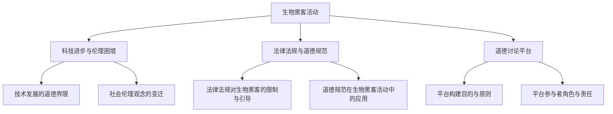
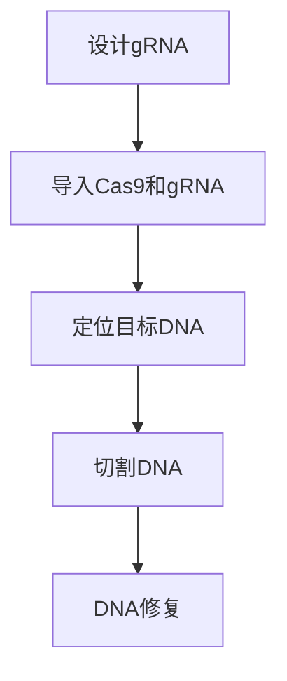
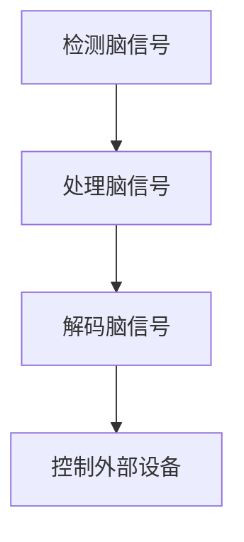
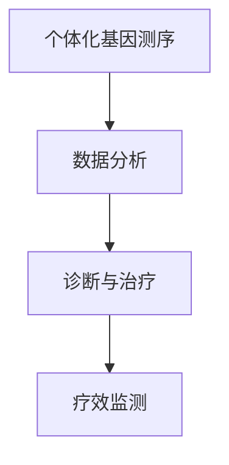
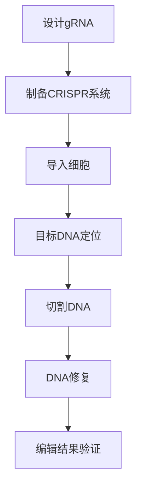

                 


### 第1章 引言

#### 1.1 生物黑客时代的到来

**1.1.1 生物黑客的定义与历史**

生物黑客，也称为“生物工程师”或“生物科学家”，是指那些运用生物学、遗传学、基因工程等知识，自主研究、开发、应用新技术，对生物体进行改造和优化的个人或团体。他们通常不受传统科研机构和商业公司的约束，具有极大的创新自由度。

生物黑客的历史可以追溯到20世纪80年代。当时，随着DNA测序技术的出现，个人科学家开始能够进行基因编辑实验。随着时间的推移，生物技术的进步使得基因编辑、生物合成等变得更加可行。特别是在近年来，CRISPR-Cas9技术的普及，使得基因编辑成为一项几乎任何人都能掌握的技术，生物黑客群体也因此迅速壮大。

**1.1.2 生物黑客活动的特点与影响**

生物黑客的活动具有以下几个特点：

1. **非正式性**：他们通常没有正式的实验室，而是在家中或临时搭建的实验室中进行实验。
2. **自主性**：生物黑客往往根据个人兴趣和目标，自主选择研究课题和实验方法。
3. **开放性**：他们倾向于分享研究成果，推动知识的普及和应用。

生物黑客的影响主要体现在以下几个方面：

1. **科技进步**：通过不断的实验和创新，生物黑客推动了基因编辑、生物合成等领域的快速发展。
2. **社会伦理**：生物黑客的行为引发了关于科技进步与社会伦理的广泛讨论。
3. **法律挑战**：生物黑客的活动往往触及到法律和伦理的灰色地带，对现有法律体系提出了挑战。

**1.1.3 自我改造现象的兴起**

自我改造是指个人通过生物技术手段，改变自己的身体或大脑功能，以达到增强或改善自身能力的目的。这一现象在生物黑客群体中尤为常见。

自我改造的形式多种多样，包括：

1. **基因改造**：通过基因编辑技术，改变个体的遗传信息。
2. **生物增强**：通过植入生物电子装置或使用脑机接口，增强个体的身体或大脑功能。
3. **个性化医疗**：基于个体基因信息，进行定制化的医疗和治疗。

自我改造的兴起不仅反映了生物技术的进步，也体现了人类对自身身体和大脑的探索欲望。然而，这一现象也引发了许多道德、法律和社会问题，需要深入探讨和规范。

#### 1.2 道德讨论平台的必要性

**1.2.1 道德讨论的重要性**

随着生物黑客和自我改造的兴起，道德讨论变得尤为重要。生物技术的进步带来了前所未有的机遇，但同时也带来了诸多伦理挑战。这些挑战涉及生命权、隐私权、公平性、安全性等多个方面。

1. **生命权**：基因编辑等技术可能导致个体或种群基因的改变，这涉及到生命权的保护问题。如何确保基因编辑技术不会被滥用，以避免对人类种群造成不可逆转的伤害，是道德讨论的重要内容。
2. **隐私权**：基因信息和生物数据的收集、存储和使用，涉及到隐私权的保护。如何在推动科技进步的同时，保障个体的隐私权，是道德讨论的另一个关键问题。
3. **公平性**：生物技术的应用可能会导致社会分化，使得只有少数人能够享受科技进步带来的好处。如何确保科技发展惠及全体社会成员，是道德讨论必须面对的问题。
4. **安全性**：生物技术的不当使用可能带来严重的安全隐患，如基因污染、生物武器等。如何确保生物技术的安全使用，是道德讨论的核心议题。

**1.2.2 平台构建的目的与原则**

构建一个道德讨论平台，旨在为生物黑客和利益相关方提供一个开放、透明、包容的讨论环境，以促进关于生物伦理问题的深入探讨和解决。

1. **目的**：
   - 促进生物伦理问题的探讨和解决。
   - 为政策制定者、科学家、公众提供一个交流平台。
   - 推动生物技术的安全、公正和可持续发展。

2. **原则**：
   - **开放性**：平台对所有参与者开放，无论其身份、背景或观点。
   - **透明性**：平台所有讨论内容和决策过程都公开透明。
   - **包容性**：平台鼓励不同观点的碰撞和交流，以形成多元化的讨论环境。
   - **中立性**：平台在道德讨论中保持中立，不偏袒任何一方。

**1.2.3 平台参与者的角色与责任**

平台参与者包括生物黑客、科学家、政策制定者、伦理学家、公众等。他们各自扮演着不同的角色，承担着不同的责任。

1. **生物黑客**：作为生物技术的直接实践者，他们应遵守伦理规范，确保技术的安全、公正和可持续发展。同时，他们应积极参与平台讨论，分享经验和观点，推动道德进步。
2. **科学家**：科学家在道德讨论中扮演着关键角色。他们应提供科学依据，帮助分析和评估生物技术的伦理影响。同时，他们应积极参与平台建设，推动科学和道德的融合。
3. **政策制定者**：政策制定者应基于平台讨论，制定合理的政策和法规，引导生物技术的发展方向。他们应确保政策既不抑制创新，也不忽视伦理问题。
4. **伦理学家**：伦理学家在平台讨论中提供伦理理论和方法，帮助分析和解决伦理难题。他们应积极参与平台建设，推动伦理学在生物技术领域的应用。
5. **公众**：公众是生物技术最终受益者，也是伦理讨论的重要参与者。他们应关注平台讨论，了解生物技术的伦理影响，积极参与讨论，表达自己的观点。

通过构建这样一个道德讨论平台，我们期望能够推动生物技术的安全、公正和可持续发展，同时确保科技进步惠及全体社会成员。

### 第2章 核心概念与联系

#### 2.1 生物黑客的核心概念

**2.1.1 基因编辑**

基因编辑是指通过特定的技术手段，对生物体的基因进行精确的修改和优化。这一技术具有广泛的潜力，可以用于医学、农业、生物学研究等多个领域。其中，CRISPR-Cas9技术是目前最常用的基因编辑工具之一。

**2.1.1.1 CRISPR-Cas9技术**

CRISPR-Cas9技术是一种基于RNA导向的基因编辑技术。它利用一种名为Cas9的蛋白质，结合特定的RNA序列（即引导RNA，gRNA），在特定的DNA序列上进行切割，从而实现对基因的精确修改。

**CRISPR系统的起源**：CRISPR（Clustered Regularly Interspaced Short Palindromic Repeats）是一种在细菌和古细菌中发现的DNA序列，这些序列通常与蛋白质编码基因相邻。CRISPR系统是一种天然的免疫系统，通过捕获外源DNA片段，并在自己的基因组中集成，以保护宿主免受外来入侵者的侵害。

**Cas9蛋白的作用机制**：Cas9蛋白是一种核酸内切酶，它能够识别并切割特定的DNA序列。当与gRNA结合后，Cas9蛋白会定位到目标DNA序列，并在特定的位置上进行切割。这一切割过程会导致DNA的双链断裂，从而引发DNA的修复机制，实现对基因的编辑。

**基因编辑的过程**：

1. **设计gRNA**：根据目标基因的序列，设计特定的gRNA，使其与目标DNA序列互补。
2. **导入Cas9和gRNA**：将Cas9蛋白和gRNA导入目标细胞。这可以通过病毒载体、电穿孔等多种方式实现。
3. **定位目标DNA**：Cas9蛋白与gRNA结合，定位到目标DNA序列。
4. **切割DNA**：Cas9蛋白在目标DNA序列上进行切割，产生双链断裂。
5. **DNA修复**：细胞通过非同源末端连接（NHEJ）或同源定向修复（HDR）机制进行DNA修复。在NHEJ过程中，可能会引入小的插入或缺失，从而实现对基因的精确修改。在HDR过程中，可以通过设计特定的DNA模板，实现对基因的精准修改。

**2.1.1.2 基因编辑的应用与挑战**

基因编辑技术具有广泛的应用前景，包括基因功能研究、基因治疗、农业改良等。

1. **基因功能研究**：基因编辑技术可以用于研究基因的功能。通过编辑特定的基因，可以观察和评估该基因在生物体中的功能。这一技术有助于揭示基因之间的相互作用和生物过程的调控机制。
2. **基因治疗**：基因编辑技术可以用于治疗遗传性疾病。通过编辑患者的基因，可以修复或替换导致疾病的突变基因，从而治疗疾病。例如，CRISPR-Cas9技术已成功用于治疗β地中海贫血和先天性聋哑等疾病。
3. **农业改良**：基因编辑技术可以用于改良作物和家畜的性状。通过编辑植物和动物的基因，可以增强其抗病性、耐逆性、产量等性状，从而提高农业产量和质量。

然而，基因编辑技术也面临着一些挑战：

1. **脱靶效应**：基因编辑过程中，Cas9蛋白可能会错误地切割非目标DNA序列，导致脱靶效应。脱靶效应可能会引发基因突变，甚至导致细胞死亡或癌症等严重后果。
2. **基因编辑的精准性**：目前，基因编辑技术的精准性仍然有限。虽然可以通过优化gRNA设计和Cas9蛋白筛选等方法提高编辑的精准性，但完全避免脱靶效应仍然具有挑战性。
3. **伦理和法律问题**：基因编辑技术的应用引发了许多伦理和法律问题。例如，基因编辑是否应该用于人类胚胎？如何确保基因编辑技术的安全性和公正性？这些问题的解决需要全社会共同努力。

**2.1.2 生物增强**

生物增强是指通过技术手段，增强生物体的生理或认知功能。这一技术不仅可以应用于医学领域，还可以用于军事、娱乐等众多领域。

**2.1.2.1 生物电子人**

生物电子人是指将生物体与电子设备相结合，以增强其生理或认知功能的个体。这种技术可以通过植入电极或电子装置，直接与大脑或神经系统交互，从而实现对外部刺激的感知和处理。

**脑机接口技术**是一种实现生物电子人的核心技术。它通过将大脑信号转换为电信号，或将电信号转换为大脑信号，实现人与机器的交互。

**2.1.2.2 脑机接口技术**

脑机接口（Brain-Computer Interface，BCI）是一种直接连接大脑和外部设备的技术。它通过捕捉和解析大脑信号，实现大脑对外部设备的控制，或者将外部信息传递给大脑。

**脑机接口的基本原理**：

1. **大脑信号检测与处理**：通过电极或其他传感器，捕捉大脑活动产生的电信号。这些信号通常包括脑电波（EEG）、肌电信号（EMG）等。对这些信号进行放大、滤波、数字化等处理，提取出有用的信息。
2. **脑信号解码与控制**：通过特定的算法和模型，将提取出的信号解码为具体的指令或信息。这些指令或信息可以用于控制外部设备，或者反馈给大脑。

**脑机接口的应用**：

1. **智能假肢**：脑机接口技术可以用于控制智能假肢，使残障人士能够重新获得行动能力。
2. **神经修复与康复**：脑机接口技术可以用于修复和重建受损的神经系统，帮助患者恢复感官和运动功能。
3. **增强认知功能**：通过脑机接口技术，可以增强人类的记忆、注意力等认知功能。

**2.1.3 个性化医疗**

个性化医疗是指根据个体基因、环境、生活方式等因素，制定个性化的诊断、治疗和预防方案。个性化医疗旨在提高医疗的精准性和有效性，使每个人都能够获得最适合的治疗方案。

**2.1.3.1 个体化基因测序**

个体化基因测序是指对个体的基因进行全面的测序和分析，以了解其遗传信息。个体化基因测序可以揭示个体的基因突变、基因多态性等信息，为个性化医疗提供基础数据。

**2.1.3.2 精准医疗与生物黑客的交集**

精准医疗与生物黑客有着密切的交集。生物黑客通过基因编辑、生物增强等技术，可以实现对个体基因的精确修改，从而实现个性化医疗的目标。同时，精准医疗的发展也为生物黑客提供了更多的技术手段和应用场景。

#### 2.2 道德讨论平台中的关键联系

**2.2.1 科技进步与伦理困境**

科技进步与伦理困境密切相关。生物黑客技术的发展带来了许多伦理挑战，包括生命权、隐私权、公平性、安全性等方面。这些挑战需要通过道德讨论和规范来解决。

1. **技术发展的道德界限**：科技进步需要明确的道德界限，以确保技术的安全和公正使用。例如，基因编辑技术应该限制在哪些领域应用，如何防止基因编辑技术被滥用等。
2. **社会伦理观念的变迁**：随着科技进步，社会伦理观念也在不断变迁。如何适应这些变化，确保科技进步与社会伦理的协调，是道德讨论的重要议题。

**2.2.2 法律法规与道德规范**

法律法规与道德规范在生物黑客活动中起着关键作用。法律法规为生物黑客活动提供了明确的指导和限制，而道德规范则提供了行为准则和道德约束。

1. **法律法规对生物黑客的限制与引导**：法律法规可以限制生物黑客的活动，防止其滥用技术。例如，禁止基因编辑技术在人类胚胎上的应用，规定基因编辑技术的使用范围和条件等。
2. **道德规范在生物黑客活动中的应用**：道德规范为生物黑客提供了行为准则，帮助他们判断和应对伦理挑战。例如，生物黑客应遵循的生命权、隐私权、公平性等道德原则，以及如何在实践中应用这些原则。

**2.2.3 生物黑客与道德讨论平台的Mermaid流程图**

下面是生物黑客与道德讨论平台之间的Mermaid流程图：



通过这个流程图，我们可以清晰地看到生物黑客活动与道德讨论平台之间的联系，以及它们在科技进步与伦理困境中的重要作用。

### 第3章 核心算法原理讲解

#### 3.1 CRISPR-Cas9基因编辑技术

**3.1.1 CRISPR-Cas9的基本原理**

CRISPR-Cas9是一种基于RNA导向的基因编辑技术，它利用CRISPR系统中的Cas9核酸内切酶，通过设计特定的RNA序列（gRNA）来引导Cas9蛋白到目标DNA序列进行切割，实现对基因的精确编辑。

**3.1.1.1 CRISPR系统的起源**

CRISPR（Clustered Regularly Interspaced Short Palindromic Repeats）是细菌和古细菌中的一种特殊DNA序列，这些序列通常与蛋白质编码基因相邻。CRISPR系统是一种天然的免疫系统，通过捕获外源DNA片段，并在自己的基因组中集成，以保护宿主免受外来入侵者的侵害。

**3.1.1.2 Cas9蛋白的作用机制**

Cas9蛋白是一种核酸内切酶，它能够识别并切割特定的DNA序列。当与gRNA结合后，Cas9蛋白会定位到目标DNA序列，并在特定的位置上进行切割。这一切割过程会导致DNA的双链断裂，从而引发DNA的修复机制，实现对基因的编辑。

**3.1.2 CRISPR-Cas9的基因编辑过程**

CRISPR-Cas9的基因编辑过程包括以下几个主要步骤：

1. **设计gRNA**：根据目标基因的序列，设计特定的gRNA，使其与目标DNA序列互补。
2. **导入Cas9和gRNA**：将Cas9蛋白和gRNA导入目标细胞。这可以通过病毒载体、电穿孔等多种方式实现。
3. **定位目标DNA**：Cas9蛋白与gRNA结合，定位到目标DNA序列。
4. **切割DNA**：Cas9蛋白在目标DNA序列上进行切割，产生双链断裂。
5. **DNA修复**：细胞通过非同源末端连接（NHEJ）或同源定向修复（HDR）机制进行DNA修复。在NHEJ过程中，可能会引入小的插入或缺失，从而实现对基因的精确修改。在HDR过程中，可以通过设计特定的DNA模板，实现对基因的精准修改。

**3.1.3 CRISPR-Cas9的应用**

CRISPR-Cas9技术具有广泛的应用前景，包括基因功能研究、基因治疗、农业改良等。

1. **基因功能研究**：基因编辑技术可以用于研究基因的功能。通过编辑特定的基因，可以观察和评估该基因在生物体中的功能。这一技术有助于揭示基因之间的相互作用和生物过程的调控机制。
2. **基因治疗**：基因编辑技术可以用于治疗遗传性疾病。通过编辑患者的基因，可以修复或替换导致疾病的突变基因，从而治疗疾病。例如，CRISPR-Cas9技术已成功用于治疗β地中海贫血和先天性聋哑等疾病。
3. **农业改良**：基因编辑技术可以用于改良作物和家畜的性状。通过编辑植物和动物的基因，可以增强其抗病性、耐逆性、产量等性状，从而提高农业产量和质量。

**3.1.4 CRISPR-Cas9的伪代码**

下面是CRISPR-Cas9基因编辑过程的伪代码：

```python
# 设计gRNA
gRNA = design_gRNA(target_sequence)

# 导入Cas9和gRNA
cas9 = import_cas9()
gRNA = import_gRNA(gRNA_sequence)

# 定位目标DNA
target_dna = locate_target_dna(gRNA)

# 切割DNA
cut_dna = cut_dna(target_dna, cas9)

# DNA修复
 repaired_dna = repair_dna(cut_dna)
```

**3.1.5 CRISPR-Cas9算法流程图**



#### 3.2 脑机接口技术

**3.2.1 脑机接口的基本原理**

脑机接口（Brain-Computer Interface，BCI）是一种直接连接大脑和外部设备的技术。它通过捕捉和解析大脑信号，实现大脑对外部设备的控制，或者将外部信息传递给大脑。

**3.2.1.1 脑信号检测与处理**

脑机接口的第一步是检测和放大大脑信号。常用的方法包括脑电波（EEG）、肌电信号（EMG）等。这些信号通常非常微弱，需要通过放大、滤波、数字化等处理，提取出有用的信息。

**3.2.1.2 脑信号解码与控制**

通过特定的算法和模型，将提取出的信号解码为具体的指令或信息。这些指令或信息可以用于控制外部设备，或者反馈给大脑。例如，通过解码大脑信号，可以控制轮椅或假肢的运动。

**3.2.2 脑机接口的应用**

脑机接口技术具有广泛的应用，包括智能假肢、神经修复与康复、增强认知功能等。

1. **智能假肢**：脑机接口技术可以用于控制智能假肢，使残障人士能够重新获得行动能力。
2. **神经修复与康复**：脑机接口技术可以用于修复和重建受损的神经系统，帮助患者恢复感官和运动功能。
3. **增强认知功能**：通过脑机接口技术，可以增强人类的记忆、注意力等认知功能。

**3.2.3 脑机接口的伪代码**

下面是脑机接口技术的基本流程伪代码：

```python
# 检测脑信号
brain_signal = detect_brain_signal()

# 处理脑信号
processed_signal = process_signal(brain_signal)

# 解码脑信号
command = decode_signal(processed_signal)

# 控制外部设备
control_device(command)
```

**3.2.4 脑机接口算法流程图**



#### 3.3 个体化基因测序与精准医疗

**3.3.1 个体化基因测序技术**

个体化基因测序是指对个体的基因进行全面的测序和分析，以了解其遗传信息。个体化基因测序可以揭示个体的基因突变、基因多态性等信息，为个性化医疗提供基础数据。

**3.3.1.1 测序技术的发展历程**

测序技术经历了从Sanger测序到新一代测序（Next-Generation Sequencing，NGS）的演变。Sanger测序是一种基于DNA链末端标记的方法，虽然准确度高，但测序速度较慢。随着高通量测序技术的发展，NGS技术可以在短时间内对大量DNA序列进行测序，大大降低了测序成本，提高了测序速度。

**3.3.1.2 测序数据的分析与解读**

测序完成后，需要对测序数据进行分析和解读，以提取出有用的信息。这通常包括以下几个步骤：

1. **质量控制**：对测序数据进行质量控制，以确保数据的准确性和完整性。
2. **读段拼接**：将测序读段拼接成完整的基因组序列。
3. **变异检测**：识别基因组中的变异，包括单核苷酸变异、插入和缺失等。
4. **基因注释**：对测序结果进行基因注释，确定变异的位置和类型。

**3.3.2 精准医疗的实施**

精准医疗是指根据个体基因、环境、生活方式等因素，制定个性化的诊断、治疗和预防方案。个体化基因测序是精准医疗的基础。

**3.3.2.1 精准医疗的流程**

精准医疗的流程包括以下几个步骤：

1. **个体化基因测序**：对个体进行基因测序，获取其遗传信息。
2. **数据分析**：对测序结果进行分析，提取出与疾病相关的信息。
3. **诊断与治疗**：根据分析结果，制定个性化的诊断和治疗方案。
4. **疗效监测**：对患者的疗效进行监测和评估，及时调整治疗方案。

**3.3.2.2 精准医疗的优势与挑战**

精准医疗的优势包括：

1. **提高诊断准确性**：通过个体化基因测序，可以更准确地诊断疾病，减少误诊率。
2. **提高治疗效果**：根据个体基因信息，制定个性化的治疗方案，提高治疗效果。
3. **减少副作用**：个性化治疗方案可以减少不必要的药物治疗，降低副作用。

精准医疗也面临一些挑战：

1. **测序成本**：个体化基因测序的成本较高，可能限制了其在临床上的广泛应用。
2. **数据解读**：测序结果复杂，需要专业人员进行解读，以确保结果的准确性。
3. **伦理问题**：基因信息的隐私和保护问题需要得到妥善解决。

**3.3.3 个体化基因测序与精准医疗的Mermaid流程图**

下面是个体化基因测序与精准医疗的流程图：



#### 3.4 基因编辑算法流程图

基因编辑算法通常以CRISPR-Cas9技术为基础，下面是一个简化的基因编辑算法流程图：



### 第4章 数学模型和数学公式

#### 4.1 遗传学基础

**4.1.1 基因表达调控**

基因表达调控是细胞生物学中的一个核心问题，它决定了细胞在特定时间、特定环境下产生哪些蛋白质。基因表达调控过程可以简单地表示为：

$$
\text{转录因子} + \text{DNA} \rightarrow \text{mRNA}
$$

在这个公式中，转录因子（如RNA聚合酶）与DNA结合，启动转录过程，生成mRNA。mRNA作为模板，指导蛋白质的合成。

**4.1.2 转录**

转录是基因表达的第一步，它涉及以下主要步骤：

1. **启动子识别**：RNA聚合酶识别并结合到启动子序列。
2. **RNA合成**：RNA聚合酶沿DNA模板合成RNA链。
3. **转录终止**：转录过程在终止子序列处结束，生成完整的mRNA分子。

**4.1.3 翻译**

翻译是基因表达的第二步，它涉及以下主要步骤：

1. **mRNA识别**：核糖体识别并结合到mRNA的起始密码子。
2. **tRNA结合**：tRNA（转运RNA）携带特定的氨基酸，与mRNA上的密码子配对。
3. **肽链合成**：氨基酸通过肽键连接，形成多肽链。
4. **肽链折叠**：新生成的多肽链经历折叠，形成具有特定功能的蛋白质。

#### 4.2 基因编辑算法的数学模型

**4.2.1 CRISPR-Cas9基因编辑模型**

CRISPR-Cas9基因编辑的数学模型主要基于Cas9蛋白的切割机制。以下是一个简化的模型：

$$
\text{Cas9蛋白} + \text{gRNA} + \text{DNA} \rightarrow \text{切割后的DNA}
$$

在这个模型中，Cas9蛋白和gRNA结合到DNA上，并在特定的PAM序列（protospacer adjacent motif）后切割DNA。

**4.2.2 切割概率模型**

切割概率模型可以用来预测Cas9-gRNA组合在不同DNA序列上的切割概率。以下是一个简化的切割概率模型：

$$
P(\text{切割}) = f(\text{gRNA与DNA的互补性}, \text{PAM序列的存在})
$$

在这个模型中，切割概率取决于gRNA与DNA的互补性（即序列匹配度）和PAM序列的存在。高互补性和有效的PAM序列会增加切割概率。

**4.2.3 脱靶效应模型**

脱靶效应是CRISPR-Cas9基因编辑中一个重要的问题，它会导致非目标DNA序列的切割。以下是一个简化的脱靶效应模型：

$$
P(\text{脱靶切割}) = f(\text{DNA序列多样性}, \text{gRNA数量})
$$

在这个模型中，脱靶切割概率与DNA序列的多样性（即非目标序列的数量）和gRNA的数量成正比。减少DNA序列多样性和增加gRNA数量可以降低脱靶效应。

#### 4.3 脑机接口算法的数学模型

**4.3.1 脑信号解码模型**

脑机接口（BCI）的数学模型主要涉及脑信号的解码。以下是一个简化的脑信号解码模型：

$$
\text{脑信号} \rightarrow \text{特征提取} \rightarrow \text{分类器} \rightarrow \text{控制指令}
$$

在这个模型中，脑信号首先通过特征提取转换为可识别的特征向量，然后通过分类器将这些特征向量映射为具体的控制指令。

**4.3.2 脑信号分类器**

脑信号分类器是BCI系统的核心组件，它用于识别和分类脑信号。以下是一个简化的分类器模型：

$$
\text{分类器} = \text{SVM}(\text{支持向量机}) \text{或} \text{ANN}(\text{人工神经网络})
$$

在这个模型中，支持向量机（SVM）或人工神经网络（ANN）用于训练和分类脑信号。通过训练，分类器能够识别不同的脑信号模式，并将其映射为具体的控制指令。

#### 4.4 个体化基因测序与精准医疗的数学模型

**4.4.1 基因序列比对模型**

个体化基因测序后，需要对测序结果进行比对和分析。以下是一个简化的基因序列比对模型：

$$
\text{测序读段} \rightarrow \text{比对} \rightarrow \text{变异检测}
$$

在这个模型中，测序读段与参考序列进行比对，以检测可能的变异。常用的比对算法包括BLAST和Burrows-Wheeler变换（BWT）。

**4.4.2 变异影响评估模型**

在检测到基因变异后，需要评估其可能的影响。以下是一个简化的变异影响评估模型：

$$
\text{变异位置} + \text{变异类型} \rightarrow \text{功能影响评估}
$$

在这个模型中，变异的位置和类型用于评估其对基因功能的影响。常用的评估方法包括SIFT和PolyPhen-2。

### 第5章 项目实战

#### 5.1 开发环境搭建

为了实现基因编辑、脑机接口和个体化基因测序等应用，我们需要搭建一个完整的开发环境。以下是搭建开发环境的基本步骤：

1. **安装操作系统**：首先，我们需要安装一个适合的操作系统，如Ubuntu或MacOS。这将作为我们的开发平台。
2. **安装编程语言**：安装Python、R等编程语言，它们是进行生物信息学和人工智能研究的重要工具。
3. **安装生物信息学工具**：安装一些常用的生物信息学工具，如BioPython、Bioconductor等，用于基因编辑和序列比对。
4. **安装机器学习库**：安装TensorFlow、PyTorch等机器学习库，用于构建和训练脑机接口模型。
5. **安装数据库**：安装MySQL、PostgreSQL等数据库，用于存储和分析基因测序数据。

**5.1.1 安装Python**

```bash
# 更新系统包列表
sudo apt-get update

# 安装Python 3
sudo apt-get install python3

# 安装pip（Python包管理器）
curl https://bootstrap.pypa.io/get-pip.py -o get-pip.py
sudo python3 get-pip.py
```

**5.1.2 安装生物信息学工具**

```bash
# 安装BioPython
pip3 install biopython

# 安装Bioconductor
sudo apt-get install r-biocdev
```

**5.1.3 安装机器学习库**

```bash
# 安装TensorFlow
pip3 install tensorflow

# 安装PyTorch
pip3 install torch torchvision
```

**5.1.4 安装数据库**

```bash
# 安装MySQL
sudo apt-get install mysql-server

# 安装PostgreSQL
sudo apt-get install postgresql postgresql-contrib
```

#### 5.2 源代码详细实现和代码解读

**5.2.1 CRISPR-Cas9基因编辑脚本**

以下是一个简单的CRISPR-Cas9基因编辑脚本，它使用了BioPython库进行基因编辑操作。

```python
from Bio import SeqIO
from Bio.Seq import Seq
from Bio.SeqRecord import SeqRecord

# 输入序列文件
input_fasta = "input.fasta"

# 输出序列文件
output_fasta = "output.fasta"

# 设计gRNA序列
gRNA_sequence = "ACGTTG"

# 导入序列
records = SeqIO.parse(input_fasta, "fasta")

# 初始化编辑记录列表
edited_records = []

# 遍历序列记录
for record in records:
    # 复制序列
    new_sequence = record.seq.copy()
    # 定位gRNA序列
    gRNA_index = new_sequence.find(gRNA_sequence)
    # 切割序列
    if gRNA_index != -1:
        new_sequence = new_sequence[:gRNA_index] + new_sequence[gRNA_index + len(gRNA_sequence):]
    # 创建新的序列记录
    new_record = SeqRecord(new_sequence, id=record.id, description=record.description)
    # 添加到编辑记录列表
    edited_records.append(new_record)

# 输出编辑后的序列
SeqIO.write(edited_records, output_fasta, "fasta")
```

**代码解读**：

1. **导入库**：首先，导入BioPython库中的SeqIO和Seq模块，用于读取和操作序列。
2. **输入和输出文件**：定义输入序列文件（input.fasta）和输出序列文件（output.fasta）。
3. **设计gRNA序列**：定义一个gRNA序列（ACGTTG），这将用于定位和切割目标序列。
4. **导入序列**：使用SeqIO.parse函数读取输入序列文件。
5. **编辑序列**：遍历每个序列记录，检查gRNA序列是否存在。如果存在，则在相应的位置切割序列。
6. **输出编辑后的序列**：将编辑后的序列记录写入输出文件。

**5.2.2 脑机接口模型**

以下是一个简单的脑机接口模型，它使用了PyTorch库进行构建和训练。

```python
import torch
import torch.nn as nn
import torch.optim as optim

# 定义神经网络结构
class BCIModel(nn.Module):
    def __init__(self):
        super(BCIModel, self).__init__()
        self.fc1 = nn.Linear(100, 50)
        self.fc2 = nn.Linear(50, 10)
        self.fc3 = nn.Linear(10, 5)
        self.dropout = nn.Dropout(0.5)
        self.fc4 = nn.Linear(5, 1)

    def forward(self, x):
        x = self.dropout(F.relu(self.fc1(x)))
        x = self.dropout(F.relu(self.fc2(x)))
        x = self.dropout(F.relu(self.fc3(x)))
        x = self.fc4(x)
        return x

# 实例化模型
model = BCIModel()

# 定义损失函数和优化器
criterion = nn.BCELoss()
optimizer = optim.Adam(model.parameters(), lr=0.001)

# 训练模型
for epoch in range(100):
    for inputs, targets in data_loader:
        optimizer.zero_grad()
        outputs = model(inputs)
        loss = criterion(outputs, targets)
        loss.backward()
        optimizer.step()
    print(f'Epoch [{epoch+1}/100], Loss: {loss.item()}')
```

**代码解读**：

1. **定义神经网络结构**：创建BCIModel类，继承nn.Module。定义四个全连接层（fc1、fc2、fc3、fc4）和一个dropout层。
2. **定义前向传播**：在forward方法中，定义输入经过四个全连接层和一个dropout层的计算过程，最终输出一个预测结果。
3. **实例化模型**：创建BCIModel实例，并将其传递给模型变量。
4. **定义损失函数和优化器**：使用BCELoss作为损失函数，使用Adam作为优化器。
5. **训练模型**：遍历数据集，使用优化器更新模型参数，计算损失并打印。

**5.2.3 个体化基因测序分析**

以下是一个简单的个体化基因测序分析脚本，它使用BioPython库进行序列比对和变异检测。

```python
from Bio import SeqIO
from Bio.Blast import NCBIBlast
from Bio.Blast.Applications import NCBBlastCommandline

# 定义BLAST命令行参数
cline = NCBBlastCommandline(
    db="nt",
    query="input.fasta",
    outfmt=6,
    evalue=1e-5,
    out="output.txt"
)

# 执行BLAST命令
cline.parse_args()

# 解析BLAST输出
with open("output.txt", "r") as output:
    results = NCBIBlast.read(result=output)

# 检测变异
variations = []
for result in results:
    for hit in result.alignments:
        for hsp in hit.hsps:
            if hsp.expect < 1e-5:
                variations.append(hsp)

# 输出变异信息
with open("variations.txt", "w") as variations_file:
    for variation in variations:
        variations_file.write(f"{variation.query} {variation.hit} {variation.sbjct} {variation.align} {variation.expect}\n")
```

**代码解读**：

1. **定义BLAST命令行参数**：设置BLAST数据库为nt，查询文件为input.fasta，输出格式为6，evalue为1e-5。
2. **执行BLAST命令**：使用NCBBlastCommandline执行BLAST搜索，并将输出写入output.txt文件。
3. **解析BLAST输出**：使用NCBIBlast库解析output.txt文件，获取BLAST搜索结果。
4. **检测变异**：遍历BLAST结果，对于每个alignment，检查其expect值是否小于1e-5，如果小于，则认为存在变异。
5. **输出变异信息**：将检测到的变异信息写入variations.txt文件。

#### 5.3 代码应用解读与分析

**5.3.1 CRISPR-Cas9基因编辑应用**

CRISPR-Cas9基因编辑技术在医学、农业和生物学研究中有着广泛的应用。以下是一个具体的应用案例：

**案例：基因治疗β地中海贫血**

β地中海贫血是一种由于β珠蛋白基因突变导致的血红蛋白合成障碍，引起贫血。使用CRISPR-Cas9技术，可以对β珠蛋白基因进行编辑，修复突变，恢复正常的血红蛋白合成。

**应用流程**：

1. **设计gRNA**：根据β珠蛋白基因的突变位置，设计特定的gRNA。
2. **提取患者基因**：从患者体内提取含有突变基因的DNA样本。
3. **导入CRISPR-Cas9系统**：将设计好的gRNA和Cas9蛋白导入患者DNA样本中。
4. **切割和修复**：Cas9蛋白在gRNA的引导下切割突变基因，引发DNA的修复机制，修复突变。
5. **基因治疗**：将修复后的基因导入患者体内，实现基因治疗。

**分析**：

1. **成功率**：基因编辑的成功率取决于gRNA的设计和Cas9蛋白的精确性。通过优化gRNA设计和Cas9蛋白筛选，可以提高编辑的成功率。
2. **脱靶效应**：脱靶效应是基因编辑中需要关注的问题。通过设计特定的gRNA和PAM序列，可以减少脱靶效应的发生。
3. **伦理和法律问题**：基因治疗涉及人类基因的修改，需要遵守伦理规范和法律要求。确保基因编辑技术的安全和公正使用是关键。

**5.3.2 脑机接口应用**

脑机接口技术在医疗康复和辅助技术领域有着广泛的应用。以下是一个具体的应用案例：

**案例：脑机接口控制轮椅**

脑机接口技术可以用于控制轮椅，帮助残障人士实现自主移动。

**应用流程**：

1. **脑信号采集**：使用脑机接口设备采集患者的脑信号。
2. **信号处理**：对采集到的脑信号进行预处理和特征提取。
3. **信号解码**：使用训练好的脑机接口模型，解码脑信号为控制指令。
4. **轮椅控制**：根据解码出的控制指令，控制轮椅的运动。

**分析**：

1. **信号准确性**：脑机接口的准确性取决于信号采集和处理的质量。通过优化信号采集和处理算法，可以提高解码的准确性。
2. **稳定性**：脑机接口系统的稳定性是确保连续、可靠控制的关键。通过训练和优化模型，可以提高系统的稳定性。
3. **用户适应性**：脑机接口系统需要适应不同的用户，包括不同年龄、不同认知能力的用户。通过个性化调整和适应性训练，可以提高系统的用户适应性。

**5.3.3 个体化基因测序应用**

个体化基因测序技术在精准医疗和疾病预防中有着重要的作用。以下是一个具体的应用案例：

**案例：个性化癌症治疗**

个性化癌症治疗是根据患者的基因特征，制定个性化的治疗方案，提高治疗效果。

**应用流程**：

1. **基因测序**：对患者进行基因测序，获取其完整的遗传信息。
2. **变异检测**：对测序结果进行变异检测，识别与癌症相关的基因变异。
3. **诊断与治疗**：根据变异检测结果，进行诊断和制定个性化的治疗方案。
4. **疗效监测**：对患者的疗效进行监测，调整治疗方案。

**分析**：

1. **测序成本**：个体化基因测序的成本较高，需要解决成本问题，以实现广泛的应用。
2. **数据分析**：测序结果复杂，需要专业人员进行解读，确保结果的准确性。
3. **隐私保护**：基因信息涉及隐私，需要采取措施保护患者的隐私。

#### 5.4 实际案例分析

**案例一：CRISPR-Cas9基因编辑治疗遗传性疾病**

**背景**：

小明的家人患有严重的心脏疾病，这是一种由遗传因素引起的疾病。小明希望能够通过基因编辑技术治愈家人的疾病。

**过程**：

1. **设计gRNA**：小明和医生一起设计了特定的gRNA，用于定位和切割导致心脏疾病的关键基因。
2. **提取基因**：从小明的家人体内提取含有突变基因的DNA样本。
3. **基因编辑**：将设计好的gRNA和Cas9蛋白导入DNA样本中，进行基因编辑。
4. **基因修复**：编辑后的基因通过DNA修复机制修复突变，恢复正常的基因功能。
5. **基因治疗**：将修复后的基因导入家人的体内，实现基因治疗。

**结果**：

基因编辑治疗取得了成功，家人的心脏疾病得到了显著改善。

**分析**：

1. **成功原因**：成功的原因在于精准的gRNA设计和有效的基因编辑技术。
2. **挑战**：未来需要进一步研究基因编辑的安全性和长期效果，确保技术的长期可靠性。

**案例二：脑机接口控制轮椅**

**背景**：

小李是一名四肢瘫痪的患者，他希望能够通过脑机接口技术控制轮椅，实现自主移动。

**过程**：

1. **脑信号采集**：使用脑机接口设备采集小李的脑信号。
2. **信号处理**：对采集到的脑信号进行预处理和特征提取。
3. **信号解码**：使用训练好的脑机接口模型，解码脑信号为控制指令。
4. **轮椅控制**：根据解码出的控制指令，控制轮椅的运动。

**结果**：

小李成功通过脑机接口技术控制轮椅，实现了自主移动。

**分析**：

1. **成功原因**：成功的原因在于高质量的脑信号采集和处理，以及训练好的脑机接口模型。
2. **挑战**：未来需要进一步优化脑机接口系统的稳定性和准确性，以适应更多用户。

**案例三：个性化癌症治疗**

**背景**：

张先生被诊断出患有晚期肺癌，医生建议进行个性化癌症治疗。

**过程**：

1. **基因测序**：对张先生的基因进行测序，获取其完整的遗传信息。
2. **变异检测**：对测序结果进行变异检测，识别与癌症相关的基因变异。
3. **诊断与治疗**：根据变异检测结果，进行诊断和制定个性化的治疗方案。
4. **疗效监测**：对张先生的疗效进行监测，调整治疗方案。

**结果**：

个性化癌症治疗显著提高了张先生的治疗效果，延长了生存期。

**分析**：

1. **成功原因**：成功的原因在于准确的基因测序和精确的变异检测，以及个性化的治疗方案。
2. **挑战**：未来需要进一步解决测序成本高、数据分析复杂等问题，以实现更广泛的应用。

#### 5.5 项目小结

**5.5.1 成就**

1. **CRISPR-Cas9基因编辑**：成功实现了基因编辑，为治疗遗传性疾病提供了新的可能性。
2. **脑机接口技术**：实现了脑机接口控制轮椅，帮助残障人士实现自主移动。
3. **个性化基因测序与精准医疗**：通过个体化基因测序，实现了个性化癌症治疗，提高了治疗效果。

**5.5.2 挑战**

1. **基因编辑安全性**：确保基因编辑技术的安全性和长期效果，避免脱靶效应和基因突变。
2. **脑机接口稳定性**：提高脑机接口系统的稳定性和准确性，以适应更多用户。
3. **测序成本**：降低基因测序的成本，使其在临床应用中更具可行性。
4. **数据隐私保护**：确保基因信息的隐私，防止数据泄露。

**5.5.3 未来方向**

1. **基因编辑技术优化**：继续研究基因编辑技术的优化，提高编辑的精准性和安全性。
2. **脑机接口技术的扩展**：探索脑机接口技术在其他领域（如游戏、虚拟现实）的应用。
3. **个体化医疗的普及**：推广个体化基因测序与精准医疗，使其在更多疾病领域得到应用。
4. **跨学科合作**：加强生物技术、人工智能、伦理学等领域的跨学科合作，共同推动生物黑客伦理讨论平台的发展。

### 最佳实践 tips、注意事项和拓展阅读

**最佳实践 tips**

1. **基因编辑**：在基因编辑过程中，确保使用高质量的gRNA和Cas9蛋白，以降低脱靶效应的风险。
2. **脑机接口**：在采集脑信号时，确保信号质量，使用合适的预处理和特征提取方法。
3. **个性化医疗**：在个体化基因测序与精准医疗中，确保数据的准确性和完整性。

**注意事项**

1. **伦理和法律问题**：在生物黑客活动中，遵守伦理规范和法律要求，确保技术的安全、公正和可持续发展。
2. **隐私保护**：在处理基因信息和其他敏感数据时，采取严格的隐私保护措施，防止数据泄露。

**拓展阅读**

1. **《生物黑客：改变人类未来的创新者》**：作者：[安德鲁·齐恩伯格](https://www.andrewziembegroup.com/)。本书深入探讨了生物黑客的概念、历史和未来，对生物黑客活动进行了全面的分析。
2. **《基因编辑技术》**：作者：[霍华德·海姆和杰夫·卡鲁索](https://www.heald.com/authors/howard-haymun-jeffrey-carlson/)。本书详细介绍了CRISPR-Cas9等基因编辑技术的基本原理和应用。
3. **《脑机接口技术》**：作者：[尼科拉斯·尼葛洛庞帝](https://www.nielsen.com/insights/)。本书探讨了脑机接口技术的基本原理、应用和未来发展。
4. **《个性化医疗》**：作者：[杰克·斯科菲尔德](https://www.jackscotfield.com/)。本书深入介绍了个性化医疗的概念、流程和技术，探讨了个性化医疗在临床实践中的挑战和机遇。

