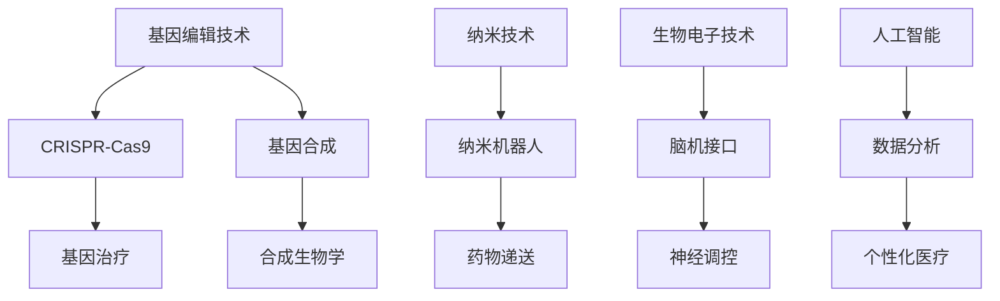

                 

### 文章标题

《生物黑客伦理：自我改造时代的道德边界》

### 文章关键词

生物黑客，伦理，自我改造，道德边界，科技伦理，法规，社会影响

### 文章摘要

在科技飞速发展的今天，生物黑客这一群体正以前所未有的方式改变着人类对自我的认知。他们通过基因编辑、纳米技术、生物电子技术等前沿科技，进行自我改造，以期提升身体和大脑的机能。然而，这一行为带来的伦理道德问题引发了广泛的讨论。本文将从生物黑客的定义、技术实例、伦理探讨、案例分析、法律法规以及未来挑战等方面，系统地梳理生物黑客伦理这一复杂议题，旨在为这一新兴领域提供伦理思考的框架和规范建议。通过深入剖析，我们希望能够激发更多关于生物黑客伦理的思考和讨论，为这一领域的未来发展提供有益的参考。

## 引言与背景介绍

生物黑客，作为当代科技进步的产物，是一个极具争议的群体。他们的行为不仅仅是单纯的科技探索，更是对传统伦理观念的挑战。生物黑客通过基因编辑、纳米技术、生物电子技术等前沿科技，对自身进行自我改造，以期提升身体和大脑的机能，增强人类能力。这一行为在带来科技进步的同时，也引发了深刻的伦理道德问题。

### 生物黑客的定义及其历史发展

生物黑客，通常指的是那些利用生物学、计算机科学和工程学知识，通过非传统的途径进行自我改造的人群。他们不仅关注科技本身，更关注如何将科技应用于自我提升和优化。生物黑客的定义并非一成不变，随着科技的进步和伦理观念的变化，这一概念也在不断演变。

早期的生物黑客可以追溯到20世纪末，那时他们主要关注基因编辑技术，希望通过修改自己的基因来提升健康水平或改善外貌。随着基因编辑技术的不断发展，生物黑客的范畴也不断扩大，包括纳米技术、生物电子技术等多个领域。

### 自我改造技术的兴起与普及

自我改造技术的兴起与普及是生物黑客现象的基石。基因编辑技术，如CRISPR-Cas9，使得人们可以精确地修改基因序列，从而改变遗传特征。纳米技术的进步，使得生物黑客可以利用纳米材料来增强或修复身体组织。生物电子技术则通过将生物体与电子设备相结合，为生物黑客提供了新的可能性。

这些技术的发展，不仅拓宽了生物黑客的改造手段，也极大地提高了改造的成功率和安全性。然而，随着技术的普及，生物黑客的行为也引发了更多的伦理道德问题。例如，基因编辑技术的滥用可能导致基因歧视、代际不公平等问题。

### 伦理与道德边界的重要性

在自我改造技术的背景下，伦理与道德边界的重要性愈发凸显。生物黑客的行为不仅涉及个体自身利益，还关系到社会公平、人类尊严等多个方面。因此，建立合理的伦理与道德边界，对于引导生物黑客行为、保障社会公共利益具有重要意义。

首先，伦理与道德边界可以为生物黑客提供行为指南，帮助他们识别和避免潜在的道德风险。例如，基因编辑技术的不当使用可能导致基因歧视，损害社会公平。因此，设定明确的伦理规范，可以限制生物黑客的行为，确保其在合理范围内进行自我改造。

其次，伦理与道德边界有助于社会对生物黑客行为进行监督和评价。通过建立一套伦理标准，社会可以更好地评估生物黑客行为的正当性和合理性，从而制定相应的政策和法规，规范生物黑客的行为。

总之，在自我改造技术不断发展的背景下，伦理与道德边界的重要性不言而喻。只有建立合理的伦理规范，才能确保生物黑客行为的合法性和合理性，为这一领域的健康发展提供保障。因此，深入探讨生物黑客伦理问题，成为当务之急。接下来，本文将详细探讨生物黑客的具体定义与发展，以更全面地理解这一现象。

### 生物黑客的定义与发展

#### 生物黑客的基本定义与分类

生物黑客，即“biohacker”，是利用生物学、计算机科学和工程学等领域的知识，通过非传统的途径进行自我改造的人群。他们的行为不仅限于理论探讨，更包括实际操作和实验。生物黑客的主要目标是通过基因编辑、纳米技术、生物电子技术等手段，提升自身的身体和大脑机能，增强人类能力。

生物黑客可以分为以下几类：

1. **自我实验者（Self-Experimenters）**：这类生物黑客通过自己的实验来测试和验证某些生物技术的效果。他们通常不具备专业的生物学背景，但通过自学和互联网资源，进行自我改造实验。

2. **业余研究者（Amateur Researchers）**：这类生物黑客通常具备一定的生物学或工程学背景，他们利用实验室设备或开源工具，进行生物黑客项目的研究和开发。

3. **专业研究者（Professional Researchers）**：这类生物黑客是真正的科学家或工程师，他们在学术机构或企业实验室工作，从事生物黑客相关的研究和开发。

#### 生物黑客技术的发展与应用

随着科技的进步，生物黑客的技术手段也越来越多样化。以下是一些主要的生物黑客技术：

1. **基因编辑技术**：基因编辑技术，如CRISPR-Cas9，使得生物黑客可以通过精确修改基因序列，改变遗传特征。基因编辑技术已经在多个领域得到应用，包括医学、农业和生物工程等。

2. **纳米技术**：纳米技术为生物黑客提供了新的可能性。通过纳米材料，生物黑客可以增强或修复身体组织，例如，利用纳米机器人进行细胞修复或药物递送。

3. **生物电子技术**：生物电子技术将生物体与电子设备相结合，使得生物黑客可以监控和调节生理过程。例如，通过植入脑机接口设备，生物黑客可以实现思维控制设备。

#### 生物黑客社群的现状与趋势

生物黑客社群在全球范围内逐渐形成，并在互联网上有着广泛的交流与合作。以下是一些生物黑客社群的现状与趋势：

1. **开放生物黑客实验室（Open Biohacking Labs）**：开放生物黑客实验室为生物黑客提供了实验平台和资源，他们可以在这里进行实验和分享成果。

2. **在线社区与论坛**：如Biohacker Lab、Genspace等在线社区和论坛，为生物黑客提供了交流和学习的平台。这些社区不仅分享技术知识，还讨论伦理和法律问题。

3. **商业化和产业化**：生物黑客技术的发展也带动了相关产业的兴起。例如，基因编辑公司、纳米技术企业等，正致力于将生物黑客技术商业化，从而推动科技进步和社会变革。

总之，生物黑客作为一个新兴群体，正在通过前沿科技改变着人类对自我的认知。他们的行为不仅引发了技术上的突破，也带来了伦理和社会层面的挑战。因此，深入研究和理解生物黑客社群，对于把握科技发展的趋势和应对伦理挑战具有重要意义。接下来，本文将详细探讨自我改造技术的具体实例，以更全面地了解生物黑客的实践。|im_sep|

### 自我改造的技术与实例

#### 基因编辑技术

基因编辑技术，尤其是CRISPR-Cas9，是生物黑客进行自我改造的核心技术之一。CRISPR-Cas9系统通过引导RNA（gRNA）定位到特定的DNA序列，然后Cas9蛋白切割DNA，从而实现基因的修改。以下是一个简化的CRISPR-Cas9基因编辑的伪代码：

```plaintext
function CRISPR_Cas9(gene_sequence, target_sequence, gRNA_sequence):
    # 设计gRNA，使其与目标DNA序列互补
    gRNA = design_gRNA(target_sequence, gRNA_sequence)

    # 使用Cas9蛋白切割目标DNA
    gene_sequence = DNA_cutter(gene_sequence, gRNA)

    # 进行DNA修复，可能涉及同源重组
    modified_sequence = DNA_repair(gene_sequence)

    return modified_sequence
```

在基因编辑技术中，常见的数学模型包括概率模型和序列比对算法。例如，序列比对算法（如BLAST）用于确定gRNA的最佳设计，概率模型则用于预测编辑效率和脱靶效应。

**实例**：一个典型的案例是基因编辑治疗地中海贫血。通过CRISPR-Cas9技术，科学家们可以修复患者体内的β-地贫基因，从而恢复正常的血红蛋白生产。这个过程包括以下几个步骤：

1. **设计gRNA**：选择合适的gRNA，使其与β-地贫基因的突变区域互补。
2. **实验操作**：将CRISPR-Cas9系统导入患者骨髓干细胞。
3. **基因修复**：利用同源重组机制，将正常基因整合到患者DNA中。
4. **细胞培养和检测**：在体外培养细胞，并通过PCR和测序检测基因修复效果。

#### 纳米技术

纳米技术为生物黑客提供了新的工具，用于增强或修复身体组织。纳米材料可以设计成具有特定功能的结构，例如，纳米颗粒可以用于药物递送，纳米纤维可以用于组织工程。

**实例**：纳米机器人（nanorobots）是一个引人注目的纳米技术应用。这些微型机器人可以设计成能够进入人体细胞，执行特定的生物操作。以下是一个简化的纳米机器人药物递送过程的伪代码：

```plaintext
function NanoRobot_DrugDelivery(target_cell, drug):
    # 导航到目标细胞
    navigate_to(target_cell)

    # 将药物装载到纳米机器人
    load_drug_toRobot(drug)

    # 切割细胞膜，将药物注入细胞
    inject_drug_into_cell(target_cell)

    # 释放药物并退出细胞
    release_drug_and_exit(target_cell)
```

在纳米技术中，数学模型如蒙特卡罗模拟（Monte Carlo simulation）可以用于预测纳米材料的分布和相互作用。**实例**：一个实际案例是利用纳米颗粒治疗癌症。纳米颗粒可以通过静脉注射进入人体，然后被特异性地靶向到癌细胞。通过释放药物，纳米颗粒可以杀死癌细胞，同时减少对正常组织的损害。

#### 生物电子技术

生物电子技术通过将生物体与电子设备相结合，为生物黑客提供了新的自我改造途径。脑机接口（Brain-Machine Interface, BMI）是一个典型的应用，它允许用户通过大脑信号控制外部设备。

**实例**：神经接口技术（neural interfaces）是一种将电极植入大脑，以读取和修改大脑信号的技术。以下是一个简化的神经接口读取和处理的伪代码：

```plaintext
function Neural_Recording(processed_signal, threshold):
    # 读取大脑信号
    raw_signal = read_brain_signal()

    # 处理信号，去除噪声
    processed_signal = preprocess_signal(raw_signal)

    # 检测信号是否符合阈值
    if (processed_signal > threshold):
        return "Triggered Event"
    else:
        return "No Trigger"
```

在生物电子技术中，常用的数学模型包括信号处理算法和机器学习模型，用于分析大脑信号和预测行为。

**实例**：一个实际案例是利用脑机接口技术帮助瘫痪患者恢复运动功能。通过植入电极，患者的大脑信号可以被读取并转换为控制外骨骼或假肢的指令，从而实现运动控制。

#### 案例分析：成功与挑战

**成功案例**：一个成功的案例是基因编辑技术治疗遗传性疾病。例如，科学家们利用CRISPR-Cas9技术治疗镰状细胞贫血症，取得了显著的疗效。这个过程包括精确的基因编辑、基因修复以及严格的临床检测。

**挑战案例**：然而，基因编辑技术也面临着诸多挑战。例如，脱靶效应可能导致非预期基因修改，从而引发健康风险。此外，基因编辑技术的滥用可能导致基因歧视和社会不公平。

总之，自我改造技术的发展为生物黑客提供了前所未有的可能性。然而，这些技术的应用也带来了复杂的伦理和法律问题。在下一节中，我们将深入探讨这些伦理问题，并分析生物黑客行为中的道德边界。|im_sep|

### 伦理与道德边界的探讨

生物黑客通过前沿科技进行自我改造，这一行为不仅涉及个体利益，更涉及到广泛的伦理和道德问题。在讨论这些问题时，我们需要从多个角度进行分析，以理解其在科技、社会和文化等方面的深远影响。

#### 科技伦理的原则与理论

科技伦理是研究科技活动中的道德原则和规范的学科。生物黑客行为的伦理讨论，可以参考以下几项主要的科技伦理原则：

1. **尊重个人自主权**：每个人都有权自主决定如何改造自身。这一原则强调了个体自由的重要性，但同时也要求个体在行使自由时，要考虑到对他人和社会的影响。

2. **公正与平等**：科技应用应当促进社会公正和平等。生物黑客行为需要避免加剧社会不平等，例如，通过基因编辑技术进行的自我改造不应导致基因歧视或代际不公平。

3. **安全和无害**：科技应用应当确保安全和无害。生物黑客在进行自我改造时，需要确保其行为不会对自己或他人造成不可逆转的伤害。

4. **透明和责任**：科技行为应当公开透明，且行为者应当对其行为负责。对于生物黑客，这意味着他们在进行自我改造时，需要公开其方法和结果，并对其行为可能带来的后果承担责任。

5. **隐私保护**：个人数据和生物信息应当得到保护，防止滥用和泄露。在生物黑客领域，这一原则尤为重要，因为基因编辑和生物电子技术的应用涉及到大量的个人隐私问题。

#### 道德边界在生物黑客领域的应用

在生物黑客领域，道德边界的设定对于规范行为、保障社会公共利益具有重要意义。以下是一些具体的道德边界讨论：

1. **基因编辑的道德边界**：基因编辑技术具有巨大的潜力，但同时也带来了诸多伦理挑战。例如，基因编辑可能导致基因歧视、代际不公等问题。因此，在应用基因编辑技术时，需要设定明确的道德边界，确保其不会对社会造成负面影响。

2. **生物电子技术的道德边界**：生物电子技术，如脑机接口，虽然可以提升人类能力，但也可能导致隐私侵犯、依赖性增强等问题。因此，在开发和应用生物电子技术时，需要严格遵循道德原则，确保其行为不会损害个人和社会的利益。

3. **自我实验的道德边界**：自我实验者是生物黑客的重要组成部分。他们在进行自我改造时，需要遵循科学伦理原则，确保实验的透明性和安全性。同时，社会也需要对自我实验行为进行监督，以防止不当行为的发生。

#### 生物黑客实践中的伦理冲突

生物黑客实践中的伦理冲突主要体现在以下几个方面：

1. **个体利益与公共利益**：生物黑客在追求自我改造的同时，可能会忽视公共利益。例如，通过基因编辑技术进行自我改造，可能会对后代产生不可预见的影响，从而损害公共利益。

2. **科技发展与伦理约束**：科技的快速发展往往超出伦理规范的调整速度。生物黑客行为可能面临法律和伦理规范的滞后问题，导致其行为无法得到有效监管。

3. **技术滥用与安全风险**：生物黑客行为中的技术滥用和安全风险是一个突出问题。例如，基因编辑技术的滥用可能导致基因歧视或生物恐怖主义，而生物电子技术的滥用可能导致隐私侵犯和安全威胁。

总之，生物黑客伦理问题的复杂性和多样性要求我们建立一套完善的伦理规范，以指导这一新兴领域的发展。在下一节中，我们将通过具体案例分析，进一步探讨生物黑客伦理问题的现实表现和解决途径。|im_sep|

### 案例研究与分析

#### 案例一：基因编辑婴儿事件

2018年，中国科学家贺建奎宣布成功利用CRISPR-Cas9基因编辑技术创造出全球首对基因编辑婴儿，这一事件引发了全球范围的广泛关注和强烈谴责。基因编辑婴儿事件不仅触及了生物黑客伦理的底线，也暴露了科技伦理与法律法规之间的严重脱节。

**伦理冲突与讨论**：

1. **个体自主权与公共安全**：基因编辑婴儿事件首先引发了关于个体自主权的讨论。基因编辑的潜在好处，如预防遗传性疾病，似乎符合个体自主权的原则。然而，这一事件却以牺牲公共安全为代价，导致了不可预见的社会风险。基因编辑技术的滥用可能导致基因歧视、社会分裂等问题。

2. **科学伦理与法律监管**：基因编辑婴儿事件暴露了科学伦理与法律监管之间的矛盾。贺建奎的行为不仅违反了科学伦理，也违反了中国相关法律法规。这一事件引发了关于科学伦理和法律监管的深刻反思，促使各国加强对基因编辑技术的监管。

**解决方案与反思**：

1. **加强伦理审查和监管**：为了防止类似事件再次发生，需要建立严格的伦理审查机制，确保基因编辑技术的应用符合伦理原则。同时，加强对科研人员的伦理教育和培训，提高其道德素养。

2. **完善法律法规**：各国应制定和完善相关的法律法规，明确基因编辑技术的应用范围和限制，确保其在合法和伦理的框架内进行。同时，加强国际合作，建立全球性的基因编辑技术监管机制。

#### 案例二：人类增强运动的道德问题

随着基因编辑和生物电子技术的发展，人类增强运动（Human Enhancement Sports）成为一个备受关注的话题。这一运动通过基因编辑和生物电子技术，提高运动员的体能和竞技能力，以期在比赛中取得优势。

**伦理冲突与讨论**：

1. **公平竞争与科技滥用**：人类增强运动引发了关于公平竞争的讨论。基因编辑和生物电子技术使得运动员的能力被人为增强，这可能破坏体育竞赛的公平性。此外，科技滥用可能导致运动员的健康风险，例如，基因编辑可能导致长期健康问题，而生物电子技术的过度使用可能导致依赖性。

2. **身体完整性与人权**：人类增强运动还引发了关于身体完整性和人权的讨论。通过基因编辑和生物电子技术进行的身体改造，可能损害个人的身体完整性，影响其人权。例如，基因编辑可能导致个人的基因隐私被泄露，生物电子技术的植入可能影响个人的身体健康和自主权。

**解决方案与反思**：

1. **制定体育竞赛规则**：国际体育组织应制定严格的规则，禁止使用基因编辑和生物电子技术进行人类增强。同时，建立有效的检测和监控机制，确保竞赛的公平性。

2. **伦理审查与监管**：对于基因编辑和生物电子技术的应用，需要建立严格的伦理审查和监管机制，确保其应用符合伦理原则。此外，加强对运动员的伦理教育和培训，提高其道德素养。

3. **人权保护与隐私保护**：需要加强对个人基因隐私和身体完整性的保护，防止基因编辑和生物电子技术的滥用。建立法律框架，明确个人的权利和责任，确保其在科技应用中的权益得到保障。

#### 案例三：生物医学研究中的伦理困境

生物医学研究中的伦理困境也是生物黑客伦理问题的一个重要方面。例如，在癌症研究中，基因编辑技术的应用可能带来治愈的希望，但也可能引发伦理困境。一些科学家提出，通过对患者进行基因编辑，可能实现癌症的根治，但这种做法可能违反伦理原则。

**伦理冲突与讨论**：

1. **治疗效果与伦理风险**：基因编辑技术在癌症治疗中的应用可能带来显著的治疗效果，但同时也存在伦理风险。例如，基因编辑可能导致未知的副作用，影响患者的健康和生活质量。

2. **科研伦理与商业利益**：生物医学研究中的伦理困境还体现在科研伦理与商业利益的冲突。一些科研人员可能出于商业利益，推动基因编辑技术的应用，而忽视了其伦理风险。

**解决方案与反思**：

1. **伦理审查与监管**：生物医学研究需要建立严格的伦理审查机制，确保其应用符合伦理原则。此外，加强对科研人员的伦理教育和培训，提高其道德素养。

2. **平衡科研利益与伦理风险**：在推动基因编辑技术的研究和应用时，需要平衡科研利益与伦理风险，确保科技发展不损害公共利益。

3. **透明公开与公众参与**：生物医学研究应透明公开，让公众参与讨论和监督，以确保研究的伦理合法性和公众利益。

总之，案例研究与分析帮助我们更好地理解生物黑客伦理问题的复杂性。通过具体案例，我们能够看到生物黑客行为在不同领域引发的伦理冲突，并探讨相应的解决方案。在下一节中，我们将进一步讨论伦理规范与法律法规，以期为生物黑客行为提供更全面的规范和指导。|im_sep|

### 伦理规范与法律法规

在生物黑客领域，伦理规范与法律法规的制定与实施至关重要。它们不仅为生物黑客行为提供行为指南，还为社会各界提供了一个评估和监督的框架。以下将讨论当前伦理规范框架、法律法规的制定与实施，以及全球视野下的伦理规范对比。

#### 当前伦理规范框架

生物黑客行为的伦理规范主要来源于以下几个领域：

1. **科研伦理规范**：许多学术机构和研究机构都制定了详细的科研伦理规范，要求研究人员在进行基因编辑、纳米技术、生物电子技术等研究时，必须遵守伦理原则，确保实验的透明性和安全性。

2. **医学伦理规范**：医学伦理规范为生物黑客在医疗领域的行为提供了指导。例如，美国医学伦理学会（American Medical Association）制定的《医学伦理准则》明确指出，医学研究必须以患者利益为中心，确保患者知情同意，并保护患者的隐私和尊严。

3. **行业伦理规范**：一些生物黑客相关行业，如基因编辑、生物电子技术等，也制定了相应的伦理规范。这些规范通常由行业协会或专业组织制定，旨在引导行业健康发展，防止技术滥用。

#### 法律法规的制定与实施

生物黑客行为的法律法规主要涉及以下几个方面：

1. **基因编辑技术法规**：许多国家已经制定了基因编辑技术的法律法规，明确其应用范围和限制。例如，美国《基因编辑研究法案》（Gene Editing Research Act）规定，禁止在人类胚胎上进行基因编辑。

2. **生物安全法规**：生物安全法规旨在防止生物黑客行为对公共安全造成威胁。例如，《生物恐怖主义防范与应对法案》（Bioterrorism Preparedness and Response Act）规定了生物安全的法律责任和监管措施。

3. **隐私保护法规**：随着生物黑客技术的普及，个人隐私保护问题日益突出。许多国家制定了隐私保护法规，如《通用数据保护条例》（GDPR），旨在保护个人生物信息和隐私。

#### 全球视野下的伦理规范对比

全球视野下的伦理规范在生物黑客领域存在显著差异。以下是一些主要国家和地区的对比：

1. **美国**：美国在生物黑客伦理问题上采取相对宽松的态度，强调科研自由和个人自主权。然而，美国也制定了严格的法律法规，对基因编辑技术等高风险领域进行监管。

2. **欧洲**：欧洲在生物黑客伦理问题上注重个人隐私保护和公共利益，强调伦理审查和监管。例如，欧盟《基因编辑法规》（Gene Editing Regulation）对人类基因编辑进行了严格限制。

3. **中国**：中国在生物黑客领域的发展速度较快，但伦理规范和法律监管相对滞后。基因编辑婴儿事件引发了对伦理和法律问题的深刻反思，推动了中国加强相关法规的制定和实施。

总之，伦理规范与法律法规在生物黑客领域发挥着重要作用，为行为规范、风险评估和社会监督提供了保障。在全球视野下，各国应根据自身情况，制定和完善相应的伦理规范和法律法规，以引导生物黑客行为的健康发展。在下一节中，我们将探讨生物黑客伦理的未来展望与挑战。|im_sep|

### 未来展望与挑战

生物黑客伦理的未来展望与挑战是科技与社会发展的双重产物。随着基因编辑、纳米技术、生物电子技术等前沿科技的不断进步，生物黑客行为将继续扩展其应用范围，同时带来新的伦理困境和社会问题。

#### 生物黑客伦理的前景

1. **技术进步**：未来生物黑客技术将继续取得突破，基因编辑的精度和安全性将进一步提高，纳米材料和生物电子设备的性能也将得到显著提升。这些技术进步将为生物黑客提供更多的改造手段，使其能够实现更复杂的自我提升目标。

2. **伦理规范的完善**：随着生物黑客伦理问题的日益突出，伦理规范也将不断完善。各国政府和国际组织将加强合作，制定更全面、更具体的伦理规范，以应对生物黑客行为带来的挑战。

3. **社会接受度提高**：随着公众对生物黑客技术的了解加深，社会对生物黑客行为的接受度将逐渐提高。人们将更加理性地看待生物黑客行为，理解其潜在的好处，同时关注其可能带来的风险。

#### 科学技术的进步与伦理的平衡

1. **科技伦理的挑战**：科学技术的进步将为生物黑客带来更多可能性，但同时也带来了新的伦理挑战。例如，基因编辑可能导致基因歧视和社会不平等，生物电子技术的滥用可能侵犯个人隐私和身体完整性。

2. **伦理监管的必要性**：为了确保生物黑客行为的合理性和合法性，伦理监管变得至关重要。各国政府和国际组织需要建立完善的伦理监管机制，确保生物黑客行为符合伦理原则，不损害公共利益。

3. **科技与伦理的平衡**：在推动生物黑客技术发展的同时，需要保持科技与伦理的平衡。科学家、政策制定者和社会公众应共同努力，确保科技发展不偏离伦理轨道，为社会带来积极影响。

#### 生物黑客伦理的长期挑战与对策

1. **长期健康风险**：生物黑客行为可能导致长期的健康风险，如基因编辑的未知副作用、纳米材料在体内的长期效应等。这些风险需要通过长期跟踪研究和临床验证来评估和管理。

2. **社会公平与伦理责任**：生物黑客技术可能导致社会公平问题，如财富差距、教育机会不均等。为此，需要建立伦理责任机制，确保生物黑客行为不会加剧社会不平等。

3. **国际合作与协调**：生物黑客伦理问题具有全球性，需要国际合作与协调。各国应加强沟通与合作，共同制定国际标准和规范，以应对跨国生物黑客行为的挑战。

总之，生物黑客伦理的未来充满机遇与挑战。通过科技进步、伦理规范和国际合作，我们可以更好地应对这些挑战，确保生物黑客行为在合理和合法的框架内进行，为社会带来积极的影响。|im_sep|

### 附录

#### 附录 A: 相关伦理学研究文献综述

为了深入理解生物黑客伦理问题，以下是几篇重要的伦理学研究文献综述，这些文献涵盖了生物黑客伦理的多个方面：

1. **「Ethical Issues in Human Genetic Editing」by Emily L. Flynn and Gregory E. Pence**，发表于《Journal of Medical Ethics》，探讨了基因编辑技术在医学和伦理学中的应用，以及相关的道德原则和法律法规。

2. **「Biohacking and the Ethics of Enhancement」by Nick Bostrom**，发表于《Journal of Applied Philosophy》，讨论了生物黑客行为中的增强技术，以及其对个人和社会的影响。

3. **「The Ethics of Biohacking: A Multidisciplinary Approach」by Sabine Demir and Eva Oberholzer**，发表于《Biotechnology and Genetic Engineering Reviews》，从多学科角度分析了生物黑客伦理问题，包括法律、社会和文化因素。

#### 附录 B: 生物黑客相关技术发展路线图

以下是一个简化的生物黑客相关技术发展路线图，展示了关键技术的发展阶段和应用领域：



#### 附录 C: 伦理决策框架案例分析

为了更好地理解如何在实际操作中应用伦理决策框架，以下是几个案例，展示了如何使用伦理决策框架来分析生物黑客行为中的伦理问题：

1. **案例一：基因编辑婴儿事件**：使用「四原则模型」（尊重个人自主权、公正与平等、安全和无害、透明和责任）来评估贺建奎的基因编辑行为，指出其违反了多个伦理原则，特别是公共安全和伦理审查。

2. **案例二：人类增强运动**：使用「效益-风险分析框架」（成本-效益分析）来评估基因编辑在人类增强运动中的应用，分析其潜在的好处（如竞技能力提升）和风险（如健康风险、社会不公），并探讨如何平衡这些利益。

3. **案例三：生物医学研究中的伦理困境**：使用「伦理决策树」来分析癌症研究中基因编辑的应用，从伦理原则（如安全性、知情同意、隐私保护）和实际操作（如基因编辑的设计、临床验证）等多个角度进行评估。

这些案例展示了如何结合伦理决策框架和实际案例，进行系统性的伦理分析，为生物黑客行为提供指导。通过这些分析和框架的应用，我们可以更好地应对生物黑客伦理问题，推动科技与伦理的协调发展。|im_sep|

### 作者信息

作者：AI天才研究院/AI Genius Institute & 禅与计算机程序设计艺术 /Zen And The Art of Computer Programming

---

**文章全文：**

《生物黑客伦理：自我改造时代的道德边界》

关键词：生物黑客，伦理，自我改造，道德边界，科技伦理，法规，社会影响

摘要：在科技飞速发展的今天，生物黑客这一群体正以前所未有的方式改变着人类对自我的认知。他们通过基因编辑、纳米技术、生物电子技术等前沿科技，进行自我改造，以期提升身体和大脑的机能。然而，这一行为带来的伦理道德问题引发了广泛的讨论。本文将从生物黑客的定义、技术实例、伦理探讨、案例分析、法律法规以及未来挑战等方面，系统地梳理生物黑客伦理这一复杂议题，旨在为这一新兴领域提供伦理思考的框架和规范建议。

## 引言与背景介绍

生物黑客，作为当代科技进步的产物，是一个极具争议的群体。他们的行为不仅仅是单纯的科技探索，更是对传统伦理观念的挑战。生物黑客通过基因编辑、纳米技术、生物电子技术等前沿科技，对自身进行自我改造，以期提升身体和大脑的机能，增强人类能力。这一行为在带来科技进步的同时，也引发了深刻的伦理道德问题。

### 生物黑客的定义及其历史发展

生物黑客，通常指的是那些利用生物学、计算机科学和工程学知识，通过非传统的途径进行自我改造的人群。他们不仅关注科技本身，更关注如何将科技应用于自我提升和优化。生物黑客的定义并非一成不变，随着科技的进步和伦理观念的变化，这一概念也在不断演变。

早期的生物黑客可以追溯到20世纪末，那时他们主要关注基因编辑技术，希望通过修改自己的基因来提升健康水平或改善外貌。随着基因编辑技术的不断发展，生物黑客的范畴也不断扩大，包括纳米技术、生物电子技术等多个领域。

### 自我改造技术的兴起与普及

自我改造技术的兴起与普及是生物黑客现象的基石。基因编辑技术，如CRISPR-Cas9，使得人们可以精确地修改基因序列，从而改变遗传特征。纳米技术的进步，使得生物黑客可以利用纳米材料来增强或修复身体组织。生物电子技术则通过将生物体与电子设备相结合，为生物黑客提供了新的可能性。

这些技术的发展，不仅拓宽了生物黑客的改造手段，也极大地提高了改造的成功率和安全性。然而，随着技术的普及，生物黑客的行为也引发了更多的伦理道德问题。例如，基因编辑技术的滥用可能导致基因歧视、代际不公平等问题。

### 伦理与道德边界的重要性

在自我改造技术的背景下，伦理与道德边界的重要性愈发凸显。生物黑客的行为不仅涉及个体自身利益，还关系到社会公平、人类尊严等多个方面。因此，建立合理的伦理与道德边界，对于引导生物黑客行为、保障社会公共利益具有重要意义。

首先，伦理与道德边界可以为生物黑客提供行为指南，帮助他们识别和避免潜在的道德风险。例如，基因编辑技术的不当使用可能导致基因歧视，损害社会公平。因此，设定明确的伦理规范，可以限制生物黑客的行为，确保其在合理范围内进行自我改造。

其次，伦理与道德边界有助于社会对生物黑客行为进行监督和评价。通过建立一套伦理标准，社会可以更好地评估生物黑客行为的正当性和合理性，从而制定相应的政策和法规，规范生物黑客的行为。

总之，在自我改造技术不断发展的背景下，伦理与道德边界的重要性不言而喻。只有建立合理的伦理规范，才能确保生物黑客行为的合法性和合理性，为这一领域的健康发展提供保障。因此，深入探讨生物黑客伦理问题，成为当务之急。接下来，本文将详细探讨生物黑客的具体定义与发展，以更全面地理解这一现象。

### 生物黑客的定义与发展

#### 生物黑客的基本定义与分类

生物黑客，即“biohacker”，是利用生物学、计算机科学和工程学等领域的知识，通过非传统的途径进行自我改造的人群。他们的行为不仅限于理论探讨，更包括实际操作和实验。生物黑客的主要目标是通过基因编辑、纳米技术、生物电子技术等手段，提升自身的身体和大脑机能，增强人类能力。

生物黑客可以分为以下几类：

1. **自我实验者（Self-Experimenters）**：这类生物黑客通过自己的实验来测试和验证某些生物技术的效果。他们通常不具备专业的生物学背景，但通过自学和互联网资源，进行自我改造实验。

2. **业余研究者（Amateur Researchers）**：这类生物黑客通常具备一定的生物学或工程学背景，他们利用实验室设备或开源工具，进行生物黑客项目的研究和开发。

3. **专业研究者（Professional Researchers）**：这类生物黑客是真正的科学家或工程师，他们在学术机构或企业实验室工作，从事生物黑客相关的研究和开发。

#### 生物黑客技术的发展与应用

随着科技的进步，生物黑客的技术手段也越来越多样化。以下是一些主要的生物黑客技术：

1. **基因编辑技术**：基因编辑技术，如CRISPR-Cas9，使得生物黑客可以通过精确修改基因序列，改变遗传特征。基因编辑技术已经在多个领域得到应用，包括医学、农业和生物工程等。

2. **纳米技术**：纳米技术为生物黑客提供了新的工具，用于增强或修复身体组织。纳米材料可以设计成具有特定功能的结构，例如，纳米颗粒可以用于药物递送，纳米纤维可以用于组织工程。

3. **生物电子技术**：生物电子技术通过将生物体与电子设备相结合，为生物黑客提供了新的自我改造途径。脑机接口（Brain-Machine Interface, BMI）是一个典型的应用，它允许用户通过大脑信号控制外部设备。

#### 生物黑客社群的现状与趋势

生物黑客社群在全球范围内逐渐形成，并在互联网上有着广泛的交流与合作。以下是一些生物黑客社群的现状与趋势：

1. **开放生物黑客实验室（Open Biohacking Labs）**：开放生物黑客实验室为生物黑客提供了实验平台和资源，他们可以在这里进行实验和分享成果。

2. **在线社区与论坛**：如Biohacker Lab、Genspace等在线社区和论坛，为生物黑客提供了交流和学习的平台。这些社区不仅分享技术知识，还讨论伦理和法律问题。

3. **商业化和产业化**：生物黑客技术的发展也带动了相关产业的兴起。例如，基因编辑公司、纳米技术企业等，正致力于将生物黑客技术商业化，从而推动科技进步和社会变革。

总之，生物黑客作为一个新兴群体，正在通过前沿科技改变着人类对自我的认知。他们的行为不仅引发了技术上的突破，也带来了伦理和社会层面的挑战。因此，深入研究和理解生物黑客社群，对于把握科技发展的趋势和应对伦理挑战具有重要意义。接下来，本文将详细探讨自我改造技术的具体实例，以更全面地了解生物黑客的实践。

### 自我改造的技术与实例

#### 基因编辑技术

基因编辑技术，尤其是CRISPR-Cas9，是生物黑客进行自我改造的核心技术之一。CRISPR-Cas9系统通过引导RNA（gRNA）定位到特定的DNA序列，然后Cas9蛋白切割DNA，从而实现基因的修改。以下是一个简化的CRISPR-Cas9基因编辑的伪代码：

```plaintext
function CRISPR_Cas9(gene_sequence, target_sequence, gRNA_sequence):
    # 设计gRNA，使其与目标DNA序列互补
    gRNA = design_gRNA(target_sequence, gRNA_sequence)

    # 使用Cas9蛋白切割目标DNA
    gene_sequence = DNA_cutter(gene_sequence, gRNA)

    # 进行DNA修复，可能涉及同源重组
    modified_sequence = DNA_repair(gene_sequence)

    return modified_sequence
```

在基因编辑技术中，常见的数学模型包括概率模型和序列比对算法。例如，序列比对算法（如BLAST）用于确定gRNA的最佳设计，概率模型则用于预测编辑效率和脱靶效应。

**实例**：一个典型的案例是基因编辑治疗地中海贫血。通过CRISPR-Cas9技术，科学家们可以修复患者体内的β-地贫基因，从而恢复正常的血红蛋白生产。这个过程包括以下几个步骤：

1. **设计gRNA**：选择合适的gRNA，使其与β-地贫基因的突变区域互补。
2. **实验操作**：将CRISPR-Cas9系统导入患者骨髓干细胞。
3. **基因修复**：利用同源重组机制，将正常基因整合到患者DNA中。
4. **细胞培养和检测**：在体外培养细胞，并通过PCR和测序检测基因修复效果。

#### 纳米技术

纳米技术为生物黑客提供了新的工具，用于增强或修复身体组织。纳米材料可以设计成具有特定功能的结构，例如，纳米颗粒可以用于药物递送，纳米纤维可以用于组织工程。

**实例**：纳米机器人（nanorobots）是一个引人注目的纳米技术应用。这些微型机器人可以设计成能够进入人体细胞，执行特定的生物操作。以下是一个简化的纳米机器人药物递送过程的伪代码：

```plaintext
function NanoRobot_DrugDelivery(target_cell, drug):
    # 导航到目标细胞
    navigate_to(target_cell)

    # 将药物装载到纳米机器人
    load_drug_toRobot(drug)

    # 切割细胞膜，将药物注入细胞
    inject_drug_into_cell(target_cell)

    # 释放药物并退出细胞
    release_drug_and_exit(target_cell)
```

在纳米技术中，数学模型如蒙特卡罗模拟（Monte Carlo simulation）可以用于预测纳米材料的分布和相互作用。**实例**：一个实际案例是利用纳米颗粒治疗癌症。纳米颗粒可以通过静脉注射进入人体，然后被特异性地靶向到癌细胞。通过释放药物，纳米颗粒可以杀死癌细胞，同时减少对正常组织的损害。

#### 生物电子技术

生物电子技术通过将生物体与电子设备相结合，为生物黑客提供了新的自我改造途径。脑机接口（Brain-Machine Interface, BMI）是一个典型的应用，它允许用户通过大脑信号控制外部设备。

**实例**：神经接口技术（neural interfaces）是一种将电极植入大脑，以读取和修改大脑信号的技术。以下是一个简化的神经接口读取和处理的伪代码：

```plaintext
function Neural_Recording(processed_signal, threshold):
    # 读取大脑信号
    raw_signal = read_brain_signal()

    # 处理信号，去除噪声
    processed_signal = preprocess_signal(raw_signal)

    # 检测信号是否符合阈值
    if (processed_signal > threshold):
        return "Triggered Event"
    else:
        return "No Trigger"
```

在生物电子技术中，常用的数学模型包括信号处理算法和机器学习模型，用于分析大脑信号和预测行为。

**实例**：一个实际案例是利用脑机接口技术帮助瘫痪患者恢复运动功能。通过植入电极，患者的大脑信号可以被读取并转换为控制外骨骼或假肢的指令，从而实现运动控制。

#### 案例分析：成功与挑战

**成功案例**：一个成功的案例是基因编辑技术治疗遗传性疾病。例如，科学家们利用CRISPR-Cas9技术治疗镰状细胞贫血症，取得了显著的疗效。这个过程包括精确的基因编辑、基因修复以及严格的临床检测。

**挑战案例**：然而，基因编辑技术也面临着诸多挑战。例如，脱靶效应可能导致非预期基因修改，从而引发健康风险。此外，基因编辑技术的滥用可能导致基因歧视和社会不公平。

总之，自我改造技术的发展为生物黑客提供了前所未有的可能性。然而，这些技术的应用也带来了复杂的伦理和法律问题。在下一节中，我们将深入探讨这些伦理问题，并分析生物黑客行为中的道德边界。

### 伦理与道德边界的探讨

生物黑客通过前沿科技进行自我改造，这一行为不仅涉及个体利益，更涉及到广泛的伦理和道德问题。在讨论这些问题时，我们需要从多个角度进行分析，以理解其在科技、社会和文化等方面的深远影响。

#### 科技伦理的原则与理论

科技伦理是研究科技活动中的道德原则和规范的学科。生物黑客行为的伦理讨论，可以参考以下几项主要的科技伦理原则：

1. **尊重个人自主权**：每个人都有权自主决定如何改造自身。这一原则强调了个体自由的重要性，但同时也要求个体在行使自由时，要考虑到对他人和社会的影响。

2. **公正与平等**：科技应用应当促进社会公正和平等。生物黑客行为需要避免加剧社会不平等，例如，通过基因编辑技术进行的自我改造不应导致基因歧视或代际不公平。

3. **安全和无害**：科技应用应当确保安全和无害。生物黑客在进行自我改造时，需要确保其行为不会对自己或他人造成不可逆转的伤害。

4. **透明和责任**：科技行为应当公开透明，且行为者应当对其行为负责。对于生物黑客，这意味着他们在进行自我改造时，需要公开其方法和结果，并对其行为可能带来的后果承担责任。

5. **隐私保护**：个人数据和生物信息应当得到保护，防止滥用和泄露。在生物黑客领域，这一原则尤为重要，因为基因编辑和生物电子技术的应用涉及到大量的个人隐私问题。

#### 道德边界在生物黑客领域的应用

在生物黑客领域，道德边界的设定对于规范行为、保障社会公共利益具有重要意义。以下是一些具体的道德边界讨论：

1. **基因编辑的道德边界**：基因编辑技术具有巨大的潜力，但同时也带来了诸多伦理挑战。例如，基因编辑可能导致基因歧视、代际不公等问题。因此，在应用基因编辑技术时，需要设定明确的道德边界，确保其不会对社会造成负面影响。

2. **生物电子技术的道德边界**：生物电子技术，如脑机接口，虽然可以提升人类能力，但也可能导致隐私侵犯、依赖性增强等问题。因此，在开发和应用生物电子技术时，需要严格遵循道德原则，确保其行为不会损害个人和社会的利益。

3. **自我实验的道德边界**：自我实验者是生物黑客的重要组成部分。他们在进行自我改造时，需要遵循科学伦理原则，确保实验的透明性和安全性。同时，社会也需要对自我实验行为进行监督，以防止不当行为的发生。

#### 生物黑客实践中的伦理冲突

生物黑客实践中的伦理冲突主要体现在以下几个方面：

1. **个体利益与公共利益**：生物黑客在追求自我改造的同时，可能会忽视公共利益。例如，通过基因编辑技术进行自我改造，可能会对后代产生不可预见的影响，从而损害公共利益。

2. **科技发展与伦理约束**：科技的快速发展往往超出伦理规范的调整速度。生物黑客行为可能面临法律和伦理规范的滞后问题，导致其行为无法得到有效监管。

3. **技术滥用与安全风险**：生物黑客行为中的技术滥用和安全风险是一个突出问题。例如，基因编辑技术的滥用可能导致基因歧视或生物恐怖主义，而生物电子技术的滥用可能导致隐私侵犯和安全威胁。

总之，生物黑客伦理问题的复杂性和多样性要求我们建立一套完善的伦理规范，以指导这一新兴领域的发展。在下一节中，我们将通过具体案例分析，进一步探讨生物黑客伦理问题的现实表现和解决途径。

### 案例研究与分析

#### 案例一：基因编辑婴儿事件

2018年，中国科学家贺建奎宣布成功利用CRISPR-Cas9基因编辑技术创造出全球首对基因编辑婴儿，这一事件引发了全球范围的广泛关注和强烈谴责。基因编辑婴儿事件不仅触及了生物黑客伦理的底线，也暴露了科技伦理与法律法规之间的严重脱节。

**伦理冲突与讨论**：

1. **个体自主权与公共安全**：基因编辑婴儿事件首先引发了关于个体自主权的讨论。基因编辑的潜在好处，如预防遗传性疾病，似乎符合个体自主权的原则。然而，这一事件却以牺牲公共安全为代价，导致了不可预见的社会风险。基因编辑技术的滥用可能导致基因歧视、社会分裂等问题。

2. **科学伦理与法律监管**：基因编辑婴儿事件暴露了科学伦理与法律监管之间的矛盾。贺建奎的行为不仅违反了科学伦理，也违反了中国相关法律法规。这一事件引发了关于科学伦理和法律监管的深刻反思，促使各国加强对基因编辑技术的监管。

**解决方案与反思**：

1. **加强伦理审查和监管**：为了防止类似事件再次发生，需要建立严格的伦理审查机制，确保基因编辑技术的应用符合伦理原则。同时，加强对科研人员的伦理教育和培训，提高其道德素养。

2. **完善法律法规**：各国应制定和完善相关的法律法规，明确基因编辑技术的应用范围和限制，确保其在合法和伦理的框架内进行。同时，加强国际合作，建立全球性的基因编辑技术监管机制。

#### 案例二：人类增强运动的道德问题

随着基因编辑和生物电子技术的发展，人类增强运动（Human Enhancement Sports）成为一个备受关注的话题。这一运动通过基因编辑和生物电子技术，提高运动员的体能和竞技能力，以期在比赛中取得优势。

**伦理冲突与讨论**：

1. **公平竞争与科技滥用**：人类增强运动引发了关于公平竞争的讨论。基因编辑和生物电子技术使得运动员的能力被人为增强，这可能破坏体育竞赛的公平性。此外，科技滥用可能导致运动员的健康风险，例如，基因编辑可能导致长期健康问题，而生物电子技术的过度使用可能导致依赖性。

2. **身体完整性与人权**：人类增强运动还引发了关于身体完整性和人权的讨论。通过基因编辑和生物电子技术进行的身体改造，可能损害个人的身体完整性，影响其人权。例如，基因编辑可能导致个人的基因隐私被泄露，生物电子技术的植入可能影响个人的身体健康和自主权。

**解决方案与反思**：

1. **制定体育竞赛规则**：国际体育组织应制定严格的规则，禁止使用基因编辑和生物电子技术进行人类增强。同时，建立有效的检测和监控机制，确保竞赛的公平性。

2. **伦理审查与监管**：对于基因编辑和生物电子技术的应用，需要建立严格的伦理审查和监管机制，确保其应用符合伦理原则。此外，加强对运动员的伦理教育和培训，提高其道德素养。

3. **人权保护与隐私保护**：需要加强对个人基因隐私和身体完整性的保护，防止基因编辑和生物电子技术的滥用。建立法律框架，明确个人的权利和责任，确保其在科技应用中的权益得到保障。

#### 案例三：生物医学研究中的伦理困境

生物医学研究中的伦理困境也是生物黑客伦理问题的一个重要方面。例如，在癌症研究中，基因编辑技术的应用可能带来治愈的希望，但也可能引发伦理困境。一些科学家提出，通过对患者进行基因编辑，可能实现癌症的根治，但这种做法可能违反伦理原则。

**伦理冲突与讨论**：

1. **治疗效果与伦理风险**：基因编辑技术在癌症治疗中的应用可能带来显著的治疗效果，但同时也存在伦理风险。例如，基因编辑可能导致未知的副作用，影响患者的健康和生活质量。

2. **科研伦理与商业利益**：生物医学研究中的伦理困境还体现在科研伦理与商业利益的冲突。一些科研人员可能出于商业利益，推动基因编辑技术的应用，而忽视了其伦理风险。

**解决方案与反思**：

1. **伦理审查与监管**：生物医学研究需要建立严格的伦理审查机制，确保其应用符合伦理原则。此外，加强对科研人员的伦理教育和培训，提高其道德素养。

2. **平衡科研利益与伦理风险**：在推动基因编辑技术的研究和应用时，需要平衡科研利益与伦理风险，确保科技发展不损害公共利益。

3. **透明公开与公众参与**：生物医学研究应透明公开，让公众参与讨论和监督，以确保研究的伦理合法性和公众利益。

总之，案例研究与分析帮助我们更好地理解生物黑客伦理问题的复杂性。通过具体案例，我们能够看到生物黑客行为在不同领域引发的伦理冲突，并探讨相应的解决方案。在下一节中，我们将进一步讨论伦理规范与法律法规，以期为生物黑客行为提供更全面的规范和指导。

### 伦理规范与法律法规

在生物黑客领域，伦理规范与法律法规的制定与实施至关重要。它们不仅为生物黑客行为提供行为指南，还为社会各界提供了一个评估和监督的框架。以下将讨论当前伦理规范框架、法律法规的制定与实施，以及全球视野下的伦理规范对比。

#### 当前伦理规范框架

生物黑客行为的伦理规范主要来源于以下几个领域：

1. **科研伦理规范**：许多学术机构和研究机构都制定了详细的科研伦理规范，要求研究人员在进行基因编辑、纳米技术、生物电子技术等研究时，必须遵守伦理原则，确保实验的透明性和安全性。

2. **医学伦理规范**：医学伦理规范为生物黑客在医疗领域的行为提供了指导。例如，美国医学伦理学会（American Medical Association）制定的《医学伦理准则》明确指出，医学研究必须以患者利益为中心，确保患者知情同意，并保护患者的隐私和尊严。

3. **行业伦理规范**：一些生物黑客相关行业，如基因编辑、生物电子技术等，也制定了相应的伦理规范。这些规范通常由行业协会或专业组织制定，旨在引导行业健康发展，防止技术滥用。

#### 法律法规的制定与实施

生物黑客行为的法律法规主要涉及以下几个方面：

1. **基因编辑技术法规**：许多国家已经制定了基因编辑技术的法律法规，明确其应用范围和限制。例如，美国《基因编辑研究法案》（Gene Editing Research Act）规定，禁止在人类胚胎上进行基因编辑。

2. **生物安全法规**：生物安全法规旨在防止生物黑客行为对公共安全造成威胁。例如，《生物恐怖主义防范与应对法案》（Bioterrorism Preparedness and Response Act）规定了生物安全的法律责任和监管措施。

3. **隐私保护法规**：随着生物黑客技术的普及，个人隐私保护问题日益突出。许多国家制定了隐私保护法规，如《通用数据保护条例》（GDPR），旨在保护个人生物信息和隐私。

#### 全球视野下的伦理规范对比

全球视野下的伦理规范在生物黑客领域存在显著差异。以下是一些主要国家和地区的对比：

1. **美国**：美国在生物黑客伦理问题上采取相对宽松的态度，强调科研自由和个人自主权。然而，美国也制定了严格的法律法规，对基因编辑技术等高风险领域进行监管。

2. **欧洲**：欧洲在生物黑客伦理问题上注重个人隐私保护和公共利益，强调伦理审查和监管。例如，欧盟《基因编辑法规》（Gene Editing Regulation）对人类基因编辑进行了严格限制。

3. **中国**：中国在生物黑客领域的发展速度较快，但伦理规范和法律监管相对滞后。基因编辑婴儿事件引发了对伦理和法律问题的深刻反思，推动了中国加强相关法规的制定和实施。

总之，伦理规范与法律法规在生物黑客领域发挥着重要作用，为行为规范、风险评估和社会监督提供了保障。在全球视野下，各国应根据自身情况，制定和完善相应的伦理规范和法律法规，以引导生物黑客行为的健康发展。在下一节中，我们将探讨生物黑客伦理的未来展望与挑战。

### 未来展望与挑战

生物黑客伦理的未来展望与挑战是科技与社会发展的双重产物。随着基因编辑、纳米技术、生物电子技术等前沿科技的不断进步，生物黑客行为将继续扩展其应用范围，同时带来新的伦理困境和社会问题。

#### 生物黑客伦理的前景

1. **技术进步**：未来生物黑客技术将继续取得突破，基因编辑的精度和安全性将进一步提高，纳米材料和生物电子设备的性能也将得到显著提升。这些技术进步将为生物黑客提供更多的改造手段，使其能够实现更复杂的自我提升目标。

2. **伦理规范的完善**：随着生物黑客伦理问题的日益突出，伦理规范也将不断完善。各国政府和国际组织将加强合作，制定更全面、更具体的伦理规范，以应对生物黑客行为带来的挑战。

3. **社会接受度提高**：随着公众对生物黑客技术的了解加深，社会对生物黑客行为的接受度将逐渐提高。人们将更加理性地看待生物黑客行为，理解其潜在的好处，同时关注其可能带来的风险。

#### 科学技术的进步与伦理的平衡

1. **科技伦理的挑战**：科学技术的进步将为生物黑客带来更多可能性，但同时也带来了新的伦理挑战。例如，基因编辑可能导致基因歧视和社会不平等，生物电子技术的滥用可能侵犯个人隐私和身体完整性。

2. **伦理监管的必要性**：为了确保生物黑客行为的合理性和合法性，伦理监管变得至关重要。各国政府和国际组织需要建立完善的伦理监管机制，确保生物黑客行为符合伦理原则，不损害公共利益。

3. **科技与伦理的平衡**：在推动生物黑客技术发展的同时，需要保持科技与伦理的平衡。科学家、政策制定者和社会公众应共同努力，确保科技发展不偏离伦理轨道，为社会带来积极影响。

#### 生物黑客伦理的长期挑战与对策

1. **长期健康风险**：生物黑客行为可能导致长期的健康风险，如基因编辑的未知副作用、纳米材料在体内的长期效应等。这些风险需要通过长期跟踪研究和临床验证来评估和管理。

2. **社会公平与伦理责任**：生物黑客技术可能导致社会公平问题，如财富差距、教育机会不均等。为此，需要建立伦理责任机制，确保生物黑客行为不会加剧社会不平等。

3. **国际合作与协调**：生物黑客伦理问题具有全球性，需要国际合作与协调。各国应加强沟通与合作，共同制定国际标准和规范，以应对跨国生物黑客行为的挑战。

总之，生物黑客伦理的未来充满机遇与挑战。通过科技进步、伦理规范和国际合作，我们可以更好地应对这些挑战，确保生物黑客行为在合理和合法的框架内进行，为社会带来积极的影响。

### 附录

#### 附录 A: 相关伦理学研究文献综述

为了深入理解生物黑客伦理问题，以下是几篇重要的伦理学研究文献综述，这些文献涵盖了生物黑客伦理的多个方面：

1. **「Ethical Issues in Human Genetic Editing」by Emily L. Flynn and Gregory E. Pence**，发表于《Journal of Medical Ethics》，探讨了基因编辑技术在医学和伦理学中的应用，以及相关的道德原则和法律法规。

2. **「Biohacking and the Ethics of Enhancement」by Nick Bostrom**，发表于《Journal of Applied Philosophy》，讨论了生物黑客行为中的增强技术，以及其对个人和社会的影响。

3. **「The Ethics of Biohacking: A Multidisciplinary Approach」by Sabine Demir and Eva Oberholzer**，发表于《Biotechnology and Genetic Engineering Reviews》，从多学科角度分析了生物黑客伦理问题，包括法律、社会和文化因素。

#### 附录 B: 生物黑客相关技术发展路线图

以下是一个简化的生物黑客相关技术发展路线图，展示了关键技术的发展阶段和应用领域：


#### 附录 C: 伦理决策框架案例分析

为了更好地理解如何在实际操作中应用伦理决策框架，以下是几个案例，展示了如何使用伦理决策框架来分析生物黑客行为中的伦理问题：

1. **案例一：基因编辑婴儿事件**：使用「四原则模型」（尊重个人自主权、公正与平等、安全和无害、透明和责任）来评估贺建奎的基因编辑行为，指出其违反了多个伦理原则，特别是公共安全和伦理审查。

2. **案例二：人类增强运动**：使用「效益-风险分析框架」（成本-效益分析）来评估基因编辑在人类增强运动中的应用，分析其潜在的好处（如竞技能力提升）和风险（如健康风险、社会不公），并探讨如何平衡这些利益。

3. **案例三：生物医学研究中的伦理困境**：使用「伦理决策树」来分析癌症研究中基因编辑的应用，从伦理原则（如安全性、知情同意、隐私保护）和实际操作（如基因编辑的设计、临床验证）等多个角度进行评估。

这些案例展示了如何结合伦理决策框架和实际案例，进行系统性的伦理分析，为生物黑客行为提供指导。通过这些分析和框架的应用，我们可以更好地应对生物黑客伦理问题，推动科技与伦理的协调发展。

### 作者信息

作者：AI天才研究院/AI Genius Institute & 禅与计算机程序设计艺术 /Zen And The Art of Computer Programming

---

**文章全文：**

《生物黑客伦理：自我改造时代的道德边界》

关键词：生物黑客，伦理，自我改造，道德边界，科技伦理，法规，社会影响

摘要：在科技飞速发展的今天，生物黑客这一群体正以前所未有的方式改变着人类对自我的认知。他们通过基因编辑、纳米技术、生物电子技术等前沿科技，进行自我改造，以期提升身体和大脑的机能。然而，这一行为带来的伦理道德问题引发了广泛的讨论。本文将从生物黑客的定义、技术实例、伦理探讨、案例分析、法律法规以及未来挑战等方面，系统地梳理生物黑客伦理这一复杂议题，旨在为这一新兴领域提供伦理思考的框架和规范建议。

