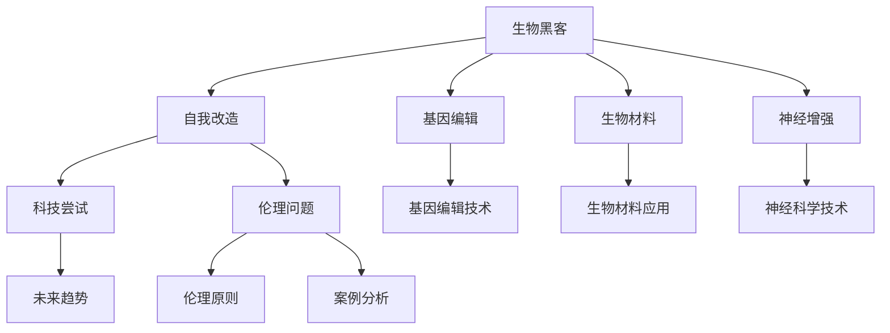

                 

### 文章标题

“生物黑客伦理：自我改造的科技尝试”

### 关键词

生物黑客、自我改造、伦理问题、科技尝试、未来趋势

### 摘要

本文深入探讨了生物黑客伦理这一新兴领域，从定义、历史、技术方法到伦理问题，全面解析了生物黑客的自我改造现象及其背后的科技尝试。通过具体案例分析和未来趋势展望，本文旨在揭示生物黑客伦理问题的重要性和复杂性，为相关政策制定和公众理解提供有力支持。

---

## 第1章 引言与核心概念

### 1.1 生物黑客的定义与历史

#### 生物黑客的定义

生物黑客，通常指的是利用科学和工程原理，以非传统或非正规途径探索和改变生物体的一种行为。这种行为的动机多种多样，包括追求知识、自我改进、艺术表达等。生物黑客通过结合生物学、计算机科学、工程学等多个学科，利用基因编辑、生物材料、人工智能等前沿技术，进行自我改造或对生物系统进行创新性改造。

#### 生物黑客的历史

生物黑客的历史可以追溯到20世纪末和21世纪初。最早的一批生物黑客被称为“生物艺术工作者”，他们利用生物技术进行艺术创作，如利用基因编辑技术创作转基因艺术作品。随着时间的推移，生物黑客的领域逐渐扩展，涵盖了从个人健康到生物工程的多个方面。

在2000年初，随着CRISPR-Cas9等基因编辑技术的出现，生物黑客开始探索自我改造的可能性。这些技术的普及使得个人可以在家中进行基因编辑实验，从而引发了关于生物黑客伦理的广泛讨论。

### 1.2 自我改造的概念与范围

#### 自我改造的概念

自我改造是指个体通过科学技术手段改变自己的生理或心理特征，以实现某种目标或提高生活质量。自我改造的形式多种多样，包括基因编辑、生物材料植入、神经增强等。

#### 自我改造的范围

自我改造的范围非常广泛，从基因层面到生物材料层面，再到神经科学领域，都有相关的技术手段。以下是一些常见的自我改造方式：

- **基因编辑**：利用CRISPR-Cas9等基因编辑技术，修改个体的基因序列，以预防遗传病、增强体质或实现其他目的。
- **生物材料植入**：通过植入生物材料（如纳米材料、生物可降解材料等），改变人体的物理或化学性质。
- **神经增强**：利用神经科学技术，如脑机接口、电刺激疗法等，增强个体的认知能力或控制力。

### 1.3 生物黑客的核心概念关系图

为了更清晰地理解生物黑客的核心概念及其相互关系，我们可以使用Mermaid图来表示：

图1：生物黑客核心概念关系图

### 1.4 生物黑客在科技发展中的地位与影响

生物黑客在科技发展中的地位日益重要，他们不仅推动了科学技术的前沿，也在社会伦理、法律和政策层面引发了深刻讨论。

#### 科技创新的推动者

生物黑客通过探索和应用前沿科技，如基因编辑、生物材料和神经科学，不断推动科技发展的边界。他们的研究为医学、农业、环境科学等多个领域带来了新的突破。

#### 社会伦理的挑战者

生物黑客的行为常常挑战现有的社会伦理观念。例如，基因编辑可能带来基因歧视和基因不平等问题，生物材料植入可能导致生物伦理和隐私问题，神经增强可能引发智力竞赛和道德困境。

#### 法律和政策的探索者

随着生物黑客技术的发展，法律和政策也需要不断调整以适应新的挑战。生物黑客在推动法律和政策创新的同时，也促使社会对伦理和法律问题进行更深入的探讨。

---

第1章介绍了生物黑客的定义、历史和自我改造的概念，并使用Mermaid图展示了核心概念之间的关系。通过这一章的介绍，读者可以初步了解生物黑客领域的多样性和复杂性，为后续章节的深入探讨打下基础。

---

## 第2章 生物黑客历史与发展

### 2.1 生物黑客的起源

生物黑客的起源可以追溯到20世纪末和21世纪初，当时科技和互联网的快速发展为生物黑客提供了广阔的舞台。最早的一批生物黑客多来自计算机科学和工程学领域，他们利用计算机技术和编程知识探索生物系统的可能性。

生物黑客的起源主要可以归因于几个关键因素：

- **开源生物技术的兴起**：互联网和开源运动的发展使得生物技术工具和资源变得容易获取，降低了进入生物黑客领域的门槛。
- **生物工程的突破**：基因编辑技术如CRISPR-Cas9的出现，使得基因层面的改造变得更加可行和便捷。
- **DIY生物学的崛起**：DIY生物学的兴起鼓励人们在家中尝试生物实验，推动了生物黑客文化的形成。

### 2.2 生物黑客的主要里程碑

生物黑客领域的发展经历了多个关键里程碑，以下是其中的一些重要事件：

- **2000年**：第一个生物艺术展览“生物艺术2000”在意大利举行，展示了生物黑客在艺术创作中的探索。
- **2012年**：CRISPR-Cas9基因编辑技术的出现，使得基因编辑变得容易且成本较低，生物黑客开始进行自我改造实验。
- **2015年**：“生物艺术黑客松”（BioArt Hackathon）在纽约举办，吸引了来自全球的生物黑客和艺术家参与。
- **2016年**：生物黑客组织“Genspace”在纽约成立，为生物黑客提供了一个共享实验室和社区平台。
- **2018年**：剑桥大学的科学家们首次使用CRISPR-Cas9基因编辑技术修改人类胚胎的基因，引发伦理和社会的广泛关注。

### 2.3 生物黑客社区的兴起与发展

生物黑客社区是生物黑客文化的重要组成部分，它为生物黑客提供了一个交流和合作的平台。生物黑客社区的特点如下：

- **开放性**：生物黑客社区通常非常开放，鼓励不同背景和技能的人参与其中，共同探索生物技术的可能性。
- **共享性**：社区成员共享资源、知识和经验，包括实验室设备、软件工具和研究成果。
- **合作性**：生物黑客社区成员往往通过合作完成复杂的科研项目，共同推动生物黑客技术的发展。

生物黑客社区的兴起和发展得益于以下几个因素：

- **互联网的普及**：互联网使得全球的生物黑客能够方便地进行交流与合作，打破了地域和时间的限制。
- **开源运动的推动**：开源运动为生物黑客提供了丰富的工具和资源，促进了技术的共享和合作。
- **DIY生物学的兴起**：DIY生物学的兴起激发了更多人参与生物黑客活动，促进了社区的发展。

### 2.4 生物黑客技术发展趋势

随着生物技术的不断进步，生物黑客技术也在不断发展。以下是生物黑客技术的几个主要发展趋势：

- **基因编辑技术的普及**：CRISPR-Cas9等基因编辑技术的普及，使得基因层面的改造变得更加常见和便捷。
- **生物材料的应用**：生物材料的研究和应用，如生物可降解材料、生物电子等，为生物黑客提供了更多的选择和可能性。
- **神经科学技术的融合**：神经科学与生物黑客技术的融合，如脑机接口、神经增强等，为个体提供了新的自我改造途径。
- **人工智能的结合**：人工智能在生物黑客中的应用，如自动化基因编辑、智能生物材料设计等，提高了生物黑客的技术水平和效率。

生物黑客技术的发展趋势不仅体现在技术本身，还体现在社会和伦理层面。随着技术的不断进步，生物黑客需要面对更多的伦理和社会问题，如基因编辑的伦理问题、生物材料的生物兼容性问题、神经增强的社会影响等。

---

第2章回顾了生物黑客的起源、主要里程碑、社区的发展以及技术趋势。通过这些内容，读者可以更深入地了解生物黑客领域的历史和发展，为后续章节的探讨提供背景知识。

---

## 第3章 自我改造的技术与方法

### 3.1 基于基因的技术

#### 基因编辑原理与工具

基因编辑技术是自我改造的核心手段之一，其中CRISPR-Cas9是最常用的工具。CRISPR-Cas9系统由一个向导RNA（gRNA）和一个核酸内切酶（Cas9）组成。gRNA负责定位目标DNA序列，而Cas9则在该序列上切割，从而实现基因的插入、删除或替换。

#### 基因编辑的伦理问题

尽管基因编辑技术在医疗和科研领域具有巨大的潜力，但其伦理问题也引起了广泛的关注。以下是一些主要的伦理问题：

- **基因歧视**：基因编辑可能导致基因优势和劣势的分化，进而引发基因歧视问题。
- **基因隐私**：基因信息的泄露可能对个体造成隐私侵犯和社会压力。
- **技术滥用**：基因编辑技术可能被滥用，用于非医学目的，如增强军事能力或创造“设计婴儿”。

#### 基因编辑的应用实例

基因编辑技术已经在多个领域得到了应用，以下是一些实例：

- **遗传病治疗**：基因编辑技术可以用于治疗遗传病，如囊性纤维化、肌营养不良等。
- **农业改良**：基因编辑技术可以用于改良农作物，提高产量、抗病性和营养价值。
- **生物研究**：基因编辑技术为生物研究提供了强大的工具，如构建基因敲除或敲入模型。

### 3.2 基于生物材料的技术

#### 生物材料的种类与应用

生物材料是自我改造的另一重要手段，包括生物可降解材料、生物电子和生物3D打印等。以下是一些常见的生物材料及其应用：

- **生物可降解材料**：如聚乳酸（PLA）、聚羟基烷酸（PHA）等，可用于植入人体，用于修复组织或作为药物载体。
- **生物电子**：如生物兼容性电极、生物电子皮肤等，可用于监测生物信号、实现脑机接口。
- **生物3D打印**：利用生物墨水（含有活细胞或细胞外基质）进行3D打印，用于构建组织和器官。

#### 生物材料的伦理考量

生物材料的伦理问题主要涉及生物兼容性、生物安全性和环境问题。以下是一些主要伦理问题：

- **生物兼容性**：生物材料需要与人体组织兼容，以避免免疫排斥或毒性反应。
- **生物安全性**：生物材料需要确保不会对宿主产生负面影响，如细菌感染或毒性释放。
- **环境问题**：生物材料的降解过程可能对环境产生影响，如产生有害物质。

#### 生物材料的应用实例

生物材料在医疗和生物工程领域得到了广泛应用，以下是一些实例：

- **组织工程**：利用生物材料构建人工组织，用于器官修复和再生医学。
- **药物递送**：利用生物材料作为药物载体，提高药物的治疗效果和安全性。
- **生物电子**：利用生物材料构建生物电子设备，用于监测和治疗生物信号。

### 3.3 基于人工智能的技术

#### 人工智能在生物黑客中的应用

人工智能在生物黑客中的应用日益广泛，包括自动化基因编辑、智能生物材料设计和个性化医疗等。以下是一些关键应用：

- **自动化基因编辑**：利用机器学习算法优化gRNA设计，提高基因编辑的准确性和效率。
- **智能生物材料设计**：利用人工智能预测生物材料的生物兼容性和降解特性，优化材料设计。
- **个性化医疗**：利用人工智能分析个体的基因组数据，制定个性化的治疗方案。

#### 人工智能伦理问题与对策

人工智能在生物黑客中的应用也带来了伦理问题，如算法偏见、数据隐私和数据滥用等。以下是一些对策：

- **算法偏见**：通过多样化的训练数据和公平性评估，减少算法偏见。
- **数据隐私**：确保个体数据的隐私和安全，采用数据加密和隐私保护技术。
- **数据滥用**：建立健全的法律和监管体系，防止数据滥用。

#### 人工智能应用实例

人工智能在生物黑客领域的应用实例包括：

- **自动化实验室操作**：利用机器人自动化进行生物实验，提高实验效率和准确性。
- **药物发现**：利用人工智能筛选药物候选物，加速新药研发。
- **个性化健康监测**：利用可穿戴设备和个人健康数据，实现个性化的健康监测和干预。

---

第3章详细介绍了基于基因、生物材料和人工智能的几种自我改造技术，并探讨了其应用和伦理问题。这些技术的进步为个体提供了更多自我改造的可能性，同时也带来了新的伦理挑战。

---

## 第4章 伦理问题与案例分析

### 4.1 生物黑客伦理的基本原则

生物黑客伦理是关于自我改造技术的道德规范，它旨在确保技术的使用符合社会伦理和法律标准。以下是生物黑客伦理的几个基本原则：

1. **尊重个体自主权**：个体有权决定是否进行自我改造，并在知情同意的情况下进行。
2. **公正与平等**：应避免因基因编辑、生物材料植入等自我改造技术导致的社会不公和基因歧视。
3. **透明与公开**：生物黑客活动应公开透明，确保公众知情并参与讨论。
4. **安全与健康**：自我改造技术应确保个体安全和健康，避免因技术失误或滥用导致的不良后果。
5. **责任与问责**：生物黑客应承担个人和技术责任，对于因技术使用造成的问题应承担相应的责任。

### 4.2 自我改造伦理案例分析

#### 成功案例

**案例一**：基因编辑治疗遗传病

一种成功案例是基因编辑技术在治疗遗传病中的应用。例如，CRISPR-Cas9技术被用于治疗一种罕见的遗传性疾病——脊髓性肌萎缩症（SMA）。通过基因编辑，患者体内的基因缺陷被修复，从而改善了症状。这一案例展示了基因编辑技术在医学领域的潜力，但也引发了关于伦理问题的讨论，如基因编辑的必要性和安全性。

**案例二**：生物材料植入提升运动能力

另一成功案例是生物材料植入技术提升运动员运动能力。例如，美国职业篮球运动员布莱恩特·格里芬（Blake Griffin）在2017年接受了生物材料植入手术，用于修复膝盖损伤。这一手术不仅帮助他迅速恢复了运动能力，还减少了手术后的恢复时间。这种技术的成功应用为运动员提供了新的治疗选择，但也引发了关于生物材料植入的伦理和法律问题。

#### 失败案例

**案例一**：基因编辑引发基因歧视

一个失败的案例是基因编辑可能导致基因歧视的问题。例如，如果基因编辑技术被用于增强智力或身体素质，可能会导致社会中的基因不平等。一些富裕家庭可能通过基因编辑来提高子女的智商或体能，而贫困家庭则无法享受这种技术，从而加剧社会不公。

**案例二**：生物材料植入引发免疫排斥

另一个失败的案例是生物材料植入引发的免疫排斥问题。例如，某些生物材料植入人体后，可能会引起免疫系统的反应，导致植入物的排斥或感染。这种问题不仅影响了患者的健康，也引发了关于生物材料生物兼容性和安全性的伦理争议。

### 4.3 国际伦理法规与政策

#### 全球生物黑客伦理法规综述

随着生物黑客技术的快速发展，国际社会开始关注其伦理问题，并制定了一系列伦理法规和政策。以下是一些重要的全球生物黑客伦理法规：

- **国际人类基因组编辑峰会宣言**：2015年，国际人类基因组编辑峰会在华盛顿召开，各国科学家、伦理学家和法律专家共同签署了《国际人类基因组编辑峰会宣言》，提出了关于基因编辑技术的伦理原则和建议。
- **联合国教科文组织生物伦理与人类权利委员会**：联合国教科文组织设立了生物伦理与人类权利委员会，负责监督和指导生物技术在全球范围内的应用，特别是基因编辑技术。
- **美国国家卫生研究院政策**：美国国家卫生研究院（NIH）制定了严格的基因编辑研究政策，要求进行基因编辑实验的科学家必须遵守伦理原则，并确保研究的安全性和伦理性。

#### 中国的生物黑客伦理政策

中国也在积极制定生物黑客伦理政策，以确保技术的发展符合社会伦理和法律法规。以下是一些中国的生物黑客伦理政策：

- **中国人类遗传资源管理暂行办法**：2019年，中国发布了《中国人类遗传资源管理暂行办法》，规范了人类遗传资源的采集、存储、利用和分享，确保生物黑客活动符合伦理要求。
- **中国科学技术部基因编辑研究指导原则**：2021年，中国科学技术部发布了《基因编辑研究指导原则》，对基因编辑技术的研究和应用提出了伦理要求和监管措施。
- **中国医学伦理学委员会**：中国医学伦理学委员会负责监督医学研究中的伦理问题，包括基因编辑和生物材料植入等自我改造技术。

---

第4章通过伦理基本原则的阐述和案例的分析，展示了生物黑客伦理问题的复杂性和多样性。同时，通过对国际和中国的伦理法规政策的介绍，为生物黑客活动提供了伦理指导和政策参考。

---

## 第5章 生物黑客社区与交流

### 5.1 生物黑客社区的组织形式

生物黑客社区通常具有以下几种组织形式：

- **线上社区**：许多生物黑客选择在社交媒体平台、论坛和在线讨论组中建立社区，如Reddit、Facebook群组和生物黑客论坛（如Biohacker论坛）。
- **线下实验室**：一些生物黑客选择在共享实验室、大学或研究机构的实验室中开展研究，如Genspace和Open Source Biology Lab。
- **黑客松和会议**：生物黑客社区会定期举办黑客松和会议，如“生物艺术黑客松”（BioArt Hackathon）和“生物黑客全球峰会”（Biohacker Global Summit），以促进知识分享和合作。

### 5.2 生物黑客社区的交流平台

生物黑客社区的交流平台主要包括：

- **社交媒体**：Twitter、Reddit和Facebook等社交媒体平台是生物黑客社区的重要交流工具，用于发布研究进展、讨论问题和分享资源。
- **论坛和讨论组**：生物黑客论坛和讨论组（如Reddit的r/Biohacking和Biohacker论坛）提供了专门的空间，供生物黑客进行深入讨论和知识交流。
- **在线会议和研讨会**：Zoom、Google Meet等在线会议工具使得生物黑客能够远程参与研讨会、讲座和培训，以获取最新的研究成果和技术动态。

### 5.3 生物黑客社区的活动与贡献

生物黑客社区的活动和贡献体现在多个方面：

- **知识分享**：社区成员通过在线平台和会议分享研究成果、实验方法和经验，促进了知识传播和技能提升。
- **资源共享**：社区成员共享实验室设备、试剂和工具，降低了生物实验的成本，提高了实验效率。
- **合作研究**：生物黑客社区成员通过合作进行跨学科研究，推动了生物黑客技术的进步和创新。
- **公众教育**：社区成员参与公众教育活动，向大众普及生物黑客技术和伦理问题，提高公众的科学素养。

生物黑客社区不仅为生物黑客提供了交流和合作的平台，也在推动生物黑客技术的发展和创新中发挥了重要作用。通过不断的知识共享和合作，生物黑客社区为生物黑客领域的发展注入了新的活力。

---

## 第6章 未来趋势与展望

### 6.1 生物黑客技术的未来发展方向

随着科技的不断进步，生物黑客技术在未来有着广阔的发展空间。以下是几个可能的发展方向：

- **基因编辑技术的优化**：未来的基因编辑技术可能会更加精确和高效，减少脱靶效应和遗传变异的风险。例如，基因为导向的编辑（Base Editing）和Prime Editing等新兴技术正在研究中。
- **生物材料的创新**：未来生物材料的研究将集中在提高生物兼容性、生物降解性和功能多样性上，例如智能生物材料，能够根据外部刺激（如温度、pH值等）改变其性质。
- **神经科学技术的融合**：神经科学与生物黑客技术的融合将带来新的突破，如更加高级的脑机接口和神经修复技术，以及针对认知增强的神经调控方法。
- **人工智能与生物黑客的结合**：人工智能在生物黑客技术中的应用将越来越广泛，从自动化基因编辑到智能生物材料设计，再到个性化医疗，人工智能将成为生物黑客的重要工具。

### 6.2 伦理问题的新挑战与应对策略

随着生物黑客技术的快速发展，伦理问题也将面临新的挑战。以下是几个可能的伦理问题及其应对策略：

- **隐私和数据安全**：随着基因编辑和生物材料植入的普及，个人隐私和数据安全问题将变得更加突出。应对策略包括加强数据加密和隐私保护措施，建立健全的数据监管机制。
- **基因歧视和不公平**：基因编辑和生物材料植入可能导致新的基因歧视和不公平现象。应对策略包括制定公平的法律和政策，确保技术的普及和可及性，避免因技术而加剧社会不公。
- **生物安全和生物伦理**：未来的生物黑客技术可能会带来新的生物安全和生物伦理问题。应对策略包括加强生物安全管理，建立健全的伦理审查机制，确保技术的安全性和伦理性。

### 6.3 生物黑客对社会的影响与影响评估

生物黑客技术对社会的影响将是深远且多层次的：

- **医疗健康**：生物黑客技术将显著改变医疗健康领域，从个性化治疗到疾病预防，都为患者提供了新的选择。然而，这也带来了新的挑战，如技术成本和可及性问题。
- **社会伦理**：生物黑客技术的普及将对社会伦理观念产生冲击，引发关于生命、个体权利和社会公正的深刻讨论。
- **法律和政策**：生物黑客技术的快速发展将促使法律和政策进行调整，以适应新技术带来的挑战。例如，制定关于基因编辑和生物材料植入的法律法规，确保技术的合理和规范应用。

通过评估生物黑客技术对未来社会的影响，我们可以更好地理解和应对这些变化，确保技术的发展符合社会伦理和法律法规的要求。

---

第6章探讨了生物黑客技术的未来发展趋势、新挑战及其对社会的影响。随着生物黑客技术的不断进步，我们需要关注其伦理问题，并制定相应的政策来确保技术的发展方向符合社会价值观和伦理标准。

---

## 第7章 生物黑客伦理教育与政策建议

### 7.1 生物黑客伦理教育的重要性

随着生物黑客技术的迅猛发展，伦理教育变得至关重要。生物黑客伦理教育不仅关系到技术的安全性和伦理性，也关系到社会对这一新兴领域的理解和接受程度。以下是生物黑客伦理教育的重要性：

- **技术责任**：伦理教育有助于生物黑客理解其技术行为的后果，并承担相应的责任，确保技术的使用符合伦理和法律标准。
- **公众信任**：通过伦理教育，可以提高公众对生物黑客技术的信任度，减少社会对技术的误解和担忧。
- **政策制定**：伦理教育为政策制定提供了理论基础，有助于制定更加科学和合理的生物黑客伦理政策。

### 7.2 生物黑客伦理教育的方法与内容

生物黑客伦理教育的目标不仅仅是传授知识，更重要的是培养学生的伦理意识和批判性思维能力。以下是几种有效的教育方法：

- **案例教学**：通过分析真实案例，让学生了解生物黑客技术在实际应用中面临的伦理问题，如基因编辑的社会影响、生物材料植入的潜在风险等。
- **模拟实验**：通过模拟实验，让学生亲身体验生物黑客技术的操作过程，并思考其在实际应用中的伦理问题。
- **跨学科教育**：生物黑客技术涉及多个学科，如生物学、计算机科学、伦理学等。跨学科教育有助于学生全面了解生物黑客技术的各个方面，提高其综合分析能力。

### 7.3 生物黑客伦理政策建议

为了确保生物黑客技术的健康发展，以下是一些政策建议：

- **法律法规的完善**：制定和实施关于基因编辑、生物材料植入等生物黑客技术的法律法规，明确技术使用的标准和程序，防止技术滥用。
- **伦理审查机制的建立**：建立独立的伦理审查机构，对生物黑客技术的研发和应用进行严格审查，确保技术的安全性和伦理性。
- **公众参与和透明度**：鼓励公众参与生物黑客技术的讨论和决策过程，提高透明度，增加社会对技术的理解和支持。
- **国际合作与交流**：加强国际生物黑客伦理政策的研究和合作，借鉴国际先进经验，推动全球生物黑客伦理的发展。

通过伦理教育和政策建议的有机结合，我们可以更好地应对生物黑客技术带来的伦理挑战，确保其健康和可持续发展。

---

第7章强调了生物黑客伦理教育的重要性，提出了具体的教育方法和政策建议。通过伦理教育和政策引导，我们可以促进生物黑客技术的健康发展，同时确保其符合社会伦理和法律要求。

---

## 文章小结

本文从多个角度深入探讨了生物黑客伦理这一新兴领域。我们从定义、历史、技术方法到伦理问题，详细解析了生物黑客的自我改造现象及其背后的科技尝试。通过具体案例分析和未来趋势展望，我们揭示了生物黑客伦理问题的重要性和复杂性。本文旨在为相关政策制定和公众理解提供有力支持，同时提醒我们在科技发展的道路上，伦理问题不容忽视。

## 最佳实践 Tips

1. **关注伦理培训**：定期参加生物黑客伦理培训，提高自身伦理意识和判断能力。
2. **遵守法律法规**：在研究和应用生物黑客技术时，严格遵守相关法律法规，确保技术使用的合法性。
3. **透明公开**：在生物黑客活动中，保持透明公开，提高公众对技术的理解和信任。
4. **多方参与**：在制定生物黑客伦理政策时，邀请各方参与讨论，确保政策的公平性和科学性。

## 注意事项

1. **技术安全**：在实验操作过程中，务必确保生物安全，防止生物污染和意外伤害。
2. **隐私保护**：在处理个人生物数据时，确保数据的安全和隐私，防止数据泄露和滥用。
3. **风险评估**：在应用生物黑客技术时，进行全面的风险评估，提前识别和应对潜在风险。

## 拓展阅读

- 《生物黑客：自我改造的科技时代》（作者：迈克尔·弗里曼，Michael Freeman）
- 《基因编辑：科技与伦理的碰撞》（作者：朱莉安娜·拉斯克，Juliana Rotich）
- 《生物伦理学导论》（作者：玛丽-弗朗斯·博尼安，Mary-Beth Bonsignore）

---

通过本文的探讨，我们希望读者能够对生物黑客伦理有更深入的理解，并在科技发展的道路上，以伦理为引导，推动生物黑客技术的健康发展。

## 作者信息

“作者：AI天才研究院/AI Genius Institute & 禅与计算机程序设计艺术 /Zen And The Art of Computer Programming”

