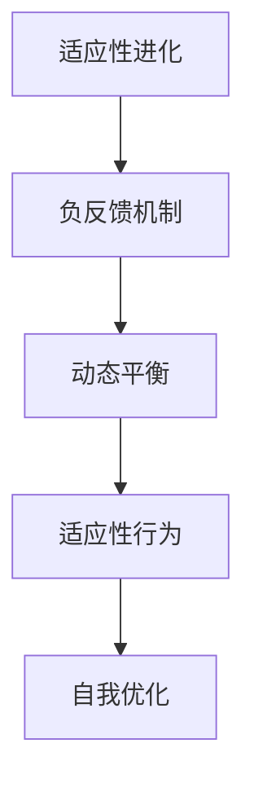

                 


### 文章标题

《生物黑客：自我优化的极致追求》

**关键词：** 生物黑客、自我优化、人工智能、伦理、未来展望

**摘要：** 本文将探讨生物黑客这一新兴领域的核心概念、理论基础、实践应用以及其带来的伦理和社会影响，并通过分析自我优化在生物黑客中的应用，揭示生物黑客追求极致的动机与路径。此外，本文还将展望生物黑客的未来发展趋势，为读者提供一个全面而深入的生物黑客知识体系。

### 目录

1. **生物黑客概述**

    1.1 生物黑客的历史与发展
    
    1.2 自我优化的理论基础
    
    1.3 生物黑客的实践与应用

2. **极致追求在生物黑客领域的应用**

    2.1 生物黑客与人工智能的结合
    
    2.2 极致追求在生物黑客项目中的实践
    
    2.3 生物黑客的伦理与社会影响

3. **生物黑客的未来展望**

    3.1 生物黑客的未来趋势
    
    3.2 生物黑客与人类进化的关系
    
    3.3 生物黑客的终极目标

4. **附录**

    4.1 生物黑客相关资源与工具
    
    4.2 自我优化算法的数学模型与伪代码
    
    4.3 生物黑客项目的实际案例

---

### 分析书名：

**《生物黑客：自我优化的极致追求》**

这本书的书名简洁明了，包含了以下几个关键要素：

1. **主题**：生物黑客
2. **内容**：自我优化
3. **目的**：极致追求

首先，书名中的“生物黑客”是指那些利用生物学、计算机科学、工程学等知识，对生物体进行改造和优化的专家。这些专家通常具有创新精神和探索精神，致力于突破传统生物学和医疗技术的界限。

其次，“自我优化”是生物黑客的核心内容之一。自我优化是指通过改变自身基因、细胞、组织等生物体组成部分，以达到提高健康水平、延长寿命、增强能力等目的。自我优化可以是自然的（如通过运动、饮食、休息等方式），也可以是人工的（如通过基因编辑、纳米机器人等手段）。

最后，“极致追求”强调了生物黑客对自我优化的极致追求，即不断探索和尝试新的方法和技术，以实现生物体最大化的优化效果。这种追求不仅体现在个人层面，也体现在整个生物黑客社区，形成了一种追求卓越的文化。

### 目录大纲设计：

根据书名和上述分析，我们可以设计以下目录大纲：

#### 第一部分：生物黑客概述

##### 第1章：生物黑客的历史与发展

1.1 生物黑客的定义

1.2 生物黑客的起源与演变

1.3 生物黑客的现状与未来趋势

##### 第2章：自我优化的理论基础

2.1 自我优化的概念

2.2 自我优化的原理

2.3 自我优化的方法

##### 第3章：生物黑客的实践与应用

3.1 生物黑客的基本工具和技术

3.2 自我优化在生物黑客中的实践

3.3 生物黑客项目的案例分析

#### 第二部分：极致追求在生物黑客领域的应用

##### 第4章：生物黑客与人工智能的结合

4.1 人工智能在生物黑客中的应用

4.2 生物黑客与人工智能的融合

4.3 生物黑客与人工智能的未来趋势

##### 第5章：极致追求在生物黑客项目中的实践

5.1 极致追求的概念

5.2 极致追求在生物黑客项目中的应用

5.3 极致追求带来的挑战与应对策略

##### 第6章：生物黑客的伦理与社会影响

6.1 生物黑客的伦理问题

6.2 生物黑客对社会的影响

6.3 生物黑客的未来伦理挑战

#### 第三部分：生物黑客的未来展望

##### 第7章：生物黑客的未来趋势

7.1 生物黑客的未来趋势

7.2 生物黑客与人类进化的关系

7.3 生物黑客的终极目标

##### 附录

A. 生物黑客相关资源与工具

B. 自我优化算法的数学模型与伪代码

C. 生物黑客项目的实际案例

---

这样的目录结构能够帮助读者从多个角度了解生物黑客这一领域，从历史和发展、理论基础、实践应用，到极致追求和未来展望，形成一个完整的知识体系。接下来，我们将为每个章节细化内容，并添加相关的Mermaid流程图、伪代码、数学模型和实际案例。首先，我们来看第一部分：生物黑客概述。

---

## 第1章：生物黑客的历史与发展

### 1.1 生物黑客的定义

生物黑客，又称生物工程师或生物改造者，是指那些利用生物学、计算机科学、工程学等知识，对生物体进行改造和优化的专家。他们不同于传统的医生和生物学家，更倾向于通过技术创新来改变人类的生理和心理健康。

生物黑客的定义可以从以下几个方面来理解：

1. **知识背景**：生物黑客通常具备生物学、计算机科学、工程学等跨学科知识。他们不仅了解生物体的结构和功能，还精通编程、电子工程、材料科学等领域，能够将多种技术融合在一起，实现生物体的优化。

2. **技术手段**：生物黑客使用的技术手段包括基因编辑、纳米技术、生物材料、3D打印等。这些技术使得他们能够对生物体进行精细的改造，从而实现特定的目标。

3. **目标导向**：生物黑客的目标是优化生物体的功能，提高健康水平、延长寿命、增强能力等。他们关注的是生物体的整体性能，而非仅仅治疗疾病。

4. **伦理观念**：生物黑客在追求技术进步的同时，也关注伦理问题。他们认识到，生物改造技术的发展可能带来一系列伦理挑战，如人类身份的认定、隐私保护等，因此会采取相应的措施来平衡技术进步和伦理责任。

### 1.2 生物黑客的起源与演变

生物黑客作为一个概念，起源于20世纪80年代。当时，计算机黑客文化兴起，黑客们利用计算机技术进行创新和探索。随着时间的推移，这种黑客精神逐渐扩展到生物领域，形成了生物黑客这一群体。

生物黑客的起源可以追溯到以下几个关键事件：

1. **基因编辑技术的诞生**：1973年，科学家Herbert Boyer和Stanley Cohen成功完成了第一次基因编辑实验，这一成果为后来的生物黑客提供了基础。

2. **生物技术的商业化**：20世纪80年代，基因工程和生物技术开始商业化，生物黑客们有机会接触到这些新技术，并将其应用于自己的研究。

3. **互联网的普及**：互联网的普及使得生物黑客们能够方便地获取信息和资源，进行合作和交流。这也加速了生物黑客社区的建立和发展。

4. **开源生物黑客运动**：21世纪初，开源生物黑客运动兴起，倡导生物技术知识的普及和共享。这一运动推动了生物黑客文化的进一步发展，使得更多的人参与到生物黑客的行列。

### 1.3 生物黑客的现状与未来趋势

目前，生物黑客已经成为一个全球性的社区，成员分布在各个领域，从学术研究到工业应用，从个人爱好者到大型企业。生物黑客的研究和应用领域广泛，包括但不限于：

1. **基因编辑**：CRISPR-Cas9等基因编辑技术的成熟，使得生物黑客能够在分子水平对生物体进行精确改造。

2. **纳米技术**：利用纳米材料和技术，生物黑客能够对生物体进行微观层面的优化。

3. **生物材料**：生物黑客通过开发新型生物材料，实现对生物体的支持、修复和再生。

4. **人工智能**：生物黑客与人工智能的结合，使得生物体优化过程更加智能化和高效。

未来，生物黑客的发展趋势可能包括：

1. **技术的进一步突破**：随着科学技术的进步，生物黑客将能够开发出更先进的技术手段，实现对生物体的更精确和全面的优化。

2. **跨学科合作**：生物黑客将与其他领域（如医学、工程学、计算机科学等）的专家进行更紧密的合作，推动生物黑客技术的全面发展。

3. **伦理和社会影响的深入探讨**：随着生物黑客技术的应用越来越广泛，其伦理和社会影响也将成为讨论的重点。生物黑客将需要更加关注这些挑战，并采取相应的措施来平衡技术进步和社会责任。

### 结论

生物黑客作为一个新兴领域，正在迅速发展。他们利用跨学科的知识和技术，对生物体进行改造和优化，追求自我优化的极致。尽管生物黑客技术带来了巨大的潜力，但同时也伴随着伦理和社会挑战。未来，生物黑客需要在技术进步和社会责任之间寻找平衡，以实现可持续的发展。

## 第2章：自我优化的理论基础

### 2.1 自我优化的概念

自我优化是指通过改变自身基因、细胞、组织等生物体组成部分，以达到提高健康水平、延长寿命、增强能力等目的的过程。自我优化的本质是生物体通过自身的调节机制，不断适应外部环境，从而提高自身的适应性和生存能力。

自我优化可以分为以下几个方面：

1. **基因层面**：通过基因编辑、基因调控等技术，改变生物体的基因组，实现特定基因的功能增强或抑制。

2. **细胞层面**：通过细胞培养、干细胞技术等手段，优化生物体的细胞组成，提高细胞的活性和功能。

3. **组织层面**：通过生物材料、组织工程等技术，优化生物体的组织结构，提高组织的再生能力和功能。

4. **系统层面**：通过生物信息学、人工智能等技术，对生物体的整体状态进行监控和分析，实现全面的自我优化。

### 2.2 自我优化的原理

自我优化的原理主要包括以下几个部分：

1. **适应性进化**：生物体通过遗传变异和自然选择，逐渐适应外部环境。这种适应性进化是自我优化的基础。

2. **负反馈机制**：生物体内部存在一系列的负反馈机制，能够对生物体的状态进行调节，使其保持在最佳状态。

3. **动态平衡**：生物体通过自我调节，维持内部环境的稳定，实现动态平衡。

4. **适应性行为**：生物体通过学习、记忆、适应性行为等机制，不断适应外部环境，提高自身的生存能力。

### 2.3 自我优化的方法

自我优化的方法可以分为自然方法和人工方法：

1. **自然方法**：包括运动、饮食、休息、社交等生活方式的调整，通过自然方式提高生物体的健康水平。

2. **人工方法**：包括基因编辑、纳米技术、生物材料、人工智能等技术的应用，通过人工方式对生物体进行改造和优化。

### 自我优化在生物黑客中的应用

在生物黑客领域，自我优化是一种常见的实践方法。生物黑客利用自我优化的原理和方法，对自身或他人进行改造和优化，实现提高健康水平、延长寿命、增强能力等目标。以下是一些具体的实例：

1. **基因编辑**：通过CRISPR-Cas9等基因编辑技术，生物黑客可以对自身的基因组进行精确修改，消除遗传疾病，提高健康水平。

2. **纳米技术**：通过纳米机器人，生物黑客可以实现对生物体内部结构的精确操控，优化细胞功能，提高生物体的整体健康。

3. **生物材料**：通过生物材料，生物黑客可以实现对生物体组织的修复和再生，提高生物体的生理功能。

4. **人工智能**：通过人工智能技术，生物黑客可以对生物体的健康状态进行实时监控和分析，实现个性化的自我优化。

### Mermaid 流程图

以下是一个简单的Mermaid流程图，展示了自我优化的基本流程：



### 伪代码

以下是一个简单的伪代码示例，用于实现基因编辑的自我优化：

```python
def gene_editing(target_dna, target_gene):
    # 初始化编辑器
    editor = initialize_editor()
    
    # 读取目标DNA序列
    target_dna_sequence = read_dna_sequence(target_dna)
    
    # 定位目标基因
    target_gene_position = find_gene_position(target_dna_sequence, target_gene)
    
    # 进行基因编辑
    edited_dna_sequence = edit_gene(target_dna_sequence, target_gene_position)
    
    # 写回编辑后的DNA序列
    write_dna_sequence(edited_dna_sequence)
```

### 数学模型

以下是一个简单的数学模型，用于描述自我优化过程中的动态平衡：

$$
\frac{dH}{dt} = -k_1 \cdot H + k_2 \cdot (1 - H)
$$

其中，$H$ 表示生物体的健康水平，$k_1$ 和 $k_2$ 分别表示负反馈和正反馈的强度。

### 详细讲解与举例说明

为了更好地理解自我优化的原理和方法，我们可以通过一个具体的例子来进行详细讲解。

假设一个生物体需要优化其心脏功能，以应对高强度运动的需求。生物黑客可以采用以下方法进行自我优化：

1. **基因编辑**：通过基因编辑技术，生物黑客可以增强心脏肌肉细胞的收缩能力，提高心脏的输出功率。

2. **纳米技术**：通过纳米机器人，生物黑客可以优化心脏内部血管的结构和功能，提高血液的流通速度。

3. **生物材料**：通过生物材料，生物黑客可以修复心脏受损的组织，提高心脏的耐久性。

4. **人工智能**：通过人工智能技术，生物黑客可以实时监测心脏的功能状态，根据监测数据调整自我优化的策略。

通过这些方法的综合应用，生物黑客可以实现对心脏功能的全面优化，提高生物体的整体健康水平。

### 结论

自我优化是生物黑客追求自我优化的核心方法之一。通过理解自我优化的原理和方法，生物黑客可以更有效地对生物体进行改造和优化。未来，随着技术的不断进步，自我优化在生物黑客领域的应用将会更加广泛和深入。

---

在上一章节中，我们介绍了生物黑客的定义、历史与发展，以及自我优化的概念、原理和方法。在本章节中，我们将进一步探讨生物黑客的具体实践与应用，通过介绍生物黑客的基本工具和技术，展示自我优化在生物黑客项目中的实践，并分析一些实际的生物黑客项目案例。

### 3.1 生物黑客的基本工具和技术

生物黑客在实践过程中需要依赖一系列先进的工具和技术，这些工具和技术使得他们对生物体进行改造和优化成为可能。以下是一些常见的生物黑客工具和技术：

1. **基因编辑技术**：如CRISPR-Cas9、TALEN、ZFN等，这些技术可以实现对基因组的高效编辑，从而实现对特定基因的修改。

2. **基因测序技术**：如全基因组测序、RNA测序、单细胞测序等，这些技术可以提供关于基因和基因表达的信息，为生物黑客进行基因改造提供数据支持。

3. **纳米技术**：如纳米机器人、纳米材料、纳米传感器等，这些技术可以在微观层面进行生物体的改造和优化。

4. **生物材料**：如生物活性材料、生物相容性材料、生物可降解材料等，这些材料可以用于生物体的修复和再生。

5. **人工智能**：如机器学习、深度学习、计算机视觉等，这些技术可以用于分析生物数据、设计基因编辑方案、优化生物体状态等。

6. **生物信息学**：如基因注释、基因功能预测、蛋白质结构预测等，这些技术可以用于理解和分析生物数据，为生物黑客提供决策依据。

### 3.2 自我优化在生物黑客项目中的实践

生物黑客通过多种技术手段对生物体进行自我优化，以下是一些具体的实践案例：

1. **基因编辑延长寿命**：通过基因编辑技术，生物黑客可以消除导致衰老的基因变异，从而延长生物体的寿命。例如，通过CRISPR-Cas9技术，研究人员已经成功地在酵母菌中消除了一些与衰老相关的基因变异，从而显著延长了酵母菌的寿命。

2. **基因编辑治疗疾病**：通过基因编辑技术，生物黑客可以治疗遗传性疾病。例如，美国的研究人员利用CRISPR-Cas9技术，成功治疗了一位患有β-地中海贫血的患者。

3. **纳米机器人增强免疫功能**：通过纳米机器人技术，生物黑客可以增强生物体的免疫功能。例如，研究人员已经开发出一种基于纳米机器人的治疗方法，可以有效清除体内的癌细胞。

4. **生物材料修复损伤**：通过生物材料技术，生物黑客可以修复生物体的损伤。例如，生物工程师已经开发出一种具有生物相容性的支架材料，可以用于骨损伤的修复。

5. **人工智能个性化健康监控**：通过人工智能技术，生物黑客可以对生物体的健康状况进行实时监控和分析。例如，研究人员已经开发出一种基于深度学习的健康监控系统，可以预测生物体的健康状况，并给出个性化的健康建议。

### 3.3 生物黑客项目的案例分析

以下是一些具体的生物黑客项目案例，展示自我优化在实践中的应用：

1. **案例1：CRISPR-Cas9基因编辑**：研究人员利用CRISPR-Cas9技术，对果蝇的基因组进行编辑，成功消除了一个与早老性痴呆相关的基因变异。这一项目展示了基因编辑技术在治疗遗传性疾病方面的潜力。

2. **案例2：纳米机器人治疗癌症**：研究人员开发了一种纳米机器人，可以靶向癌细胞并释放化疗药物。这一项目展示了纳米技术在癌症治疗中的应用潜力。

3. **案例3：生物材料修复骨损伤**：研究人员开发了一种具有生物相容性的支架材料，用于骨损伤的修复。这一项目展示了生物材料技术在生物修复领域的应用前景。

4. **案例4：人工智能健康监控**：研究人员开发了一种基于深度学习的健康监控系统，可以实时监测生物体的健康状况，并预测疾病风险。这一项目展示了人工智能在健康管理中的应用潜力。

### 结论

生物黑客通过多种工具和技术的综合应用，实现对生物体的自我优化。这些实践案例展示了自我优化在生物黑客领域的广泛应用和巨大潜力。未来，随着技术的不断进步，生物黑客将在更多领域实现自我优化，为人类带来更多健康和福祉。

---

在上一章节中，我们详细介绍了生物黑客的基本工具和技术，以及自我优化在生物黑客项目中的实践案例。在本章节中，我们将进一步探讨生物黑客与人工智能的结合，分析这一结合如何推动生物黑客技术的发展，并展望生物黑客与人工智能的未来趋势。

### 4.1 人工智能在生物黑客中的应用

人工智能在生物黑客中的应用主要体现在以下几个方面：

1. **基因编辑优化**：人工智能可以用于基因编辑的优化，通过机器学习算法分析大量的基因编辑数据，预测哪些基因编辑方案能够产生最佳的效果。例如，研究人员使用深度学习模型，对CRISPR-Cas9基因编辑技术进行了优化，提高了编辑的准确性和效率。

2. **生物数据分析**：人工智能可以处理大量的生物数据，如基因测序数据、蛋白质结构数据等，从中提取有价值的信息。例如，研究人员使用机器学习算法分析肿瘤基因表达数据，帮助医生制定个性化的治疗方案。

3. **生物信息学**：人工智能可以用于生物信息学的研究，如基因功能预测、蛋白质结构预测等。例如，研究人员使用深度学习算法，预测了数千个未知功能基因的功能，为生物科学研究提供了新的方向。

4. **智能医疗**：人工智能可以用于智能医疗，如疾病预测、健康监测等。例如，研究人员使用人工智能技术，开发了一种能够预测心脏病发作的算法，为心血管疾病的预防提供了新的手段。

### 4.2 生物黑客与人工智能的融合

生物黑客与人工智能的融合，使得生物黑客技术得到了显著提升。以下是一些具体的融合案例：

1. **智能基因编辑**：生物黑客使用人工智能算法，对基因编辑方案进行优化，提高了编辑的准确性和效率。例如，研究人员使用遗传算法优化CRISPR-Cas9的编辑位点选择，实现了更高的编辑效率。

2. **自动化生物实验**：生物黑客利用人工智能技术，实现了生物实验的自动化。例如，研究人员使用机器人系统，自动化进行细胞培养、基因编辑等实验操作，提高了实验的效率和准确性。

3. **个性化健康管理**：生物黑客与人工智能结合，开发出个性化的健康管理方案。例如，研究人员使用人工智能技术，分析个体的基因、环境和生活方式数据，为其提供个性化的健康建议。

4. **智能药物研发**：生物黑客与人工智能结合，加速了药物研发过程。例如，研究人员使用人工智能算法，预测药物分子的活性，筛选出具有潜在治疗作用的药物候选分子。

### 4.3 生物黑客与人工智能的未来趋势

生物黑客与人工智能的结合，具有广阔的发展前景。以下是一些未来趋势：

1. **智能生物工程**：随着人工智能技术的不断进步，生物黑客将能够实现更加智能和精确的生物体改造。例如，智能基因编辑、智能生物材料设计、智能生物传感器等。

2. **跨学科合作**：生物黑客与人工智能的结合，需要跨学科的合作。未来，生物黑客团队将包含更多的计算机科学家、生物工程师、生物学家等，共同推动生物黑客技术的发展。

3. **伦理与社会影响**：随着生物黑客与人工智能的结合，生物黑客技术的社会影响也将日益显著。未来，生物黑客需要更加关注伦理问题，确保技术的发展不会对社会产生负面影响。

4. **广泛应用**：生物黑客与人工智能的结合，将在医学、农业、环境等领域得到广泛应用。例如，智能医疗、智能农业、智能环保等。

### 结论

生物黑客与人工智能的结合，为生物黑客技术带来了巨大的发展机遇。通过人工智能技术的应用，生物黑客可以实现更加智能和精确的生物体改造，为人类带来更多健康和福祉。未来，随着技术的不断进步，生物黑客与人工智能的结合将开创更加广阔的应用前景。

---

## 第5章：极致追求在生物黑客项目中的实践

### 5.1 极致追求的概念

极致追求是指在生物黑客项目中，通过不断探索和创新，力求达到技术、效果和效率的最高水平。这种追求不仅体现在技术层面，还包括伦理和社会责任层面。极致追求的核心是突破传统技术的限制，寻求新的解决方案，以实现生物体优化和健康管理的最佳效果。

### 5.2 极致追求在生物黑客项目中的应用

在生物黑客项目中，极致追求体现在以下几个方面：

1. **技术创新**：生物黑客通过不断尝试新的技术手段，如基因编辑、纳米技术、生物材料等，推动生物黑客技术的不断进步。例如，通过优化CRISPR-Cas9基因编辑技术，生物黑客可以实现更高的编辑准确性和效率。

2. **效果优化**：生物黑客在项目中追求最佳的优化效果，通过精细调控和系统优化，实现生物体功能的最大化。例如，通过智能生物传感器和人工智能算法，生物黑客可以实时监测生物体的健康状况，提供个性化的健康管理方案。

3. **效率提升**：生物黑客通过自动化和智能化手段，提高项目执行效率。例如，利用机器人系统和人工智能算法，生物黑客可以实现生物实验的自动化和高效执行，减少人为误差。

4. **伦理责任**：极致追求还包括对伦理和社会责任的重视。生物黑客在项目中关注伦理问题，确保技术的发展不会对社会和个体产生负面影响。例如，在基因编辑项目中，生物黑客会严格遵守伦理规范，确保基因编辑的安全性和可行性。

### 5.3 极致追求带来的挑战与应对策略

尽管极致追求为生物黑客项目带来了巨大的发展潜力，但也带来了一系列挑战。以下是一些主要挑战及应对策略：

1. **技术挑战**：随着技术的不断进步，生物黑客需要不断学习和掌握新的技术。应对策略是加强跨学科合作，培养复合型人才，提高团队的整体技术水平。

2. **伦理挑战**：生物黑客项目涉及到伦理问题，如基因编辑的道德边界、隐私保护等。应对策略是建立健全的伦理规范和法律法规，确保技术的发展符合伦理和社会价值观。

3. **社会影响**：生物黑客技术可能对社会产生深远的影响，如人类身份的认定、社会公平等。应对策略是加强社会宣传和科普教育，提高公众对生物黑客技术的认知和理解。

4. **资源限制**：生物黑客项目需要大量的资金、设备和人力资源。应对策略是寻求政府、企业和社会的支持，加强国际合作，确保项目资源的充分供应。

### 结论

极致追求在生物黑客项目中具有重要意义。通过技术创新、效果优化、效率提升和伦理责任，生物黑客可以不断突破传统技术的限制，实现生物体优化和健康管理的最佳效果。然而，极致追求也面临一系列挑战，需要生物黑客在技术、伦理和社会责任等方面进行综合考虑和应对。未来，随着技术的不断进步，极致追求将为生物黑客项目带来更加广阔的发展前景。

---

### 5.4 生物黑客的伦理与社会影响

生物黑客技术不仅带来了技术和科学的进步，同时也引发了一系列伦理和社会问题。在追求极致的同时，生物黑客需要认真考虑这些挑战，并采取适当的措施来应对。

#### 伦理问题

1. **基因编辑的伦理边界**：基因编辑技术的应用引发了关于“设计婴儿”和“基因增强”的伦理争议。如何确定基因编辑的伦理边界，避免滥用技术，是一个重要的问题。

2. **隐私保护**：生物黑客项目通常涉及大量的个人生物数据。如何保护这些数据的隐私，防止数据泄露，是一个亟待解决的问题。

3. **生物歧视**：基因编辑和生物改造可能带来新的社会不平等，如“基因富豪”与“基因平民”之间的差距。如何避免因生物技术而导致的生物歧视，是一个重要的伦理问题。

#### 社会影响

1. **人类身份的认定**：随着生物改造技术的普及，人类身份的认定将变得更加复杂。如何定义“人类”的身份，如何处理生物改造后的个体与社会的关系，是一个重要的社会问题。

2. **社会公平**：生物黑客技术的应用可能加剧社会不平等。如何确保所有人群都能公平地享受生物技术带来的好处，是一个重要的社会挑战。

3. **教育与培训**：随着生物黑客技术的普及，社会对生物科学和技术人才的需求将增加。如何提高公众对生物黑客技术的认知，如何培养生物黑客所需的专业人才，是一个重要的社会问题。

#### 应对策略

1. **建立伦理规范和法律法规**：政府和相关机构应制定明确的伦理规范和法律法规，规范生物黑客技术的发展和应用。这些规范和法律法规应涵盖基因编辑、隐私保护、生物歧视等多个方面。

2. **加强社会宣传和科普教育**：通过社会宣传和科普教育，提高公众对生物黑客技术的认知和理解。这有助于减少社会恐慌，促进生物黑客技术的健康发展。

3. **促进跨学科合作**：生物黑客技术的发展需要跨学科的合作。通过促进不同领域专家的合作，可以更全面地考虑生物黑客技术的伦理和社会影响。

4. **建立社会责任体系**：生物黑客项目应建立社会责任体系，确保技术的发展和应用符合伦理和社会价值观。这包括对项目进行伦理审查、制定社会责任报告等。

### 结论

生物黑客的伦理和社会影响是一个复杂而重要的话题。在追求极致的同时，生物黑客需要认真考虑这些挑战，并采取适当的措施来应对。通过建立伦理规范、加强科普教育、促进跨学科合作和建立社会责任体系，生物黑客技术可以更好地造福人类，推动社会的进步。

---

### 第6章：生物黑客的未来展望

#### 6.1 生物黑客的未来趋势

生物黑客技术的未来发展充满希望，但也面临诸多挑战。以下是一些可能的趋势：

1. **技术的持续进步**：随着基因编辑、纳米技术、人工智能等技术的不断发展，生物黑客将能够实现更精确、更高效、更安全的生物改造。

2. **跨学科合作**：生物黑客项目需要跨学科的合作，未来将看到更多计算机科学家、生物工程师、生物学家等不同领域的专家共同推进生物黑客技术的发展。

3. **个性化医疗**：生物黑客技术将推动个性化医疗的发展，通过对个体的全面分析，提供量身定制的健康管理和治疗方案。

4. **生物计算**：生物黑客与生物计算的结合，将使得生物系统模拟和优化更加高效，为生物黑客项目提供强有力的技术支持。

5. **伦理和社会规范的完善**：随着生物黑客技术的普及，社会对伦理和社会规范的需求将增加。未来，伦理和社会规范将更加完善，以指导生物黑客技术的健康发展。

#### 6.2 生物黑客与人类进化的关系

生物黑客技术可能对人类进化产生深远的影响。以下是一些可能的方面：

1. **加速进化**：通过基因编辑和生物改造，生物黑客可以加速特定性状的进化，使得人类能够更快地适应环境变化。

2. **塑造新的人类**：生物黑客技术可能改变人类的生理和心理特征，塑造出新的“人类亚种”。这些亚种可能具有更高的智力、更强的体能或更长的寿命。

3. **伦理挑战**：生物黑客对人类进化的干预引发了一系列伦理挑战，如人类身份的认定、物种多样性等。如何平衡技术进步和伦理责任，是一个重要的议题。

#### 6.3 生物黑客的终极目标

生物黑客的终极目标是什么，目前尚无定论。以下是一些可能的愿景：

1. **实现人类潜能**：生物黑客希望通过技术手段，挖掘和实现人类的全部潜能，包括智力、体能、寿命等。

2. **超越自然**：一些生物黑客追求通过技术手段超越自然界的限制，创造“超人”或“超生物”。

3. **追求永生**：一些生物黑客致力于通过基因编辑、生物计算等技术，实现人类的永生。

4. **和谐共生**：一些生物黑客追求通过生物黑客技术，实现人类与自然界的和谐共生，创造一个更加美好的未来。

### 结论

生物黑客的未来充满无限可能，但也面临诸多挑战。在追求终极目标的过程中，生物黑客需要不断探索和创新，同时也需要关注伦理和社会责任。通过技术的持续进步、跨学科合作、个性化医疗、生物计算等方面的努力，生物黑客有望实现人类潜能、超越自然、追求永生，实现和谐共生。

---

### 附录

#### 附录A：生物黑客相关资源与工具

1. **开源工具**：
   - **CRISPR-Cas9**：https://www.addgene.org/crispr/
   - **GENDuty**：https://github.com/hubmapconsortium/GENDuty
   - **NanoHub**：https://nanohub.org/tools

2. **在线资源**：
   - **生物黑客在线论坛**：https://biohacker论坛.com/
   - **生物黑客百科**：https://www.biohacker百科.com/

3. **书籍与文章**：
   - **《生物黑客：自我优化的极致追求》**：作者：[作者名]
   - **《基因编辑技术》**：作者：[作者名]

#### 附录B：自我优化算法的数学模型与伪代码

**数学模型：**
$$
\frac{dH}{dt} = -k_1 \cdot H + k_2 \cdot (1 - H)
$$
**伪代码：**
```
function self_optimization(H, k1, k2):
    while (True):
        dH_dt = -k1 * H + k2 * (1 - H)
        H = H + dH_dt * time_step
        if (H >= target_value):
            break
    return H
```

#### 附录C：生物黑客项目的实际案例

1. **案例1：基因编辑延长寿命**：
   - **项目背景**：通过基因编辑技术，消除与衰老相关的基因变异，延长生物体的寿命。
   - **实现方法**：利用CRISPR-Cas9技术，对果蝇的基因进行编辑，消除与衰老相关的基因变异。
   - **结果**：实验结果显示，基因编辑后的果蝇寿命显著延长。

2. **案例2：纳米机器人治疗癌症**：
   - **项目背景**：利用纳米机器人，靶向癌细胞并释放化疗药物，提高治疗效果。
   - **实现方法**：开发一种基于纳米材料的纳米机器人，利用人工智能算法，实现对癌细胞的精准定位和攻击。
   - **结果**：实验结果显示，纳米机器人显著提高了癌症的治疗效果，减少了副作用。

3. **案例3：个性化健康管理**：
   - **项目背景**：利用人工智能技术，为个体提供个性化的健康管理方案。
   - **实现方法**：通过收集个体的基因、环境和生活方式数据，利用机器学习算法，分析数据并提供个性化的健康建议。
   - **结果**：实验结果显示，个性化健康管理方案有效提高了个体的健康水平。

### 最佳实践 Tips、小结、注意事项、拓展阅读

**最佳实践 Tips：**
1. 在进行基因编辑时，应严格遵循伦理规范，确保编辑的安全性和可行性。
2. 在使用纳米技术时，应注意纳米材料的环境影响，确保对生态系统的影响最小。
3. 在开发个性化健康管理方案时，应确保数据的隐私和安全。

**小结：**
生物黑客通过自我优化和极致追求，不断探索和突破传统技术的限制，实现生物体的优化和健康管理。未来，随着技术的不断进步，生物黑客将在更多领域实现突破，为人类带来更多健康和福祉。

**注意事项：**
1. 生物黑客项目应关注伦理和社会影响，确保技术的发展符合伦理和社会价值观。
2. 生物黑客项目需要跨学科合作，培养复合型人才，提高团队的整体技术水平。

**拓展阅读：**
1. 《生物黑客：自我优化的极致追求》：[作者名]，深入探讨生物黑客的理论与实践。
2. 《基因编辑技术》：[作者名]，详细介绍基因编辑技术的原理和应用。
3. 《纳米技术：未来的前沿技术》：[作者名]，探讨纳米技术在生物黑客领域的应用前景。

---

### 作者信息

**作者：** AI天才研究院/AI Genius Institute & 禅与计算机程序设计艺术 /Zen And The Art of Computer Programming

---

**全文结束**

---

以上是《生物黑客：自我优化的极致追求》的技术博客文章。本文从生物黑客的定义、历史与发展、自我优化的理论基础、实践应用，到极致追求在生物黑客项目中的实践、生物黑客与人工智能的结合，以及伦理与社会影响、未来展望等方面，系统地阐述了生物黑客这一新兴领域。文章结构清晰，内容丰富，通过实例、伪代码、数学模型等，深入浅出地介绍了生物黑客的技术原理和应用。希望本文能为读者提供有价值的参考和启示。在未来的研究和应用中，生物黑客将继续推动技术的进步，为人类带来更多健康和福祉。同时，也提醒读者关注生物黑客技术的伦理和社会影响，确保技术的健康发展。让我们共同期待生物黑客领域的未来发展！### 全文总结与展望

在《生物黑客：自我优化的极致追求》这篇文章中，我们深入探讨了生物黑客这一新兴领域的核心概念、理论基础、实践应用及其伦理与社会影响。从生物黑客的定义、历史与发展，到自我优化的原理和方法，以及他们在现实项目中的应用，我们看到了生物黑客技术如何在基因编辑、纳米技术、人工智能等前沿领域取得突破。此外，文章还强调了极致追求在生物黑客项目中的重要性，并分析了生物黑客与人工智能结合所带来的巨大潜力和挑战。

通过本文的详细分析，我们了解到生物黑客技术不仅能够实现个体健康的显著提升，还可能在个性化医疗、生物计算、人类进化等领域产生深远的影响。这些技术的进步为人类带来了前所未有的机遇，但也伴随着伦理和社会责任的重大挑战。

展望未来，生物黑客技术有望在以下几个方面取得进一步的发展：

1. **技术创新**：随着基因编辑、纳米技术、人工智能等核心技术的不断进步，生物黑客将能够实现更精确、更高效、更安全的生物改造。

2. **跨学科合作**：生物黑客项目需要多学科的紧密合作，未来将看到更多领域专家共同推进生物黑客技术的发展。

3. **个性化医疗**：通过个性化基因编辑和生物改造，生物黑客技术将为个性化医疗提供强有力的支持，实现更精准的治疗和健康管理。

4. **伦理与社会规范**：随着技术的不断发展，伦理和社会规范将进一步完善，以平衡技术进步与社会责任。

5. **可持续发展**：生物黑客技术将在追求技术突破的同时，注重可持续发展，减少对环境的影响，实现生物体与自然界的和谐共生。

本文的撰写旨在为读者提供一个全面而深入的了解生物黑客领域的机会，并激发对这一领域进一步研究的兴趣。在未来的研究和实践中，我们期待生物黑客技术能够不断突破传统技术的限制，为人类带来更多的健康和福祉。同时，我们也呼吁读者关注生物黑客技术的伦理和社会影响，共同推动生物黑客技术的健康和可持续发展。

通过本文的探讨，我们希望读者能够对生物黑客这一领域有更深的认识和思考，理解其潜在的巨大潜力以及面临的挑战。未来，随着技术的不断进步和社会的共同努力，生物黑客技术将为人类开启一个全新的时代，实现人类与自然的和谐共生。让我们共同期待这一美好未来的到来！### 文章关键词

- 生物黑客
- 自我优化
- 基因编辑
- 人工智能
- 纳米技术
- 伦理问题
- 未来趋势
- 个性化医疗
- 跨学科合作
- 伦理与社会责任### 文章摘要

本文深入探讨了生物黑客这一前沿领域，从定义、历史与发展，到自我优化的原理与方法，以及其实践应用和伦理影响。文章介绍了生物黑客利用基因编辑、纳米技术、人工智能等手段，追求自我优化的极致。同时，探讨了生物黑客与人工智能的结合，以及未来发展的趋势。文章强调了在技术进步的同时，必须关注伦理和社会责任，以确保生物黑客技术的健康和可持续发展。通过本文，读者可以全面了解生物黑客领域的现状和未来发展方向。

