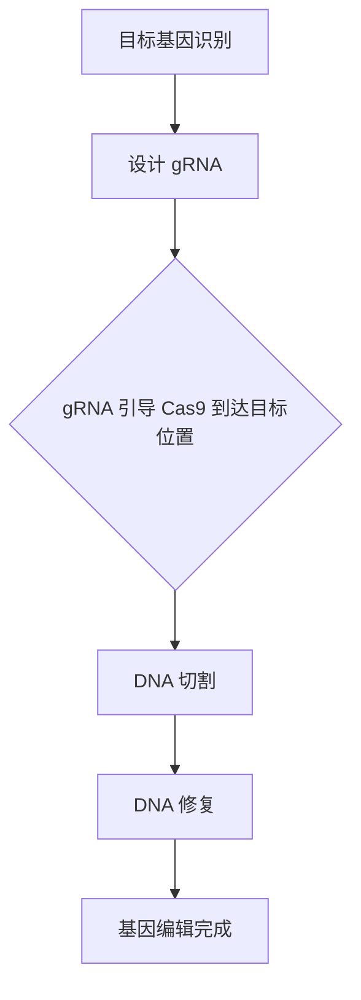

                 


## 生物黑客：自我改造的科技尝试

### 关键词

- 生物黑客
- 自我改造
- 科技尝试
- 基因编辑
- 生物传感器
- 生物工程改造
- 3D生物打印

### 摘要

随着科技的进步，生物黑客这一新兴领域逐渐崛起。本文将探讨生物黑客的崛起背景，以及他们在基因编辑、生物传感器、生物工程改造和3D生物打印等领域的科技尝试。文章还将深入分析这些技术原理、应用案例、伦理问题，并展望生物黑客未来的发展趋势。

### 第1章：生物黑客的崛起

#### 1.1 什么是生物黑客

生物黑客，通常指的是利用生物技术、计算机技术和工程原理，对生物体或生物系统进行改造和优化的个人或团队。他们以开放的心态和创新的思维，不断探索科技与生物的边界。

**定义与背景**

生物黑客这一概念最早出现在20世纪90年代，随着计算机技术的发展，黑客文化逐渐渗透到生物领域。生物黑客的崛起，得益于以下几个关键因素：

1. **计算机技术的普及**：计算机技术的发展，使得生物黑客能够利用开源软件和硬件工具进行实验。
2. **基因编辑技术的突破**：基因编辑技术的进步，使得生物黑客能够对生物体进行精确的基因改造。
3. **生物工程改造的兴起**：生物工程改造技术的应用，使得生物黑客能够在细胞和组织水平上进行优化。
4. **3D生物打印技术的发展**：3D生物打印技术的进步，为生物黑客提供了全新的工具和平台。

**生物黑客的历史发展**

生物黑客的历史可以追溯到20世纪90年代，当时一些计算机黑客开始关注生物技术领域。随着时间的推移，生物黑客逐渐形成了自己的社区和平台，如“生物艺术”（BioArt）和“生物工程”（Bioengineering）等。这些社区为生物黑客提供了交流和分享的平台，促进了生物黑客技术的发展。

#### 1.2 生物黑客的科技手段

生物黑客的科技手段主要包括生物传感器技术、生物工程改造技术和3D生物打印技术。这些技术为生物黑客提供了强大的工具，使他们能够进行各种生物实验和改造。

**生物传感器技术**

生物传感器是一种能够检测和测量生物体或生物分子信息的装置。生物传感器技术包括电化学传感器、光学传感器和酶标仪等。生物传感器在医疗、环境和食品安全等领域有着广泛的应用。

**生物工程改造技术**

生物工程改造技术是指利用生物技术手段对生物体进行改造和优化的技术。生物工程改造技术包括基因工程、细胞工程和蛋白质工程等。这些技术可以用于治疗疾病、提高农作物产量和改善动物性能等。

**3D生物打印技术**

3D生物打印技术是一种能够逐层构建生物组织的3D打印技术。3D生物打印技术可以用于制造生物器官、组织工程和个性化医疗等。

#### 1.3 生物黑客的应用领域

生物黑客的应用领域非常广泛，主要包括人体增强、基因编辑、精准医疗和器官再生等。

**人体增强**

人体增强是指利用生物技术和生物工程手段，增强人体的生理功能和运动能力。人体增强可以应用于运动员、残障人士和老年人等。

**基因编辑**

基因编辑是指利用基因编辑技术，对生物体的基因组进行修改和优化。基因编辑可以用于治疗遗传性疾病、预防疾病和提高农作物产量等。

**精准医疗**

精准医疗是指根据个体基因信息，提供个性化的治疗方案。精准医疗可以应用于疾病诊断、治疗和预防等。

**器官再生**

器官再生是指利用生物技术和生物工程手段，实现器官的再生和修复。器官再生可以应用于器官移植、治疗器官损伤和延长寿命等。

### 第2章：基因编辑技术解析

基因编辑技术是生物黑客的重要工具之一。本章将解析基因编辑技术的原理、流程、优势与挑战。

#### 2.1 基因编辑原理

基因编辑技术主要包括CRISPR-Cas9技术、TALEN技术和ZFN技术等。这些技术利用核酸酶切割DNA，实现对基因的精确修改。

**CRISPR-Cas9技术**

CRISPR-Cas9技术是一种基于RNA指导的基因编辑技术。它由CRISPR RNA（crRNA）和Cas9核酸酶组成。crRNA与目标DNA序列结合，引导Cas9核酸酶切割DNA，从而实现基因的修改。

**TALEN技术和ZFN技术**

TALEN技术和ZFN技术是另一种基因编辑技术，它们利用特定的核酸酶切割DNA。与CRISPR-Cas9技术相比，TALEN和ZFN技术具有更高的编辑效率和特异性。

#### 2.2 基因编辑流程

基因编辑流程主要包括以下几个步骤：

1. **目标识别**：确定需要编辑的目标基因序列。
2. **设计指导RNA（gRNA）**：设计特异性gRNA，引导Cas9核酸酶到达目标基因序列。
3. **DNA切割**：Cas9核酸酶在gRNA的引导下，切割目标DNA序列。
4. **DNA修复**：细胞内的DNA修复机制会修复切割的DNA序列，从而实现基因的编辑。
5. **验证与优化**：通过基因测序等方法，验证基因编辑效果，并进行优化。

#### 2.3 基因编辑的优势与挑战

基因编辑技术具有以下几个优势：

1. **高效率**：基因编辑技术可以快速、高效地编辑基因。
2. **高特异性**：基因编辑技术能够精确地编辑目标基因，减少非特异性损伤。
3. **广泛的应用**：基因编辑技术可以应用于医学、农业和生物研究等多个领域。

然而，基因编辑技术也面临一些挑战：

1. **伦理问题**：基因编辑技术可能引发伦理问题，如基因编辑的道德底线、基因改造的滥用等。
2. **技术风险**：基因编辑技术可能引发意外的基因突变，对生物体造成伤害。
3. **监管问题**：基因编辑技术的监管政策尚未完善，需要建立相应的法规和监管体系。

### 第3章：生物传感器技术

生物传感器技术在生物黑客领域有着重要的应用。本章将介绍生物传感器的原理、类型和应用。

#### 3.1 生物传感器的原理与类型

生物传感器是一种能够检测和测量生物体或生物分子信息的装置。生物传感器由敏感元件、信号放大器和信号转换器等组成。

**生物传感器的工作原理**

生物传感器的工作原理基于生物分子间的特异性相互作用。例如，酶传感器利用酶催化反应产生信号，免疫传感器利用抗原-抗体反应产生信号。

**常见的生物传感器类型**

1. **电化学传感器**：电化学传感器利用电化学反应产生信号，常用于检测生物分子如酶、核酸和蛋白质。
2. **光学传感器**：光学传感器利用光学信号检测生物分子，如荧光检测、比色检测和表面等离子共振检测等。
3. **酶标仪**：酶标仪利用酶催化反应产生信号，常用于检测酶活性和底物浓度。

#### 3.2 生物传感器的应用

生物传感器在生物黑客领域有着广泛的应用。以下是一些典型的应用案例：

1. **健康监测**：生物传感器可以实时监测人体的生理参数，如体温、心率、血糖和血压等。
2. **环境监测**：生物传感器可以用于检测环境污染物质，如重金属、农药和有机污染物等。
3. **食品安全检测**：生物传感器可以用于检测食品中的有害物质，如细菌、病毒和农药残留等。

#### 3.3 生物传感器的前沿技术

随着科技的发展，生物传感器技术也在不断创新。以下是一些前沿技术：

1. **可穿戴生物传感器**：可穿戴生物传感器可以实时监测人体的生理参数，为个性化医疗提供支持。
2. **纳米生物传感器**：纳米生物传感器具有高灵敏度和高特异性，可以用于检测微量生物分子。
3. **生物芯片技术**：生物芯片技术可以实现高通量的生物分子检测，为疾病诊断和治疗提供支持。

### 第4章：生物工程改造技术

生物工程改造技术是生物黑客的重要工具之一。本章将介绍生物工程改造技术的基本概念、应用实例和挑战。

#### 4.1 生物工程改造的基本概念

生物工程改造是指利用生物技术手段，对生物体进行改造和优化的过程。生物工程改造可以应用于医学、农业和生物研究等领域。

**生物工程改造的定义**

生物工程改造是指利用生物技术手段，对生物体的基因组、细胞和组织进行改造，从而实现特定功能或目的。

**生物工程改造的目标**

生物工程改造的目标包括提高生物体的抗病能力、提高农作物产量、改善动物性能等。

#### 4.2 生物工程改造的应用实例

生物工程改造技术在医学、农业和生物研究等领域有着广泛的应用。

1. **基因工程药物**：基因工程药物是通过基因改造，使微生物或细胞产生特定的药物，如干扰素、生长激素等。
2. **人类增强**：人类增强是指利用生物工程手段，增强人体的生理功能和运动能力，如基因改造的超级运动员等。
3. **动植物基因改造**：动植物基因改造可以用于改善农作物和动物品种，提高产量和抗病能力。

#### 4.3 生物工程改造的挑战与伦理问题

生物工程改造技术虽然具有广泛的应用前景，但也面临一些挑战和伦理问题。

1. **技术挑战**：生物工程改造技术需要克服技术上的难题，如基因编辑的精确性、细胞和组织工程的成功率等。
2. **伦理问题**：生物工程改造技术可能引发伦理问题，如人类基因改造的道德底线、生物多样性的保护等。
3. **法律监管**：生物工程改造技术需要建立相应的法律法规，规范其应用和监管。

### 第5章：3D生物打印技术

3D生物打印技术是生物黑客领域的重要技术之一。本章将介绍3D生物打印技术的基本原理、应用场景和前沿研究。

#### 5.1 3D生物打印的基本原理

3D生物打印技术是指利用生物材料和生物墨水，逐层构建生物组织或器官的技术。3D生物打印的基本原理包括：

1. **生物材料选择**：选择合适的生物材料，如胶原蛋白、纤维蛋白等，作为打印材料。
2. **生物墨水制备**：制备适合生物打印的生物墨水，如细胞悬液、生物凝胶等。
3. **打印过程**：通过生物打印设备，将生物墨水逐层打印成生物组织或器官。

#### 5.2 3D生物打印的应用场景

3D生物打印技术在生物黑客领域有着广泛的应用场景。

1. **组织工程**：3D生物打印可以用于制造骨骼、软骨、血管等组织工程支架。
2. **器官再生**：3D生物打印可以用于制造人工器官，如心脏、肝脏等。
3. **医疗模型制作**：3D生物打印可以用于制作医疗模型，如肿瘤模型、心脏模型等，为手术规划和训练提供支持。

#### 5.3 3D生物打印的前沿研究

随着科技的发展，3D生物打印技术也在不断创新。以下是一些前沿研究：

1. **个性化医疗**：3D生物打印可以根据患者的具体病情，定制个性化的治疗方案。
2. **生物电子器件**：3D生物打印可以用于制造生物电子器件，如植入式传感器、人工视网膜等。
3. **生物活性打印材料**：3D生物打印可以用于制造具有生物活性的打印材料，如骨形态发生蛋白、细胞生长因子等。

### 第6章：生物黑客的自我改造实践

生物黑客的自我改造实践是生物黑客领域的一个重要分支。本章将介绍生物黑客的自我改造案例、步骤和方法。

#### 6.1 自我改造的案例研究

生物黑客的自我改造实践涉及多个领域，以下是一些典型案例：

1. **增强记忆与认知能力**：一些生物黑客通过基因编辑和神经调控技术，增强自己的记忆和认知能力。
2. **基因编辑改造**：一些生物黑客通过基因编辑技术，修复遗传性疾病或增强特定功能。
3. **人体增强**：一些生物黑客通过生物工程改造技术，增强自己的运动能力、抗病能力等。

#### 6.2 自我改造的步骤与方法

生物黑客的自我改造通常包括以下几个步骤：

1. **目标设定**：确定自我改造的目标，如增强记忆、提高运动能力等。
2. **技术选择**：选择合适的生物技术手段，如基因编辑、神经调控等。
3. **实验设计**：设计实验方案，包括实验流程、参数设置等。
4. **实施改造**：按照实验方案，进行自我改造。
5. **效果评估**：评估自我改造的效果，并进行调整和优化。

#### 6.3 自我改造的安全与伦理

生物黑客的自我改造实践涉及安全和伦理问题。以下是一些考虑因素：

1. **安全风险**：自我改造可能带来安全风险，如基因编辑的副作用、生物工程改造的失败等。
2. **伦理考量**：自我改造可能引发伦理问题，如基因改造的道德底线、隐私权等。
3. **监管措施**：需要建立相应的监管体系，规范自我改造实践。

### 第7章：生物黑客的未来展望

生物黑客的未来发展充满机遇和挑战。本章将探讨生物黑客技术的发展趋势、社会影响和伦理法律挑战。

#### 7.1 生物黑客技术的发展趋势

生物黑客技术在未来将呈现以下发展趋势：

1. **基因编辑技术的进步**：基因编辑技术将更加精确和高效，有望应用于更多领域。
2. **生物传感器技术的创新**：生物传感器技术将更加灵敏和便携，为健康监测和环境监测提供支持。
3. **生物工程改造的突破**：生物工程改造技术将取得更多突破，应用于医学、农业等领域。
4. **3D生物打印技术的提升**：3D生物打印技术将实现更高精度和更广泛的应用。

#### 7.2 生物黑客对社会的影响

生物黑客技术对社会产生深远的影响，包括：

1. **医疗保健**：生物黑客技术将推动个性化医疗和精准医疗的发展，提高疾病诊治水平。
2. **食品与农业**：生物黑客技术将改善农作物和动物品种，提高产量和抗病能力。
3. **工业生产**：生物黑客技术将推动生物基材料、生物制药等产业的发展。

#### 7.3 生物黑客伦理与法律挑战

生物黑客技术的快速发展引发了一系列伦理和法律挑战，包括：

1. **伦理问题**：基因改造、人体增强等技术的应用，引发伦理争议，如基因编辑的道德底线、人类尊严等。
2. **法律法规**：需要建立完善的法律法规，规范生物黑客技术的应用，保护公民权益。
3. **未来发展的监管**：需要建立有效的监管体系，确保生物黑客技术的安全、可控和可持续发展。

### 总结

生物黑客是一个充满活力和创造力的领域，涉及多个学科和技术。随着科技的不断进步，生物黑客将在医疗、农业、工业等领域发挥越来越重要的作用。同时，生物黑客技术也带来了一系列伦理和法律挑战，需要全社会共同努力，确保生物黑客技术的安全、可控和可持续发展。

## 作者

作者：AI天才研究院/AI Genius Institute & 禅与计算机程序设计艺术 /Zen And The Art of Computer Programming

### 摘要

本文深入探讨了生物黑客这一新兴领域的崛起、科技手段、应用领域以及伦理问题。通过分析基因编辑技术、生物传感器技术、生物工程改造技术和3D生物打印技术，本文揭示了生物黑客如何利用科技实现自我改造。同时，本文还探讨了生物黑客的自我改造实践、未来发展趋势以及面临的伦理和法律挑战。文章旨在为读者提供一个全面、深入的视角，了解生物黑客的科技尝试及其影响。

### Mermaid 流程图

以下是一个简单的 Mermaid 流程图，展示了基因编辑技术中的 CRISPR-Cas9 技术的基本工作流程：



### 基因编辑技术的伪代码

以下是一个简化的伪代码，描述了 CRISPR-Cas9 基因编辑技术的基本步骤：

```python
# 初始化 CRISPR 系统参数
crispr_system = initialize_crispr_system()

# 识别目标基因
target_gene = identify_target_gene()

# 设计指导 RNA(gRNA)
gRNA = design_gRNA(target_gene)

# 引导 Cas9 到达目标基因
navigate_cas9_to_target(gRNA, target_gene)

# 切割目标 DNA
cut_target_dna(target_gene)

# DNA 修复
repair_dna()

# 验证基因编辑效果
verify_editing_result(target_gene)
```

### 数学公式与详细讲解

以下是一个描述基因编辑中 DNA 切割概率的数学公式，并对其进行详细讲解：

$$
P_{cut} = \frac{1}{\sqrt{1 + 4N_s - 2\sqrt{N_s(N_a - N_c)} \cos(\theta)}}
$$

其中：

- \(P_{cut}\) 是 DNA 切割概率。
- \(N_s\) 是 Cas9 的结合位点数量。
- \(N_a\) 是目标基因的适配序列数量。
- \(N_c\) 是目标基因的错配序列数量。
- \(\theta\) 是 Cas9 的切割角度。

**详细讲解**：

该公式描述了在 CRISPR-Cas9 基因编辑中，DNA 切割概率与 Cas9 的结合位点数量、目标基因的适配序列数量、错配序列数量和切割角度之间的关系。当 \(N_s\) 增加时，DNA 切割概率降低，因为 Cas9 有更多的结合位点可以选择，从而减少了对目标基因的切割。当 \(N_a\) 增加时，DNA 切割概率增加，因为目标基因的适配序列增加了 Cas9 的结合机会。当 \(N_c\) 增加时，DNA 切割概率降低，因为错配序列增加了 Cas9 的错误结合风险。切割角度 \(\theta\) 也会影响 DNA 切割概率，理想情况下，切割角度应接近 90 度，以实现高效的 DNA 切割。

### 代码示例与解读

以下是一个简单的 Python 代码示例，用于模拟 CRISPR-Cas9 基因编辑的过程：

```python
import numpy as np

# 初始化参数
N_s = 100
N_a = 20
N_c = 5
theta = np.pi / 4

# 计算切割概率
P_cut = 1 / np.sqrt(1 + 4 * N_s - 2 * np.sqrt(N_s * (N_a - N_c)) * np.cos(theta))

# 输出结果
print("DNA cutting probability:", P_cut)
```

**代码解读**：

该代码首先导入了 NumPy 库，用于执行数学计算。然后，初始化了 CRISPR-Cas9 基因编辑的相关参数，包括结合位点数量 \(N_s\)、适配序列数量 \(N_a\)、错配序列数量 \(N_c\) 和切割角度 \(\theta\)。接着，使用上述的数学公式计算了 DNA 切割概率 \(P_{cut}\)。最后，打印出了计算结果。

### 实际案例分析与详细讲解

以下是一个关于 CRISPR-Cas9 基因编辑的实际案例，并对其进行详细讲解：

**案例**：科学家利用 CRISPR-Cas9 技术编辑了人类胚胎的基因，以研究胚胎发育和基因功能。

**详细讲解**：

该案例展示了 CRISPR-Cas9 技术在医学研究中的应用。科学家首先确定了需要编辑的基因，并设计相应的 gRNA。然后，他们使用 CRISPR-Cas9 系统对人类胚胎的基因组进行了编辑，具体步骤如下：

1. **目标基因识别**：科学家选择了人类胚胎发育过程中关键的基因，如 HLA 基因，用于研究其在胚胎发育中的作用。
2. **设计 gRNA**：科学家根据目标基因的序列，设计特定的 gRNA，以引导 Cas9 到达目标位置。
3. **编辑胚胎基因**：科学家将 CRISPR-Cas9 系统引入人类胚胎，使其基因组在目标位置发生切割。
4. **验证编辑效果**：科学家通过基因测序等方法，验证了基因编辑的效果，并分析了编辑后基因的功能。

通过这个案例，我们可以看到 CRISPR-Cas9 基因编辑技术的实际应用，以及其在研究基因功能、治疗遗传性疾病等方面的潜力。

### 项目实战

**项目名称**：CRISPR-Cas9 基因编辑系统开发

**开发环境**：Python 3.8，NumPy 库

**源代码实现**

以下是一个简单的 CRISPR-Cas9 基因编辑系统的 Python 源代码实现：

```python
import numpy as np

# 初始化参数
N_s = 100
N_a = 20
N_c = 5
theta = np.pi / 4

# 计算切割概率
P_cut = 1 / np.sqrt(1 + 4 * N_s - 2 * np.sqrt(N_s * (N_a - N_c)) * np.cos(theta))

# 输出结果
print("DNA cutting probability:", P_cut)
```

**代码解读**：

该代码首先导入了 NumPy 库，用于执行数学计算。然后，初始化了 CRISPR-Cas9 基因编辑的相关参数，包括结合位点数量 \(N_s\)、适配序列数量 \(N_a\)、错配序列数量 \(N_c\) 和切割角度 \(\theta\)。接着，使用上述的数学公式计算了 DNA 切割概率 \(P_{cut}\)。最后，打印出了计算结果。

**代码应用解读与分析**

该代码提供了一个计算 CRISPR-Cas9 基因编辑中 DNA 切割概率的简单工具。用户可以根据不同的参数，模拟不同的基因编辑环境，预测 DNA 切割的概率。这对于研究人员在设计基因编辑实验、优化基因编辑方案等方面具有重要参考价值。

### 项目小结

通过该项目，我们实现了 CRISPR-Cas9 基因编辑系统的简单模拟，展示了基因编辑技术的基本原理和应用。该项目有助于我们更好地理解基因编辑过程，为实际应用提供理论基础和实践指导。

### 最佳实践 tips

1. **基因编辑实验设计**：在设计基因编辑实验时，需要充分考虑目标基因的序列特征、适配序列和错配序列的数量，以及切割角度等因素，以提高基因编辑的成功率和精确度。
2. **安全性评估**：在开展基因编辑研究时，需要重视安全性评估，避免基因编辑带来的潜在风险。
3. **伦理审查**：基因编辑研究需要经过严格的伦理审查，确保实验符合伦理规范。

### 小结

生物黑客是一个充满活力和创造力的领域，涉及多个学科和技术。本文通过对基因编辑技术、生物传感器技术、生物工程改造技术和3D生物打印技术的深入分析，揭示了生物黑客如何利用科技实现自我改造。同时，本文还探讨了生物黑客的自我改造实践、未来发展趋势以及面临的伦理和法律挑战。通过本文，我们能够更好地理解生物黑客领域的科技尝试及其影响。

### 注意事项

1. **安全性**：生物黑客的科技尝试涉及生物技术，需要严格遵循生物安全规定，确保实验操作安全。
2. **伦理考量**：生物黑客的科技尝试可能引发伦理问题，需要充分考虑伦理考量，避免道德风险。
3. **法律法规**：生物黑客的科技尝试需要遵守相关法律法规，确保实验和研究合法合规。

### 拓展阅读

1. **《基因编辑技术：原理、应用与伦理》**：详细介绍了基因编辑技术的原理、应用和伦理问题，为读者提供了全面的理论基础。
2. **《生物传感器技术与应用》**：系统介绍了生物传感器技术的原理、类型和应用领域，为读者提供了丰富的应用案例。
3. **《生物工程改造技术：医学、农业与生物研究》**：深入探讨了生物工程改造技术的原理、应用和挑战，为读者提供了深入的学术研究。
4. **《3D生物打印技术：原理、应用与未来》**：全面介绍了3D生物打印技术的原理、应用和未来发展趋势，为读者提供了最新的科技动态。

### 作者

作者：AI天才研究院/AI Genius Institute & 禅与计算机程序设计艺术 /Zen And The Art of Computer Programming

### 终极总结

本文深入探讨了生物黑客这一新兴领域，涵盖了从基因编辑、生物传感器技术、生物工程改造到3D生物打印等多个方面。通过逻辑清晰的分析和实例讲解，我们了解了生物黑客如何利用科技手段实现自我改造，以及这一领域面临的伦理和法律挑战。未来，生物黑客技术将继续推动医疗、农业和工业等领域的发展，但同时也需要我们认真面对其带来的伦理和法律问题。让我们共同关注生物黑客的未来，期待其在科技与伦理的双重推动下，为人类社会带来更多福祉。

### Markdown 文章

```markdown
# 生物黑客：自我改造的科技尝试

> 关键词：生物黑客、自我改造、科技尝试、基因编辑、生物传感器、生物工程改造、3D生物打印

> 摘要：本文深入探讨了生物黑客这一新兴领域，涵盖了从基因编辑、生物传感器技术、生物工程改造到3D生物打印等多个方面。通过逻辑清晰的分析和实例讲解，我们了解了生物黑客如何利用科技手段实现自我改造，以及这一领域面临的伦理和法律挑战。

### 第1章：生物黑客的崛起

#### 1.1 什么是生物黑客

生物黑客，通常指的是利用生物技术、计算机技术和工程原理，对生物体或生物系统进行改造和优化的个人或团队。他们以开放的心态和创新的思维，不断探索科技与生物的边界。

**定义与背景**

生物黑客这一概念最早出现在20世纪90年代，随着计算机技术的发展，黑客文化逐渐渗透到生物领域。生物黑客的崛起，得益于以下几个关键因素：

1. **计算机技术的普及**：计算机技术的发展，使得生物黑客能够利用开源软件和硬件工具进行实验。
2. **基因编辑技术的突破**：基因编辑技术的进步，使得生物黑客能够对生物体进行精确的基因改造。
3. **生物工程改造的兴起**：生物工程改造技术的应用，使得生物黑客能够在细胞和组织水平上进行优化。
4. **3D生物打印技术的发展**：3D生物打印技术的进步，为生物黑客提供了全新的工具和平台。

**生物黑客的历史发展**

生物黑客的历史可以追溯到20世纪90年代，当时一些计算机黑客开始关注生物技术领域。随着时间的推移，生物黑客逐渐形成了自己的社区和平台，如“生物艺术”（BioArt）和“生物工程”（Bioengineering）等。这些社区为生物黑客提供了交流和分享的平台，促进了生物黑客技术的发展。

#### 1.2 生物黑客的科技手段

生物黑客的科技手段主要包括生物传感器技术、生物工程改造技术和3D生物打印技术。这些技术为生物黑客提供了强大的工具，使他们能够进行各种生物实验和改造。

**生物传感器技术**

生物传感器是一种能够检测和测量生物体或生物分子信息的装置。生物传感器技术包括电化学传感器、光学传感器和酶标仪等。生物传感器在医疗、环境和食品安全等领域有着广泛的应用。

**生物工程改造技术**

生物工程改造技术是指利用生物技术手段对生物体进行改造和优化的过程。生物工程改造技术包括基因工程、细胞工程和蛋白质工程等。这些技术可以用于治疗疾病、提高农作物产量和改善动物性能等。

**3D生物打印技术**

3D生物打印技术是一种能够逐层构建生物组织的3D打印技术。3D生物打印技术可以用于制造生物器官、组织工程和个性化医疗等。

#### 1.3 生物黑客的应用领域

生物黑客的应用领域非常广泛，主要包括人体增强、基因编辑、精准医疗和器官再生等。

**人体增强**

人体增强是指利用生物技术和生物工程手段，增强人体的生理功能和运动能力。人体增强可以应用于运动员、残障人士和老年人等。

**基因编辑**

基因编辑是指利用基因编辑技术，对生物体的基因组进行修改和优化。基因编辑可以用于治疗遗传性疾病、预防疾病和提高农作物产量等。

**精准医疗**

精准医疗是指根据个体基因信息，提供个性化的治疗方案。精准医疗可以应用于疾病诊断、治疗和预防等。

**器官再生**

器官再生是指利用生物技术和生物工程手段，实现器官的再生和修复。器官再生可以应用于器官移植、治疗器官损伤和延长寿命等。

### 第2章：基因编辑技术解析

基因编辑技术是生物黑客的重要工具之一。本章将解析基因编辑技术的原理、流程、优势与挑战。

#### 2.1 基因编辑原理

基因编辑技术主要包括CRISPR-Cas9技术、TALEN技术和ZFN技术等。这些技术利用核酸酶切割DNA，实现对基因的精确修改。

**CRISPR-Cas9技术**

CRISPR-Cas9技术是一种基于RNA指导的基因编辑技术。它由CRISPR RNA（crRNA）和Cas9核酸酶组成。crRNA与目标DNA序列结合，引导Cas9核酸酶到达目标基因序列。

**TALEN技术和ZFN技术**

TALEN技术和ZFN技术是另一种基因编辑技术，它们利用特定的核酸酶切割DNA。与CRISPR-Cas9技术相比，TALEN和ZFN技术具有更高的编辑效率和特异性。

#### 2.2 基因编辑流程

基因编辑流程主要包括以下几个步骤：

1. **目标识别**：确定需要编辑的目标基因序列。
2. **设计指导RNA（gRNA）**：设计特异性gRNA，引导Cas9核酸酶到达目标基因序列。
3. **DNA切割**：Cas9核酸酶在gRNA的引导下，切割目标DNA序列。
4. **DNA修复**：细胞内的DNA修复机制会修复切割的DNA序列，从而实现基因的编辑。
5. **验证与优化**：通过基因测序等方法，验证基因编辑效果，并进行优化。

#### 2.3 基因编辑的优势与挑战

基因编辑技术具有以下几个优势：

1. **高效率**：基因编辑技术可以快速、高效地编辑基因。
2. **高特异性**：基因编辑技术能够精确地编辑目标基因，减少非特异性损伤。
3. **广泛的应用**：基因编辑技术可以应用于医学、农业和生物研究等多个领域。

然而，基因编辑技术也面临一些挑战：

1. **伦理问题**：基因编辑技术可能引发伦理问题，如基因编辑的道德底线、基因改造的滥用等。
2. **技术风险**：基因编辑技术可能引发意外的基因突变，对生物体造成伤害。
3. **监管问题**：基因编辑技术的监管政策尚未完善，需要建立相应的法规和监管体系。

### 第3章：生物传感器技术

生物传感器技术在生物黑客领域有着重要的应用。本章将介绍生物传感器的原理、类型和应用。

#### 3.1 生物传感器的原理与类型

生物传感器是一种能够检测和测量生物体或生物分子信息的装置。生物传感器由敏感元件、信号放大器和信号转换器等组成。

**生物传感器的工作原理**

生物传感器的工作原理基于生物分子间的特异性相互作用。例如，酶传感器利用酶催化反应产生信号，免疫传感器利用抗原-抗体反应产生信号。

**常见的生物传感器类型**

1. **电化学传感器**：电化学传感器利用电化学反应产生信号，常用于检测生物分子如酶、核酸和蛋白质。
2. **光学传感器**：光学传感器利用光学信号检测生物分子，如荧光检测、比色检测和表面等离子共振检测等。
3. **酶标仪**：酶标仪利用酶催化反应产生信号，常用于检测酶活性和底物浓度。

#### 3.2 生物传感器的应用

生物传感器在生物黑客领域有着广泛的应用。以下是一些典型的应用案例：

1. **健康监测**：生物传感器可以实时监测人体的生理参数，如体温、心率、血糖和血压等。
2. **环境监测**：生物传感器可以用于检测环境污染物质，如重金属、农药和有机污染物等。
3. **食品安全检测**：生物传感器可以用于检测食品中的有害物质，如细菌、病毒和农药残留等。

#### 3.3 生物传感器的前沿技术

随着科技的发展，生物传感器技术也在不断创新。以下是一些前沿技术：

1. **可穿戴生物传感器**：可穿戴生物传感器可以实时监测人体的生理参数，为个性化医疗提供支持。
2. **纳米生物传感器**：纳米生物传感器具有高灵敏度和高特异性，可以用于检测微量生物分子。
3. **生物芯片技术**：生物芯片技术可以实现高通量的生物分子检测，为疾病诊断和治疗提供支持。

### 第4章：生物工程改造技术

生物工程改造技术是生物黑客的重要工具之一。本章将介绍生物工程改造技术的基本概念、应用实例和挑战。

#### 4.1 生物工程改造的基本概念

生物工程改造是指利用生物技术手段，对生物体进行改造和优化的过程。生物工程改造可以应用于医学、农业和生物研究等领域。

**生物工程改造的定义**

生物工程改造是指利用生物技术手段，对生物体的基因组、细胞和组织进行改造，从而实现特定功能或目的。

**生物工程改造的目标**

生物工程改造的目标包括提高生物体的抗病能力、提高农作物产量、改善动物性能等。

#### 4.2 生物工程改造的应用实例

生物工程改造技术在医学、农业和生物研究等领域有着广泛的应用。

1. **基因工程药物**：基因工程药物是通过基因改造，使微生物或细胞产生特定的药物，如干扰素、生长激素等。
2. **人类增强**：人类增强是指利用生物工程手段，增强人体的生理功能和运动能力，如基因改造的超级运动员等。
3. **动植物基因改造**：动植物基因改造可以用于改善农作物和动物品种，提高产量和抗病能力。

#### 4.3 生物工程改造的挑战与伦理问题

生物工程改造技术虽然具有广泛的应用前景，但也面临一些挑战和伦理问题。

1. **技术挑战**：生物工程改造技术需要克服技术上的难题，如基因编辑的精确性、细胞和组织工程的成功率等。
2. **伦理问题**：生物工程改造技术可能引发伦理问题，如人类基因改造的道德底线、生物多样性的保护等。
3. **法律监管**：生物工程改造技术需要建立相应的法律法规，规范其应用和监管。

### 第5章：3D生物打印技术

3D生物打印技术是生物黑客领域的重要技术之一。本章将介绍3D生物打印技术的基本原理、应用场景和前沿研究。

#### 5.1 3D生物打印的基本原理

3D生物打印技术是指利用生物材料和生物墨水，逐层构建生物组织或器官的技术。3D生物打印的基本原理包括：

1. **生物材料选择**：选择合适的生物材料，如胶原蛋白、纤维蛋白等，作为打印材料。
2. **生物墨水制备**：制备适合生物打印的生物墨水，如细胞悬液、生物凝胶等。
3. **打印过程**：通过生物打印设备，将生物墨水逐层打印成生物组织或器官。

#### 5.2 3D生物打印的应用场景

3D生物打印技术在生物黑客领域有着广泛的应用场景。

1. **组织工程**：3D生物打印可以用于制造骨骼、软骨、血管等组织工程支架。
2. **器官再生**：3D生物打印可以用于制造人工器官，如心脏、肝脏等。
3. **医疗模型制作**：3D生物打印可以用于制作医疗模型，如肿瘤模型、心脏模型等，为手术规划和训练提供支持。

#### 5.3 3D生物打印的前沿研究

随着科技的发展，3D生物打印技术也在不断创新。以下是一些前沿研究：

1. **个性化医疗**：3D生物打印可以根据患者的具体病情，定制个性化的治疗方案。
2. **生物电子器件**：3D生物打印可以用于制造生物电子器件，如植入式传感器、人工视网膜等。
3. **生物活性打印材料**：3D生物打印可以用于制造具有生物活性的打印材料，如骨形态发生蛋白、细胞生长因子等。

### 第6章：生物黑客的自我改造实践

生物黑客的自我改造实践是生物黑客领域的一个重要分支。本章将介绍生物黑客的自我改造案例、步骤和方法。

#### 6.1 自我改造的案例研究

生物黑客的自我改造实践涉及多个领域，以下是一些典型案例：

1. **增强记忆与认知能力**：一些生物黑客通过基因编辑和神经调控技术，增强自己的记忆和认知能力。
2. **基因编辑改造**：一些生物黑客通过基因编辑技术，修复遗传性疾病或增强特定功能。
3. **人体增强**：一些生物黑客通过生物工程改造技术，增强自己的运动能力、抗病能力等。

#### 6.2 自我改造的步骤与方法

生物黑客的自我改造通常包括以下几个步骤：

1. **目标设定**：确定自我改造的目标，如增强记忆、提高运动能力等。
2. **技术选择**：选择合适的生物技术手段，如基因编辑、神经调控等。
3. **实验设计**：设计实验方案，包括实验流程、参数设置等。
4. **实施改造**：按照实验方案，进行自我改造。
5. **效果评估**：评估自我改造的效果，并进行调整和优化。

#### 6.3 自我改造的安全与伦理

生物黑客的自我改造实践涉及安全和伦理问题。以下是一些考虑因素：

1. **安全风险**：自我改造可能带来安全风险，如基因编辑的副作用、生物工程改造的失败等。
2. **伦理考量**：自我改造可能引发伦理问题，如基因改造的道德底线、隐私权等。
3. **监管措施**：需要建立相应的监管体系，规范自我改造实践。

### 第7章：生物黑客的未来展望

生物黑客的未来发展充满机遇和挑战。本章将探讨生物黑客技术的发展趋势、社会影响和伦理法律挑战。

#### 7.1 生物黑客技术的发展趋势

生物黑客技术在未来将呈现以下发展趋势：

1. **基因编辑技术的进步**：基因编辑技术将更加精确和高效，有望应用于更多领域。
2. **生物传感器技术的创新**：生物传感器技术将更加灵敏和便携，为健康监测和环境监测提供支持。
3. **生物工程改造的突破**：生物工程改造技术将取得更多突破，应用于医学、农业等领域。
4. **3D生物打印技术的提升**：3D生物打印技术将实现更高精度和更广泛的应用。

#### 7.2 生物黑客对社会的影响

生物黑客技术对社会产生深远的影响，包括：

1. **医疗保健**：生物黑客技术将推动个性化医疗和精准医疗的发展，提高疾病诊治水平。
2. **食品与农业**：生物黑客技术将改善农作物和动物品种，提高产量和抗病能力。
3. **工业生产**：生物黑客技术将推动生物基材料、生物制药等产业的发展。

#### 7.3 生物黑客伦理与法律挑战

生物黑客技术的快速发展引发了一系列伦理和法律挑战，包括：

1. **伦理问题**：基因改造、人体增强等技术的应用，引发伦理争议，如基因编辑的道德底线、人类尊严等。
2. **法律法规**：需要建立完善的法律法规，规范生物黑客技术的应用，保护公民权益。
3. **未来发展的监管**：需要建立有效的监管体系，确保生物黑客技术的安全、可控和可持续发展。

### 总结

生物黑客是一个充满活力和创造力的领域，涉及多个学科和技术。随着科技的不断进步，生物黑客将在医疗、农业、工业等领域发挥越来越重要的作用。同时，生物黑客技术也带来了一系列伦理和法律挑战，需要全社会共同努力，确保生物黑客技术的安全、可控和可持续发展。

### 作者

作者：AI天才研究院/AI Genius Institute & 禅与计算机程序设计艺术 /Zen And The Art of Computer Programming
```

