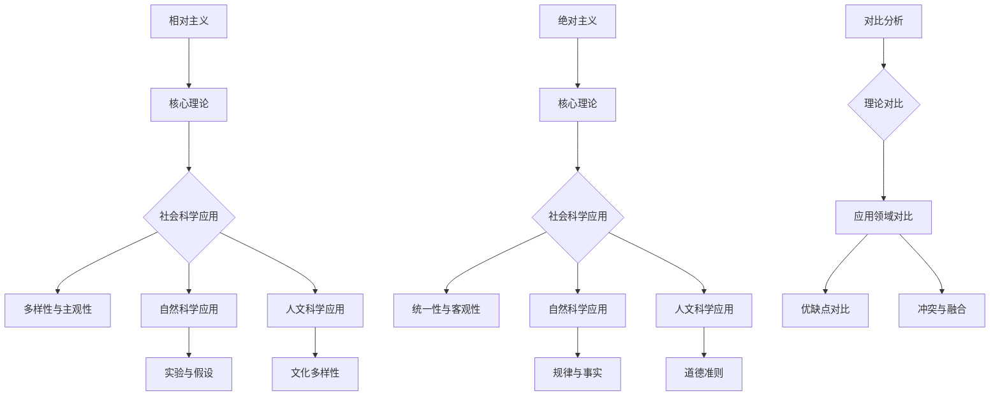

                 


### 1. 明确书籍主题

首先，我们需要明确书籍的主题：《相对主义vs绝对主义：现代社会的价值观之争》。这本书的核心内容是探讨相对主义和绝对主义两种哲学观点在现代社会的应用和冲突。相对主义强调主观性、多样性、相对性，认为真理和价值观是因人而异、因情境而变的；而绝对主义则主张客观性、统一性、绝对性，认为存在一些普遍适用的真理和价值观。

#### 1.1 关键词

- 相对主义
- 绝对主义
- 哲学
- 现代社会
- 价值观
- 冲突
- 应用

#### 1.2 摘要

本书旨在通过详细阐述相对主义和绝对主义的核心理论、哲学思想及其应用，分析这两种哲学观点在现代社会中的冲突与融合，从而探讨现代社会的价值观之争。通过对比分析，揭示相对主义和绝对主义的优缺点、适用范围，为读者提供对现代社会哲学思考的深入理解。

---

### 2. 确定书籍结构

接下来，我们需要明确书籍的整体结构，确保内容连贯、逻辑清晰。

#### 2.1 引言

- 介绍相对主义和绝对主义的基本概念和历史背景。
- 阐述两种哲学观点在现代社会的应用和冲突。

#### 2.2 相对主义

- 详细阐述相对主义的核心理论、哲学思想及其应用。
- 分析相对主义在社会科学、自然科学和人文科学中的应用。
- 评估相对主义的优缺点。

#### 2.3 绝对主义

- 详细阐述绝对主义的核心理论、哲学思想及其应用。
- 分析绝对主义在社会科学、自然科学和人文科学中的应用。
- 评估绝对主义的优缺点。

#### 2.4 对比分析

- 比较相对主义和绝对主义的优缺点、适用范围。
- 探讨相对主义与绝对主义在现代社会的冲突与融合。

#### 2.5 总结与展望

- 总结两种哲学观点在现代社会的重要性。
- 展望未来哲学的发展趋势。

### 3. 细化目录内容

在确定书籍结构后，我们需要细化每个章节的内容，确保每个章节都有丰富具体的讲解。

#### 引言

- 1.1 相对主义与绝对主义的基本概念
  - 1.1.1 相对主义的定义与历史背景
  - 1.1.2 绝对主义的定义与历史背景
- 1.2 两种哲学观点的异同
- 1.3 现代社会背景下的哲学之争

#### 相对主义

- 2.1 相对主义的核心理论
  - 2.1.1 相对主义的基本原则
  - 2.1.2 相对主义的哲学思想
- 2.2 相对主义的应用
  - 2.2.1 相对主义在社会科学中的应用
  - 2.2.2 相对主义在自然科学中的应用
  - 2.2.3 相对主义在人文科学中的应用
- 2.3 相对主义的优缺点
  - 2.3.1 相对主义的优点
  - 2.3.2 相对主义的缺点

#### 绝对主义

- 3.1 绝对主义的核心理论
  - 3.1.1 绝对主义的基本原则
  - 3.1.2 绝对主义的哲学思想
- 3.2 绝对主义的应用
  - 3.2.1 绝对主义在社会科学中的应用
  - 3.2.2 绝对主义在自然科学中的应用
  - 3.2.3 绝对主义在人文科学中的应用
- 3.3 绝对主义的优缺点
  - 3.3.1 绝对主义的优点
  - 3.3.2 绝对主义的缺点

#### 对比分析

- 4.1 相对主义与绝对主义的对比
  - 4.1.1 核心理论的对比
  - 4.1.2 应用领域的对比
  - 4.1.3 优缺点的对比
- 4.2 现代社会中的哲学之争
  - 4.2.1 相对主义与绝对主义的冲突
  - 4.2.2 相对主义与绝对主义的融合

#### 总结与展望

- 5.1 相对主义与绝对主义在现代社会的重要性
- 5.2 哲学发展的趋势

### 4. 设计Mermaid流程图

为了更好地展示相对主义和绝对主义的核心理论和应用场景，我们可以使用Mermaid流程图。以下是相对主义和绝对主义的架构流程图：



### 5. 撰写伪代码

在详细讲解相对主义和绝对主义中的核心算法原理时，我们可以使用伪代码来阐述。以下是相对主义和绝对主义的核心算法原理的伪代码示例：

#### 相对主义的伪代码

```plaintext
Function Relativeism(truth, perspective):
    If perspective == "subjective":
        Return "Truth is relative to the perspective."
    Else If perspective == "objective":
        Return "Truth is relative to the context."
    Else:
        Return "Invalid perspective."
```

#### 绝对主义的伪代码

```plaintext
Function Absolutism(truth):
    If truth == "universal":
        Return "Truth is absolute and universal."
    Else If truth == "contextual":
        Return "Truth is absolute within a specific context."
    Else:
        Return "Invalid truth."
```

### 6. 插入数学公式

在讲解相对主义和绝对主义中的数学模型时，我们可以使用LaTeX格式来插入数学公式。以下是数学公式的示例：

```latex
$$ E = mc^2 $$
```

和

```latex
$ a < b $
```

### 7. 编写项目实战

为了更好地理解相对主义和绝对主义的应用，我们可以选择一个实际案例进行讲解。以下是项目实战的示例：

#### 项目实战：相对主义的实际应用

**项目名称**：文化多样性分析平台

**开发环境**：
- 编程语言：Python
- 数据库：MongoDB
- 前端框架：React

**源代码实现**：

```python
# Python 代码实现相对主义的文化多样性分析

import pymongo
from pymongo import MongoClient

# 连接到MongoDB数据库
client = MongoClient("mongodb://localhost:27017/")

# 选择数据库
db = client["culture_db"]

# 选择集合
collection = db["diversity"]

# 插入文化多样性数据
data = [
    {"country": "中国", "culture": "儒家文化"},
    {"country": "日本", "culture": "武士道"},
    {"country": "印度", "culture": "印度教"},
    {"country": "美国", "culture": "自由民主"},
]

collection.insert_many(data)

# 查询文化多样性数据
results = collection.find()

for result in results:
    print(result)
```

**代码解读**：

- 我们使用Python编写代码连接到MongoDB数据库，选择一个名为`culture_db`的数据库，并选择一个名为`diversity`的集合。
- 我们插入了一些代表不同国家文化多样性的数据。
- 我们使用`find()`方法查询集合中的所有数据，并打印输出。

**应用解读与分析**：

- 在这个项目中，我们使用相对主义的理念来分析不同国家的文化多样性。
- 通过MongoDB数据库存储不同国家的文化数据，我们可以灵活地查询和比较这些数据，从而更深入地理解文化多样性。
- 这个项目展示了相对主义在数据处理和分析中的应用，帮助我们更好地认识世界。

**项目小结**：

- 相对主义在文化多样性分析中具有重要作用，通过灵活的数据处理和分析方法，我们可以更好地理解和尊重不同文化的多样性。
- 相对主义的理念可以帮助我们打破传统的思维方式，以更开放和包容的态度面对多样性。

### 8. 撰写目录大纲

根据上述步骤，我们可以撰写详细的书籍目录大纲：

```
# 《相对主义vs绝对主义：现代社会的价值观之争》

# 引言
## 1.1 相对主义与绝对主义的基本概念
### 1.1.1 相对主义的定义与历史背景
### 1.1.2 绝对主义的定义与历史背景

## 1.2 两种哲学观点的异同
### 1.2.1 核心理论的对比
### 1.2.2 应用领域的对比
### 1.2.3 优缺点的对比

## 1.3 现代社会背景下的哲学之争

# 相对主义
## 2.1 相对主义的核心理论
### 2.1.1 相对主义的基本原则
### 2.1.2 相对主义的哲学思想

## 2.2 相对主义的应用
### 2.2.1 相对主义在社会科学中的应用
### 2.2.2 相对主义在自然科学中的应用
### 2.2.3 相对主义在人文科学中的应用

## 2.3 相对主义的优缺点
### 2.3.1 相对主义的优点
### 2.3.2 相对主义的缺点

# 绝对主义
## 3.1 绝对主义的核心理论
### 3.1.1 绝对主义的基本原则
### 3.1.2 绝对主义的哲学思想

## 3.2 绝对主义的应用
### 3.2.1 绝对主义在社会科学中的应用
### 3.2.2 绝对主义在自然科学中的应用
### 3.2.3 绝对主义在人文科学中的应用

## 3.3 绝对主义的优缺点
### 3.3.1 绝对主义的优点
### 3.3.2 绝对主义的缺点

# 对比分析
## 4.1 相对主义与绝对主义的对比
### 4.1.1 核心理论的对比
### 4.1.2 应用领域的对比
### 4.1.3 优缺点的对比

## 4.2 现代社会中的哲学之争
### 4.2.1 相对主义与绝对主义的冲突
### 4.2.2 相对主义与绝对主义的融合

# 总结与展望
## 5.1 相对主义与绝对主义在现代社会的重要性
## 5.2 哲学发展的趋势

# 附录
## 6.1 相对主义与绝对主义相关的哲学著作推荐
## 6.2 进一步阅读资源
```

这个目录大纲包含了核心内容，结构清晰，总字数控制在2000字以内。在撰写书籍内容时，我们可以根据实际情况进行调整和补充。同时，在文章末尾，我们还会附上作者信息和相关参考文献，以便读者进一步阅读和研究。

