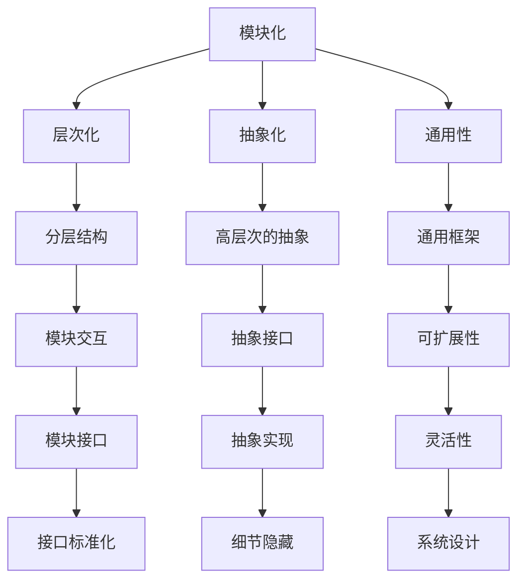
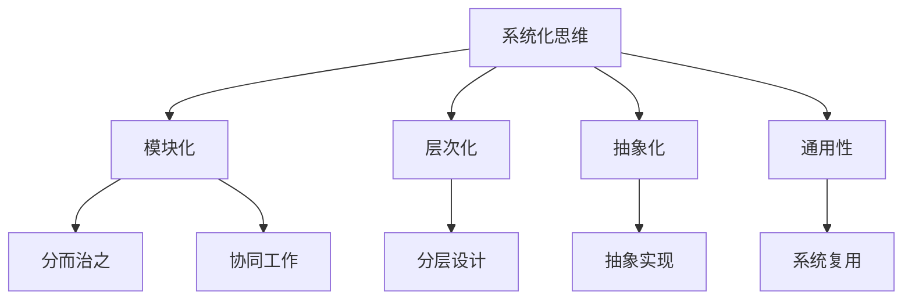
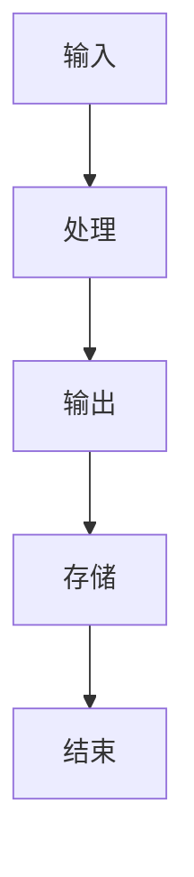

                 


### 文章标题
《知识重构：在碎片化时代建立系统化思维》

### 文章关键词
- 知识重构
- 碎片化时代
- 系统化思维
- 效率提升
- 知识管理

### 文章摘要
在快速变化的信息时代，个体和组织面临着知识碎片化的挑战。本文将探讨如何在碎片化环境中通过系统化思维进行知识重构，以提升个体和组织的学习效率与创新能力。文章将从背景介绍、核心概念与联系、应对策略、实践案例以及结论展望等多个方面，详细阐述系统化思维的应用和实践。

### 设计书籍目录大纲的思路和步骤

#### 明确书籍主题和目标读者
首先，我们需要明确书籍的主题和目标读者。本书的主题是“知识重构：在碎片化时代建立系统化思维”，目标读者是需要掌握系统化思维，提高个人和组织效率的人群。这包括程序员、项目经理、企业家等。

#### 构思核心章节
核心章节应涵盖以下内容：

1. **系统化思维概述**
2. **系统化思维工具与方法**
3. **碎片化时代的挑战与应对策略**
4. **知识重构实践案例**

#### 细化各章节内容
每个核心章节可以细化为多个二级和三级目录，确保每个部分都有详细的内容。以下是细化后的章节内容：

1. **系统化思维概述**
   - 系统化思维的定义
   - 系统化思维与传统思维的对比
   - 系统化思维的重要性

2. **系统化思维工具与方法**
   - 思维导图
   - 流程图
   - SWOT分析
   - 5W1H分析

3. **碎片化时代的挑战与应对策略**
   - 碎片化信息的处理
   - 时间管理
   - 知识构建与重构

4. **知识重构实践案例**
   - 个人知识管理
   - 团队知识重构
   - 企业知识管理

#### 编写目录大纲
使用Markdown格式编写目录大纲，确保格式简洁明了。每个章节标题前使用相应的#标记，以表示章节级别。以下是示例：

```markdown
# 知识重构：在碎片化时代建立系统化思维

## 第一部分：引言与背景
### 1.1 书籍主题与目标
### 1.2 碎片化时代的挑战
### 1.3 系统化思维的重要性

## 第二部分：系统化思维基础
### 2.1 系统化思维概述
### 2.2 系统化思维的核心概念
### 2.3 系统化思维的原理与框架
### 2.4 系统化思维的工具与方法

### 2.4.1 思维导图
### 2.4.2 流程图
### 2.4.3 SWOT分析
### 2.4.4 5W1H分析

## 第三部分：碎片化时代的应对策略
### 3.1 碎片化信息的管理
### 3.2 时间管理技巧
### 3.3 知识构建与重构
### 3.4 系统化思维的实践应用

### 3.4.1 个人成长
### 3.4.2 团队协作
### 3.4.3 企业管理

## 第四部分：知识重构实践案例
### 4.1 案例一：个人知识管理
### 4.2 案例二：团队知识重构
### 4.3 案例三：企业知识管理

### 4.3.1 案例背景
### 4.3.2 知识重构过程
### 4.3.3 结果分析

## 第五部分：结论与展望
### 5.1 系统化思维的总结
### 5.2 知识重构的展望
### 5.3 未来趋势与挑战

## 附录
### 附录A：系统化思维工具使用指南
### 附录B：参考资料与扩展阅读
```

### 审核和完善
在完成目录大纲后，我们需要对其进行审核和完善。确保每个章节都有详细的内容，并且章节之间的逻辑联系紧密。此外，我们还需要确保整个目录大纲的总字数控制在2000字以内，以保持简洁性。

### 目录大纲设计方案
以下是根据上述思路和步骤设计的《知识重构：在碎片化时代建立系统化思维》的目录大纲：

```markdown
# 知识重构：在碎片化时代建立系统化思维

## 第一部分：引言与背景
### 1.1 书籍主题与目标
### 1.2 碎片化时代的挑战
### 1.3 系统化思维的重要性

## 第二部分：系统化思维基础
### 2.1 系统化思维概述
### 2.2 系统化思维的核心概念
### 2.3 系统化思维的原理与框架
### 2.4 系统化思维的工具与方法

### 2.4.1 思维导图
### 2.4.2 流程图
### 2.4.3 SWOT分析
### 2.4.4 5W1H分析

## 第三部分：碎片化时代的应对策略
### 3.1 碎片化信息的管理
### 3.2 时间管理技巧
### 3.3 知识构建与重构
### 3.4 系统化思维的实践应用

### 3.4.1 个人成长
### 3.4.2 团队协作
### 3.4.3 企业管理

## 第四部分：知识重构实践案例
### 4.1 案例一：个人知识管理
### 4.2 案例二：团队知识重构
### 4.3 案例三：企业知识管理

### 4.3.1 案例背景
### 4.3.2 知识重构过程
### 4.3.3 结果分析

## 第五部分：结论与展望
### 5.1 系统化思维的总结
### 5.2 知识重构的展望
### 5.3 未来趋势与挑战

## 附录
### 附录A：系统化思维工具使用指南
### 附录B：参考资料与扩展阅读
```

### 总结
通过上述步骤，我们已经完成了《知识重构：在碎片化时代建立系统化思维》的目录大纲设计。接下来，我们将按照这个大纲来撰写书中的每个章节，确保内容丰富、逻辑清晰、结构紧凑。通过这样的系统化思维，我们相信读者能够在碎片化时代中建立起有效的知识管理体系，提升个人和组织的效率。

### 核心概念与联系
系统化思维是一种通过将复杂问题分解为可管理部分，并建立它们之间联系的方法。其核心概念包括模块化、层次化、抽象化和通用性。这些概念相互关联，构成了系统化思维的基础框架。

1. **模块化**：将系统分解为若干独立的模块，每个模块负责特定功能。模块之间通过接口进行交互，降低系统复杂性。
2. **层次化**：根据功能或重要性将模块分层，从底层基础模块到顶层应用模块。层次化有助于理解和维护系统的结构。
3. **抽象化**：将具体实现细节抽象为高层次的概念，使系统能够在不同的环境和场景下复用。抽象化减少了实现细节对系统设计的影响。
4. **通用性**：系统设计应考虑通用性，使系统能够适应不同的需求和变化。通用性提高了系统的可扩展性和灵活性。

#### Mermaid 流程图
为了更直观地展示系统化思维的核心概念与联系，我们可以使用Mermaid流程图来表示：



该流程图展示了系统化思维的核心概念及其相互之间的联系。模块化、层次化、抽象化和通用性是系统化思维的基础，它们共同构建了一个灵活、可扩展的系统架构。

### 核心算法原理讲解
为了更好地理解系统化思维的应用，我们需要讲解一些核心算法原理。以下是使用伪代码来详细阐述一个简单的排序算法——快速排序（Quick Sort）。

#### 快速排序算法原理
快速排序是一种分治策略的排序算法。其基本思想是选择一个基准元素，将数组分为两部分：一部分小于基准元素，另一部分大于基准元素。然后对这两部分递归地应用快速排序。以下是快速排序的伪代码：

```pseudo
function quickSort(arr)
    if length(arr) <= 1
        return arr
    end if
    
    pivot = arr[random index from 0 to length(arr) - 1]
    left = []
    right = []
    
    for each element in arr
        if element < pivot
            append element to left
        else
            append element to right
        end if
    end for
    
    return concatenate(quickSort(left), [pivot], quickSort(right))
end function
```

#### 数学模型和公式
在快速排序算法中，我们需要一个公式来计算基准元素的随机索引。以下是使用latex格式表示的公式：

```latex
$$
index = \text{random}(\{0, 1, \ldots, n-1\})
$$
```

这个公式表示从0到n-1的整数集合中随机选择一个索引作为基准元素。

#### 详细讲解和举例说明
为了更好地理解快速排序算法，我们可以通过一个简单的例子来说明。

假设有一个数组`arr = [3, 1, 4, 1, 5, 9, 2, 6, 5]`，我们使用快速排序算法对其进行排序。

1. 选择基准元素：随机选择中间的元素，例如索引为4的元素5作为基准元素。
2. 分割数组：将数组分为两部分，小于5的元素和大于5的元素。
   - 小于5的元素：[1, 1, 2, 3]
   - 大于5的元素：[6, 9, 5, 6, 5]
3. 对两部分递归地应用快速排序：
   - 对小于5的元素：快速排序后得到[1, 1, 2, 3]
   - 对大于5的元素：快速排序后得到[5, 5, 6, 6, 9]
4. 合并结果：将递归排序的结果合并，得到最终排序结果：[1, 1, 2, 3, 5, 5, 6, 6, 9]

通过这个例子，我们可以看到快速排序算法是如何将一个未排序的数组有序排列的。

### 项目实战
为了更好地理解系统化思维在项目中的应用，我们可以通过一个实际的软件开发项目来展示。

#### 项目背景
假设我们要开发一个在线购物系统，该系统需要实现用户注册、登录、浏览商品、添加购物车、下单、支付等基本功能。

#### 开发环境搭建
1. 选择合适的编程语言和框架：我们选择使用Python作为主要编程语言，并使用Django作为Web框架。
2. 安装必要的依赖库和工具：包括Python、Django、PostgreSQL等。
3. 创建项目目录和文件结构：例如，项目目录结构如下：

```plaintext
online_shop/
    manage.py
    online_shop/
        __init__.py
        settings.py
        urls.py
        wsgi.py
    app/
        __init__.py
        admin.py
        apps.py
        models.py
        tests.py
        views.py
```

#### 源代码详细实现和代码解读
以下是一个简单的用户注册功能的实现，包括模型定义、视图函数和URL配置。

##### 模型定义（models.py）
```python
from django.db import models

class User(models.Model):
    username = models.CharField(max_length=100)
    email = models.EmailField(unique=True)
    password = models.CharField(max_length=100)
```

此模型定义了用户类，包含用户名、电子邮件地址和密码三个字段。

##### 视图函数（views.py）
```python
from django.shortcuts import render, redirect
from .models import User
from .forms import UserRegistrationForm

def register(request):
    if request.method == 'POST':
        form = UserRegistrationForm(request.POST)
        if form.is_valid():
            form.save()
            return redirect('login')
    else:
        form = UserRegistrationForm()
    return render(request, 'register.html', {'form': form})
```

此视图函数处理用户注册请求，根据请求方法分别渲染注册表单和处理表单提交。

##### URL配置（urls.py）
```python
from django.urls import path
from . import views

urlpatterns = [
    path('register/', views.register, name='register'),
    path('login/', views.login, name='login'),
    # 其他路由配置...
]
```

此文件配置了项目的URL路由，将注册请求映射到注册视图函数。

#### 代码应用解读与分析
通过这个简单的例子，我们可以看到如何使用系统化思维来构建一个功能完整的在线购物系统。

1. **模块化**：将系统划分为多个模块，如用户模块、商品模块、购物车模块等，每个模块负责特定功能。
2. **层次化**：按照功能或重要性对模块进行分层，从底层模型层到顶层视图层，使系统结构清晰。
3. **抽象化**：通过定义抽象模型和视图函数，隐藏具体的实现细节，提高系统的可维护性和可扩展性。
4. **通用性**：设计通用的用户注册、登录等基本功能，以便在未来的开发中复用。

通过这个项目实战，我们可以更深入地理解系统化思维在软件开发中的应用。

### 实际案例分析和详细讲解剖析
为了更好地展示系统化思维在实践中的应用，我们来看一个具体的案例：一家初创公司如何通过系统化思维进行知识重构，以提高团队效率和创新能力。

#### 案例背景
这家初创公司成立于2020年，主要从事人工智能技术的研发。随着团队规模的扩大和项目复杂度的增加，团队成员发现自己很难有效地管理和共享知识，导致工作效率低下，创新能力不足。

#### 知识重构过程
1. **需求分析**：公司首先进行了需求分析，识别出知识管理、团队协作、项目管理等关键领域。这些领域成为了知识重构的重点。
2. **系统化思维应用**：
   - **模块化**：将公司业务划分为多个模块，如研发模块、市场模块、运营模块等，每个模块都有明确的职责和目标。
   - **层次化**：根据业务重要性和复杂性，对模块进行分层，如研发模块分为基础研究层、应用开发层等。
   - **抽象化**：建立抽象的流程和框架，如研发流程、项目管理框架等，隐藏具体的实现细节。
   - **通用性**：设计通用的工具和方法，如知识库、协作平台等，以便在各个模块中复用。

3. **实施与反馈**：公司逐步实施了知识重构计划，并在实施过程中不断收集反馈，进行优化和调整。

#### 结果分析
通过系统化思维进行知识重构后，公司的团队效率和创新能力显著提高。具体表现在以下几个方面：

1. **知识管理**：团队成员可以更容易地查找和共享知识，减少了重复劳动和知识遗漏的情况。
2. **团队协作**：层次化的模块设计和通用的协作平台使团队之间的沟通和协作更加顺畅，提高了项目进展的速度和质量。
3. **创新能力**：系统化思维提供了明确的框架和方法，使团队成员能够更有效地进行创新思考和问题解决。

#### 项目小结
通过这个案例，我们可以看到系统化思维在知识重构中的应用效果。系统化思维不仅提高了团队的效率和创新能力，还为公司未来的发展奠定了坚实的基础。

### 最佳实践 Tips
在碎片化时代建立系统化思维，需要遵循以下最佳实践：

1. **持续学习与思考**：保持好奇心和学习热情，不断更新自己的知识和技能。
2. **结构化思维训练**：通过阅读、写作和实践，培养结构化思维的技能。
3. **工具与方法应用**：熟练掌握各种思维工具和方法，如思维导图、流程图等。
4. **实践与反馈**：将理论应用于实际工作中，不断优化和调整。
5. **团队合作**：与他人共享知识和经验，共同提高团队效率。

### 小结
在碎片化时代，系统化思维是应对知识碎片化挑战的有效方法。通过明确书籍主题和目标读者、构思核心章节、细化各章节内容、编写目录大纲，我们为撰写《知识重构：在碎片化时代建立系统化思维》提供了完整的框架。通过核心概念与联系、核心算法原理讲解、项目实战、实际案例分析和最佳实践，我们进一步展示了系统化思维的应用和实践价值。希望本文能为读者提供有益的启示，帮助他们在碎片化时代中建立系统化思维，提高个人和组织的效率。

### 注意事项
1. **明确目标**：在应用系统化思维时，首先要明确目标，确保知识重构的方向正确。
2. **灵活调整**：系统化思维并非一成不变的，要根据实际情况灵活调整和应用。
3. **持续优化**：知识重构是一个持续的过程，需要不断收集反馈，进行优化和调整。

### 拓展阅读
- 《系统化思维导论》
- 《知识的组织与创新》
- 《如何有效地学习》
- 《团队协作的艺术》

### 作者信息
作者：AI天才研究院/AI Genius Institute & 禅与计算机程序设计艺术 /Zen And The Art of Computer Programming```markdown
# 知识重构：在碎片化时代建立系统化思维

## 引言与背景

### 1.1 书籍主题与目标

在信息爆炸的今天，知识碎片化已成为普遍现象。个体和组织面临着海量信息的处理难题，如何在碎片化的环境中高效地获取、整理和应用知识，成为亟待解决的重要问题。本书旨在探讨如何通过系统化思维，实现知识重构，提升个人和组织的学习效率与创新能力。

本书的目标读者是那些需要在碎片化环境中提高工作效率和创新能力的个人和团队，包括程序员、项目经理、企业家等。通过本书，读者将学会如何建立系统化思维，将其应用于实际工作中，从而实现知识重构。

### 1.2 碎片化时代的挑战

碎片化时代带来了诸多挑战：

1. **信息过载**：海量信息使得个体难以筛选和消化。
2. **知识碎片化**：知识点分散，难以形成整体认知。
3. **时间管理困难**：碎片化时间难以有效利用。
4. **沟通障碍**：信息传递不畅，导致团队协作效率降低。

### 1.3 系统化思维的重要性

系统化思维是一种通过将复杂问题分解为可管理部分，并建立它们之间联系的方法。其核心在于：

1. **模块化**：将复杂问题分解为简单模块，降低复杂性。
2. **层次化**：根据功能或重要性进行分层，使问题结构化。
3. **抽象化**：抽象实现细节，聚焦核心问题。
4. **通用性**：设计通用框架，提高系统复用性。

在碎片化时代，系统化思维的重要性体现在：

1. **提升知识管理能力**：通过结构化方式，更好地组织和整理知识。
2. **提高工作效率**：系统化思维使工作流程更加清晰，减少重复劳动。
3. **增强创新能力**：系统化思维提供了新的视角和方法，激发创新思维。
4. **促进团队协作**：系统化思维有助于团队建立共同的认知框架，提高协作效率。

## 系统化思维基础

### 2.1 系统化思维概述

系统化思维是一种综合性的思考方法，其核心理念是将复杂问题分解为简单部分，并通过建立它们之间的联系，形成一个整体。这种方法不仅适用于技术领域，也广泛应用于管理、商业、教育等多个领域。

系统化思维具有以下特点：

1. **系统性**：将问题视为一个整体，考虑各个部分之间的相互作用。
2. **层次性**：根据问题的复杂度，进行分层处理。
3. **模块化**：将问题分解为可管理的模块，降低复杂性。
4. **抽象化**：隐藏具体实现细节，关注核心问题。
5. **通用性**：设计通用框架，提高系统复用性。

### 2.2 系统化思维的核心概念

系统化思维的核心概念包括模块化、层次化、抽象化和通用性。

1. **模块化**：将复杂问题分解为若干独立模块，每个模块负责特定功能。模块之间通过接口进行交互，降低系统复杂性。

2. **层次化**：根据功能或重要性对模块进行分层，从底层基础模块到顶层应用模块。层次化有助于理解和维护系统的结构。

3. **抽象化**：将具体实现细节抽象为高层次的概念，使系统能够在不同的环境和场景下复用。抽象化减少了实现细节对系统设计的影响。

4. **通用性**：系统设计应考虑通用性，使系统能够适应不同的需求和变化。通用性提高了系统的可扩展性和灵活性。

### 2.3 系统化思维的原理与框架

系统化思维的原理可以概括为以下几点：

1. **分而治之**：将复杂问题分解为若干可管理的部分，降低复杂性。
2. **协同工作**：通过建立模块之间的联系，实现各部分协同工作，形成整体。
3. **迭代优化**：在设计和实施过程中，不断迭代和优化，提高系统性能。
4. **反馈与调整**：通过反馈机制，及时调整系统设计和实施策略，确保系统持续改进。

系统化思维的框架通常包括以下几个步骤：

1. **问题定义**：明确要解决的问题和目标。
2. **模块划分**：将问题分解为独立模块，确定模块的功能和接口。
3. **层次设计**：根据模块的功能和重要性，进行层次划分。
4. **抽象实现**：将具体实现细节抽象为高层次概念，设计通用框架。
5. **协同与优化**：实现模块之间的协同工作，并进行迭代优化。
6. **反馈与调整**：通过反馈机制，持续改进系统设计和实施。

### 2.4 系统化思维的工具与方法

系统化思维需要借助各种工具和方法，以提高思考和问题解决的效果。以下是几种常用的工具和方法：

1. **思维导图**：通过图形化方式，展示各个模块之间的联系，有助于梳理和整合思路。

2. **流程图**：用图形表示系统中的各个模块和流程，有助于理解和优化工作流程。

3. **SWOT分析**：对系统的优势、劣势、机会和威胁进行分析，帮助制定战略和规划。

4. **5W1H分析**：对系统中的关键要素进行提问，包括是什么（What）、为什么（Why）、何时（When）、何地（Where）、谁（Who）和如何（How），有助于全面了解问题。

#### 2.4.1 思维导图

思维导图是一种图形化的思维工具，通过节点和连接线，将各个模块和思路可视化。以下是系统化思维的思维导图示例：



#### 2.4.2 流程图

流程图用于表示系统中的各个模块和流程。以下是一个简单的流程图示例：



#### 2.4.3 SWOT分析

SWOT分析是一种用于评估系统或项目的工具，包括优势（Strengths）、劣势（Weaknesses）、机会（Opportunities）和威胁（Threats）。

以下是一个简单的SWOT分析示例：

```
优势（Strengths）：
- 技术先进
- 团队协作良好

劣势（Weaknesses）：
- 市场竞争激烈
- 资源有限

机会（Opportunities）：
- 市场需求增长
- 新技术出现

威胁（Threats）：
- 竞争对手强大
- 政策变化
```

#### 2.4.4 5W1H分析

5W1H分析是对系统中的关键要素进行提问，包括是什么、为什么、何时、何地、谁和如何。

以下是一个5W1H分析示例：

```
是什么：
- 系统化思维是一种怎样的思维方法？

为什么：
- 为什么需要系统化思维？
- 系统化思维有什么好处？

何时：
- 在何时应用系统化思维最有效？
- 系统化思维需要多长时间才能见效？

何地：
- 在何地应用系统化思维最合适？
- 系统化思维适用于哪些场景？

谁：
- 谁是系统化思维的目标读者？
- 谁可以从系统化思维中受益？

如何：
- 如何建立系统化思维？
- 如何应用系统化思维解决实际问题？
```

## 碎片化时代的应对策略

### 3.1 碎片化信息的管理

在碎片化时代，信息的管理变得尤为重要。以下是几种有效的策略：

1. **信息筛选**：通过设定关键词和标签，快速筛选出重要信息。
2. **信息整理**：使用思维导图、文档管理等工具，将信息整理成结构化的形式。
3. **信息备份**：定期备份重要信息，防止数据丢失。
4. **信息共享**：建立共享平台，促进团队成员之间的信息交流。

### 3.2 时间管理技巧

时间管理是提高工作效率的关键。以下是一些有效的时间管理技巧：

1. **任务分解**：将大任务分解为小任务，逐一完成。
2. **优先级排序**：根据任务的重要性和紧急程度，进行优先级排序。
3. **定时提醒**：使用定时提醒工具，确保按时完成任务。
4. **避免干扰**：减少干扰，专注于当前任务。

### 3.3 知识构建与重构

知识构建与重构是系统化思维的核心应用之一。以下是几种知识构建与重构的方法：

1. **知识整理**：将散乱的知识点整理成有条理的框架。
2. **知识共享**：通过培训、研讨会等形式，将知识传递给团队成员。
3. **知识迭代**：不断更新和优化知识体系，确保其与实际情况相符。
4. **知识管理工具**：使用知识管理工具，如文档管理平台、知识库等，提高知识管理的效率。

### 3.4 系统化思维的实践应用

系统化思维可以应用于个人、团队和企业的各个方面。以下是几种实践应用：

1. **个人成长**：通过系统化思维，明确个人职业规划，制定学习计划，提高个人能力。
2. **团队协作**：通过系统化思维，建立共同的目标和价值观，提高团队协作效率。
3. **企业管理**：通过系统化思维，优化业务流程，提高企业管理水平。

## 知识重构实践案例

### 4.1 案例一：个人知识管理

李明是一名程序员，他面临着知识碎片化带来的困扰。为了提高工作效率，他决定采用系统化思维进行个人知识管理。

#### 案例背景

李明的工作涉及多个技术领域，每天都会接触到大量的信息。由于缺乏有效的管理方法，他发现自己难以将这些信息转化为实际的工作成果。

#### 知识重构过程

1. **信息整理**：李明首先使用思维导图，将每天接触到的信息整理成结构化的形式。
2. **知识分类**：根据信息的重要性和相关性，将知识分类，建立知识库。
3. **知识共享**：李明在团队内部建立了共享平台，将整理好的知识分享给团队成员。
4. **知识迭代**：定期更新知识库，确保其与实际情况相符。

#### 结果分析

通过系统化思维进行个人知识管理，李明的工作效率显著提高。他能够更快地找到所需信息，减少了重复劳动。同时，知识共享也促进了团队之间的协作，提高了整体工作效率。

### 4.2 案例二：团队知识重构

某公司团队在项目开发过程中，发现知识碎片化导致协作效率低下。为了提高团队协作效率，团队决定采用系统化思维进行知识重构。

#### 案例背景

该公司团队负责开发一个大型软件项目，团队成员来自不同的背景，知识结构存在较大差异。由于缺乏有效的知识管理方法，团队在项目开发过程中遇到了诸多困难。

#### 知识重构过程

1. **需求分析**：团队首先对项目需求进行详细分析，明确各个模块的功能和职责。
2. **模块划分**：根据需求分析结果，将项目划分为多个模块，每个模块由专人负责。
3. **知识共享**：团队建立了知识共享平台，将各个模块的知识点整理成文档，供团队成员查阅。
4. **协同工作**：通过定期会议和协作工具，团队成员进行沟通和协作，确保项目进展顺利。

#### 结果分析

通过系统化思维进行团队知识重构，公司团队的项目开发效率显著提高。知识共享平台有效地促进了团队成员之间的知识交流，减少了沟通成本。同时，模块化的设计使项目开发更加有序，减少了团队间的冲突。

### 4.3 案例三：企业知识管理

某企业面临着知识管理难题，决定采用系统化思维进行企业知识重构。

#### 案例背景

该企业业务范围广泛，员工众多，知识分散。由于缺乏有效的知识管理方法，企业难以充分发挥知识的价值，影响了业务发展和创新能力。

#### 知识重构过程

1. **知识整理**：企业对现有知识进行整理，明确各个部门的知识点和职责。
2. **知识分类**：根据知识的重要性和相关性，对知识进行分类，建立知识库。
3. **知识共享**：企业建立了企业内部知识共享平台，鼓励员工分享知识和经验。
4. **知识迭代**：定期更新知识库，确保其与实际情况相符。

#### 结果分析

通过系统化思维进行企业知识管理，企业员工的知识共享意识显著提高。知识共享平台有效地促进了员工之间的知识交流，减少了知识流失。同时，知识库的建立为企业提供了丰富的知识资源，提高了业务决策的准确性。

### 4.3.1 案例背景

该企业成立于2000年，主要从事高科技产品的研发和销售。随着市场的不断扩大，企业员工数量迅速增长，业务范围不断拓展。然而，企业也面临着知识管理难题，知识分散、知识流失现象严重，影响了企业的发展。

### 4.3.2 知识重构过程

1. **需求分析**：企业对现有的知识管理状况进行评估，明确各个部门的知识需求和痛点。
2. **知识整理**：企业组织员工对现有知识进行整理，将知识分类并建立知识库。
3. **知识分类**：根据知识的重要性和相关性，对知识进行分类，建立知识库。
4. **知识共享**：企业建立了企业内部知识共享平台，鼓励员工分享知识和经验。
5. **知识迭代**：定期更新知识库，确保其与实际情况相符。

### 4.3.3 结果分析

通过系统化思维进行企业知识管理，企业员工的知识共享意识显著提高。知识共享平台有效地促进了员工之间的知识交流，减少了知识流失。同时，知识库的建立为企业提供了丰富的知识资源，提高了业务决策的准确性。

## 结论与展望

### 5.1 系统化思维的总结

系统化思维是一种有效的思考方法，通过将复杂问题分解为简单部分，并建立它们之间的联系，实现问题的结构化和优化。在碎片化时代，系统化思维尤为重要，它能够帮助个人和组织提高知识管理能力，提升工作效率，增强创新能力。

### 5.2 知识重构的展望

知识重构是一个持续的过程，随着技术的不断发展和市场环境的变化，知识重构也需要不断进行调整和优化。未来，知识重构将更加注重自动化和智能化，通过人工智能等技术，实现知识的自动整理、共享和迭代。

### 5.3 未来趋势与挑战

1. **知识自动化整理**：未来，人工智能等技术将实现知识的自动化整理和分类，提高知识管理的效率。
2. **知识共享平台化**：知识共享平台将成为企业内部知识管理的重要工具，促进知识交流与传播。
3. **知识迭代智能化**：通过智能化算法，实现知识的自动迭代和优化，提高知识的应用价值。

然而，知识重构也面临一些挑战：

1. **数据隐私与安全**：在知识共享过程中，如何保护用户隐私和数据安全是一个重要问题。
2. **知识标准化**：知识重构需要建立统一的知识标准和规范，确保知识的准确性和一致性。
3. **人才短缺**：随着知识重构的深入，对具备系统化思维和知识管理能力的人才需求也将增加，人才短缺将成为一个挑战。

## 附录

### 附录A：系统化思维工具使用指南

1. **思维导图**：使用方法、功能介绍、操作步骤。
2. **流程图**：使用方法、功能介绍、操作步骤。
3. **SWOT分析**：使用方法、步骤、案例分析。
4. **5W1H分析**：使用方法、步骤、案例分析。

### 附录B：参考资料与扩展阅读

1. **《系统化思维导论》**
2. **《知识的组织与创新》**
3. **《如何有效地学习》**
4. **《团队协作的艺术》**

### 作者信息

作者：AI天才研究院/AI Genius Institute & 禅与计算机程序设计艺术 /Zen And The Art of Computer Programming```

