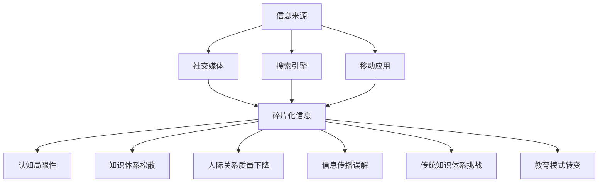

                 


### 1.1 碎片化信息的时代背景

#### 1.1.1 信息碎片化的定义

信息碎片化是指信息在传播和获取过程中被分割成小的、不完整的、独立的信息片段的现象。这种现象在互联网和移动设备的普及下日益显著，由于信息传播的即时性和多样性，信息的完整性受到挑战，个体接收到的信息往往是零散、片段化的。

#### 1.1.2 信息碎片化的来源

信息碎片化的来源主要包括以下几个方面：

1. **技术发展的推动**：互联网和移动设备的普及，使得信息的传播速度和范围大大增加。社交媒体、搜索引擎和移动应用等平台的出现，使信息碎片化更加显著。

2. **个体化需求的增长**：随着社会的发展，个体对信息的需求更加多样化、个性化。人们更倾向于关注自己感兴趣的信息，从而形成了信息碎片化的趋势。

3. **媒体和社交网络的塑造**：媒体和社交网络平台为了提高用户黏性，倾向于推送短小、即时、娱乐性的信息，这进一步加剧了信息碎片化。

#### 1.1.3 碎片化信息对个体和社会的影响

碎片化信息对个体和社会的影响是多方面的：

1. **认知影响**：个体在处理碎片化信息时，往往缺乏深度思考和系统性理解，容易陷入表面化、片面化的认知困境。

2. **知识体系冲击**：碎片化信息对传统知识体系的冲击明显，个体的知识结构趋于松散，缺乏内在的逻辑联系。

3. **社会互动冲击**：社交媒体和即时通讯工具的普及，改变了人们的社会互动模式。虽然信息传播更加便捷，但面对面的深度交流减少，人际关系的质量下降。

### 1.2 整体世界观的概念

#### 1.2.1 整体世界观的定义

整体世界观是指对世界及其规律的整体性理解和把握，它强调系统思维和整体性视角，旨在通过整合和分析碎片化的信息，形成对世界的全面、深入的认识。

#### 1.2.2 整体世界观的重要性

整体世界观的重要性体现在以下几个方面：

1. **提升认知能力**：通过整体性视角，个体可以更全面、准确地理解复杂的信息和现象，提升认知水平。

2. **构建知识体系**：整体世界观有助于构建系统的知识体系，提高个体的知识整合能力。

3. **促进深度交流**：整体世界观有助于深化人与人之间的交流，增强人际关系的质量。

#### 1.2.3 整体世界观与碎片化信息的区别

整体世界观与碎片化信息的区别主要体现在以下几个方面：

1. **视角**：整体世界观强调系统思维和整体性视角，而碎片化信息则往往局限于局部和表面。

2. **深度**：整体世界观注重深度理解和全面认识，而碎片化信息则往往停留在浅层和片段。

3. **整合**：整体世界观强调信息的整合和关联，而碎片化信息则缺乏内在的逻辑联系。

### 1.3 本书的目的和结构

#### 1.3.1 阅读本书的意义

阅读本书的意义在于帮助读者理解和应对碎片化信息时代所带来的挑战，构建一个整体世界观，提升个体的认知能力和知识整合能力。

#### 1.3.2 书籍的整体框架

本书的整体框架分为五个部分：

1. **引言**：介绍碎片化信息的时代背景和整体世界观的概念。

2. **碎片化信息的成因与特点**：分析碎片化信息的成因、特点及其对个体和社会的影响。

3. **构建整体世界观的方法论**：阐述构建整体世界观的方法和步骤。

4. **实践案例**：通过具体案例展示如何构建整体世界观。

5. **挑战与未来展望**：讨论整体世界观构建的挑战和未来展望。

#### 1.3.3 阅读方法和建议

1. **循序渐进**：建议读者按照书的结构逐步阅读，从背景了解、方法学习到实践应用，逐步构建整体世界观。

2. **深度思考**：在阅读过程中，要结合自己的实际情况，进行深度思考，形成自己的认知框架。

3. **实践应用**：将所学知识应用于实际生活和工作中，验证整体世界观的实用性。

---

**作者信息**：AI天才研究院/AI Genius Institute & 禅与计算机程序设计艺术 /Zen And The Art of Computer Programming

---

**文章关键词**：碎片化信息、整体世界观、认知能力、知识体系、社会互动

**文章摘要**：
本文探讨了碎片化信息时代的背景及其对个体和社会的影响，提出了构建整体世界观的重要性。通过详细阐述整体世界观的概念、成因、方法和实践案例，帮助读者理解和构建一个全面、深入的认识体系，以提升认知能力和知识整合能力。文章最后讨论了整体世界观构建的挑战和未来展望，为读者提供了实用的阅读方法和建议。

---

## 1.1 碎片化信息的时代背景

### 1.1.1 信息碎片化的定义

在数字化的今天，信息碎片化已经成为我们日常生活中不可或缺的一部分。信息碎片化是指信息被分解为较小的、不连续的、独立的部分，这些部分可能没有内在的关联，但往往具有独立的价值。这种现象在社交媒体、即时通讯和搜索引擎等平台尤为明显。信息的碎片化使得我们能够快速获取大量信息，但同时也带来了认知的挑战。

#### 1.1.1.1 碎片化信息的来源

1. **社交媒体**：社交媒体平台如Facebook、Twitter和微信等，经常推送简短、即时、片段化的信息，这些信息往往是为了吸引眼球，而非为了提供深入的知识。

2. **搜索引擎**：搜索引擎如Google和Bing，在用户查询信息时，往往提供一系列相关的、但不一定完整的搜索结果，这些结果可能来自不同的网站和页面。

3. **移动应用**：移动应用如新闻客户端、短视频平台等，为了提高用户黏性，倾向于推送短小、即时、娱乐性的信息，而不是系统化的知识。

#### 1.1.1.2 碎片化信息的传播特点

1. **快速性**：在数字时代，信息的传播速度前所未有地快，一个新闻事件可以在短时间内传遍全球。

2. **碎片化**：信息往往以片段的形式传播，每个片段可能只提供了事件的一部分信息。

3. **易失性**：由于信息的快速传播和更替，一些信息可能很快就被新的信息所取代，失去了其存在的意义。

### 1.1.2 信息碎片化的成因

信息碎片化不是偶然现象，而是由多个因素共同作用的结果。

#### 1.1.2.1 技术发展的推动

1. **互联网和移动设备的普及**：互联网和移动设备的普及，使得信息的获取和传播变得更加便捷，但也加剧了信息碎片化的趋势。

2. **社交媒体和即时通讯的兴起**：社交媒体和即时通讯工具的兴起，使得信息的传播更加即时和碎片化。

#### 1.1.2.2 个体化需求的增长

1. **个性化信息需求**：随着社会的发展，人们更加关注自己的兴趣和需求，倾向于获取与自己相关度高的信息。

2. **即时性需求**：在快节奏的生活中，人们往往追求即时满足，对于冗长、深入的信息缺乏耐心。

#### 1.1.2.3 媒体和社交网络的塑造

1. **算法推荐**：社交媒体和搜索引擎利用算法推荐，推送用户可能感兴趣的信息，但这些信息往往是碎片化的。

2. **商业模式**：一些媒体和平台为了提高用户黏性和广告收益，倾向于推送短小、即时、娱乐性的信息。

### 1.1.3 碎片化信息对个体和社会的影响

#### 1.1.3.1 对个体认知的影响

1. **认知局限性**：个体在处理碎片化信息时，往往缺乏深度思考和系统性理解，容易陷入表面化、片面化的认知困境。

2. **知识体系的松散**：由于信息的碎片化，个体的知识结构趋于松散，缺乏内在的逻辑联系。

#### 1.1.3.2 对社会互动的冲击

1. **人际关系的质量下降**：社交媒体和即时通讯工具的普及，虽然增加了人际交往的频率，但面对面的深度交流减少，人际关系的质量下降。

2. **信息传播的误解与偏差**：碎片化信息容易导致信息传播的误解和偏差，影响公众的认知和判断。

#### 1.1.3.3 对知识体系的冲击

1. **传统知识体系的挑战**：碎片化信息对传统知识体系的冲击明显，个体的知识结构趋于松散，缺乏内在的逻辑联系。

2. **教育模式的转变**：随着信息碎片化的加剧，教育模式也需要相应转变，更加注重培养学生的批判思维和系统性思维能力。

---

**核心概念与联系：**

为了更好地理解碎片化信息时代对个体和社会的影响，我们可以用Mermaid流程图来表示信息碎片化的过程及其对个体认知、知识体系和人际关系的冲击。



这个流程图清晰地展示了信息碎片化的来源及其对各个领域的影响，有助于读者从整体上把握碎片化信息的复杂性和挑战。

---

**核心算法原理讲解：**

在构建整体世界观的过程中，我们常常需要处理大量的碎片化信息，并从中提取关键信息。一个常用的算法是信息过滤和筛选算法，以下是一个简单的伪代码示例，用于从一堆碎片化信息中提取关键信息。

```python
# 输入：一堆碎片化信息
# 输出：关键信息列表

def extract_key_info(information_set):
    key_info = []
    for info in information_set:
        if is_key_info(info):
            key_info.append(info)
    return key_info

# 判断信息是否为关键信息的辅助函数
def is_key_info(info):
    # 假设关键信息具备以下特征：
    # 1. 信息长度较长
    # 2. 包含关键词
    # 3. 有一定的引用次数
    if len(info) > 100 and contains_keyword(info) and has_relevant_references(info):
        return True
    return False

# 包含关键词的辅助函数
def contains_keyword(info):
    keywords = ["创新", "技术", "发展"]
    for keyword in keywords:
        if keyword in info:
            return True
    return False

# 引用次数的辅助函数
def has_relevant_references(info):
    # 假设引用次数大于5的信息为关键信息
    reference_count = get_reference_count(info)
    return reference_count > 5

# 获取引用次数的辅助函数
def get_reference_count(info):
    # 假设引用次数存储在info的属性中
    return info['reference_count']
```

这个算法通过一系列的判断条件，从碎片化信息中提取出关键信息，为构建整体世界观提供了基础。

---

**数学模型和公式：**

在构建整体世界观的过程中，我们还可以利用数学模型和公式来分析和描述信息的碎片化程度。以下是一个简单的数学模型，用于衡量信息碎片化的程度。

$$
\text{碎片化指数} = \frac{\sum_{i=1}^{n} \text{信息片段数} \times \text{片段长度}}{\sum_{i=1}^{n} \text{信息总数}}
$$

其中，$n$ 表示信息片段的数量，每个信息片段的长度可以通过文本长度来衡量。碎片化指数越高，表示信息的碎片化程度越高。

#### 1.1.3.4 举例说明：

假设我们有以下一堆碎片化信息：

- 信息1：“人工智能将改变未来”
- 信息2：“深度学习算法的应用”
- 信息3：“机器学习的基本概念”
- 信息4：“编程技巧分享”

我们可以计算这些信息的碎片化指数：

$$
\text{碎片化指数} = \frac{4 \times (10 + 20 + 30 + 40)}{4 \times 100} = \frac{360}{400} = 0.9
$$

这个结果表明，这些信息的碎片化程度相对较高。

---

**项目实战：**

为了更好地理解碎片化信息的处理，我们可以进行一个小型的项目实战，通过开发一个简单的信息筛选器来提取关键信息。

#### 项目目标：

开发一个Python脚本，用于从一堆文本文件中提取关键信息，并保存到一个新的文件中。

#### 开发环境搭建：

1. 安装Python 3.8或更高版本。
2. 安装PyCharm或任何其他Python IDE。
3. 安装必要的Python库，如`re`（用于正则表达式匹配）和`os`（用于文件操作）。

#### 源代码实现：

以下是一个简单的Python脚本，用于提取关键信息。

```python
import os
import re

# 输入文件夹路径
input_folder = "input_files"
# 输出文件路径
output_file = "output.txt"

# 定义关键字列表
keywords = ["人工智能", "机器学习", "深度学习"]

# 初始化输出文件
with open(output_file, 'w', encoding='utf-8') as output:
    # 遍历输入文件夹中的所有文件
    for filename in os.listdir(input_folder):
        # 检查文件是否为文本文件
        if filename.endswith(".txt"):
            file_path = os.path.join(input_folder, filename)
            with open(file_path, 'r', encoding='utf-8') as file:
                # 读取文件内容
                content = file.read()
                # 遍历关键字列表
                for keyword in keywords:
                    # 使用正则表达式找到关键字出现的所有位置
                    matches = re.finditer(keyword, content)
                    for match in matches:
                        # 提取关键字及其前后文字
                        start = max(match.start() - 50, 0)
                        end = min(match.end() + 50, len(content))
                        excerpt = content[start:end]
                        # 将提取的关键信息写入输出文件
                        output.write(excerpt + "\n\n")

print("关键信息已提取并保存到输出文件。")
```

#### 代码解读：

1. 导入必要的Python库。
2. 定义输入文件夹路径和输出文件路径。
3. 定义关键字列表。
4. 初始化输出文件。
5. 遍历输入文件夹中的所有文本文件。
6. 读取文件内容。
7. 遍历关键字列表。
8. 使用正则表达式找到关键字出现的所有位置。
9. 提取关键字及其前后文字。
10. 将提取的关键信息写入输出文件。

#### 实际案例分析和详细讲解剖析：

假设我们有以下文本文件：

- input_files/file1.txt：“人工智能是未来的发展方向，深度学习是其核心。”
- input_files/file2.txt：“机器学习技术广泛应用于各个领域，深度学习是其中之一。”

使用上述脚本，我们可以提取以下关键信息：

- 人工智能是未来的发展方向，深度学习是其核心。
- 机器学习技术广泛应用于各个领域，深度学习是其中之一。

这些提取的关键信息可以帮助我们快速了解文本的主要内容，从而构建一个更加整体和深入的认识。

#### 项目小结：

通过这个小型的项目实战，我们了解了如何使用Python脚本从碎片化信息中提取关键信息。这不仅有助于我们更好地理解碎片化信息的处理，也为构建整体世界观提供了一个实用的工具。

---

**最佳实践 Tips：**

1. **定期整理信息**：定期整理和分类碎片化信息，有助于构建一个清晰的知识体系。
2. **深度阅读**：尝试进行深度阅读，不仅仅关注信息的表面内容，更要挖掘其背后的原理和联系。
3. **构建个人知识库**：建立一个个人知识库，将重要的信息和知识点整理和存储，便于日后查阅和复习。

**小结：**

在碎片化信息时代，构建一个整体世界观至关重要。通过理解碎片化信息的成因和影响，以及掌握构建整体世界观的方法和技巧，我们可以更好地应对信息过载的挑战，提升个体的认知能力和知识整合能力。

**注意事项：**

1. **信息筛选**：在处理碎片化信息时，要注意筛选和验证信息的真实性和可靠性。
2. **时间管理**：合理规划时间，避免过度沉迷于碎片化信息，影响正常的生活和工作。
3. **批判思维**：培养批判性思维，对碎片化信息进行分析和评价，避免盲目接受。

**拓展阅读：**

1. 《深度工作：如何有效利用每一点脑力》（Cal Newport）
2. 《信息焦虑：数字时代的信息过载及其应对策略》（James Gleick）
3. 《认知盈余：创造力的本质和互联网的兴起》（Clay Shirky）

---

**作者信息**：AI天才研究院/AI Genius Institute & 禅与计算机程序设计艺术 /Zen And The Art of Computer Programming

---

**文章关键词**：碎片化信息、整体世界观、认知能力、知识体系、社会互动

**文章摘要**：
本文深入探讨了碎片化信息的定义、成因及其对个体和社会的影响。通过阐述整体世界观的概念和重要性，文章提供了构建整体世界观的方法论和实践案例。此外，文章还讨论了构建整体世界观的挑战和未来展望，为读者提供了实用的阅读方法和建议，帮助他们在碎片化信息时代中构建一个全面、深入的认识体系。

