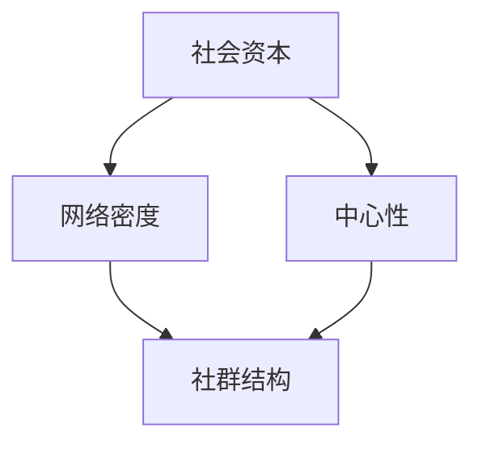

                 

### 文章标题：社交圈层：在多元关系网络中寻找归属

社交圈层，作为社会结构的微观单元，承载着个体在社会中的身份认同、情感支持和信息交流等重要功能。在数字化时代，社交圈层的形成与演变受到互联网和社交媒体的深刻影响，传统的社交结构正在被重新定义。本文旨在探讨社交圈层的概念、形成机制、功能以及跨文化差异，并最终探讨如何在多元关系网络中寻找归属。

关键词：社交圈层、关系网络、归属感、社交媒体、跨文化差异

### 摘要

本文首先介绍了社交圈层的定义及其在现代社会中的重要性，随后探讨了社交圈层的形成和演变机制，分析了社交圈层内部的动态关系和网络结构。接着，文章转向跨文化视角，比较不同文化背景下的社交圈层特点，并讨论了如何通过建立和导航社交圈层来增强个体的归属感。通过案例分析，文章总结了社交圈层研究的实际应用，提出了针对个人和组织的社会互动策略。

### 目录

1. **引言**  
   - 社交圈层的概念与意义  
   - 文章结构与主要论点

2. **社交圈层的理论基础**  
   - 社交网络的定义与特性  
   - 社交圈层的类型与分类

3. **社交圈层的形成与演变**  
   - 影响因素分析  
   - 社交圈层的动态过程

4. **社交圈层的功能与作用**  
   - 身份认同与情感支持  
   - 信息交流与社会影响力

5. **跨文化视角下的社交圈层**  
   - 不同文化背景下的社交圈层特点  
   - 跨文化比较与融合

6. **建立与导航社交圈层**  
   - 健康社交圈层的构建策略  
   - 挑战与解决方案

7. **案例分析**  
   - 社交圈层研究的实际应用  
   - 社交圈层对个人和组织的影响

8. **结论与未来展望**  
   - 社交圈层研究的重要性  
   - 社交圈层发展的趋势与挑战

### 引言

社交圈层，又称社交网络，是指由一组相互关联的个体组成的群体，这些个体之间通过社会关系进行互动。在现代社会中，社交圈层不仅仅是简单的社交联系，更是个体寻求身份认同、情感支持和信息交流的重要场所。随着互联网和社交媒体的普及，社交圈层的形式和功能也在不断演变，成为理解社会结构和个人行为的关键因素。

本篇文章旨在深入探讨社交圈层的概念、形成机制、功能以及跨文化差异，并最终探讨如何在多元关系网络中寻找归属。文章首先将定义社交圈层，并介绍其基本理论，接着分析社交圈层的形成和演变过程。随后，文章将探讨社交圈层在现代社会中的功能，特别是其对个体归属感的影响。接下来，文章将转向跨文化视角，比较不同文化背景下的社交圈层特点。最后，文章将提供建立和导航健康社交圈层的策略，并通过案例分析总结社交圈层的实际应用。

### 社交圈层的理论基础

社交圈层，作为社会结构的重要组成部分，其理论基础可以追溯到经典的社会学理论。在分析社交圈层时，我们首先需要了解社交网络的基本概念和特性。

#### 社交网络的定义与特性

社交网络是指由个体及其之间的关系组成的复杂系统。每一个个体都可以视为一个节点，而个体之间的关系则构成连接这些节点的边。社交网络具有以下基本特性：

1. **节点（Nodes）**：社交网络中的每个个体都是节点，它们可以是个人、组织、团体等。
2. **边（Edges）**：节点之间的关系用边来表示，边的强度和类型可以反映关系的紧密程度和性质。
3. **连通性（Connectivity）**：社交网络的连通性是指节点之间通过边连接的紧密程度。高连通性意味着网络中节点之间的互动更加频繁，信息传播速度更快。
4. **密度（Density）**：社交网络的密度是指网络中边数与可能边数之比。高密度网络意味着个体之间的联系更加紧密。

#### 社交圈层的类型与分类

社交圈层可以根据不同的标准进行分类，常见的分类方法包括：

1. **强关系与弱关系**：强关系通常是指亲密的、长期的、信任度高的关系，如家庭成员、朋友等。弱关系则是指短暂的、偶然的、信任度较低的关系，如同事、社交聚会中的陌生人。强关系有助于提供情感支持和资源，而弱关系则有助于扩展社交网络和获取新信息。
   
2. **同质性与异质性**：同质性社交圈层是指成员在年龄、职业、兴趣爱好等方面具有相似性。异质性社交圈层则是指成员在上述方面存在显著差异。同质性社交圈层有助于成员之间的交流和共鸣，而异质性社交圈层则可以提供更多的视角和经验。

3. **正式与非正式**：正式社交圈层通常是指由组织或机构定义和管理的社交网络，如公司内部团队、学术团体等。非正式社交圈层则是指成员自发形成的社交网络，如朋友聚会、兴趣小组等。正式社交圈层往往具有明确的目标和组织结构，而非正式社交圈层则更注重社交互动和个人关系。

#### 社交圈层的核心概念与联系

在分析社交圈层时，需要关注几个核心概念，并理解它们之间的联系。以下是社交圈层的一些核心概念及其关系：

1. **社会资本**：社会资本是指个体或群体通过社交网络获取的资源和支持。社会资本可以包括信息、知识、情感支持等。社会资本的积累有助于提升个体在社会中的地位和影响力。

2. **网络密度**：网络密度是指社交网络中节点之间的平均连通性。高网络密度意味着个体之间的联系更加紧密，信息传播速度更快，但也可能导致信息过载和社交疲劳。

3. **中心性**：中心性是指节点在网络中的重要性和影响力。中心度高的节点通常具有更多的连接和较高的信息流动量。中心性可以分为度中心性、接近中心性和中间中心性等。

4. **社群结构**：社群结构是指社交网络中形成的紧密群体和关系模式。社群结构可以影响信息传播、社会影响和社会认同等。

以下是一个简单的Mermaid流程图，展示了这些核心概念之间的关系：

通过上述分析，我们可以更好地理解社交圈层的理论基础，为进一步探讨社交圈层的形成与演变、功能与作用奠定基础。

### 社交圈层的形成与演变

社交圈层的形成和演变是一个复杂且动态的过程，受到多种因素的影响。理解这些因素有助于我们深入探讨社交圈层的本质及其在个体和社会层面的作用。

#### 影响因素分析

1. **社会结构**：社会结构是指社会中的组织、规范和制度，它们对社交圈层的形成和演变具有基础性影响。不同的社会结构可能导致不同的社交圈层模式。例如，在传统社会中，家族和亲属关系是社交圈层的主要构成部分，而在现代社会中，职业和兴趣小组的社交圈层更为普遍。

2. **文化背景**：文化背景是影响社交圈层形成的重要因素。文化价值观、传统习俗和社会规范塑造了个体在社交互动中的行为模式和偏好。例如，集体主义文化强调集体利益和归属感，可能导致更加紧密的社交圈层，而个人主义文化则更注重个人自由和独立，可能导致较为松散的社交圈层。

3. **技术发展**：互联网和社交媒体的迅速发展改变了社交圈层的形式和功能。在线平台和社交网络使得个体可以轻松建立和维持跨地域的社交关系，扩展社交圈层的范围。此外，技术还提供了新的互动方式和交流工具，如即时通讯、视频会议和社交媒体平台，进一步促进了社交圈层的发展和演变。

4. **个体行为**：个体的行为选择和决策也影响社交圈层的形成和演变。个体在社交互动中的选择偏好、行为模式和社交策略决定了社交圈层的结构和性质。例如，个体可能根据自身的需求和目标选择加入特定的社交圈层，或通过主动建立和维护关系来扩展社交网络。

#### 社交圈层的动态过程

1. **形成过程**：社交圈层的形成通常始于个体之间的初步接触和互动。这些互动可以是面对面的交流，也可以是通过互联网和社交媒体平台进行的在线互动。随着互动的深入和频率的增加，个体之间的信任和关系逐渐建立，社交圈层逐渐形成。

2. **演变过程**：社交圈层不是静态的，而是处于不断的演变过程中。社交圈层的演变受到多种因素的影响，如个体行为的改变、社会结构的变化、文化背景的演变等。随着时间和环境的变迁，社交圈层的结构和功能也会发生相应的调整和变化。

3. **生命周期**：每个社交圈层都有其生命周期，包括形成期、发展期、稳定期和衰退期。在形成期，社交圈层逐渐形成并开始发挥作用；在发展期，社交圈层的规模和影响力逐渐扩大；在稳定期，社交圈层达到一个相对稳定的阶段，成员之间的关系较为紧密；在衰退期，社交圈层的成员可能因为各种原因逐渐减少互动，最终导致社交圈层的解体。

#### 社交媒体与社交圈层

社交媒体在社交圈层的形成和演变中扮演着重要角色。社交媒体平台为个体提供了新的互动方式和交流渠道，使得社交圈层可以跨越地理和时间的限制。以下是一些具体的影响：

1. **扩展社交圈层**：通过社交媒体平台，个体可以轻松结识来自不同背景的人，从而扩展社交圈层。这不仅增加了社交网络的多样性，也为个体提供了更多机会和资源。

2. **增强互动频率**：社交媒体使得个体可以随时随地进行互动，大大增加了互动的频率。频繁的互动有助于加深成员之间的了解和信任，促进社交圈层的发展和稳定。

3. **改变互动方式**：社交媒体改变了传统的社交互动方式，如从面对面的交流转向线上沟通。这种变化不仅影响了社交圈层的结构和功能，也改变了个体在社交互动中的行为模式和期望。

4. **影响归属感**：社交媒体为个体提供了新的归属感来源。通过在线互动，个体可以感受到虚拟社群的归属感，这种归属感在一定程度上可以弥补现实社交圈层的不足。

总之，社交圈层的形成与演变是一个复杂的过程，受到多种因素的影响。理解这些因素及其相互关系有助于我们更好地把握社交圈层的发展趋势，为个体和组织提供有效的社交策略和管理方法。

### 社交圈层的功能与作用

社交圈层在现代社会中扮演着多种角色，对个体和社会都具有深远的影响。以下是社交圈层的主要功能与作用：

#### 身份认同

身份认同是指个体在社交圈层中找到归属感，认同自己的身份和角色。社交圈层提供了一个共同的身份标识，成员在共享价值观、兴趣爱好和文化背景的基础上建立认同感。这种认同感不仅增强了成员的自尊和自信，还强化了他们的社会归属感。例如，在职业社交圈层中，成员可能通过共享行业知识和经验来确认自己在行业中的身份，从而增强职业认同。

#### 情感支持

社交圈层为成员提供了一个情感支持系统，使个体在面临困难和挑战时能够获得安慰和帮助。亲密的社交关系可以提供情感上的依靠，缓解压力和焦虑。例如，在家庭和友谊等亲密社交圈层中，成员之间可以通过分享个人经历、提供心理支持等方式，共同应对生活中的挑战，增强彼此的情感联系。

#### 信息交流

社交圈层是信息交流的重要渠道，成员通过社交圈层获取和分享各种信息。社交圈层中的信息交流不仅限于日常的闲聊和娱乐，还包括专业知识、行业动态、市场情报等。这种信息共享有助于个体和组织的知识积累和创新能力。例如，在学术圈层中，学者们通过学术会议、研讨会和社交媒体平台分享研究成果，促进学术交流和知识传播。

#### 社会影响力

社交圈层在社会影响力方面也发挥着重要作用。通过社交圈层，个体和团体可以传播观点、倡导行动和影响公共舆论。社交圈层的成员往往拥有共同的价值观和目标，他们通过协作和互动来实现共同的社会目标。例如，在环保圈层中，成员通过分享环保知识、组织公益活动、推动政策变革等方式，共同推动社会对环保问题的关注和行动。

#### 资源获取与交换

社交圈层是资源获取与交换的重要平台。通过社交圈层，个体可以获取职业机会、社会关系和其他资源。社交圈层中的成员通常愿意分享资源和机会，以建立和巩固彼此之间的关系。例如，在职业社交圈层中，成员可以通过推荐、介绍和互助来获取工作机会和商业合作。

#### 归属感与社区建设

社交圈层为成员提供了一个归属感的来源，使个体在社交圈层中找到自己的位置和角色。归属感不仅增强了成员的凝聚力和忠诚度，还促进了社区建设。在社交圈层中，成员通过共同的活动、交流和互动，建立了一个紧密的社区。这种社区建设有助于增强成员的社会责任感，推动社区的发展和繁荣。

总之，社交圈层在身份认同、情感支持、信息交流、社会影响力、资源获取与交换以及归属感与社区建设等方面发挥着重要作用。通过理解社交圈层的功能与作用，我们可以更好地把握社交圈层对社会和个体的深远影响，为构建健康、积极和富有成效的社交圈层提供指导。

### 跨文化视角下的社交圈层

社交圈层作为一种社会现象，在不同文化背景下表现出显著的特点和差异。了解这些差异对于理解全球范围内的社交互动和人际关系具有重要意义。以下是几种主要文化背景下社交圈层的特点及其比较。

#### 西方文化背景

在西方文化背景下，社交圈层通常更加注重个人主义和自我表达。西方社会强调个人的独立性和自主性，社交圈层往往以小团体形式存在，成员之间的互动较为自由和开放。西方文化中的社交圈层通常基于共同的兴趣、价值观或职业领域，如运动爱好者群体、科技创业者社区等。此外，西方文化中的社交圈层常常通过社交媒体平台进行扩展和维持，这使得个体能够轻松地建立和维护广泛的社交网络。

#### 东方文化背景

在东方文化背景下，社交圈层往往更强调集体主义和家庭价值观。东方社会，如中国、日本和韩国，重视家庭、亲属关系和团体归属感。社交圈层通常由亲属、朋友和同事等紧密联系的人组成，成员之间的互动更加注重情感和责任。此外，东方文化中的社交圈层往往通过传统的社交活动，如家庭聚会、节日庆祝等，进行加强和维持。这些活动不仅加深了成员之间的情感联系，也增强了社区凝聚力。

#### 集体主义与个人主义的对比

集体主义文化强调个体与集体之间的紧密联系，个体的行为和决策往往受到社会规范和文化价值观的强烈影响。在集体主义文化中，社交圈层更多地作为一种社会支持系统，成员之间有较强的依赖和责任意识。个人主义文化则更注重个体的自主性和自由选择，社交圈层更多地基于个人兴趣和价值观的相似性，成员之间的互动更加自由和开放。

#### 社交圈层的网络结构

在集体主义文化中，社交圈层通常呈现出紧密的网络结构，成员之间的联系较为紧密且具有高度的相互依赖性。这种紧密的网络结构有助于形成强大的社会支持和社区凝聚力，但也可能导致信息流通受阻和内部竞争加剧。在个人主义文化中，社交圈层通常呈现出较松散的网络结构，成员之间的联系较为广泛但相对独立，这种结构有助于个体实现自主性和创新能力，但也可能导致社交网络的断裂和社区凝聚力不足。

#### 案例分析

1. **美国社交圈层**：在美国，社交圈层通常以小团体形式存在，成员之间通过共同的兴趣和价值观建立联系。例如，硅谷的科技创业者社区就是一个典型的社交圈层，成员通过分享创业经验和资源，共同推动科技创新和发展。

2. **中国社交圈层**：在中国，社交圈层往往以家庭和亲属关系为基础，成员之间的互动更加注重情感和责任。例如，春节期间的家庭聚会不仅是亲朋好友团聚的时刻，也是社交圈层加强和维持的重要方式。

总之，不同文化背景下的社交圈层具有各自的特点和优势，理解这些差异有助于我们更好地把握全球范围内的社交互动和人际关系。通过跨文化视角的比较，我们可以更好地理解和尊重不同文化背景下的社交圈层，促进跨文化沟通和合作。

### 建立与导航社交圈层的策略

在多元关系网络中建立和导航社交圈层是一个复杂但至关重要的过程。这不仅有助于个体在社会中获得归属感和支持，还可以为组织和社区带来创新和繁荣。以下是一些策略，帮助我们在复杂的社会网络中找到自己的位置，并建立和维护健康、富有成效的社交圈层。

#### 健康社交圈层的构建策略

1. **明确目标与需求**：在建立社交圈层之前，首先要明确自己的目标和个人需求。思考自己希望从社交圈层中获得什么，无论是职业机会、知识交流还是情感支持。明确目标有助于有针对性地选择和加入合适的社交圈层。

2. **积极互动**：积极参与社交圈层的活动和讨论，主动与他人建立联系。通过面对面的交流和线上互动，可以加深与成员之间的了解和信任，促进社交关系的建立。

3. **多元化**：尽量参与多样化的社交圈层，包括正式和非正式、同质性和异质性的圈层。多元化的社交圈层可以提供不同的视角和经验，有助于扩展个人网络和获取更丰富的资源。

4. **建立信誉**：在社交圈层中建立良好的信誉和声誉是关键。通过分享有价值的信息、提供帮助和积极参与讨论，可以赢得其他成员的尊重和信任，从而提升自己在社交圈层中的地位和影响力。

5. **情感投资**：在社交圈层中建立深厚的情感联系，不仅有助于维持社交关系的稳定性，还可以为成员提供更强的支持和凝聚力。通过倾听、关心和分享个人经历，可以加深彼此之间的情感联系。

#### 挑战与解决方案

1. **时间管理**：社交圈层活动通常需要投入大量的时间和精力，这可能导致时间管理上的挑战。解决方案是合理安排时间，将社交活动与个人工作和生活平衡好。使用日程规划工具和提醒功能，可以有效管理时间，确保不因社交活动而忽视其他重要事务。

2. **信息过载**：在大型社交圈层中，信息量可能非常庞大，容易导致信息过载。解决方案是培养信息筛选和评估能力，关注重要信息，学会忽略无关或低价值的消息。此外，定期清理和整理社交平台上的信息，可以帮助保持清晰的思维。

3. **社交障碍**：在多元关系网络中，不同文化背景和价值观的冲突可能导致社交障碍。解决方案是培养跨文化沟通能力，尊重和接受不同的观点和文化。通过开放和包容的态度，可以促进跨文化理解和协作。

4. **隐私保护**：在社交圈层中，个人隐私保护是一个重要问题。解决方案是了解社交平台的隐私设置，合理配置权限，避免泄露过多个人信息。同时，学会辨别网络上的风险和骗局，确保个人信息安全。

#### 自我意识与同理心

1. **自我意识**：建立健康的社交圈层需要自我意识，了解自己的需求、价值观和目标。通过自我反思，可以更好地定位自己在社交圈层中的角色和位置。

2. **同理心**：同理心是建立积极社交关系的关键。通过倾听和理解他人的观点和感受，可以增强与成员之间的情感联系，建立更深层次的社交关系。

总之，建立和导航社交圈层是一个需要策略和智慧的过程。通过明确目标、积极互动、多元化参与、建立信誉、有效时间管理和隐私保护，我们可以克服各种挑战，在多元关系网络中找到归属，并建立富有成效的社交圈层。

### 案例分析

为了更好地理解社交圈层在实际生活中的应用，我们可以通过以下几个具体案例来探讨社交圈层对个人和组织的影响。

#### 案例一：职业社交网络LinkedIn

LinkedIn是一个专业的社交平台，致力于帮助职业人士建立职业关系、分享职业经验和寻找职业机会。LinkedIn上的用户通常通过共同的职业背景、行业兴趣和职位来建立社交圈层。以下是LinkedIn社交圈层的几个关键应用：

1. **职业机会**：通过LinkedIn，用户可以关注感兴趣的公司和行业动态，获取最新的招聘信息。此外，用户还可以通过已建立的关系网络，获得内部推荐和职业机会。

2. **知识共享**：LinkedIn允许用户分享行业见解、经验和学习资源。这种知识共享有助于提升用户的专业能力和影响力。

3. **人脉拓展**：通过参与LinkedIn群组、关注特定领域的专家和公司，用户可以拓展自己的职业社交圈层，结识更多业内人士。

#### 案例二：学术社交网络ResearchGate

ResearchGate是一个面向学术界的社交平台，旨在促进学术交流和合作。以下是ResearchGate社交圈层的几个关键应用：

1. **研究合作**：学术研究者可以通过ResearchGate寻找合作者，共同开展研究项目。这种合作有助于推动学术研究的进步和创新发展。

2. **学术交流**：ResearchGate上的用户可以分享自己的研究成果、发表论文和参与学术讨论，促进学术界的交流和知识传播。

3. **职业发展**：通过ResearchGate，学术研究者可以展示自己的研究成果和学术贡献，吸引潜在雇主和合作伙伴，促进职业发展。

#### 案例三：社交媒体平台Facebook

Facebook是一个综合性的社交平台，用户不仅可以与亲朋好友保持联系，还可以加入各种兴趣小组和社群。以下是Facebook社交圈层的几个关键应用：

1. **社区建设**：用户可以加入自己感兴趣的兴趣小组和社群，如运动爱好者、读书俱乐部等。这些小组和社群为用户提供了一个交流和互动的平台，有助于建立社区归属感。

2. **信息传播**：通过Facebook，用户可以获取和分享各种信息，包括新闻、趣闻、知识等。这种信息传播有助于用户扩展视野和提升信息素养。

3. **社会影响**：通过Facebook，用户可以传播自己的观点和价值观，影响和动员更多人参与到社会议题和活动中。这种社会影响有助于推动社会进步和变革。

#### 案例四：企业内部社交平台Slack

Slack是一个企业内部通讯和协作平台，旨在提高团队的工作效率和沟通效果。以下是Slack社交圈层的几个关键应用：

1. **团队协作**：Slack允许团队成员在各自的讨论组中交流工作进展、分享文件和讨论问题，有助于提高团队协作效率。

2. **知识共享**：通过Slack，团队成员可以分享最佳实践、工作经验和工具资源，促进知识传播和技能提升。

3. **项目管理**：Slack的集成功能可以帮助团队进行项目管理，如任务分配、进度跟踪和反馈收集，确保项目按时完成。

通过这些案例分析，我们可以看到社交圈层在不同场景中的应用和作用。无论是职业发展、学术研究、社区建设还是团队协作，社交圈层都扮演着关键角色，为个人和组织带来了诸多益处。

### 结论与未来展望

本文通过深入探讨社交圈层的概念、形成与演变、功能与作用、跨文化差异以及建立与导航策略，系统地阐述了社交圈层在现代社会中的重要性。社交圈层不仅是个体寻求身份认同、情感支持、信息交流和资源获取的重要场所，也是社会影响力和社会发展的关键因素。

首先，社交圈层在身份认同和情感支持方面发挥着重要作用。通过建立紧密的社交关系，个体能够在复杂的社交网络中找到归属感和安全感。其次，社交圈层促进了信息交流和社会影响力的增强，为知识传播和创新提供了广阔的平台。此外，跨文化视角下的比较分析揭示了不同文化背景下社交圈层的独特特点，强调了理解和尊重文化差异的重要性。

展望未来，社交圈层的发展将继续受到技术进步和社会变迁的深刻影响。随着人工智能、大数据和区块链等技术的应用，社交圈层的构建和运营将变得更加智能化和高效化。同时，社会结构和价值观念的演变也将推动社交圈层的形式和功能发生新的变化。未来的研究应关注如何利用技术手段优化社交圈层的构建和导航，提高社交互动的质量和效果，促进社会和谐与个体幸福。

总之，社交圈层研究具有重要的理论和实践价值。通过深入理解和积极应对社交圈层的发展趋势，我们可以更好地把握社会动态，提升个体的社会参与感和幸福感，为构建和谐、繁荣的社会贡献力量。

### 作者信息

作者：AI天才研究院/AI Genius Institute & 禅与计算机程序设计艺术 /Zen And The Art of Computer Programming

AI天才研究院（AI Genius Institute）专注于人工智能前沿技术和跨学科研究，致力于推动人工智能在各个领域的创新应用。作者在此感谢读者对本文的关注，并期待与各位读者共同探讨社交圈层领域的未来发展。禅与计算机程序设计艺术（Zen And The Art of Computer Programming）则是一部关于计算机编程哲学的经典之作，为程序员提供了深刻的思考和指导。

