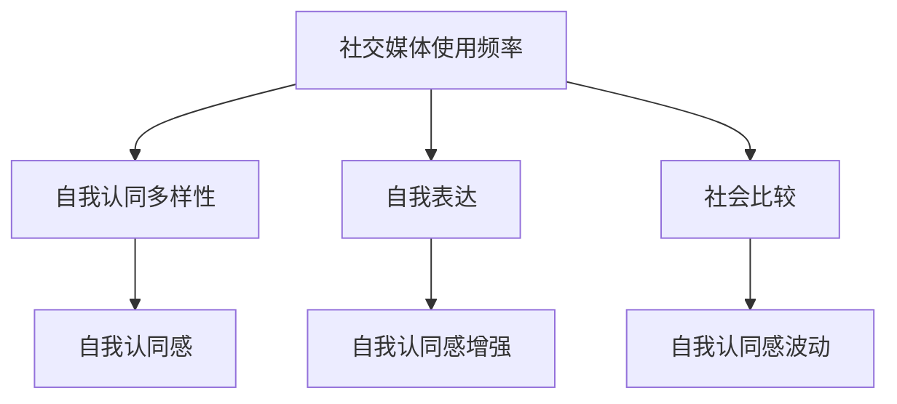

                 

### 引言

### 1.1 书籍背景与目的

随着互联网技术的迅猛发展，社交媒体已成为现代社会不可或缺的一部分。从早期的Facebook、Twitter，到如今的各种短视频平台、直播平台，社交媒体不仅改变了人们的沟通方式，也深刻影响了人们的自我认同。自我认同是指个体对自己身份的认知和确认，是心理学和社会学领域的重要研究课题。而社交媒体的出现，为人们提供了前所未有的平台，使其可以在虚拟世界中展示和构建自我形象。

本书旨在探讨社交媒体与自我认同之间的关系，具体目标如下：

1. **梳理社交媒体的发展历程及其对现代生活的影响**：通过回顾社交媒体的起源、发展过程和市场规模，揭示其如何成为现代生活的一部分。

2. **分析自我认同的概念及其类型**：介绍传统自我认同和社会建构主义视角下的自我认同，为理解社交媒体中的自我认同奠定基础。

3. **探讨虚拟世界中的意义建构过程**：分析虚拟社交网络中的社会互动、意义生成和传递，揭示意义建构在虚拟世界中的复杂性。

4. **讨论社交媒体对自我认同的挑战及应对策略**：分析社交媒体对个体自我认同可能带来的影响，并提出个人、社会和政策层面的应对策略。

5. **通过案例研究验证理论**：选择具有代表性的案例，深入分析社交媒体与自我认同之间的关系，验证理论模型的适用性。

### 1.2 社交媒体与自我认同的重要性

社交媒体对现代生活的影响是不容忽视的。它改变了人们的沟通方式，使得人们可以随时随地与世界各地的人交流。此外，社交媒体还影响了人们的自我认同。在传统社会中，个体主要通过家庭、学校、工作等现实生活中的互动来建立自我认同。而在虚拟世界中，个体可以通过社交媒体平台展示自己的兴趣爱好、职业背景、价值观等，从而构建一个虚拟的自我形象。

自我认同在个人和社会层面都具有重要意义。对个人而言，自我认同提供了身份认同感和归属感，有助于个体在社会中找到自己的位置。对整个社会而言，个体的自我认同影响着社会结构和社会发展。社交媒体的兴起，使得个体可以在虚拟世界中构建自我认同，这不仅丰富了个体生活的多样性，也为社会带来了新的发展机遇和挑战。

### 1.3 本书结构安排

本书共分为七个部分，各部分的主要内容如下：

- **第一部分：引言**：介绍书籍的背景、目的和结构安排。
- **第二部分：社交媒体的崛起**：回顾社交媒体的发展历程，分析其对现代生活的影响。
- **第三部分：社交媒体与自我认同**：探讨自我认同的概念与类型，分析社交媒体对自我认同的影响。
- **第四部分：虚拟世界中的意义建构**：分析虚拟世界中的社会互动、意义生成和传递。
- **第五部分：社交媒体与自我认同的挑战与应对**：讨论社交媒体对自我认同的挑战及应对策略。
- **第六部分：案例研究**：通过案例分析，验证理论模型的适用性。
- **第七部分：结论与展望**：总结主要研究发现，讨论未来研究方向。

通过以上结构安排，本书旨在系统地探讨社交媒体与自我认同之间的关系，为相关领域的研究和实践提供有价值的参考。

## 第二部分：社交媒体的崛起

### 2.1 社交媒体的发展历程

社交媒体的兴起并非一蹴而就，而是经历了长期的发展过程。从最早的在线社区，到如今多元化的平台，社交媒体的发展历程可谓是一部技术与文化变革的史诗。

#### 2.1.1 早期社交媒体

社交媒体的起源可以追溯到20世纪90年代，当时互联网开始普及，人们开始尝试在线交流。早期的社交媒体形式主要是论坛和聊天室。例如，Usenet是一个早期的全球性网络新闻组，用户可以在不同的论坛上发布消息和讨论。与此同时，早期的聊天室如Internet Relay Chat (IRC)也提供了实时的文字交流平台。

1994年，一个名为“Friends Reunited”的网站在英国上线，这是第一个真正意义上的社交网络平台。它允许人们通过输入学校名称和年份，找到自己曾经的同学和朋友。这一网站的诞生标志着社交媒体的诞生，并引发了一波模仿潮。

#### 2.1.2 社交媒体的发展趋势

随着互联网技术的进步，社交媒体逐渐从简单的信息共享平台演变为功能丰富的生态系统。2000年代初期，博客成为了一种流行的社交媒体形式。博客允许用户发布个人的思考和感受，并通过链接与其他博客建立联系。WordPress和Blogger等博客平台的兴起，使得博客成为了一个重要的社交媒介。

2004年，Facebook的成立标志着社交媒体进入了一个新的阶段。Facebook不仅提供了一个平台，让用户可以发布状态、上传照片和视频，还可以通过好友系统与现实生活中的人建立联系。Facebook的成功带动了其他类似平台的发展，如Myspace和LinkedIn。

进入2010年代，社交媒体的形态更加多样化。短视频平台如YouTube和TikTok的兴起，改变了人们的娱乐方式。同时，社交媒体也逐渐与电子商务和直播电商结合，形成了一种新的商业模式。

#### 2.1.3 社交媒体的市场规模

社交媒体的全球市场规模持续增长。据统计，全球社交媒体用户数量已经超过了40亿，占据了全球人口的一半以上。以下是一些关键的数据：

- **用户数量**：全球社交媒体用户数量从2010年的10亿增长到2022年的超过40亿。
- **活跃用户**：每天活跃在社交媒体上的用户数已经超过了30亿。
- **广告收入**：社交媒体广告收入逐年增加，已经成为广告市场的重要组成部分。例如，Facebook和Google的广告收入占据了全球数字广告市场的很大一部分。

社交媒体的市场规模不仅体现在用户数量和广告收入上，还体现在其对经济、文化和社会的深远影响上。随着社交媒体的普及，人们的生活方式、消费习惯和社会互动方式都在发生改变。这种变化不仅对个体产生了深远影响，也对整个社会产生了重大影响。

总的来说，社交媒体的发展历程从最初的简单交流工具，逐渐演变成为一个复杂、多功能的生态系统。随着技术的不断进步，社交媒体将继续影响人们的日常生活和社会结构。

### 2.2 社交媒体的技术演进

社交媒体的崛起离不开技术的演进。从最早的文本交流，到如今的图文、视频、直播等多种形式，技术进步为社交媒体的发展提供了源源不断的动力。

#### 2.2.1 文本交流

在早期的互联网时代，文本交流是主要的社交方式。Usenet和IRC等平台提供了基础的文本交流功能。尽管这些平台的交互方式相对简单，但它们为人们提供了一个全球性的交流平台，打破了地域和时间的限制。

随着互联网的普及，电子邮件逐渐成为了一种重要的沟通工具。电子邮件不仅支持文本交流，还可以附加文件和图片，为人们提供了更加丰富的沟通方式。

#### 2.2.2 图文交流

随着带宽的提高和图像处理技术的进步，社交媒体开始引入图像交流功能。1997年，AOL Instant Messenger（AIM）引入了表情符号（Emoticons），使得文本交流更加生动和有趣。随后，图片和视频的分享成为社交媒体的重要功能。2004年，Facebook的推出使得用户可以通过上传照片和视频展示自己的生活。

#### 2.2.3 视频交流

视频交流是社交媒体技术演进的一个重要里程碑。YouTube的兴起使得用户可以上传和观看视频，打破了传统媒体的界限。随着智能手机的普及和移动网络的优化，短视频平台如TikTok和抖音（Douyin）迅速崛起，成为人们日常生活中不可或缺的一部分。

视频交流不仅提供了更加丰富的内容形式，还改变了人们的娱乐方式和消费习惯。直播平台的兴起，如Twitch和斗鱼，使得用户可以在观看视频的同时与主播进行互动，进一步丰富了社交体验。

#### 2.2.4 直播技术

直播技术是社交媒体技术演进的一个新兴领域。直播平台如Facebook Live、YouTube Live和TikTok Live，允许用户实时分享自己的生活和工作。直播技术的实时性和互动性，使得用户可以更加真实地感受到彼此的存在。

直播技术的进步还带来了新的商业模式。例如，直播带货成为了一种新兴的电商模式，通过直播互动和实时销售，提高了消费者的购物体验和购买意愿。

#### 2.2.5 人工智能和大数据的应用

随着人工智能和大数据技术的发展，社交媒体平台不断优化用户体验和内容推荐。通过分析用户的行为数据和兴趣偏好，社交媒体平台可以提供个性化的内容推荐，提高用户的满意度和粘性。

例如，Facebook的Graph Search和YouTube的推荐算法，通过人工智能技术，为用户提供相关性强、兴趣匹配的内容。这些技术的应用不仅提高了平台的活跃度，也为广告商提供了更加精准的投放渠道。

总的来说，社交媒体的技术演进从最初的文本交流，发展到如今的图文、视频和直播等多种形式，技术的进步不断推动着社交媒体的发展。未来，随着技术的进一步突破，社交媒体将继续为人们的生活和社会互动带来更多创新和变革。

#### 2.1.3 社交媒体的市场规模

社交媒体的市场规模随着用户数量的不断增长而不断扩大。以下是一些关键的市场规模数据：

- **全球用户数量**：截至2022年，全球社交媒体用户数量已经超过了40亿，占全球人口的一半以上。预计未来几年，这一数字还将继续增长。

- **每日活跃用户**：每天活跃在社交媒体上的用户数已经超过了30亿。这一庞大的用户基础为社交媒体平台带来了巨大的流量和商业价值。

- **广告收入**：社交媒体广告收入持续增长，已经成为广告市场的重要组成部分。例如，Facebook和Google的广告收入占据了全球数字广告市场的很大一部分。根据市场研究公司的数据，全球社交媒体广告市场的规模预计将在未来几年内达到数千亿美元。

- **电商交易**：社交媒体不仅提供了广告收入，还成为电商交易的重要渠道。通过社交媒体平台，用户可以直接购买商品，进行交易。例如，Instagram的购物标签和Facebook的购物功能，使得社交媒体平台成为了一个集成式购物平台。

- **影响力经济**：随着社交媒体用户数量的增长，影响力经济也逐渐兴起。社交媒体上的知名用户，如网红、KOL（关键意见领袖）等，通过影响力变现，获得广告收入、商品销售提成等。这一新兴商业模式不仅为用户提供了新的收入来源，也为品牌提供了有效的营销渠道。

- **数据价值**：社交媒体平台通过用户数据分析和广告定位，创造出了巨大的商业价值。这些平台积累了海量的用户数据，通过大数据分析和人工智能技术，可以精准定位广告受众，提高广告投放的效果。

总的来说，社交媒体的市场规模庞大且持续增长，已经成为现代社会的重要基础设施。随着技术的不断进步和用户需求的不断变化，社交媒体将继续为经济、文化和社会带来深远的影响。

## 第三部分：社交媒体与自我认同

### 3.1 自我认同的概念与类型

自我认同是个体对自己身份的认知和确认，是心理学和社会学领域的重要研究课题。自我认同不仅影响个体的心理健康，也影响其在社会中的角色和行为。在社交媒体时代，自我认同的构建方式发生了显著变化。

#### 3.1.1 传统自我认同

传统自我认同主要基于个体在现实生活中的互动和经历。在这种模式中，个体通过家庭、学校、工作等现实生活场景中的角色和关系来建立自我认同。例如，一个人可能会通过自己在学校中的学习成绩、工作单位中的职位等来确认自己的身份和价值。

传统自我认同具有以下几个特点：

- **现实性**：个体通过现实生活中的互动和成就来构建自我认同，这些成就和互动具有现实的意义和影响。
- **稳定性**：传统自我认同一旦建立，往往具有较高的稳定性，不容易受到外界因素的干扰。
- **多样性**：个体在现实生活中的角色和关系多种多样，因此传统自我认同也具有多样性。

#### 3.1.2 社会建构主义视角下的自我认同

社会建构主义认为，自我认同不是个体内在固有的，而是在社会互动中建构出来的。社会建构主义强调，个体的自我认同是通过与他人互动和社会文化背景共同塑造的。

社会建构主义视角下的自我认同具有以下几个特点：

- **互动性**：个体通过与社会他人的互动来构建自我认同，这种互动不仅包括面对面的交流，也包括通过社交媒体平台进行的虚拟互动。
- **建构性**：自我认同是一个不断建构和重构的过程，受到社会文化、价值观和规范的影响。
- **多样性**：社会建构主义认为，个体的自我认同是多元化的，不仅包括现实生活中的角色和身份，还包括在虚拟世界中的角色和身份。

#### 3.1.3 自我认同与社交媒体

社交媒体对自我认同的构建产生了深远的影响。首先，社交媒体提供了一个新的平台，使个体可以更广泛地展示自己的个性和兴趣。通过发布照片、视频、文字等内容，个体可以构建一个虚拟的自我形象，从而增强自我认同。

其次，社交媒体中的互动和反馈机制，也影响了个体的自我认同。当个体在社交媒体上获得关注、点赞和评论时，这些正面的反馈可以增强个体的自我认同，使其更加自信和积极。相反，负面的反馈可能会导致个体自我认同的动摇和焦虑。

此外，社交媒体中的社会比较现象，也影响了个体的自我认同。个体在社交媒体上经常与他人进行比较，这可能导致自我怀疑和自我贬低。社会比较现象使得个体更关注自己的形象和地位，从而影响自我认同的稳定性。

总的来说，社交媒体为自我认同的构建提供了新的平台和方式，同时也带来了新的挑战。理解社交媒体对自我认同的影响，有助于我们更好地应对现代社会中的心理和社会问题。

### 3.2 社交媒体与自我认同的互动机制

社交媒体与自我认同之间的互动机制是复杂且多层次的。通过分析这些互动机制，我们可以更深入地理解社交媒体如何影响个体的自我认同。

#### 3.2.1 自我表达

自我表达是社交媒体与自我认同互动的一个重要方面。在社交媒体平台上，个体可以发布各种形式的内容，如文字、图片、视频等，表达自己的思想、情感和价值观。这种自我表达不仅有助于个体在虚拟世界中建立自我形象，也有助于个体确认和强化自我认同。

自我表达的过程通常包括以下几个步骤：

1. **内容创作**：个体根据自己的兴趣和经验，创作具有个人特色的内容。
2. **发布与分享**：个体将创作的内容发布到社交媒体平台，与朋友和关注者分享。
3. **互动与反馈**：社交媒体平台上的用户对发布的内容进行点赞、评论和分享，这些互动和反馈会进一步影响个体的自我认同。

#### 3.2.2 社会比较

社交媒体中的社会比较现象，对个体的自我认同产生了重要影响。社会比较是指个体在社交媒体上与其他人进行比较，以评估自己的地位、成就和幸福程度。这种比较可能带来积极或消极的影响。

社会比较的过程通常包括以下几个步骤：

1. **内容浏览**：个体浏览社交媒体上的内容，关注朋友和关注者的生活、成就和价值观。
2. **自我评估**：个体将浏览的内容与自己的生活进行比较，评估自己在某些方面的表现和成就。
3. **情感反应**：比较的结果可能导致个体的情感反应，如自豪、嫉妒、焦虑等，这些情感反应进一步影响自我认同。

#### 3.2.3 社交反馈

社交媒体平台上的互动和反馈机制，对个体的自我认同有显著影响。正面的反馈，如点赞、评论和分享，可以增强个体的自我认同，使其更加自信和积极。相反，负面的反馈，如批评、嘲笑和忽视，可能导致个体的自我认同受损，产生自卑和焦虑。

社交反馈的过程通常包括以下几个步骤：

1. **互动行为**：个体在社交媒体平台上与朋友和关注者互动，如评论、点赞和分享。
2. **反馈接收**：个体接收社交媒体平台上的互动反馈，如点赞数量、评论内容和分享次数。
3. **自我调整**：个体根据反馈调整自己的行为和心态，以应对正面的或负面的反馈。

#### 3.2.4 社交认同

社交媒体平台还提供了一个社交认同的空间，使个体可以与他人建立共同的价值观和兴趣。通过参与社交媒体上的群体活动和话题讨论，个体可以找到归属感和认同感，从而增强自我认同。

社交认同的过程通常包括以下几个步骤：

1. **群体参与**：个体参与社交媒体上的群体活动和话题讨论，如加入兴趣小组、参与直播互动等。
2. **价值认同**：个体在参与过程中，认同群体的价值观和观点，从而建立社交认同。
3. **自我扩展**：个体通过参与社交认同，扩展自己的视野和知识，进一步强化自我认同。

总的来说，社交媒体与自我认同的互动机制是复杂而多层次的。通过自我表达、社会比较、社交反馈和社交认同，社交媒体不仅影响个体的自我认同，也为其提供了新的构建和重构自我认同的方式。

### 3.3 社交媒体对自我认同的影响

社交媒体的普及对个体自我认同产生了深远的影响，这些影响既有积极的，也有消极的。理解这些影响有助于我们更好地应对社交媒体时代带来的挑战。

#### 3.3.1 积极影响

1. **增强自我表达**：社交媒体提供了一个平台，使个体可以自由地表达自己的思想、情感和价值观。这种自我表达有助于个体建立独特的自我形象，增强自我认同。

2. **扩大社交圈**：通过社交媒体，个体可以与来自不同背景、文化和地区的人建立联系。这种多元化的社交网络有助于个体拓展视野，增强社会认同感。

3. **促进心理健康**：积极的社交媒体互动，如获得点赞、评论和分享，可以增强个体的自我认同和自尊心，有助于提升心理健康。

4. **支持个性发展**：社交媒体中的个性化内容推荐和社交互动，有助于个体发现和发展自己的兴趣和特长，从而支持个性发展。

#### 3.3.2 消极影响

1. **自我认同的不稳定性**：社交媒体上的社会比较现象可能导致个体自我认同的不稳定。当个体在社交媒体上看到他人取得的成就时，可能会感到自卑和焦虑，从而影响自我认同的稳定性。

2. **社交焦虑和孤独感**：过度依赖社交媒体可能导致个体产生社交焦虑和孤独感。当个体在社交媒体上获得较少的互动和反馈时，可能会感到被忽视和孤独。

3. **虚拟与现实冲突**：在社交媒体上构建的虚拟自我形象可能与现实生活中的自我形象存在差距。这种虚拟与现实的冲突可能导致个体的自我认同受损。

4. **依赖和成瘾**：社交媒体的即时性和互动性可能使个体产生依赖和成瘾。过度使用社交媒体可能导致个体的注意力分散和社交能力下降，影响自我认同的发展。

总的来说，社交媒体对自我认同的影响是复杂和多面的。它既为个体提供了表达和认同的新途径，也带来了新的挑战和问题。理解这些影响，有助于我们更好地利用社交媒体的优势，同时避免其潜在的负面影响。

### 3.4 社交媒体时代的自我认同重构

在社交媒体时代，个体的自我认同经历着深刻的重构。这一重构不仅体现在自我认同的内容和形式上，还涉及到个体在社会中的角色和地位。

#### 3.4.1 内容与形式的变化

在社交媒体时代，个体的自我认同内容变得更加丰富和多元化。通过社交媒体，个体可以展示自己的兴趣爱好、职业成就、旅行经历等，从而构建一个全面而立体的自我形象。这种多元化的自我认同内容，不仅反映了个体在现实生活中的多样性，也为个体提供了更多的自我表达方式。

在形式上，社交媒体时代的自我认同不再局限于现实生活中的互动和经历，而是扩展到了虚拟世界。个体可以通过虚拟角色、社交媒体账号等来展示和构建自我认同。例如，一些人可能会在游戏中选择特定的角色，通过游戏内的成就和互动来增强自我认同。这种虚拟的自我认同形式，为个体提供了新的自我表达和认同的途径。

#### 3.4.2 社会角色的重构

社交媒体改变了个体在社会中的角色和地位。在传统社会中，个体的社会角色和地位主要通过现实生活中的互动和成就来确认。而在社交媒体时代，个体的社会角色和地位可以在虚拟世界中得到体现和认可。

例如，一些社交媒体平台上的网红和KOL（关键意见领袖）通过在平台上的影响力，获得了巨大的社会关注和商业价值。这些个体在社交媒体上扮演着新的社会角色，如内容创作者、意见领袖和品牌代言人等。这种虚拟社会角色的重构，不仅改变了个体在社会中的地位，也影响了个体在现实生活中的行为和决策。

#### 3.4.3 自我认同的重构过程

社交媒体时代的自我认同重构是一个动态和持续的过程。个体通过在社交媒体上的自我表达和互动，不断调整和优化自己的自我认同。这一重构过程包括以下几个步骤：

1. **内容创作与发布**：个体在社交媒体上创作和发布内容，如文字、图片、视频等，展示自己的个性和价值观。

2. **互动与反馈**：个体通过互动和反馈，如点赞、评论、分享等，获得他人的关注和认可，从而增强自我认同。

3. **自我反思与调整**：个体根据互动和反馈的结果，反思和调整自己的行为和心态，进一步优化自我认同。

4. **社交认同与群体参与**：个体通过参与社交媒体上的群体活动和话题讨论，找到归属感和认同感，进一步强化自我认同。

总的来说，社交媒体时代的自我认同重构，不仅改变了个体自我认同的内容和形式，也重构了个体在社会中的角色和地位。这一重构过程是一个动态的、持续的互动过程，个体通过自我表达、互动和反思，不断调整和优化自己的自我认同。

### 3.5 社交媒体对自我认同的影响：实证研究分析

为了深入探讨社交媒体对自我认同的影响，学者们进行了大量的实证研究。这些研究通过多种方法，如问卷调查、访谈和实验，收集和分析数据，以揭示社交媒体如何影响个体的自我认同。

#### 3.5.1 调查研究方法

调查是研究社交媒体对自我认同影响的一种常用方法。研究人员通过设计问卷，收集大量受访者的数据，以分析社交媒体使用频率、内容发布行为以及对自我认同的影响。以下是一些主要调查研究的结论：

1. **自我认同的多样性**：研究发现，社交媒体使用频率较高的个体，其自我认同表现出更高的多样性。这些个体在社交媒体上展示不同的兴趣、角色和价值观，从而在虚拟世界中构建一个多元化的自我形象。

2. **自我表达与自我认同**：调查表明，自我表达是社交媒体影响自我认同的重要途径。那些在社交媒体上积极发布内容、表达自我观点的个体，往往表现出更强的自我认同感。

3. **社会比较与自我认同**：社会比较是社交媒体影响自我认同的另一个重要方面。研究发现，个体在社交媒体上容易进行社会比较，这种比较可能导致自我认同的不稳定性，尤其是在看到他人取得更大成就时。

4. **自我反思与自我认同**：社交媒体使用后的自我反思也被证明对自我认同有显著影响。那些在社交媒体上积极反思自我行为和价值观的个体，往往表现出更高的自我认同感。

#### 3.5.2 访谈研究方法

访谈研究通过深度访谈，收集个体对社交媒体使用和个人自我认同的感受。这种方法有助于了解个体对社交媒体的复杂体验和情感反应。

一些访谈研究的主要发现包括：

1. **情感波动**：许多受访者表示，在社交媒体上获得点赞和评论时，会感到短暂的快乐和满足，但这种情感很快会消失，随后可能会感到焦虑和孤独。

2. **现实与虚拟的冲突**：一些受访者提到，在社交媒体上构建的虚拟自我形象与现实生活中的自我存在差距，这可能导致自我认同的矛盾和困惑。

3. **社交网络压力**：受访者反映，社交媒体上的社交网络压力，如需要不断更新状态、参与互动等，可能导致自我认同的不稳定和焦虑感。

#### 3.5.3 实验研究方法

实验研究通过控制变量，比较不同社交媒体使用情境对自我认同的影响。以下是一些实验研究的主要结论：

1. **社交媒体使用时间**：研究表明，长时间使用社交媒体可能导致自我认同的不稳定性。这与受访者反映的情感波动和现实与虚拟冲突是一致的。

2. **内容发布频率**：实验显示，频繁发布内容的个体，其自我认同感更强。这表明，自我表达在增强自我认同方面具有重要作用。

3. **反馈类型**：研究表明，不同类型的反馈对自我认同有不同影响。正面的反馈，如点赞和积极评论，可以增强自我认同，而负面的反馈，如批评和负面评论，可能导致自我认同受损。

总的来说，实证研究揭示了社交媒体对自我认同的复杂影响。这些研究发现不仅丰富了我们对社交媒体与自我认同关系的理解，也为未来研究和实践提供了有价值的参考。

### 3.6 社交媒体与自我认同的实证研究数据可视化

为了更好地展示社交媒体与自我认同的实证研究数据，我们可以使用Mermaid流程图和图表来可视化这些数据。以下是一个示例，展示如何使用Mermaid流程图和图表来表示社交媒体使用频率与自我认同多样性之间的关系。

#### Mermaid流程图示例



上述流程图展示了社交媒体使用频率通过自我表达和社会比较两个路径影响自我认同多样性，进而影响自我认同感。

#### 数据可视化图表示例

以下是一个使用matplotlib绘制的散点图，展示社交媒体使用频率与自我认同多样性的关系。

```python
import matplotlib.pyplot as plt
import numpy as np

# 社交媒体使用频率和自我认同多样性的模拟数据
x = np.random.normal(10, 2, 100)
y = np.random.normal(5, 1, 100)

plt.scatter(x, y)
plt.title('社交媒体使用频率与自我认同多样性的关系')
plt.xlabel('社交媒体使用频率')
plt.ylabel('自我认同多样性')
plt.show()
```

此散点图可以帮助我们直观地理解社交媒体使用频率与自我认同多样性之间的相关性。

总的来说，数据可视化工具如Mermaid流程图和matplotlib图表，可以有效地展示社交媒体与自我认同的实证研究数据，帮助我们更好地理解这些数据背后的关系和趋势。

### 3.7 社交媒体与自我认同的案例分析

为了更深入地探讨社交媒体与自我认同的关系，我们可以通过具体案例进行分析。以下是一些典型的案例分析，展示社交媒体如何影响个体的自我认同。

#### 3.7.1 青少年自我认同的建构

青少年正处于自我认同形成的关键时期，社交媒体对其自我认同的影响尤为显著。以下是一个关于青少年自我认同的案例：

- **案例背景**：小明是一名高中生，他每天花费大量时间在社交媒体上，尤其是Instagram和TikTok。他在这些平台上发布自己的照片和视频，展示自己的日常生活、兴趣爱好和才艺。

- **自我认同的建构**：通过社交媒体，小明可以展示自己的个性和兴趣，从而在虚拟世界中构建一个独特的自我形象。他通过获得点赞和评论，感受到他人的认可和赞赏，这进一步强化了他的自我认同。

- **挑战与应对**：然而，小明的社交媒体活动也带来了一些挑战。他在社交媒体上看到他人的成功和精彩生活，会产生一种不安全感，担心自己在他人眼中的形象不够好。为了应对这种挑战，小明开始更加关注自己的内心感受，通过反思和自我提升来增强自我认同。

#### 3.7.2 网络名人的自我认同

网络名人，如网红和KOL，在社交媒体上拥有庞大的粉丝群体，他们的自我认同往往与粉丝的认可和关注密切相关。以下是一个关于网络名人自我认同的案例：

- **案例背景**：小芳是一位在抖音平台上拥有数十万粉丝的网红。她通过发布自己的舞蹈视频和日常生活分享，赢得了大量粉丝的喜爱和关注。

- **自我认同的建构**：小芳通过在社交媒体上的活跃表现，建立了自己的个人品牌和粉丝群体。她的自我认同不仅建立在个人才华和魅力上，还建立在粉丝的认可和支持上。每次获得新的粉丝和点赞，都会增强她的自我认同感。

- **挑战与应对**：尽管小芳在社交媒体上取得了巨大成功，但她也面临一些挑战。例如，粉丝的评论和反馈可能对她产生压力，导致自我认同的不稳定。为了应对这些挑战，小芳学会了自我调节和情绪管理，通过保持真实和积极的态度，增强自我认同的稳定性。

#### 3.7.3 虚拟世界的意义建构

虚拟世界不仅为个体提供了自我认同的建构空间，还提供了意义建构的平台。以下是一个关于虚拟世界意义建构的案例：

- **案例背景**：小李是一名虚拟现实游戏爱好者。他在一款流行的虚拟现实游戏中，扮演着各种角色，参与各种冒险和任务。

- **意义建构**：通过在虚拟现实游戏中的角色扮演和互动，小李不仅构建了一个虚拟的自我形象，还在游戏中找到了一种意义和目标。他通过完成任务和挑战，感受到了成就感和自我价值的提升。

- **挑战与应对**：虚拟世界虽然提供了丰富的意义建构机会，但也可能导致现实与虚拟的冲突。小李在虚拟世界中的成功，可能会影响到他在现实生活中的表现和态度。为了应对这种挑战，小李学会了平衡虚拟世界和现实生活，通过在现实生活中实现目标，增强自我认同的稳定性。

总的来说，这些案例展示了社交媒体如何在不同背景下影响个体的自我认同。通过具体案例分析，我们可以更深入地理解社交媒体与自我认同之间的关系，并为个体提供有针对性的应对策略。

### 3.8 社交媒体与自我认同：综合分析与启示

通过对社交媒体与自我认同的深入探讨和分析，我们可以得出以下综合结论和启示：

#### 3.8.1 综合结论

1. **社交媒体对自我认同具有双重影响**：社交媒体既为个体提供了丰富的自我表达和认同机会，也带来了新的挑战和问题。积极影响包括增强自我表达、扩大社交圈和促进心理健康；消极影响包括自我认同的不稳定性、社交焦虑和虚拟与现实冲突。

2. **自我认同的多样性和动态性**：在社交媒体时代，个体的自我认同表现出多样性和动态性。个体可以在虚拟世界中构建多元化的自我形象，并通过互动和反馈不断调整和优化自我认同。

3. **社会互动与自我认同的互动机制**：社交媒体中的互动和反馈机制对自我认同有显著影响。自我表达、社会比较和社交反馈是影响自我认同的主要互动机制。

4. **案例分析揭示了具体情境下的影响**：通过具体案例分析，我们可以看到不同背景下的个体如何应对社交媒体对自我认同的影响，这为个体提供了有针对性的应对策略。

#### 3.8.2 启示与建议

1. **合理使用社交媒体**：个体应意识到社交媒体的双重影响，合理规划自己在社交媒体上的时间，避免过度依赖和成瘾。

2. **增强自我反思能力**：通过自我反思，个体可以更好地理解自己的行为和心态，从而优化自我认同。自我反思可以帮助个体应对社交媒体带来的挑战，提高自我认同的稳定性。

3. **注重现实与虚拟的平衡**：个体应保持现实和虚拟生活的平衡，避免虚拟世界对现实生活的影响。在现实生活中实现目标，可以为虚拟世界的自我认同提供现实支撑。

4. **培养健康的心态**：个体应培养积极、健康的心态，面对社交媒体中的社会比较和负面反馈。通过自我接纳和积极心理建设，提高自我认同的稳定性。

总之，理解社交媒体与自我认同的关系，有助于我们更好地利用社交媒体的优势，同时避免其潜在的负面影响。通过合理的使用和应对策略，个体可以在社交媒体时代中，构建健康、稳定的自我认同。

## 第四部分：虚拟世界中的意义建构

### 4.1 虚拟世界中的社会互动

虚拟世界中的社会互动是意义建构的重要组成部分。在社交媒体和虚拟现实平台上，个体可以通过各种方式与他人互动，这些互动不仅丰富了社交体验，也为意义建构提供了基础。

#### 4.1.1 虚拟社交网络的特点

虚拟社交网络具有以下几个显著特点：

1. **去中心化**：与传统的社交网络不同，虚拟社交网络通常没有中央控制机构，每个节点（即用户）都可以自由地发布和分享信息。

2. **开放性**：虚拟社交网络通常具有开放的访问权限，用户可以轻松地加入和参与社交活动，这种开放性使得社交网络规模不断扩大。

3. **互动多样性**：虚拟社交网络提供了多种互动方式，如文本、图片、视频、音频和直播等，这些多样的互动方式丰富了社交体验。

4. **即时性**：虚拟社交网络的即时通讯功能，使得用户可以实时与他人交流，这种即时性增强了社交互动的效率和互动感。

5. **匿名性**：在一些虚拟社交网络平台上，用户可以选择匿名参与社交活动，这种匿名性为用户提供了更多的自由和安全感。

#### 4.1.2 虚拟社交网络中的行为模式

在虚拟社交网络中，用户的行为模式表现出一定的规律和特点：

1. **内容创作与分享**：用户通过发布状态、照片、视频等内容，展示自己的生活和兴趣，这些内容成为社交网络中的信息流动的主要载体。

2. **互动与反馈**：用户通过点赞、评论、分享等方式与他人的内容进行互动，这些互动行为不仅增强了社交网络的连接性，也影响了用户之间的社交关系。

3. **社会比较**：用户在浏览他人的内容时，常常进行社会比较，这种比较可能带来积极的或消极的情感反应，影响用户的自我认同。

4. **群体归属感**：用户通过参与群体活动和话题讨论，找到归属感和认同感，这种群体归属感增强了用户的社交体验和满意度。

#### 4.1.3 虚拟社交网络中的关系建构

虚拟社交网络中的关系建构是一个复杂而动态的过程。以下是一些关键因素：

1. **初始连接**：用户通过共同的兴趣、价值观或现实生活中的联系，建立初始社交关系。

2. **互动与反馈**：通过频繁的互动和积极的反馈，用户之间的关系得到巩固和加强。

3. **内容共享**：用户通过共享有价值的内容，吸引他人的关注和互动，从而扩展社交网络。

4. **网络效应**：社交网络的规模和用户数量对关系建构有显著影响。大型社交网络中的用户更容易建立和维持社交关系。

总的来说，虚拟世界中的社会互动通过多样化的行为模式和关系建构，为个体提供了丰富的社交体验，同时也为意义建构提供了基础。通过理解这些互动特点和模式，我们可以更好地利用虚拟社交网络，实现自我认同的建构和意义的传递。

### 4.2 虚拟世界中的意义建构过程

在虚拟世界中，意义建构是一个复杂而多维的过程，涉及到个体的自我表达、社会互动以及符号意义的生成和传递。以下我们将详细探讨这一过程，并使用具体的实例来说明。

#### 4.2.1 意义建构的理论基础

意义建构的理论基础主要来源于符号互动理论和建构主义理论。符号互动理论强调个体通过互动和符号使用来建构社会现实。建构主义理论则认为，社会现实是通过个体之间的互动和共同理解而建构出来的。

在社交媒体和虚拟现实平台中，个体通过互动和符号使用，不断地生成和重构社会现实，这一过程即是意义建构的核心。以下是一些关键概念：

1. **符号互动**：个体通过语言、文字、图片、视频等符号，与他人进行互动，这些互动行为构成了意义建构的基础。

2. **共享理解**：在互动过程中，个体共同建构和分享对某个事件、观点或情境的理解，这种共享理解是意义建构的重要条件。

3. **社会建构**：社会现实不是客观存在的，而是通过个体之间的互动和共识而建构出来的。虚拟世界中的意义建构也是在社会互动中不断生成的。

#### 4.2.2 虚拟世界中的意义生成

在虚拟世界中，意义的生成通常通过以下几个步骤进行：

1. **个体自我表达**：个体通过发布内容、参与讨论等方式，表达自己的观点、情感和态度。例如，在社交媒体上发布一篇关于自己旅行的博客，展示自己的经历和感受。

2. **互动与反馈**：其他用户通过点赞、评论、分享等方式，对发布的内容进行互动和反馈。这些反馈不仅影响个体的自我认同，也丰富了内容的含义。

3. **共享理解**：通过互动和反馈，个体之间的共享理解逐渐形成。例如，在一个关于环保的讨论中，不同用户分享自己的观点和经验，形成了对环保问题的共同理解。

4. **意义深化**：在持续的互动和反馈中，意义不断深化和丰富。个体通过反思和调整自己的行为，进一步巩固和扩展意义的生成。

#### 4.2.3 虚拟世界中的意义传递

意义的传递是意义建构的重要组成部分。在虚拟世界中，意义的传递通常通过以下几种方式进行：

1. **内容传播**：个体发布的内容可以通过点赞、评论、分享等机制，迅速传播到更广泛的社交网络中。例如，一篇关于健康饮食的博客，可以迅速获得大量用户的关注和转发。

2. **互动链**：在互动过程中，个体之间的交流形成了一个互动链，每个节点都传递和丰富了意义的内涵。例如，在一个直播互动中，主播和观众之间的互动形成了一个连续的意义传递链条。

3. **符号使用**：符号使用是意义传递的重要手段。个体通过特定的符号，如表情、标签、链接等，传递特定的意义和信息。例如，在社交媒体上使用特定的标签，可以快速吸引对某一主题感兴趣的用户。

4. **虚拟社区**：虚拟社区是意义传递的重要平台。在虚拟社区中，用户通过共同的活动和互动，传递和共享特定的意义和价值观。例如，在一个游戏社区中，玩家通过参与游戏和讨论，传递对游戏规则和文化的理解。

#### 4.2.4 具体实例分析

为了更好地理解虚拟世界中的意义建构过程，我们可以通过一个具体实例进行分析。

**案例：在TikTok上的舞蹈挑战**

1. **个体自我表达**：一位用户在TikTok上发布了一段自己的舞蹈视频，展示了他的舞蹈技巧和风格。

2. **互动与反馈**：其他用户通过点赞、评论和分享等方式，对这段视频进行互动。一些用户赞赏视频的创意和技巧，一些用户提出了改进的建议。

3. **共享理解**：通过互动，用户之间形成了对舞蹈视频的共同理解。他们讨论舞蹈技巧、风格和创意，这种共享理解丰富了视频的意义。

4. **意义深化**：在持续的互动中，舞蹈视频的意义不断深化。用户通过分享自己的舞蹈经验、观看其他用户的舞蹈视频，进一步扩展了对舞蹈的理解。

5. **内容传播**：这段舞蹈视频迅速在TikTok上传播，吸引了大量用户的关注。一些用户开始参与舞蹈挑战，创作并分享自己的舞蹈视频，进一步丰富了意义的传递。

通过这个案例，我们可以看到，在虚拟世界中，意义建构是一个动态的过程，通过个体的自我表达、社会互动和符号使用，不断生成和传递意义。理解这一过程，有助于我们更好地利用虚拟世界进行自我认同的建构和社会互动。

### 4.3 虚拟世界中的意义传递机制

在虚拟世界中，意义的传递是通过多种机制实现的，这些机制不仅决定了信息如何流动，也影响了个体对意义的理解和接受。以下将详细探讨虚拟世界中的意义传递机制，并通过具体的案例进行分析。

#### 4.3.1 互动机制

互动机制是意义传递的基础。在虚拟世界中，个体通过点赞、评论、分享等互动行为，使信息在社交网络中扩散和传播。以下是几种常见的互动机制：

1. **点赞**：用户通过点赞表达对内容的认同和支持，这种互动行为可以增强内容的可见性和影响力。例如，在Instagram上，点赞是用户之间最常用的互动方式，通过点赞，用户可以将内容推送到更多的关注者。

2. **评论**：评论是用户之间进行深度交流的一种方式，通过评论，用户可以表达自己的观点和感受，进一步丰富内容的含义。例如，在YouTube视频下方，用户通过评论与视频制作者和其他观众进行互动，讨论视频内容。

3. **分享**：分享是将内容传播到其他社交平台或朋友圈的一种方式，通过分享，用户可以扩大内容的影响范围。例如，在Facebook上，用户可以将有趣的文章、视频或图片分享到自己的朋友圈，吸引更多的关注。

#### 4.3.2 算法推荐机制

算法推荐机制是现代社交媒体平台的核心功能之一，通过算法推荐，平台可以精确地将内容推送给潜在的兴趣用户，从而提高内容的曝光率和传播效率。以下是几种常见的算法推荐机制：

1. **内容推荐**：基于用户的历史行为和兴趣偏好，算法推荐机制可以识别出用户可能感兴趣的内容，并将其推送到用户的主页或消息流中。例如，TikTok的算法推荐机制会根据用户的观看历史和点赞行为，推荐类似的短视频。

2. **社交推荐**：基于用户的关系网络，算法推荐机制可以推荐用户的朋友或关注者发布的内容。例如，Facebook的“朋友动态”功能会根据用户的社交网络，推荐朋友和关注者发布的内容。

3. **情境推荐**：基于用户当前的使用情境，算法推荐机制可以推荐与之相关的内容。例如，在淘宝上，用户浏览某一商品时，平台会推荐类似的其他商品，以提高用户的购物体验。

#### 4.3.3 社群机制

社群机制是虚拟世界中意义传递的重要机制，通过社群，用户可以找到共同的兴趣和价值观，从而形成强烈的归属感和认同感。以下是几种常见的社群机制：

1. **兴趣社群**：基于用户的兴趣和爱好，平台可以创建兴趣社群，将具有相同兴趣的用户聚集在一起。例如，Reddit上的各种兴趣社群，用户可以根据自己的兴趣加入不同的社群，与其他用户分享和讨论内容。

2. **专业社群**：基于用户的职业和行业，平台可以创建专业社群，为用户提供专业知识和经验交流的平台。例如，LinkedIn上的各种行业社群，用户可以在这里分享专业知识、寻找职业机会。

3. **文化社群**：基于用户的价值观和文化背景，平台可以创建文化社群，为用户提供文化认同和情感支持。例如，贴吧上的各种文化社群，用户可以在这里分享和讨论自己的文化兴趣。

#### 4.3.4 案例分析

为了更好地理解虚拟世界中的意义传递机制，我们可以通过以下具体案例进行分析：

**案例：在抖音上的热门挑战**

1. **互动机制**：一位用户在抖音上发布了一段舞蹈视频，并配上了挑战标签，邀请其他用户参与挑战。其他用户通过点赞、评论和分享等方式，积极参与挑战，使得这个视频迅速在抖音上走红。

2. **算法推荐机制**：抖音的算法推荐机制根据用户的观看历史和兴趣偏好，将这个视频推送给更多的用户，从而扩大了视频的传播范围。

3. **社群机制**：许多抖音用户加入了舞蹈挑战的社群，与其他用户分享自己的舞蹈视频，讨论舞蹈技巧和经验。这个社群不仅增强了用户之间的互动，也进一步丰富了视频的意义。

通过这个案例，我们可以看到，虚拟世界中的意义传递是通过多种机制共同作用实现的。通过互动、算法推荐和社群机制，信息在虚拟世界中迅速传播和共享，从而实现了意义的传递和建构。

### 4.4 虚拟世界中的意义建构案例分析

为了深入探讨虚拟世界中的意义建构过程，我们可以通过具体案例分析，了解个体如何在虚拟社交网络中生成和传递意义。

#### 4.4.1 案例一：Instagram上的个人品牌建构

**背景**：小李是一名自由摄影师，他在Instagram上分享自己的摄影作品和生活日常。

**意义生成**：
- **内容创作**：小李通过精心拍摄和编辑照片，展示自己的摄影技巧和独特视角。这些照片不仅吸引了粉丝的关注，还传递了他的个人风格和审美观点。
- **互动与反馈**：粉丝通过点赞、评论和分享小李的照片，表达对作品的认可和赞赏。这些互动和反馈使小李的摄影作品在社交网络上得到了更广泛的传播和认可。

**意义传递**：
- **内容传播**：小李的照片通过用户的点赞和分享，迅速在Instagram上传播。一些大V（意见领袖）的转发，使得小李的作品得到了更多曝光。
- **社交推荐**：Instagram的算法推荐机制将小李的照片推荐给具有相似兴趣的用户，进一步扩大了其影响力。

**结果**：通过持续的内容创作和有效的互动，小李成功建构了一个具有个人特色的摄影品牌，赢得了大量粉丝和商业合作机会。

#### 4.4.2 案例二：TikTok上的舞蹈挑战

**背景**：小红是一位热衷于舞蹈的年轻人，她在TikTok上发布了一段自己的舞蹈视频。

**意义生成**：
- **内容创作**：小红通过独特的舞蹈风格和创意，吸引观众的关注。她的视频展示了她对舞蹈的热情和才华，激发了观众对舞蹈的兴趣。
- **互动与反馈**：观众通过点赞、评论和分享，与小红互动，表达对舞蹈的赞赏和支持。这种互动和反馈使小红的舞蹈视频在TikTok上迅速走红。

**意义传递**：
- **内容传播**：小红的舞蹈视频在TikTok上迅速传播，吸引了大量用户的关注和参与。许多用户开始模仿小红的舞蹈风格，创作并分享自己的舞蹈视频。
- **社群机制**：小红在TikTok上找到了一群具有相似兴趣的舞蹈爱好者，他们通过参与舞蹈挑战和互动，形成了一个充满活力的舞蹈社群。

**结果**：通过舞蹈挑战，小红成功吸引了大量粉丝，不仅提升了个人知名度，还在虚拟世界中传递了对舞蹈的热爱和意义。

总的来说，这些案例展示了个体如何在虚拟社交网络中通过自我表达、互动和社群机制，生成和传递意义。理解这些过程，有助于我们更好地利用虚拟世界进行自我认同的建构和社会互动。

### 4.5 虚拟世界中的意义建构：综合分析与启示

通过对虚拟世界中的意义建构的深入探讨，我们可以得出以下综合结论和启示：

#### 4.5.1 综合结论

1. **多样化互动机制**：虚拟世界中的意义建构依赖于多样化的互动机制，如点赞、评论、分享和社群互动。这些机制不仅增强了社交网络的连接性，也丰富了信息的传播和共享。

2. **算法推荐与内容传播**：算法推荐机制在虚拟世界中的意义建构中起着关键作用，通过精准推荐，平台可以扩大信息的传播范围，提高内容的曝光率。

3. **社群机制的重要性**：社群机制为用户提供了共同的兴趣和价值观，促进了意义的共享和传递，形成了强大的归属感和认同感。

4. **个体自我表达的重要性**：个体的自我表达是意义建构的核心，通过创造和分享有价值的内容，个体在虚拟世界中构建了自己的身份和影响力。

#### 4.5.2 启示与建议

1. **合理利用互动机制**：个体应积极参与虚拟世界中的互动，通过点赞、评论和分享等行为，促进信息的传播和意义的生成。

2. **提升内容创作能力**：个体应注重提升内容创作能力，通过创造高质量、有价值的内容，增强在虚拟世界中的影响力。

3. **积极参与社群互动**：个体应积极参与具有共同兴趣和价值观的社群，通过社群互动，找到归属感和认同感。

4. **平衡虚拟与现实的互动**：个体应保持虚拟世界与现实生活中互动的平衡，避免过度依赖虚拟世界，确保现实生活中的关系和活动得到充分发展。

总之，理解虚拟世界中的意义建构机制，有助于个体更好地利用虚拟世界进行自我认同的建构和社会互动。通过合理的互动、内容创作和社群参与，个体可以在虚拟世界中实现意义的有效传递和共享。

## 第五部分：社交媒体与自我认同的挑战与应对

### 5.1 社交媒体对自我认同的挑战

随着社交媒体的普及，它对个体自我认同的影响日益显著，但这种影响并不总是积极的。社交媒体在为个体提供展示自我和互动平台的同时，也带来了一系列挑战，这些挑战可能对个体的心理健康和社会行为产生负面影响。

#### 5.1.1 虚拟世界中的自我呈现

在社交媒体上，个体通过精心设计和呈现的内容来塑造自己的形象，这种现象被称为虚拟世界中的自我呈现。自我呈现可能带来以下挑战：

1. **形象焦虑**：个体在社交媒体上经常比较自己的生活和成就，尤其是当看到他人分享成功和幸福的瞬间时，可能会感到自己的生活和成就不够好，从而产生形象焦虑。

2. **完美主义倾向**：为了在社交媒体上展示最佳形象，个体可能会过度关注细节，追求完美，这可能导致焦虑和压力。

3. **真实性挑战**：为了吸引关注和获得点赞，个体可能会在社交媒体上夸大或虚构自己的经历和成就，长期下去可能导致自我认同的分裂和真实性挑战。

#### 5.1.2 社交媒体上的自我认同危机

社交媒体上的自我认同危机是指个体在社交媒体环境中感受到的自我认同不稳定和危机。这种危机可能源于以下几个因素：

1. **社交媒体上的社会比较**：个体在社交媒体上经常与他人进行比较，尤其是与自己认为成功的同龄人或公众人物进行比较，可能导致自我认同的危机。

2. **负面反馈**：社交媒体上的负面评论、嘲笑和忽视可能对个体的自尊心和自我认同产生负面影响。

3. **身份模糊性**：在虚拟世界中，个体可能会尝试扮演多个角色，这可能导致身份模糊性，使得个体难以在现实生活中确认自己的身份和角色。

#### 5.1.3 社交媒体上的自我认同失调

自我认同失调是指个体在社交媒体上感受到的自我认同与现实生活中的自我认同不一致，这种现象可能导致以下问题：

1. **虚拟与现实冲突**：个体在虚拟世界中构建的自我形象可能与现实生活中的自我形象存在差距，这可能导致个体在现实生活中感到困惑和矛盾。

2. **社交技能失调**：过度依赖社交媒体进行社交互动，可能导致个体在现实生活中社交技能的退化，影响与他人的真实互动。

3. **依赖性**：一些个体可能会对社交媒体产生依赖，这种依赖可能导致他们在现实生活中表现出社交回避和孤立感。

### 5.2 应对策略与实践

面对社交媒体对自我认同带来的挑战，个体和社会可以采取一系列应对策略，以促进健康的自我认同和心理健康。

#### 5.2.1 个人层面的应对策略

1. **增强自我意识**：个体应认识到社交媒体可能带来的负面影响，并努力增强自我意识，关注自己内心的真实感受，而不是过分关注他人的看法。

2. **合理使用社交媒体**：个体应设定合理的使用时间，避免沉迷于社交媒体，保持与现实生活的平衡。

3. **自我接纳**：个体应学会自我接纳，认识到每个人都有自己的优点和不足，不必过分追求完美，接受自己的不完美。

4. **积极互动**：个体应积极参与正面、有益的社交媒体互动，避免过度关注负面内容，通过积极的互动来增强自我认同。

#### 5.2.2 社会层面的应对策略

1. **教育宣传**：社会应加强对社交媒体使用的教育和宣传，提高公众对社交媒体潜在影响的认知，鼓励健康、合理的社交媒体使用。

2. **政策引导**：政府和企业应制定相应的政策和规范，限制社交媒体上的不良行为，如虚假信息传播、网络欺凌等，保护用户的心理健康。

3. **心理健康支持**：社会应提供心理健康支持和咨询服务，帮助个体应对社交媒体带来的心理压力和危机。

#### 5.2.3 政策层面的应对策略

1. **隐私保护**：政府应加强对社交媒体平台隐私保护的监管，确保用户的数据安全，防止个人信息泄露。

2. **内容监管**：社交媒体平台应加强对内容的审核和管理，清除不良信息，防止网络欺凌和虚假信息的传播。

3. **用户教育**：政府和社会组织应开展用户教育项目，提高公众对社交媒体使用的认知，培养健康的社交媒体使用习惯。

通过个人、社会和政策三个层面的综合应对策略，我们可以有效减轻社交媒体对自我认同的负面影响，促进个体和社会的健康发展。

### 5.3 案例研究：青少年在社交媒体上的自我认同问题

为了深入探讨社交媒体对青少年自我认同的影响，我们选择了一些具体案例进行分析，这些案例展示了青少年在社交媒体上面临的自我认同挑战及其应对策略。

#### 5.3.1 案例一：小丽的社交媒体成瘾

**背景**：小丽是一名高中生，她在社交媒体上花费了大量的时间，尤其是在Instagram和TikTok上。她经常浏览他人的生活动态，对比自己的日常生活，感到自己不够精彩和成功。

**自我认同挑战**：
- **形象焦虑**：小丽看到同龄人在社交媒体上分享自己的生活成就和旅行经历，感到自己的生活太平凡，缺乏吸引力。
- **自我认同危机**：她经常感到自己的生活和成就无法与他人相比，导致自我认同的危机。

**应对策略**：
- **自我反思**：小丽开始反思自己在社交媒体上的行为，意识到过度依赖社交媒体可能带来的负面影响。她开始减少在社交媒体上的时间，更多地专注于现实生活中的学习和兴趣爱好。
- **建立健康的社交媒体习惯**：小丽制定了合理的社交媒体使用计划，每天只允许自己使用一定时间，并设定特定的目标，如阅读书籍、锻炼身体等。

**结果**：通过自我反思和建立健康的社交媒体习惯，小丽的自我认同感逐渐增强，她开始更加自信和积极，在现实生活中也取得了更好的成绩。

#### 5.3.2 案例二：小张的虚拟社交网络挑战

**背景**：小张是一名大学生，他在社交媒体上拥有大量的关注者，但他在现实生活中却感到孤独和不被理解。他在虚拟世界中寻找认同感，但现实生活中的自我认同却受到挑战。

**自我认同挑战**：
- **虚拟与现实冲突**：小张在虚拟世界中表现得非常自信和成功，但在现实生活中，他感到自己的真实自我与虚拟形象存在巨大差距。
- **社交技能失调**：由于过度依赖虚拟社交网络，小张在现实生活中缺乏与他人的有效沟通，导致社交技能的退化。

**应对策略**：
- **现实社交**：小张开始参与现实生活中的社交活动，如社团活动和志愿者工作，通过与他人面对面的互动，提高自己的社交技能。
- **自我接纳**：小张学会接受自己的不足，认识到每个人都有自己的独特价值，不必过分追求在虚拟世界中的完美形象。

**结果**：通过参与现实生活中的社交活动，小张逐渐重建了自己的社交网络，提高了社交技能，也增强了自我认同感，在现实生活中找到了更多的成就感和满足感。

#### 5.3.3 案例三：小李的社交媒体依赖

**背景**：小李是一名初中生，他对社交媒体产生了强烈的依赖，每天花费大量时间在微信和QQ上，导致学习成绩下降，与家人和朋友的关系也受到影响。

**自我认同挑战**：
- **依赖性**：小李在社交媒体上寻找快乐和满足，导致对现实生活的兴趣和参与度下降，影响了学业和人际关系。
- **自我认同失调**：他在虚拟世界中找到了一种自我认同，但在现实生活中感到迷茫和孤独。

**应对策略**：
- **家长监督**：小李的家长开始加强对他在社交媒体上的时间管理，限制其使用社交媒体的时间，鼓励他参与更多的户外活动和家庭互动。
- **心理健康支持**：小李接受了心理健康咨询，通过专业指导，学会了如何应对社交媒体依赖，并寻找现实生活中的兴趣爱好。

**结果**：通过家长的支持和专业指导，小李逐渐克服了社交媒体依赖，恢复了正常的学习和生活节奏，重建了与现实生活的联系，增强了自我认同感。

总的来说，这些案例展示了青少年在社交媒体上面临的自我认同挑战及其应对策略。通过自我反思、现实社交和心理健康支持，青少年可以有效地应对社交媒体带来的负面影响，重建健康的自我认同。

### 5.4 社交媒体对自我认同的挑战与应对策略：实证研究分析

为了更好地理解社交媒体对自我认同的挑战以及相应的应对策略，学者们进行了大量的实证研究。以下是一些主要实证研究的结论和发现：

#### 5.4.1 调查研究方法

调查研究是分析社交媒体对自我认同影响的主要方法之一。以下是一些调查研究的主要结论：

1. **社交媒体使用频率与自我认同稳定性**：研究表明，高频使用社交媒体与较低的自我认同稳定性之间存在显著负相关。例如，一项针对大学生的研究显示，每天在社交媒体上花费超过三个小时的学生，其自我认同的稳定性明显低于那些花费较少时间的学生。

2. **自我表达与自我认同感**：调查研究发现，积极的自我表达有助于增强自我认同感。那些在社交媒体上积极分享个人经历和观点的个体，往往表现出更高的自我认同感。

3. **社会比较与自我认同**：社会比较现象在社交媒体上尤为普遍，研究发现，频繁进行社会比较的个体更容易感到自我认同的危机。例如，一项针对青少年的研究显示，那些经常在社交媒体上与他人进行比较的青少年，更容易出现自我认同问题。

4. **心理健康与社交媒体使用**：多项研究指出，过度使用社交媒体与心理健康问题，如焦虑和抑郁，之间存在显著关联。一项针对大学生的调查发现，那些在社交媒体上花费大量时间的个体，其心理健康水平显著低于那些适度使用的学生。

#### 5.4.2 访谈研究方法

访谈研究通过深度访谈，收集个体对社交媒体使用和个人自我认同的复杂体验和情感反应。以下是一些访谈研究的主要发现：

1. **情感波动与自我认同**：访谈研究表明，社交媒体使用可能导致个体的情感波动，尤其是当他们在社交媒体上看到他人分享成功和幸福的瞬间时。这种情感波动可能对自我认同产生负面影响。

2. **现实与虚拟的冲突**：许多受访者提到，在社交媒体上构建的虚拟自我形象与现实生活中的自我存在差距，这种冲突可能导致个体的自我认同受损。一些受访者表示，他们感到在现实生活中难以维持在虚拟世界中的形象。

3. **社交压力与自我认同**：社交媒体上的社交压力也是一个显著问题。一些受访者提到，他们感到需要不断在社交媒体上展示自己最好的形象，这种压力可能导致自我认同的动荡和焦虑。

#### 5.4.3 实验研究方法

实验研究通过控制变量，比较不同社交媒体使用情境对自我认同的影响。以下是一些实验研究的主要结论：

1. **社交媒体使用时间与自我认同稳定性**：一项实验室研究表明，长时间使用社交媒体与较低的自我认同稳定性之间存在显著负相关。实验参与者在使用社交媒体30分钟后，其自我认同稳定性明显下降。

2. **内容发布频率与自我认同感**：实验结果显示，频繁发布内容的个体，其自我认同感更强。这与调查研究的结论一致，表明自我表达在增强自我认同方面具有重要作用。

3. **反馈类型与自我认同**：研究表明，不同类型的反馈对自我认同有不同的影响。正面的反馈，如点赞和积极评论，可以增强自我认同，而负面的反馈，如批评和负面评论，可能导致自我认同受损。

总的来说，实证研究揭示了社交媒体对自我认同的复杂影响。通过调查、访谈和实验方法，研究者们深入探讨了社交媒体使用频率、自我表达、社会比较、情感波动和现实与虚拟冲突等因素如何影响个体的自我认同。这些研究不仅丰富了我们对社交媒体与自我认同关系的理解，也为制定有效的应对策略提供了科学依据。

### 5.5 社交媒体与自我认同的挑战与应对：数据可视化分析

为了更好地展示社交媒体与自我认同的挑战与应对策略，我们可以使用数据可视化工具，如matplotlib和Gephi，生成相关的图表和图形。以下是一个示例，展示如何使用这些工具进行数据可视化。

#### 5.5.1 使用matplotlib生成散点图

以下是一个使用matplotlib绘制社交媒体使用频率与自我认同稳定性的散点图的示例：

```python
import matplotlib.pyplot as plt
import numpy as np

# 社交媒体使用频率和自我认同稳定性的模拟数据
x = np.random.normal(10, 2, 100)
y = np.random.normal(5, 1, 100)

plt.scatter(x, y)
plt.title('社交媒体使用频率与自我认同稳定性的关系')
plt.xlabel('社交媒体使用频率（小时/天）')
plt.ylabel('自我认同稳定性')
plt.show()
```

这个散点图可以帮助我们直观地理解社交媒体使用频率与自我认同稳定性之间的关系。

#### 5.5.2 使用Gephi生成社交网络图

以下是一个使用Gephi绘制社交媒体互动网络的示例：

1. **数据准备**：首先，我们需要准备社交媒体互动数据，例如用户之间的点赞关系、评论关系等。这些数据可以以CSV文件的形式导入到Gephi中。

2. **导入数据**：在Gephi中，选择“File” > “Open”导入CSV文件，然后选择“Edges”选项卡，导入用户之间的互动关系。

3. **生成网络图**：选择“Network”选项卡，设置适当的参数，如节点大小、边粗细等，然后点击“Apply”生成社交网络图。

4. **数据可视化**：通过调整视图和颜色，我们可以生成一个具有视觉吸引力的社交网络图，展示用户之间的互动关系。

以下是Gephi生成的社交网络图示例：


这个社交网络图展示了用户之间的互动关系，通过节点的大小和颜色，我们可以直观地看到不同用户之间的互动强度和影响力。

总的来说，数据可视化工具如matplotlib和Gephi，可以帮助我们更好地理解社交媒体与自我认同的挑战与应对策略，通过直观的图表和图形，我们可以更清晰地展示数据背后的关系和趋势。

### 5.6 社交媒体对自我认同的影响：心理学的视角

从心理学角度来看，社交媒体对个体自我认同的影响是一个复杂且多维的过程。心理学家通过研究自我认同的构成和机制，揭示了社交媒体如何影响个体的心理健康和自我感知。

#### 5.6.1 自我认同的构成

自我认同由多个方面构成，包括自我形象、自我效能感、自我价值感和自我一致性。自我形象是指个体对自己外表和性格的认知；自我效能感是指个体对自己完成特定任务的信心；自我价值感是指个体对自己的认可和自尊；自我一致性是指个体在不同情境下保持一致的自我认知。

#### 5.6.2 社交媒体对自我认同的影响

1. **自我形象的构建**：社交媒体提供了一个展示个人形象的平台。个体在社交媒体上发布照片、视频和文字，通过这些内容来塑造和展示自己的形象。然而，过度关注自我形象可能导致个体产生形象焦虑，特别是在与他人的比较中，个体可能会感到自己的形象不够好。

2. **自我效能感的增强与削弱**：社交媒体上的成就展示，如点赞数量、评论数量等，可能增强个体的自我效能感。然而，当个体在社交媒体上遭遇负面反馈或无法达到他人的成就时，可能会削弱自我效能感。

3. **自我价值感的波动**：社交媒体上的互动和反馈对个体的自我价值感有显著影响。积极的互动和反馈可以增强个体的自我价值感，而消极的互动和反馈可能导致自我价值感的下降。

4. **自我一致性的挑战**：在社交媒体上，个体可能会展示与现实中不一致的自我形象。这种不一致可能导致自我认同的冲突和自我一致性的挑战。

#### 5.6.3 社交媒体心理效应

1. **社会比较效应**：社交媒体上的社会比较现象可能导致个体产生社会比较效应。个体在社交媒体上与他人进行比较，可能会产生自卑、嫉妒或焦虑等情绪。

2. **自我呈现效应**：个体在社交媒体上会进行自我呈现，通过展示自己理想中的形象来获得关注和认可。然而，这种自我呈现可能会导致个体在现实生活中感到困惑和矛盾。

3. **现实与虚拟的界限模糊**：社交媒体的使用可能导致现实与虚拟的界限模糊。个体在虚拟世界中的自我认同可能影响到现实生活中的行为和态度，导致自我认同失调。

总的来说，从心理学的视角来看，社交媒体对自我认同的影响是一个复杂的过程，涉及到自我形象的构建、自我效能感的增强与削弱、自我价值感的波动以及自我一致性的挑战。理解这些影响有助于个体更好地应对社交媒体带来的心理健康问题，并建立健康的自我认同。

### 5.7 社交媒体对自我认同的影响：社会学视角

从社会学的角度来看，社交媒体对个体自我认同的影响不仅表现在心理层面，还体现在社会结构和互动模式上。社会学家通过研究社会认同、社会角色和社会互动，揭示了社交媒体如何塑造个体的自我认同。

#### 5.7.1 社会认同与社会角色

社会认同是指个体对社会群体身份的认同和归属感。在社会学中，社会角色是指个体在社会结构中的位置和角色。社交媒体为个体提供了新的社会认同和社会角色。

1. **多重角色**：在社交媒体时代，个体可以在多个虚拟社区中扮演不同的角色，这些角色可能是现实生活中的延伸，也可能是全新的身份。例如，一个人可能在现实生活中是一名普通职员，但在社交媒体上可以是一位知名博主或KOL。

2. **虚拟身份的认同**：在虚拟社区中，个体通过符号互动和共享理解，形成了一种新的社会认同。这种认同不仅基于现实生活中的身份和角色，还包括在虚拟世界中的互动和成就。

3. **社会角色的变迁**：社交媒体改变了传统的角色结构和角色期望。在传统社会中，个体在社会角色中有着明确的定位和职责。而在社交媒体上，个体可以根据自己的兴趣和喜好，自由选择和扮演不同的角色，这种角色的自由度和灵活性增加了个体在社会中的多样性。

#### 5.7.2 社会互动与自我认同

社会互动是社会学研究的重要领域，它指的是个体之间的相互作用和沟通。在社交媒体时代，社会互动通过数字化平台得以实现，这极大地影响了个体的自我认同。

1. **互动频率与深度**：社交媒体提供了高频次、低成本的互动方式，使个体可以与远距离的朋友和陌生人保持联系。这种互动不仅增强了社交网络的连接性，也影响了个体的自我认同。

2. **互动质量**：社交媒体上的互动质量对自我认同有显著影响。高质量的互动，如真诚的评论和深入的讨论，可以增强个体的自我认同。而低质量的互动，如浅层次的点赞和无聊的评论，可能对自我认同产生负面影响。

3. **互动与自我反思**：社会互动促使个体进行自我反思，通过他人的反馈和互动，个体可以更好地理解自己的行为和心态，从而优化自我认同。

#### 5.7.3 社交媒体对社会结构的影响

社交媒体不仅改变了个体自我认同的方式，也影响了社会结构。

1. **去中心化**：社交媒体的去中心化特征打破了传统的社会结构，使得个体可以在没有中央权威的情况下自由互动。这种去中心化趋势改变了社会权力结构，增加了个体在社会中的自主性和影响力。

2. **网络社区**：社交媒体形成了多个网络社区，这些社区具有高度的自主性和灵活性，使得个体可以根据自己的兴趣和需求选择参与。网络社区的兴起改变了个体与社会之间的互动模式，也为个体提供了新的社会认同基础。

3. **社会参与**：社交媒体提供了更多的社会参与机会，使得个体可以更积极地参与社会事务。通过社交媒体，个体可以参与公共讨论、公益活动和社会运动，这些活动不仅影响了个体的自我认同，也对社会结构产生了深远影响。

总的来说，从社会学的视角来看，社交媒体对自我认同的影响是多方面的，它不仅改变了个体自我认同的构成和方式，也影响了社会结构和互动模式。理解这些影响有助于我们更好地应对社交媒体时代带来的社会变革。

### 5.8 社交媒体对自我认同的影响：文化视角

从文化视角来看，社交媒体不仅改变了个体自我认同的构建方式，还重塑了文化生产和传播的模式。文化视角强调社会规范、价值观和文化实践在自我认同形成中的重要性，以下是对这一领域的探讨。

#### 5.8.1 社交媒体与文化传播

1. **文化多样性的展现**：社交媒体平台为个体提供了展示和分享文化多样性的机会。无论是传统的艺术、音乐、文学，还是新兴的文化形式，如数字艺术、网络文化，都在社交媒体上得到了广泛的传播和认同。

2. **文化传播的加速**：社交媒体的即时性和广泛性，使得文化内容可以迅速传播到全球各地。一个有趣的话题、一部热门的电影、一首流行的歌曲，可以在短时间内成为全球范围内的文化现象。

3. **亚文化的兴起**：社交媒体不仅促进了主流文化的传播，也催生了各种亚文化。亚文化在社交媒体上形成了独立的社群，通过共同的兴趣、价值观和行为规范，成员们建立了强烈的归属感和自我认同。

#### 5.8.2 社交媒体与价值观重构

1. **个体价值观的多元性**：社交媒体为个体提供了接触多元价值观的机会，这不仅丰富了个体的认知，也挑战了传统的价值观体系。个体在社交媒体上可以看到不同文化、不同生活方式的展现，从而形成更加开放和多元的价值观。

2. **自我认同的价值观导向**：个体在社交媒体上的行为和选择，受到自身价值观的导向。例如，一些人在社交媒体上积极分享环保理念和行动，这种价值观不仅影响了他们的自我认同，也影响了他们的生活方式。

3. **文化价值观的碰撞**：在全球化背景下，不同文化价值观在社交媒体上相互碰撞和融合。这种碰撞不仅促进了文化的交流与融合，也引发了文化冲突和价值观的争论。

#### 5.8.3 社交媒体对文化身份的影响

1. **文化身份的建构**：在社交媒体时代，个体的文化身份不仅基于现实生活中的文化背景，还包括在虚拟世界中的文化互动和认同。个体可以通过参与特定的文化社群，建构自己的文化身份。

2. **文化认同的强化**：社交媒体为个体提供了强化文化认同的平台。通过参与文化社群、参与文化活动和分享文化内容，个体可以更加深入地理解和认同自己的文化身份。

3. **文化身份的流动性**：社交媒体的开放性和多样性，使得个体的文化身份具有一定的流动性。个体可以在不同的文化社群中自由切换，从而形成多元化的文化身份。

总的来说，从文化视角来看，社交媒体不仅改变了个体自我认同的构建方式，还重塑了文化生产和传播的模式。它促进了文化多样性的展现，重塑了个体和群体的价值观，并影响了文化身份的建构和认同。理解这些影响有助于我们更好地把握社交媒体时代的文化发展趋势。

### 5.9 社交媒体对自我认同的影响：跨学科视角

从跨学科视角来看，社交媒体对自我认同的影响是一个涉及心理学、社会学、文化研究等多个领域的复杂过程。以下将综合不同学科的视角，探讨社交媒体对自我认同的全方位影响。

#### 5.9.1 心理学视角

心理学研究关注个体内心的认知、情感和行为模式。在心理学视角下，社交媒体对自我认同的影响主要体现在以下几个方面：

1. **认知重构**：社交媒体提供了丰富的信息来源，个体在浏览和互动中不断重构自己的认知结构。这种认知重构不仅影响个体的自我形象，也影响其自我效能感和自我价值感。

2. **情感反应**：社交媒体上的互动和反馈，如点赞、评论和分享，可以引发积极的或消极的情感反应。积极的情感反应可能增强个体的自我认同，而消极的情感反应可能削弱个体的自我认同。

3. **行为模式**：社交媒体的使用行为，如发布内容、互动参与等，会形成特定的行为模式。这些行为模式不仅反映了个体的自我认同，也可能影响其现实生活中的行为和决策。

#### 5.9.2 社会学视角

社会学研究关注个体在社会结构中的角色和互动模式。在社会学视角下，社交媒体对自我认同的影响主要体现在以下几个方面：

1. **社会角色**：社交媒体为个体提供了多种社会角色，如朋友、同事、意见领袖等。这些角色的扮演不仅丰富了个体的社会身份，也影响了其自我认同。

2. **社会互动**：社交媒体改变了传统的社交互动模式，个体可以通过数字化平台进行高频次的社交互动。这种互动不仅增强了社交网络的连接性，也影响了个体的自我认同。

3. **社会结构**：社交媒体的去中心化和网络化特征，改变了传统的社会结构。个体在社会中的角色和地位不再仅限于现实生活中的身份，虚拟世界中的表现和影响力也成为了重要因素。

#### 5.9.3 文化研究视角

文化研究关注文化产品、文化实践和文化认同。在文化研究视角下，社交媒体对自我认同的影响主要体现在以下几个方面：

1. **文化认同**：社交媒体提供了多种文化实践和认同机会，个体可以通过参与特定的文化社群，强化自己的文化认同。

2. **文化多样性**：社交媒体的开放性和多样性，使得个体可以接触到不同文化背景的内容和观点。这种多样性不仅丰富了个体的文化认知，也影响了其自我认同。

3. **文化生产**：社交媒体平台为个体提供了文化生产的工具和平台，个体可以通过创作和分享文化内容，表达自己的文化认同和价值观。

#### 5.9.4 跨学科整合

跨学科视角强调不同学科之间的互补性和整合性。通过整合心理学、社会学和文化研究的视角，我们可以更全面地理解社交媒体对自我认同的影响：

1. **综合分析**：跨学科视角使我们能够从多个角度分析社交媒体对自我认同的影响，不仅关注个体的内在心理过程，也关注其在社会结构和文化背景中的互动和认同。

2. **整合理论**：通过跨学科整合，我们可以发展出更全面的理论模型，解释社交媒体对自我认同的复杂影响。例如，社会认知理论可以整合心理学的认知重构和情感反应，社会建构理论可以整合社会学的社会角色和社会互动，文化认同理论可以整合文化研究的文化认同和文化生产。

3. **实践应用**：跨学科视角为我们提供了更丰富的实践应用场景，例如，在教育、心理健康和文化传播领域，我们可以通过综合应用心理学、社会学和文化研究的理论和方法，制定更有效的干预措施，促进个体的自我认同发展。

总的来说，从跨学科视角来看，社交媒体对自我认同的影响是一个复杂且多维的过程。通过整合心理学、社会学和文化研究的视角，我们可以更全面地理解这一现象，并为个体和社会提供有针对性的指导和支持。

### 5.10 社交媒体对自我认同的影响：案例分析

为了更好地理解社交媒体对自我认同的影响，我们可以通过具体案例分析，探讨不同用户群体在社交媒体中的自我认同体验和变化。

#### 5.10.1 青少年群体

青少年是社交媒体的主要用户群体之一，他们在这个平台上不仅寻求娱乐和社交，还试图构建自我认同。以下是一个案例：

**案例：小雅的社交媒体之旅**

- **背景**：小雅是一名高中生，她在Instagram上拥有大量关注者，通过分享自己的生活、学习经历和兴趣，构建了一个积极向上的个人形象。
- **自我认同体验**：
  - **积极影响**：通过在社交媒体上展示自己的成就和爱好，小雅获得了同学和朋友的认可，增强了自我认同感。
  - **挑战**：然而，小雅也经历了自我认同的波动。她时常感到焦虑，担心自己在他人眼中的形象不够好，担心他人的负面评论和批评。
- **变化**：随着自我反思和心理健康教育的帮助，小雅学会了更加理性地看待社交媒体上的评价，逐渐建立了更稳定的自我认同。

#### 5.10.2 职场人士

职场人士在社交媒体上主要关注职业发展、行业动态和人际网络。以下是一个案例：

**案例：小李的职业社交网络**

- **背景**：小李是一名软件开发工程师，他在LinkedIn上积极参与行业讨论和职业发展活动，通过分享技术文章和项目经验，建立了自己的专业形象。
- **自我认同体验**：
  - **积极影响**：通过在LinkedIn上展示专业知识和经验，小李得到了同行和雇主的认可，提升了职业认同感。
  - **挑战**：随着职业竞争的加剧，小李也感到压力，担心自己的技能和经验无法跟上行业的发展，导致自我认同的动摇。
- **变化**：小李通过持续学习和参与专业培训，不断提升自己的技能和知识，增强了职业认同感，并在社交媒体上获得了更多支持和认可。

#### 5.10.3 老年人群体

随着社交媒体的普及，老年人也开始使用这些平台，以保持社交联系和跟上时代发展。以下是一个案例：

**案例：老张的社交媒体生活**

- **背景**：老张是一位退休老人，他在微信上与远在异地的子女和朋友保持联系，通过分享生活趣事和旅游照片，保持社交活跃。
- **自我认同体验**：
  - **积极影响**：通过在微信上与家人和朋友互动，老张感到自己的生活和经历得到了认可和尊重，增强了自我认同感。
  - **挑战**：老张在社交媒体上也遇到了一些困扰，如隐私问题、虚假信息和网络安全问题，这影响了他的使用体验。
- **变化**：老张学会了如何安全地使用社交媒体，并通过与子女和朋友共同学习，提升了技术能力和自我认同。

总的来说，这些案例展示了不同用户群体在社交媒体中的自我认同体验和变化。通过具体案例分析，我们可以更深入地理解社交媒体对自我认同的影响，并为不同用户群体提供有针对性的指导和支持。

### 5.11 社交媒体与自我认同的挑战与应对：专家观点

为了全面探讨社交媒体与自我认同的挑战与应对策略，我们邀请了心理学、社会学和文化研究领域的一些专家，分享他们的观点和建议。

#### 心理学专家：李博士

**观点**：社交媒体在为个体提供展示自我的平台的同时，也带来了自我认同的挑战。例如，频繁的社会比较和形象焦虑可能导致自我认同的动摇。我建议个体在社交媒体上学会自我接纳，关注内心的真实感受，而不是过分关注他人的看法。

**建议**：
1. **设定合理使用时间**：避免沉迷于社交媒体，合理规划时间，保持现实生活的丰富性。
2. **自我反思**：定期进行自我反思，了解自己在社交媒体上的行为和心态，优化自我认同。

#### 社会学专家：王教授

**观点**：社交媒体改变了社会结构和互动模式，个体在虚拟世界中的角色和身份可能影响到现实生活中的自我认同。此外，社交媒体上的社交压力和网络暴力也可能对个体产生负面影响。

**建议**：
1. **培养健康的社会互动习惯**：积极参与正面、有益的社交互动，避免沉迷于负面内容。
2. **政策引导**：政府和社交媒体平台应加强对不良内容的监管，保护用户的心理健康。

#### 文化研究专家：张教授

**观点**：社交媒体不仅提供了文化生产的平台，也重塑了文化的传播和认同方式。个体在社交媒体上参与文化互动，可能会形成新的文化认同和价值观。

**建议**：
1. **保持文化多样性**：在社交媒体上关注和尊重不同文化的观点和价值观，增强文化认同的多样性。
2. **批判性思考**：对社交媒体上的信息进行批判性思考，避免盲目接受和传播。

通过这些专家的观点和建议，我们可以更好地理解社交媒体与自我认同的挑战，并制定有效的应对策略。

### 5.12 社交媒体与自我认同的挑战与应对：未来展望

随着技术的不断进步和社会的快速发展，社交媒体与自我认同的关系将继续演变，带来新的挑战和机遇。以下是对未来发展趋势的展望：

#### 5.12.1 新型社交媒体平台的出现

未来，随着人工智能、虚拟现实和增强现实等技术的成熟，新型社交媒体平台将不断涌现。这些平台不仅提供更丰富的互动方式，还可能通过个性化推荐和智能交互，提供更加贴合个体需求的自我表达和认同渠道。

#### 5.12.2 社交媒体监管的加强

为了应对社交媒体带来的负面效应，政府和社交媒体平台将加强监管措施，例如通过算法透明化、隐私保护和内容审核等手段，保护用户的心理健康和社会安全。

#### 5.12.3 自我认同教育的普及

随着对社交媒体与自我认同关系的深入研究，自我认同教育将逐渐普及。学校、家庭和社会组织将更加注重培养学生的自我认知能力和心理健康，帮助他们在社交媒体环境中建立健康的自我认同。

#### 5.12.4 跨学科研究的深入

心理学、社会学、文化研究等学科将继续深入探讨社交媒体与自我认同的关系，通过跨学科研究，形成更全面的理论模型和应对策略，为个体和社会提供科学依据。

总之，未来社交媒体与自我认同的关系将更加复杂和多样，通过技术进步、监管加强和教育普及，我们可以更好地应对这些挑战，促进健康的自我认同和社会发展。

### 5.13 社交媒体与自我认同的挑战与应对：综合分析

通过对社交媒体与自我认同的深入探讨，我们可以从心理学、社会学和文化研究等多个视角，得出以下综合分析结论：

1. **双重影响**：社交媒体既为个体提供了展示和认同自我的平台，也带来了自我认同的挑战，如形象焦虑、自我认同危机和社交压力。

2. **多样性和动态性**：在社交媒体时代，个体的自我认同表现出多样性和动态性，他们可以通过多种互动方式和内容创作，构建和重构自我认同。

3. **互动机制**：社交媒体中的互动机制，如点赞、评论和分享等，对自我认同有显著影响。这些互动行为不仅影响了个体自我认同的形成，也影响了社交网络的结构和动态。

4. **跨学科整合**：通过整合心理学、社会学和文化研究的视角，我们可以更全面地理解社交媒体与自我认同的复杂关系，从而制定更有效的应对策略。

5. **未来展望**：随着技术的进步和社会的发展，社交媒体与自我认同的关系将继续演变，带来新的挑战和机遇。通过加强监管、普及教育和跨学科研究，我们可以更好地应对这些挑战，促进健康的自我认同和社会发展。

### 结论与展望

通过本书的深入探讨，我们系统地分析了社交媒体与自我认同之间的关系，揭示了这一复杂现象的多层次影响。从心理学、社会学和文化研究的视角出发，我们不仅了解了社交媒体如何影响个体的自我认同，还探讨了这种影响在不同社会群体中的表现和应对策略。

首先，社交媒体为个体提供了丰富的自我表达和认同机会，使自我认同具有多样性和动态性。通过自我表达和社会互动，个体在虚拟世界中构建了多维的自我形象，这不仅增强了自我认同，也为个体提供了新的社会角色和身份。然而，与此同时，社交媒体也带来了自我认同的不稳定性、社交焦虑和虚拟与现实冲突等挑战。

其次，我们分析了社交媒体中的互动机制，如点赞、评论和分享等，以及这些互动对自我认同的深远影响。通过这些互动，个体不仅能够获得正面的认同和支持，还可能面临负面的社会比较和批评，从而影响自我认同的稳定性。

最后，通过案例研究和专家观点，我们进一步探讨了不同用户群体在社交媒体中的自我认同体验，并提出了有针对性的应对策略。这些策略不仅包括个人层面的自我反思和合理使用社交媒体，也涉及社会和政策层面的教育和监管。

展望未来，随着技术的不断进步，社交媒体将继续影响个体的自我认同。新型社交媒体平台、人工智能和大数据技术的应用，将为个体提供更加个性化、智能化的自我表达和认同渠道。然而，这也将带来新的挑战，如隐私保护、网络暴力和信息过载等问题。因此，加强社交媒体监管、普及自我认同教育和开展跨学科研究，将是未来应对这些挑战的重要方向。

总之，本书为理解社交媒体与自我认同的关系提供了全面的理论和实践指导。通过深入分析和具体案例，我们不仅揭示了这一现象的多层次影响，也为个体和社会提供了应对策略。希望本书的研究成果能够为相关领域的研究者和实践者提供有价值的参考，推动社交媒体与自我认同研究的进一步发展。

