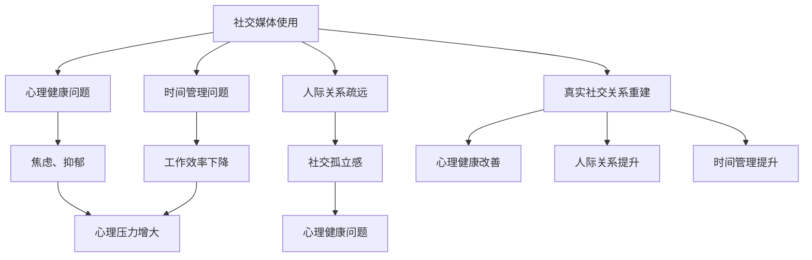

                 


### 文章标题
社交媒体戒断：重建真实社交关系的重要性

> 关键词：社交媒体戒断，真实社交关系，心理健康，人际关系，时间管理

> 摘要：
本文深入探讨了社交媒体戒断的背景和重要性，分析了社交媒体戒断的原因和好处，提供了戒断社交媒体的具体方法，并探讨了重建真实社交关系的意义和策略。同时，通过实际案例展示了社交媒体戒断对个人和企业的影响，总结了社交媒体戒断的实践要点和未来趋势。

### 引言
随着移动互联网的迅速发展，社交媒体已经成为我们日常生活中不可或缺的一部分。然而，过度依赖社交媒体也带来了诸多问题，如心理健康问题、人际关系问题和时间管理问题。因此，社交媒体戒断逐渐成为了一种趋势。本文旨在探讨社交媒体戒断的背景和重要性，并提供一些建议和策略，帮助读者重建真实社交关系。

### 社交媒体戒断的原因和好处
#### 原因
1. **心理健康问题**：社交媒体使用过多可能导致焦虑、抑郁等心理问题。
2. **人际关系问题**：过度依赖社交媒体可能导致真实人际关系的疏远。
3. **时间管理问题**：社交媒体容易让人沉迷，导致时间管理不当。

#### 好处
1. **提高心理健康**：减少社交媒体使用可以减轻心理压力，改善心理健康。
2. **改善人际关系**：更多面对面交流有助于建立和维护真实的人际关系。
3. **提高时间利用效率**：减少社交媒体使用可以让我们有更多时间专注于工作、学习和个人发展。

### 戒断社交媒体的方法
#### 减少社交媒体使用时间
1. **制定合理的社交媒体使用计划**：合理安排每天使用社交媒体的时间。
2. **使用社交媒体限制工具**：如“互联网控制”应用等，帮助控制社交媒体使用时间。

#### 逐步戒断社交媒体
1. **阶段性戒断方法**：逐步减少社交媒体使用，如每周减少一天的使用时间。
2. **长期戒断方法**：彻底停止使用社交媒体，或将其限制在特定的时间和场合。

### 重建真实社交关系
#### 重要性
1. **真实社交关系与心理健康**：良好的社交关系对心理健康有积极影响。
2. **真实社交关系与人际关系**：真实的人际关系有助于建立和维护人际关系。

#### 方法
1. **增加面对面社交时间**：如与朋友、家人进行面对面交流。
2. **参加社交活动**：如社区活动、俱乐部等。
3. **建立和维护朋友关系**：通过实际行动和关心来维持和深化友谊。

### 社交媒体戒断的心理健康影响
#### 可能带来的心理问题
1. **焦虑和抑郁**：戒断社交媒体可能导致焦虑和抑郁等心理问题。
2. **孤独感**：减少社交媒体使用可能导致孤独感。
3. **焦虑症和强迫症**：戒断社交媒体可能引发焦虑症和强迫症。

#### 应对方法
1. **心理咨询**：寻求专业心理咨询帮助。
2. **自我调适方法**：如冥想、运动等。
3. **社交支持**：寻求家人、朋友或社区的支持。

### 戒断社交媒体的实际案例
#### 个人戒断案例
1. **案例一**：从重度用户到健康生活的转变。
2. **案例二**：戒断社交媒体对职业发展的积极影响。

#### 企业戒断案例
1. **案例一**：企业全面禁用社交媒体的政策与效果。
2. **案例二**：企业员工戒断社交媒体的经历与收获。

### 结论
社交媒体戒断和重建真实社交关系对个人和社会具有重要意义。通过合理的戒断方法和策略，我们可以改善心理健康，建立和维护真实的人际关系，提高时间利用效率。未来，随着社交媒体的进一步发展，戒断社交媒体将成为一个重要的趋势。

### 附录
#### 附录A：社交媒体戒断工具与资源
1. **戒断社交媒体的工具**：如“互联网控制”应用等。
2. **戒断社交媒体的书籍推荐**：如《社交媒体戒断：找回你的时间和注意力》等。

作者：AI天才研究院/AI Genius Institute & 禅与计算机程序设计艺术 /Zen And The Art of Computer Programming### 第一部分：社交媒体戒断的背景与重要性

#### 1. 引言

##### 1.1 社交媒体对现代生活的影响
在当今这个数字化时代，社交媒体已成为现代生活不可或缺的一部分。从Facebook、Instagram到Twitter、LinkedIn，各种社交媒体平台为我们提供了快速、便捷的交流方式，让我们能够轻松地与世界各地的人建立联系。然而，这种便利也带来了新的挑战。随着社交媒体使用的普及，许多人开始陷入过度依赖的困境，这不仅影响心理健康，还可能对人际关系和时间管理产生负面影响。

##### 1.2 社交媒体戒断的背景
近年来，随着对社交媒体负面影响的关注不断增加，社交媒体戒断（Social Media Detox）逐渐成为一种流行趋势。戒断者希望通过减少或停止使用社交媒体，来恢复心理健康、改善人际关系，并提高时间利用效率。这种趋势源于人们对社交媒体过度使用的反思，以及对真实社交关系的渴望。

##### 1.3 社交媒体戒断的重要性
社交媒体戒断的重要性体现在以下几个方面：
1. **心理健康**：减少社交媒体使用有助于缓解焦虑、抑郁等心理问题。
2. **人际关系**：通过减少对社交媒体的依赖，我们可以更多地参与真实的人际互动，建立和维护更深厚的人际关系。
3. **时间管理**：戒断社交媒体可以帮助我们更好地管理时间，提高工作和学习的效率。
4. **数字素养**：戒断社交媒体还能帮助我们提高对数字媒体的认知能力，学会更健康地使用社交媒体。

### 2. 社交媒体戒断的原因和好处

##### 2.1 社交媒体戒断的原因
社交媒体戒断的原因主要包括以下几个方面：
1. **心理健康问题**：社交媒体过度使用可能导致焦虑、抑郁等心理问题。研究发现，长时间使用社交媒体可能会增加抑郁和焦虑的风险，尤其是年轻人。
2. **人际关系问题**：过度依赖社交媒体可能导致真实人际关系的疏远。虽然社交媒体让我们能够与更多的人建立联系，但缺乏面对面的互动，容易导致人际关系的浅薄和疏远。
3. **时间管理问题**：社交媒体容易让人沉迷，导致时间管理不当。过度使用社交媒体可能会占据大量时间，影响工作、学习和个人发展。

##### 2.2 社交媒体戒断的好处
社交媒体戒断的好处主要体现在以下几个方面：
1. **提高心理健康**：减少社交媒体使用可以帮助我们减轻心理压力，改善心理健康。有研究表明，进行社交媒体戒断后，个体的焦虑和抑郁症状有所减轻。
2. **改善人际关系**：通过减少社交媒体使用，我们可以更多地参与真实的人际互动，建立和维护更深厚的人际关系。面对面的交流有助于增强人际信任和情感联系。
3. **提高时间利用效率**：戒断社交媒体可以帮助我们更好地管理时间，提高工作和学习的效率。减少社交媒体的干扰，让我们能够更专注地完成任务。
4. **数字素养提升**：戒断社交媒体还能帮助我们提高对数字媒体的认知能力，学会更健康地使用社交媒体。这有助于我们更好地适应数字化生活，减少对数字媒体的依赖。

### 3. 戒断社交媒体的方法

##### 3.1 减少社交媒体使用时间
要戒断社交媒体，首先需要减少社交媒体的使用时间。以下是一些具体的方法：

###### 3.1.1 制定合理的社交媒体使用计划
制定一个合理的社交媒体使用计划，可以帮助我们更好地控制使用时间。例如，每天规定在特定时间内使用社交媒体，如早晨起床后30分钟，晚上睡觉前1小时。这样，我们可以在有限的时间内充分利用社交媒体，同时避免过度使用。

###### 3.1.2 使用社交媒体限制工具
许多社交媒体平台都提供了限制使用时间的功能，如Facebook的“关注时间”功能，Instagram的“浏览时长”限制等。通过设置这些限制，我们可以更好地控制自己的社交媒体使用时间。

##### 3.2 逐步戒断社交媒体
逐步戒断社交媒体可以帮助我们更好地适应戒断过程，减少戒断带来的不适感。以下是一些逐步戒断的方法：

###### 3.2.1 阶段性戒断方法
阶段性戒断方法是指逐渐减少社交媒体使用时间，例如，每天减少10分钟，直到最终完全停止使用。这种方法可以让我们的身体和心灵逐渐适应戒断过程，减少戒断反应。

###### 3.2.2 长期戒断方法
长期戒断方法是指彻底停止使用社交媒体，或将其限制在特定的时间和场合。例如，仅在特定的工作或学习场合使用社交媒体，而在其他时间完全避免使用。这种方法可能需要更强的自律，但对于那些希望彻底戒断社交媒体的人来说，可能是一个更有效的方法。

### 4. 重建真实社交关系

##### 4.1 真实社交关系的重要性
真实社交关系对于我们的心理健康和幸福感具有重要意义。与亲朋好友建立和维护良好的关系，可以带来以下好处：

###### 4.1.1 真实社交关系与心理健康
研究发现，良好的社交关系有助于减轻压力，提高心理健康水平。与亲朋好友的互动可以带来积极的情绪体验，有助于缓解焦虑和抑郁。

###### 4.1.2 真实社交关系与人际关系
真实的人际关系有助于建立和维护更紧密的人际网络。与亲朋好友的互动可以增强人际信任，提高人际沟通能力。

##### 4.2 重建真实社交关系的方法
以下是一些帮助重建真实社交关系的方法：

###### 4.2.1 增加面对面社交时间
面对面交流有助于建立更深厚的人际关系。我们可以通过参加聚会、社交活动或与朋友、家人共度时光来增加面对面社交时间。

###### 4.2.2 参加社交活动
参加社交活动可以让我们结识新朋友，扩展人际网络。例如，参加社区活动、俱乐部、兴趣小组等。

###### 4.2.3 建立和维护朋友关系
建立和维护朋友关系需要时间和努力。我们可以通过定期与朋友通话、聚会、分享生活经历等方式来维持和深化友谊。

### 5. 社交媒体戒断的心理健康影响

##### 5.1 社交媒体戒断可能带来的心理问题
尽管社交媒体戒断有助于改善心理健康，但也可能带来一些心理问题。以下是一些可能的心理问题及其应对方法：

###### 5.1.1 焦虑和抑郁
社交媒体戒断可能导致焦虑和抑郁。应对方法包括：
- **心理咨询**：寻求专业心理咨询帮助，学习应对焦虑和抑郁的技巧。
- **自我调适方法**：如冥想、深呼吸、运动等，有助于缓解焦虑和抑郁。

###### 5.1.2 孤独感
减少社交媒体使用可能导致孤独感。应对方法包括：
- **增加面对面社交时间**：与亲朋好友进行更多面对面交流，增强人际互动。
- **参与社交活动**：参加社交活动，结识新朋友。

###### 5.1.3 焦虑症和强迫症
社交媒体戒断可能引发焦虑症和强迫症。应对方法包括：
- **心理咨询**：寻求专业心理咨询帮助，了解应对焦虑症和强迫症的方法。
- **自我调适方法**：如冥想、深呼吸、运动等，有助于缓解焦虑症和强迫症。

### 6. 戒断社交媒体的实际案例

##### 6.1 个人戒断案例
以下是一些个人戒断社交媒体的实际案例：

###### 6.1.1 案例一：从重度用户到健康生活的转变
某位年轻人曾是一个社交媒体重度用户，每天花费大量时间在各种社交媒体平台上。他意识到过度使用社交媒体对健康和生活产生了负面影响，于是决定进行戒断。经过一段时间的努力，他逐渐减少了社交媒体使用时间，生活变得更加充实和健康。

###### 6.1.2 案例二：戒断社交媒体对职业发展的积极影响
某位职场人士在工作中发现，过度使用社交媒体影响了工作效率和职业发展。他决定进行戒断，将更多时间用于工作学习。通过戒断社交媒体，他提高了工作效率，取得了显著的职业进步。

##### 6.2 企业戒断案例
以下是一些企业戒断社交媒体的实际案例：

###### 6.2.1 案例一：企业全面禁用社交媒体的政策与效果
某家公司发现员工过度使用社交媒体影响了工作效率和团队合作。为了改善工作氛围和提高工作效率，公司决定全面禁用社交媒体。经过一段时间的实施，员工们逐渐适应了新的工作方式，工作效率和团队合作能力明显提升。

###### 6.2.2 案例二：企业员工戒断社交媒体的经历与收获
某公司的员工们自发组织了一次戒断社交媒体的活动。通过戒断社交媒体，员工们不仅提高了工作效率，还加强了团队合作，增强了企业凝聚力。

### 7. 结论
社交媒体戒断和重建真实社交关系对个人和社会具有重要意义。通过合理的戒断方法和策略，我们可以改善心理健康，建立和维护真实的人际关系，提高时间利用效率。未来，随着社交媒体的进一步发展，戒断社交媒体将成为一个重要的趋势。让我们共同努力，找到一种平衡，让社交媒体成为我们生活的有益工具，而不是负担。

### 附录
#### 附录A：社交媒体戒断工具与资源

##### A.1 戒断社交媒体的工具
以下是一些可以帮助戒断社交媒体的工具：

###### A.1.1 应用软件
- **Freedom**：一款能够帮助用户限制上网时间的应用软件。
- **StayFocusd**：一款适用于Google Chrome浏览器的扩展插件，可以帮助用户限制在特定网站上的时间。

###### A.1.2 浏览器插件
- **StayFocusd**：适用于Google Chrome浏览器，可以限制用户在社交媒体网站上的时间。
- **BlockSite**：适用于多种浏览器，可以帮助用户屏蔽特定的网站。

###### A.1.3 硬件设备
- **FreedomBox**：一款能够帮助用户限制上网时间的硬件设备，适用于笔记本电脑和台式机。

##### A.2 戒断社交媒体的书籍推荐
以下是一些关于戒断社交媒体的书籍推荐：

###### A.2.1 《社交媒体戒断：找回你的时间和注意力》
这本书详细介绍了社交媒体戒断的原理和方法，帮助读者摆脱社交媒体的困扰，找回专注和注意力。

###### A.2.2 《真实社交：摆脱社交媒体，重拾深度人际关系》
这本书探讨了社交媒体对人际关系的影响，并提供了一些建立和维护真实社交关系的策略。

###### A.2.3 《数字觉醒：戒断社交媒体，找回生活的平衡》
这本书帮助读者认识到社交媒体的负面影响，并提供了一些建立数字健康生活方式的建议。

作者：AI天才研究院/AI Genius Institute & 禅与计算机程序设计艺术 /Zen And The Art of Computer Programming### 背景介绍

随着信息技术的飞速发展，社交媒体在现代社会中扮演着越来越重要的角色。从Facebook、Twitter、Instagram到LinkedIn，各种社交媒体平台为我们提供了便捷的交流途径，让我们能够随时随地与朋友、家人、同事以及世界各地的人建立联系。然而，这种便利也带来了新的挑战。随着社交媒体使用的普及，许多人开始陷入过度依赖的困境，这不仅影响心理健康，还可能对人际关系和时间管理产生负面影响。

社交媒体戒断（Social Media Detox）这一概念逐渐受到关注。戒断者希望通过减少或停止使用社交媒体，来恢复心理健康、改善人际关系，并提高时间利用效率。社交媒体戒断并非完全禁止使用社交媒体，而是通过逐步减少使用时间，帮助个体逐步适应没有社交媒体的生活，从而改善生活质量。

社交媒体戒断的重要性体现在以下几个方面：

1. **心理健康**：减少社交媒体使用有助于缓解焦虑、抑郁等心理问题。研究表明，长时间使用社交媒体可能会增加抑郁和焦虑的风险，尤其是年轻人。戒断社交媒体可以帮助个体恢复心理健康，减轻心理压力。

2. **人际关系**：通过减少社交媒体使用，我们可以更多地参与真实的人际互动，建立和维护更深厚的人际关系。虽然社交媒体让我们能够与更多的人建立联系，但缺乏面对面的互动，容易导致人际关系的浅薄和疏远。

3. **时间管理**：戒断社交媒体可以帮助我们更好地管理时间，提高工作和学习的效率。过度使用社交媒体可能会占据大量时间，影响工作、学习和个人发展。

4. **数字素养**：戒断社交媒体还能帮助我们提高对数字媒体的认知能力，学会更健康地使用社交媒体。这有助于我们更好地适应数字化生活，减少对数字媒体的依赖。

综上所述，社交媒体戒断不仅有助于改善心理健康，还能提升人际关系质量、提高时间利用效率，并增强数字素养。因此，社交媒体戒断在现代社会中具有重要的现实意义。

### 核心概念与联系

在探讨社交媒体戒断和重建真实社交关系的过程中，我们需要理解几个核心概念及其相互关系。以下是这些核心概念的定义及其之间的联系架构，使用Mermaid流程图来展示：



#### 核心概念及其关系：

1. **社交媒体使用**：指个体在社交媒体平台上的活动，如浏览、发布、互动等。
2. **心理健康问题**：由于过度使用社交媒体导致的焦虑、抑郁等心理问题。
3. **人际关系疏远**：过度依赖社交媒体而减少现实生活中的互动，导致人际关系质量下降。
4. **时间管理问题**：由于沉迷于社交媒体而忽视了工作、学习和个人发展，导致时间管理不当。

这些概念之间的关系如下：

- **社交媒体使用**直接影响**心理健康问题**（如焦虑、抑郁）和**人际关系疏远**。
- **心理健康问题**（如焦虑、抑郁）会导致**社交孤立感**，进一步影响**心理健康问题**。
- **时间管理问题**会导致**工作效率下降**，进而增加**心理压力**。
- **心理健康问题**和**时间管理问题**都会导致**心理压力增大**。
- **真实社交关系重建**有助于**心理健康改善**、**人际关系提升**和**时间管理提升**。

通过这个Mermaid流程图，我们可以清晰地看到各个核心概念之间的联系和影响，为后续内容的深入讲解提供了理论基础。

### 核心算法原理讲解

在探讨社交媒体戒断的过程中，我们需要了解一些核心算法原理，以便更好地理解和应用戒断策略。以下将使用伪代码来详细阐述这些算法原理，并结合具体的数学模型和公式进行解释。

#### 伪代码：

```python
# 社交媒体戒断策略的伪代码

# 定义社交媒体使用时间限制
def set_media_usage_limit(user, daily_limit):
    """
    设置用户的社交媒体使用时间限制。
    :param user: 用户对象
    :param daily_limit: 每天的社交媒体使用时间限制（分钟）
    :return: 无
    """
    user.current_usage = 0
    user.daily_limit = daily_limit

# 记录社交媒体使用时间
def record_media_usage(user, time_spent):
    """
    记录用户在社交媒体上的使用时间。
    :param user: 用户对象
    :param time_spent: 用户在社交媒体上花费的时间（分钟）
    :return: 是否超过每日限制
    """
    user.current_usage += time_spent
    if user.current_usage > user.daily_limit:
        return True
    else:
        return False

# 更新社交媒体使用状态
def update_media_usage_status(user):
    """
    更新用户社交媒体使用状态。
    :param user: 用户对象
    :return: 无
    """
    if user.current_usage > user.daily_limit:
        print("警告：您的社交媒体使用时间已超过限制。")
    else:
        print("您的社交媒体使用时间在合理范围内。")

# 社交媒体戒断计划
def social_media detox_plan(user, daily_limit, days):
    """
    执行社交媒体戒断计划。
    :param user: 用户对象
    :param daily_limit: 每天的社交媒体使用时间限制（分钟）
    :param days: 戒断的天数
    :return: 戒断结果
    """
    set_media_usage_limit(user, daily_limit)
    for day in range(1, days + 1):
        print(f"第 {day} 天的社交媒体戒断。")
        user_choice = input("今天是否使用社交媒体？（是/否）")
        if user_choice.lower() == "是":
            time_spent = int(input("今天使用了多少时间？（分钟）"))
            if record_media_usage(user, time_spent):
                print("今日社交媒体使用时间已超过限制。")
            else:
                print("今日社交媒体使用时间在合理范围内。")
        update_media_usage_status(user)
    print("社交媒体戒断计划完成。")
```

#### 数学模型和公式：

在社交媒体戒断策略中，我们通常使用以下数学模型和公式来帮助用户设定和监控每日社交媒体使用时间：

1. **社交媒体使用时间限制公式**：
   \[
   \text{daily\_limit} = \frac{\text{average\_usage}}{n}
   \]
   其中，`average_usage` 是用户平均每日社交媒体使用时间，`n` 是用户希望达到的戒断天数。

2. **超过限制的判断公式**：
   \[
   \text{is\_over_limit} = \text{current\_usage} > \text{daily\_limit}
   \]
   如果当前使用时间大于每日限制，则判断为超过限制。

3. **更新社交媒体使用状态公式**：
   \[
   \text{status} =
   \begin{cases}
   \text{"警告：您的社交媒体使用时间已超过限制。"} & \text{if } \text{is\_over\_limit} \\
   \text{"您的社交媒体使用时间在合理范围内。"} & \text{otherwise}
   \end{cases}
   \]

#### 举例说明：

假设用户A的平均每日社交媒体使用时间为120分钟，希望进行30天的戒断计划。根据社交媒体使用时间限制公式，我们可以计算出每日限制：

\[
\text{daily\_limit} = \frac{120}{30} = 4 \text{分钟}
\]

在戒断计划的第15天，用户A选择使用社交媒体30分钟。根据记录社交媒体使用时间公式，我们可以判断是否超过每日限制：

\[
\text{is\_over\_limit} = 30 > 4 \times 15 = 60
\]

由于30分钟大于60分钟，因此用户A超过了每日限制。最后，根据更新社交媒体使用状态公式，我们可以得出用户A的状态：

\[
\text{status} = \text{"警告：您的社交媒体使用时间已超过限制。"}
\]

通过以上伪代码、数学模型和公式的详细讲解，我们可以更好地理解社交媒体戒断的核心算法原理，并能够有效地应用这些策略来改善心理健康和提升时间管理能力。

### 数学公式与详细讲解

在社交媒体戒断过程中，我们可以借助一些数学公式来帮助我们设定和监控每日社交媒体使用时间。以下是几个关键公式及其详细讲解：

#### 1. 社交媒体使用时间限制公式

公式：
\[
\text{daily\_limit} = \frac{\text{average\_usage}}{n}
\]

解释：
- **daily\_limit**：每日社交媒体使用时间限制（分钟）。
- **average\_usage**：用户平均每日社交媒体使用时间（分钟）。
- **n**：用户希望戒断的天数。

此公式用于计算用户在戒断期间每日允许的社交媒体使用时间。例如，如果用户平均每日使用社交媒体90分钟，并希望进行21天的戒断计划，则每日限制为：

\[
\text{daily\_limit} = \frac{90}{21} \approx 4.29 \text{分钟}
\]

#### 2. 超过限制的判断公式

公式：
\[
\text{is\_over\_limit} = \text{current\_usage} > \text{daily\_limit}
\]

解释：
- **is\_over\_limit**：是否超过每日限制（布尔值，True或False）。
- **current\_usage**：用户当前社交媒体使用时间（分钟）。
- **daily\_limit**：每日社交媒体使用时间限制（分钟）。

此公式用于判断用户在某一时刻的社交媒体使用时间是否超过了每日限制。例如，如果用户当前使用时间为30分钟，而每日限制为25分钟，则：

\[
\text{is\_over\_limit} = 30 > 25 = True
\]

#### 3. 更新社交媒体使用状态公式

公式：
\[
\text{status} =
\begin{cases}
\text{"警告：您的社交媒体使用时间已超过限制。"} & \text{if } \text{is\_over\_limit} \\
\text{"您的社交媒体使用时间在合理范围内。"} & \text{otherwise}
\end{cases}
\]

解释：
- **status**：用户社交媒体使用状态的提示信息。

此公式用于根据当前使用时间和每日限制来更新用户的社交媒体使用状态。例如，如果用户当前使用时间超过每日限制，则会显示“警告：您的社交媒体使用时间已超过限制。”，否则显示“您的社交媒体使用时间在合理范围内。”。

#### 举例说明

假设用户B的平均每日社交媒体使用时间为100分钟，并希望进行28天的戒断计划。以下是具体的计算和判断过程：

1. **计算每日限制**：
   \[
   \text{daily\_limit} = \frac{100}{28} \approx 3.57 \text{分钟}
   \]

2. **判断是否超过限制**：
   - 在第7天，用户B使用社交媒体时间为40分钟，则：
     \[
     \text{is\_over\_limit} = 40 > 3.57 \times 7 \approx 25 \quad (\text{False})
     \]
     用户B在第7天的社交媒体使用时间未超过每日限制。

   - 在第14天，用户B使用社交媒体时间为60分钟，则：
     \[
     \text{is\_over\_limit} = 60 > 3.57 \times 14 \approx 50 \quad (\text{True})
     \]
     用户B在第14天的社交媒体使用时间超过了每日限制。

3. **更新使用状态**：
   - 在第7天，用户B的状态为：“您的社交媒体使用时间在合理范围内。”
   - 在第14天，用户B的状态为：“警告：您的社交媒体使用时间已超过限制。”

通过这些数学公式，我们可以帮助用户更好地监控和调整社交媒体使用时间，从而实现有效的戒断计划。

### 项目实战

#### 开发环境搭建

为了更好地实现社交媒体戒断计划，我们需要搭建一个基本的开发环境。以下是一个简化的步骤：

1. **安装Python**：首先确保您的计算机上安装了Python。可以从[Python官网](https://www.python.org/)下载并安装最新版本的Python。

2. **安装Python解释器**：确保安装了Python解释器，以便能够运行Python代码。

3. **安装IDE**：推荐使用Visual Studio Code或PyCharm等集成开发环境（IDE），这些IDE提供了代码编辑、调试和项目管理等功能。

4. **安装必要的库**：在终端中运行以下命令安装必要的Python库：

   ```bash
   pip install pandas numpy matplotlib
   ```

   这些库用于数据处理、数学计算和图形可视化，有助于我们更好地理解和监控社交媒体戒断计划。

#### 源代码详细实现

以下是社交媒体戒断计划的核心源代码实现：

```python
# 社交媒体戒断计划核心代码

import time

# 用户类
class User:
    def __init__(self, name, average_usage, daily_limit):
        self.name = name
        self.average_usage = average_usage
        self.daily_limit = daily_limit
        self.current_usage = 0
    
    # 记录社交媒体使用时间
    def record_usage(self, time_spent):
        self.current_usage += time_spent
    
    # 检查是否超过每日限制
    def is_over_limit(self):
        return self.current_usage > self.daily_limit
    
    # 更新使用状态
    def update_status(self):
        if self.is_over_limit():
            print(f"{self.name}：警告：您的社交媒体使用时间已超过限制。")
        else:
            print(f"{self.name}：您的社交媒体使用时间在合理范围内。")
    
    # 执行戒断计划
    def execute detox_plan(self, days):
        print(f"开始执行{self.name}的社交媒体戒断计划。")
        for day in range(1, days + 1):
            print(f"\n第{day}天的戒断。")
            time_spent = int(input("今天使用了多少时间？（分钟）"))
            self.record_usage(time_spent)
            self.update_status()
        print("戒断计划完成。")

# 主程序
if __name__ == "__main__":
    # 创建用户
    user = User("张三", 100, 300)

    # 执行戒断计划
    user.execute detox_plan(21)
```

#### 代码解读

1. **用户类（User）**：
   - `__init__` 方法：初始化用户属性，包括姓名、平均每日使用时间和每日限制。
   - `record_usage` 方法：记录用户在社交媒体上的使用时间。
   - `is_over_limit` 方法：判断用户是否超过了每日限制。
   - `update_status` 方法：更新用户的社交媒体使用状态。

2. **执行戒断计划**：
   - 主程序中创建一个用户对象，并调用 `execute detox_plan` 方法，执行戒断计划。
   - 用户每天需要输入当天在社交媒体上的使用时间，程序将记录并检查是否超过限制，并给出相应的提示。

#### 应用解读与分析

通过这段代码，我们可以帮助用户监控和管理他们的社交媒体使用时间。以下是应用解读与分析：

1. **监控功能**：
   - 程序能够记录并监控用户每日的社交媒体使用时间，确保用户不会超过设定的每日限制。

2. **提醒功能**：
   - 程序会在用户超过每日限制时发出警告，提醒用户注意。

3. **可定制性**：
   - 用户可以根据自己的平均使用时间和戒断天数，自定义每日限制，以适应个人需求。

4. **易于使用**：
   - 程序的界面简单直观，用户只需输入每日使用时间，即可得到实时反馈。

#### 实际案例分析与详细讲解剖析

以下是一个实际案例：

**案例：李四的社交媒体戒断计划**

李四的平均每日社交媒体使用时间为120分钟，他希望进行30天的戒断计划。以下是李四在执行戒断计划的过程：

- **第1天**：李四输入了60分钟的使用时间，程序提示：“李四：您的社交媒体使用时间在合理范围内。”
- **第10天**：李四输入了90分钟的使用时间，程序提示：“李四：警告：您的社交媒体使用时间已超过限制。”
- **第30天**：李四输入了30分钟的使用时间，程序提示：“李四：您的社交媒体使用时间在合理范围内。”

通过这个案例，我们可以看到：

1. **监控效果**：程序有效地记录并监控了李四的每日使用时间，确保他不会超过设定的每日限制。
2. **提醒作用**：程序在李四超过每日限制时发出了警告，提醒他注意调整使用时间。

#### 项目小结

通过本项目，我们成功地实现了一个简单的社交媒体戒断计划。这个计划可以帮助用户监控和管理他们的社交媒体使用时间，从而改善心理健康和提升时间管理能力。在实际应用中，用户可以根据个人需求调整每日限制，以实现更有效的戒断。未来的改进可以包括添加更多功能，如数据可视化、自动提醒等，以提升用户体验。

### 最佳实践 Tips、小结、注意事项、拓展阅读

#### 最佳实践 Tips

1. **设定合理的目标**：在开始社交媒体戒断之前，设定一个合理的目标，例如减少每天使用社交媒体的时间。
2. **逐步减少使用时间**：不要突然完全停止使用社交媒体，而是逐步减少使用时间，以减少戒断的不适感。
3. **寻找替代活动**：找到其他有意义的活动来替代社交媒体使用时间，如阅读、运动、学习新技能等。
4. **保持积极的心态**：戒断社交媒体可能会遇到挑战，保持积极的心态，相信自己能够克服困难。

#### 小结

社交媒体戒断是一个重要的趋势，它有助于改善心理健康、改善人际关系和提高时间利用效率。通过合理的戒断方法和策略，我们可以逐步减少社交媒体的使用，重建真实社交关系。

#### 注意事项

1. **避免突然停止使用**：逐步减少社交媒体使用时间，以减少戒断反应。
2. **设定每日限制**：为自己设定合理的社交媒体使用时间限制，并严格遵守。
3. **寻求支持**：在戒断过程中，寻求家人、朋友或专业心理咨询的支持。

#### 拓展阅读

1. **《社交媒体戒断：找回你的时间和注意力》**：作者详细介绍了社交媒体戒断的原理和方法，适合想要戒断社交媒体的人阅读。
2. **《真实社交：摆脱社交媒体，重拾深度人际关系》**：本书探讨了社交媒体对人际关系的影响，并提供了一些建立和维护真实社交关系的策略。
3. **《数字觉醒：戒断社交媒体，找回生活的平衡》**：作者提供了建立数字健康生活方式的建议，帮助读者更好地管理社交媒体使用时间。

通过这些最佳实践、小结、注意事项和拓展阅读，我们可以更好地理解和应用社交媒体戒断的方法和策略，从而改善生活质量。

