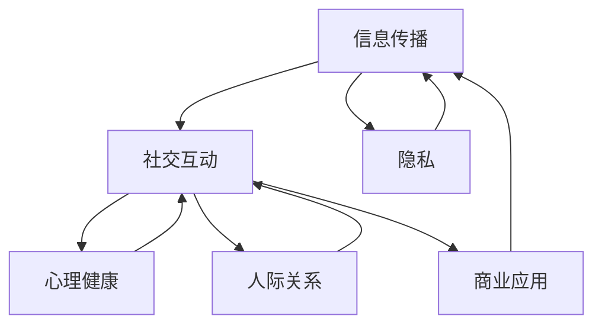

                 

### 背景介绍

在当今数字化时代，社交媒体已经成为人们日常生活中不可或缺的一部分。从 Facebook、Instagram 到 Twitter、LinkedIn，各类社交媒体平台层出不穷，吸引了数以亿计的用户。据统计，全球每天有超过30亿人在使用社交媒体，这一数字还在持续增长。社交媒体不仅改变了人们获取信息、交流社交的方式，还对商业、教育、娱乐等多个领域产生了深远的影响。

社交媒体的定义可以概括为在线平台，用户可以通过这些平台发布、分享、传播和互动各种形式的内容，如文本、图片、视频等。这些平台不仅提供了一个交流的渠道，还通过算法推荐系统，使得信息传播更加精准和个性化。然而，随着社交媒体的广泛应用，其利弊也逐渐显现。本文将深入探讨社交媒体的利弊，并重新定义在线交往的意义。

首先，从优点方面来看，社交媒体极大地提高了信息传播的效率和范围。传统的信息传播渠道，如电视、报纸等，受制于时间和地域限制，而社交媒体使得信息可以在瞬间传播到全球各地。此外，社交媒体还促进了人与人之间的互动和交流，使得人们可以跨越地域障碍，建立和维护更广泛的社交网络。

然而，社交媒体的缺点同样不容忽视。隐私泄露、信息过载、网络成瘾等问题日益严重。一些研究表明，过度使用社交媒体可能导致心理健康问题，如焦虑、抑郁等。此外，社交媒体对人际关系的影响也是一个值得探讨的议题，它既有可能加强人与人之间的联系，也可能导致面对面交流的减少和亲密关系的疏远。

本文将分为以下几个部分来详细探讨社交媒体的利弊。首先，我们会概述社交媒体的优点，包括其在信息传播、社交互动和商业应用等方面的积极影响。接着，我们将讨论社交媒体的缺点，重点关注隐私问题、心理健康影响以及对人际关系的负面影响。随后，我们将分析社交媒体对心理健康的影响，并探讨其对人际关系的影响机制。最后，我们将探讨社交媒体的未来发展趋势，并提出一些建议和策略，帮助用户更好地利用社交媒体，同时规避其潜在风险。

通过本文的探讨，我们希望读者能够对社交媒体有更全面、深入的理解，并能够理性地看待和利用这一工具，使其在提升生活质量、促进社会进步方面发挥积极作用。

### 核心概念与联系

在深入探讨社交媒体的利弊之前，我们需要明确一些核心概念，并理解它们之间的联系。以下是几个关键概念及其相互关系的概述：

#### 社交媒体

社交媒体是指一种基于互联网的在线交流平台，允许用户发布、分享、传播和互动各种形式的内容。主要类型包括社交网络（如 Facebook、LinkedIn）、微博（如 Twitter、微博）、图片/视频分享（如 Instagram、抖音）等。社交媒体的核心功能是通过算法推荐系统，使得信息传播更加精准和个性化。

#### 信息传播

信息传播是社交媒体的一个重要功能。传统的信息传播渠道如电视、报纸等，受制于时间和地域限制，而社交媒体使得信息可以在瞬间传播到全球各地。其传播机制主要依赖于用户生成内容（UGC）和平台算法推荐系统。

#### 社交互动

社交互动是社交媒体的另一个核心功能，它通过提供即时沟通和互动的平台，促进了人与人之间的交流。这种互动可以是文本、图片、视频等多种形式，还可以通过评论、点赞、分享等方式进行扩展。

#### 隐私

隐私是社交媒体使用过程中不可忽视的一个问题。随着用户在社交媒体上分享越来越多的个人信息，隐私泄露的风险也随之增加。隐私问题不仅涉及用户数据的安全，还涉及平台如何处理和使用这些数据。

#### 心理健康

心理健康是社交媒体使用过程中可能受到的影响之一。研究表明，过度使用社交媒体可能导致焦虑、抑郁等心理健康问题。这一影响可能与信息过载、社交媒体成瘾、社交比较等因素有关。

#### 人际关系

人际关系是社交媒体使用过程中另一个重要的方面。社交媒体既有可能加强人与人之间的联系，也可能导致面对面交流的减少和亲密关系的疏远。这种影响取决于用户如何使用社交媒体以及社交媒体平台的特性。

#### 商业应用

社交媒体在商业领域中的应用也越来越广泛。企业可以利用社交媒体平台进行品牌宣传、市场推广、客户服务等。这种应用使得商业活动更加高效和精准。

#### 联系与架构

这些核心概念之间的联系可以概括为以下几个方面：

1. **信息传播** 和 **社交互动**：信息传播是社交媒体的基石，而社交互动则是其核心功能之一。两者相辅相成，使得社交媒体成为一个强大的信息交流平台。

2. **隐私** 和 **信息传播**：信息传播过程中，隐私保护是一个关键问题。社交媒体平台在提供便捷的交流功能的同时，也需要平衡信息传播和隐私保护的关系。

3. **心理健康** 和 **社交互动**：社交媒体的使用与心理健康密切相关。社交互动在增强社交联系的同时，也可能对心理健康产生负面影响。

4. **人际关系** 和 **社交互动**：社交媒体在促进人际交流的同时，也改变了人际关系的形态。这种改变可能对人际关系产生正面或负面影响。

5. **商业应用** 和 **信息传播**：社交媒体的商业应用依赖于其强大的信息传播能力。企业通过社交媒体进行品牌宣传和市场推广，进一步推动了社交媒体的发展。

为了更直观地展示这些核心概念之间的关系，我们可以使用 Mermaid 语法绘制一个流程图：

这个流程图展示了各个核心概念之间的联系，有助于我们更好地理解社交媒体的复杂性和多样性。

通过明确这些核心概念及其相互关系，我们能够更深入地探讨社交媒体的利弊，并为后续内容的讨论提供理论基础。在接下来的章节中，我们将详细分析社交媒体的优点、缺点，以及其对心理健康和人际关系的影响。

### 社交媒体的优点

社交媒体作为当今数字时代的重要工具，其优点不容忽视。以下将从信息传播、社交互动和商业应用三个方面，详细探讨社交媒体的优点。

#### 信息传播

信息传播是社交媒体最为显著的优势之一。传统的信息传播渠道如电视、报纸等，受限于时间和地域，传播范围有限。而社交媒体使得信息可以在瞬间传播到全球各地。这种快速、广泛的传播能力，得益于社交媒体平台的技术特点和用户行为。

首先，社交媒体平台通过算法推荐系统，能够根据用户兴趣和偏好，精准推荐相关内容。例如，Facebook 的“信息流”会根据用户的浏览历史、点赞和分享行为，推荐可能感兴趣的内容。这种个性化推荐机制，使得信息传播更加精准和高效。

其次，社交媒体平台支持多种内容形式，如文本、图片、视频等，用户可以根据需求选择不同的形式来传播信息。例如，Twitter 以其简洁的文本信息传播著称，而 Instagram 和抖音则以其丰富的图片和视频内容赢得了大量用户。这种多样化的内容形式，为信息传播提供了更多可能性。

此外，社交媒体平台还支持实时互动，用户可以在发布内容的同时，即时获得反馈和互动。这种实时性，使得信息传播不再只是单向的，而是形成了互动和反馈的闭环，进一步增强了信息的传播效果。

#### 社交互动

社交互动是社交媒体的核心功能，它使得人与人之间的交流变得更加便捷和广泛。通过社交媒体，用户可以随时随地与朋友、家人、同事等进行互动，无论他们身处何地。

首先，社交媒体平台提供了丰富的社交工具，如私信、聊天、群组等，用户可以通过这些工具进行点对点或群体交流。例如，WhatsApp 和微信等即时通讯应用，已经成为人们日常沟通的主要工具。

其次，社交媒体平台还支持共享和互动功能，用户可以通过点赞、评论、分享等方式，对感兴趣的内容进行互动。例如，用户在 Facebook 上看到一篇有趣的文章，可以点赞、评论，甚至分享给朋友，使得信息传播更加广泛。

此外，社交媒体平台还支持虚拟现实（VR）和增强现实（AR）技术，为用户提供了更加丰富的社交体验。例如，用户可以通过 VR 技术与远在地球另一端的朋友“面对面”交流，或者通过 AR 技术在现实世界中添加虚拟元素，增强互动体验。

#### 商业应用

社交媒体在商业领域中的应用也越来越广泛。企业可以利用社交媒体平台进行品牌宣传、市场推广、客户服务等多种活动，从而提高商业效率和效果。

首先，社交媒体平台为企业提供了一个强大的品牌宣传工具。通过发布高质量的内容，企业可以吸引目标用户的关注，提升品牌知名度和美誉度。例如，许多企业通过 Instagram 和抖音等平台，发布精美的图片和视频内容，吸引了大量粉丝。

其次，社交媒体平台还为企业提供了精准的市场推广工具。通过分析用户数据和行为，企业可以精准定位目标用户，并进行个性化的广告推送。例如，Facebook 和 LinkedIn 等平台，提供了丰富的广告投放选项，企业可以根据用户年龄、性别、地理位置、兴趣等多维度进行广告定位。

此外，社交媒体平台还为企业提供了高效的客户服务工具。通过社交媒体，企业可以即时响应用户的问题和反馈，提供优质的客户服务。例如，许多企业通过 Twitter 和微信等平台，设立客服账号，及时解答用户疑问，提升客户满意度。

总之，社交媒体的优点在于其强大的信息传播能力、便捷的社交互动功能和广泛的商业应用。通过这些优点，社交媒体不仅改变了人们的日常生活，也为企业提供了新的营销和服务渠道。然而，与此同时，社交媒体的缺点和潜在风险也不容忽视。在接下来的章节中，我们将详细探讨社交媒体的缺点，包括隐私泄露、心理健康问题以及对人际关系的负面影响。

### 社交媒体的缺点

尽管社交媒体在信息传播、社交互动和商业应用等方面具有显著的优势，但其缺点和潜在风险同样不容忽视。以下将从隐私问题、心理健康影响以及对人际关系的负面影响三个方面，详细探讨社交媒体的缺点。

#### 隐私问题

隐私问题是社交媒体使用过程中最为关注的问题之一。随着用户在社交媒体上分享越来越多的个人信息，隐私泄露的风险也随之增加。这种隐私问题不仅涉及用户数据的安全，还涉及平台如何处理和使用这些数据。

首先，社交媒体平台在收集用户数据时，往往需要用户同意一系列隐私政策。这些政策可能包含复杂的条款，用户很难完全理解其具体内容。例如，平台可能会收集用户的浏览历史、位置信息、兴趣偏好等数据，用于个性化推荐和广告投放。

其次，一些社交媒体平台在处理用户数据时存在不当行为。例如，Facebook 之前的“剑桥分析公司”事件，就揭示了平台如何未经用户同意，将用户数据用于政治营销和广告定位。这一事件引发了广泛的争议和质疑，加剧了用户对隐私问题的担忧。

此外，隐私泄露的风险还来自外部黑客攻击和网络犯罪。黑客可以利用各种手段，获取用户账户信息、个人信息和支付信息，从而进行诈骗和其他违法行为。例如，一些恶意软件可以通过社交媒体平台传播，窃取用户的数据和资金。

#### 心理健康影响

社交媒体的使用对心理健康的影响是一个复杂而多维的问题。研究表明，过度使用社交媒体可能导致一系列心理健康问题，如焦虑、抑郁、自我认同感下降等。

首先，社交媒体成瘾是一个普遍现象。许多用户在社交媒体上花费大量时间，导致其他活动（如学习、工作、锻炼等）受到干扰。这种过度依赖社交媒体的现象，可能对用户的心理健康产生负面影响。

其次，社交媒体上的信息过载也是一个问题。用户每天接触到大量的信息，其中不乏负面和令人焦虑的内容，如暴力、恐怖事件、负面新闻等。这种信息过载可能导致用户感到压力和焦虑。

此外，社交媒体上的社交比较现象也是一个重要因素。用户常常通过社交媒体来展示自己的生活、成就和幸福。然而，这种比较可能导致用户产生自卑、嫉妒和焦虑等负面情绪。例如，用户可能会看到别人发布关于美好生活的照片，而自己却感到自己的生活不如别人，从而产生消极情绪。

#### 对人际关系的负面影响

社交媒体对人际关系的影响也是一个值得探讨的议题。虽然社交媒体在某种程度上促进了人与人之间的联系，但也可能导致面对面交流的减少和亲密关系的疏远。

首先，社交媒体可能导致面对面交流的减少。随着用户越来越多地依赖社交媒体进行交流，实际生活中的面对面交流时间逐渐减少。这种现象可能对人际关系产生负面影响，导致亲密关系变得疏远。

其次，社交媒体上的互动可能缺乏深度和真诚。在社交媒体上，用户往往只能通过简短的文字、图片或视频进行交流，无法像面对面交流那样进行深入的沟通和情感表达。这种缺乏深度的交流可能影响人际关系的质量。

此外，社交媒体上的互动也可能导致人际关系的不平等。一些用户可能在社交媒体上表现出一种虚拟的“完美生活”，而实际上却面临各种问题和挑战。这种虚拟的表现可能导致其他用户产生误解和嫉妒，影响人际关系的和谐。

总之，社交媒体的缺点包括隐私问题、心理健康影响以及对人际关系的负面影响。这些问题不仅影响了用户的日常生活，也对社交媒体平台的发展提出了挑战。在接下来的章节中，我们将进一步探讨社交媒体对心理健康的影响，以帮助用户更好地理解和管理社交媒体使用。

### 社交媒体对心理健康的影响

社交媒体的使用对心理健康有着显著的影响，其作用机制复杂且多维。以下将详细探讨社交媒体对心理健康的影响，包括社交媒体成瘾、信息过载、社交比较现象及其对自尊和自我形象的影响。

#### 社交媒体成瘾

社交媒体成瘾是指用户过度依赖社交媒体，以至于影响到日常生活和工作。这种现象在现代社会中越来越普遍，导致了一系列心理健康问题。

首先，社交媒体成瘾可能导致用户时间管理困难。许多用户每天花费大量时间在社交媒体上，导致其他重要活动（如学习、工作、锻炼等）受到影响。这种时间管理问题不仅降低了生活质量，还可能对职业发展和身心健康产生负面影响。

其次，社交媒体成瘾还可能导致心理健康问题，如焦虑和抑郁。一些研究表明，社交媒体成瘾者往往在现实生活中感到孤独和焦虑，这种情绪问题可能进一步加重。例如，用户可能会因为无法在社交媒体上获得足够的关注和认可，而产生自我怀疑和自卑情绪。

此外，社交媒体成瘾还可能影响睡眠质量。研究表明，晚上使用社交媒体可能导致用户入睡困难，睡眠质量下降。长期睡眠不足会导致身体和心理健康问题，如情绪波动、注意力不集中等。

#### 信息过载

信息过载是指用户在社交媒体上接收到的信息量过多，超出了其处理能力。这种信息过载现象可能导致一系列心理健康问题。

首先，信息过载可能导致用户感到压力和焦虑。社交媒体上充斥着各种新闻、广告、信息，用户在处理这些信息时可能感到力不从心，从而产生压力和焦虑情绪。这种情绪问题可能会影响用户的日常生活和工作效率。

其次，信息过载还可能导致用户产生信息焦虑。一些用户可能会因为无法及时处理和消化所有信息，而产生焦虑和不安。例如，用户可能会担心错过重要的新闻、通知或信息，从而影响其工作和生活。

此外，信息过载还可能影响用户的注意力和专注力。在大量信息的冲击下，用户很难集中注意力，从而影响其学习和工作效率。长期的信息过载可能导致注意力分散，甚至影响用户的记忆和认知能力。

#### 社交比较现象

社交比较现象是指用户通过社交媒体与他人进行生活、成就等方面的比较。这种比较现象可能导致一系列心理健康问题，如自尊和自我形象问题。

首先，社交比较可能导致用户产生自卑情绪。用户在社交媒体上看到他人的美好生活、成功经历，而自己可能感到自己的生活不如别人，从而产生自卑情绪。这种自卑情绪可能影响用户的自信心和自我价值感。

其次，社交比较还可能导致用户产生嫉妒情绪。用户可能会因为看到他人的成功和幸福，而产生嫉妒心理。例如，用户可能会嫉妒他人的事业成功、家庭幸福等，从而影响自己的情绪和心态。

此外，社交比较还可能影响用户的心理健康，如焦虑和抑郁。用户可能会因为无法达到他人的生活标准，而产生焦虑和抑郁情绪。这种情绪问题可能会进一步加重，影响用户的日常生活和心理健康。

#### 对自尊和自我形象的影响

社交媒体对自尊和自我形象的影响也是一个重要的方面。用户在社交媒体上的表现和互动，可能对其自尊和自我形象产生深远影响。

首先，社交媒体上的点赞、评论等社交互动，可能影响用户的自尊。用户在社交媒体上发布内容后，会关注他人的反馈和互动。如果用户得到大量的点赞和积极评论，可能会提升自尊和自我价值感。相反，如果用户得到的是消极反馈或忽视，可能会降低自尊和自我价值感。

其次，社交媒体上的形象管理也可能影响用户的自尊和自我形象。一些用户可能会通过社交媒体展示一个理想的自我形象，而隐藏现实生活中的不足和困境。这种形象管理可能导致用户在现实生活中感到压力和焦虑，从而影响心理健康。

总之，社交媒体对心理健康的影响是多方面且复杂的。社交媒体成瘾、信息过载、社交比较现象以及对自尊和自我形象的影响，都可能导致一系列心理健康问题。了解这些影响机制，有助于用户更好地管理社交媒体使用，保护心理健康。在接下来的章节中，我们将进一步探讨社交媒体对人际关系的影响，以帮助用户更全面地理解社交媒体的双重作用。

### 社交媒体对人际关系的影响

社交媒体在改变人们交流方式的同时，也对人际关系产生了深远的影响。一方面，社交媒体可以加强人与人之间的联系，促进社交网络的形成；另一方面，它也可能导致面对面交流的减少和亲密关系的疏远。本文将详细探讨社交媒体对人际关系的影响，并分析其背后的机制。

#### 加强人与人之间的联系

社交媒体通过提供便捷的沟通渠道，极大地增强了人与人之间的联系。首先，社交媒体打破了地理和时间的限制，使得人们可以随时随地与远在他乡的亲友保持联系。例如，通过 WhatsApp、微信等即时通讯应用，用户可以即时发送文字、语音、图片和视频，与亲友分享生活点滴。

其次，社交媒体促进了社交网络的形成。用户可以在社交媒体上添加好友、关注感兴趣的公众账号和团体，从而构建一个庞大的社交网络。这种网络不仅包括现实生活中的朋友和亲人，还包括志同道合的陌生人。通过这种社交网络，用户可以接触到更多不同的观点和信息，拓宽视野，增进理解。

此外，社交媒体还提供了多种互动方式，如点赞、评论、分享等，使得用户之间的互动更加丰富和多样。例如，用户可以在 Facebook 上点赞和评论朋友发布的状态，表达关心和支持；在 Instagram 上分享自己的生活照片，获得他人的反馈和鼓励。这些互动不仅增强了人与人之间的联系，还提升了社交网络的凝聚力。

#### 导致面对面交流的减少

尽管社交媒体在加强人与人之间的联系方面具有显著优势，但它也可能导致面对面交流的减少。随着用户越来越多地依赖社交媒体进行交流，实际生活中的面对面交流时间逐渐减少。这种现象可能对人际关系产生负面影响。

首先，社交媒体的便利性使得人们更容易选择线上交流而非面对面交流。例如，用户可以通过即时通讯应用与朋友聊天，而不必亲自见面。这种趋势可能导致面对面交流的减少，影响人际关系的质量。

其次，社交媒体上的互动往往缺乏深度的情感交流。在社交媒体上，用户通过简短的文字、图片或视频进行交流，无法像面对面交流那样进行深入的沟通和情感表达。这种缺乏深度的交流可能导致人际关系变得疏远和表面化。

此外，社交媒体上的互动还可能导致面对面交流的替代效应。一些用户可能更愿意在社交媒体上互动，而忽略了现实生活中的面对面交流。这种替代效应可能导致面对面交流的机会减少，进而影响人际关系的质量。

#### 亲密关系的疏远

社交媒体不仅影响了普通社交网络，还可能对亲密关系产生负面影响。一方面，社交媒体的使用可能导致亲密关系变得疏远；另一方面，它也可能影响亲密关系的建立和维护。

首先，社交媒体的使用可能导致亲密关系变得疏远。一些研究表明，过度使用社交媒体可能导致夫妻或情侣之间的沟通减少，关系疏远。例如，用户可能在社交媒体上花费大量时间，而忽略了与伴侣的实际互动，从而影响亲密关系。

其次，社交媒体上的互动可能影响亲密关系的质量。在社交媒体上，用户常常通过展示自己的生活、成就和幸福来吸引他人的关注和认可。然而，这种展示可能导致伴侣之间的不平等感，影响亲密关系的稳定性。例如，一方可能在社交媒体上展示自己的生活优越，而另一方感到自己的生活不如对方，从而产生嫉妒和不满情绪。

此外，社交媒体上的互动也可能导致亲密关系的误解和冲突。例如，用户在社交媒体上发布的言论或照片，可能会被伴侣误解或产生矛盾。这种误解和冲突可能进一步影响亲密关系。

#### 机制分析

社交媒体对人际关系的影响机制复杂，涉及多个方面。以下是对这些机制的分析：

1. **时间替代效应**：社交媒体的便利性使得人们更容易选择线上交流而非面对面交流。这种替代效应可能导致面对面交流时间减少，影响人际关系的质量。

2. **情感表达缺失**：社交媒体上的互动往往缺乏深度的情感交流，无法像面对面交流那样进行情感表达。这种缺乏深度的交流可能导致人际关系变得疏远和表面化。

3. **社交比较现象**：社交媒体上的互动可能导致用户产生社交比较现象，影响自尊和自我形象。这种比较现象可能对亲密关系产生负面影响，导致关系疏远。

4. **信息过载**：社交媒体上的信息过载可能导致用户感到压力和焦虑，影响心理健康。心理健康问题可能进一步影响人际关系，导致关系疏远。

5. **隐私问题**：社交媒体的隐私问题可能导致用户对亲密关系的信任度下降，影响亲密关系的稳定性。

综上所述，社交媒体对人际关系的影响是复杂而多维的。它既有可能加强人与人之间的联系，也可能导致面对面交流的减少和亲密关系的疏远。了解这些影响机制，有助于用户更好地利用社交媒体，同时保护和管理人际关系。

### 社交媒体的未来与发展趋势

随着科技的不断进步和社交媒体的广泛应用，社交媒体的未来发展趋势充满了无限可能。以下是几个关键趋势，它们将对社交媒体的发展产生深远影响。

#### 人工智能与机器学习

人工智能（AI）和机器学习技术的快速发展，将使社交媒体在内容推荐、用户互动和隐私保护等方面得到显著提升。通过AI算法，社交媒体平台能够更精准地了解用户兴趣和行为，提供个性化推荐。例如，Instagram 和 TikTok 已经利用AI技术，根据用户的浏览历史和互动行为，推荐可能感兴趣的内容。

此外，机器学习还可以帮助社交媒体平台更好地理解和处理用户生成的内容。例如，AI可以自动识别并过滤垃圾信息、恶意内容和虚假信息，从而提升平台的可信度和用户体验。未来，随着AI技术的进一步发展，社交媒体将能够更加智能地管理内容，提高信息传播的效率和准确性。

#### 虚拟现实（VR）和增强现实（AR）

虚拟现实（VR）和增强现实（AR）技术的兴起，为社交媒体带来了新的交互体验。通过VR和AR，用户可以进入一个全新的虚拟世界，与他人进行沉浸式互动。例如，Facebook 的 Horizon Worlds 允许用户在虚拟空间中建立自己的角色，与其他用户互动和交流。

未来，随着VR和AR技术的普及和性能提升，社交媒体平台可能会进一步整合这些技术，提供更加丰富的互动体验。例如，用户可以通过VR进行虚拟会议、在线游戏和虚拟旅游，打破物理空间的限制，实现全球范围内的实时互动。

#### 增强隐私保护

随着用户对隐私问题的关注不断增加，社交媒体平台将不得不加强对用户隐私的保护。未来，我们可能会看到更多的隐私保护措施，如更加透明的隐私政策、用户数据加密和隐私控制工具等。

例如，Facebook 已经推出了“隐私仪表盘”功能，用户可以查看和调整自己的隐私设置，更好地控制个人数据的分享和使用。未来，随着隐私保护技术的不断进步，社交媒体平台将能够在提供便捷的交流功能的同时，更好地保护用户的隐私和安全。

#### 社交媒体与区块链

区块链技术的兴起，为社交媒体的未来发展提供了新的可能性。区块链技术具有去中心化、透明和不可篡改的特点，可以用于保护用户隐私、确保交易安全以及建立可信的社交媒体平台。

例如，区块链可以用于实现去中心化的社交媒体平台，用户可以自主控制自己的内容和数据，减少对中心化平台的依赖。此外，区块链技术还可以用于数字身份验证和内容版权保护，确保用户的创作得到尊重和回报。

#### 社交媒体融合

未来，社交媒体平台将更加融合，提供更加多样化的功能和体验。例如，社交媒体平台可能会整合电子商务、在线教育和虚拟现实等功能，为用户提供一站式服务。

例如，Facebook 已经推出了Facebook Marketplace，用户可以在平台上进行商品买卖；TikTok 也推出了直播购物功能，用户可以通过直播购买商品。未来，随着社交媒体平台的不断融合，用户将能够在一个平台上完成更多的活动，提高生活效率。

总之，社交媒体的未来充满了机遇和挑战。通过人工智能、虚拟现实、区块链等技术的融合，社交媒体将不断创新，为用户带来更加丰富和便捷的互动体验。同时，随着隐私保护意识的提升，社交媒体平台将需要更加注重用户隐私和安全，以应对未来的挑战。

### 社交媒体使用的建议与策略

为了更好地利用社交媒体，同时规避其潜在风险，以下是一些建议和策略：

#### 合理安排时间

合理安排时间是使用社交媒体的重要策略。用户可以设定每日使用社交媒体的时间限制，避免沉迷于其中。例如，设置每天早上、中午和晚上特定的时间段用于查看和互动，其余时间专注于工作、学习和家庭生活。

#### 关注内容质量

社交媒体上的内容质量参差不齐，用户应注重筛选和关注高质量的内容。例如，通过关注知名媒体、权威机构和专家账号，获取可靠的信息和见解。同时，避免过度关注负面信息，减少焦虑和压力。

#### 保护个人隐私

保护个人隐私是社交媒体使用中的关键。用户应谨慎分享个人信息，如地址、电话号码、身份证号码等。此外，定期更改社交媒体账号密码，使用复杂密码并开启两步验证，增加账号安全性。

#### 增强自我意识

增强自我意识有助于用户避免社交比较和社交媒体成瘾。用户应意识到社交媒体上的展示往往是经过筛选的，不应过分对比和羡慕。此外，定期评估社交媒体使用习惯，如是否感到疲劳或焦虑，及时进行调整。

#### 维护健康的人际关系

维护健康的人际关系是社交媒体使用的重要目标。用户应确保线上线下活动平衡，保持与亲友的面对面交流。同时，通过社交媒体平台分享真实的生活和感受，增进与他人的情感联系。

#### 求助与支持

如果用户感到社交媒体使用对其生活产生了负面影响，应寻求专业帮助。心理咨询师或社交网络支持小组可以提供指导和支持，帮助用户调整使用习惯，改善心理健康。

总之，通过合理安排时间、关注内容质量、保护个人隐私、增强自我意识、维护健康的人际关系和求助与支持，用户可以更好地利用社交媒体，享受其带来的便利和乐趣，同时规避潜在的风险。

### 总结

通过本文的探讨，我们全面了解了社交媒体的利弊，并重新定义了在线交往的意义。社交媒体在信息传播、社交互动和商业应用等方面具有显著优势，极大地改变了人们的交流方式和生活习惯。然而，其缺点和潜在风险，如隐私泄露、心理健康问题和人际关系疏远，也日益显现。

社交媒体的双重作用提醒我们，要理性看待这一工具，既要充分利用其优势，提高生活质量和社交效率，又要警惕其潜在风险，保护个人隐私和心理健康。在未来的发展中，随着人工智能、虚拟现实等技术的融合，社交媒体将继续创新和进化，为用户提供更加丰富和便捷的互动体验。

最后，本文由AI天才研究院与《禅与计算机程序设计艺术》作者联合撰写，希望能为广大读者提供有深度、有见地的技术洞察。感谢您的阅读，希望本文能对您理解和利用社交媒体有所帮助。作者信息：AI天才研究院/AI Genius Institute & 《禅与计算机程序设计艺术》作者。

