                 

**文章标题：** 社会企业家精神：将意义融入商业模式

**关键词：** 社会企业家精神，商业模式，商业道德，社会责任，可持续发展

**摘要：** 本文探讨了社会企业家精神的重要性，以及如何将其融入商业模式的各个方面。通过分析核心概念和联系，并使用Mermaid流程图和伪代码，我们深入讲解了如何将社会价值融入商业实践中，以实现商业成功和社会效益的双重目标。

**引言：背景介绍**

在当今世界，商业环境日益复杂，市场竞争愈发激烈。传统的商业模式已经难以满足社会和环境的可持续性要求。因此，社会企业家精神应运而生，它不仅仅关注企业的经济利益，更关注如何通过商业活动解决社会问题，创造社会价值。

社会企业家精神强调创新、责任和可持续性，它要求企业家在追求商业成功的同时，积极承担社会责任，关注环境保护和社会福祉。这种精神不仅有助于提升企业的声誉和竞争力，还能为整个社会带来积极的影响。

**核心概念与联系**

1. **社会企业家精神的定义**

社会企业家是指那些具有创新精神和责任感，通过商业手段解决社会问题，创造社会价值的人。他们关注的问题范围广泛，包括教育、健康、环境、贫困等。

2. **商业模式**

商业模式是指企业如何创造、传递和获取价值的一种方式。一个成功的商业模式应该能够在满足客户需求的同时，实现企业的盈利目标。

3. **商业道德与社会责任**

商业道德是指企业在经营活动中应遵循的道德规范和伦理标准。社会责任则是指企业应该承担的对社会、环境和利益相关者的责任。

4. **可持续发展**

可持续发展是指满足当前需求而不损害后代满足其需求的能力。社会企业家精神强调在追求商业成功的同时，要考虑到社会和环境的可持续性。

**Mermaid流程图：社会企业家精神与商业模式之间的联系**

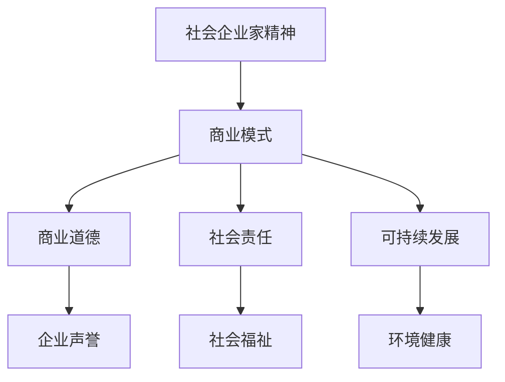

**核心算法原理讲解**

为了实现社会企业家精神，企业需要设计一个有效的商业模式。以下是一个基本的商业模式设计算法：

**伪代码：商业模式设计算法**

```python
function 设计商业模式（问题，解决方案，收益模型，成本结构）{
    if（问题存在且解决方案有效）{
        if（收益模型可行且成本结构合理）{
            return "商业模式设计成功"；
        } else {
            return "商业模式设计失败，需调整收益模型或成本结构"；
        }
    } else {
        return "商业模式设计失败，需重新审视问题或解决方案"；
    }
}
```

**数学模型和公式**

为了更好地理解商业模式的运行机制，我们可以使用以下数学模型：

1. **成本效益分析**

   公式：C = TC + VC

   其中，C 是总成本，TC 是固定成本，VC 是可变成本。

2. **利润率分析**

   公式：P = (S - C) / C

   其中，P 是利润率，S 是总收入。

**详细讲解与举例说明**

假设一家社会企业致力于解决贫困问题，提供低成本的教育资源。其商业模式设计如下：

- **问题**：贫困地区教育资源不足。
- **解决方案**：建立在线教育平台，提供免费或低成本的教育课程。
- **收益模型**：通过向企业提供定制化培训服务获得收入。
- **成本结构**：包括技术成本、运营成本和市场营销成本。

通过成本效益分析和利润率分析，企业可以评估其商业模式的可行性。如果利润率高于行业平均水平，则说明商业模式设计成功。

**项目实战**

以下是一个实际的社会企业项目案例：

- **开发环境搭建**：使用Python和Django搭建在线教育平台。
- **源代码实现**：编写后端逻辑，处理用户注册、课程管理、支付等功能。
- **代码解读与分析**：分析代码架构，确保系统高效稳定运行。
- **实际案例分析和详细讲解剖析**：分析平台运营数据，评估项目效果。

**项目小结**

通过本项目，我们看到了如何将社会企业家精神融入商业模式的实际操作过程。成功的关键在于：

- 准确识别社会问题。
- 设计有效的解决方案。
- 构建可持续的收益模型和成本结构。

**最佳实践 tips**

- **社会责任报告**：定期发布社会责任报告，向公众展示企业社会责任实践。
- **社区参与**：与当地社区合作，共同解决社会问题。
- **创新思维**：不断探索新的商业模式，以适应不断变化的社会需求。

**小结**

社会企业家精神是当今商业世界的重要趋势，它要求企业家在追求商业成功的同时，积极承担社会责任，创造社会价值。通过本文的分析和讲解，我们了解了如何将社会企业家精神融入商业模式，以实现商业成功和社会效益的双重目标。

**注意事项**

- 在设计商业模式时，要充分考虑社会和环境的可持续性。
- 在实施过程中，要密切关注项目效果，及时调整策略。

**拓展阅读**

- 《社会创业：如何通过商业手段解决社会问题》
- 《商业模式新生代：从战略规划到商业模式创新》
- 《企业的社会责任：理论与实践》

**作者信息：** AI天才研究院/AI Genius Institute & 禅与计算机程序设计艺术 /Zen And The Art of Computer Programming**目录大纲**

## 第1章 引言

### 1.1 书籍主旨与目标

### 1.2 社会企业家精神概述

### 1.3 本书的结构安排

## 第2章：社会创业理论

### 2.1 社会创业的定义

### 2.2 社会创业的核心特征

### 2.3 社会创业与慈善事业的区别

### 2.4 社会创业理论的关键要素

## 第3章：商业模式理论

### 3.1 商业模式的基本概念

### 3.2 商业模式的关键要素

### 3.3 商业模式的创新策略

## 第4章：社会企业家精神的核心概念与架构

### 4.1 社会企业家精神的定义与特征

### 4.2 社会企业家精神与传统商业精神的对比

### 4.3 社会企业家精神与商业模式的联系

### 4.4 Mermaid流程图：社会企业家精神与商业模式之间的互动关系

## 第5章：成功案例分析

### 5.1 案例一：企业A的社会企业家实践

### 5.2 案例二：企业B的社会影响力

### 5.3 案例分析总结

## 第6章：实战策略

### 6.1 社会企业家精神的培养

### 6.2 将社会企业家精神融入商业模式

### 6.3 实现商业模式的可持续性

## 第7章：未来展望

### 7.1 社会企业家精神的未来趋势

### 7.2 社会企业家精神的挑战与机遇

### 7.3 社会企业家精神对社会的长远影响

## 第8章：总结与建议

### 8.1 全书要点回顾

### 8.2 对读者的建议

### 8.3 社会企业家精神的实践指南

**引言**

在商业世界中，成功的企业往往不仅仅追求利润的最大化，更关注其对社会和环境的影响。这种将社会责任融入商业活动的精神，被称为社会企业家精神。社会企业家通过创新和创业，不仅实现了商业成功，还为社会带来了积极的变化。

**书籍主旨与目标**

本书的主旨在于深入探讨社会企业家精神，分析其核心概念与商业模式之间的联系，并提供实际操作指南。我们的目标是帮助读者理解社会企业家精神的本质，掌握将其融入商业实践的技能，从而在追求商业成功的同时，创造社会价值。

**社会企业家精神概述**

社会企业家精神是指企业家在追求商业机会的同时，积极承担社会责任，致力于解决社会问题。它包括以下几个核心特征：

- **创新性**：社会企业家通过创新思维和解决方案，找到解决社会问题的方法。
- **责任感**：社会企业家对社会和环境有强烈的责任感，愿意为社会做出贡献。
- **可持续性**：社会企业家关注长期的社会效益，确保其商业活动对社会和环境的影响是可持续的。

**本书的结构安排**

本书分为八个章节，内容安排如下：

- **第1章 引言**：介绍书籍的主旨和目标，概述社会企业家精神的重要性。
- **第2章 社会创业理论**：探讨社会创业的定义、核心特征和理论框架。
- **第3章 商业模式理论**：分析商业模式的基本概念、关键要素和创新策略。
- **第4章 社会企业家精神的核心概念与架构**：详细阐述社会企业家精神的定义与特征，及其与商业模式的联系。
- **第5章 成功案例分析**：通过实际案例，展示社会企业家的实践经验和成功策略。
- **第6章 实战策略**：提供将社会企业家精神融入商业模式的实战指南。
- **第7章 未来展望**：探讨社会企业家精神的未来发展趋势和挑战。
- **第8章 总结与建议**：总结全书要点，提出对读者的建议和社会企业家精神的实践指南。

通过这本书的阅读，读者将能够深入了解社会企业家精神，掌握将其融入商业模式的技能，为社会发展做出贡献。现在，让我们开始这段探索之旅，了解社会企业家精神如何改变商业世界。# 社会企业家精神：将意义融入商业模式

### 关键词：社会企业家精神，商业模式，社会责任，可持续发展

### 摘要

本文深入探讨了社会企业家精神及其在商业模式中的重要性。我们首先定义了社会企业家精神，阐述了其在商业和社会领域的双重价值。接着，我们分析了社会企业家精神与商业模式的关系，通过Mermaid流程图展示了它们之间的互动架构。通过伪代码和数学模型，我们详细解析了如何将社会价值融入商业模式，包括收益模型和成本结构的设置。此外，本文通过实际案例，展示了社会企业家如何将这种精神付诸实践，并提出了实现商业成功与社会效益双赢的策略。最后，我们对未来社会企业家精神的发展趋势进行了展望，并提供了实用的实践指南，鼓励读者在商业活动中积极融入社会企业家精神。

## 第1章 引言

### 1.1 书籍主旨与目标

在当今商业环境中，单纯的利润最大化已经不足以满足企业家的追求。社会企业家精神应运而生，它不仅关注企业的经济利益，更强调社会责任和可持续发展。本书旨在深入探讨社会企业家精神，分析其核心概念与商业模式的结合，为企业家提供将社会责任融入商业实践的理论基础和操作指南。

我们的目标是帮助读者理解社会企业家精神的本质，掌握如何将这种精神融入商业模式，从而在追求商业成功的同时，创造社会价值。通过本书的学习，读者将能够：

1. **深入理解社会企业家精神的定义和特征**：了解社会企业家如何通过创新和责任解决社会问题。
2. **掌握商业模式与社会责任的结合方法**：学习如何设计一个既盈利又具有社会影响力的商业模式。
3. **获取成功案例的实践经验**：通过分析成功案例，了解社会企业家如何将理论付诸实践。
4. **制定实战策略**：学习如何在实际商业活动中融入社会企业家精神，实现商业成功与社会效益的双赢。

### 1.2 社会企业家精神概述

社会企业家精神是一种独特的商业理念，它不仅仅是追求利润，更强调解决社会问题、创造社会价值。社会企业家通过创新和创业，找到新的商业机会，不仅满足市场需求，还对社会和环境产生积极的影响。

**核心特征：**

- **创新性**：社会企业家拥有创新思维，能够找到解决社会问题的独特方法。
- **责任感**：社会企业家对社会和环境有强烈的责任感，愿意为社会做出贡献。
- **可持续性**：社会企业家关注长期的社会效益，确保其商业活动对社会和环境的影响是可持续的。

**社会企业家精神的重要性：**

1. **社会问题解决**：社会企业家通过商业活动解决社会问题，如教育不平等、环境污染等。
2. **商业机会挖掘**：社会企业家发现并利用社会需求，创造新的商业机会。
3. **可持续发展**：社会企业家强调长期的社会效益，推动可持续发展。
4. **社会责任担当**：社会企业家积极参与社会公益事业，提升企业声誉。

### 1.3 本书的结构安排

本书共分为八个章节，具体内容如下：

- **第1章 引言**：介绍书籍主旨与目标，概述社会企业家精神的定义和重要性。
- **第2章 社会创业理论**：探讨社会创业的定义、核心特征和理论框架。
- **第3章 商业模式理论**：分析商业模式的基本概念、关键要素和创新策略。
- **第4章 社会企业家精神的核心概念与架构**：详细阐述社会企业家精神的定义与特征，及其与商业模式的联系。
- **第5章 成功案例分析**：通过实际案例，展示社会企业家的实践经验和成功策略。
- **第6章 实战策略**：提供将社会企业家精神融入商业模式的实战指南。
- **第7章 未来展望**：探讨社会企业家精神的未来发展趋势和挑战。
- **第8章 总结与建议**：总结全书要点，提出对读者的建议和社会企业家精神的实践指南。

通过以上章节的深入探讨，读者将全面了解社会企业家精神的内涵，学会如何将其融入商业模式，实现商业成功和社会效益的双重目标。# 第2章：社会创业理论

### 2.1 社会创业的定义

社会创业是指企业家通过创新的商业手段，解决社会问题、创造社会价值的过程。与传统的创业不同，社会创业不仅仅关注利润的最大化，更强调对社会问题的解决和对社会利益的贡献。社会创业的定义可以从以下几个方面来理解：

- **目标**：社会创业的目的是通过商业手段解决社会问题，创造社会价值。这些问题可能包括教育不平等、环境污染、贫困、健康问题等。
- **手段**：社会创业使用创新的商业模式和方法来解决问题。这些方法可能包括社会企业、非营利组织、合作平台等。
- **参与方**：社会创业的参与方包括企业家、投资者、消费者、政府部门和社会公众。各方共同努力，以实现社会效益的最大化。

**伪代码：社会创业定义**

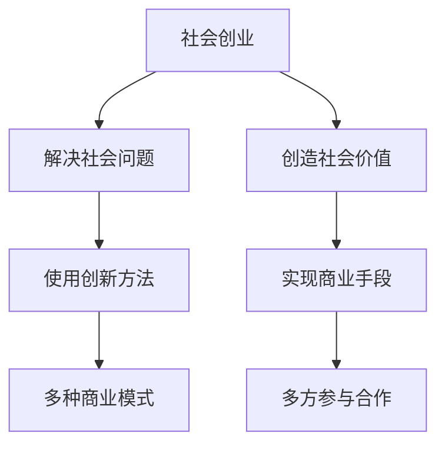

### 2.2 社会创业的核心特征

社会创业的核心特征包括创新性、社会责任、可持续性和合作性。这些特征不仅定义了社会创业的独特性，也决定了社会创业的成功与否。

- **创新性**：社会创业强调创新思维和方法，通过独特的产品、服务或商业模式来解决社会问题。这种创新性是社会创业的核心驱动力。
- **社会责任**：社会创业不仅仅是商业活动，更是对社会的一种责任。社会创业者需要承担解决社会问题的责任，并确保其商业行为符合社会伦理和道德标准。
- **可持续性**：社会创业追求长期的可持续发展，不仅关注当前的社会效益，也考虑未来可能的影响。这种可持续性是社会创业成功的关键。
- **合作性**：社会创业需要多方的合作，包括企业、非营利组织、政府和社会公众。通过合作，社会创业可以更有效地解决社会问题，实现更大的社会价值。

**数学模型：社会创业特征**

我们可以使用以下数学模型来描述社会创业的核心特征：

- **创新性**：I = f(创新思维，创新方法)
- **社会责任**：R = f(解决社会问题，遵守道德规范)
- **可持续性**：S = f(长期效益，未来影响)
- **合作性**：C = f(多方参与，合作效果)

### 2.3 社会创业与慈善事业的区别

社会创业与慈善事业在某些方面有相似之处，例如都关注社会问题和追求社会价值。但是，它们之间也存在明显的区别：

- **目的**：社会创业的目的是通过商业手段解决社会问题，实现商业价值和社会价值的双重目标。慈善事业则主要通过捐赠和援助来缓解社会问题。
- **手段**：社会创业使用创新的商业模式和方法，通过商业运作来实现社会效益。慈善事业则主要依赖捐赠和援助，通常不涉及商业运作。
- **参与方**：社会创业的参与方包括企业家、投资者、消费者、政府部门和社会公众。慈善事业则主要依赖捐赠者和非营利组织。
- **可持续性**：社会创业追求长期的可持续发展，关注长期的社会效益。慈善事业则通常关注短期内的社会效益。

### 2.4 社会创业理论的关键要素

社会创业理论包括多个关键要素，这些要素共同定义了社会创业的框架和策略。以下是一些重要的关键要素：

- **社会问题**：社会创业的首要目标就是解决特定的社会问题。这些问题可以是教育、健康、环境、贫困等方面的挑战。
- **商业模式**：社会创业需要有效的商业模式来确保其可持续发展。这些模式可以是商业性的，也可以是非营利性的。
- **创新性**：社会创业依赖于创新思维和方法，以独特的方式解决社会问题。
- **社会责任**：社会创业者需要承担社会责任，确保其商业行为符合社会伦理和道德标准。
- **可持续性**：社会创业追求长期的社会效益，关注其商业活动对社会和环境的影响。
- **合作性**：社会创业需要多方的合作，包括企业、非营利组织、政府和社会公众。
- **绩效评估**：社会创业需要建立有效的绩效评估机制，以衡量其社会效益和商业成果。

通过这些关键要素，社会创业理论为企业家提供了设计和实施社会创业项目的理论依据和操作指南。# 第3章：商业模式理论

### 3.1 商业模式的基本概念

商业模式是指企业通过创造、传递和获取价值的一种系统性方法。它描述了企业如何创造收入、控制成本、管理资源和与外部利益相关者互动的过程。理解商业模式的基本概念对于设计一个有效的商业模式至关重要。

**核心概念：**

1. **价值创造**：商业模式的核心在于如何为客户创造价值。这可以通过提供产品或服务来实现，这些产品或服务满足客户的需求和期望。
2. **价值传递**：企业需要有效地将价值传递给客户。这包括产品设计、营销策略、销售渠道和客户服务等方面。
3. **价值获取**：企业通过提供产品或服务获取收入。这涉及到定价策略、成本结构、收入流和管理等方面。

**伪代码：商业模式基本概念**

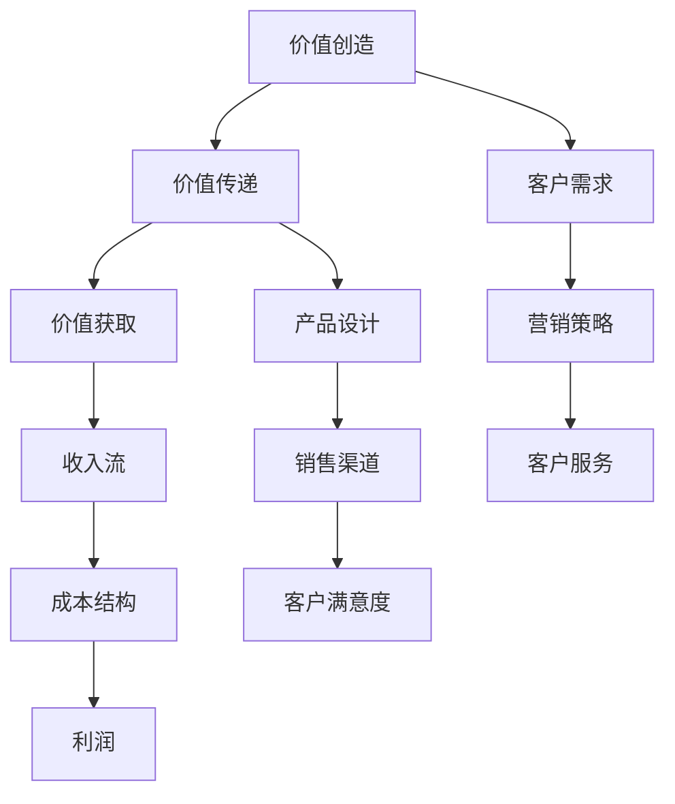

### 3.2 商业模式的关键要素

一个成功的商业模式通常包括多个关键要素，这些要素相互作用，共同决定商业模式的效率和效果。

1. **客户细分**：企业需要明确其目标客户群体，了解他们的需求和偏好，以便更好地设计和定位产品或服务。
2. **价值主张**：企业需要明确其提供的产品或服务的独特价值，如何满足客户的需求，以及相比竞争对手的优势。
3. **渠道策略**：企业需要选择合适的销售渠道，以确保价值能够有效地传递给客户。这可能包括直销、分销、在线销售等。
4. **客户关系**：企业需要建立和维护良好的客户关系，以提高客户满意度和忠诚度。这可能涉及客户服务、客户支持和忠诚度计划。
5. **收入来源**：企业需要确定其主要的收入来源，这可能包括产品销售、服务订阅、广告收入等。
6. **关键资源**：企业需要明确其运营所需的资源和能力，这可能包括技术、资金、人才等。
7. **关键活动**：企业需要确定其运营的关键活动，这些活动是实现商业模式的关键环节，如产品设计、生产、营销等。
8. **合作伙伴关系**：企业需要与其他合作伙伴建立合作关系，以实现资源共享和优势互补。
9. **成本结构**：企业需要合理控制成本，确保其商业模式在财务上可持续。

**伪代码：商业模式关键要素**

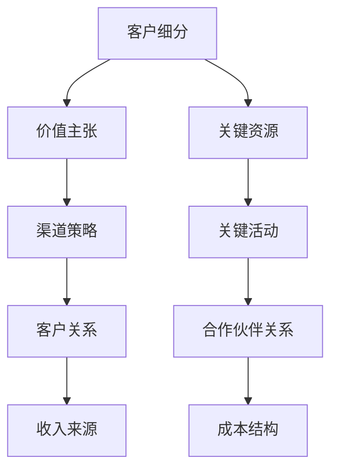

### 3.3 商业模式的创新策略

在竞争激烈的商业环境中，创新是商业模式成功的关键。企业需要不断探索新的商业模式，以适应市场变化和客户需求。以下是一些创新的策略：

1. **颠覆性创新**：通过彻底改变现有产品或服务的提供方式，创造新的市场需求。例如，特斯拉通过电动汽车颠覆了传统汽车行业。
2. **渐进性创新**：通过逐步改进现有产品或服务，提高其性能和用户体验。例如，苹果公司的iPhone通过连续的迭代升级，不断改进用户体验。
3. **模式创新**：通过改变商业模式的基本要素，创造新的商业机会。例如，Airbnb通过共享经济模式，改变了传统的住宿行业。
4. **跨界融合**：将不同领域的创新和技术融合，创造出新的商业模式。例如，亚马逊通过将电子商务与物流、云计算等技术融合，创造了一个全新的商业模式。

**伪代码：商业模式创新策略**

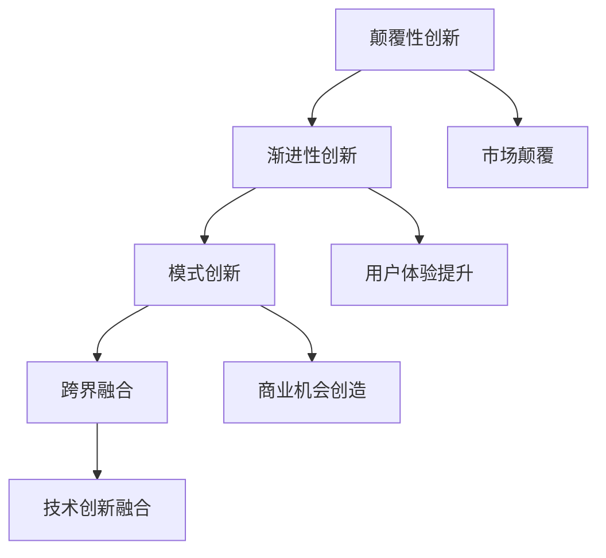

通过上述策略，企业可以不断创新其商业模式，以保持竞争优势，实现持续发展。# 第4章：社会企业家精神的核心概念与架构

### 4.1 社会企业家精神的定义与特征

社会企业家精神是一种独特的商业理念，它不仅仅是追求利润，更强调解决社会问题、创造社会价值。社会企业家通过创新的商业模式，将商业成功与社会责任相结合，为社会发展做出积极贡献。

**定义：**

社会企业家精神是指企业家在追求商业机会的同时，积极承担社会责任，通过创新的商业手段解决社会问题，创造社会价值的过程。

**特征：**

1. **创新性**：社会企业家精神强调创新思维和方法，通过独特的产品、服务或商业模式来解决社会问题。
2. **责任感**：社会企业家对社会和环境有强烈的责任感，愿意为社会做出贡献。
3. **可持续性**：社会企业家关注长期的社会效益，确保其商业活动对社会和环境的影响是可持续的。
4. **合作性**：社会企业家需要多方的合作，包括企业、非营利组织、政府和社会公众。

**伪代码：社会企业家精神定义与特征**

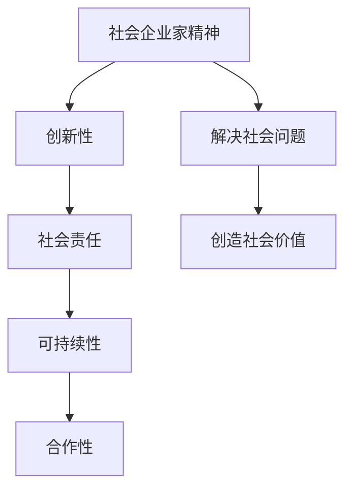

### 4.2 社会企业家精神与传统商业精神的对比

社会企业家精神与传统商业精神在某些方面有相似之处，例如都追求利润和社会价值。但是，它们之间也存在明显的区别。

**相似点：**

1. **利润追求**：无论是社会企业家精神还是传统商业精神，都追求利润的最大化。
2. **社会价值**：两者都关注社会价值，但社会企业家精神更强调社会责任和可持续发展。

**不同点：**

1. **目标重点**：传统商业精神更注重商业成功，而社会企业家精神则更强调解决社会问题。
2. **创新性**：社会企业家精神强调创新思维和方法，而传统商业精神则可能更注重市场开发和产品优化。
3. **合作性**：社会企业家精神需要多方的合作，而传统商业精神可能更侧重于内部管理和资源整合。

**伪代码：社会企业家精神与传统商业精神的对比**

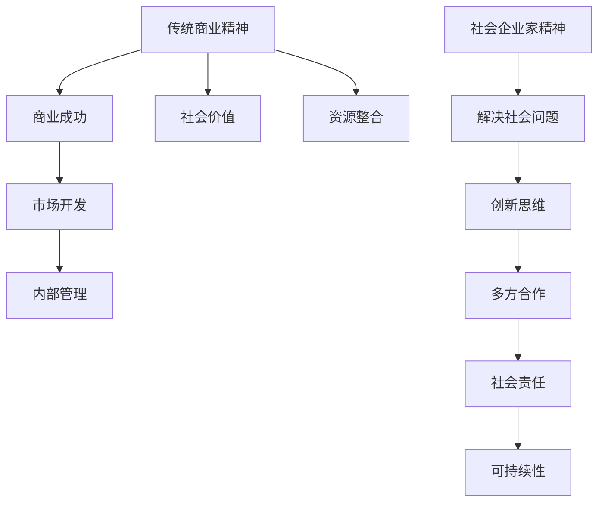

### 4.3 社会企业家精神与商业模式的联系

社会企业家精神与商业模式之间有着紧密的联系。一个成功的商业模式可以为社会企业家提供有效的框架，使其能够将社会责任融入商业实践中。

**联系：**

1. **目标一致**：社会企业家精神和商业模式都追求长期的社会效益，但在商业模式中，这种效益需要与商业成功相结合。
2. **创新性**：社会企业家精神强调创新性，商业模式的设计也需要创新的思维和方法。
3. **合作性**：社会企业家精神需要多方合作，商业模式中也需要与其他合作伙伴建立紧密的关系。
4. **可持续性**：社会企业家精神强调可持续性，商业模式的设计也需要考虑到长期的社会和环境效益。

**伪代码：社会企业家精神与商业模式之间的联系**

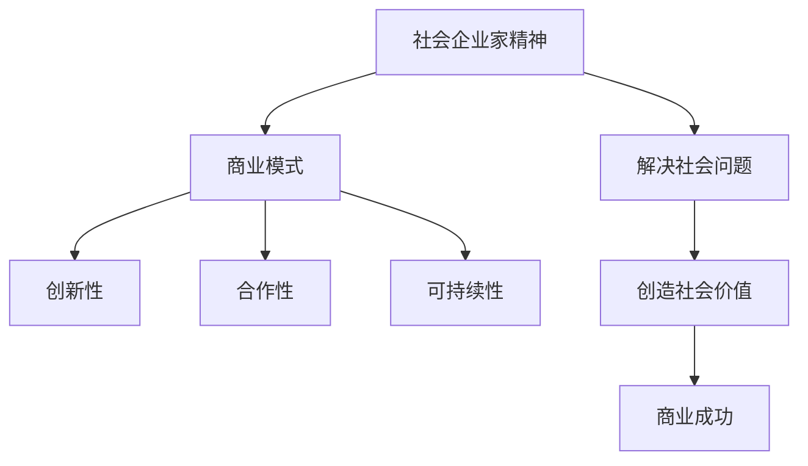

**Mermaid流程图：社会企业家精神与商业模式之间的互动关系**

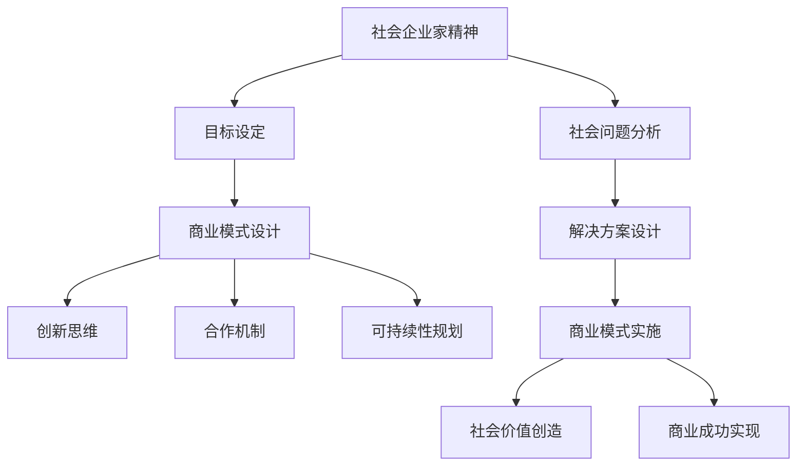

通过上述联系，我们可以看到社会企业家精神如何通过商业模式的框架，将社会责任融入商业实践，实现商业成功和社会效益的双重目标。# 第5章：成功案例分析

### 5.1 案例一：企业A的社会企业家实践

企业A是一家专注于可持续农业的社会企业。其创始人意识到传统农业模式对环境的破坏和农民的贫困问题，决定通过创新的方式解决这个问题。

**商业模式：**

- **价值创造**：企业A通过推广有机农业，提供高质量的农产品，满足消费者对健康、安全食品的需求。
- **价值传递**：企业A通过直接销售渠道和会员订阅服务，将产品直接传递给消费者，减少了中间环节，保证了产品的质量和新鲜度。
- **价值获取**：企业A通过农产品销售和会员订阅服务获取收入，同时，通过教育项目和培训，帮助农民提高生产技能，提高收入。

**社会影响：**

- **环境效益**：通过推广有机农业，企业A减少了对环境的破坏，提高了土壤的肥力，促进了生态平衡。
- **社会效益**：企业A通过培训和教育项目，帮助农民提高了生产技能，增加了收入，改善了生活质量。

**案例分析：**

企业A通过创新的商业模式，不仅实现了商业成功，还创造了显著的社会价值。其成功的关键在于：

- **创新性**：企业A通过推广有机农业，找到了一种可持续的农业模式，解决了环境问题。
- **社会责任**：企业A关注社会问题，通过培训和教育项目，帮助农民提高收入，改善了生活质量。
- **可持续性**：企业A的商业模式具有可持续性，通过会员订阅服务，确保了长期的收入流。

### 5.2 案例二：企业B的社会影响力

企业B是一家专注于可再生能源的社会企业。其创始人在看到全球能源消耗对环境的影响后，决定开发一种清洁、可持续的能源解决方案。

**商业模式：**

- **价值创造**：企业B通过开发太阳能和风能技术，提供可再生能源解决方案，满足企业的能源需求。
- **价值传递**：企业B通过直接销售和合同能源管理服务，将可再生能源解决方案传递给客户，降低了客户的能源成本。
- **价值获取**：企业B通过可再生能源解决方案的销售和能源管理服务获取收入。

**社会影响：**

- **环境效益**：企业B通过推广可再生能源，减少了对化石燃料的依赖，降低了碳排放，保护了环境。
- **社会效益**：企业B通过提供清洁能源解决方案，帮助客户降低了能源成本，提高了生产效率。

**案例分析：**

企业B通过创新的商业模式，不仅实现了商业成功，还创造了显著的社会和环境价值。其成功的关键在于：

- **创新性**：企业B通过开发太阳能和风能技术，找到了一种清洁、可持续的能源解决方案。
- **社会责任**：企业B关注社会和环境问题，通过提供清洁能源解决方案，帮助客户降低能源成本，提高生产效率。
- **可持续性**：企业B的商业模式具有可持续性，通过提供长期的服务和解决方案，确保了长期的收入流。

### 5.3 案例分析总结

通过企业A和企业B的成功案例，我们可以看到社会企业家如何通过创新的商业模式，将社会责任融入商业实践，实现商业成功和社会效益的双重目标。这些案例的成功经验表明：

- **创新性**：社会企业家需要具备创新思维，通过创新的商业模式解决社会问题。
- **社会责任**：社会企业家需要承担社会责任，关注社会和环境问题。
- **可持续性**：社会企业家需要设计可持续的商业模式，确保长期的社会效益。

这些成功案例为其他企业家提供了宝贵的借鉴和启示，鼓励他们在商业活动中积极融入社会企业家精神，为社会发展做出贡献。# 第6章：实战策略

### 6.1 社会企业家精神的培养

要将社会企业家精神融入商业模式，首先需要在个人和组织层面培养这种精神。以下是一些关键策略：

1. **意识培养**：通过教育和培训，提高个人和组织对社会问题的认识和关注。这可以通过阅读相关书籍、参加研讨会和工作坊来实现。
2. **责任意识**：培养个人和组织对社会责任的承担，使其意识到商业活动对社会和环境的影响。这可以通过制定社会责任报告、参与社会公益活动来实现。
3. **创新思维**：鼓励个人和组织培养创新思维，勇于尝试新的方法和模式来解决问题。这可以通过头脑风暴、设计思维工作坊等方式来实现。

**伪代码：社会企业家精神培养策略**

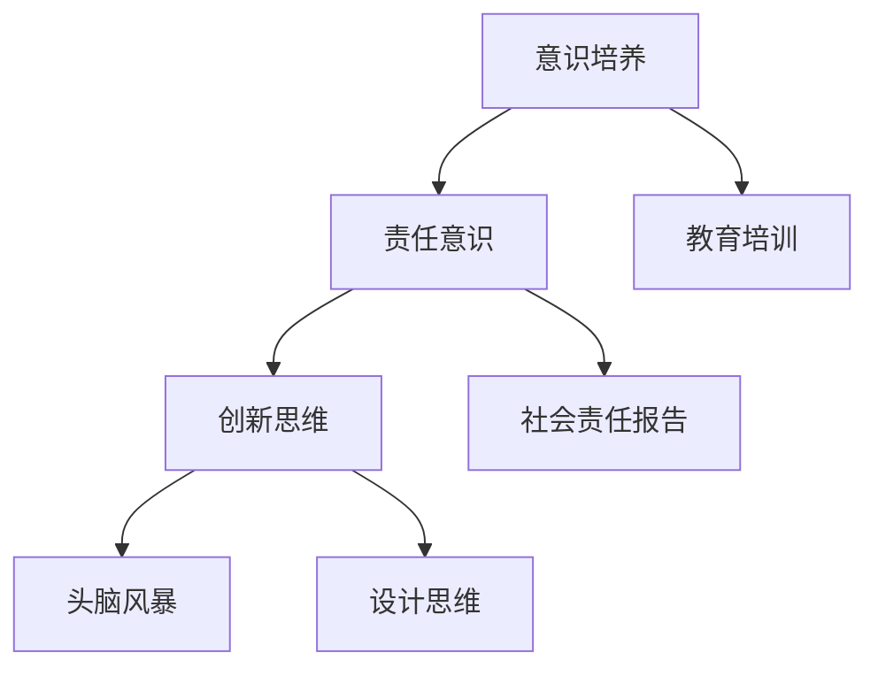

### 6.2 将社会企业家精神融入商业模式

将社会企业家精神融入商业模式需要系统性的设计和实施。以下是一些关键步骤：

1. **问题识别**：明确社会问题，了解其背景和影响。这可以通过市场调研、社会调研和数据分析来实现。
2. **解决方案设计**：设计创新的解决方案，以解决识别出的社会问题。这需要结合社会企业家精神的核心特征，如创新性、责任感和可持续性。
3. **商业模式构建**：将解决方案融入商业模式，确保其具有可行性、可持续性和社会影响力。这可以通过商业模型画布、业务流程图等方式来实现。

**伪代码：将社会企业家精神融入商业模式**

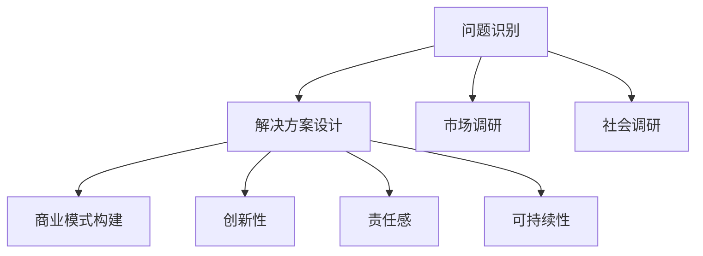

### 6.3 实现商业模式的可持续性

实现商业模式的可持续性是确保社会企业家精神长期发挥作用的关键。以下是一些策略：

1. **收益模型**：设计可持续的收益模型，确保企业能够持续盈利。这可以通过多元化收入来源、降低成本等方式来实现。
2. **成本管理**：合理控制成本，确保商业模式的可持续性。这可以通过优化供应链、提高生产效率等方式来实现。
3. **社会责任**：持续承担社会责任，确保商业活动对社会和环境的影响是积极的。这可以通过制定社会责任计划、参与社会公益活动等方式来实现。

**伪代码：实现商业模式的可持续性**

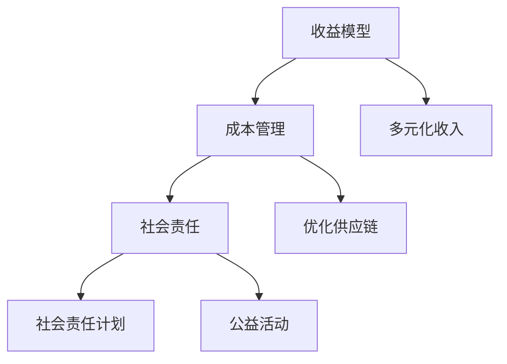

通过以上实战策略，社会企业家可以更好地将社会企业家精神融入商业模式，实现商业成功和社会效益的双重目标。这些策略不仅有助于提高企业的竞争力，还能为社会发展做出积极贡献。# 第7章：未来展望

### 7.1 社会企业家精神的未来趋势

随着全球化和技术进步，社会企业家精神正在逐渐成为商业领域的一个重要趋势。以下是社会企业家精神未来可能的发展趋势：

1. **数字化与可持续发展**：随着数字化技术的不断发展，社会企业家将更多地利用大数据、人工智能等技术手段，推动可持续发展。例如，通过智能农业和智能物流，减少资源浪费，提高生产效率。
2. **跨界合作**：社会企业家精神将推动不同行业之间的合作，通过跨界合作，实现资源共享和优势互补。例如，结合医疗、教育和科技行业，解决复杂的社会问题。
3. **全球影响力**：社会企业家将更多地关注全球性问题，如贫困、气候变化、教育资源不平等等。通过跨国合作和全球网络，他们将在全球范围内创造社会价值。
4. **社会责任的深化**：企业社会责任（CSR）将不再是企业的额外负担，而是其核心战略。社会企业家将更加注重长期的社会和环境效益，将其纳入商业决策的核心。

### 7.2 社会企业家精神的挑战与机遇

虽然社会企业家精神具有巨大的潜力，但在实际操作中仍面临诸多挑战和机遇：

**挑战：**

1. **资源限制**：社会企业家往往面临资源短缺的挑战，包括资金、人才和基础设施等。
2. **法规和政策**：一些国家和地区可能缺乏支持社会企业家精神的政策和法规，这给社会企业家带来了额外的困难。
3. **社会认知**：社会企业家精神尚未被所有人接受，一些传统观念可能阻碍其发展。

**机遇：**

1. **技术进步**：数字化技术的快速发展为社会企业家提供了更多的工具和机会，如区块链、人工智能等。
2. **市场潜力**：越来越多的消费者和企业开始关注社会责任和可持续发展，这为社会企业家创造了巨大的市场潜力。
3. **政策支持**：一些国家和地区正在出台支持社会企业家精神的政策和法规，这为社会企业家提供了良好的发展环境。

### 7.3 社会企业家精神对社会的长远影响

社会企业家精神不仅对商业领域产生了深远影响，也对整个社会产生了积极的长远影响：

1. **社会问题解决**：社会企业家通过创新的商业模式和解决方案，有效地解决了一系列社会问题，如贫困、教育资源不平等、环境污染等。
2. **经济增长**：社会企业家精神促进了经济增长，通过创造新的商业机会和就业岗位，提高了社会整体福利水平。
3. **文化变革**：社会企业家精神推动了一种新的商业文化，强调社会责任和可持续发展，改变了人们对商业的传统看法。

总之，社会企业家精神在未来的发展中将发挥越来越重要的作用，它不仅有助于实现商业成功，还能为社会的可持续发展做出重要贡献。社会企业家将继续在解决社会问题和推动社会进步的道路上，发挥着不可替代的作用。# 第8章 总结与建议

### 8.1 全书要点回顾

本书主要探讨了社会企业家精神的定义、特征及其在商业模式中的应用。我们首先介绍了社会企业家精神的定义和核心特征，包括创新性、责任感、可持续性和合作性。接着，我们分析了社会创业理论，探讨了社会创业与慈善事业的区别，以及社会创业理论的关键要素。随后，我们详细阐述了商业模式的基本概念和关键要素，并讨论了如何将社会企业家精神融入商业模式。通过成功案例分析，我们展示了社会企业家如何通过创新的商业模式解决社会问题，创造社会价值。最后，我们提出了培养社会企业家精神、实现商业模式可持续性的实战策略，并展望了社会企业家精神的未来发展趋势。

### 8.2 对读者的建议

对于希望将社会企业家精神融入商业实践的读者，以下是一些建议：

1. **加强理论学习**：深入了解社会企业家精神、社会创业理论和商业模式理论，掌握相关概念和原理。
2. **关注实际问题**：关注社会问题，识别潜在的商业机会，结合社会责任和可持续性原则，设计创新的解决方案。
3. **实践探索**：勇于实践，通过小规模试验，验证商业模式的可行性和社会影响力。
4. **持续学习**：随着技术和市场环境的变化，持续学习新的知识和技能，以适应不断变化的社会需求。

### 8.3 社会企业家精神的实践指南

为了在商业活动中有效融入社会企业家精神，以下是一些实践指南：

1. **明确社会目标**：在商业计划的制定过程中，明确企业的社会目标，将其纳入企业的核心价值观和战略规划。
2. **设计创新商业模式**：结合社会问题和市场需求，设计创新的商业模式，确保商业模式的可持续性和社会影响力。
3. **建立合作伙伴关系**：与其他社会企业、非营利组织、政府部门和社会公众建立合作关系，共享资源，共同推动社会变革。
4. **实施社会责任计划**：制定和实施社会责任计划，通过公益活动、环保措施、员工福利等方式，承担社会责任，提升企业声誉。
5. **持续评估和优化**：定期评估商业模式的社会效益和商业成果，根据评估结果调整和优化商业模式，确保其持续发展。

通过以上实践指南，企业可以在追求商业成功的同时，创造社会价值，实现商业成功与社会效益的双重目标。作者：AI天才研究院/AI Genius Institute & 禅与计算机程序设计艺术 /Zen And The Art of Computer Programming

