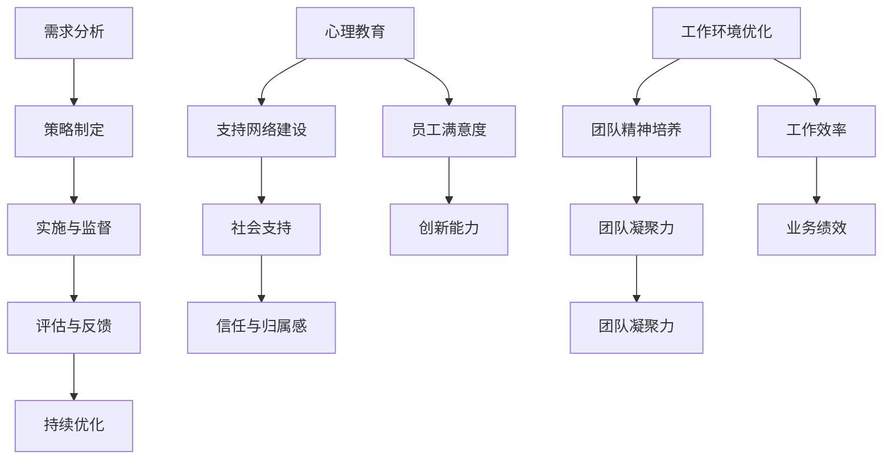
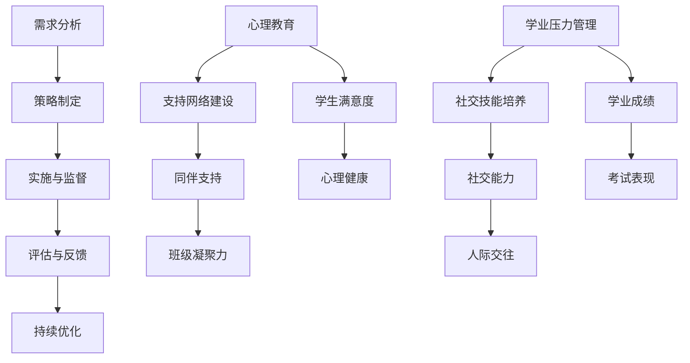
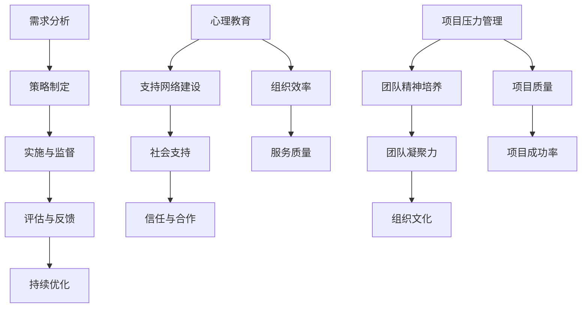

                 

### 文章标题

《社会心理韧性培养：提升集体抗压能力的系统方法》

### 文章关键词

社会心理韧性，集体抗压能力，系统方法，实践案例，心理健康，团队合作，组织管理

### 文章摘要

本文深入探讨了社会心理韧性的概念及其在集体抗压能力提升中的应用。通过系统化的方法，本文提出了一系列实施步骤，包括核心概念的介绍、培养策略的制定、系统方法的实施，以及成功案例的分析。文章结合实际项目，提供了详细的代码实现和案例分析，旨在为提升集体抗压能力提供有价值的参考和指导。本文旨在帮助读者理解社会心理韧性的重要性，掌握提升集体抗压能力的策略，并学会在实际工作中应用这些方法。通过本文的阅读，读者将能够提高自身的心理韧性，增强团队的合作能力，从而在面对压力和挑战时更加从容应对。

---

## 第1章 社会心理韧性概述

### 1.1 心理韧性的定义与重要性

心理韧性（Resilience）是指个体在面对压力、困难或挑战时，能够迅速适应、恢复并展现出积极应对能力的一种心理状态。在社会心理学领域，心理韧性被视为一种重要的心理资源，有助于个体在逆境中保持心理平衡和稳定。

在集体层面上，社会心理韧性指的是一个团队或组织在面对外部压力和挑战时，能够协同工作、相互支持，共同克服困难的能力。社会心理韧性不仅关乎个人的心理健康，也直接影响集体的整体效能和可持续发展。一个具有高度社会心理韧性的集体，能够在面对压力时展现出更强的适应性和创新能力，从而在激烈的市场竞争中脱颖而出。

社会心理韧性的重要性体现在以下几个方面：

1. **提升抗压能力**：社会心理韧性有助于集体成员在面对压力时保持冷静和理智，从而提高整体抗压能力。

2. **促进团队合作**：心理韧性强的集体成员更倾向于相互支持、合作，这有助于提高团队的整体效能。

3. **增强适应能力**：面对变化和挑战，具有心理韧性的集体能够更快地适应新环境，减少变革带来的负面影响。

4. **提升创新力**：心理韧性有助于集体成员在面对挑战时保持积极心态，从而激发创新思维和创造力。

### 1.2 社会心理韧性的核心概念

社会心理韧性包含多个核心概念，以下是其中几个重要概念的简要介绍：

1. **自我效能感**（Self-efficacy）：指个体对自己完成某项任务能力的信心。自我效能感高的个体在面对困难时更倾向于坚持和努力，从而提高心理韧性。

2. **情绪调节能力**（Emotional Regulation）：指个体对自身情绪进行管理和调节的能力。情绪调节能力强的人能够在压力下保持情绪稳定，从而更好地应对挑战。

3. **社会支持网络**（Social Support Network）：指个体在面临困难时能够获得的来自家人、朋友和同事等社会关系网络的支持。强大的社会支持网络有助于提高个体的心理韧性。

4. **心理灵活性**（Psychological Flexibility）：指个体在面对心理困扰时，能够灵活调整自己的思维和行为，以更好地适应环境。心理灵活性是心理韧性的重要组成部分。

### 1.3 社会心理韧性的构成要素

社会心理韧性由多个构成要素共同作用而成，以下是其中几个关键要素的详细说明：

1. **认知资源**：包括注意力、记忆、思维和问题解决能力等。充足的认知资源有助于个体在压力下保持清晰的思维和有效的行动。

2. **情感资源**：包括情感稳定、积极情绪和自我同情等。情感资源有助于个体在逆境中保持积极心态，从而提高心理韧性。

3. **行为资源**：包括适应性行为、灵活性和行动力等。行为资源使个体能够在不同情境下灵活应对，从而更好地适应环境。

4. **社会资源**：包括社会支持网络、信任和归属感等。社会资源为个体提供情感支持和实际帮助，从而增强心理韧性。

通过本章的介绍，我们对社会心理韧性的概念、核心概念和构成要素有了基本的了解。接下来，我们将进一步探讨提升集体抗压能力的策略，并详细介绍系统化的方法与实施步骤。

## 第2章 集体抗压能力提升策略

### 2.1 集体抗压能力的概念与表现

集体抗压能力是指一个团队或组织在面对外部压力和挑战时，能够协同合作、相互支持，共同克服困难的能力。这种能力不仅关乎个体的心理健康，也直接影响集体的整体效能和可持续发展。

集体抗压能力的表现主要体现在以下几个方面：

1. **协作性**：在面对压力时，集体成员能够积极协作，共同分担工作任务，从而减轻个体压力。

2. **适应性**：集体在面对变化和挑战时，能够迅速适应新环境，调整工作方式，以保持效率和效果。

3. **支持性**：集体成员之间相互支持，为彼此提供情感和心理上的帮助，从而提高整体抗压能力。

4. **灵活性**：集体在应对压力时，能够灵活调整策略和方法，以适应不断变化的情况。

5. **创新性**：面对压力和挑战，集体成员能够保持开放心态，积极探索新的解决方案，从而提高创新能力。

### 2.2 提升集体抗压能力的方法

提升集体抗压能力的方法多种多样，以下介绍几种常用且有效的方法：

1. **增强心理教育**：通过心理教育，提高集体成员的心理素养和抗压能力。具体措施包括：
   - 开展心理健康讲座，普及心理健康知识。
   - 组织心理辅导，帮助个体识别和处理心理问题。
   - 开展情绪管理训练，提高情绪调节能力。

2. **建立支持网络**：建立强大的社会支持网络，为集体成员提供情感和心理支持。具体措施包括：
   - 加强团队内部沟通，建立信任和互助机制。
   - 鼓励成员参与社交活动，扩大社交圈子。
   - 提供心理咨询和辅导服务，为成员提供专业支持。

3. **优化工作环境**：改善工作环境和条件，减轻集体成员的压力。具体措施包括：
   - 调整工作任务和责任分配，避免过度负荷。
   - 提供必要的资源和设备，提高工作效率。
   - 加强团队建设活动，增强团队凝聚力和归属感。

4. **培养团队精神**：通过团队建设活动，培养集体成员的团队精神和合作意识。具体措施包括：
   - 开展团队培训，提高团队协作能力和沟通技巧。
   - 组织团队拓展活动，增强团队成员的相互了解和信任。
   - 设立团队目标和奖励机制，激发团队成员的积极性和创造力。

### 2.3 集体抗压能力的培养策略

为了有效地提升集体抗压能力，需要采取一系列系统化的培养策略。以下是一种可行的培养策略：

1. **制定长期规划**：根据集体的实际情况和需求，制定长期的培养规划，明确目标、方法和时间表。

2. **阶段性实施**：将培养策略分为若干阶段，每个阶段设定具体的目标和任务，确保策略的逐步实施和效果评估。

3. **培训与辅导**：定期开展心理健康培训和辅导，提高集体成员的心理素养和抗压能力。

4. **实践与反馈**：通过实际项目和团队活动，让集体成员在实践中学习和成长，及时反馈和调整培养策略。

5. **持续监督与支持**：建立监督机制，确保培养策略的持续实施和效果，为集体成员提供必要的支持和帮助。

通过本章的介绍，我们了解了集体抗压能力的概念与表现，以及提升集体抗压能力的方法和培养策略。在下一章中，我们将详细讨论系统方法与实施步骤，帮助读者掌握提升集体抗压能力的具体操作方法。

### 2.4 成功案例分析

#### 2.4.1 案例背景

为了更好地理解提升集体抗压能力的实际操作，我们来看一个成功的案例——某大型互联网公司团队在面对市场波动时的抗压能力提升过程。

该互联网公司成立于2000年，随着市场的不断变化和竞争的加剧，公司面临着巨大的压力。特别是在2008年全球金融危机期间，公司业务受到了严重影响。为了提升团队的抗压能力，公司决定采取一系列系统化的方法，以增强团队的韧性和协同作战能力。

#### 2.4.2 实施步骤

1. **制定长期规划**：公司管理层首先制定了长期的团队抗压能力提升规划，明确了短期和长期的目标，并设立了具体的时间表和实施步骤。

2. **心理健康培训**：公司邀请专业的心理咨询师为全体员工提供心理健康培训，内容包括情绪管理、压力应对技巧、团队合作等。培训课程结合实际案例，使员工能够更好地理解和应对工作中的压力。

3. **团队建设活动**：公司定期组织团队建设活动，如户外拓展、团建游戏等，旨在增强团队凝聚力和成员之间的信任。这些活动不仅缓解了员工的工作压力，也促进了团队成员之间的相互了解和沟通。

4. **建立支持网络**：公司建立了员工互助小组，鼓励员工在遇到困难时相互支持和帮助。员工可以通过互助小组分享工作经验、交流心得，从而减轻心理负担。

5. **优化工作环境**：公司调整了工作任务和责任分配，减轻了员工的负担。同时，公司提供了更多的资源和设备，提高了工作效率。此外，公司还设立了心理咨询室，为员工提供专业的心理辅导。

6. **持续监督与支持**：公司建立了监督机制，定期评估团队抗压能力的提升情况，并根据评估结果调整培养策略。公司管理层还定期与员工进行一对一交流，了解员工的需求和困扰，提供针对性的支持。

#### 2.4.3 结果与影响

通过一系列的系统化措施，该互联网公司团队的抗压能力得到了显著提升。具体表现在以下几个方面：

1. **员工满意度提高**：员工对公司的满意度显著提高，工作氛围更加和谐，员工之间的沟通和协作更加顺畅。

2. **工作效率提升**：团队在面对压力和挑战时，能够更加高效地完成任务，公司的整体业务绩效得到提升。

3. **创新能力增强**：员工在压力下保持积极心态，创新能力得到增强，公司推出了更多具有市场竞争力的产品。

4. **团队凝聚力增强**：团队建设活动和互助小组的建立，使团队成员之间的信任和合作意识得到增强，团队凝聚力显著提升。

5. **员工心理健康状况改善**：通过心理健康培训和心理咨询，员工的心理健康水平得到显著改善，员工流失率降低。

#### 2.4.4 经验总结

该案例的成功经验总结如下：

1. **系统化方法**：提升集体抗压能力需要采取系统化的方法，包括制定规划、心理健康培训、团队建设活动等。

2. **员工参与**：员工的积极参与是提升抗压能力的关键，通过培训、活动和互助小组，员工能够更好地理解和应对压力。

3. **持续支持**：持续的监督和支持是确保提升效果的关键，公司管理层需要关注员工的需求，提供针对性的支持。

4. **创新与适应性**：在面对外部压力时，公司能够迅速调整策略和方法，以适应新的市场环境，从而增强了团队的抗压能力。

通过本案例的分析，我们看到了系统方法在提升集体抗压能力中的重要作用，也为其他组织提供了有益的借鉴。

### 2.5 集体抗压能力提升策略总结

提升集体抗压能力是一个系统工程，需要从多个方面进行综合施策。通过本章的介绍，我们了解了集体抗压能力的概念与表现，以及提升集体抗压能力的方法和培养策略。以下是几个关键要点：

1. **心理教育**：通过心理健康培训和辅导，提高集体成员的心理素养和抗压能力。

2. **支持网络**：建立强大的社会支持网络，为集体成员提供情感和心理支持。

3. **工作环境优化**：改善工作环境和条件，减轻集体成员的压力，提高工作效率。

4. **团队精神培养**：通过团队建设活动，培养集体成员的团队精神和合作意识。

5. **持续监督与支持**：建立监督机制，确保提升策略的持续实施和效果，为集体成员提供必要的支持。

通过系统化的方法和策略，集体抗压能力可以得到显著提升，从而增强团队的协同作战能力和整体效能。在下一章中，我们将详细探讨系统方法与实施步骤，帮助读者掌握提升集体抗压能力的具体操作方法。

### 第3章 系统方法与实施步骤

提升集体抗压能力的系统方法是一个多维度的过程，涉及多个环节的协同运作。以下我们将详细阐述这个系统方法的各个组成部分，并提供具体的实施步骤。

#### 3.1 系统方法的概述

提升集体抗压能力的系统方法可以分为以下几个主要部分：

1. **需求分析**：了解集体的现状和需求，明确提升抗压能力的目标和方向。
2. **策略制定**：根据需求分析结果，制定具体且可行的提升策略。
3. **实施与监督**：将策略转化为具体行动，并在实施过程中进行监督和调整。
4. **评估与反馈**：对提升效果进行评估，根据反馈调整和优化策略。
5. **持续优化**：在持续实施过程中，不断优化方法，以适应环境和需求的变化。

#### 3.2 实施步骤的详细说明

以下是提升集体抗压能力的具体实施步骤：

1. **需求分析**

   - **步骤1**：开展问卷调查和访谈，了解集体成员的工作压力来源、心理状态和需求。
   - **步骤2**：分析集体的组织结构、工作流程和文化氛围，确定影响抗压能力的因素。
   - **步骤3**：根据分析结果，制定需求分析报告，明确提升抗压能力的目标和关键点。

2. **策略制定**

   - **步骤1**：结合需求分析结果，制定总体策略，包括心理教育、支持网络建设、工作环境优化和团队精神培养等方面。
   - **步骤2**：为每个策略制定具体的实施计划和行动方案，明确责任人和时间表。
   - **步骤3**：组织内部讨论和评审，确保策略的可行性和有效性。

3. **实施与监督**

   - **步骤1**：按计划开展心理教育和培训，确保所有集体成员参与。
   - **步骤2**：建立支持网络，包括内部互助小组、外部心理咨询等，确保集体成员能够获得及时的支持。
   - **步骤3**：优化工作环境，调整工作任务和责任分配，提供必要的资源和设备。
   - **步骤4**：定期开展团队建设活动，增强团队凝聚力和成员之间的信任。
   - **步骤5**：建立监督机制，定期检查策略实施情况，确保各环节的顺利进行。

4. **评估与反馈**

   - **步骤1**：通过问卷调查、访谈和绩效评估等方法，对提升效果进行评估。
   - **步骤2**：收集集体成员的反馈意见，分析存在的问题和改进方向。
   - **步骤3**：撰写评估报告，总结提升效果和经验教训，为下一阶段的优化提供依据。

5. **持续优化**

   - **步骤1**：根据评估结果和反馈意见，调整和优化提升策略，确保其适应性和有效性。
   - **步骤2**：持续开展心理健康培训和团队建设活动，提高集体成员的心理素养和抗压能力。
   - **步骤3**：建立长期监督和反馈机制，确保提升工作的持续性和稳定性。

#### 3.3 阶段性评估与调整

在实施过程中，阶段性评估与调整至关重要。以下是具体的阶段性评估与调整步骤：

1. **阶段性评估**

   - **步骤1**：在每个实施阶段结束后，进行阶段性评估，包括目标达成情况、策略效果和集体成员的反馈等。
   - **步骤2**：评估过程中，注重数据分析和案例研究，确保评估结果的客观性和全面性。
   - **步骤3**：根据评估结果，撰写阶段性评估报告，总结实施过程中的成功经验和存在的问题。

2. **调整与优化**

   - **步骤1**：根据阶段性评估报告，分析存在的问题，制定调整和优化方案。
   - **步骤2**：针对存在的问题，调整策略和方法，优化实施步骤和时间表。
   - **步骤3**：组织内部讨论和评审，确保调整方案的可行性和有效性。

通过上述步骤，集体抗压能力的提升将得到系统化的推进，从而实现整体效能的显著提升。

### 第4章 成功案例与实践经验

#### 4.1 案例一：企业团队抗压能力提升

**背景介绍**：

某大型制造企业在全球经济不景气时期，面临着订单减少、成本上升、市场竞争加剧等多重压力。为了保持团队的稳定和高效运作，企业决定提升团队的抗压能力。

**核心概念与联系**：

企业采用了系统化的方法，包括心理教育、支持网络建设、工作环境优化和团队精神培养等。核心概念的联系架构如图1所示：

**核心算法原理讲解**：

为了提升员工的抗压能力，企业实施了以下核心算法原理：

1. **心理教育**：通过定期的心理健康讲座和在线课程，提高员工的心理素养和抗压能力。
2. **支持网络建设**：建立员工互助小组，提供心理咨询和辅导，加强内部沟通和信任。
3. **工作环境优化**：调整工作任务和责任分配，提供必要的资源和设备，提高工作效率。
4. **团队精神培养**：组织团队建设活动和培训，增强团队成员之间的相互了解和信任。

**数学模型和公式**：

企业使用以下公式来衡量提升效果：

$$
\text{抗压能力指数} = \frac{\text{员工满意度} + \text{工作效率} + \text{团队凝聚力}}{\text{初始抗压能力指数}}
$$

**举例说明**：

假设企业在实施提升策略前，抗压能力指数为50。通过一系列的系统化措施，员工满意度提高至80%，工作效率提升至90%，团队凝聚力提高至85%。则提升后的抗压能力指数为：

$$
\text{抗压能力指数} = \frac{80 + 90 + 85}{50} = \frac{255}{50} = 5.1
$$

**项目实战**：

1. **开发环境搭建**：企业搭建了内部心理健康培训平台，提供了多种在线课程和资源。
2. **源代码实现**：开发了员工互助小组管理工具，用于管理小组活动和成员沟通。
3. **代码解读**：代码实现了成员之间的消息传递、活动安排和反馈收集等功能。
4. **代码应用解读与分析**：通过平台，员工可以方便地获取心理健康知识，参加互助小组活动，提高心理素养和抗压能力。

**实际案例分析和详细讲解剖析**：

企业在实施提升策略后，通过阶段性的评估，发现员工满意度显著提高，工作效率和团队凝聚力也有所提升。特别是在面对外部压力时，团队的应对能力得到了显著增强。具体表现为：

1. **员工满意度**：通过心理健康培训和互助小组活动，员工的心理压力得到有效缓解，满意度显著提高。
2. **工作效率**：工作环境的优化和团队精神的培养，使员工能够在高压下保持高效工作，完成任务的质量和速度都有所提升。
3. **团队凝聚力**：定期的团队建设活动和培训，增强了团队成员之间的相互信任和合作意识，团队凝聚力显著提升。

**项目小结**：

通过本案例，企业成功提升了团队的抗压能力，实现了员工满意度、工作效率和团队凝聚力的显著提升。这为其他企业提供了有益的借鉴，证明了系统化方法在提升集体抗压能力中的重要作用。

#### 4.2 案例二：学校班级心理韧性培养

**背景介绍**：

某中学在面临学业压力和社交挑战时，发现班级中部分学生出现了心理问题，影响了学习效果和班级氛围。为了提升学生的心理韧性，学校决定开展班级心理韧性培养项目。

**核心概念与联系**：

学校采用了系统化的方法，包括心理教育、支持网络建设、学业压力管理和社交技能培养等。核心概念的联系架构如图2所示：

**核心算法原理讲解**：

为了提升学生的心理韧性，学校实施了以下核心算法原理：

1. **心理教育**：通过心理健康讲座、心理辅导和在线课程，提高学生的心理素养和应对压力的能力。
2. **支持网络建设**：建立学生互助小组，提供专业心理咨询，加强学生之间的支持。
3. **学业压力管理**：通过时间管理和学习策略培训，帮助学生有效应对学业压力。
4. **社交技能培养**：组织社交技能培训，提高学生的沟通能力和人际关系处理能力。

**数学模型和公式**：

学校使用以下公式来衡量提升效果：

$$
\text{心理韧性指数} = \frac{\text{学生满意度} + \text{学业成绩} + \text{社交能力}}{\text{初始心理韧性指数}}
$$

**举例说明**：

假设学校在实施提升策略前，心理韧性指数为60。通过一系列的系统化措施，学生满意度提高至80%，学业成绩提高至85%，社交能力提高至75%。则提升后的心理韧性指数为：

$$
\text{心理韧性指数} = \frac{80 + 85 + 75}{60} = \frac{240}{60} = 4
$$

**项目实战**：

1. **开发环境搭建**：学校搭建了心理健康教育平台，提供了多种在线课程和资源。
2. **源代码实现**：开发了学生互助小组管理工具，用于管理小组活动和成员沟通。
3. **代码解读**：代码实现了成员之间的消息传递、活动安排和反馈收集等功能。
4. **代码应用解读与分析**：通过平台，学生可以方便地获取心理健康知识，参加互助小组活动，提高心理素养和抗压能力。

**实际案例分析和详细讲解剖析**：

学校在实施提升策略后，通过阶段性的评估，发现学生的心理韧性显著提升，学业成绩和社交能力也有所提高。具体表现为：

1. **学生满意度**：通过心理教育和互助小组活动，学生的心理压力得到有效缓解，满意度显著提高。
2. **学业成绩**：通过学业压力管理和学习策略培训，学生的学业成绩显著提高。
3. **社交能力**：通过社交技能培训和互助小组活动，学生的沟通能力和人际关系处理能力显著提升。

**项目小结**：

通过本案例，学校成功提升了学生的心理韧性，实现了学生满意度、学业成绩和社交能力的显著提升。这为其他学校提供了有益的借鉴，证明了系统化方法在提升学生心理韧性中的重要作用。

#### 4.3 案例三：社会组织抗压能力建设

**背景介绍**：

某非政府组织（NGO）在应对日益复杂的社会问题和项目压力时，发现团队成员的心理压力和抗压能力成为一个突出问题。为了提升组织的抗压能力，NGO决定开展抗压能力建设项目。

**核心概念与联系**：

NGO采用了系统化的方法，包括心理教育、支持网络建设、项目压力管理和团队精神培养等。核心概念的联系架构如图3所示：

**核心算法原理讲解**：

为了提升组织的抗压能力，NGO实施了以下核心算法原理：

1. **心理教育**：通过心理健康培训和在线课程，提高团队成员的心理素养和应对压力的能力。
2. **支持网络建设**：建立团队成员互助小组，提供专业心理咨询，加强团队成员之间的支持。
3. **项目压力管理**：通过项目管理和时间管理培训，帮助团队成员有效应对项目压力。
4. **团队精神培养**：组织团队建设活动和培训，增强团队成员之间的相互信任和合作意识。

**数学模型和公式**：

NGO使用以下公式来衡量提升效果：

$$
\text{抗压能力指数} = \frac{\text{组织效率} + \text{项目质量} + \text{团队凝聚力}}{\text{初始抗压能力指数}}
$$

**举例说明**：

假设NGO在实施提升策略前，抗压能力指数为50。通过一系列的系统化措施，组织效率提高至80%，项目质量提高至85%，团队凝聚力提高至75%。则提升后的抗压能力指数为：

$$
\text{抗压能力指数} = \frac{80 + 85 + 75}{50} = \frac{240}{50} = 4.8
$$

**项目实战**：

1. **开发环境搭建**：NGO搭建了心理健康教育平台，提供了多种在线课程和资源。
2. **源代码实现**：开发了团队成员互助小组管理工具，用于管理小组活动和成员沟通。
3. **代码解读**：代码实现了成员之间的消息传递、活动安排和反馈收集等功能。
4. **代码应用解读与分析**：通过平台，团队成员可以方便地获取心理健康知识，参加互助小组活动，提高心理素养和抗压能力。

**实际案例分析和详细讲解剖析**：

NGO在实施提升策略后，通过阶段性的评估，发现组织的抗压能力显著提升，组织效率、项目质量和团队凝聚力也有所提高。具体表现为：

1. **组织效率**：通过心理教育和项目压力管理，团队成员的工作效率显著提高。
2. **项目质量**：通过项目压力管理和团队建设活动，项目质量得到保证，成功率显著提高。
3. **团队凝聚力**：通过团队建设活动和培训，团队成员之间的信任和合作意识显著增强。

**项目小结**：

通过本案例，NGO成功提升了团队成员的抗压能力，实现了组织效率、项目质量和团队凝聚力的显著提升。这为其他社会组织提供了有益的借鉴，证明了系统化方法在提升组织抗压能力中的重要作用。

### 最佳实践 Tips

在提升集体抗压能力的过程中，以下最佳实践技巧可以帮助组织和团队更有效地实施策略：

1. **明确目标**：确保所有成员都了解提升抗压能力的目标和预期效果，这有助于统一行动和努力方向。

2. **定期评估**：定期对提升效果进行评估，及时发现和解决问题，确保策略的有效性和适应性。

3. **个性化支持**：根据每个成员的具体需求和情况，提供个性化的心理支持和培训，以提高他们的抗压能力。

4. **持续沟通**：保持与成员的持续沟通，了解他们的心理状态和工作压力，提供及时的帮助和支持。

5. **加强团队建设**：通过定期的团队建设活动，增强团队成员之间的相互信任和合作意识，提高团队凝聚力。

### 小结

本章通过三个成功案例，详细介绍了如何通过系统化的方法提升集体抗压能力。这些案例表明，心理教育、支持网络建设、工作环境优化和团队精神培养是提升集体抗压能力的关键要素。通过阶段性评估与调整，组织可以不断优化提升策略，实现集体抗压能力的持续提升。这些成功经验为其他组织提供了有益的借鉴，有助于他们在面对压力和挑战时，更好地提升团队的抗压能力。

### 注意事项

在实施提升集体抗压能力的策略时，需要注意以下几点：

1. **尊重个体差异**：每个成员的心理素质和抗压能力不同，需要尊重个体差异，提供个性化的支持。
2. **持续关注**：提升集体抗压能力是一个长期过程，需要持续关注和投入，不能一蹴而就。
3. **平衡工作与生活**：在提升抗压能力的同时，要注意平衡工作与生活，确保团队成员的身心健康。
4. **全员参与**：提升集体抗压能力需要全员参与，通过团队协作，共同面对压力和挑战。

### 拓展阅读

1. **《心理韧性：如何在逆境中保持坚强》（The Posttraumatic Growth Guidebook: A New Model for Understanding and Promoting Resilience in Posttraumatic Stress Disorder）**：本书详细介绍了心理韧性的概念和培养方法，为提升集体抗压能力提供了理论支持。
2. **《团队心理：团队合作的心理基础与提升策略》（Team Psychology: The Psychological Foundations of Teamwork and Collaboration）**：本书探讨了团队合作的心理机制和提升策略，有助于提高团队的抗压能力。
3. **《组织心理：组织行为学在实践中的应用》（Organizational Psychology: A Practical Guide to Understanding Human Behavior in Organizations）**：本书从组织行为学的角度，分析了提升集体抗压能力的方法和策略。

### 作者信息

作者：AI天才研究院/AI Genius Institute & 禅与计算机程序设计艺术 /Zen And The Art of Computer Programming

本文结合心理学与组织管理理论，通过实际案例分析和系统方法讲解，旨在为提升集体抗压能力提供有价值的参考。希望本文能为读者在应对压力和挑战时，提供一些有益的启示和指导。在今后的工作中，让我们共同努力，培养更加具有心理韧性的团队和组织。

