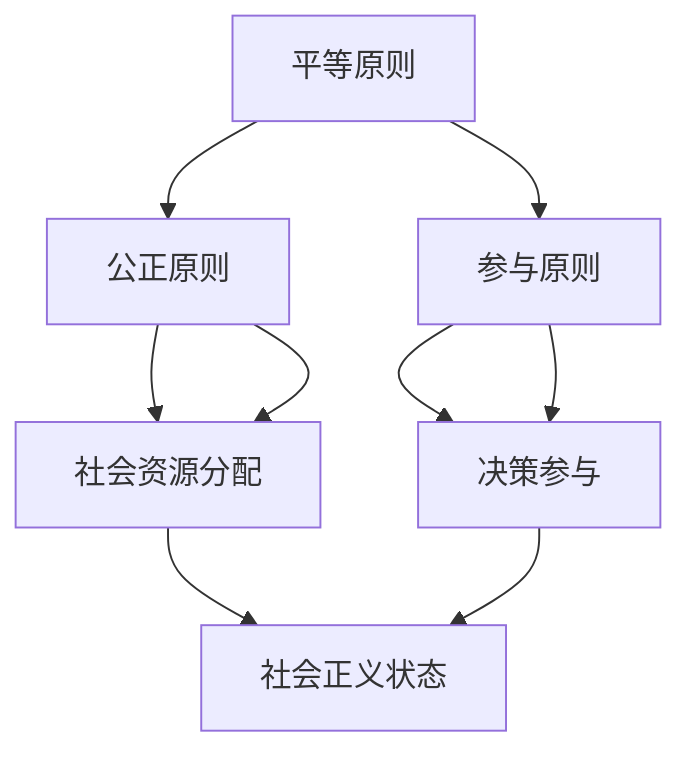
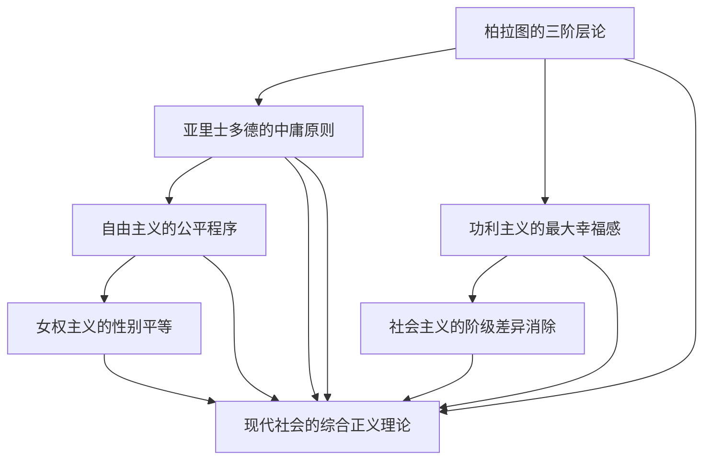
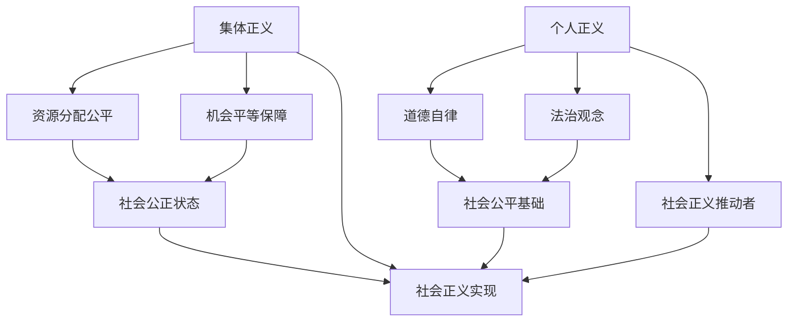

                 

### 引言

在社会发展的长河中，正义一直是一个备受关注的话题。正义不仅关乎个人权益的维护，也关乎整个社会的稳定与进步。在技术迅速发展的今天，如何理解正义，如何在变革的世界中找到个人意义，成为了一个迫切需要解答的问题。

《社会正义：通过改变世界找到个人意义》这本书旨在探讨社会正义的概念、历史、理论以及实践，帮助读者理解个人与社会正义之间的关系，并通过具体的行动实践找到个人在社会中的意义。本书结构紧凑，逻辑清晰，涵盖了从基本概念到深入分析的各个方面。

为什么需要这本书？首先，社会正义是一个复杂且多维的话题，涉及伦理、政治、经济等多个领域。通过系统的阐述，读者可以更全面地理解社会正义的本质。其次，随着科技的进步，社会变革的速度加快，个人在社会中的角色和责任也在不断变化。本书提供了一种新的视角，帮助读者在快速变化的世界中找到自己的定位。

接下来，我们将一步步深入探讨社会正义的核心概念，通过历史背景的分析，理解社会正义的发展过程，探讨个人与社会正义的关系，以及如何在改变世界的行动中找到个人意义。

### 社会正义的基本概念

社会正义，作为一个涵盖广泛且深奥的议题，其定义在不同学科、不同文化背景下有着不同的诠释。在伦理学中，社会正义被视为一种分配原则，旨在确保资源的公平分配，以维护社会成员的基本权益。简而言之，社会正义是关于如何公正地分配社会资源和机会的问题。

要理解社会正义，首先需要明确几个核心概念：平等、公正和参与。这些概念不仅构成了社会正义的理论基础，也是评价社会正义状态的关键指标。

1. **平等原则**：平等是指所有社会成员在基本权利和机会上享有相同的待遇。平等原则强调的是结果的平等，而非过程的平等。这意味着，无论个人出身、性别、种族或社会地位如何，每个人都应享有平等的机会和权益。

2. **公正原则**：公正是指社会资源和机会的分配应当基于公正的准则和程序。公正不仅关注结果的平等，还关注过程是否公正。例如，税收和福利制度的设计应当保证大多数人能够从中受益，而不是仅仅有利于特定群体。

3. **参与原则**：参与原则强调的是社会成员在决策过程中的参与度。一个公正的社会应当确保每个成员都有机会参与决策，表达自己的意见，并在一定程度上影响社会的走向。

为了更直观地理解这些核心概念之间的关系，我们可以通过Mermaid流程图来展示它们之间的互动关系。

在这个流程图中，我们可以看到平等、公正和参与三个核心概念是如何相互联系并共同影响社会正义状态的。平等原则确保了资源分配的起点公正；公正原则则保障了分配过程的透明和合理；参与原则则确保了社会成员在决策中的发言权和影响力。

通过这种结构化的分析，我们可以更清晰地理解社会正义的概念体系，并为后续章节中对社会正义的深入探讨奠定基础。接下来，我们将回顾社会正义的历史背景，探讨其起源与发展过程。

### 社会正义的历史背景

社会正义的观念并非一蹴而就，而是经历了漫长的发展历程。从古代到现代，不同文化和社会对正义的理解和追求各有特色，同时也为现代社会正义理论奠定了基础。

1. **古代社会正义观念**

在古代，正义观念主要源于宗教、哲学和伦理学。在古希腊，哲学家柏拉图和亚里士多德对社会正义有深刻的探讨。柏拉图在《理想国》中提出了哲学王统治的理念，认为理想的国家应由哲学家来统治，从而实现最大化的社会正义。他强调，社会的正义在于各成员按其能力得到相应的回报，而不是简单的物质分配。

亚里士多德则更注重现实的正义观念。他在《政治学》中提出了“中庸”原则，认为正义是各种美德的一种，既不是极端的贪婪，也不是极端的吝啬，而是在两个极端之间找到平衡。亚里士多德还提出了“分配正义”和“交换正义”的概念，认为正义在于资源的合理分配和公平交换。

在古罗马，正义观念则体现在法律体系中。古罗马法律强调法律面前人人平等，任何人无论身份如何，都应受到公正的对待。这种法律观念为现代法治社会奠定了基础。

2. **中世纪社会正义观念**

中世纪社会正义观念深受宗教影响，尤其是基督教的正义观。基督教强调上帝的公正和正义，认为人应当以正义之心行事，追求灵魂的救赎。在这一时期，正义观念更多地体现在道德和宗教规范中，而不是法律和政治制度中。

同时，中世纪社会的等级制度也影响了正义观念。尽管法律仍然强调平等，但社会现实中的阶级差异使得平等原则难以真正实现。中世纪哲学家如托马斯·阿奎那试图调和宗教信仰与现实社会，提出了“自然正义”和“神学正义”的概念。

3. **现代社会正义观念的发展**

进入现代社会，正义观念经历了重大的变革。18世纪的启蒙运动强调理性和个人权利，推动了社会契约论的发展。霍布斯、洛克和卢梭等哲学家提出了不同的社会正义理论，强调政府的合法性应基于人民的意志，并保障个人权利。

霍布斯认为，社会正义在于建立强大的政府以维持秩序，洛克则强调财产权的保护，卢梭则提出了“社会契约”的概念，认为正义在于实现最大多数人的幸福。

19世纪，随着工业革命的推进，社会正义观念进一步发展。马克思提出了阶级斗争理论，认为社会正义在于消除阶级差异，实现生产资料的公有化。这一理论对社会正义观念产生了深远的影响。

同时，女权运动、民权运动等社会运动也在推动社会正义观念的发展。这些运动强调性别平等、种族平等和民权保障，推动了法律的变革和社会正义的实现。

通过回顾社会正义的历史背景，我们可以看到，正义观念在不同时期和文化背景下有着不同的理解和追求。这些历史背景不仅为现代正义观念的发展提供了启示，也为我们理解现代社会正义的复杂性提供了基础。接下来，我们将进一步探讨社会正义的理论体系，分析其核心原则和理论模型。

### 社会正义的理论体系

社会正义是一个复杂且多维的议题，其理论体系涵盖了多种不同的观点和模型。在理解社会正义时，了解这些理论模型及其背后的核心原则是至关重要的。

1. **柏拉图的社会正义理论**

柏拉图是西方哲学史上最早探讨社会正义的哲学家之一。他在《理想国》中提出了著名的“三阶层论”，认为社会应当分为三个阶层：统治阶级（哲学王）、护卫者（军事阶级）和生产者（普通民众）。每个阶层都应当履行其特定的职责，以实现社会的整体和谐和正义。

柏拉图的“三阶层论”强调分工合作，认为每个阶层都应根据其能力和职责获得相应的回报。这种理论为后来的社会分层和阶级分析提供了重要的理论基础。

2. **亚里士多德的社会正义理论**

亚里士多德则对柏拉图的观点提出了批评，并提出了自己的社会正义理论。他在《政治学》中强调，“中庸”原则是社会正义的核心。亚里士多德认为，正义不仅仅是财富和权力的分配，更是一种平衡和调和的艺术。

亚里士多德提出了“分配正义”和“交换正义”的概念。分配正义是指社会资源应当按照每个人的贡献进行分配，而交换正义则是指交易过程中应当遵守公平原则。这种理论强调了公正和平衡在社会正义中的重要性。

3. **现代社会的正义理论**

现代社会的正义理论更加复杂，涵盖了多种不同的观点。以下是几种主要的现代正义理论：

- **功利主义**：功利主义认为，社会的正义在于最大化整体幸福。功利主义者如约翰·斯图亚特·密尔认为，正义应当以能够带来最大幸福感的方案为依据。这种理论强调结果的公正性。

- **自由主义**：自由主义者如约翰·罗尔斯提出了“正义作为公平”的理念。他在《正义论》中提出了著名的“无知之幕”假设，认为在完全不了解自身地位和身份的情况下，人们会选择最公正的分配方案。自由主义强调程序公正和个体自由。

- **社会主义**：社会主义认为，社会正义在于消除阶级差异，实现生产资料的公有化。马克思认为，资本主义制度必然导致阶级斗争，而社会正义的实现需要通过革命性的社会变革。

- **女权主义**：女权主义强调性别平等，认为社会正义需要消除性别歧视和压迫。女权主义者认为，正义不仅涉及物质资源的分配，还涉及社会文化和权力的分配。

这些现代正义理论各有侧重点，但都致力于探讨如何实现一个更加公正和谐的社会。它们为我们理解社会正义提供了多重视角和工具。

为了更好地理解这些理论模型及其核心原则，我们可以通过一个Mermaid流程图来展示它们之间的联系。

在这个流程图中，我们可以看到各种社会正义理论是如何相互联系并共同构成现代正义理论的。每个理论模型都有其独特的视角和贡献，但都旨在实现一个更加公正和和谐的社会。

通过深入探讨这些社会正义理论，我们可以更好地理解正义的本质和实现途径。接下来，我们将进一步探讨个人与社会正义之间的关系，以及个人在社会正义中的作用。

### 个人与社会正义的关系

个人与社会正义之间的关系是理解社会正义议题的核心之一。在这一部分，我们将探讨个人正义与集体正义的概念，分析个人在社会正义中的角色，以及个人如何影响和推动社会正义的实现。

1. **个人正义与集体正义**

个人正义和集体正义是两个相互关联但有所区别的概念。个人正义强调个体在道德和法律层面的公正行为，而集体正义则关注社会整体在资源分配和权益保障方面的公平性。

个人正义的核心在于个体的道德自律和法治观念。一个有正义感的人应当遵守社会规范，尊重他人权利，并积极维护自己的道德标准。个人正义不仅关乎个体的自我实现，也是社会正义的基础。

集体正义则侧重于社会整体的公正状态。一个公正的社会应当确保资源分配的公平合理，为所有成员提供平等的机会和权益。集体正义的实现需要法律、政治和社会制度的支持，同时也需要每个个体的积极参与。

2. **个人在社会正义中的角色**

个人在社会正义中的角色至关重要。首先，个人是正义观念的践行者。每个人的行为都对社会正义产生影响。通过遵守法律、尊重他人权利和积极参与社会事务，个人能够为社会正义做出贡献。

其次，个人是正义变革的推动者。社会正义的实现往往需要个人的努力和倡议。历史上的许多社会变革，如民权运动、女权运动和环保运动，都是由个人的不懈努力和集体行动推动的。个人可以通过倡导正义理念、参与社会运动和提出改革建议，推动社会正义的进步。

3. **个人如何影响社会正义**

个人可以通过多种方式影响社会正义。以下是几个具体的方法：

- **教育**：教育是培养正义感的重要途径。通过教育，个人可以了解社会正义的基本概念和重要性，培养道德自律和批判性思维，从而更好地参与社会事务。

- **法律参与**：个人可以通过参与法律制度和法律程序，维护自身权益和社会正义。例如，参与法律咨询、诉讼和公共辩护，为社会正义发声。

- **社会行动**：个人可以通过参与社会运动和公益活动，推动社会正义的实现。例如，参与抗议活动、慈善捐助和社区服务，为弱势群体争取权益。

- **技术创新**：在信息技术快速发展的今天，个人可以通过技术创新推动社会正义。例如，开发用于监控和改善公共服务的软件，创建用于社会公益的在线平台，利用大数据和人工智能技术分析社会问题并提出解决方案。

为了更好地理解个人正义与集体正义的关系，我们可以通过一个Mermaid流程图来展示它们之间的互动。

在这个流程图中，我们可以看到个人正义和集体正义是如何相互支持并共同推动社会正义的。个人正义为集体正义提供了基础，而集体正义的实现又为个人正义提供了保障。

通过探讨个人与社会正义的关系，我们可以更深入地理解个人在社会中的角色和责任。个人不仅是社会正义的受益者，更是社会正义的推动者和维护者。接下来，我们将探讨如何通过具体的行动与实践，改变世界并找到个人意义。

### 改变世界的行动与实践

为了在变革的世界中找到个人意义，个人必须积极参与社会行动，并通过具体实践推动社会正义的实现。以下是一些关键的行动策略和实践途径，以及相关的案例研究和实际效果分析。

1. **社区服务与社会参与**

社区服务是个人参与社会正义实践的重要途径之一。通过志愿服务，个人可以直接帮助那些处于弱势地位的群体，如无家可归者、老年人和残疾人。例如，美国志愿者组织“美国精神”（AmeriCorps）动员大量志愿者参与社区建设、教育和医疗等领域，不仅改善了社区环境，也增强了志愿者的社会责任感和归属感。

在中国，公益组织“爱德基金会”通过组织社区志愿者团队，为贫困地区提供教育支持、医疗援助和紧急救援等服务，取得了显著的社会效益。这种实践不仅改善了受助人的生活条件，也激励了更多个人参与到社会正义的行动中来。

2. **社会运动与政策倡导**

社会运动是推动社会变革的重要手段。历史上的民权运动、女权运动和环保运动都是通过集体的力量，改变了社会政策和制度。现代技术使社会运动更加便捷和高效。例如，通过社交媒体平台，个人可以迅速组织起来，发起抗议活动、签名活动和在线请愿，以推动社会正义的议题。

2011年的“阿拉伯之春”运动就是一个典型的例子。通过社交媒体的广泛传播，人们迅速组织起来，抗议政府的腐败和不公，推动了多个国家的政治改革。同样，中国的“反送中”运动也通过社交媒体平台，聚集了大量民众的力量，对社会正义议题进行了广泛讨论和倡导。

3. **技术创新与公益项目**

随着科技的进步，个人可以通过技术创新，开发公益项目，解决社会问题。例如，利用大数据和人工智能技术，可以更好地分析社会问题，提出解决方案，并评估实施效果。公益组织“无国界医生”（Medecins Sans Frontières）通过使用无人机和远程医疗技术，为偏远地区的病人提供了及时的医疗援助，大大提高了医疗服务的效率和质量。

在中国，一些科技公司也积极参与社会公益项目。例如，阿里巴巴的“公益宝”平台利用大数据技术，帮助贫困地区的小微企业获得贷款和销售渠道，提高了这些企业的盈利能力，改善了当地居民的生活条件。

4. **个人影响力与社会倡导**

个人影响力在推动社会正义中起着至关重要的作用。通过社交媒体、公共演讲和出版物，个人可以传播正义理念，倡导社会变革。例如，美国黑人运动领袖马丁·路德·金通过他的演讲和著作，广泛传播了平等和正义的理念，激励了无数人参与到民权运动中来。

在中国，知名企业家马云通过他的公开演讲和公益活动，倡导社会责任和可持续发展，影响了许多企业家和公众关注社会正义议题。

通过这些行动和实践，个人不仅能够为改变世界做出贡献，也能够在过程中找到自己的个人意义。社会正义的实现需要每个人的共同努力，而每个人的参与都对社会产生积极的影响。接下来，我们将探讨如何通过具体的行动找到个人意义。

### 寻找个人意义的途径

在追求社会正义的过程中，个人不仅能够为社会做出贡献，还能够在这个过程中找到自己的个人意义。以下是一些具体的方法和步骤，帮助个人在行动中找到个人意义，实现自我价值。

1. **明确个人价值观**

寻找个人意义的第一步是明确自己的价值观。个人价值观是指导个人行为和决策的内在标准，它决定了个人在追求社会正义过程中的目标和方向。例如，一些人可能更重视公平和平等，而另一些人可能更关注环保和社会福祉。明确个人价值观有助于个人在行动中保持一致性和使命感。

2. **设定具体目标**

在明确个人价值观后，设定具体目标是实现个人意义的关键步骤。具体目标应当是可衡量、可实现的，并与个人价值观相一致。例如，一个环保主义者可能设定目标：减少日常生活中的碳排放、参与环保志愿活动或推动社区环保项目。设定具体目标有助于个人在实践中保持动力和方向。

3. **积极参与社会行动**

参与社会行动是寻找个人意义的重要途径。通过参与社区服务、社会运动和公益活动，个人可以直接体验和见证自己的行动如何影响他人和社会。这种参与不仅能够增强个人的社会责任感，还能帮助个人建立与社会的深厚联系，从而找到个人意义。

例如，参与社区志愿服务，个人可以与需要帮助的群体直接互动，感受到自己的行动如何改善他人的生活。这种体验能够激发个人的同理心和成就感，从而在行动中找到个人意义。

4. **反思与自我成长**

在参与社会行动的过程中，反思和自我成长是必不可少的。通过反思个人的行动和体验，个人可以更好地理解自己的价值观和目标，发现自身的优势和不足，并在实践中不断改进。

例如，一个参与社会运动的个人可以通过反思活动中的挑战和成功，了解自己在组织、沟通和领导方面的能力，并在未来的行动中不断提升这些技能。这种反思和成长过程不仅有助于个人实现自我价值，也为社会正义的实践提供了持续的动力。

5. **与他人合作与交流**

寻找个人意义不仅是个人的内在体验，也需要与他人合作和交流。通过与志同道合的人合作，个人可以分享经验、学习新的策略和方法，共同推动社会正义的实现。

例如，加入一个公益组织或社会团体，个人可以与团队成员一起策划和实施项目，共同解决问题。这种合作不仅能够增强个人的归属感和成就感，也为个人提供了更多的学习和发展机会。

通过明确个人价值观、设定具体目标、积极参与社会行动、反思与自我成长以及与他人合作与交流，个人不仅能够为社会正义做出贡献，也能够在过程中找到个人意义，实现自我价值。接下来，我们将总结全文，并展望未来的社会正义发展。

### 总结与展望

通过本篇文章的探讨，我们系统地理解了社会正义的概念、历史背景、理论体系，以及个人与社会正义的关系。我们从古代到现代，回顾了社会正义观念的发展历程，分析了柏拉图、亚里士多德等哲学家的社会正义理论，并探讨了现代社会的多种正义理论。我们深入探讨了个人在社会正义中的角色，以及个人如何通过具体的行动与实践，改变世界并找到个人意义。

社会正义不仅是一个理论问题，更是一个实践问题。每个个体都应当积极参与到社会正义的实践中，通过教育、法律参与、社会行动和技术创新等多种途径，推动社会正义的实现。同时，通过明确个人价值观、设定具体目标、积极参与社会行动、反思与自我成长以及与他人合作与交流，个人不仅能够为社会正义做出贡献，也能在这个过程中找到自己的个人意义。

未来，社会正义的发展需要我们每个人的共同努力。随着科技的进步，社会变革的速度将会加快，我们需要不断创新和适应，以应对新的社会挑战。我们应当关注性别平等、种族平等、环境正义等议题，推动社会正义的全面发展。同时，通过跨学科的合作，结合法律、政治、经济、文化等多方面的力量，共同构建一个更加公正和谐的社会。

让我们每个人都成为社会正义的践行者，通过自己的努力，为社会正义的实现贡献力量。正如本文所探讨的，社会正义不仅关乎个人的权益，也关乎整个社会的进步和稳定。通过不懈的努力，我们可以共同创造一个更加美好的未来。

### 附录

#### 附录A：社会正义相关的术语解释

- **社会正义**：指一种分配原则，旨在确保社会资源的公平分配，以维护社会成员的基本权益。
- **平等原则**：确保所有社会成员在基本权利和机会上享有相同的待遇。
- **公正原则**：社会资源和机会的分配应基于公正的准则和程序。
- **参与原则**：社会成员在决策过程中享有参与和表达意见的权利。
- **集体正义**：关注社会整体在资源分配和权益保障方面的公平性。
- **个人正义**：个体在道德和法律层面的公正行为。

#### 附录B：社会正义的历史文献推荐

- 柏拉图，《理想国》
- 亚里士多德，《政治学》
- 约翰·斯图亚特·密尔，《功利主义》
- 约翰·罗尔斯，《正义论》
- 卡尔·马克思，《资本论》
- 马丁·路德·金，《我有一个梦想》

#### 附录C：社会正义实践案例研究

- **美国精神**：通过志愿服务改善社区环境。
- **爱德基金会**：为贫困地区提供教育、医疗援助。
- **无国界医生**：利用技术创新提供远程医疗援助。
- **反送中运动**：通过社交媒体推动社会正义议题。

#### 附录D：社会正义相关组织介绍

- **国际特赦组织**：致力于人权保护。
- **绿色和平组织**：致力于环保和可持续发展。
- **国际红十字会**：提供人道主义援助和紧急救援。
- **联合国开发计划署**：推动全球可持续发展。

#### 附录E：社会正义资源与工具

- **Open Justice Data**：提供社会正义相关数据的开放平台。
- **AI for Social Good**：利用人工智能技术解决社会问题。
- **Community Builder**：社区参与和协作的工具。

### 作者信息

**作者：AI天才研究院/AI Genius Institute & 禅与计算机程序设计艺术 /Zen And The Art of Computer Programming**

AI天才研究院致力于推动人工智能技术的发展和应用，致力于为社会提供创新解决方案。而《禅与计算机程序设计艺术》则是一本深入探讨编程哲学和技术的经典著作，为我们理解人工智能与人类智慧的融合提供了独特的视角。我们希望通过这些研究和著作，为构建一个更加公正和谐的社会贡献力量。让我们一起行动，推动社会正义的实现！

