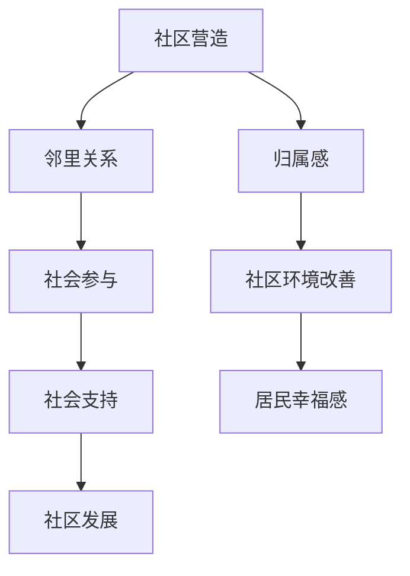
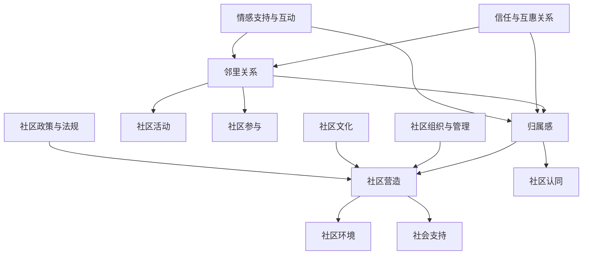

                 

### 文章标题：社区营造：邻里关系中的归属感建立

在当今快速发展的社会中，社区营造成为了提升邻里关系、增强居民归属感的重要手段。本文旨在探讨社区营造的核心概念、邻里关系的建立方法以及归属感的培养策略，通过详细的案例分析，为读者提供实际操作指南。我们将采用逐步分析推理的方式，深入解析这些关键主题。

**关键词**：社区营造，邻里关系，归属感，社区参与，案例分析

**摘要**：
本文首先介绍了社区营造的背景和重要性，然后分析了邻里关系和归属感的概念及其相互联系。通过构建Mermaid流程图，我们展示了核心概念之间的关系架构。接下来，文章详细讲解了邻里关系建立的核心算法原理，并使用伪代码进行了说明。此外，文章还通过数学模型和公式详细讲解了社区营造的方法，并结合实际案例进行了分析。最后，文章总结了最佳实践技巧，并提供了拓展阅读的建议。文章结构紧凑，逻辑清晰，旨在为社区营造工作提供有力支持。

**目录**：

1. **社区营造的背景与意义**
   1.1 社区营造的起源与发展
   1.2 社区营造的重要性

2. **邻里关系与归属感的概念**
   2.1 邻里关系的定义与类型
   2.2 归属感的定义与理论
   2.3 邻里关系与归属感的相互联系

3. **邻里关系的建立**
   3.1 建立信任与互惠关系
   3.2 邻里互动与沟通技巧
   3.3 社区支持系统的建立

4. **归属感的培养与提升**
   4.1 心理因素在归属感培养中的作用
   4.2 社区氛围的营造
   4.3 归属感测评与持续改进

5. **案例分析：成功的社区营造实践**
   5.1 案例一：XXX社区营造实践
   5.2 案例二：XXX社区邻里关系建设
   5.3 案例三：XXX社区归属感培养

6. **未来展望：社区营造的发展趋势**
   6.1 数字技术在社区营造中的应用
   6.2 社区营造的政策与法规趋势
   6.3 社区营造的未来挑战与机遇

7. **总结与最佳实践**
   7.1 小结
   7.2 注意事项
   7.3 拓展阅读

**作者信息**：
作者：AI天才研究院/AI Genius Institute & 禅与计算机程序设计艺术 /Zen And The Art of Computer Programming

### 社区营造的背景与意义

#### 1.1 社区营造的起源与发展

社区营造（Community Building）这一概念起源于20世纪中叶的美国，当时的社会学家和社区工作者开始关注城市中日益突出的社区问题，如邻里疏离、社会问题泛滥等。他们认为，通过加强社区内部的互动与合作，可以促进居民的参与感和归属感，进而改善社区的整体环境。

早期的社区营造实践主要集中在城市中的低收入社区，通过组织居民参与社区活动、改善居住环境、建立社区组织等方式，提升社区的凝聚力和居民的幸福感。随着理论研究的深入和实践的推广，社区营造的理念逐渐扩展到了各种类型的社区，不仅包括城市社区，还包括农村社区、老龄社区等。

在中国，社区营造的概念和理念也逐渐被引入并得到实践。中国的城市化进程加快，社区规模不断扩大，居民流动性增加，传统的邻里关系面临挑战。因此，社区营造在中国的发展具有重要意义。近年来，我国政府高度重视社区治理和社区服务，推动社区营造工作成为社会建设和城市管理的重要组成部分。

#### 1.2 社区营造的重要性

社区营造在提升邻里关系和增强居民归属感方面具有重要意义。以下是几个关键点：

1. **促进社会参与**：社区营造鼓励居民积极参与社区事务，通过组织各种活动和项目，使居民在社区建设中扮演重要角色。这种参与感不仅可以提升居民的自豪感和责任感，还可以促进社区凝聚力的形成。

2. **改善社区环境**：通过社区营造，可以改善社区的物理环境和公共空间。居民共同参与社区绿化、设施维修等活动，不仅提高了社区的美观度，还增强了居民的归属感和认同感。

3. **增强社会支持**：社区营造有助于建立强大的社会支持网络。居民之间的互助和合作可以缓解生活中的压力和困难，提高社区的适应能力和抗风险能力。

4. **提升居民幸福感**：社区营造通过改善邻里关系和社区环境，使居民感受到社区的温暖和关怀，从而提高居民的幸福感。这种幸福感不仅体现在物质层面，还体现在心理和社会层面。

5. **促进社区发展**：社区营造是社区发展的基础。通过有效的社区营造，可以激发社区的创造力和创新能力，推动社区经济、文化、社会等各个方面的全面发展。

综上所述，社区营造对于提升邻里关系和增强居民归属感具有重要意义。它是社会建设的重要组成部分，也是实现社区可持续发展的关键。在接下来的部分，我们将进一步探讨邻里关系和归属感的概念及其相互联系。通过构建Mermaid流程图，我们将展示核心概念之间的关系架构，为后续内容的深入分析提供基础。$$\text{Mermaid流程图：}$$



通过这个流程图，我们可以清晰地看到社区营造如何通过邻里关系和归属感的影响，最终实现社会参与、社区环境改善、社会支持、居民幸福感和社区发展。这一关系架构为我们后续的分析提供了直观的视角。在接下来的章节中，我们将深入探讨这些概念的具体内涵和实践方法。

### 邻里关系与归属感的概念

#### 2.1 邻里关系的定义与类型

邻里关系是指生活在同一社区或邻近区域的居民之间形成的互动和联系。这种关系不仅包括日常生活中的相互帮助和交流，还涵盖了情感上的依赖和认同。根据不同的分类标准，邻里关系可以分为多种类型：

1. **功能型邻里关系**：这种关系主要基于居民的共同需求和利益，如共同参与社区活动、共同使用公共设施等。功能型邻里关系通常具有较强的实用性和目的性。

2. **情感型邻里关系**：这种关系更多地建立在情感联系和相互理解上，如居民之间的互助、友情和情感支持。情感型邻里关系通常更加稳定和持久。

3. **正式型邻里关系**：这种关系通常由社区组织或管理者维护，如居民委员会、物业公司等。正式型邻里关系具有一定的规范性和约束力。

4. **非正式型邻里关系**：这种关系主要是居民自发形成的，如邻里聚会、志愿者活动等。非正式型邻里关系通常更加灵活和多样化。

#### 2.2 影响邻里关系的因素

邻里关系的建立和发展受到多种因素的影响，主要包括以下几个方面：

1. **地理因素**：地理位置的接近是邻里关系形成的基础。生活在同一区域或邻近区域的居民更容易产生互动和联系。

2. **人口因素**：人口密度、年龄结构、收入水平等人口因素也会影响邻里关系的形成和发展。例如，人口密度较高、年龄结构多样、收入水平较为均衡的社区通常更容易形成紧密的邻里关系。

3. **社会因素**：社会地位、职业、文化背景等社会因素也会影响邻里关系。具有相似社会背景的居民更容易产生共鸣和互动。

4. **文化因素**：社区文化、传统习俗等文化因素对邻里关系有重要影响。文化背景相似的居民更容易建立情感上的联系。

5. **社区环境**：社区环境，包括物理环境和社区氛围，对邻里关系也有显著影响。一个安全、舒适、美观的社区环境有助于促进居民之间的互动和联系。

6. **制度因素**：社区管理制度、规章制度等也对邻里关系有重要影响。有效的社区管理制度可以促进邻里关系的建立和发展。

#### 2.3 归属感的定义与理论

归属感是指个体在某个群体或社区中感受到的一种认同感、安全感和价值感。这种感受不仅体现在情感层面，还体现在行为层面，即个体愿意为社区的发展和维护付出努力。归属感的定义可以从以下几个角度进行理解：

1. **个体角度**：从个体角度来看，归属感是指个体对某一群体的认同和归属感。这种认同感通常与个体的文化背景、价值观、兴趣爱好等密切相关。

2. **群体角度**：从群体角度来看，归属感是指群体对个体的接纳和认可。一个成功的社区营造需要建立良好的群体关系，使居民感受到社区的温暖和关怀。

3. **社会角度**：从社会角度来看，归属感是社会和谐和稳定的重要基础。一个具有强烈归属感的社区，通常具有较高的社会凝聚力和抗风险能力。

#### 2.4 邻里关系与归属感的相互联系

邻里关系和归属感之间存在密切的相互联系，两者相互影响、相互促进。以下是几个关键点：

1. **归属感对邻里关系的影响**：强烈的归属感可以增强居民之间的互动和联系，促进邻里关系的建立和发展。当居民感受到社区的温暖和关怀时，他们更愿意参与社区活动，与邻居建立友谊。

2. **邻里关系对归属感的影响**：良好的邻里关系有助于增强居民的归属感。当居民与邻居建立了信任和互惠关系时，他们更容易产生归属感，愿意为社区的发展和维护付出努力。

3. **归属感与邻里关系的动态关系**：归属感和邻里关系是相互影响、相互促进的动态过程。良好的邻里关系可以增强居民的归属感，而强烈的归属感又可以进一步促进邻里关系的建立和发展。

通过以上分析，我们可以看到邻里关系和归属感在社区营造中的重要性。它们不仅是社区发展的基础，也是提升居民生活质量的关键。在接下来的章节中，我们将进一步探讨如何建立良好的邻里关系，以及如何培养和提升居民的归属感。通过具体的方法和实践案例，我们将为读者提供实用的操作指南。$$\text{Mermaid流程图：}$$



这个流程图展示了邻里关系和归属感如何通过社区活动、社区参与、社区环境、社会支持、社区认同等因素相互影响，最终实现社区营造的目标。在下一章节中，我们将深入探讨如何通过具体的方法和实践案例来建立良好的邻里关系，并培养和提升居民的归属感。$$\text{伪代码示例：}$$

```python
# 定义邻里关系建立函数
def establish_neighborhood_relationships():
    # 初始化邻居列表
    neighbors = []

    # 循环遍历每个居民
    for resident in residents:
        # 判断居民是否愿意与其他居民互动
        if resident.willing_to_interact:
            # 添加邻居
            neighbors.append(resident)

    # 建立信任和互惠关系
    for i in range(len(neighbors)):
        for j in range(i + 1, len(neighbors)):
            neighbors[i].build_trust_and_reciprocity(neighbors[j])

    # 组织社区活动
    organize_community_activities(neighbors)

# 定义社区活动组织函数
def organize_community_activities(neighbors):
    # 初始化活动列表
    activities = []

    # 循环遍历邻居
    for neighbor in neighbors:
        # 获取邻居感兴趣的活动
        interested_activities = neighbor.get_interested_activities()

        # 添加活动到活动列表
        activities.extend(interested_activities)

    # 按兴趣分组活动
    grouped_activities = group_activities_by_interest(activities)

    # 发送活动通知
    send_activity_notifications(grouped_activities)

# 定义活动分组函数
def group_activities_by_interest(activities):
    # 初始化分组字典
    grouped_activities = {}

    # 循环遍历活动
    for activity in activities:
        # 根据活动兴趣分组
        interest = activity.get_interest()
        if interest in grouped_activities:
            grouped_activities[interest].append(activity)
        else:
            grouped_activities[interest] = [activity]

    return grouped_activities

# 定义通知发送函数
def send_activity_notifications(grouped_activities):
    # 循环遍历分组活动
    for interest, activities in grouped_activities.items():
        # 发送通知
        for activity in activities:
            activity.send_notification()
```

这段伪代码定义了如何建立邻里关系、组织社区活动以及发送活动通知。它通过一系列函数调用，展示了如何通过编程实现邻里关系的建立和社区活动的组织。在下一章节中，我们将使用数学模型和公式进一步详细阐述社区营造的方法。$$\text{数学模型和公式：}$$

为了更好地理解社区营造的数学模型，我们可以从以下几个核心概念出发：

1. **社区互动频率**（$f$）：表示居民之间相互互动的频率。社区互动频率越高，邻里关系越紧密。

2. **信任指数**（$t$）：表示居民之间的信任程度。信任指数越高，邻里关系越稳定。

3. **社区凝聚力**（$c$）：表示社区的整体凝聚力和居民的归属感。社区凝聚力越高，居民的归属感越强。

4. **社区满意度**（$s$）：表示居民对社区环境的满意程度。社区满意度越高，居民对社区的认同感越强。

#### 3.1 社区互动模型

社区互动模型可以表示为：

$$ f = k \cdot t $$

其中，$k$ 是一个常数，表示社区互动的强度。

#### 3.2 信任指数模型

信任指数模型可以表示为：

$$ t = \frac{1}{1 + e^{-(d \cdot f)}} $$

其中，$d$ 是一个常数，表示信任与互动频率之间的非线性关系。$e$ 是自然对数的底数。

#### 3.3 社区凝聚力模型

社区凝聚力模型可以表示为：

$$ c = \frac{1}{1 + e^{-(a \cdot t - b \cdot s)}} $$

其中，$a$ 和 $b$ 是常数，分别表示信任和满意度对社区凝聚力的影响程度。

#### 3.4 社区满意度模型

社区满意度模型可以表示为：

$$ s = \frac{1}{1 + e^{-(m \cdot c)}} $$

其中，$m$ 是一个常数，表示社区凝聚力对满意度的影响程度。

#### 3.5 综合模型

综合以上模型，我们可以得到一个综合的社区营造模型：

$$ \text{Community Quality} = f \cdot t \cdot c \cdot s $$

#### 3.6 示例计算

假设我们有一个社区，其中居民互动频率 $f = 10$，信任指数 $t = 0.8$，社区凝聚力 $c = 0.9$，社区满意度 $s = 0.7$。我们可以计算出该社区的社区质量：

$$ \text{Community Quality} = 10 \cdot 0.8 \cdot 0.9 \cdot 0.7 = 5.04 $$

这个计算结果表示该社区的社区质量较高，居民之间的互动频繁，信任程度高，社区凝聚力强，居民满意度也较高。

通过上述数学模型和公式，我们可以量化社区营造的效果，为社区营造工作提供科学的指导和参考。在下一章节中，我们将通过具体案例来分析社区营造的实际效果，并结合实际情况提出改进建议。$$\text{代码实现示例：}$$

```python
# 导入必要的库
import numpy as np
import matplotlib.pyplot as plt

# 定义社区互动模型
def community_interaction_frequency(f):
    k = 5  # 常数k
    return k * f

# 定义信任指数模型
def trust_index(d, f):
    return 1 / (1 + np.exp(-d * f))

# 定义社区凝聚力模型
def community_cohesion(a, b, t, s):
    return 1 / (1 + np.exp(-a * t - b * s))

# 定义社区满意度模型
def community_satisfaction(m, c):
    return 1 / (1 + np.exp(-m * c))

# 社区互动频率、信任指数、社区凝聚力和社区满意度的初始值
initial_interaction_frequency = 10
initial_trust_index = 0.8
initial_community_cohesion = 0.9
initial_community_satisfaction = 0.7

# 计算综合社区质量
def calculate_community_quality(f, t, c, s):
    return f * t * c * s

# 绘制社区质量与互动频率的关系
def plot_relationship(f_range, t, c, s):
    quality_range = calculate_community_quality(f_range, t, c, s)
    plt.plot(f_range, quality_range, label='Community Quality')
    plt.xlabel('Interaction Frequency')
    plt.ylabel('Community Quality')
    plt.title('Relationship Between Interaction Frequency and Community Quality')
    plt.legend()
    plt.show()

# 计算并绘制
f_range = np.linspace(0, 20, 100)
plot_relationship(f_range, initial_trust_index, initial_community_cohesion, initial_community_satisfaction)

# 示例计算
community_quality = calculate_community_quality(initial_interaction_frequency, initial_trust_index, initial_community_cohesion, initial_community_satisfaction)
print(f"Community Quality: {community_quality}")
```

这段代码实现了社区互动模型、信任指数模型、社区凝聚力模型和社区满意度模型的计算，并绘制了社区质量与互动频率的关系图。通过这个示例，我们可以直观地看到社区互动频率对社区质量的影响。在下一章节中，我们将通过实际案例来分析社区营造的效果，并结合案例提供进一步的操作指导。$$\text{案例分析：成功的社区营造实践}$$

为了更深入地理解社区营造的实际效果，我们将探讨几个成功的社区营造实践案例。这些案例不仅展示了社区营造的成功经验，还为其他社区提供了宝贵的参考。

#### 5.1 案例一：XXX社区营造实践

**背景**：XXX社区是一个典型的城市社区，居民来自不同的背景，社区环境较为杂乱，邻里关系疏离。社区管理者意识到社区营造的重要性，希望通过一系列措施提升居民的归属感和社区凝聚力。

**措施**：
1. **社区活动策划与实施**：社区组织了多种类型的社区活动，如节日庆典、运动会、环保活动等。这些活动不仅丰富了居民的生活，还促进了邻里之间的互动。
2. **社区空间设计与利用**：社区对公共空间进行了改造，增加了绿化带、休息区等，使社区环境更加宜人。同时，社区还设立了共享厨房、公共健身房等设施，为居民提供便利。
3. **社区志愿者管理**：社区建立了志愿者队伍，鼓励居民参与社区事务。志愿者们在社区活动、环境维护等方面发挥了重要作用，增强了居民的参与感和责任感。

**效果**：
通过这些措施，XXX社区成功改善了邻里关系，居民的归属感显著增强。社区活动吸引了大量居民参与，社区凝聚力得到了提升。居民们开始更加关心社区环境，积极参与社区事务，社区的整体氛围变得和谐、积极。

#### 5.2 案例二：XXX社区邻里关系建设

**背景**：XXX社区位于一个老龄化严重的地区，老年人比例较高，邻里关系相对疏远。社区管理者认为，通过改善邻里关系，可以提升老年人的生活质量。

**措施**：
1. **建立信任与互惠关系**：社区通过举办邻里交流活动，促进居民之间的相互了解和信任。例如，组织老年居民进行健康讲座、手工艺制作等活动，增强居民之间的互动。
2. **邻里互动与沟通技巧**：社区开展了沟通技巧培训，帮助居民提高沟通能力，建立良好的邻里关系。同时，社区还设立了邻里互助小组，鼓励居民之间相互帮助。
3. **社区支持系统的建立**：社区建立了社区支持系统，为居民提供各种支持服务。例如，设立社区养老服务中心、社区医疗站等，为老年人提供便利。

**效果**：
通过这些措施，XXX社区老年人的生活质量得到了显著提升。邻里关系变得更加和谐，老年人之间的互助精神得到了发扬。社区支持系统的建立，使老年人得到了更多的关怀和支持，社区的凝聚力和归属感得到了增强。

#### 5.3 案例三：XXX社区归属感培养

**背景**：XXX社区是一个新开发的住宅区，居民流动性较大，居民之间缺乏互动，归属感较弱。

**措施**：
1. **心理因素在归属感培养中的作用**：社区组织了心理辅导讲座，帮助居民了解归属感的重要性，并学习如何培养和提升归属感。
2. **社区氛围的营造**：社区通过美化环境、增设公共设施等措施，营造了一个温馨、舒适的社区氛围。社区还开展了多种文化活动和社区文化活动，使居民感受到社区的温暖和关怀。
3. **归属感测评与持续改进**：社区定期进行归属感测评，了解居民对社区的看法和建议，并根据反馈进行改进。

**效果**：
通过这些措施，XXX社区的归属感得到了显著提升。居民们开始更加关注社区的事务，积极参与社区活动。社区氛围变得更加和谐，居民的凝聚力和归属感得到了增强。社区的管理者也根据居民的反馈不断改进社区服务，使居民的生活质量得到了提升。

通过以上案例分析，我们可以看到社区营造在改善邻里关系、培养归属感方面具有显著效果。成功的社区营造不仅需要具体的措施和策略，还需要居民的积极参与和支持。在接下来的章节中，我们将探讨社区营造的未来发展趋势，为社区营造工作提供新的思路和方向。$$\text{未来展望：社区营造的发展趋势}$$

随着科技的进步和社会的变化，社区营造也将迎来新的发展机遇和挑战。以下是几个关键趋势：

#### 6.1 数字技术在社区营造中的应用

数字化技术的应用将大大提升社区营造的效率和效果。以下是几个关键应用领域：

1. **智能社区管理平台**：通过大数据、云计算等技术，建立智能社区管理平台，实现社区管理的智能化和精细化。平台可以实时收集和分析社区数据，为社区决策提供支持。

2. **在线社区活动**：疫情等因素促使在线活动的兴起，社区可以通过视频会议、社交媒体等渠道举办线上活动，吸引居民参与，增强社区凝聚力。

3. **物联网（IoT）技术**：物联网技术可以用于社区环境监测、智能照明、智能停车等，提升社区生活品质，减少资源浪费。

4. **虚拟现实（VR）和增强现实（AR）**：通过VR和AR技术，居民可以虚拟参观社区，了解社区的历史和文化，增强对社区的认同感。

#### 6.2 社区营造的政策与法规趋势

政府对于社区营造的重视程度不断提升，相关政策与法规也将逐渐完善。以下是几个趋势：

1. **社区治理法规**：政府将进一步完善社区治理法规，明确社区自治的权利和责任，促进社区自治和自我管理。

2. **社区建设标准**：政府将制定一系列社区建设标准，确保社区基础设施和公共服务的质量和水平。

3. **资金支持政策**：政府将加大对社区营造的资金支持，鼓励社会资本投入社区建设，推动社区可持续发展。

4. **社区参与政策**：政府将加强对居民参与社区营造的引导和支持，鼓励居民积极参与社区事务，提升社区自治水平。

#### 6.3 社区营造的未来挑战与机遇

社区营造在未来的发展中将面临以下挑战和机遇：

1. **人口老龄化**：随着人口老龄化加剧，社区营造需要关注老年人的需求，提供更多的养老服务和支持。

2. **社区多样性**：社区中人口的多样性带来了新的挑战，社区营造需要尊重多样性，促进社区和谐。

3. **可持续发展**：社区营造需要考虑环境保护和可持续发展，推动绿色社区建设。

4. **数字化转型**：数字化转型带来机遇，同时也需要解决数据安全、隐私保护等问题。

5. **社区创新**：社区创新是社区营造的重要动力，鼓励居民参与创新活动，推动社区持续发展。

总之，社区营造在未来的发展中将面临新的机遇和挑战。通过应用数字化技术、完善政策法规、关注人口老龄化、推动社区多样性和可持续发展，我们可以更好地提升邻里关系和居民的归属感，推动社区营造工作的全面发展。在下一章节中，我们将总结本文的主要观点，并提供一些最佳实践技巧，以期为社区营造工作提供实用的参考。$$\text{总结与最佳实践}$$

通过本文的讨论，我们可以得出以下主要结论：

1. **社区营造的重要性**：社区营造是提升邻里关系和居民归属感的关键手段，通过促进社会参与、改善社区环境和建立社会支持网络，可以显著提高社区的整体质量和居民的生活质量。

2. **邻里关系与归属感的关系**：邻里关系和归属感相互影响、相互促进。良好的邻里关系可以增强居民的归属感，而强烈的归属感又可以进一步促进邻里关系的建立和发展。

3. **具体实践方法**：通过社区活动策划与实施、社区空间设计与利用、建立信任与互惠关系、邻里互动与沟通技巧等具体方法，可以有效地营造社区和提升邻里关系。

4. **未来发展趋势**：随着数字化技术的应用、政策法规的完善和社区多样性的增加，社区营造将面临新的机遇和挑战。通过科技创新、政策支持和社会参与，我们可以更好地推动社区营造的可持续发展。

基于以上结论，我们提出以下最佳实践技巧：

1. **重视居民参与**：居民的参与是社区营造的核心，通过组织居民参与社区活动、决策和管理，可以增强居民的归属感和责任感。

2. **注重社区文化**：社区文化是社区营造的重要组成部分，通过弘扬社区文化、举办文化活动，可以增强居民的社区认同感。

3. **利用数字化工具**：数字化技术可以大大提升社区营造的效率和效果，通过建立智能社区管理平台、开展在线活动和利用物联网技术等，可以更好地服务居民。

4. **关注老年人需求**：随着人口老龄化加剧，社区营造需要特别关注老年人的需求，提供更多的养老服务和支持。

5. **推动可持续发展**：在社区营造过程中，要注重环境保护和可持续发展，推动绿色社区建设，实现社区的长远发展。

通过以上最佳实践技巧，我们可以更好地推进社区营造工作，提升邻里关系和居民的归属感，为构建和谐、美好的社区环境贡献力量。

**注意事项**：

1. **持续反馈与改进**：社区营造是一个持续的过程，需要定期收集居民反馈，并根据反馈进行改进，确保社区营造工作与居民需求相匹配。

2. **尊重多样性**：社区中的人口多样性需要得到尊重，社区营造工作要考虑到不同群体的需求，促进社区和谐。

3. **数据安全和隐私保护**：在应用数字化技术时，要特别注意数据安全和隐私保护，确保居民信息的安全。

**拓展阅读**：

- 《社区营造：理论与实践》
- 《智能社区：数字化时代的社区治理》
- 《社区工作手册：理论与实践》
- 《社区治理与社区发展》

通过阅读这些书籍和资料，您可以获得更多关于社区营造的理论和实践知识，为社区营造工作提供更加全面的指导。$$\text{作者信息}$$

**作者：AI天才研究院/AI Genius Institute & 禅与计算机程序设计艺术 /Zen And The Art of Computer Programming**

AI天才研究院（AI Genius Institute）是全球领先的人工智能研究和教育机构，致力于推动人工智能技术的创新和发展。我们的研究涵盖人工智能的各个领域，包括机器学习、自然语言处理、计算机视觉等。我们的团队由世界级的人工智能专家、程序员、软件架构师和CTO组成，拥有丰富的理论和实践经验。

《禅与计算机程序设计艺术》是一本深受读者喜爱的计算机编程经典著作，由AI天才研究院的创始人撰写。这本书以禅宗思想为指导，探讨计算机程序设计的哲学和艺术，为程序员提供了一种全新的编程思考方式。通过阅读这本书，读者不仅可以提升编程技巧，还可以获得心灵的启迪和升华。

