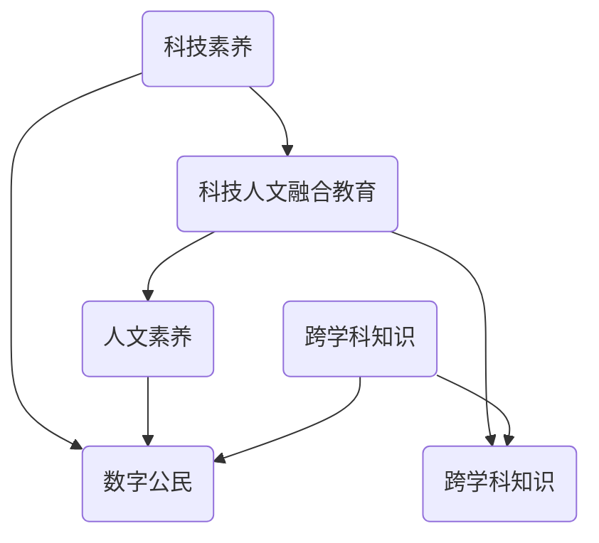

                 

## 文章标题：科技人文融合教育：培养全面发展的数字公民

### 关键词：
- 科技人文融合教育
- 数字公民
- 课程设计
- 教学方法
- 案例分析
- 政策支持

### 摘要：
本文旨在探讨科技人文融合教育的概念、意义及其在培养全面发展数字公民中的重要作用。首先，我们明确了科技人文融合教育的定义及其背景，阐述了数字公民的概念和培养目标。接着，我们构建了科技人文融合教育的理论框架，并详细讨论了课程设计与教学方法。通过国内外实践案例的分析，我们总结了科技人文融合教育的成功经验与挑战，并提出了未来展望。最后，我们探讨了政策支持与实施策略，以促进科技人文融合教育的全面发展。

## 引言

在当今数字化时代，科技对人类生活的影响日益深远。从智能手机到智能家居，从电子商务到在线教育，科技已经深刻改变了我们的生活方式和社会结构。然而，随着科技的发展，人们也面临着新的挑战，尤其是在教育领域。传统的教育模式难以满足数字时代对人才培养的需求，因此，科技人文融合教育应运而生。

科技人文融合教育，顾名思义，是将科技与人文教育相结合，旨在培养具有全面发展的数字公民。数字公民不仅具备科技素养，能够熟练运用现代科技工具，还具备人文素养，能够理解和尊重不同文化和价值观。这种教育模式的核心目标是培养学生的创新能力、批判性思维、跨学科知识和人际交往能力，使其在数字化社会中能够发挥积极作用。

本文将从以下几个方面展开讨论：

1. **科技人文融合教育的概念与意义**：介绍科技人文融合教育的定义、背景和发展历程。
2. **核心概念与联系**：阐述科技人文融合教育中的核心概念及其相互关系。
3. **课程设计与教学方法**：探讨科技人文融合教育的课程设计和教学方法。
4. **案例分析与实践探索**：分析国内外科技人文融合教育的实践案例。
5. **政策与实施策略**：讨论政策支持与实施策略。
6. **未来展望**：对科技人文融合教育的发展趋势和挑战进行展望。

通过这些讨论，本文旨在为教育工作者、政策制定者以及广大公众提供有价值的参考和启示，以推动科技人文融合教育的深入发展。

### 科技人文融合教育的概念与意义

#### 科技与人文教育的融合概述

科技人文融合教育是指将科学技术教育与人文学科教育有机结合起来，通过跨学科的教学方式，培养学生的综合素养和创新能力。这种教育模式不仅强调学生对科技知识的掌握，还注重人文素养的培养，旨在促进学生全面发展，为数字时代的挑战做好准备。

科技教育侧重于培养学生的科学精神和创新能力，通过学习自然科学、工程技术和计算机科学等领域的知识，使学生具备解决实际问题的能力。而人文教育则注重培养学生的文化素养和道德品质，通过学习文学、历史、哲学等学科，使学生具备理解和尊重多元文化的视野。

将科技与人文教育融合，不仅可以弥补单一教育模式的不足，还能激发学生的学习兴趣和潜能，使其在知识整合和创新中找到自己的发展方向。这种融合教育模式的出现，是教育领域对现代社会需求深刻反思的产物，也是对传统教育模式的一种挑战和革新。

#### 数字公民的概念与培养目标

数字公民是指在数字化社会中具备良好科技素养、道德素养和参与能力的社会成员。数字公民不仅能够熟练使用科技工具，还具备批判性思维和创新能力，能够在数字化环境中做出负责任的决策和行动。

培养数字公民的目标包括：

1. **科技素养**：掌握基本的科技知识和技能，能够适应数字化生活方式。
2. **批判性思维**：具备独立思考和判断的能力，能够识别和评估信息真伪。
3. **创新能力**：具备创新意识和实践能力，能够在科技领域中有所突破。
4. **社会责任**：具备社会责任感，能够积极参与社会事务，为社会发展贡献力量。
5. **跨文化交流**：具备跨文化交流的能力，能够理解和尊重不同文化和价值观。

#### 科技人文融合教育的历史与发展

科技人文融合教育的概念虽然近年来才被广泛提及，但其思想根源可以追溯到更早的时期。历史上，许多教育家和思想家都曾倡导科技与人文教育的结合。

例如，法国启蒙思想家伏尔泰就曾提出，科学和人文是培养全面发展的人的两大支柱。他认为，科学教育能够培养人的理性思维和实践能力，而人文教育则能够培养人的情感和道德品质。

在现代教育实践中，科技人文融合教育的理念逐渐得到认可和推广。20世纪后期，随着计算机科学和信息技术的快速发展，教育领域开始探索将科技与人文教育相结合的新模式。例如，美国的一些学校开始引入计算机编程课程，并注重培养学生的创新能力和批判性思维。

进入21世纪，随着数字化社会的到来，科技人文融合教育的重要性日益凸显。各国政府、教育机构和学者纷纷推动相关研究和实践，探索如何在教育中更好地融合科技与人文教育，以培养适应未来社会的全面发展人才。

在我国，科技人文融合教育的探索也取得了显著成果。近年来，教育部明确提出要加强学生的科技素养和人文素养培养，推动跨学科教学，鼓励学校开展科技人文融合教育的实验项目。一些高校和中学已开始尝试将科技与人文教育相结合的课程设计和教学方法，取得了良好的教学效果。

总的来说，科技人文融合教育是一种顺应时代发展需求的新型教育模式。通过融合科技与人文教育，我们可以培养出具备综合素质和创新能力的数字公民，为社会的发展做出贡献。

### 核心概念与联系

在科技人文融合教育中，核心概念包括科技素养、人文素养、数字公民和跨学科知识。这些概念之间相互关联，共同构成一个有机整体，指导着教育实践。

#### 科技素养

科技素养是指个体在科技领域内具备的知识、技能和态度。具体包括以下几个方面：

1. **基础知识**：对科技基本原理和概念的理解。
2. **应用技能**：能够运用科技工具和资源解决实际问题。
3. **创新思维**：具备提出新想法和解决问题的能力。
4. **信息素养**：能够有效获取、评估和使用信息。

科技素养的培养不仅要求学生掌握科技知识，还要求其具备应用这些知识解决实际问题的能力。通过科学探究、技术设计和工程实践，学生能够加深对科技的理解，培养创新精神和实践能力。

#### 人文素养

人文素养是指个体在人文领域内具备的知识、技能和态度。具体包括以下几个方面：

1. **文化理解**：对多元文化的认识和理解。
2. **道德修养**：具备正确的道德观念和行为准则。
3. **审美能力**：对文学、艺术和自然美有较高的鉴赏能力。
4. **人际交往**：具备良好的沟通能力和团队合作精神。

人文素养的培养有助于学生形成正确的价值观和世界观，增强其社会适应能力和人际交往能力。通过人文课程的学习，学生能够拓宽视野，培养批判性思维和道德责任感。

#### 数字公民

数字公民是指在数字化社会中具备良好科技素养、道德素养和参与能力的社会成员。数字公民不仅能够熟练使用科技工具，还具备批判性思维和创新能力，能够在数字化环境中做出负责任的决策和行动。

数字公民的培养目标是：

1. **科技素养**：具备基本科技知识和应用技能。
2. **批判性思维**：具备独立思考和判断的能力。
3. **创新能力**：具备创新意识和实践能力。
4. **社会责任**：具备社会责任感，能够积极参与社会事务。
5. **跨文化交流**：具备跨文化交流的能力，能够理解和尊重不同文化和价值观。

#### 跨学科知识

跨学科知识是指将不同学科的知识和概念进行整合，形成新的知识体系和解决问题的方法。在科技人文融合教育中，跨学科知识的整合至关重要，它能够促进学生对不同领域知识的理解和应用。

跨学科知识的培养包括以下几个方面：

1. **学科交叉**：将不同学科的知识和概念进行融合，形成新的知识体系。
2. **综合应用**：将跨学科知识应用于实际问题解决中，培养解决问题的能力。
3. **创新思维**：通过跨学科知识的应用，培养创新精神和创新能力。
4. **跨文化理解**：在跨学科的学习过程中，培养学生的跨文化理解和交流能力。

#### 关系架构

为了更好地理解这些核心概念之间的联系，我们可以使用Mermaid流程图来展示它们之间的关系：

这张流程图清晰地展示了科技素养、人文素养、数字公民和跨学科知识之间的相互关系。科技素养和人文素养共同构成了科技人文融合教育的基础，而数字公民则是这一教育模式的目标。跨学科知识在这一过程中起到桥梁作用，促进不同领域知识的融合和应用。

通过这种关系架构的展示，我们可以更加清晰地理解科技人文融合教育的核心理念，为其在实践中的具体应用提供指导。

### 科技人文融合教育的理论框架

#### 基本原则

科技人文融合教育的理论框架建立在一系列基本原则之上，这些原则指导着教育实践，确保教育目标的实现。以下是科技人文融合教育的几个基本原则：

1. **综合性**：科技人文融合教育强调不同学科知识的整合，通过跨学科的学习方式，培养学生的综合素养和创新能力。
2. **创新性**：教育内容和方法要不断创新，以适应科技和社会的发展。通过项目式学习和探究式学习，激发学生的创新思维。
3. **实践性**：注重学生的实践能力培养，通过实验、设计和项目实践，让学生在真实情境中应用所学知识。
4. **人文性**：在科技教育中融入人文关怀，培养学生的道德品质和社会责任感，使其成为具有人文素养的科技人才。
5. **开放性**：教育过程要开放，鼓励学生自主学习、合作学习和跨文化交流，拓宽其视野和思维方式。
6. **可持续性**：注重教育对环境的可持续影响，培养学生的环保意识和可持续发展观念。

#### 关键要素

在科技人文融合教育中，关键要素是确保教育模式有效实施的核心组成部分。以下是几个关键要素：

1. **课程设计**：课程设计要体现科技与人文的融合，设置跨学科的课程模块，确保学生在不同领域都有所涉猎。
2. **教学资源**：提供丰富多样的教学资源，包括教材、工具、技术和多媒体资料，支持学生的自主学习和实践探索。
3. **教学方法**：采用多元化的教学方法，如项目式学习、合作学习和探究式学习，激发学生的学习兴趣和创造力。
4. **教师培训**：教师是实施科技人文融合教育的重要力量，需要通过专业培训，提升其跨学科教学能力和教育技术素养。
5. **评价体系**：建立科学、全面的评价体系，不仅评价学生的知识掌握情况，还要评价其创新能力和综合素质。
6. **社会参与**：鼓励家庭、社区和企业等社会力量的参与，形成教育合力，共同培养全面发展的人才。

#### 核心原理

科技人文融合教育的核心原理包括以下几个要点：

1. **知识整合**：通过跨学科的知识整合，促进学生全面发展和创新能力培养。
2. **能力培养**：注重学生实践能力和创新能力的培养，通过项目和实践锻炼学生的实际操作能力。
3. **价值观引导**：通过人文教育，培养学生的道德品质和社会责任感，使其成为有担当的数字公民。
4. **个性化发展**：尊重学生的个性差异，提供多样化的学习路径和资源，促进学生个性化发展。
5. **持续反思**：鼓励学生和教师进行持续反思，不断调整和优化教育方法和内容，提高教育质量。

通过这些核心原理的贯彻实施，科技人文融合教育能够有效培养学生的综合素养和创新能力，为数字时代的发展做好准备。

### 课程设计与教学方法

#### 课程体系构建

科技人文融合教育的课程体系构建需要综合考虑科技素养、人文素养和跨学科知识的培养。课程体系应包括以下几个关键模块：

1. **科技基础课程**：涵盖计算机科学、工程技术和信息技术等领域的知识，帮助学生建立科技素养的基础。
2. **人文素养课程**：包括文学、历史、哲学和艺术等学科，培养学生的文化理解、道德修养和审美能力。
3. **跨学科课程**：设计跨学科的课程模块，如科技与文学、科技与社会等，通过项目和实践，促进知识的整合和应用。
4. **创新实践课程**：通过科学实验、工程设计和项目实践，培养学生的创新思维和实践能力。
5. **综合素质课程**：涵盖批判性思维、团队协作、沟通能力和领导力等方面的内容，提升学生的综合素质。

#### 教学内容与方法选择

在科技人文融合教育中，教学内容和方法的选择至关重要。以下是一些关键点：

1. **项目式学习**：通过实际项目，将科技与人文知识相结合，让学生在解决真实问题的过程中学习和应用知识。例如，学生可以参与环保项目，既学习计算机编程和数据分析，又研究环保政策和人文关怀。
2. **探究式学习**：鼓励学生主动探索和发现知识，通过提问、研究、实验和讨论，培养其批判性思维和解决问题的能力。例如，学生可以探究人工智能在医疗领域的应用，从技术角度分析其优势和挑战。
3. **合作学习**：通过小组合作，培养学生的团队合作精神和沟通能力。在合作学习中，学生需要分工合作，共同完成任务，从而提高解决问题的效率和质量。
4. **案例教学**：引入国内外成功的科技人文融合教育案例，让学生从案例中学习经验和方法。例如，可以分析某所学校在科技人文融合教育方面的成功实践，总结其课程设计和教学方法。
5. **混合式教学**：结合线上和线下教学，利用信息技术手段，提高教学效果。例如，通过在线平台提供丰富的学习资源，学生可以随时随地学习，同时在线下课堂中进行讨论和实践。

#### 教学资源整合

为了确保科技人文融合教育的顺利进行，教学资源的整合至关重要。以下是一些关键策略：

1. **数字化资源**：充分利用互联网和多媒体技术，提供丰富的数字化学习资源，如在线课程、电子书籍、教学视频等。
2. **实验设备**：配备先进的实验设备和工具，支持学生的科技实验和工程实践。例如，计算机实验室、机器人实验室和VR实验室等。
3. **社区资源**：与社区和企业合作，利用社会资源和实践平台，为学生提供丰富的实践机会。例如，可以与科技公司合作，让学生参与实际项目，提高其实践能力。
4. **教师培训**：为教师提供专业的培训，提升其跨学科教学能力和教育技术素养。通过培训，教师可以更好地掌握科技人文融合教育的理念和方法，提高教学效果。
5. **评价工具**：开发科学、全面的评价工具，不仅评价学生的知识掌握情况，还要评价其创新能力和综合素质。例如，可以通过项目报告、实验记录和团队合作评估等多种形式进行评价。

通过这些策略，可以有效整合教学资源，为科技人文融合教育的实施提供有力支持。

### 科技人文融合教育的教学方法

#### 创新教学方法的应用

在科技人文融合教育中，创新教学方法的应用至关重要，它能够有效激发学生的学习兴趣，提升其综合素质和创新能力。以下是几种常见且有效的创新教学方法：

1. **项目式学习**：项目式学习是一种以学生为中心的教学方法，通过实际项目来驱动学习过程。在这种方法中，学生需要完成一个具体的项目，从需求分析、设计、开发到实施和评估，全过程中涉及到多种学科知识和技能。例如，一个环保科技项目可以结合计算机编程、数据分析和环境科学的知识，让学生在解决实际问题的过程中学习新技能，培养团队合作精神。

2. **翻转课堂**：翻转课堂（Flipped Classroom）是一种将传统教学模式进行翻转的教学方法。在翻转课堂中，学生在课前通过观看视频和阅读资料进行预习，课堂上则主要进行互动讨论、实践操作和问题解决。这种方法能够让学生在自主学习中掌握基础知识，课堂上更多地进行深度学习和应用。例如，在教授编程语言时，学生可以在课前通过视频学习语法和基础操作，课堂上则通过编写实际程序来应用所学知识。

3. **游戏化学习**：游戏化学习通过将游戏机制引入学习过程，提高学生的学习动力和参与度。在科技人文融合教育中，可以通过开发教育游戏或使用现有的教育游戏，让学生在游戏中学习科技知识和人文素养。例如，开发一个关于环境保护的教育游戏，学生通过游戏中的任务和挑战，学习环境科学知识，并培养环保意识。

4. **探究式学习**：探究式学习是一种基于问题的学习方法，学生通过提出问题、寻找答案和验证假设来进行学习。这种方法强调学生的主动性和批判性思维，能够培养其解决问题的能力。在科技人文融合教育中，可以设计跨学科的问题，例如探讨科技发展对社会的影响，让学生从不同角度进行分析和讨论，从而深化对科技和人文的理解。

#### 项目式学习的实践

项目式学习在科技人文融合教育中具有广泛应用，通过实际项目，学生能够在真实情境中应用所学知识，提升实践能力和创新能力。以下是项目式学习的具体实践步骤：

1. **项目启动**：首先，教师需要明确项目的目标和主题，例如环保科技项目、智能家居设计或人工智能应用等。在项目启动阶段，教师会介绍项目的背景、目标和要求，让学生对项目有一个全面的了解。

2. **需求分析**：在项目启动后，学生需要进行分析，确定项目的具体需求。例如，在环保科技项目中，学生需要了解当地环境问题，确定解决方案的具体需求和目标。

3. **项目规划**：根据需求分析的结果，学生需要制定项目规划，包括项目的时间表、任务分配和资源需求等。在规划阶段，学生需要考虑如何整合科技和人文知识，确保项目能够实现预期目标。

4. **项目实施**：在项目实施阶段，学生需要按照项目规划进行具体任务的操作。例如，在智能家居设计中，学生需要编写程序、设计电路和进行调试等。在此过程中，教师可以提供指导和支持，帮助学生解决问题。

5. **项目评估**：项目完成后，学生需要对项目进行评估，总结经验教训，并展示项目成果。评估可以通过多种形式进行，如项目报告、演示和答辩等。通过评估，学生可以了解自己的进步和不足，为未来的学习和发展提供指导。

#### 社区参与与合作

科技人文融合教育不仅局限于课堂，也需要社区参与和合作。社区参与与合作能够为教育提供丰富的资源和实践机会，促进学生全面发展。以下是社区参与与合作的具体实践：

1. **社区资源利用**：学校可以与社区图书馆、科技馆、博物馆等机构合作，利用这些资源为教育服务。例如，学校可以组织学生参观科技馆，了解最新的科技发展，并开展相关课程。

2. **社区实践项目**：学校可以与社区合作，开展社区实践项目。例如，环保科技项目可以与当地环保组织合作，学生参与社区环境监测和治理工作。这不仅能够增强学生的实践能力，还能培养其社会责任感。

3. **企业合作**：学校可以与企业合作，开展校企合作项目。例如，计算机科学项目可以与科技公司合作，让学生参与实际项目开发，了解行业前沿技术。通过企业合作，学生能够获得实践经验，提升就业竞争力。

4. **社区讲座和活动**：学校可以邀请社区专家和学者来校进行讲座和活动，拓宽学生的视野，提高其人文素养。例如，可以邀请科学家、企业家和社区领袖来校分享经验，与学生互动交流。

通过社区参与与合作，科技人文融合教育能够更好地融入社会，为学生的全面发展提供有力支持。

### 科技人文融合教育的实践案例分析

#### 国内外实践案例介绍

科技人文融合教育在国内外已有许多成功的实践案例，这些案例不仅展示了科技与人文教育融合的可能性，还为其他教育机构提供了宝贵的经验和启示。

1. **美国斯坦福大学**：斯坦福大学以其跨学科教育和创新实践著称。该校的“人文+科技”课程设计强调将人文素养与科技知识相结合，通过项目式学习和跨学科团队合作，培养学生的创新能力。例如，学生在“科技与社会”课程中，通过研究科技对社会的影响，探讨人工智能、生物科技等领域的伦理问题，从而提升其科技素养和人文理解。

2. **芬兰教育体系**：芬兰的教育体系以其高质量和综合性著称，近年来也积极推动科技人文融合教育。芬兰的学校通过跨学科课程和项目式学习，培养学生的创新思维和问题解决能力。例如，在“未来生活”项目中，学生通过设计未来智能家居系统和环保方案，不仅应用了科技知识，还探讨了社会和环境问题，培养了批判性思维。

3. **中国清华大学**：清华大学在科技人文融合教育方面也有许多成功实践。例如，该校的“新人文素质教育”课程体系，通过文学、艺术、哲学等课程，培养学生的文化素养和道德观念，同时结合科技课程，提升学生的科技创新能力。例如，在“创新设计与实践”课程中，学生通过实际项目，将人文和科技知识相结合，开发出具有创新意义的产品和服务。

4. **新加坡的教育创新**：新加坡在教育创新方面有着显著成就，其科技人文融合教育也备受瞩目。新加坡的中小学课程设计中，通过“科技与人文”模块，让学生在科技学习中融入人文关怀。例如，在“科技与社会”课程中，学生通过研究科技对社会的影响，探讨科技伦理和人文价值，从而提升其综合素质。

#### 案例分析与启示

这些实践案例展示了科技人文融合教育的多样性和潜力，同时也为其他教育机构提供了宝贵的经验。以下是几个关键点：

1. **跨学科课程设计**：成功的科技人文融合教育案例通常具有跨学科的课程设计，通过整合不同领域的知识，培养学生的综合素养和创新能力。跨学科课程不仅能够拓宽学生的知识面，还能激发其学习兴趣。

2. **项目式学习**：项目式学习是科技人文融合教育的有效方法，通过实际项目，学生能够在真实情境中应用所学知识，提升实践能力和创新能力。项目式学习不仅能够培养学生的团队合作精神，还能提高其问题解决能力。

3. **社区参与与合作**：社区参与和合作能够为教育提供丰富的资源和实践机会，促进学生全面发展。通过与企业、社区组织和专家的合作，学生不仅能够获得实践经验，还能拓宽视野，培养社会责任感。

4. **人文关怀**：科技人文融合教育强调在科技教育中融入人文关怀，培养学生的道德品质和社会责任感。通过探讨科技伦理和社会影响，学生能够形成正确的价值观和世界观，成为有担当的数字公民。

这些实践案例表明，科技人文融合教育不仅能够提升学生的科技素养和创新能力，还能培养其人文素养和社会责任感。通过跨学科课程设计、项目式学习和社区参与，教育机构可以为学生提供更加全面和有意义的学习体验，帮助他们在数字化社会中取得成功。

### 实践探索与未来展望

科技人文融合教育在实践中取得了显著成果，但同时也面临着诸多挑战和机遇。未来，我们需要继续探索这一教育模式的发展路径，以应对数字化社会的需求。

#### 挑战与机遇

1. **技术发展**：科技的快速发展为教育提供了新的工具和资源，但也带来了新的挑战。例如，人工智能、大数据和虚拟现实等技术的应用，不仅改变了教育的内容和形式，也对教师的教学能力提出了更高要求。如何利用新技术提升教育质量，是一个亟待解决的问题。

2. **师资培训**：科技人文融合教育需要教师具备跨学科的教学能力和教育技术素养。然而，当前许多教师的培训不足，难以适应这一新模式。因此，如何提升教师的跨学科教学能力和教育技术水平，是未来需要重点关注的问题。

3. **资源分配**：科技人文融合教育需要丰富的教学资源，包括教材、设备和实践平台等。然而，不同地区和学校之间的资源分配存在较大差异，影响了教育的公平性。如何实现资源合理分配，提升教育公平性，是未来需要努力的方向。

4. **学生适应**：学生需要适应科技人文融合教育的教学模式和学习方法。对于一些学生来说，跨学科学习和项目式学习可能存在一定的挑战。因此，如何引导学生适应这一新模式，发挥其潜力，是教育工作者需要关注的问题。

#### 未来展望

1. **技术创新**：未来，教育技术将继续发展，为科技人文融合教育提供更多支持和可能性。例如，智能教育平台、在线协作工具和虚拟实验室等，将有助于提升教学效果和学生的自主学习能力。

2. **政策支持**：政府应加大对科技人文融合教育的政策支持，包括制定相关政策和法规，提供资金和资源保障。同时，应鼓励学校进行教育改革和创新，推动科技人文融合教育的深入发展。

3. **跨学科教学**：未来教育将更加注重跨学科教学，通过整合不同领域的知识，培养学生的综合素质和创新能力。教师应不断提升自己的跨学科教学能力，灵活运用多种教学方法，激发学生的学习兴趣和潜能。

4. **社区合作**：科技人文融合教育需要广泛的社会参与，包括家庭、社区和企业等。未来，教育机构应积极与社区和企业合作，共同培养全面发展的人才。通过校企合作、社区实践和亲子活动等，为学生提供更加丰富和多样的学习体验。

总之，科技人文融合教育在数字化时代具有重要意义。通过技术创新、政策支持和跨学科教学，我们可以为培养全面发展的人才创造更好的条件。未来，科技人文融合教育将继续发展，为社会发展贡献更多力量。

### 政策与实施策略

#### 教育政策对科技人文融合教育的影响

教育政策在推动科技人文融合教育中起着关键作用。近年来，各国政府纷纷出台相关政策，鼓励教育机构开展科技与人文教育的融合。例如，我国《教育信息化2.0行动计划》明确提出，要加强教育信息化建设，推动信息技术与教育教学的深度融合。同时，教育部也发布了《普通高中课程方案（2017年版）》，要求高中课程设置更加注重跨学科和综合素养的培养。

这些政策为科技人文融合教育的实施提供了有力支持。首先，政策明确了科技人文融合教育的目标和方向，为教育机构提供了明确的发展路径。其次，政策提供了资金和资源保障，为科技人文融合教育提供了必要的物质支持。此外，政策还鼓励教育创新，推动教育机构在实践中探索和总结科技人文融合教育的有效模式。

#### 政策支持与教育改革

政策支持不仅为科技人文融合教育提供了保障，还推动了教育改革。首先，政策鼓励学校进行课程改革，将科技与人文教育有机整合。例如，一些学校通过跨学科课程设计和项目式学习，培养学生的综合素养和创新能力。其次，政策推动教育技术与教育教学的深度融合，提升教学效果。例如，通过引入智能教育平台和在线协作工具，学校能够提供更加个性化和互动化的教学体验。

此外，政策支持还促进了教育资源的共享和优化。例如，政府通过建立教育资源共享平台，鼓励学校之间进行课程和资源的交流与共享，提升教育资源的利用效率。同时，政策还支持教师培训，提升教师的教育技术素养和跨学科教学能力，为科技人文融合教育的顺利实施提供人才保障。

#### 学校层面的实施策略

在学校层面，实施科技人文融合教育需要采取一系列策略，以确保教育目标的实现。以下是几个关键策略：

1. **课程整合**：学校应制定跨学科的课程体系，将科技与人文教育有机整合。通过设置跨学科课程模块，提供多样化的学习内容，培养学生的综合素质。

2. **教学资源建设**：学校应充分利用现代信息技术，建设丰富的数字化教学资源，包括在线课程、电子教材、实验平台等，为学生提供多样化的学习途径。

3. **教师培训**：学校应加大对教师的培训力度，提升其跨学科教学能力和教育技术素养。通过组织教师培训和研讨会，分享实践经验，提升教师的教学水平。

4. **项目实践**：学校应积极开展项目式学习，通过实际项目，让学生在真实情境中应用所学知识，培养其实践能力和创新能力。例如，可以组织学生参与科技创新竞赛、环保项目和社会实践活动等。

5. **家校合作**：学校应加强与家庭的沟通与合作，共同培养学生的综合素质。通过家长会、亲子活动和家庭作业等方式，促进家庭与学校的互动，形成教育合力。

#### 家庭与社会参与的策略

家庭和社会在科技人文融合教育中也发挥着重要作用。以下是几个家庭和社会参与的策略：

1. **家庭教育**：家长应积极参与孩子的学习过程，提供必要的支持和指导。通过陪伴孩子学习、参与家庭活动和亲子互动，培养孩子的科技素养和人文素养。

2. **社区参与**：学校应与社区合作，共同培养学生的综合素质。例如，可以组织学生参与社区志愿服务、文化活动和科技展览等，拓宽其视野和经验。

3. **社会资源**：学校应充分利用社会资源，为学生提供实践机会。例如，可以与企业合作，组织学生参与实际项目，了解行业前沿技术和工作环境。

4. **社区讲座和活动**：学校可以邀请社会专家和学者进行讲座和活动，为学生提供丰富的学习资源。例如，可以邀请科技企业家、环保专家和文化学者来校分享经验，拓宽学生的知识面。

通过家庭和社会的积极参与，科技人文融合教育可以形成更加广泛的支持体系，为学生的全面发展创造更好的条件。

### 附录：相关资源与参考文献

#### 常用工具与资源介绍

1. **教育技术平台**：
   - **Moodle**：一款开源的学习管理系统，支持在线课程设计和学习活动管理。
   - **Edmodo**：一款教育协作平台，提供在线课堂、作业提交和互动讨论功能。
   - **Canvas**：一款功能强大的在线学习平台，支持课程内容发布、互动学习和学生反馈。

2. **编程学习工具**：
   - **Codecademy**：提供互动式的编程课程，适合初学者学习。
   - **Scratch**：一款面向儿童的编程工具，通过可视化编程方式，培养编程思维。
   - **PyCharm**：一款流行的Python集成开发环境，适合进阶学习。

3. **项目资源库**：
   - **GitHub**：全球最大的代码托管平台，提供丰富的项目资源和开源项目。
   - **Instructables**：一个创意项目分享平台，分享各种手工制作和科技项目的制作过程。

#### 参考文献

1. Brown, A. L., & Adler, S. A. (2008). Understanding and Promoting Digital Literacy in Schools. The Internet and Student Learning.
2. Jenkins, H. (2006). Convergence Culture: Where Old and New Media Collide.
3. Nussbaum, M. C. (2010). Not For Profit: Why Democracy Needs the Humanities.
4. Prensky, M. (2001). Digital Natives, Digital Immigrants.
5. Siemens, G. (2005). Connectivism: A Learning Theory for the Digital Age.
6. Siemens, G. (2006). Learning and Knowing in Networks: A Framework for Research and Practice.

通过以上资源和参考文献，读者可以进一步了解科技人文融合教育的相关理论和实践，为自己的研究和教学提供参考。

### 作者信息

**作者：AI天才研究院/AI Genius Institute & 禅与计算机程序设计艺术 /Zen And The Art of Computer Programming**

AI天才研究院致力于推动人工智能与计算机科学的发展，通过技术创新和理论探索，为人工智能领域培养高素质人才。同时，作者还撰写了《禅与计算机程序设计艺术》，将东方哲学与计算机编程相结合，为程序员提供了一种全新的编程思维和艺术体验。这两者的结合，旨在为读者提供深入、全面的技术见解和实践指导。

