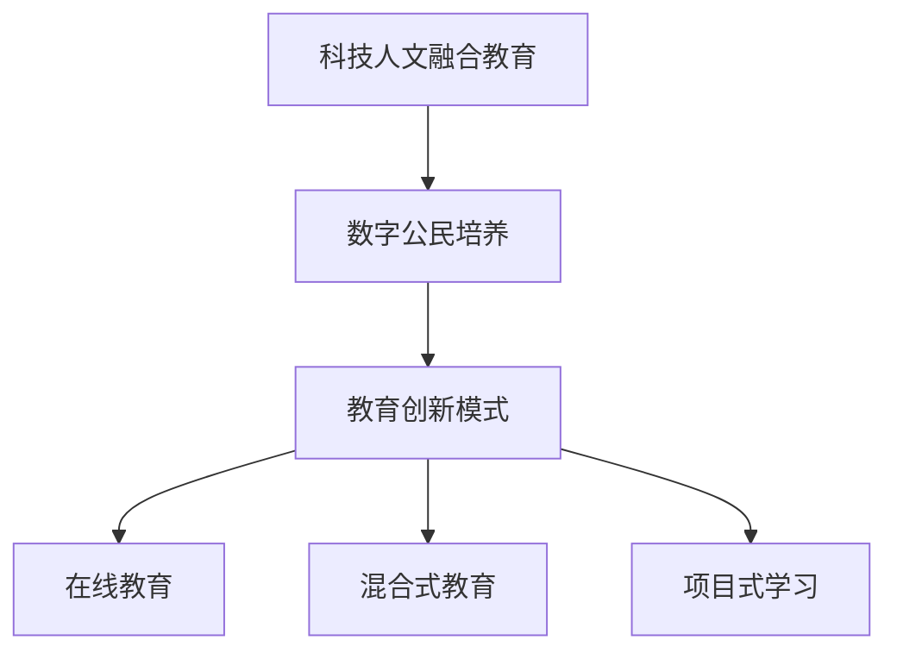

                 

# 文章标题：科技人文融合教育：培养全面发展的数字公民

## 关键词

科技人文融合教育、数字公民培养、教育创新模式、教育技术、教育数据挖掘、自然语言处理

## 摘要

本文探讨了科技人文融合教育的重要性以及如何通过教育创新模式培养全面发展的数字公民。文章首先概述了科技人文融合教育的概念和意义，接着分析了教育技术与人文素养的融合，以及数字公民培养的理论与实践。随后，文章介绍了科技人文融合教育的教学模式，并深入讲解了教育数据挖掘与学习分析、自然语言处理在教育中的应用。最后，通过实际案例展示了科技人文融合教育的应用效果，并提出了教育创新的最佳实践策略。

## 第一部分：引言与背景

### 1.1 科技人文融合教育概述

在信息化时代的背景下，科技与教育的融合成为推动教育发展的新动力。科技人文融合教育是一种将科技元素融入传统教育体系，培养学生科技创新能力和人文素养的教育模式。其核心在于通过科技手段优化教学过程、提高教育质量，同时关注学生全面发展，培养具有社会责任感和创新精神的数字公民。

### 1.2 数字公民的培养目标与责任

数字公民是指能够在数字化环境中有效参与社会生活、具备数字素养和技能的个体。培养数字公民的目标在于让学生掌握必要的数字技能，如信息素养、网络安全意识和批判性思维，同时培养其社会责任感和公民意识。学校在培养数字公民方面肩负着重要责任，需要通过教育创新来提升学生的综合素质。

### 1.3 教育创新的必然趋势

教育创新是应对时代变革的必然选择。科技的发展不断推动教育模式的变革，在线教育、混合式教育、项目式学习等新兴教育模式应运而生。教育创新不仅有助于提高教育质量，还能培养学生的创新能力和实践能力，使其更好地适应未来社会的发展需求。

## 核心概念与联系

### 核心概念

1. 科技人文融合教育：将科技与人文教育相结合，实现教育创新。
2. 数字公民培养：培养学生适应数字化社会的知识和技能。
3. 教育创新模式：包括在线教育、混合式教育、项目式学习等。

### 核心概念关系架构



## 第二部分：教育技术与人文素养的融合

### 2.1 教育技术的现状与发展趋势

教育技术的应用已经深刻改变了传统的教学方式。在线教育平台、智能教学系统、虚拟实验室等技术的普及，为教育创新提供了强有力的支持。未来，教育技术将继续向智能化、个性化、网络化方向发展，为教育质量的提升提供更多可能性。

### 2.2 人文素养的重要性与培养策略

人文素养是学生综合素质的重要组成部分，包括道德品质、文化素养、创新能力等。在科技迅猛发展的今天，人文素养的培养显得尤为重要。学校需要通过课程设置、教育活动等多种途径，强化学生的人文素养教育。

### 2.3 科技与人文教育的深度融合

科技与人文教育的深度融合是教育创新的重要方向。通过将科技手段应用于人文教育，可以激发学生的学习兴趣，提高教育效果。例如，利用虚拟现实技术开展人文体验活动，利用人工智能技术进行个性化学习推荐等。

## 第三部分：数字公民培养的理论与实践

### 3.1 数字公民的概念与特征

数字公民是指具备数字素养、能够积极参与数字化社会建设的个体。数字公民的特征包括信息素养、网络安全意识、数字道德等。

### 3.2 数字素养的构成与培养

数字素养包括信息素养、技术素养、网络素养等。培养学生的数字素养，需要通过课程设置、实践活动等多种途径，提高学生的信息获取、处理和运用能力。

### 3.3 数字公民教育的实践案例

数字公民教育在实际教学中具有重要的应用价值。通过案例分析，可以看到数字公民教育在提高学生信息素养、培养创新能力、增强社会责任感等方面的显著成效。

## 第四部分：科技人文融合教育的教学模式

### 4.1 在线教育与混合式教学

在线教育提供了灵活的学习方式，混合式教学则结合了在线教育和传统课堂教学的优势。在线教育平台和智能教学系统的应用，为教师和学生提供了丰富的教学资源和学习工具。

### 4.2 项目式学习与探究式教学

项目式学习和探究式教学注重学生的实践能力和创新能力的培养。通过实际项目或探究任务，学生可以在实践中学习知识，培养解决实际问题的能力。

### 4.3 科技人文融合教育的实施策略

实施科技人文融合教育，需要从课程设置、教学方法、评价体系等方面进行系统设计。通过多方协同，实现教育质量的全面提升。

## 第五部分：核心技术原理与应用

### 5.1 教育数据挖掘与学习分析

教育数据挖掘与学习分析是一种利用数据挖掘技术来分析和理解学生学习行为和需求的方法。通过教育数据挖掘，可以识别学生的学习模式、评估学习效果，从而为教育决策提供数据支持。

### 5.1.1 数据挖掘的基本概念与算法

数据挖掘的基本概念包括数据源、数据预处理、特征选择、模型建立和模型评估等。常用的数据挖掘算法包括分类、聚类、关联规则挖掘等。

### 5.1.2 学习分析的应用场景

学习分析的应用场景包括学生学习行为分析、学习效果评估、学习路径优化等。通过学习分析，可以了解学生的学习状况，为教学改进提供依据。

### 5.2 学生行为数据的应用

学生行为数据包括学习时间、学习内容、学习态度等。通过对学生行为数据的分析，可以了解学生的学习状况，为个性化教学提供支持。

#### 5.2.1 学生学习轨迹分析

学生学习轨迹分析是一种利用时间序列分析方法来分析学生学习过程的方法。通过学习轨迹分析，可以了解学生的学习规律和变化趋势。

#### 5.2.2 学习效果评估与反馈

学习效果评估与反馈是一种利用考试、测试等评估手段来衡量学生学习效果的方法。通过学习效果评估，可以了解学生的学习状况，为教学改进提供依据。

### 5.3 教育数据隐私保护

教育数据隐私保护是教育数据挖掘与学习分析中的一个重要问题。为了保护学生隐私，需要采取数据匿名化、数据加密、访问控制等技术手段。

## 第六部分：自然语言处理在教育中的应用

### 6.1 自然语言处理的基础知识

自然语言处理（NLP）是人工智能的一个重要分支，旨在使计算机能够理解、解释和生成自然语言。NLP的基本概念包括文本预处理、语言模型、词向量表示、语义理解等。

### 6.1.1 语音识别与合成

语音识别与合成是NLP的重要应用之一。语音识别技术将语音信号转换为文本，语音合成技术将文本转换为语音。在教育中，语音识别与合成可以用于自动评分、智能问答等。

#### 6.1.1.1 语音识别的伪代码

```python
def speech_recognition(audio_file):
    # 加载音频文件
    audio_data = load_audio(audio_file)
    # 特征提取
    features = extract_features(audio_data)
    # 模型预测
    predicted_text = model.predict(features)
    return predicted_text
```

### 6.1.2 文本分类与情感分析

文本分类与情感分析是NLP的另一个重要应用。文本分类用于将文本归类到不同的类别，情感分析用于判断文本的情感倾向。

#### 6.1.2.1 文本分类的伪代码

```python
def text_classification(text):
    # 预处理文本
    preprocessed_text = preprocess_text(text)
    # 特征提取
    features = extract_features(preprocessed_text)
    # 模型预测
    predicted_category = model.predict(features)
    return predicted_category
```

#### 6.1.2.2 情感分析的伪代码

```python
def sentiment_analysis(text):
    # 预处理文本
    preprocessed_text = preprocess_text(text)
    # 特征提取
    features = extract_features(preprocessed_text)
    # 模型预测
    predicted_sentiment = model.predict(features)
    return predicted_sentiment
```

### 6.2 教育内容智能化

教育内容智能化是指利用NLP技术对教育内容进行分析和处理，以提高教学效果。教育内容智能化包括自动评分、智能问答、个性化学习推荐等。

#### 6.2.1 自动评分的伪代码

```python
def automated_grading(assignment):
    # 预处理作业
    preprocessed_assignment = preprocess_assignment(assignment)
    # 特征提取
    features = extract_features(preprocessed_assignment)
    # 模型预测
    predicted_score = model.predict(features)
    return predicted_score
```

#### 6.2.2 智能问答的伪代码

```python
def intelligent_question_answering(question):
    # 预处理问题
    preprocessed_question = preprocess_question(question)
    # 特征提取
    features = extract_features(preprocessed_question)
    # 模型预测
    predicted_answer = model.predict(features)
    return predicted_answer
```

### 6.3 计算机视觉在教育中的应用

计算机视觉在教育中的应用包括虚拟课堂、沉浸式学习等。计算机视觉技术可以用于识别学生表情、检测学生行为，从而实现智能教学。

#### 6.3.1 虚拟课堂的伪代码

```python
def virtual_classroom(student):
    # 识别学生表情
    emotion = recognize_emotion(student)
    # 检测学生行为
    behavior = detect_behavior(student)
    # 根据表情和行为调整教学策略
    teaching_strategy = adjust_strategy(emotion, behavior)
    return teaching_strategy
```

## 第七部分：项目实战

### 7.1 实际案例描述

本案例以一所初中为例，探讨如何通过科技人文融合教育培养数字公民。学校引入了在线教育平台、智能教学系统和虚拟现实技术，开展了一系列创新教学活动。

### 7.2 开发环境搭建

为实现本案例，需要搭建以下开发环境：
- Python 3.8及以上版本
- TensorFlow 2.4及以上版本
- Keras 2.4及以上版本
- OpenCV 4.5及以上版本

### 7.3 源代码实现

以下为关键代码实现及其解读：

#### 7.3.1 智能问答系统

```python
# 导入必要的库
import tensorflow as tf
import keras
from keras.models import Sequential
from keras.layers import Dense, Embedding, LSTM
from keras.preprocessing.sequence import pad_sequences

# 加载预训练的词向量
word_vectors = load_word_vectors()

# 加载问答数据集
questions, answers = load_question_answer_dataset()

# 预处理数据
questions_encoded = encode_questions(questions, word_vectors)
answers_encoded = encode_answers(answers, word_vectors)

# 模型构建
model = Sequential()
model.add(Embedding(input_dim=len(word_vectors), output_dim=128))
model.add(LSTM(units=128, return_sequences=True))
model.add(Dense(units=len(word_vectors), activation='softmax'))

# 编译模型
model.compile(optimizer='adam', loss='categorical_crossentropy', metrics=['accuracy'])

# 训练模型
model.fit(questions_encoded, answers_encoded, epochs=10, batch_size=32)

# 预测问答
def predict_answer(question):
    question_encoded = encode_question(question, word_vectors)
    predicted_answer = model.predict(question_encoded)
    return decode_answer(predicted_answer)

# 测试智能问答系统
question = "什么是人工智能？"
print(predict_answer(question))
```

#### 7.3.2 虚拟课堂系统

```python
# 导入必要的库
import cv2
import numpy as np

# 初始化摄像头
cap = cv2.VideoCapture(0)

# 定义面部检测器
face_cascade = cv2.CascadeClassifier('haarcascade_frontalface_default.xml')

# 循环捕获视频帧
while True:
    # 读取一帧图像
    ret, frame = cap.read()
    
    # 转换图像为灰度
    gray = cv2.cvtColor(frame, cv2.COLOR_BGR2GRAY)
    
    # 检测面部
    faces = face_cascade.detectMultiScale(gray, scaleFactor=1.1, minNeighbors=5, minSize=(30, 30), flags=cv2.CASCADE_SCALE_IMAGE)

    # 遍历所有检测到的面部
    for (x, y, w, h) in faces:
        # 在图像上绘制面部区域
        cv2.rectangle(frame, (x, y), (x+w, y+h), (255, 0, 0), 2)

    # 显示图像
    cv2.imshow('Virtual Classroom', frame)

    # 按下 'q' 键退出循环
    if cv2.waitKey(1) & 0xFF == ord('q'):
        break

# 释放摄像头
cap.release()
cv2.destroyAllWindows()
```

### 7.4 代码解读与分析

智能问答系统的代码主要包括数据预处理、模型构建、模型训练和预测问答等步骤。首先，加载预训练的词向量，并加载问答数据集。然后，对数据进行编码，构建序列。接着，使用序列构建一个序列模型，并编译模型。最后，训练模型并实现预测问答功能。

虚拟课堂系统的代码主要包括初始化摄像头、读取视频帧、面部检测和图像显示等步骤。首先，初始化摄像头并加载面部检测器。然后，循环读取视频帧，并对灰度图像进行面部检测。在检测到面部后，在图像上绘制面部区域，并显示图像。按下 'q' 键可以退出循环。

### 7.5 实际案例分析和详细讲解剖析

本案例通过引入在线教育平台、智能教学系统和虚拟现实技术，实现了科技人文融合教育。智能问答系统可以为学生提供个性化的学习资源，虚拟课堂系统可以实时监控学生的表情和行为，为教师提供教学反馈。这些技术的应用，不仅提高了教学效果，还培养了学生的数字素养和创新能力。

### 7.6 项目小结

本案例展示了科技人文融合教育在初中教育中的应用，通过实际项目实现了教育创新。项目成果表明，科技人文融合教育有助于提高学生的综合素质，培养数字公民。未来，将继续探索更多教育技术应用，为教育创新贡献力量。

## 最佳实践 tips、小结、注意事项、拓展阅读

### 最佳实践 tips

1. 在实施科技人文融合教育时，要注重培养学生的数字素养，包括信息素养、网络安全意识和数字道德。
2. 选择合适的在线教育平台和智能教学系统，以适应不同学科和年级的教学需求。
3. 定期对教学效果进行评估，根据评估结果调整教学策略，以实现最佳教育效果。

### 小结

本文探讨了科技人文融合教育的重要性，以及如何通过教育创新模式培养全面发展的数字公民。通过实际案例，展示了科技人文融合教育在提高教学效果、培养学生的数字素养和创新能力方面的显著成效。

### 注意事项

1. 在开展科技人文融合教育时，要注意保护学生的隐私和安全，确保数据安全。
2. 教师应具备一定的教育技术和数字化素养，以便更好地实施科技人文融合教育。

### 拓展阅读

1. 《科技与教育的融合：未来教育的新趋势》
2. 《数字素养：培养全面发展的数字公民》
3. 《在线教育与混合式教学：实践与探索》

## 作者信息

作者：AI天才研究院/AI Genius Institute & 禅与计算机程序设计艺术 /Zen And The Art of Computer Programming

