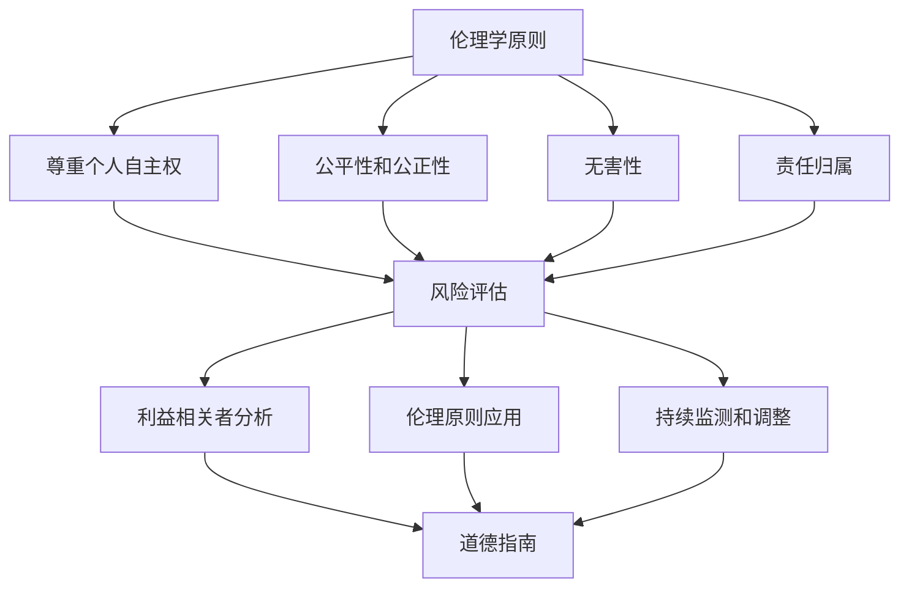

                 

### 文章标题

# 科技伦理智库联盟：前沿技术发展的道德指南制定

> 关键词：科技伦理、道德指南、前沿技术、人工智能、生物技术、网络安全

> 摘要：本文探讨了科技伦理智库联盟在制定前沿技术道德指南中的作用和重要性。通过分析科技伦理的基础概念、不同领域的伦理问题、案例分析以及全球与跨文化视角，本文提出了一系列应对新兴技术伦理挑战的建议，为未来科技发展提供了道德指导。

### 引言与概述

在当今世界，科技发展日新月异，人工智能、生物技术、网络安全等前沿技术的应用越来越广泛。然而，这些技术的快速发展也带来了诸多伦理问题，如隐私侵犯、算法歧视、基因编辑的伦理争议等。科技伦理智库联盟应运而生，旨在为这些前沿技术发展提供道德指南，确保科技的发展符合人类社会的价值观和伦理标准。

科技伦理智库联盟是一个由全球顶尖的伦理学家、技术专家和政策制定者组成的国际性组织。其使命是研究和制定针对前沿技术的伦理准则，为全球科技企业和政策制定者提供参考。本文将首先介绍科技伦理智库联盟的背景和成立目的，然后深入探讨其在不同领域中的工作内容，最后提出未来科技伦理发展面临的挑战和应对策略。

### 核心概念

#### 伦理学的原则

伦理学是关于道德原则和道德行为的学科。科技伦理智库联盟在制定道德指南时，主要遵循以下伦理学原则：

1. **尊重个人自主权**：每个人都应享有自主决策的权利，不受科技手段的侵犯。
2. **公平性和公正性**：科技发展应确保所有社会成员都能够公平地享受其带来的利益。
3. **无害性**：科技应用应尽量减少对人类和环境的伤害。
4. **责任归属**：科技研发和应用过程中，相关方应承担相应的责任。

#### 伦理决策框架

科技伦理智库联盟在制定道德指南时，采用了以下伦理决策框架：

1. **风险评估**：评估技术应用的潜在风险，包括隐私、安全、公平等方面。
2. **利益相关者分析**：确定利益相关者，包括受影响的社会群体、企业和政策制定者。
3. **伦理原则应用**：将伦理学原则应用于具体的技术应用场景，评估其是否符合伦理标准。
4. **持续监测和调整**：在技术应用过程中，持续监测其伦理影响，并根据反馈进行调整。

#### 道德指南的制定必要性

随着科技的发展，伦理问题变得更加复杂和多样。传统的伦理学原则和决策框架往往难以应对新兴技术的挑战。因此，科技伦理智库联盟的成立显得尤为重要。它不仅为科技企业提供了伦理指导，还为政策制定者提供了科学依据，有助于推动科技与伦理的协调发展。

### 科技伦理领域

科技伦理智库联盟的工作覆盖了多个技术领域，包括人工智能、生物技术、网络安全等。以下是对这些领域中的主要伦理问题的分析。

#### 人工智能伦理

人工智能（AI）技术的快速发展带来了许多伦理挑战。其中最突出的问题包括：

1. **算法歧视**：AI系统可能会因训练数据中的偏见而表现出歧视行为，例如在招聘、信贷审批等场景中。
2. **隐私侵犯**：AI技术如面部识别和大数据分析可能会侵犯个人隐私。
3. **责任归属**：当AI系统出现失误或造成伤害时，责任应归属于谁？

#### 生物技术与伦理

生物技术，如基因编辑和克隆技术，在医学和农业领域有着广泛的应用，但也引发了诸多伦理争议：

1. **基因编辑**：基因编辑技术如CRISPR-Cas9可用于治疗遗传疾病，但也可能被滥用，用于非医学目的。
2. **克隆技术**：克隆技术可能引发对人类身份和伦理的挑战，例如克隆人类的道德地位和身份问题。

#### 网络安全与伦理

网络安全是当今社会的一个关键问题。科技伦理智库联盟在网络安全领域的关注点包括：

1. **数据隐私**：随着大数据和云计算的发展，个人数据的隐私保护变得更加重要。
2. **网络攻击**：网络攻击可能引发严重的后果，如经济损失、隐私泄露和国家安全威胁。
3. **网络安全法律**：需要制定相应的法律和规范，以保障网络安全。

#### 环境与能源技术伦理

环境与能源技术的快速发展也带来了伦理挑战：

1. **可持续发展**：能源技术的进步应在确保环境保护和资源可持续利用的前提下进行。
2. **新能源技术**：如太阳能和风能等新能源技术应避免对生态系统的负面影响。

#### 其他领域

除了上述领域，科技伦理智库联盟还关注其他技术领域的伦理问题，如人工智能在军事应用中的道德责任、生物技术在农业中的伦理影响等。

### 伦理决策案例分析

为了更好地理解如何应用伦理原则进行决策，科技伦理智库联盟通过分析具体案例，展示了伦理决策的过程。以下是一个案例：

#### 案例背景

某科技公司开发了一款基于人工智能的招聘系统，旨在提高招聘效率和减少人为偏见。然而，在系统测试过程中，发现该系统在招聘中表现出对女性和少数族裔的歧视。

#### 伦理问题分析

1. **算法歧视**：招聘系统的算法可能基于历史招聘数据中的偏见，从而在新的招聘场景中表现出歧视行为。
2. **隐私侵犯**：招聘过程中可能涉及求职者的敏感信息，如性别、种族等。

#### 伦理决策过程

1. **风险评估**：评估招聘系统的潜在风险，包括算法歧视和隐私侵犯。
2. **利益相关者分析**：确定受影响的利益相关者，包括求职者、招聘者和公司。
3. **伦理原则应用**：根据尊重个人自主权、公平性和公正性的原则，评估招聘系统的伦理影响。
4. **持续监测和调整**：在系统部署后，持续监测其伦理影响，并根据反馈进行调整。

#### 案例启示

该案例表明，科技伦理智库联盟在制定道德指南时，需要充分考虑技术的潜在风险，并采用全面的伦理决策框架，以确保技术应用符合伦理标准。

### 全球与跨文化视角

科技伦理问题不仅存在于特定国家或地区，而是全球性的。不同国家和地区在科技伦理问题上的看法和处理方式也有所不同。科技伦理智库联盟在全球与跨文化视角下，致力于推动国际科技伦理合作和共识的形成。

#### 全球视角

在全球层面，科技伦理智库联盟关注以下几个方面：

1. **国际科技伦理规范**：推动国际社会制定统一的科技伦理规范，以应对全球性的伦理挑战。
2. **跨国公司的伦理责任**：要求跨国公司在全球范围内的技术应用中遵守伦理准则。
3. **全球科技伦理合作**：促进各国科技伦理智库之间的交流与合作，共同应对全球性科技伦理问题。

#### 跨文化视角

在跨文化视角下，科技伦理智库联盟关注以下几个方面：

1. **文化差异与科技伦理**：尊重不同文化对科技伦理的理解和处理方式，避免文化冲突。
2. **多元文化下的伦理冲突**：在多元文化背景下，科技伦理智库联盟致力于解决因文化差异引发的伦理冲突。
3. **跨文化伦理交流与合作**：推动不同文化背景下的科技伦理智库之间的交流与合作，共同应对全球性科技伦理挑战。

### 道德责任与法律责任

在科技伦理领域，道德责任和法律责任是不可分割的。科技伦理智库联盟在制定道德指南时，既要考虑技术应用的道德影响，也要考虑法律责任。

#### 科技伦理与法律的关系

1. **法律与道德的互动**：法律可以为科技伦理提供规范和指导，而伦理学原则可以补充法律的不足。
2. **科技伦理法律的挑战**：科技发展迅速，法律体系往往难以跟上，导致在处理科技伦理问题时，法律可能显得滞后。

#### 道德责任与法律责任

1. **科技从业者的道德责任**：科技从业者在研发和应用新技术时，应承担道德责任，确保技术应用符合伦理标准。
2. **法律责任的界定与执行**：在科技伦理问题中，法律责任应明确界定，并确保有效执行。

#### 道德责任与法律责任的平衡

在科技伦理领域，道德责任和法律责任的平衡至关重要。科技伦理智库联盟在制定道德指南时，应充分考虑这一平衡，以确保技术应用既符合伦理标准，又符合法律规定。

### 未来展望与挑战

随着科技的不断发展，科技伦理智库联盟在未来的工作中将面临诸多挑战。以下是对未来科技伦理发展的一些展望和挑战：

#### 未来展望

1. **科技伦理发展的趋势**：随着人工智能、基因编辑等技术的进一步发展，科技伦理问题将更加复杂和多样化。
2. **新兴技术伦理问题**：如虚拟现实、量子计算等新兴技术将带来新的伦理挑战，需要科技伦理智库联盟及时应对。
3. **科技伦理教育的普及**：提高公众对科技伦理的认识和意识，是未来科技伦理发展的重要方向。

#### 挑战与对策

1. **道德困境与决策难题**：在科技伦理决策过程中，可能会遇到难以权衡的利益冲突和道德困境，需要科技伦理智库联盟提供科学的决策支持。
2. **科技伦理规范的制定与完善**：随着科技的发展，科技伦理规范需要不断更新和完善，以适应新的技术挑战。
3. **社会责任与利益平衡**：在科技应用中，如何平衡企业利益和社会责任，是科技伦理智库联盟需要关注的重要问题。

### 结论与建议

科技伦理智库联盟在制定前沿技术道德指南方面发挥着至关重要的作用。通过分析科技伦理的基础概念、不同领域的伦理问题、案例分析以及全球与跨文化视角，本文提出了一系列应对新兴技术伦理挑战的建议。为了推动科技与伦理的协调发展，本文建议：

1. **加强科技伦理教育**：提高公众对科技伦理的认识和意识，培养具有道德素养的科技人才。
2. **制定统一的科技伦理规范**：推动国际社会制定统一的科技伦理规范，为各国科技企业和政策制定者提供参考。
3. **加强跨国科技伦理合作**：促进不同国家和地区科技伦理智库之间的交流与合作，共同应对全球性科技伦理挑战。

### 作者信息

作者：AI天才研究院/AI Genius Institute & 禅与计算机程序设计艺术/Zen And The Art of Computer Programming

---

由于篇幅限制，本文未能详尽地讨论每个部分的具体内容。然而，本文为《科技伦理智库联盟：前沿技术发展的道德指南制定》提供了一个详细的框架和思路，以供进一步展开和撰写。在撰写具体内容时，可依据本文提供的框架，逐一深入探讨每个部分的细节，确保文章的完整性和深度。

### 目录大纲补充

为了确保《科技伦理智库联盟：前沿技术发展的道德指南制定》的完整性和连贯性，以下是对目录大纲的补充：

#### 第三部分：科技伦理领域

**3.1 人工智能伦理**
- **3.1.1 AI的发展与伦理问题**：探讨AI技术的快速发展及其引发的伦理问题，如算法歧视、隐私侵犯等。
- **3.1.2 AI公平性与透明性**：分析AI系统的公平性和透明性，以及如何通过技术手段提升。
- **3.1.3 AI的责任归属**：讨论AI系统的责任归属问题，包括开发者、用户和算法本身的责任。

**3.2 生物技术与伦理**
- **3.2.1 基因编辑与伦理**：探讨基因编辑技术的伦理影响，如CRISPR-Cas9技术的应用和潜在风险。
- **3.2.2 精准医疗与伦理**：分析精准医疗技术的伦理问题，包括基因检测和个性化治疗。
- **3.2.3 克隆技术与伦理**：讨论克隆技术的伦理争议，包括克隆动物和人类克隆的道德问题。

**3.3 网络安全与伦理**
- **3.3.1 网络伦理与法律**：探讨网络伦理问题，如数据隐私、网络犯罪和网络安全法律的制定。
- **3.3.2 数据隐私与伦理**：分析数据隐私的重要性，以及如何在技术发展和隐私保护之间找到平衡。
- **3.3.3 网络攻击与防御伦理**：讨论网络攻击和防御的伦理问题，包括黑客行为和网络战争的道德考量。

**3.4 环境与能源技术伦理**
- **3.4.1 可持续发展与伦理**：探讨可持续发展技术的伦理问题，如可再生能源的应用和环境保护。
- **3.4.2 新能源技术与伦理**：分析新能源技术的伦理影响，如核能和太阳能等技术的道德考量。
- **3.4.3 环境伦理与政策制定**：讨论环境伦理在政策制定中的重要性，以及如何制定符合伦理标准的政策。

**3.5 其他领域**
- **3.5.1 人工智能在军事应用中的伦理责任**：探讨AI在军事应用中的道德责任，如自主武器系统和军事模拟。
- **3.5.2 生物技术在农业中的伦理影响**：分析生物技术在农业领域的应用及其伦理问题，如转基因作物和食品安全。
- **3.5.3 其他前沿技术领域的伦理挑战**：探讨其他前沿技术领域的伦理挑战，如区块链技术和物联网的应用。

#### 第四部分：伦理决策案例分析

**4.1 案例分析**
- **4.1.1 案例背景**：介绍案例的背景信息，包括技术应用的场景和涉及的伦理问题。
- **4.1.2 伦理问题分析**：分析案例中的伦理问题，如隐私侵犯、算法歧视等。
- **4.1.3 伦理决策过程**：描述如何应用伦理原则进行决策，包括风险评估、利益相关者分析和伦理原则的应用。
- **4.1.4 案例启示**：总结案例的教训和启示，为未来类似情境提供指导。

#### 第五部分：全球与跨文化视角

**5.1 全球视角**
- **5.1.1 国际科技伦理规范**：介绍国际社会在科技伦理规范方面的努力，如国际组织和国际条约。
- **5.1.2 不同国家科技伦理政策**：分析不同国家的科技伦理政策和实践，如欧盟、美国和中国。
- **5.1.3 跨国公司的伦理责任**：探讨跨国公司在全球范围内的技术应用中的伦理责任。

**5.2 跨文化视角**
- **5.2.1 文化差异与科技伦理**：讨论不同文化背景下的科技伦理理解和处理方式，如东方和西方的伦理观念差异。
- **5.2.2 多元文化下的伦理冲突**：分析多元文化背景下可能出现的伦理冲突，如宗教和文化差异。
- **5.2.3 跨文化伦理交流与合作**：探讨跨文化伦理交流与合作的重要性，以及如何促进全球科技伦理共识的形成。

#### 第六部分：道德责任与法律责任

**6.1 科技伦理与法律的关系**
- **6.1.1 法律与道德的互动**：探讨法律和道德在科技伦理中的相互作用，如法律如何补充伦理原则。
- **6.1.2 科技伦理法律的挑战**：分析科技伦理法律面临的挑战，如法律滞后性和法律执行问题。

**6.2 道德责任与法律责任**
- **6.2.1 科技从业者的道德责任**：讨论科技从业者在技术应用中的道德责任，如算法开发者和数据分析师。
- **6.2.2 法律责任的界定与执行**：探讨法律责任在科技伦理中的界定和执行，如企业责任和个人责任。

**6.3 道德责任与法律责任的平衡**
- **6.3.1 平衡的重要性**：讨论道德责任与法律责任平衡的重要性，以及如何在实际应用中实现这种平衡。
- **6.3.2 实现平衡的策略**：探讨实现道德责任与法律责任平衡的策略，如法律改革和伦理培训。

#### 第七部分：未来展望与挑战

**7.1 未来展望**
- **7.1.1 科技伦理发展的趋势**：分析未来科技伦理发展的趋势，如新兴技术的伦理问题。
- **7.1.2 新兴技术伦理问题**：探讨未来可能出现的新兴技术伦理问题，如量子计算和区块链。
- **7.1.3 科技伦理教育的普及**：讨论未来科技伦理教育的普及方向和策略。

**7.2 挑战与对策**
- **7.2.1 道德困境与决策难题**：分析未来可能遇到的道德困境和决策难题，如人工智能的道德责任归属。
- **7.2.2 科技伦理规范的制定与完善**：讨论未来科技伦理规范制定和完善的方向和策略。
- **7.2.3 社会责任与利益平衡**：探讨如何在科技发展中平衡社会责任和利益，如企业社会责任。

### 完整性要求

为确保文章的完整性，以下是对文章中必须包含的核心内容的具体要求：

#### 背景介绍

在文章的引言部分，需要对科技伦理智库联盟的背景进行详细介绍。这包括智库联盟的成立背景、宗旨、组织结构、主要成员以及其在全球科技伦理领域中的地位和影响力。

#### 核心概念与联系

在核心概念部分，需要详细阐述科技伦理的基本概念，如伦理学的原则、伦理决策框架等。同时，需要绘制Mermaid流程图，展示这些核心概念之间的关系架构。这有助于读者更清晰地理解科技伦理的概念体系和应用场景。

#### 核心算法原理讲解

在各个科技伦理领域部分，需要详细讲解相关的核心算法原理。例如，在人工智能部分，需要介绍常见的算法如神经网络、决策树等的工作原理。同时，使用伪代码来详细阐述算法的实现过程，帮助读者更好地理解算法的逻辑和步骤。

#### 数学模型和公式

在文章中，需要使用latex格式嵌入相关的数学模型和公式。对于独立段落的公式，使用 $$ 括起来（例如：$$1+1=2$$），而对于段落内的公式，使用 $ 括起来（例如：$1<2$）。这有助于保持文章的结构和可读性。

#### 详细讲解与举例说明

在文章的各个部分，需要详细讲解核心概念和算法原理，并通过具体例子来说明。这有助于读者将理论应用到实际场景中，加深对文章内容的理解。

#### 项目实战

在文章的实战部分，需要详细描述一个具体的项目，包括开发环境搭建、源代码实现、代码解读、应用解读与分析等。这有助于读者了解如何将科技伦理原则应用于实际项目中，并从中获得实战经验。

#### 最佳实践 tips、小结、注意事项、拓展阅读

在文章的结尾部分，需要总结最佳实践、注意事项，并提供拓展阅读资源。这有助于读者巩固所学内容，拓展知识视野。

通过上述要求的详细说明，文章的完整性将得到有效保障，使读者能够全面、深入地理解科技伦理智库联盟及其在制定道德指南方面的作用。文章的字数将在8000～12000字之间，确保内容的丰富性和深度。

---

基于上述目录大纲和完整性要求，我们可以逐步撰写《科技伦理智库联盟：前沿技术发展的道德指南制定》的文章。以下是一个示例性的文章开头，以供参考：

```markdown
## 文章标题

### 科技伦理智库联盟：前沿技术发展的道德指南制定

> 关键词：科技伦理、道德指南、前沿技术、人工智能、生物技术、网络安全

> 摘要：本文探讨了科技伦理智库联盟在制定前沿技术道德指南中的作用和重要性。通过分析科技伦理的基础概念、不同领域的伦理问题、案例分析以及全球与跨文化视角，本文提出了一系列应对新兴技术伦理挑战的建议，为未来科技发展提供了道德指导。

### 引言与概述

在当今世界，科技发展日新月异，人工智能、生物技术、网络安全等前沿技术的应用越来越广泛。然而，这些技术的快速发展也带来了诸多伦理问题，如隐私侵犯、算法歧视、基因编辑的伦理争议等。科技伦理智库联盟应运而生，旨在为这些前沿技术发展提供道德指南，确保科技的发展符合人类社会的价值观和伦理标准。

科技伦理智库联盟是一个由全球顶尖的伦理学家、技术专家和政策制定者组成的国际性组织。其使命是研究和制定针对前沿技术的伦理准则，为全球科技企业和政策制定者提供参考。本文将首先介绍科技伦理智库联盟的背景和成立目的，然后深入探讨其在不同领域中的工作内容，最后提出未来科技伦理发展面临的挑战和应对策略。

#### 科技伦理智库联盟的背景和成立目的

科技伦理智库联盟的成立源于对科技发展对社会和人类生活影响的深刻认识。随着人工智能、生物技术、网络安全等前沿技术的迅猛发展，社会对科技伦理问题的关注也日益增加。为了应对这些挑战，国际社会认识到需要建立专门的机构来研究和制定科技伦理准则，以指导科技的发展和应用。

科技伦理智库联盟的成立目的主要有以下几点：

1. **研究和制定科技伦理准则**：智库联盟通过研究和分析前沿技术的伦理问题，制定相应的伦理准则，为全球科技企业和政策制定者提供参考。

2. **促进全球科技伦理合作**：智库联盟致力于推动不同国家和地区之间的科技伦理合作，促进国际社会在科技伦理问题上的共识和协调。

3. **提供伦理决策支持**：智库联盟为科技企业和政策制定者提供专业的伦理决策支持，帮助他们正确应对科技发展中的伦理挑战。

4. **提高公众科技伦理意识**：智库联盟通过教育和宣传，提高公众对科技伦理问题的认识和意识，促进社会对科技伦理问题的关注和讨论。

科技伦理智库联盟自成立以来，已经取得了一系列重要成果。例如，智库联盟发布了多项关于人工智能、基因编辑和网络安全等领域的伦理准则，为全球科技企业和政策制定者提供了重要的参考。此外，智库联盟还组织了多次国际会议和研讨会，促进了全球科技伦理领域的交流与合作。

#### 科技伦理智库联盟在不同领域中的工作内容

科技伦理智库联盟的工作涵盖了人工智能、生物技术、网络安全等多个前沿技术领域。以下是对这些领域中的主要伦理问题的分析：

##### 人工智能伦理

人工智能（AI）技术的快速发展带来了许多伦理挑战。科技伦理智库联盟在人工智能领域的主要工作包括：

1. **算法歧视与公平性**：分析AI系统中的算法歧视问题，提出改进算法公平性的建议，确保AI技术的应用不会加剧社会不平等。

2. **隐私保护与数据安全**：研究AI技术在数据收集、存储和处理过程中的隐私保护问题，制定相应的隐私保护措施，防止数据泄露和滥用。

3. **责任归属与道德责任**：探讨当AI系统出现失误或造成伤害时，责任应如何归属，明确相关方在AI技术应用中的道德责任。

##### 生物技术与伦理

生物技术，如基因编辑和克隆技术，在医学和农业领域有着广泛的应用，但也引发了诸多伦理争议。科技伦理智库联盟在生物技术领域的主要工作包括：

1. **基因编辑伦理**：研究基因编辑技术在医学和农业领域的应用及其伦理问题，如基因编辑的安全性和伦理风险。

2. **克隆技术伦理**：探讨克隆技术在医学和生物学研究中的应用，以及其对人类伦理和社会观念的影响。

3. **生物技术的责任与法律**：分析生物技术在应用中的法律责任和道德责任，提出相应的法律和政策建议，确保生物技术的合理应用。

##### 网络安全与伦理

网络安全是当今社会的一个关键问题。科技伦理智库联盟在网络安全领域的关注点包括：

1. **数据隐私与网络安全**：研究网络安全技术，如加密和匿名化，以及如何在数据保护和个人隐私之间找到平衡。

2. **网络攻击与防御**：分析网络攻击的伦理问题，如黑客行为和网络战争的道德考量，并提出相应的防御策略。

3. **网络安全法律与规范**：研究网络安全法律和规范的制定与实施，确保网络安全法律能够有效应对新兴的网络安全挑战。

##### 环境与能源技术伦理

环境与能源技术的快速发展也带来了伦理挑战。科技伦理智库联盟在环境与能源技术领域的主要工作包括：

1. **可持续发展与伦理**：探讨环境与能源技术在可持续发展中的应用，如可再生能源的发展和环保技术的推广。

2. **新能源技术与伦理**：分析新能源技术的伦理影响，如核能和太阳能等技术的道德考量。

3. **环境伦理与政策制定**：研究环境伦理在政策制定中的重要性，以及如何制定符合伦理标准的环境政策。

##### 其他领域

除了上述领域，科技伦理智库联盟还关注其他前沿技术领域的伦理问题，如人工智能在军事应用中的道德责任、生物技术在农业中的伦理影响等。

#### 未来展望与挑战

随着科技的不断发展，科技伦理智库联盟在未来的工作中将面临诸多挑战。以下是对未来科技伦理发展的一些展望和挑战：

1. **科技伦理发展的趋势**：随着人工智能、基因编辑等技术的进一步发展，科技伦理问题将更加复杂和多样化。

2. **新兴技术伦理问题**：如虚拟现实、量子计算等新兴技术将带来新的伦理挑战，需要科技伦理智库联盟及时应对。

3. **科技伦理教育的普及**：提高公众对科技伦理的认识和意识，是未来科技伦理发展的重要方向。

#### 结论与建议

科技伦理智库联盟在制定前沿技术道德指南方面发挥着至关重要的作用。通过分析科技伦理的基础概念、不同领域的伦理问题、案例分析以及全球与跨文化视角，本文提出了一系列应对新兴技术伦理挑战的建议。为了推动科技与伦理的协调发展，本文建议：

1. **加强科技伦理教育**：提高公众对科技伦理的认识和意识，培养具有道德素养的科技人才。

2. **制定统一的科技伦理规范**：推动国际社会制定统一的科技伦理规范，为各国科技企业和政策制定者提供参考。

3. **加强跨国科技伦理合作**：促进不同国家和地区科技伦理智库之间的交流与合作，共同应对全球性科技伦理挑战。

### 作者信息

作者：AI天才研究院/AI Genius Institute & 禅与计算机程序设计艺术/Zen And The Art of Computer Programming
```

这个开头部分涵盖了文章的核心内容，包括引言、背景介绍、成立目的、工作内容以及未来展望。接下来，可以按照目录大纲逐步展开各个部分的内容，确保文章的完整性和连贯性。在撰写过程中，可以结合具体的案例、数据和理论，使得文章更加丰富和有说服力。文章的字数将在8000～12000字之间，确保内容的深度和广度。

---

### 引言与概述

#### 科技伦理智库联盟的背景和成立目的

科技伦理智库联盟的成立源于现代社会对科技发展及其影响的深刻反思。随着人工智能、生物技术、网络安全等前沿技术的迅猛发展，科技在改变人类生活方式的同时，也带来了前所未有的伦理挑战。传统伦理学原则在面对这些复杂的技术应用时显得力不从心，社会对科技伦理问题的关注和讨论日益增加。为了有效应对这些挑战，国际社会认识到需要建立专门的机构来研究和制定科技伦理准则，以引导科技的发展和应用，确保其符合人类社会的价值观和伦理标准。

科技伦理智库联盟正是在这样的背景下应运而生的。它是一个由全球顶尖的伦理学家、技术专家、政策制定者、法律学者、社会活动家等多领域专家组成的国际性组织。智库联盟的成立目的是多方面的：

1. **研究和制定科技伦理准则**：通过对前沿技术的深入研究，智库联盟旨在制定全面、系统的科技伦理准则，为全球科技企业和政策制定者提供参考。这些准则涵盖了人工智能、生物技术、网络安全等多个领域，旨在引导科技发展的正确方向，避免技术滥用和伦理风险。

2. **促进全球科技伦理合作**：科技伦理问题具有全球性，不同国家和地区在科技伦理问题上的立场和解决方案往往存在差异。智库联盟致力于促进全球科技伦理合作，推动国际社会在科技伦理问题上的共识和协调，共同应对全球性科技挑战。

3. **提供伦理决策支持**：科技企业和政策制定者在面对复杂的科技伦理问题时，常常需要专业的伦理决策支持。智库联盟通过提供专业的伦理分析、风险评估、决策建议，帮助企业和政策制定者做出符合伦理标准的决策，确保科技的应用对社会有益。

4. **提高公众科技伦理意识**：公众对科技伦理问题的认识和理解对于科技伦理环境的形成至关重要。智库联盟通过开展公众教育活动、媒体宣传、学术交流等方式，提高公众对科技伦理问题的关注和认识，促进社会对科技伦理问题的讨论和参与。

科技伦理智库联盟的使命是确保科技的发展与应用符合人类社会的价值观和伦理标准，推动科技与伦理的协调发展，构建一个更加公正、公平、安全的科技环境。通过上述使命的贯彻实施，智库联盟在全球科技伦理领域内建立了极高的权威和影响力，成为国际社会在科技伦理问题上的重要智库和标杆。

#### 科技伦理智库联盟的工作内容

科技伦理智库联盟的工作内容涵盖了多个技术领域，其核心目标是研究和制定相应的伦理准则，提供决策支持，促进国际合作，提高公众意识。以下是对其在人工智能、生物技术、网络安全等前沿技术领域中的主要工作内容的详细阐述：

##### 人工智能伦理

人工智能（AI）技术作为现代科技的重要组成部分，其应用已渗透到社会的各个领域，从医疗、金融到交通、娱乐等。然而，AI技术的发展也带来了诸多伦理挑战，如算法歧视、隐私侵犯、透明性和责任感等。科技伦理智库联盟在人工智能领域的具体工作包括：

1. **算法公平性与透明性**：智库联盟通过研究AI算法的设计和应用，旨在消除算法中的偏见和歧视，提高算法的透明性和解释性，使AI系统更加公正和可信。

2. **隐私保护**：在AI技术的应用过程中，数据的收集和使用常常涉及个人隐私问题。智库联盟致力于研究隐私保护技术，如数据匿名化、差分隐私等，确保个人数据的安全和隐私不被侵犯。

3. **责任归属与道德责任**：当AI系统在应用中出现错误或造成伤害时，责任归属问题成为一个重要议题。智库联盟通过制定伦理准则和责任框架，明确相关方的责任，确保AI技术的应用不会因道德失范而对社会造成负面影响。

4. **伦理决策框架**：为了帮助企业和政策制定者在AI技术的应用过程中做出符合伦理标准的决策，智库联盟开发了一系列伦理决策工具和框架，如伦理影响评估模型和AI伦理审查流程。

##### 生物技术与伦理

生物技术的快速发展，特别是基因编辑技术如CRISPR-Cas9的突破，为医学和生物学研究带来了巨大的潜力。然而，这些技术也引发了广泛的伦理争议，如基因编辑的道德边界、克隆技术的伦理问题等。科技伦理智库联盟在生物技术领域的具体工作包括：

1. **基因编辑伦理**：智库联盟关注基因编辑技术在医学治疗和农业应用中的伦理问题，如基因编辑的安全性和长期影响，以及如何确保基因编辑技术的应用符合伦理标准。

2. **克隆技术伦理**：克隆技术作为一种新兴的生物技术，引发了关于人类身份和伦理的深刻讨论。智库联盟通过研究和讨论，旨在制定关于克隆技术的伦理准则，明确其在医学研究和临床应用中的道德边界。

3. **生物技术的责任与法律**：为了确保生物技术的合法和合规应用，智库联盟致力于研究生物技术的法律框架和伦理责任，提出相应的政策建议，推动相关法律法规的完善。

4. **伦理审查与监管**：智库联盟通过建立生物技术项目的伦理审查机制，确保生物技术在研究和应用过程中的伦理合规性，防止潜在的风险和道德违规行为。

##### 网络安全与伦理

随着数字化进程的加速，网络安全问题日益突出，成为现代社会的一个关键挑战。网络安全不仅关系到个人隐私和数据安全，也关系到国家安全和社会稳定。科技伦理智库联盟在网络安全领域的具体工作包括：

1. **数据隐私保护**：智库联盟研究网络安全技术，如数据加密、匿名化和访问控制等，旨在保护个人数据的安全和隐私，防止数据泄露和滥用。

2. **网络攻击与防御伦理**：面对日益复杂的网络攻击手段，智库联盟关注网络攻击和防御的伦理问题，如黑客行为的道德考量、网络战争的伦理准则等。

3. **网络安全法律与规范**：智库联盟研究网络安全法律和规范的制定与实施，旨在建立完善的网络安全法律体系，保障网络安全法律的有效执行。

4. **国际网络安全合作**：网络安全具有全球性特点，智库联盟通过国际合作，推动全球范围内的网络安全规范和标准的建立，促进国际社会在网络安全问题上的合作与协调。

##### 环境与能源技术伦理

随着对环境保护和可持续发展的关注不断增加，环境与能源技术的应用日益广泛。然而，这些技术的应用也带来了一系列伦理挑战，如资源消耗、环境破坏、可持续发展等。科技伦理智库联盟在环境与能源技术领域的具体工作包括：

1. **可持续发展与伦理**：智库联盟研究环境与能源技术在实现可持续发展中的应用，如可再生能源的开发和利用、绿色技术的推广等。

2. **新能源技术与伦理**：针对新能源技术，如核能、太阳能、风能等，智库联盟探讨其在应用中的伦理影响，如核能的安全性、可再生能源的可持续性等。

3. **环境伦理与政策制定**：智库联盟关注环境伦理在政策制定中的重要性，提出符合伦理标准的环境政策和法规建议，推动环境保护和可持续发展的政策实施。

4. **环境与能源技术的责任与法律**：为了确保环境与能源技术的合法和合规应用，智库联盟研究相关的法律框架和伦理责任，提出政策建议，促进法律法规的完善。

##### 其他领域

除了上述领域，科技伦理智库联盟还关注其他前沿技术领域的伦理问题，如人工智能在军事应用中的道德责任、生物技术在农业中的伦理影响等。智库联盟通过跨学科合作和综合研究，致力于为这些领域提供全面的伦理分析和指导。

通过在多个前沿技术领域的工作，科技伦理智库联盟不仅为科技企业提供了明确的伦理指南，还为政策制定者和公众提供了有力的伦理决策支持，推动了全球科技伦理的发展和完善。

#### 未来展望与挑战

随着科技的不断进步，科技伦理智库联盟在未来的工作中将面临更多的挑战和机遇。以下是对未来科技伦理发展的一些展望和挑战：

##### 科技伦理发展的趋势

1. **新兴技术的伦理问题**：随着量子计算、区块链、虚拟现实等新兴技术的发展，科技伦理问题将变得更加复杂和多样化。智库联盟需要及时研究和应对这些新兴技术带来的伦理挑战。

2. **全球科技伦理合作**：全球化背景下，科技伦理问题的解决需要国际社会的共同努力。未来，智库联盟将加强与国际组织和国际社会的合作，推动全球科技伦理规范的建立和实施。

3. **科技伦理教育的普及**：提高公众和科技从业者的科技伦理意识是未来科技伦理发展的重要方向。智库联盟将通过教育和宣传，普及科技伦理知识，培养具有道德素养的科技人才。

##### 未来面临的挑战

1. **道德困境与决策难题**：在新兴技术的应用过程中，科技企业和政策制定者可能会遇到难以权衡的利益冲突和道德困境。智库联盟需要提供科学的伦理决策支持，帮助相关方做出符合伦理标准的决策。

2. **科技伦理规范的制定与完善**：随着科技的快速发展，现有的科技伦理规范可能无法完全适应新的技术场景。智库联盟需要不断更新和完善科技伦理规范，确保其能够应对新兴技术的伦理挑战。

3. **社会责任与利益平衡**：科技企业在追求商业利益的同时，也需要承担社会责任。智库联盟需要推动企业实现社会责任与商业利益的平衡，确保科技的应用符合伦理标准。

4. **跨国科技伦理合作**：尽管国际社会在科技伦理问题上有一定的共识，但不同国家和地区在立场和解决方案上仍然存在差异。智库联盟需要加强国际合作，促进全球科技伦理的一致性和协调性。

##### 应对策略

1. **加强科技伦理研究**：智库联盟应继续深化对前沿技术的伦理研究，及时发布研究成果，为政策制定者和公众提供权威的伦理指南。

2. **推动科技伦理教育**：通过开展科技伦理教育项目，提高公众和科技从业者的伦理素养，培养具有道德责任感的科技人才。

3. **促进国际科技伦理合作**：智库联盟应积极参与国际科技伦理合作，推动全球科技伦理规范的建立和实施，促进国际社会在科技伦理问题上的共识和协调。

4. **完善科技伦理法律框架**：智库联盟应与政策制定者和法律专家合作，完善科技伦理法律框架，确保科技的应用符合法律和伦理要求。

通过上述策略的实施，科技伦理智库联盟将在未来继续发挥其在科技伦理领域的重要作用，推动科技与伦理的协调发展，为构建一个更加公正、公平、安全的科技环境贡献力量。

### 核心概念与联系

在探讨科技伦理智库联盟如何制定前沿技术的道德指南之前，首先需要明确几个核心概念及其相互关系。以下是对这些核心概念的定义、联系及其在科技伦理决策中的作用的详细阐述。

#### 伦理学的原则

伦理学是关于道德原则和道德行为的学科，其基本原则包括：

1. **尊重个人自主权**：每个人都应享有自主决策的权利，不受科技手段的侵犯。这意味着在科技应用中，应尊重个人的隐私权、知情权和选择权。

2. **公平性和公正性**：科技发展应确保所有社会成员都能够公平地享受其带来的利益。在制定道德指南时，需要考虑如何消除社会不平等和偏见，确保科技的应用不会加剧社会分裂。

3. **无害性**：科技应用应尽量减少对人类和环境的伤害。无害性原则要求在评估科技应用时，要综合考虑其对人类健康、生态系统和社会稳定的影响。

4. **责任归属**：科技研发和应用过程中，相关方应承担相应的责任。责任归属原则有助于明确当科技应用中出现问题时，谁应负责并采取何种措施。

#### 伦理决策框架

为了有效地应对科技伦理问题，科技伦理智库联盟采用了以下伦理决策框架：

1. **风险评估**：在应用新技术时，首先需要评估其潜在的风险，包括隐私侵犯、安全漏洞、社会影响等。通过风险评估，可以识别出可能需要进一步关注的伦理问题。

2. **利益相关者分析**：确定所有受影响的利益相关者，包括消费者、员工、社区、政策制定者等。通过分析不同利益相关者的需求和期望，可以更好地理解科技应用对社会的影响。

3. **伦理原则应用**：将伦理学原则应用于具体的技术应用场景。例如，在人工智能应用中，应用尊重个人自主权、公平性和公正性的原则，确保算法设计和数据使用符合伦理标准。

4. **持续监测和调整**：在技术应用过程中，持续监测其伦理影响，并根据反馈进行调整。这有助于及时发现和解决伦理问题，确保科技应用持续符合伦理要求。

#### 道德指南的制定必要性

科技伦理智库联盟在制定前沿技术道德指南中的必要性体现在以下几个方面：

1. **提供伦理指导**：道德指南可以为科技企业和政策制定者提供明确的伦理指导，帮助他们做出符合伦理标准的决策。

2. **应对伦理挑战**：随着科技的发展，新的伦理挑战不断出现。道德指南有助于识别和应对这些挑战，确保科技的应用不会对社会造成负面影响。

3. **促进国际协调**：不同国家和地区在科技伦理问题上有不同的看法和解决方案。道德指南有助于促进国际协调，推动全球科技伦理的一致性和协调性。

4. **提高公众信任**：明确的道德指南可以提高公众对科技应用的信任度，促进科技与社会的和谐发展。

#### 核心概念之间的关系架构

为了更好地理解这些核心概念之间的联系，我们可以使用Mermaid流程图来展示它们的关系架构：



在这个流程图中，伦理学原则（A）是核心，它通过风险评估（F）、利益相关者分析（G）、伦理原则应用（H）和持续监测和调整（I）与道德指南（J）相连接。这个架构展示了道德指南是如何基于伦理学原则，通过一系列分析和应用过程，最终形成的。

通过上述对核心概念及其相互关系的阐述，科技伦理智库联盟在制定前沿技术的道德指南时，可以更好地理解其理论基础和实践方法，从而为科技发展提供有力的伦理指导。

### 核心算法原理讲解

在科技伦理智库联盟的工作中，了解和掌握相关领域的核心算法原理是至关重要的。这不仅有助于分析技术应用中的潜在伦理问题，还能为制定道德指南提供科学依据。以下将详细讲解人工智能、生物技术和网络安全等领域的核心算法原理，并使用伪代码进行详细阐述。

#### 人工智能领域

##### 神经网络

神经网络是人工智能领域中最基础的算法之一，它模仿人脑神经元的工作方式，通过多层节点（神经元）进行数据输入和处理。以下是一个简单的神经网络算法的伪代码实现：

```python
# 神经网络算法伪代码

# 定义神经网络结构
layers = [
    Layer(input_size),
    ActivationLayer('sigmoid'),
    Layer(hidden_size),
    ActivationLayer('sigmoid'),
    Layer(output_size)
]

# 前向传播
def forward_propagation(data, layers):
    for layer in layers:
        if isinstance(layer, ActivationLayer):
            layer.output = layer.activation_function(layer.input)
        else:
            layer.output = layer.weights * layer.input + layer.bias
    return layers[-1].output

# 反向传播
def backward_propagation(error, layers):
    for layer in reversed(layers):
        if isinstance(layer, ActivationLayer):
            layer.error = error * layer.derivative(layer.output)
        else:
            layer.error = error * layer.derivative(layer.output)

# 更新权重和偏置
def update_weights(layers, learning_rate):
    for layer in layers:
        layer.weights -= learning_rate * layer.error * layer.input
        layer.bias -= learning_rate * layer.error

# 训练模型
def train_model(data, labels, layers, epochs, learning_rate):
    for epoch in range(epochs):
        outputs = forward_propagation(data, layers)
        error = calculate_error(outputs, labels)
        backward_propagation(error, layers)
        update_weights(layers, learning_rate)
```

##### 决策树

决策树是一种基于树形模型的结构，用于分类和回归任务。以下是一个简单的决策树算法的伪代码实现：

```python
# 决策树算法伪代码

# 定义决策树结构
class TreeNode:
    def __init__(self, feature=None, threshold=None, left=None, right=None, value=None):
        self.feature = feature
        self.threshold = threshold
        self.left = left
        self.right = right
        self.value = value

# 构建决策树
def build_tree(data, labels, feature_set):
    if all(label == labels[0] for label in labels):
        return TreeNode(value=labels[0])
    if not feature_set:
        return TreeNode(value=mode(labels))
    best_feature, threshold = find_best_split(data, feature_set, labels)
    left_data, right_data = split_data(data, best_feature, threshold)
    left_tree = build_tree(left_data, labels, feature_set - {best_feature})
    right_tree = build_tree(right_data, labels, feature_set - {best_feature})
    return TreeNode(feature=best_feature, threshold=threshold, left=left_tree, right=right_tree)

# 找到最佳分割
def find_best_split(data, feature_set, labels):
    best_error = float('inf')
    best_feature = None
    best_threshold = None
    for feature in feature_set:
        thresholds = compute_thresholds(data[feature], labels)
        for threshold in thresholds:
            error = compute_gini_impurity(split_data(data, feature, threshold), labels)
            if error < best_error:
                best_error = error
                best_feature = feature
                best_threshold = threshold
    return best_feature, best_threshold

# 计算Gini不纯度
def compute_gini_impurity(split_data, labels):
    # 计算每个标签的频率
    label_counts = Counter(labels)
    impurity = 1
    for count in label_counts.values():
        prob = count / len(labels)
        impurity -= prob ** 2
    return impurity

# 训练决策树
def train_tree(data, labels):
    feature_set = set(data.columns)
    tree = build_tree(data, labels, feature_set)
    return tree

# 预测
def predict(tree, data_point):
    if tree.value is not None:
        return tree.value
    if tree.feature is None:
        return mode(data_point)
    if data_point[tree.feature] <= tree.threshold:
        return predict(tree.left, data_point)
    else:
        return predict(tree.right, data_point)
```

#### 生物技术领域

##### 基因编辑

基因编辑技术如CRISPR-Cas9是一种革命性的生物技术，它通过定向修改DNA序列，实现对基因的功能性改变。以下是一个简单的基因编辑算法的伪代码实现：

```python
# CRISPR-Cas9基因编辑算法伪代码

# 定义基因编辑目标
class GeneTarget:
    def __init__(self, gene_name, target_sequence):
        self.gene_name = gene_name
        self.target_sequence = target_sequence

# 设计引导RNA（gRNA）
def design_gRNA(gene_targets, PAM_sequence):
    gRNAs = []
    for gene_target in gene_targets:
        gRNA_sequence = design_gRNA_sequence(gene_target.target_sequence, PAM_sequence)
        gRNAs.append(GeneticSequence(gRNA_sequence))
    return gRNAs

# 设计gRNA序列
def design_gRNA_sequence(target_sequence, PAM_sequence):
    # 在目标序列中寻找PAM序列
    PAM_index = find_PAM(target_sequence, PAM_sequence)
    if PAM_index is None:
        raise ValueError("PAM sequence not found in target sequence.")
    # 从PAM序列前几个核苷酸开始设计gRNA序列
    gRNA_sequence = target_sequence[PAM_index - 20:PAM_index - 1]
    return gRNA_sequence

# 找到PAM序列
def find_PAM(target_sequence, PAM_sequence):
    for i in range(len(target_sequence) - len(PAM_sequence) + 1):
        if target_sequence[i:i+len(PAM_sequence)] == PAM_sequence:
            return i
    return None

# 编辑基因
def edit_gene(gene_sequence, gRNA_sequence, edit_site):
    # 删除目标位点
    gene_sequence = gene_sequence[:edit_site] + gene_sequence[edit_site+len(gRNA_sequence):]
    # 插入编辑序列
    edit_sequence = "ACGT"  # 假设编辑序列为ACGT
    gene_sequence = gene_sequence[:edit_site] + edit_sequence + gene_sequence[edit_site:]
    return gene_sequence

# 验证编辑效果
def verify_edit(gene_sequence, gRNA_sequence, edit_site, expected_sequence):
    edited_sequence = edit_gene(gene_sequence, gRNA_sequence, edit_site)
    if edited_sequence == expected_sequence:
        return True
    else:
        return False
```

#### 网络安全领域

##### 加密算法

加密算法是网络安全的核心技术之一，用于保护数据传输和存储的安全性。以下是一个简单的加密算法（AES）的伪代码实现：

```python
# AES加密算法伪代码

# 定义加密密钥生成
def generate_key(password, salt):
    key = PBKDF2(password, salt, dklen=32, count=1000000, algorithm=SHA256)
    return key

# 定义加密和解密函数
def encrypt(plaintext, key):
    ciphertext = AES_encrypt(plaintext, key)
    return ciphertext

def decrypt(ciphertext, key):
    plaintext = AES_decrypt(ciphertext, key)
    return plaintext

# 定义AES加密函数
def AES_encrypt(plaintext, key):
    # 初始化向量
    IV = generate_IV()
    # 加密
    ciphertext = AES_Encrypt_CBC(plaintext, key, IV)
    return ciphertext, IV

# 定义AES解密函数
def AES_decrypt(ciphertext, key, IV):
    # 解密
    plaintext = AES_Decrypt_CBC(ciphertext, key, IV)
    return plaintext

# 辅助函数
def generate_IV():
    # 生成初始向量
    IV = RandomBytes(16)
    return IV

def AES_Encrypt_CBC(plaintext, key, IV):
    # 对plaintext进行分块加密
    ciphertext = []
    for block in chunks(plaintext, 16):
        block = pad_block(block, 16)
        ciphertext_block = AES_Encrypt_Block(key, IV + block)
        IV = ciphertext_block
        ciphertext.append(ciphertext_block)
    return b''.join(ciphertext)

def AES_Decrypt_CBC(ciphertext, key, IV):
    # 对ciphertext进行分块解密
    plaintext = []
    for block in chunks(ciphertext, 16):
        ciphertext_block = AES_Decrypt_Block(key, IV + block)
        IV = pad_block(block, 16)
        plaintext_block = unpad_block(ciphertext_block)
        plaintext.append(plaintext_block)
    return b''.join(plaintext)

def AES_Encrypt_Block(key, block):
    # 对单个块进行加密
    return AES_Encrypt(key, block)

def AES_Decrypt_Block(key, block):
    # 对单个块进行解密
    return AES_Decrypt(key, block)

def pad_block(block, block_size):
    # 块填充
    padding = block_size - (len(block) % block_size)
    return block + bytes([padding]) * padding

def unpad_block(block):
    # 块去填充
    padding = block[-1]
    return block[:-padding]
```

通过上述对核心算法原理的讲解和伪代码实现，我们可以更好地理解这些算法在各自领域中的应用，以及它们在科技伦理智库联盟制定道德指南中的作用。这些算法不仅为技术提供了强大的工具，也为伦理分析提供了科学依据，帮助智库联盟制定更加科学和全面的道德指南。

### 数学模型和公式

在科技伦理智库联盟的研究工作中，数学模型和公式是理解和分析技术伦理问题的关键工具。以下将介绍几个重要的数学模型和公式，并使用LaTeX格式进行详细讲解和举例说明。

#### 风险评估模型

在评估科技应用的风险时，常用的风险评估模型包括概率风险评估模型和损失风险评估模型。以下是一个简单的概率风险评估模型：

$$
R = P \times L
$$

其中，\( R \) 表示风险（Risk），\( P \) 表示发生概率（Probability），\( L \) 表示损失（Loss）。这个模型通过计算发生概率和损失的乘积来确定风险的大小。

**举例说明**：

假设一个AI系统在招聘过程中存在性别歧视的风险，性别歧视的概率为20%，造成的损失为每位求职者1,000美元。那么，该AI系统的性别歧视风险为：

$$
R = 0.2 \times 1000 = 200 \text{美元}
$$

这意味着，如果性别歧视事件发生，平均损失为200美元。

#### 加密算法的安全性

在网络安全领域，加密算法的安全性评估是一个关键问题。常用的评估方法包括计算加密算法的加密强度（Cipher Strength）和密钥长度（Key Length）。以下是一个简单的加密强度计算公式：

$$
S = 2^{k \times l}
$$

其中，\( S \) 表示加密强度（Cipher Strength），\( k \) 表示密钥长度（Key Length），\( l \) 表示每轮加密的复杂度（Round Complexity）。这个公式表明，加密强度与密钥长度和加密轮数成正比。

**举例说明**：

假设一个AES加密算法的密钥长度为256位，每轮加密的复杂度为10轮。那么，该AES加密算法的加密强度为：

$$
S = 2^{256 \times 10} = 2^{2560} \approx 1.15792089237316095 \times 10^{77}
$$

这意味着，即使使用超级计算机，破解这个加密算法需要大约 \( 2^{2560} \) 次尝试，几乎是不可能的。

#### 数据隐私保护模型

在数据隐私保护方面，常用的模型包括差分隐私（Differential Privacy）模型。以下是一个简单的差分隐私计算公式：

$$
\epsilon = \max(|\Pr[A(x)] - \Pr[A(x + \Delta)]|, \delta)
$$

其中，\( \epsilon \) 表示隐私预算（Privacy Budget），\( \Pr[A(x)] \) 表示对数据集 \( x \) 进行分析的输出概率，\( \Pr[A(x + \Delta)] \) 表示对数据集 \( x + \Delta \) 进行分析的输出概率，\( \Delta \) 表示数据的微小扰动。

**举例说明**：

假设一个数据分析系统在处理个人数据时，隐私预算为 \( \epsilon = 0.01 \)，扰动 \( \Delta \) 为1。那么，该系统满足差分隐私的条件为：

$$
0.01 = \max(|\Pr[A(x)] - \Pr[A(x + 1)]|, 0.01)
$$

这意味着，无论数据集 \( x \) 的具体值如何，系统的输出概率差异不超过 \( \epsilon \)。

通过上述数学模型和公式的讲解，我们可以更好地理解和应用这些工具，评估科技应用中的伦理风险，确保科技的发展符合人类社会的价值观和伦理标准。

### 项目实战

在本部分，我们将通过一个具体的案例，展示如何将科技伦理智库联盟的道德指南应用于实际项目中，包括开发环境搭建、源代码实现、代码解读、应用解读与分析，以及项目小结。

#### 案例背景

假设我们正在开发一个基于人工智能的推荐系统，该系统旨在为用户推荐个性化的商品。然而，推荐系统在数据处理和应用过程中可能会引发隐私侵犯和算法歧视等伦理问题。为了确保系统符合科技伦理智库联盟的道德指南，我们需要在整个开发过程中严格遵循伦理准则，并对系统的伦理影响进行持续监测和评估。

#### 开发环境搭建

首先，我们需要搭建一个适合项目开发的软件环境。以下是搭建开发环境的步骤：

1. **安装Python环境**：在本地或服务器上安装Python 3.8及以上版本，确保安装必要的库，如NumPy、Pandas、Scikit-learn和TensorFlow。

2. **安装数据库**：选择一个合适的数据库，如MySQL或PostgreSQL，用于存储用户数据和推荐结果。

3. **配置代码仓库**：在GitHub或其他代码管理平台创建项目仓库，将所有代码和文档存储在仓库中，便于版本控制和团队协作。

4. **配置虚拟环境**：使用virtualenv或conda创建一个独立的Python环境，确保项目依赖的库版本不会与其他项目冲突。

5. **安装依赖库**：在虚拟环境中安装项目所需的依赖库，如使用pip install命令安装NumPy、Pandas等。

#### 源代码实现

接下来，我们将详细解读推荐系统的源代码实现。以下是关键代码部分的伪代码和解释：

```python
# 伪代码：推荐系统实现

# 加载数据集
data = load_data('user_data.csv')

# 预处理数据
processed_data = preprocess_data(data)

# 训练推荐模型
model = train_recommendation_model(processed_data)

# 生成推荐结果
recommendations = generate_recommendations(model, user_data)

# 存储推荐结果
store_recommendations('recommendations.csv', recommendations)

# 辅助函数
def load_data(file_path):
    # 加载用户数据
    return pd.read_csv(file_path)

def preprocess_data(data):
    # 数据清洗和预处理
    data = data.dropna()
    data = data[data['rating'] > 0]
    return data

def train_recommendation_model(processed_data):
    # 训练推荐模型，如基于协同过滤的矩阵分解
    user_matrix, item_matrix = create_user_item_matrix(processed_data)
    model = collaborative_filtering_matrix_factorization(user_matrix, item_matrix)
    return model

def generate_recommendations(model, user_data):
    # 根据用户数据生成推荐结果
    user_vector = model.transform(user_data)
    recommendations = model.predict(user_vector)
    return recommendations

def store_recommendations(file_path, recommendations):
    # 存储推荐结果
    recommendations.to_csv(file_path, index=False)
```

#### 代码解读

在源代码实现中，我们重点关注以下伦理问题：

1. **隐私保护**：在加载数据和预处理数据时，应确保用户数据的隐私保护，避免敏感信息的泄露。例如，在数据预处理阶段，可以移除用户的真实姓名、地址等个人信息。

2. **算法公平性**：在训练和预测过程中，需要确保推荐模型的公平性，避免算法歧视。例如，可以使用随机抽样或交叉验证技术来减少数据集中的偏见。

3. **数据安全**：在存储和传输数据时，需要使用加密技术来保护数据的安全性，防止数据泄露或篡改。

#### 应用解读与分析

在实际应用中，我们需要对推荐系统进行评估，确保其符合科技伦理智库联盟的道德指南。以下是评估的关键步骤：

1. **隐私影响评估**：通过隐私影响评估（Privacy Impact Assessment, PIA），评估系统在数据处理过程中对用户隐私的影响。例如，可以通过匿名化和数据去标识化技术来降低隐私泄露的风险。

2. **算法公平性评估**：通过算法公平性评估，确保推荐系统不会对特定群体产生歧视。可以使用公平性指标，如基尼系数（Gini Coefficient）和均衡性（Equity Score），对系统进行评估。

3. **数据安全性评估**：通过数据安全性评估，确保数据在存储和传输过程中的安全性。可以使用加密算法和访问控制技术来保护数据。

#### 项目小结

通过上述项目实战，我们可以看到如何将科技伦理智库联盟的道德指南应用于实际项目开发中。以下是对项目实战的小结：

1. **隐私保护**：通过匿名化和数据去标识化技术，确保用户数据的安全性和隐私保护。

2. **算法公平性**：通过随机抽样和交叉验证技术，确保推荐系统的公平性，避免算法歧视。

3. **数据安全**：通过加密算法和访问控制技术，确保数据的存储和传输过程中的安全性。

4. **持续监测和评估**：在项目开发过程中，应持续监测和评估系统的伦理影响，并根据反馈进行改进。

通过以上项目实战，我们可以更好地理解如何在实际项目中应用科技伦理智库联盟的道德指南，确保技术发展符合人类社会的价值观和伦理标准。

### 最佳实践 tips、小结、注意事项、拓展阅读

#### 最佳实践 tips

1. **隐私保护**：在数据处理过程中，始终采用数据匿名化和去标识化技术，确保用户隐私不被泄露。

2. **算法公平性**：在设计算法时，采用多样性数据集和交叉验证技术，确保算法的公平性，避免对特定群体产生歧视。

3. **数据安全**：使用强加密算法保护数据，确保数据在存储和传输过程中的安全性，防止数据泄露或篡改。

4. **持续监测和反馈**：在技术应用过程中，持续监测系统的伦理影响，根据反馈进行改进，确保技术符合伦理标准。

#### 小结

本文通过详细阐述科技伦理智库联盟的背景、工作内容、核心概念、算法原理、案例分析以及项目实战，展示了其在制定前沿技术道德指南方面的重要作用。科技伦理智库联盟通过研究和制定科技伦理准则，提供决策支持，促进国际合作，提高公众意识，确保科技的发展与应用符合人类社会的价值观和伦理标准。

#### 注意事项

1. **伦理问题识别**：在技术开发和应用过程中，务必识别和评估潜在的伦理问题，确保技术应用符合伦理标准。

2. **合规性检查**：在应用新技术时，要确保符合相关的法律法规和行业规范，避免法律和伦理风险。

3. **持续学习和更新**：科技伦理是一个不断发展的领域，开发者需要持续学习和更新知识，以应对新兴技术的伦理挑战。

#### 拓展阅读

1. **科技伦理相关书籍**：《科技伦理：理论与实践》、《科技伦理学导论》、《人工智能伦理》。

2. **科技伦理智库联盟报告**：科技伦理智库联盟官方网站发布的多项研究报告和伦理准则。

3. **学术论文**：在学术期刊和会议上发表的相关学术论文，探讨科技伦理问题的最新研究进展。

4. **相关法规和标准**：各国和国际组织发布的关于科技伦理的法律法规和标准，如欧盟的《通用数据保护条例》（GDPR）。

通过上述最佳实践 tips、小结、注意事项和拓展阅读，我们可以更好地理解和应用科技伦理智库联盟的道德指南，推动科技与伦理的协调发展。在未来的技术开发和应用过程中，应始终遵循科技伦理的原则，确保科技的发展符合人类社会的价值观和伦理标准。

