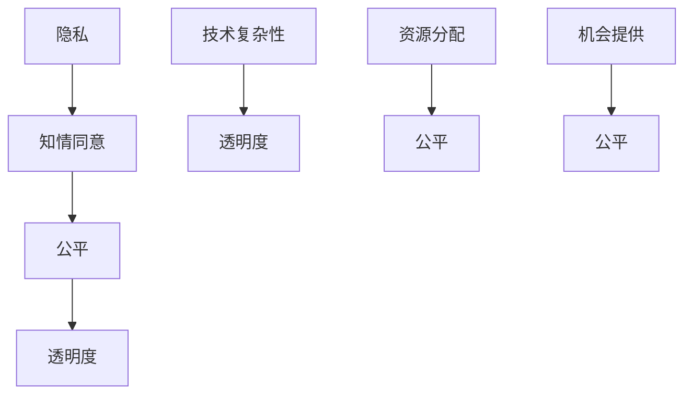

                 

### 文章标题

“科技伦理的新挑战：在创新与道德间寻找平衡”

关键词：科技伦理、创新、道德、人工智能、案例分析、实践指导

摘要：本文深入探讨了科技伦理在当今社会中的重要性，分析了科技创新带来的道德挑战，并通过具体案例和实践指导，提出了在创新与道德之间寻找平衡的途径。文章旨在帮助读者理解科技伦理的基本原则，提高对道德问题的敏感度，从而促进科技与社会的和谐发展。

---

### 背景介绍

随着科技的迅猛发展，人工智能、生物技术、网络安全等领域不断突破传统技术的边界，为社会进步和人类福祉带来了巨大的推动力。然而，这些技术的飞速发展也带来了前所未有的伦理挑战。科技伦理作为一个跨学科领域，涵盖了道德、法律、社会、文化等多个方面，旨在确保科技创新在道德框架内进行，以避免可能的负面影响。

科技伦理的起源可以追溯到古希腊哲学家对自然科学的探讨，以及中世纪基督教神学家对科技行为的规范。20世纪以来，随着科学技术的迅速扩展，科技伦理逐渐成为独立的学科，并得到了广泛的关注。如今，科技伦理已成为研究、教育、政策制定和社会实践中的重要组成部分。

在科技伦理的发展过程中，一些基本原则被广泛接受，如尊重个人隐私、公平对待所有人、知情同意以及公平分配科技利益等。这些原则为科技伦理的研究和实践提供了重要的指导。

### 核心概念与联系

在讨论科技伦理时，几个核心概念是至关重要的。这些概念包括但不限于：

- **隐私**：指个人对其自身信息的控制权，科技的发展使得个人隐私面临前所未有的威胁，如数据泄露、监控等问题。

- **公平**：在科技伦理中，公平涉及资源的分配、机会的提供以及技术的影响是否对所有人平等。

- **知情同意**：这是伦理学中的一个基本原则，意味着在涉及个人数据或身体的情况下，个人有权了解并同意相关操作。

- **透明度**：科技的复杂性要求研发者和使用者能够透明地沟通和解释技术的工作原理和潜在影响。

这些概念之间存在着紧密的联系。例如，隐私与知情同意密切相关，因为知情同意是实现隐私保护的关键。公平则与透明度有关，透明度有助于确保公平的资源分配和机会提供。

为了更直观地展示这些概念之间的关系，我们可以使用Mermaid流程图来表示：



这个流程图清晰地展示了隐私、知情同意、公平和透明度之间的关系，以及技术复杂性对透明度和资源分配的影响。

### 核心算法原理讲解

在科技伦理的研究中，算法扮演着至关重要的角色。以下是一个简化的算法框架，用于分析科技伦理问题：

```plaintext
算法名称：科技伦理分析算法

输入：科技案例、相关数据、伦理原则
输出：伦理分析结果、建议

步骤：
1. 收集科技案例和相关数据
2. 遵循伦理原则对数据进行分类
3. 使用机器学习模型预测可能的伦理风险
4. 对预测结果进行专家评审
5. 根据评审结果提出伦理建议
6. 验证建议的有效性，并迭代优化算法

伪代码：
function 科技伦理分析算法(案例，数据，原则) {
    // 步骤1: 收集数据
    数据集 = 收集案例数据(案例)

    // 步骤2: 分类数据
    数据分类 = 分类数据(数据集，原则)

    // 步骤3: 风险预测
    风险预测 = 机器学习模型预测(数据分类)

    // 步骤4: 专家评审
    评审结果 = 专家评审(风险预测)

    // 步骤5: 提出建议
    建议集 = 提出伦理建议(评审结果)

    // 步骤6: 验证与优化
    验证建议集 = 验证建议(建议集)
    优化算法 = 迭代优化(算法)

    return 建议集
}
```

这个算法通过收集数据、分类、预测和评审等多个步骤，旨在全面分析科技伦理问题，并基于专家评审提出具体的伦理建议。

### 数学模型和公式详细讲解

在科技伦理的研究中，数学模型和公式常常被用来量化伦理问题，以提供更科学的分析。以下是一个简化的数学模型，用于评估科技对个人隐私的影响：

$$
隐私损失 = \frac{泄露数据量}{总数据量} \times 100\%
$$

这个公式表明，隐私损失是泄露数据量与总数据量的比例。通过计算这个比例，可以直观地了解科技对个人隐私的影响程度。

举例说明：

假设一个系统的总数据量为1000条记录，其中有50条记录被泄露，那么：

$$
隐私损失 = \frac{50}{1000} \times 100\% = 5\%
$$

这个结果表明，该系统的隐私损失率为5%，这是一个较高的比例，提示系统在隐私保护方面存在显著问题。

### 实际案例分析与详细讲解剖析

以下是一个关于人工智能伦理的实际案例：

**案例：人脸识别技术在城市安全中的应用**

**背景**：某城市为了提升公共安全，引入了人脸识别技术，用以监控和识别潜在的犯罪分子。

**问题**：这项技术虽然提高了城市的安全水平，但也引发了隐私侵犯和歧视等问题。

**分析**：

1. **隐私侵犯**：人脸识别技术可以实时捕捉和存储大量市民的个人信息，这可能导致个人隐私泄露。

2. **歧视**：由于算法的训练数据可能存在偏见，人脸识别系统可能在识别过程中对特定人群产生歧视，如对少数族裔或特定性别的人误识别率较高。

**解决方案**：

1. **隐私保护**：采用数据加密和匿名化技术，确保个人数据在传输和存储过程中不被泄露。

2. **算法透明化**：公开算法的运作原理和数据来源，接受公众和专家的审查，以减少潜在的歧视问题。

**详细讲解**：

1. **隐私保护**：数据加密技术可以通过加密算法对数据进行加密，确保数据在传输过程中不被窃取或篡改。匿名化技术则通过去除个人身份信息，将数据转换为无法识别个人身份的形式，从而保护个人隐私。

2. **算法透明化**：公开算法的运作原理和数据来源可以增加公众对人工智能系统的信任度。通过专家评审和公众反馈，可以及时发现和纠正算法中的潜在问题，从而减少歧视现象。

### 项目实战：开发环境搭建

为了更好地理解人脸识别技术的应用，我们可以搭建一个简单的开发环境，以下是一个基于Python的人脸识别项目实战：

**1. 环境搭建**

- 安装Python：在Windows或Linux系统中，通过官方网站下载并安装Python。

- 安装依赖库：使用pip命令安装所需依赖库，如OpenCV、dlib、face_recognition等。

  ```bash
  pip install opencv-python
  pip install dlib
  pip install face_recognition
  ```

**2. 源代码实现**

以下是一个简单的人脸识别程序：

```python
import cv2
import face_recognition

# 加载摄像头
video_capture = cv2.VideoCapture(0)

# 加载预训练的人脸识别模型
known_face_encodings = face_recognition.load_model("cnn").known_face_encodings

while True:
    # 读取摄像头帧
    ret, frame = video_capture.read()

    # 将图像转换为RGB格式
    rgb_frame = frame[:, :, ::-1]

    # 检测人脸
    face_locations = face_recognition.face_locations(rgb_frame)
    face_encodings = face_recognition.face_encodings(rgb_frame, face_locations)

    for (top, right, bottom, left), face_encoding in zip(face_locations, face_encodings):
        # 检测是否为人脸
        matches = face_recognition.compare_faces(known_face_encodings, face_encoding)

        if True in matches:
            face_distances = face_recognition.face_distance(known_face_encodings, face_encoding)
            best_match_index = face_distances.argmin()
            print("匹配成功，人脸编号：", best_match_index)

    # 显示视频帧
    cv2.imshow('Video', frame)

    # 按下'q'键退出循环
    if cv2.waitKey(1) & 0xFF == ord('q'):
        break

# 释放摄像头资源
video_capture.release()
cv2.destroyAllWindows()
```

**3. 代码解读**

- `face_recognition.load_model("cnn")`：加载预训练的卷积神经网络模型。

- `face_locations = face_recognition.face_locations(rgb_frame)`：检测视频帧中的人脸位置。

- `face_encodings = face_recognition.face_encodings(rgb_frame, face_locations)`：提取人脸编码。

- `face_recognition.compare_faces(known_face_encodings, face_encoding)`：比较人脸编码，判断是否为人脸。

- `cv2.imshow('Video', frame)`：显示视频帧。

**4. 应用解读与分析**

- **应用解读**：此程序可以用于实时监控，检测并识别摄像头中的人脸。

- **分析**：通过该程序，可以直观地了解人脸识别的基本流程，包括人脸检测、人脸编码和匹配。然而，此程序并未涉及隐私保护和算法透明化等问题，需要在实际应用中加以考虑。

### 最佳实践 Tips

在处理科技伦理问题时，以下是一些最佳实践建议：

1. **透明沟通**：确保科技项目的设计、实施和运营过程透明，接受公众和专家的监督和审查。

2. **隐私保护**：在数据处理过程中，采用加密和匿名化技术，确保个人隐私不被泄露。

3. **公平性考虑**：在算法设计和应用过程中，充分考虑公平性，避免因算法偏见导致的不公平结果。

4. **伦理审查**：建立伦理审查机制，对科技项目进行全面的伦理评估，确保项目在道德框架内进行。

5. **持续改进**：根据反馈和评估结果，不断优化算法和项目，以应对新的伦理挑战。

### 小结

本文通过背景介绍、核心概念与联系、算法原理讲解、数学模型和公式、实际案例分析和项目实战等多个角度，全面探讨了科技伦理的新挑战。在创新与道德之间寻找平衡是科技发展的必经之路，通过透明沟通、隐私保护、公平性考虑、伦理审查和持续改进等最佳实践，可以更好地应对这些挑战，促进科技与社会的和谐发展。

### 注意事项

1. 科技伦理问题具有复杂性，需要跨学科的知识和视角。

2. 在处理科技伦理问题时，应遵循伦理原则，尊重个人隐私和公平性。

3. 算法和技术的透明度对于维护科技伦理至关重要。

4. 科技伦理问题需要持续的监控和评估，以适应不断变化的环境。

### 拓展阅读

1. 《人工智能伦理学：从理论到实践》
2. 《科技伦理与公共政策》
3. 《隐私计算：理论与实践》

通过这些拓展阅读，可以进一步深入了解科技伦理的相关知识。

