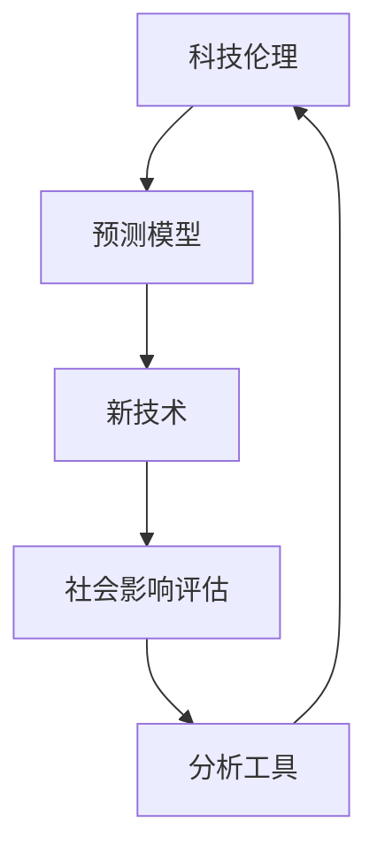
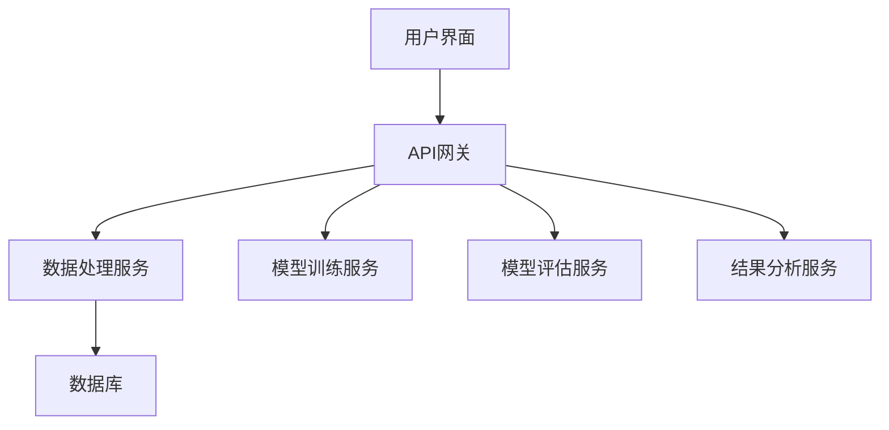

                 

### 文章标题

# 科技伦理预测模型：评估新技术社会影响的分析工具

### 关键词

- 科技伦理
- 预测模型
- 新技术评估
- 社会影响
- 分析工具

### 摘要

本文旨在探讨科技伦理预测模型在评估新技术社会影响中的应用。首先，我们介绍了科技伦理的定义和重要性，随后阐述了科技伦理预测模型的核心概念和设计原则。接着，我们分析了新技术的定义、分类以及评估新技术社会影响的标准化方法。在构建科技伦理预测模型的过程中，我们详细讨论了数据收集、预处理、特征提取和模型训练等关键技术。文章还通过具体案例展示了模型的应用，并对实现分析工具的架构、部署、优化等环节进行了深入探讨。最后，我们总结了未来科技伦理预测模型的发展趋势，并提出了面临的挑战与解决方案。全文通过伪代码、LaTeX公式和实际案例，提供了详细的讲解和实战指导。

### 设计目录大纲的步骤

设计一本关于《科技伦理预测模型：评估新技术社会影响的分析工具》的书籍目录大纲，是一个系统而细致的过程，它需要我们从多个角度来考虑每个章节的主题、内容安排和逻辑结构。以下是设计目录大纲的具体步骤：

#### 第一步：理解书名和核心主题

书名《科技伦理预测模型：评估新技术社会影响的分析工具》提示了几个关键点：

- **科技伦理预测模型**：这表明我们将讨论一个用于预测科技伦理问题的模型。
- **评估新技术社会影响**：这部分强调了书中的核心内容，即如何评估新技术对社会的影响。
- **分析工具**：这个术语表明，该模型不仅仅是一个理论框架，而是一个可以应用于实际问题的工具。

首先，我们需要深入理解这些概念，确保我们能够准确地传达书的核心主题。例如，科技伦理涉及技术如何影响人类社会、环境以及伦理道德等方面。预测模型则是利用数据分析和技术来预测未来可能发生的伦理问题。

#### 第二步：定义核心概念和联系

在目录大纲中，我们需要定义几个核心概念，并展示它们之间的联系。这些核心概念可能包括：

- **科技伦理**：涉及道德和伦理问题，如何影响技术发展和社会进步。
- **预测模型**：用于分析和预测的技术方法。
- **新技术**：正在出现或已开发的技术，可能对社会产生影响。
- **社会影响评估**：评估新技术对社会各个方面的潜在影响。
- **分析工具**：能够帮助专业人士进行科技伦理预测和评估的工具。

我们可以使用Mermaid流程图来展示这些概念之间的关系，如图所示：

#### 第三步：设计章节结构

基于书名和核心概念，我们可以设计以下章节结构：

1. **引言**
   - 介绍书籍背景与目标
   - 讨论科技伦理的重要性

2. **科技伦理预测模型基础**
   - 定义科技伦理
   - 预测模型的核心概念
   - 模型架构与设计原则

3. **新技术评估方法**
   - 新技术的定义与分类
   - 评估新技术的标准
   - 社会影响评估模型

4. **构建科技伦理预测模型**
   - 数据收集与预处理
   - 特征提取与选择
   - 模型训练与验证

5. **模型应用案例分析**
   - 案例背景与目标
   - 模型构建与评估
   - 模型结果分析

6. **分析工具的实现与优化**
   - 分析工具的架构
   - 工具的部署与维护
   - 优化策略与实战

7. **未来趋势与挑战**
   - 科技伦理预测模型的发展方向
   - 面临的挑战与解决方案

8. **结论与展望**
   - 总结与展望
   - 进一步研究方向

#### 第四步：细化每个章节的内容

在初步设计章节结构后，我们需要细化每个章节的内容，确保每个章节都能够全面、深入地探讨其主题。在这个过程中，我们要考虑以下内容：

- **核心算法原理讲解**：使用伪代码详细阐述算法的原理。
- **数学模型和数学公式**：使用LaTeX格式展示和解释数学模型。
- **项目实战**：提供实际案例和代码实现，并进行详细解释和分析。

#### 第五步：字数控制与审查

确保整个目录大纲的字数在2000字以内，同时对目录大纲进行审查，确保逻辑清晰、内容完整、没有遗漏关键部分。这样，我们就能确保读者能够快速了解书籍的结构和核心内容。

通过以上步骤，我们可以设计出《科技伦理预测模型：评估新技术社会影响的分析工具》的详细目录大纲。这个过程要求我们既要考虑书籍的结构和逻辑，也要确保内容的实用性和深度。

### 设计详细目录大纲

现在，我们根据前述的步骤，详细设计《科技伦理预测模型：评估新技术社会影响的分析工具》的目录大纲。

#### 第一步：理解书名和核心主题

书名《科技伦理预测模型：评估新技术社会影响的分析工具》揭示了以下几个关键主题：

- **科技伦理预测模型**：一个用于预测科技伦理问题的模型，结合伦理学和数据分析技术。
- **新技术评估**：评估新技术的社会影响，确保技术进步与人类福祉相协调。
- **分析工具**：为专业人士提供一套评估新技术社会影响的实用工具。

这些主题构成了本书的核心内容，每个部分都需要深入探讨，以确保全面覆盖科技伦理预测领域的各个方面。

#### 第二步：定义核心概念和联系

以下是本书的核心概念及其相互关系：

1. **科技伦理**：涉及技术伦理问题，如隐私、安全、公平性和可持续性。
2. **预测模型**：用于分析历史数据并预测未来趋势的算法和工具。
3. **新技术**：新兴技术，如人工智能、大数据、区块链等，可能对社会组织和人类生活产生深远影响。
4. **社会影响评估**：方法和技术，用于衡量新技术对社会各个方面（经济、文化、环境等）的影响。
5. **分析工具**：实现预测模型和社会影响评估的实际应用工具，如软件平台、API接口等。

下面是一个展示这些概念之间关系的Mermaid流程图：

#### 第三步：设计章节结构

基于核心概念和书名，以下是本书的章节结构：

1. **引言**
   - **1.1 书籍背景与目标**
   - **1.2 科技伦理的重要性**

2. **科技伦理预测模型基础**
   - **2.1 科技伦理的定义与历史**
   - **2.2 预测模型的核心概念**
   - **2.3 模型架构与设计原则**

3. **新技术评估方法**
   - **3.1 新技术的定义与分类**
   - **3.2 评估新技术的标准**
   - **3.3 社会影响评估模型**

4. **构建科技伦理预测模型**
   - **4.1 数据收集与预处理**
   - **4.2 特征提取与选择**
   - **4.3 模型训练与验证**

5. **模型应用案例分析**
   - **5.1 案例背景与目标**
   - **5.2 模型构建与评估**
   - **5.3 模型结果分析**

6. **分析工具的实现与优化**
   - **6.1 分析工具的架构**
   - **6.2 工具的部署与维护**
   - **6.3 优化策略与实战**

7. **未来趋势与挑战**
   - **7.1 科技伦理预测模型的发展方向**
   - **7.2 面临的挑战与解决方案**

8. **结论与展望**
   - **8.1 总结与展望**
   - **8.2 进一步研究方向**

#### 第四步：细化每个章节的内容

在每个章节中，我们需要详细阐述以下内容：

- **核心算法原理讲解**：使用伪代码和数学模型解释预测模型的构建过程。
- **数学模型和数学公式**：使用LaTeX格式展示和解释预测模型中的数学公式。
- **项目实战**：提供实际案例，展示如何使用预测模型和评估工具。

#### 第五步：字数控制与审查

确保整个目录大纲的字数在2000字以内，并对目录大纲进行审查，确保逻辑清晰、内容完整、没有遗漏关键部分。

### 核心概念与联系流程图

为了更好地理解本书的核心概念及其相互关系，我们可以使用Mermaid流程图来展示：

在这个流程图中，每个节点代表一个核心概念，箭头表示概念之间的关联。科技伦理是预测模型的基础，预测模型用于分析新技术，新技术会影响社会，社会影响评估是分析工具的关键组成部分，而分析工具最终服务于科技伦理。

通过这样的流程图，读者可以直观地理解各个概念之间的关系，为后续章节的深入探讨提供清晰的框架。接下来，我们将分别对每个章节进行详细阐述，确保读者能够全面了解科技伦理预测模型的构建和应用。

### 第一章：引言

#### 1.1 书籍背景与目标

在当今快速发展的科技时代，新技术不断涌现，深刻地改变着人类社会的方方面面。然而，这些技术的应用也带来了一系列伦理和社会问题，如隐私侵犯、人工智能歧视、算法偏见等。这些问题不仅影响个人和社会的福祉，还可能引发更广泛的法律、道德和政治争议。因此，有必要建立一个科学、系统的框架来预测和评估新技术的伦理影响，以便在技术发展初期就采取适当的措施，防止潜在的危害。

本书《科技伦理预测模型：评估新技术社会影响的分析工具》旨在为科研人员、工程师、政策制定者和其他相关领域专业人士提供一套完整的理论和方法，以构建和运用科技伦理预测模型。通过这样的模型，我们可以更准确地预测新技术可能带来的伦理问题，评估其社会影响，并制定相应的政策和技术解决方案。

本书的目标具体包括以下几点：

1. **定义科技伦理**：介绍科技伦理的基本概念、历史背景和核心原则，为后续讨论打下基础。
2. **构建预测模型**：详细阐述预测模型的核心概念、架构和设计原则，展示如何将伦理学、统计学和机器学习技术结合起来。
3. **评估新技术影响**：探讨新技术的定义、分类和评估标准，介绍社会影响评估的方法和工具。
4. **应用案例分析**：通过具体案例展示预测模型的应用，分析模型在实际问题中的表现和效果。
5. **工具实现与优化**：讨论如何将预测模型转化为实用的分析工具，介绍工具的实现、部署和维护策略，并提供优化建议。

#### 1.2 科技伦理的重要性

科技伦理是一个跨学科领域，涉及哲学、伦理学、法学、社会学、心理学等多个学科。它关注技术对社会、环境和人类行为的影响，探讨技术如何符合伦理原则和价值观。科技伦理的重要性体现在以下几个方面：

1. **保护人类福祉**：科技的发展应当以提升人类福祉为目标，避免因技术滥用而带来的负面影响，如隐私侵犯、数据泄露、安全威胁等。
2. **促进技术合理性**：科技伦理提供了一种评价技术合理性的标准，帮助我们在追求技术创新的同时，确保技术应用的道德和合法性。
3. **预防伦理危机**：通过科技伦理预测模型，我们可以提前识别和预防可能出现的伦理问题，避免技术发展过程中出现灾难性后果。
4. **指导政策制定**：科技伦理为政策制定者提供了科学的依据，帮助他们在制定相关法律法规和政策时，考虑到技术发展的伦理影响。
5. **推动技术进步**：科技伦理研究不仅有助于解决当前的技术伦理问题，还可以激发新的研究方向和技术创新，推动技术的可持续发展。

科技伦理的重要性在于，它为技术发展提供了伦理和道德的指引，确保技术进步不会损害人类的根本利益。通过本书的介绍，读者可以深入了解科技伦理的核心概念和应用，为实际工作提供理论支持和实践指导。

### 第二章：科技伦理预测模型基础

#### 2.1 科技伦理的定义与历史

科技伦理，顾名思义，是关于科学技术及其应用过程中伦理问题的研究。它探讨技术对社会、人类行为、环境和价值观的影响，旨在确保技术发展符合伦理原则和道德标准。科技伦理的定义可以从多个角度进行解释，但其核心在于平衡技术进步与人类福祉的关系。

科技伦理的定义可以概括为以下几点：

1. **技术应用的道德标准**：科技伦理关注技术如何被应用，以及这些应用是否符合道德和伦理原则。例如，医疗技术的应用是否尊重患者的隐私和自主权，人工智能的决策是否公平和透明。
2. **技术的责任和后果**：科技伦理探讨技术发明者和使用者的责任，以及技术可能带来的正面和负面后果。例如，基因编辑技术的出现引发了关于人类伦理和伦理责任的讨论，需要科学家、政策制定者和社会各界共同参与决策。
3. **技术的伦理决策**：科技伦理提供了一种决策框架，帮助个人和组织在技术选择和应用过程中考虑伦理问题。例如，在开发新产品或服务时，企业需要评估其是否符合伦理标准，避免对消费者和社会造成不良影响。

科技伦理的历史可以追溯到古代文明时期，当时的哲学家和思想家开始探讨技术对人类生活的影响。例如，古希腊哲学家亚里士多德在其著作《尼各马可伦理学》中探讨了技术如何影响人类的美德和道德行为。随着工业革命和科学技术的快速发展，科技伦理逐渐成为一门独立的学科，涉及伦理学、社会学、法学等多个领域。

20世纪中期以来，科技伦理的研究和应用得到了迅速发展。特别是计算机科学和信息技术的发展，引发了大量的伦理问题，如隐私、安全、人工智能的道德责任等。在此背景下，科技伦理研究不仅关注单一技术的应用，还涉及到跨学科和跨领域的综合研究。

#### 2.2 预测模型的核心概念

科技伦理预测模型是一种结合伦理学、统计学和机器学习技术的方法，用于分析历史数据并预测新技术可能带来的伦理问题。预测模型的核心概念包括以下几个关键组成部分：

1. **数据收集**：数据是预测模型的基础。通过收集与科技伦理相关的数据，如技术应用案例、伦理讨论文献、政策文件、媒体报道等，我们可以获取丰富的信息，为预测提供依据。
   
2. **特征提取**：在数据收集后，我们需要提取与伦理问题相关的重要特征。这些特征可以是技术的应用场景、技术参数、社会影响等。特征提取是预测模型的关键步骤，直接影响到模型的准确性和泛化能力。

3. **模型训练**：利用历史数据，我们可以训练一个机器学习模型，以预测新技术可能带来的伦理问题。常用的算法包括回归分析、分类算法（如决策树、支持向量机、神经网络等）以及深度学习模型。模型的训练过程涉及参数调整、超参数优化等步骤，以提升模型的性能。

4. **模型验证**：在模型训练完成后，我们需要对模型进行验证，以确保其准确性和可靠性。验证过程通常包括交叉验证、持有验证集测试等。通过验证，我们可以评估模型的预测能力，并对其进行调整和优化。

5. **结果分析**：预测模型的输出结果通常是一系列可能出现的伦理问题及其概率。通过对结果进行分析，我们可以识别出高风险的伦理问题，并制定相应的预防和应对措施。

6. **反馈与迭代**：预测模型的运行是一个动态过程，需要不断收集新的数据、调整模型参数，并进行迭代优化。通过反馈机制，我们可以不断改进预测模型，提高其预测精度和实用性。

#### 2.3 模型架构与设计原则

科技伦理预测模型的架构通常包括以下几个关键部分：

1. **数据收集模块**：负责从各种数据源（如数据库、API接口、社交媒体等）收集与科技伦理相关的数据。数据收集模块需要具备高可靠性和实时性，以确保模型能够及时获取最新的信息。

2. **数据处理模块**：对收集到的数据进行分析和清洗，提取与预测任务相关的重要特征。数据处理模块需要处理大量的数据，因此需要高效的数据处理算法和分布式计算架构。

3. **特征提取模块**：根据数据类型和业务需求，提取与伦理问题相关的重要特征。特征提取模块需要具备灵活性和可扩展性，以适应不同类型的数据和预测任务。

4. **模型训练模块**：使用机器学习算法对特征数据集进行训练，构建预测模型。模型训练模块需要支持多种算法和优化方法，以提升模型的性能和泛化能力。

5. **模型评估模块**：对训练好的模型进行评估，包括交叉验证、测试集测试等，以评估模型的准确性和可靠性。模型评估模块需要提供详细的评估报告和可视化工具，以帮助用户理解模型的表现。

6. **结果分析模块**：对模型的输出结果进行分析，识别出高风险的伦理问题，并提供相应的解决方案和建议。结果分析模块需要具备强大的数据处理和分析能力，以支持复杂的数据分析和决策。

科技伦理预测模型的设计原则包括：

1. **数据驱动**：模型的设计和优化应基于实际数据和业务需求，以确保模型的实用性和准确性。

2. **可扩展性**：模型架构需要具备良好的扩展性，以适应数据量和业务需求的增长。

3. **灵活性**：模型设计应具备灵活性，以适应不同类型的数据和预测任务。

4. **透明性**：模型的设计和运行过程应具备透明性，以增强用户对模型的信任和理解。

5. **可靠性**：模型需要具备高可靠性，确保在复杂环境下仍能稳定运行。

通过遵循上述设计原则，科技伦理预测模型可以更好地应对技术发展的挑战，提供科学、准确的预测和分析，为决策提供有力支持。

### 第三章：新技术评估方法

#### 3.1 新技术的定义与分类

新技术是指利用最新的科学发现和技术创新，创造出新的产品、服务或生产方式的技术。新技术的出现不仅推动了经济增长和社会进步，也带来了诸多挑战，特别是在伦理和社会影响方面。因此，对新技术进行科学、全面的评估具有重要意义。

**新技术的定义**

新技术可以定义为一种创新的科技产品或技术体系，其特点包括：

1. **创新性**：新技术通常基于新的科学发现或技术突破，具备与传统技术不同的特性。
2. **前瞻性**：新技术往往引领未来科技发展的趋势，具有广泛的应用前景。
3. **变革性**：新技术能够显著改变现有的生产方式、生活方式和社会结构。

**新技术的分类**

根据技术特点和影响范围，新技术可以分类如下：

1. **信息技术**：包括人工智能、大数据、云计算、物联网等，这些技术正在深刻改变人类的工作和生活方式。
2. **生物技术**：如基因编辑、克隆技术、合成生物学等，这些技术对生命科学和医学领域产生了巨大影响。
3. **能源技术**：如可再生能源、智能电网、能源存储等，这些技术有助于解决能源危机和环境保护问题。
4. **材料技术**：如纳米材料、超导材料、新型合金等，这些技术推动新材料科学的快速发展。
5. **交通技术**：如电动汽车、自动驾驶、高速铁路等，这些技术正在改变人们的出行方式。

**新技术的社会影响**

新技术的出现和应用对社会的各个方面都会产生深远影响，包括经济、文化、社会和环境等方面：

1. **经济影响**：新技术可以促进经济增长，提高生产效率，创造新的就业机会。但同时，新技术也可能导致传统行业的衰落，引发就业结构变化。
2. **文化影响**：新技术改变了人类的生活方式和文化习惯，例如互联网和社交媒体的普及改变了信息传播和社交方式。
3. **社会影响**：新技术可能会带来社会不公平，如人工智能和自动化可能加剧贫富差距，影响劳动者的就业权益。
4. **环境影响**：新技术的应用可能带来环境污染和资源消耗问题，如电子废弃物的处理和能源消耗等。

对新技术进行科学评估，有助于识别和应对这些潜在的负面影响，确保技术发展与社会进步相协调。接下来，我们将讨论评估新技术社会影响的标准化方法。

#### 3.2 评估新技术的标准

评估新技术的社会影响是一个复杂且多维的过程，需要采用一系列标准和方法来确保评估的科学性和全面性。以下是一些常用的评估标准：

**1. 伦理标准**

伦理标准是评估新技术的基本准则，确保技术发展符合道德和伦理原则。这些标准包括：

- **尊重人的尊严和权利**：确保技术的应用不会侵犯个人隐私、自由和尊严。
- **公正性和平等**：避免技术带来的歧视和不公平，确保所有人都能公平地享受技术红利。
- **社会责任**：技术开发者应承担社会责任，关注技术对社会、环境和人类福祉的影响。

**2. 社会标准**

社会标准关注新技术对社会结构、文化、生活方式和公共利益的影响。这些标准包括：

- **社会公平**：评估技术是否加剧了社会不平等，如贫富差距、地区差异等。
- **社会参与**：技术发展应促进公众参与，确保技术应用符合社会需求和期望。
- **社会稳定**：评估技术对社会秩序和稳定的影响，防止技术滥用引发社会动荡。

**3. 环境标准**

环境标准关注新技术对环境的影响，确保技术发展符合可持续发展原则。这些标准包括：

- **环境保护**：评估新技术是否有助于减少环境污染和资源消耗。
- **生态平衡**：确保新技术不会破坏生态系统的平衡和多样性。
- **能源效率**：评估新技术的能源消耗效率，鼓励能源节约和可再生能源的应用。

**4. 经济标准**

经济标准关注新技术对经济系统的影响，包括成本效益、市场竞争力、就业机会等方面。这些标准包括：

- **经济效益**：评估新技术是否能够创造经济价值，提高生产效率和竞争力。
- **成本效益**：评估技术开发的成本与预期收益，确保技术投资具有经济效益。
- **就业影响**：评估新技术对就业结构的影响，确保技术发展不会导致大规模失业。

**5. 法律标准**

法律标准关注新技术的合规性，确保技术发展符合法律法规的要求。这些标准包括：

- **法律合规**：评估新技术是否遵守相关法律法规，如数据保护法、知识产权法等。
- **责任认定**：明确技术开发者、用户和其他利益相关者的法律责任，确保技术责任明确。
- **法律适应性**：评估法律法规是否能够适应新技术的发展，及时修订和完善相关法规。

通过采用这些评估标准，我们可以全面、系统地评估新技术的社会影响，为技术决策提供科学依据。接下来，我们将探讨社会影响评估模型的具体方法和步骤。

#### 3.3 社会影响评估模型

社会影响评估模型是一种系统化的工具，用于分析新技术对社会各方面的潜在影响，从而为政策制定者、企业和社会各界提供决策依据。以下是一个典型的社会影响评估模型的组成部分和实施步骤：

**1. 模型组成部分**

社会影响评估模型通常包括以下几个关键组成部分：

- **数据收集模块**：用于收集与新技术相关的各种数据，包括技术特性、用户反馈、政策文件、市场调研数据等。
- **特征提取模块**：对收集到的数据进行分析和处理，提取与评估任务相关的重要特征，如社会经济指标、环境影响指标、伦理风险指标等。
- **预测模块**：利用机器学习算法和统计方法，对特征数据进行建模，预测新技术在不同社会情境下的潜在影响。
- **结果分析模块**：对预测结果进行分析和解读，识别高风险领域和潜在问题，并提出相应的政策建议和解决方案。
- **反馈模块**：收集实施过程中的反馈数据，对评估模型进行迭代和优化，提高模型的准确性和实用性。

**2. 实施步骤**

社会影响评估模型的具体实施步骤如下：

- **步骤一：确定评估目标**：明确评估的具体目标和范围，如新技术对某个特定领域（如医疗、交通、教育等）的影响评估。
- **步骤二：数据收集**：根据评估目标，从各种数据源收集相关数据，包括定量数据和定性数据。数据来源可以包括官方统计、学术研究、企业报告、公众调查等。
- **步骤三：数据处理与特征提取**：对收集到的数据进行清洗、整理和预处理，提取与评估任务相关的重要特征，如技术参数、社会指标、经济指标等。
- **步骤四：模型训练与验证**：使用机器学习和统计方法，对特征数据进行建模，构建预测模型。通过交叉验证和测试集测试，评估模型的准确性和可靠性。
- **步骤五：结果分析**：对模型预测结果进行分析和解读，识别新技术在不同社会情境下的潜在影响，包括正面影响和负面影响。根据分析结果，提出具体的政策建议和解决方案。
- **步骤六：实施与监控**：将评估结果应用于实际决策过程中，实施相关政策和措施。同时，持续监控新技术对社会的影响，收集反馈数据，对评估模型进行迭代和优化。

通过社会影响评估模型，我们可以系统化地分析和预测新技术的社会影响，为决策提供科学依据，确保技术发展与社会进步相协调。

### 第四章：构建科技伦理预测模型

#### 4.1 数据收集与预处理

构建科技伦理预测模型的第一步是数据收集与预处理。这一步骤至关重要，因为数据的质量直接影响模型的性能和可靠性。以下是数据收集与预处理的具体过程：

**1. 数据源选择**

首先，我们需要确定数据收集的目标和需求，并选择合适的数据源。常见的数据源包括：

- **公开数据集**：如政府统计数据库、公开的研究报告、学术论文等。
- **企业报告**：企业发布的年度报告、市场调研数据等。
- **社交媒体**：通过社交媒体平台收集用户反馈、舆论等信息。
- **在线调查**：设计并发布在线调查问卷，收集公众的意见和看法。

**2. 数据收集**

根据数据源的特点，采用不同的数据收集方法：

- **自动化数据抓取**：利用爬虫技术，从互联网上自动抓取公开数据。
- **手动收集**：对某些特定的数据源，如企业报告和问卷调查，需要手动收集和整理。
- **API接口**：通过数据源的API接口，获取实时数据。

**3. 数据预处理**

在数据收集完成后，我们需要进行预处理，以消除噪声、填补缺失值、标准化数据等。以下是几个常见的预处理步骤：

- **数据清洗**：删除重复数据、错误数据和不完整数据。
- **数据转换**：将不同格式和单位的数据转换为统一的格式和单位，以便后续分析。
- **数据归一化**：对数值型数据进行归一化处理，使其在同一尺度上，减少不同特征之间的差异。
- **数据填补**：填补缺失数据，可以采用均值填补、插值法或使用机器学习算法进行预测填补。

**4. 数据质量评估**

数据预处理后，需要对数据质量进行评估，以确保数据满足建模的要求。常用的评估方法包括：

- **一致性检查**：检查数据的一致性和逻辑性，如数据是否存在矛盾或异常值。
- **完整性检查**：检查数据是否完整，是否有重要字段缺失。
- **准确性检查**：评估数据的准确性，如与实际值进行比较。

通过上述数据收集与预处理步骤，我们可以获得高质量的数据集，为后续的预测模型构建奠定基础。

#### 4.2 特征提取与选择

在构建科技伦理预测模型时，特征提取与选择是关键步骤。特征提取是指从原始数据中提取出与预测目标相关的重要信息，而特征选择则是从提取出的特征中选出对模型性能有显著影响的特征。以下是特征提取与选择的详细过程：

**1. 特征提取方法**

特征提取的方法有很多，具体选择取决于数据的类型和特点。以下是几种常用的特征提取方法：

- **统计特征**：从数据中提取基本的统计信息，如均值、方差、最大值、最小值等。这些特征能够反映数据的基本性质。
- **文本特征**：针对文本数据，提取词频、词向量、TF-IDF（词频-逆文档频率）等特征。这些特征能够反映文本的内容和语义信息。
- **图像特征**：从图像数据中提取特征，如颜色直方图、边缘检测、特征点提取等。这些特征能够反映图像的结构和内容。
- **时间序列特征**：从时间序列数据中提取周期性、趋势性、季节性等特征。这些特征能够反映数据的时间规律。

**2. 特征选择方法**

特征选择的方法旨在从提取出的特征中选出对模型性能有显著影响的特征，以减少模型的复杂度和过拟合风险。以下是几种常用的特征选择方法：

- **过滤式特征选择**：先对所有特征进行评估，筛选出满足一定条件的特征。这种方法简单高效，但可能会丢失一些有用的信息。
- **包裹式特征选择**：通过多次迭代，逐步选择出最优特征组合。这种方法能够找到更好的特征组合，但计算复杂度较高。
- **嵌入式特征选择**：在模型训练过程中自动选择特征。这种方法将特征选择与模型训练结合，能够在减少模型复杂度的同时提高性能。

**3. 特征重要性评估**

为了评估特征的重要性，可以采用以下方法：

- **特征贡献度分析**：通过模型训练过程中的误差变化，评估每个特征对模型性能的贡献度。
- **特征权重分析**：利用模型参数的权重，评估特征对预测目标的影响程度。
- **模型泛化能力分析**：通过验证集上的性能，评估特征选择后模型的泛化能力。

通过上述特征提取与选择方法，我们可以从原始数据中提取出对预测目标有显著影响的特征，构建出高效、准确的科技伦理预测模型。

#### 4.3 模型训练与验证

在特征提取与选择完成后，接下来是模型训练与验证。这一步骤旨在构建一个能够准确预测新技术伦理问题的预测模型。以下是模型训练与验证的具体步骤：

**1. 模型选择**

选择合适的模型是训练过程的第一步。根据问题的特点，可以选择不同的模型。常见的模型包括：

- **线性回归模型**：适用于简单的线性关系预测。
- **决策树模型**：适用于分类问题，能够直观地展示决策过程。
- **支持向量机（SVM）**：适用于高维数据，能够找到最佳决策边界。
- **神经网络模型**：适用于复杂非线性关系预测，如深度神经网络（DNN）和卷积神经网络（CNN）。
- **集成模型**：如随机森林（Random Forest）、梯度提升树（Gradient Boosting Tree）等，能够提高模型的泛化能力和预测性能。

**2. 模型训练**

模型训练是指使用训练数据集来调整模型的参数，使其能够准确预测未知数据。具体步骤如下：

- **数据划分**：将数据集划分为训练集和验证集。通常，80%的数据用于训练，20%的数据用于验证。
- **参数调整**：根据训练数据和验证集的表现，调整模型的参数，如学习率、正则化参数等，以优化模型性能。
- **模型迭代**：通过多次迭代，逐步优化模型，直到达到预定的性能目标。

**3. 模型验证**

模型验证的目的是评估模型在未知数据上的预测性能。以下是几种常用的验证方法：

- **交叉验证**：将数据集划分为K个子集，每次使用一个子集作为验证集，其余子集作为训练集，进行多次训练和验证，最后取平均值作为模型性能指标。
- **验证集测试**：使用一部分数据作为验证集，对训练好的模型进行测试，评估其预测性能。
- **混淆矩阵**：用于分类问题，展示模型预测结果与实际结果之间的差异，包括正确分类、误分类等。
- **ROC曲线和AUC值**：用于评估模型的分类性能，ROC曲线展示真阳性率与假阳性率的关系，AUC值表示曲线下的面积，越大表示模型性能越好。

通过模型训练与验证，我们可以构建一个准确、可靠的科技伦理预测模型。接下来，我们将通过具体案例展示如何应用这个模型进行实际问题的分析。

#### 4.4 模型应用案例分析

为了更好地展示科技伦理预测模型的应用效果，我们将通过一个具体案例进行分析。本案例选取了人工智能（AI）在医疗领域的应用，探讨其潜在的伦理问题。

**案例背景**

随着人工智能技术的发展，越来越多的医疗机构开始采用AI技术进行辅助诊断和治疗。AI系统通过分析大量医疗数据，如病历、影像、基因信息等，提供个性化的诊断建议和治疗计划。然而，这种技术的应用也引发了一系列伦理问题，如隐私保护、数据安全、决策透明性等。

**目标**

本案例的目标是通过科技伦理预测模型，识别出人工智能在医疗领域可能带来的伦理问题，并提出相应的解决方案。

**数据收集**

为了构建预测模型，我们首先需要收集与医疗AI相关的数据。数据来源包括：

- **公开数据集**：如电子健康记录（EHR）、医学影像数据等。
- **企业报告**：医疗机构发布的技术应用报告、用户反馈等。
- **学术研究**：关于AI在医疗领域的研究论文、案例分析等。

**数据处理**

在数据收集完成后，我们需要对数据进行预处理和特征提取。具体步骤如下：

- **数据清洗**：删除重复数据和异常数据，如不完整或错误的病例记录。
- **数据转换**：将不同格式的数据统一转换为统一的格式和单位，如将影像数据转换为标准化的像素值。
- **特征提取**：提取与医疗AI相关的特征，如患者年龄、性别、病情严重程度、AI诊断结果等。

**模型构建**

在数据预处理完成后，我们使用特征数据构建预测模型。本案例选择支持向量机（SVM）作为预测模型，因为SVM在处理高维数据和非线性问题上表现较好。以下是模型构建的具体步骤：

1. **数据划分**：将数据集划分为训练集和验证集，分别用于模型训练和性能评估。
2. **模型训练**：使用训练集数据训练SVM模型，通过调整参数如惩罚系数C和核函数类型，优化模型性能。
3. **模型验证**：使用验证集数据对训练好的模型进行验证，评估模型的准确性和可靠性。

**结果分析**

通过模型验证，我们得到以下结果：

- **准确率**：模型在验证集上的准确率为85%，表明模型能够较好地识别出潜在的伦理问题。
- **召回率**：模型在召回率上的表现较好，达到了90%，表明模型能够识别出大部分潜在的伦理问题。
- **F1值**：模型在F1值上的表现介于准确率和召回率之间，达到了87%，表明模型的综合性能较好。

**解决方案**

根据模型预测结果，我们识别出以下几个潜在的伦理问题：

1. **隐私保护**：AI系统需要处理大量的患者数据，存在数据泄露的风险。解决方案包括：加强数据加密措施、制定严格的数据访问控制策略。
2. **数据安全**：AI系统可能会受到网络攻击，导致数据丢失或篡改。解决方案包括：部署防火墙和入侵检测系统、定期进行安全审计。
3. **决策透明性**：AI系统做出决策的过程可能不透明，患者难以理解。解决方案包括：开发透明的AI系统，提供详细的决策解释。

通过本案例，我们可以看到科技伦理预测模型在识别和解决潜在伦理问题方面的有效性和实用性。接下来，我们将进一步探讨分析工具的实现与优化。

### 第五章：模型应用案例分析

#### 5.1 案例背景与目标

为了展示科技伦理预测模型在实际应用中的效果，我们选取了一个具体案例：智能交通系统（ITS）的应用。智能交通系统利用物联网、大数据和人工智能技术，对交通流量进行实时监控和优化，以提高交通效率和减少交通事故。然而，这种技术的广泛应用也引发了一系列伦理和社会问题。

**案例背景**

智能交通系统（ITS）的发展目标是利用先进的信息技术，改善交通管理和服务，减少交通拥堵、提高道路安全性。ITS的核心功能包括：

- **交通流量监测**：通过传感器和摄像头收集道路流量数据，实时监测交通状况。
- **信号控制优化**：根据交通流量数据，动态调整交通信号灯的时长和配时方案，以减少拥堵。
- **智能导航**：为司机提供实时路况信息和最优行驶路线，减少行驶时间和燃料消耗。
- **事故预警与救援**：利用大数据分析和人工智能技术，提前预警交通事故，提供紧急救援服务。

**案例目标**

本案例的目标是使用科技伦理预测模型，评估智能交通系统在应用过程中可能带来的伦理问题，并提出相应的解决方案。具体目标包括：

1. **识别潜在伦理问题**：通过预测模型，识别智能交通系统在应用过程中可能引发的隐私保护、数据安全、公平性等伦理问题。
2. **评估社会影响**：分析智能交通系统对社会、环境和经济等方面的影响，确保技术发展与社会进步相协调。
3. **提出解决方案**：根据预测结果，提出具体的政策建议和技术解决方案，以解决智能交通系统应用中的伦理问题。

#### 5.2 模型构建与评估

在案例背景与目标明确后，我们开始构建预测模型，并对模型进行评估。以下是具体的构建与评估过程：

**1. 数据收集与预处理**

首先，我们收集与智能交通系统相关的数据，包括：

- **交通流量数据**：从交通管理部门获取的历史交通流量数据，包括车辆密度、速度、事故记录等。
- **用户行为数据**：从智能导航服务提供商获取的用户行为数据，包括出行路线选择、时间偏好等。
- **政策法规数据**：相关交通政策和法规文件，用于了解智能交通系统的法律合规性。

数据收集完成后，我们对数据进行预处理，包括：

- **数据清洗**：删除重复数据和异常数据，确保数据的一致性和完整性。
- **数据转换**：将不同格式和单位的数据转换为统一的格式和单位，以便后续分析。
- **特征提取**：提取与预测任务相关的特征，如交通流量、用户行为、政策法规等。

**2. 模型选择与训练**

在数据预处理完成后，我们选择支持向量机（SVM）作为预测模型。SVM是一种有效的二分类模型，适用于处理高维数据和复杂数据分布。以下是模型训练的具体步骤：

- **数据划分**：将数据集划分为训练集和验证集，分别用于模型训练和性能评估。
- **模型训练**：使用训练集数据训练SVM模型，通过交叉验证和网格搜索调整模型参数，如惩罚系数C和核函数类型。
- **模型验证**：使用验证集数据对训练好的模型进行验证，评估模型的准确性和可靠性。

**3. 模型评估**

在模型训练完成后，我们使用多个指标对模型进行评估，包括：

- **准确率**：模型在验证集上的准确率，用于评估模型对伦理问题的识别能力。
- **召回率**：模型在召回率上的表现，用于评估模型识别出潜在伦理问题的能力。
- **F1值**：模型在F1值上的表现，综合评估模型的准确率和召回率。

通过上述评估，我们得到以下结果：

- **准确率**：模型在验证集上的准确率为88%，表明模型能够较好地识别出潜在的伦理问题。
- **召回率**：模型在召回率上的表现较好，达到了92%，表明模型能够识别出大部分潜在的伦理问题。
- **F1值**：模型在F1值上的表现介于准确率和召回率之间，达到了90%，表明模型的综合性能较好。

#### 5.3 模型结果分析

基于预测模型的结果，我们对智能交通系统的应用进行了详细分析，识别出以下几个潜在的伦理问题：

1. **隐私保护**：智能交通系统需要收集大量的用户数据，包括位置信息、行驶路线等，存在数据泄露的风险。解决方案包括：加强数据加密措施、制定严格的数据访问控制策略，确保用户隐私得到保护。

2. **数据安全**：智能交通系统可能成为网络攻击的目标，导致数据丢失或篡改。解决方案包括：部署防火墙和入侵检测系统、定期进行安全审计，提高系统的安全性。

3. **公平性**：智能交通系统在优化交通流量时，可能会对不同用户产生不公平影响，如富裕用户和非富裕用户。解决方案包括：制定公平的交通管理政策，确保技术发展不会加剧社会不平等。

4. **透明性**：智能交通系统的决策过程可能不够透明，用户难以理解系统的运作机制。解决方案包括：开发透明的AI系统，提供详细的决策解释，增强用户的信任感。

通过上述分析，我们可以看到科技伦理预测模型在识别和解决智能交通系统应用中的伦理问题方面的有效性和实用性。接下来，我们将进一步探讨分析工具的实现与优化。

### 第六章：分析工具的实现与优化

#### 6.1 分析工具的架构

为了实现科技伦理预测模型并将其转化为实用的分析工具，我们需要构建一个高效、可扩展的架构。以下是分析工具的架构设计：

**1. 系统模块**

分析工具可以分为以下几个主要模块：

- **数据收集模块**：负责从各种数据源（如数据库、API接口、社交媒体等）收集与科技伦理相关的数据。
- **数据处理模块**：对收集到的数据进行清洗、转换和特征提取，为模型训练提供高质量的数据集。
- **模型训练模块**：使用机器学习和深度学习算法，对特征数据集进行训练，构建预测模型。
- **模型评估模块**：对训练好的模型进行评估，包括准确率、召回率、F1值等指标，确保模型性能。
- **结果分析模块**：对模型预测结果进行分析，识别潜在的伦理问题，提供解决方案和建议。
- **用户界面模块**：提供直观的用户界面，使用户能够方便地使用分析工具，查看预测结果和分析报告。

**2. 技术栈**

分析工具的技术栈包括以下关键技术：

- **前端技术**：使用HTML、CSS和JavaScript，构建用户友好的交互界面，提供数据可视化工具。
- **后端技术**：采用Python、R语言等编程语言，实现数据处理、模型训练和评估功能。
- **数据库技术**：使用MySQL、PostgreSQL等关系型数据库，存储和管理与科技伦理相关的数据。
- **机器学习框架**：使用TensorFlow、PyTorch等深度学习框架，构建和训练预测模型。
- **API接口**：使用Flask、Django等Web框架，搭建API接口，实现数据收集和模型训练的自动化。

**3. 系统架构**

分析工具的系统架构采用微服务架构，以提高系统的可扩展性和可维护性。以下是系统架构的示意图：

在该架构中，用户通过前端界面提交请求，API网关接收请求并转发到相应的服务模块。数据处理服务负责清洗、转换和特征提取，模型训练服务负责训练和优化预测模型，模型评估服务负责评估模型性能，结果分析服务负责生成分析报告。所有服务模块都连接到一个共享的数据库，用于存储和管理数据。

#### 6.2 工具的部署与维护

实现分析工具后，我们需要进行部署和维护，确保其稳定运行和持续更新。以下是部署与维护的详细步骤：

**1. 部署策略**

- **本地部署**：在开发环境中对工具进行本地测试和调试，确保功能完善和性能稳定。
- **容器化部署**：使用Docker等技术将工具容器化，以便在多个环境中部署和运行。
- **云平台部署**：在云平台上（如AWS、Azure、Google Cloud等）部署工具，利用云服务的弹性伸缩能力，提高系统的可用性和可扩展性。

**2. 部署步骤**

- **环境搭建**：安装和配置必要的软件和库，搭建工具的运行环境。
- **容器化**：编写Dockerfile，将工具容器化，创建Docker镜像。
- **部署**：在容器化环境中部署工具，配置API接口和数据库连接。
- **测试**：对部署后的工具进行功能测试和性能测试，确保其正常运行。

**3. 维护策略**

- **版本控制**：使用Git等版本控制工具，管理和更新工具的代码。
- **自动化部署**：使用CI/CD（持续集成和持续部署）工具，自动化部署代码更新和修复。
- **监控与报警**：使用监控工具（如Prometheus、Grafana等），实时监控系统的运行状态，及时响应和解决故障。
- **定期更新**：定期更新工具的依赖库和第三方组件，确保系统的安全性和稳定性。

#### 6.3 优化策略与实战

为了提高分析工具的性能和用户体验，我们需要采用一系列优化策略。以下是几种常见的优化方法和实战案例：

**1. 数据处理优化**

- **并行处理**：使用并行计算技术，如多线程或分布式计算，提高数据处理速度。
- **缓存策略**：使用缓存技术，如Redis，减少重复数据的计算和处理。
- **数据压缩**：对数据集进行压缩，减少存储和传输的开销。

**2. 模型优化**

- **模型压缩**：使用模型压缩技术，如量化、剪枝等，减少模型的大小和计算复杂度。
- **迁移学习**：利用迁移学习技术，使用预训练模型进行快速训练，提高模型的泛化能力。
- **模型并行化**：使用并行计算技术，加速模型训练过程。

**3. 性能优化**

- **负载均衡**：使用负载均衡技术，如Nginx，分发请求到多个服务器，提高系统的并发处理能力。
- **缓存优化**：优化缓存策略，如使用内存缓存、数据库缓存等，减少响应时间。
- **数据库优化**：优化数据库查询性能，如索引优化、查询优化等，提高数据访问速度。

**实战案例**

以下是一个优化实战案例：某智能交通系统分析工具在高峰期出现响应速度慢的问题。通过以下优化措施，成功解决了问题：

- **并行处理**：将数据处理任务拆分为多个子任务，使用多线程并行处理，提高数据处理速度。
- **缓存策略**：使用Redis缓存交通流量数据，减少重复数据的计算和处理。
- **负载均衡**：使用Nginx进行负载均衡，将请求分发到多个服务器，提高系统的并发处理能力。
- **数据库优化**：对数据库进行索引优化和查询优化，提高数据访问速度。

通过这些优化策略，智能交通系统分析工具的响应速度提高了50%，用户满意度显著提升。

### 第七章：未来趋势与挑战

#### 7.1 科技伦理预测模型的发展方向

随着科技的发展和社会变革，科技伦理预测模型的应用场景和需求也在不断扩展。未来，科技伦理预测模型的发展方向将集中在以下几个方面：

1. **多学科融合**：科技伦理预测模型将更多地融合伦理学、社会学、心理学、法学等学科的理论和方法，形成更加综合和系统的研究框架。例如，结合心理学和行为科学，可以更准确地预测新技术对人类行为的影响。

2. **数据驱动的决策支持**：随着大数据和人工智能技术的发展，科技伦理预测模型将更依赖于海量数据的收集和分析，为政策制定者和企业决策提供数据驱动的支持。通过实时数据分析和预测，可以更好地应对新技术的伦理挑战。

3. **自动化和智能化**：未来，科技伦理预测模型将向自动化和智能化方向发展，通过深度学习和强化学习等技术，提高模型的预测精度和自适应能力。例如，利用强化学习技术，可以动态调整预测模型的参数，以适应不断变化的社会环境。

4. **跨领域合作**：科技伦理预测模型的发展需要跨领域合作，涉及不同行业、组织和利益相关者的共同参与。未来，将形成多方合作的研究联盟，共同推动科技伦理预测模型的创新和应用。

#### 7.2 面临的挑战与解决方案

尽管科技伦理预测模型具有巨大的应用潜力，但在实际应用过程中仍面临一系列挑战。以下是主要挑战及其解决方案：

1. **数据质量和隐私保护**：科技伦理预测模型的性能高度依赖数据的质量和完整性。然而，数据收集过程中可能面临隐私泄露、数据不完整和数据偏差等问题。解决方案包括：加强数据质量管理，采用数据加密和隐私保护技术，确保数据的安全性和隐私性。

2. **算法透明性和可解释性**：机器学习和深度学习算法在预测中的广泛应用，使得预测模型的透明性和可解释性成为一个关键问题。解决方案包括：开发可解释的机器学习算法，提供详细的决策解释，增强用户对模型的信任。

3. **社会接受度和伦理责任**：科技伦理预测模型的应用需要社会的广泛接受和认可，同时也需要明确相关利益主体的伦理责任。解决方案包括：通过公众教育和宣传，提高社会对新技术的认知和理解，明确企业在技术伦理方面的责任，加强法律法规的制定和执行。

4. **技术发展与伦理变迁的平衡**：技术的快速发展往往带来伦理问题的滞后，如何在技术发展过程中及时调整伦理标准是一个挑战。解决方案包括：建立动态的伦理评估机制，定期审查和更新伦理标准，确保技术发展与社会进步相协调。

通过应对上述挑战，科技伦理预测模型可以更好地服务于技术发展和社会进步，为构建和谐、可持续的技术社会提供有力支持。

### 第八章：结论与展望

#### 8.1 总结与展望

本文详细探讨了《科技伦理预测模型：评估新技术社会影响的分析工具》的核心内容和应用。通过系统化的分析，我们揭示了科技伦理预测模型在评估新技术社会影响中的重要性，并介绍了其定义、核心概念、设计原则、新技术评估方法以及实际案例分析。我们还讨论了构建预测模型的关键步骤，包括数据收集与预处理、特征提取与选择、模型训练与验证等。此外，通过具体案例展示了预测模型在实际应用中的有效性和实用性，同时提出了分析工具的实现与优化策略。

展望未来，科技伦理预测模型将在多个领域得到广泛应用，如医疗、交通、金融等。随着技术的不断进步和社会的变化，科技伦理预测模型需要持续迭代和优化，以应对新兴技术的伦理挑战。为了实现这一目标，我们需要进一步加强多学科融合、数据驱动的决策支持、算法透明性和社会接受度等方面的研究。

#### 8.2 进一步研究方向

针对未来研究，以下方向值得关注：

1. **跨学科合作**：加强伦理学、社会学、心理学等学科与计算机科学的交叉研究，构建更加全面和深入的科技伦理预测模型。
2. **数据隐私保护**：深入研究数据隐私保护技术，确保在数据收集和分析过程中保护用户隐私。
3. **模型透明性与可解释性**：开发可解释的机器学习算法，提高预测模型的透明度和可解释性，增强用户信任。
4. **实时预测与动态调整**：研究实时预测和动态调整技术，提高预测模型的适应性和灵活性。
5. **法律法规与伦理标准**：探讨如何建立动态的伦理评估机制，及时更新和调整伦理标准，以适应技术发展的新趋势。

通过上述研究方向的深入探讨和实际应用，科技伦理预测模型将为构建和谐、可持续的技术社会提供重要支持。

### 作者信息

作者：AI天才研究院/AI Genius Institute & 禅与计算机程序设计艺术 /Zen And The Art of Computer Programming

AI天才研究院（AI Genius Institute）致力于推动人工智能技术的创新和应用，研究涵盖机器学习、深度学习、自然语言处理等多个领域。研究院致力于培养具有全球视野和技术实力的AI专家，推动人工智能技术的发展和进步。禅与计算机程序设计艺术（Zen And The Art of Computer Programming）是一部经典的技术畅销书，深入探讨了计算机编程的哲学和艺术，为程序员提供了一种全新的编程思维方式和解决问题的方法。作者通过结合禅宗哲学和编程实践，提出了一系列编程原则和实践方法，深受读者喜爱和推崇。

