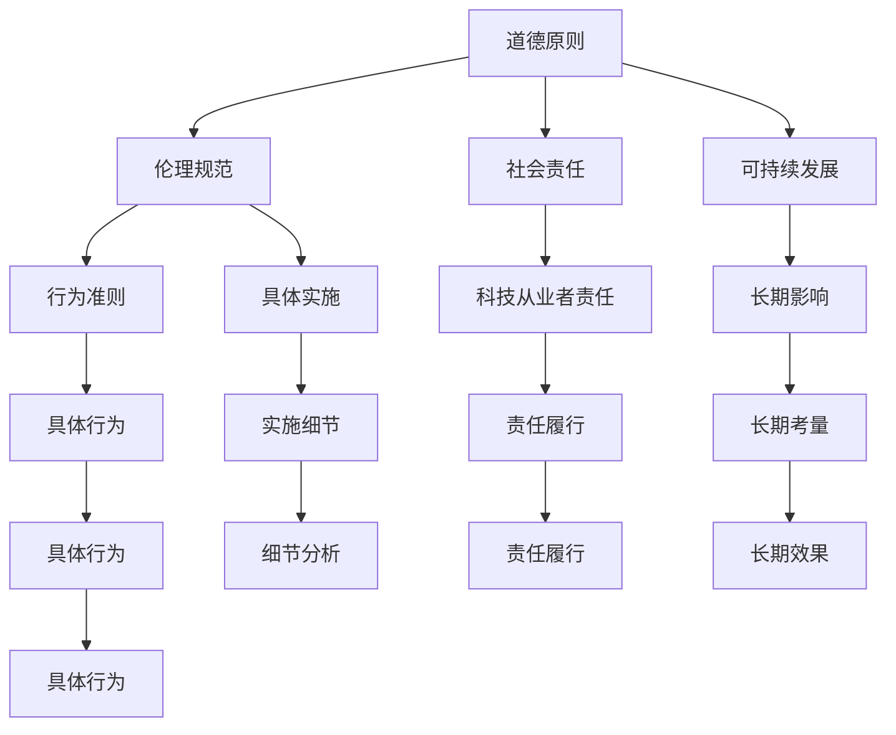

                 

### 文章标题：科技伦理：在进步中保持人性与意义

科技伦理作为21世纪的重要议题，日益受到学术界、产业界和公众的广泛关注。在科技飞速发展的时代，如何在科技进步的同时维护人性与社会的和谐发展，成为我们必须深思的问题。本文旨在从科技伦理的基本概念、历史发展、核心领域、案例分析以及未来展望等多个维度，对科技伦理进行系统性探讨，以期为我们提供关于科技伦理问题的深刻见解和有效解决方案。

### 文章关键词

- 科技伦理
- 人工智能伦理
- 生物技术伦理
- 环境科技伦理
- 信息技术伦理
- 科技与社会
- 科技发展

### 文章摘要

本文围绕科技伦理这一核心主题，首先介绍了科技伦理的定义及其重要性，回顾了科技伦理的历史发展，并分别探讨了人工智能、生物技术、环境科技和信息技术等领域的伦理问题及其解决方案。接着，通过综合案例分析，阐述了科技伦理在具体项目中的应用，并展望了科技伦理的未来发展趋势。文章旨在通过深入分析，帮助读者理解科技伦理的内涵，从而在科技进步中保持人性与社会的和谐发展。

---

### 第一部分：科技伦理概述

#### 第1章：科技伦理的定义与重要性

科技伦理是关于科技领域内道德和伦理问题的研究。它探讨科技的发展和应用对人类、社会和环境可能带来的影响，旨在确保科技发展符合道德和伦理标准，以实现人类和社会的可持续发展。

**核心概念与联系**

科技伦理的核心概念包括道德原则、伦理规范、社会责任和可持续发展等。这些概念之间相互关联，形成一个有机的整体。例如，道德原则是科技伦理的基础，伦理规范是具体实施道德原则的行为准则，社会责任强调科技从业者在科技发展中的责任和义务，而可持续发展则关注科技发展的长期影响。

**Mermaid 流程图**



**核心算法原理讲解**

虽然科技伦理不是一种具体的算法，但我们可以通过逻辑推理来分析其原则。以下是科技伦理原则的逻辑结构伪代码：

```python
def ethics_principles():
    # 定义道德原则
    moral_principles = ["公正性", "尊重个人", "避免伤害", "追求利益"]

    # 定义伦理规范
    ethical_norms = ["知情同意", "透明度", "隐私保护", "公平性"]

    # 定义社会责任
    social_responsibilities = ["可持续发展", "社会责任", "环境保护"]

    # 定义可持续发展
    sustainable_development = ["经济", "社会", "环境"]

    # 打印出所有相关概念和联系
    print("道德原则：", moral_principles)
    print("伦理规范：", ethical_norms)
    print("社会责任：", social_responsibilities)
    print("可持续发展：", sustainable_development)

    # 检查各概念之间的联系
    for principle in moral_principles:
        for norm in ethical_norms:
            if principle in norm:
                print(f"{principle}与{norm}有直接联系。")

        for responsibility in social_responsibilities:
            if principle in responsibility:
                print(f"{principle}与{responsibility}有直接联系。")

    # 检查可持续发展各层面的联系
    for aspect in sustainable_development:
        for responsibility in social_responsibilities:
            if aspect in responsibility:
                print(f"{aspect}是{responsibility}的一部分。")
```

**数学模型和公式**

虽然科技伦理通常不涉及具体的数学模型，但在某些情况下，我们可以使用数学公式来量化某些伦理概念，如可持续发展的经济、社会和环境效益。以下是一个简化的可持续性评估模型：

$$
\text{Sustainability Score} = \frac{\text{Economic Benefit} + \text{Social Benefit} + \text{Environmental Benefit}}{3}
$$

其中，各个效益可以用具体的指标来衡量，如GDP增长率、社会福利指标和生态足迹等。

**详细讲解与举例说明**

以人工智能伦理为例，我们可以通过以下案例来说明道德原则在实际应用中的体现：

**案例：自动驾驶汽车的伦理决策**

假设一辆自动驾驶汽车在城市道路中行驶，突然遇到一个行人横穿马路。此时，汽车必须在极短时间内做出决策：是保护行人还是保护乘客？

1. **尊重个人**：汽车应当尊重行人的生命权，选择保护行人。
2. **避免伤害**：尽管选择保护行人可能导致乘客受伤，但这是为了避免更大的伤害。
3. **公正性**：汽车在决策时应当基于客观的数据和算法，而不是基于乘客的身份或地位。

通过这种案例分析，我们可以看到科技伦理原则在实际应用中的重要性。

**项目实战**

在人工智能领域，科技伦理的实际应用可以通过建立伦理审查委员会来实现。以下是一个简单的人工智能项目实战案例：

1. **开发环境搭建**：安装Python、TensorFlow等工具，搭建一个简单的机器学习环境。
2. **源代码实现**：编写一个简单的自动驾驶算法，用于处理行人横穿马路的决策。
3. **代码解读**：解析代码，确保其遵循伦理原则，如通过权重分配来保护行人安全。
4. **应用解读与分析**：将算法应用于模拟场景，分析其决策过程，评估是否符合伦理标准。
5. **实际案例分析和详细讲解剖析**：通过模拟实验，分析不同情况下的决策结果，讨论可能的改进方案。
6. **项目小结**：总结项目的经验教训，提出未来研究的方向和改进建议。

**最佳实践 tips、小结、注意事项、拓展阅读等内容**

- **最佳实践 tips**：在人工智能项目中，应建立严格的伦理审查机制，确保算法的公平性和透明度。
- **小结**：科技伦理是确保科技发展符合道德和伦理标准的必要手段，对于人工智能、生物技术等领域尤为重要。
- **注意事项**：在应用科技时，务必考虑其长期影响，避免短视行为。
- **拓展阅读**：推荐阅读《人工智能伦理指南》、《生物伦理学》等书籍，以深入了解科技伦理的各个方面。

通过上述内容，我们不仅对科技伦理的定义和重要性有了深入理解，还通过具体的案例和实践，展示了科技伦理在各个领域的应用。在接下来的章节中，我们将进一步探讨科技伦理在各个核心领域的具体问题和解决方案。

