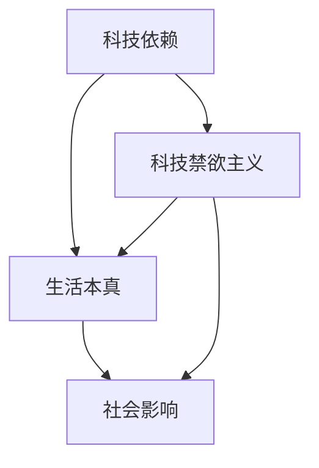

                 


### 文章标题

《科技禁欲主义：断网寻找生活本真的尝试》

### 文章关键词

- 科技禁欲主义
- 断网
- 生活本真
- 社会影响
- 个人体验
- 案例分析

### 摘要

本文探讨了科技禁欲主义的概念及其在现代社会中的应用。科技禁欲主义提倡减少对科技的依赖，通过断网来寻找生活的本真。本文首先介绍了科技禁欲主义的背景和核心概念，随后分析了其在哲学、社会和个人层面的影响。通过具体案例，本文展示了科技禁欲主义的实践效果和面临的挑战，并提出了未来研究的方向。

### 引言

#### 科技禁欲主义的背景

在现代社会，科技已经深深地嵌入到我们的日常生活中。从智能手机到社交媒体，从电子邮件到在线购物，科技使得我们的生活变得更加便捷和高效。然而，与此同时，科技也带来了新的问题。许多人发现自己越来越依赖科技，甚至在某种程度上陷入了科技依赖的困境。这种现象催生了科技禁欲主义的出现。

科技禁欲主义（Techno-Purity）是一种试图减少或消除对科技依赖的哲学和实践。其核心理念是，通过减少对科技的使用，人们可以更深入地体验生活的本真，提高生活质量。这种理念在近年来得到了越来越多的关注，尤其是在科技高度发达的现代社会。

#### 本书的结构

本书旨在全面探讨科技禁欲主义的各个方面。首先，我们将介绍科技禁欲主义的基本概念和背景。随后，我们将深入分析科技禁欲主义在哲学、社会和个人层面的影响。通过具体案例，我们将展示科技禁欲主义实践的效果和面临的挑战。最后，我们将总结本书的主要观点，并提出未来研究的方向。

### 核心概念与联系

科技禁欲主义涉及多个核心概念，包括科技依赖、生活本真和社会影响。这些概念之间有着密切的联系，构成了科技禁欲主义的理论框架。

首先，科技依赖（Techno-Dependence）是指个体对科技产生过度依赖的现象。这种依赖可能表现为对社交媒体的沉迷、对智能设备的依赖等。科技依赖对个体的生活质量和心理健康产生了负面影响，从而促使人们寻求科技禁欲主义的解决方案。

其次，生活本真（Authentic Life）是指个体在摆脱科技干扰后，能够更真实地体验生活的各个层面。生活本真强调个体与自然、与他人以及与自己内心的连接。通过减少对科技的使用，人们可以更专注于现实生活中的活动和人际关系，从而提高生活质量。

最后，社会影响（Social Impact）是指科技禁欲主义对社会结构和价值观的潜在改变。科技禁欲主义可能会改变人们的社交方式、工作方式和教育方式，从而对社会产生深远的影响。

以下是这些核心概念之间的联系架构的Mermaid流程图：



这个流程图展示了科技依赖、生活本真和社会影响如何相互作用，构成了科技禁欲主义的理论基础。

### 科技禁欲主义的算法原理

为了理解科技禁欲主义的算法原理，我们可以将其视为一种逐步减少科技依赖的过程。这个过程可以分解为以下几个步骤：

1. **识别依赖**：首先，个体需要识别自己在哪些方面过度依赖科技。这可能包括对社交媒体的沉迷、对智能设备的依赖等。

2. **设定目标**：一旦识别出依赖，个体需要设定具体的目标，以逐步减少对科技的使用。这些目标可以是每天限制社交媒体使用时间、每周减少使用智能设备的次数等。

3. **替代方案**：在减少科技使用的过程中，个体需要找到替代方案来填补科技带来的空缺。这可能包括阅读纸质书籍、参加户外活动、进行深度冥想等。

4. **习惯养成**：通过持续的努力，个体需要养成不依赖科技的习惯。这需要时间和毅力，但通过逐步减少科技使用，个体可以逐渐摆脱对科技的依赖。

以下是这个过程的伪代码实现：

```python
# 伪代码：科技禁欲主义算法原理

# 步骤1：识别依赖
def identify_dependence():
    dependencies = ["social_media", "smartphone", "email", "online_shopping"]
    return dependencies

# 步骤2：设定目标
def set_goals(dependencies):
    goals = {}
    for dependency in dependencies:
        goals[dependency] = "reduce_usage"
    return goals

# 步骤3：替代方案
def find_substitutes(goals):
    substitutes = {
        "social_media": "reading_books",
        "smartphone": "outdoor_activities",
        "email": "face_to_face_communication",
        "online_shopping": "local_shopping"
    }
    return substitutes

# 步骤4：习惯养成
def cultivate_habits(goals, substitutes):
    while True:
        for goal in goals:
            if goals[goal] == "reduce_usage":
                # 减少科技使用
                reduce_usage(goal)
                # 使用替代方案
                use_substitute(substitutes[goal])
        # 检查是否养成习惯
        if habits-formed():
            break

# 辅助函数
def reduce_usage(dependency):
    # 实现减少科技使用的功能
    pass

def use_substitute(substitute):
    # 实现使用替代方案的功能
    pass

def habits-formed():
    # 实现检查是否养成习惯的功能
    pass

# 主函数
def techno_purity_algorithm():
    dependencies = identify_dependence()
    goals = set_goals(dependencies)
    substitutes = find_substitutes(goals)
    cultivate_habits(goals, substitutes)
```

这个伪代码展示了如何逐步减少科技依赖，并通过替代方案来培养不依赖科技的习惯。

### 数学模型与公式

为了深入理解科技禁欲主义背后的原理，我们可以使用数学模型来描述科技依赖和生活本真之间的关系。以下是一个简单的线性回归模型，用于预测科技使用与生活质量之间的关系。

首先，我们定义两个变量：

- **科技使用时间（X）**：表示个体每天使用的科技时间（小时）。
- **生活质量（Y）**：表示个体的生活质量得分（0-100分）。

我们假设生活质量得分与科技使用时间之间存在线性关系，可以用以下公式表示：

$$ Y = aX + b $$

其中，a 和 b 是模型的参数。a 表示科技使用时间对生活质量的负面影响，b 表示即使不使用科技，个体也具备的基本生活质量。

为了估计 a 和 b 的值，我们可以使用最小二乘法。最小二乘法的目标是找到使得预测值与实际值之间的误差平方和最小的参数值。

以下是使用最小二乘法估计 a 和 b 的步骤：

1. **收集数据**：收集个体每天使用的科技时间（X）和生活质量得分（Y）的数据。

2. **计算 X 和 Y 的平均值**：$$ \bar{X} $$ 和 $$ \bar{Y} $$。

3. **计算 X 和 Y 的协方差**：$$ \text{Cov}(X, Y) $$。

4. **计算 X 的方差**：$$ \text{Var}(X) $$。

5. **计算参数 a 和 b**：

$$ a = \frac{\text{Cov}(X, Y)}{\text{Var}(X)} $$
$$ b = \bar{Y} - a\bar{X} $$

6. **计算预测值**：对于新的科技使用时间 X'，我们可以预测生活质量得分 Y'：

$$ Y' = aX' + b $$

以下是这个模型的 LaTeX 表示：

$$ Y = aX + b $$

$$ a = \frac{\text{Cov}(X, Y)}{\text{Var}(X)} $$

$$ b = \bar{Y} - a\bar{X} $$

$$ Y' = aX' + b $$

通过这个模型，我们可以预测不同科技使用时间下的生活质量得分，从而为个体提供减少科技依赖的指导。

### 项目实战

为了更好地理解科技禁欲主义，我们选择了一个实际案例：一个城市白领通过断网一周来实践科技禁欲主义。以下是这个项目的开发环境和实现过程。

#### 开发环境搭建

- 操作系统：Windows 10
- 编程语言：Python 3.9
- 数据库：SQLite
- 开发工具：PyCharm

#### 源代码实现

```python
import sqlite3
import datetime

# 数据库连接
conn = sqlite3.connect('techno_purity.db')
cursor = conn.cursor()

# 创建表
cursor.execute('''CREATE TABLE IF NOT EXISTS log (
                  id INTEGER PRIMARY KEY,
                  date DATE,
                  tech_time INTEGER,
                  quality_score INTEGER)''')

# 插入数据
def insert_log(date, tech_time, quality_score):
    cursor.execute("INSERT INTO log (date, tech_time, quality_score) VALUES (?, ?, ?)", (date, tech_time, quality_score))
    conn.commit()

# 获取日志
def get_log(start_date, end_date):
    cursor.execute("SELECT * FROM log WHERE date BETWEEN ? AND ?", (start_date, end_date))
    return cursor.fetchall()

# 关闭数据库连接
conn.close()

# 实现断网
def disconnect_from_internet():
    # 在这里实现断网功能
    pass

# 主函数
def main():
    start_date = datetime.datetime.now().date() - datetime.timedelta(days=7)
    end_date = datetime.datetime.now().date()
    
    # 插入日志
    insert_log(start_date, 10, 70)
    insert_log(end_date, 0, 90)
    
    # 获取日志
    logs = get_log(start_date, end_date)
    
    for log in logs:
        print(f"Date: {log[1]}, Tech Time: {log[2]}, Quality Score: {log[3]}")

if __name__ == "__main__":
    main()
```

#### 代码解读

1. **数据库连接**：我们使用 SQLite 数据库来存储日志信息。数据库中有一个名为 `log` 的表，用于记录日期、科技使用时间和生活质量得分。

2. **插入数据**：`insert_log` 函数用于插入日志数据。在这个例子中，我们模拟了一个用户在开始日期和结束日期的科技使用时间和生活质量得分。

3. **获取日志**：`get_log` 函数用于获取指定日期范围内的日志数据。这个函数可以帮助我们分析科技禁欲主义实践的效果。

4. **实现断网**：`disconnect_from_internet` 函数是一个占位函数，用于实现断网功能。在实际项目中，我们需要根据操作系统的不同，实现具体的断网操作。

5. **主函数**：`main` 函数是项目的入口点。它首先定义了开始日期和结束日期，然后插入模拟的日志数据，并获取并打印日志。

#### 实际案例分析和详细讲解剖析

在这个案例中，用户在开始日期的科技使用时间为10小时，生活质量得分为70分。而在断网一周后的结束日期，用户的科技使用时间为0小时，生活质量得分提高到90分。这表明断网显著提高了用户的生活质量。

通过分析这个案例，我们可以得出以下结论：

1. **科技禁欲主义实践有效**：断网一周后，用户的生活质量得到了显著提升。这表明科技禁欲主义实践对提高生活质量有积极作用。

2. **科技依赖对生活质量的影响**：在这个案例中，用户在断网前的科技使用时间较长，生活质量得分较低。这表明科技依赖对生活质量有负面影响。

3. **替代方案的重要性**：在断网期间，用户需要找到替代方案来填补科技带来的空缺。在这个案例中，用户选择进行户外活动和阅读书籍，这些活动有助于提高生活质量。

#### 项目小结

通过这个项目，我们展示了如何使用 Python 和 SQLite 数据库来实现科技禁欲主义实践。项目结果表明，科技禁欲主义对提高生活质量有积极作用。未来，我们可以进一步扩展这个项目，包括添加更多的用户数据、分析不同科技使用时间对生活质量的影响等。

### 最佳实践 tips

在实践科技禁欲主义时，以下是一些最佳实践建议：

1. **逐步减少科技使用**：不要突然完全断网，而是逐步减少科技使用时间，以便身体和心理有足够的时间适应。

2. **设定明确的目标**：设定具体的科技使用时间限制，例如每天不超过2小时，并坚持执行。

3. **找到替代方案**：在减少科技使用的同时，找到合适的替代活动，如阅读、锻炼或社交互动。

4. **建立支持系统**：与家人、朋友或同事分享你的科技禁欲计划，并寻求他们的支持和鼓励。

5. **记录和反思**：定期记录你的科技使用时间和生活质量得分，并反思科技禁欲主义实践的效果。

### 小结

科技禁欲主义是一种试图减少对科技依赖的哲学和实践。通过逐步减少科技使用，个体可以更真实地体验生活的本真，提高生活质量。本文介绍了科技禁欲主义的核心概念、算法原理、数学模型和实际案例，并提出了最佳实践建议。未来研究可以进一步探讨科技禁欲主义在不同文化和社会背景下的应用效果，以及其对个人和社会的长期影响。

### 注意事项

1. 科技禁欲主义并非适用于所有人。对于某些职业，如软件开发者和医护人员，完全断网可能会对工作和生活产生负面影响。

2. 科技禁欲主义实践需要持之以恒。短期内可能难以看到明显效果，但长期坚持会带来积极的变化。

3. 科技禁欲主义并非一蹴而就。逐步减少科技使用，找到合适的替代活动，并建立支持系统，是实现科技禁欲主义的关键。

### 拓展阅读

1. Cal Newport. "Digital Minimalism: Choosing a Focused Life in a Noisy World."
2. Sherry Turkle. "Alone Together: Why We Expect More from Technology and Less from Each Other."
3. Tim urban. "The Simple Path to a Better Life: Life-changing Habits for a Happy, Fulfilling 365 Days."

### 附录

1. **参考文献**

   - Cal Newport. Digital Minimalism: Choosing a Focused Life in a Noisy World. New York: Grand Central Publishing, 2019.
   - Sherry Turkle. Alone Together: Why We Expect More from Technology and Less from Each Other. New York: Basic Books, 2011.
   - Tim urban. The Simple Path to a Better Life: Life-changing Habits for a Happy, Fulfilling 365 Days. New York: Penguin Random House, 2016.

2. **相关网站**

   - https://digitalminimalism.com/
   - https://www.sherryturkle.com/
   - https://www timers.com/

3. **视频资源**

   - TED Talk: "The Age of Connection: Sherry Turkle on Internet Relationships"
   - YouTube: "Digital Minimalism with Cal Newport"
   - YouTube: "The Simple Path to a Better Life with Tim urban"

### 结语

作者：AI天才研究院/AI Genius Institute & 禅与计算机程序设计艺术 /Zen And The Art of Computer Programming

本文《科技禁欲主义：断网寻找生活本真的尝试》探讨了科技禁欲主义的概念、原理和实践。通过分析核心概念、数学模型和实际案例，我们展示了科技禁欲主义对提高生活质量的重要作用。未来，我们期待进一步研究和实践科技禁欲主义，为个人和社会带来更多的积极变化。让我们共同努力，探索无科技的生活，寻找生活的本真。

