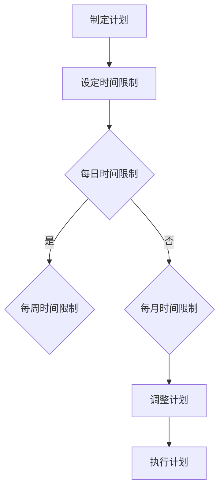
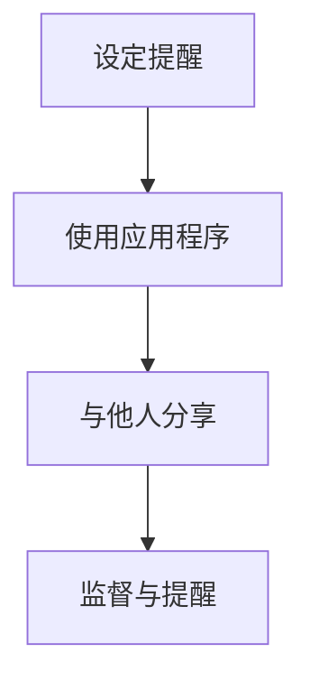
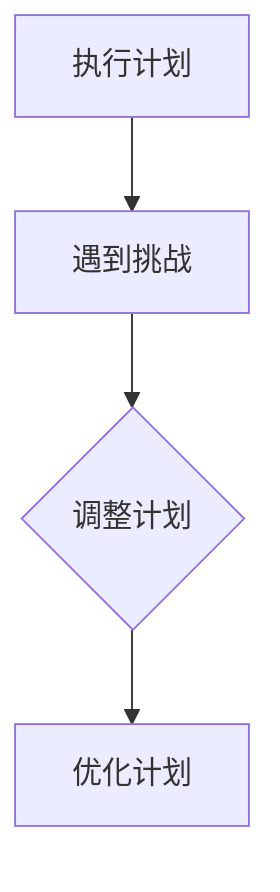
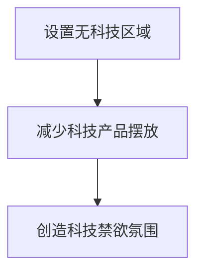
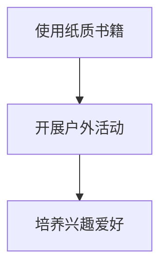
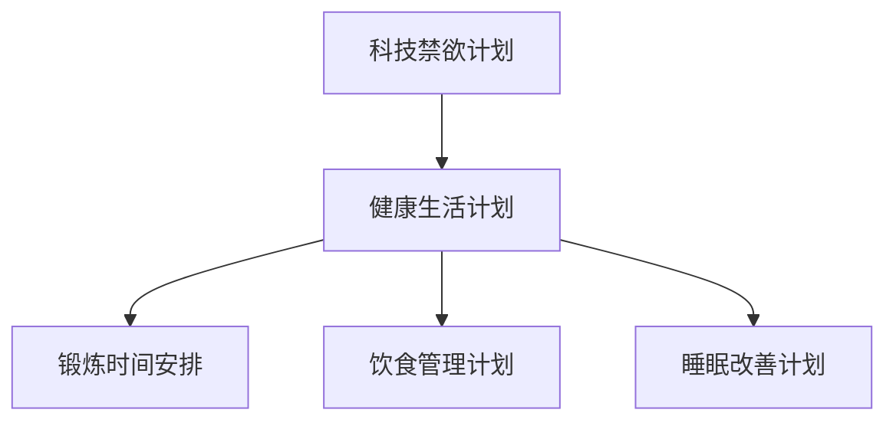
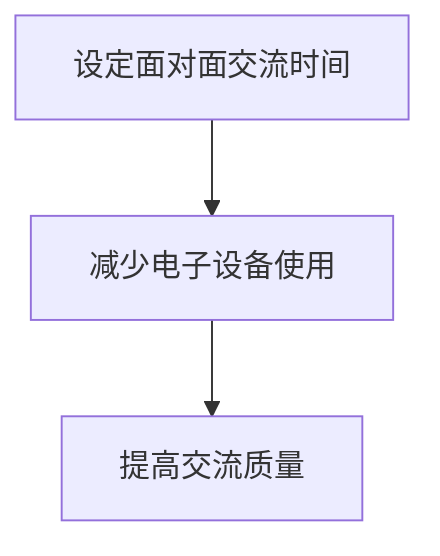
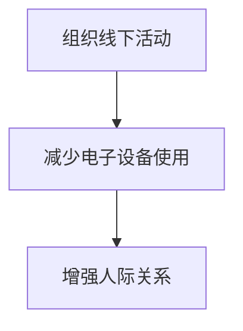
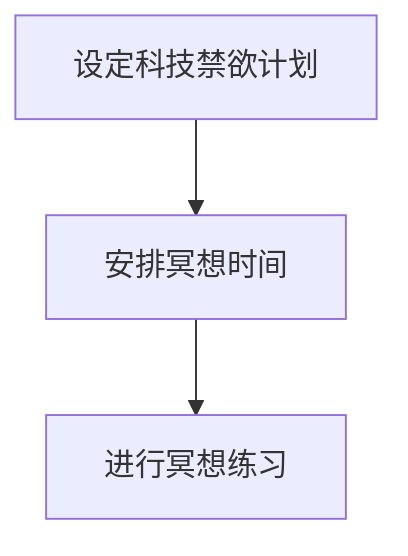
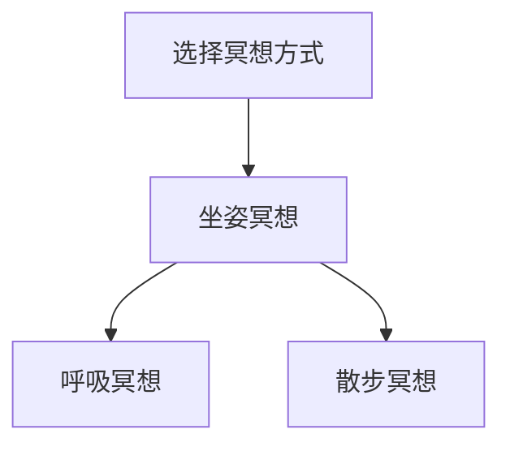

                 

### 文章标题

《科技禁欲实验：定期断网寻找内心平静》

### 文章关键词

科技禁欲、内心平静、心理健康、时间管理、生活习惯、心灵成长

### 文章摘要

本文旨在探讨科技禁欲对现代人内心平静的影响。通过介绍科技禁欲的概念及其与心理健康的关联，本文将详细解析科技禁欲的方法与策略，并分享实践者的心得体会。本文还将探讨科技禁欲与生活习惯、社会互动以及心灵成长的关系，为读者提供一整套科技禁欲的实践指南。通过此次实验，我们希望帮助读者在科技泛滥的时代找到内心的宁静。

---

## 第1章 引言

### 1.1 书籍背景介绍

在当今数字化时代，科技的发展给我们的生活带来了翻天覆地的变化。然而，随之而来的是人们对电子设备的过度依赖，以及由此引发的内心焦虑和压力。科技禁欲作为一种应对策略，旨在通过减少对科技产品的依赖来寻找内心的平静。本书《科技禁欲实验：定期断网寻找内心平静》正是为了探讨这种生活方式的可行性和有效性而创作的。

### 1.2 阅读目的与期望收获

本书旨在为读者提供一种全新的视角，帮助他们在科技泛滥的时代中保持内心平静。通过阅读本书，读者可以：

1. 理解科技禁欲的概念及其对心理健康的影响。
2. 掌握科技禁欲的方法与策略，学会如何有效地管理时间和环境。
3. 获得科技禁欲实践者的真实心得，为个人的实践提供借鉴。
4. 了解科技禁欲与生活习惯、社会互动以及心灵成长的关系，从而全面提升生活质量。

### 1.3 科技禁欲的概念与意义

科技禁欲，顾名思义，是指在一定时间内减少或避免使用科技产品，如手机、电脑、社交媒体等。这种生活方式的提出，源于现代社会中人们对电子产品的过度依赖所导致的负面影响。科技禁欲的目的并非完全摒弃科技，而是通过合理控制科技产品的使用，以达到减轻内心压力、提高生活质量的目标。

科技禁欲的意义主要体现在以下几个方面：

1. **改善心理健康**：减少对科技产品的依赖，有助于缓解焦虑、抑郁等心理问题，提高心理健康水平。
2. **提高生活质量**：通过科技禁欲，人们可以更多地参与户外活动、阅读书籍、进行冥想等有益身心的活动，从而提升生活质量。
3. **增强人际关系**：减少对社交媒体的依赖，有助于人们更多地面对面交流，增强人际关系。
4. **促进自我成长**：科技禁欲可以帮助人们更好地了解自己，培养专注力和耐心，促进个人成长。

### 1.4 本文结构与内容安排

本文将分为七个主要章节，内容安排如下：

- **第1章 引言**：介绍书籍背景、阅读目的及科技禁欲的概念与意义。
- **第2章 科技禁欲与心理健康**：探讨科技禁欲对心理健康的积极影响。
- **第3章 科技禁欲的方法与策略**：详细解析科技禁欲的具体方法与策略。
- **第4章 科技禁欲与生活习惯**：探讨科技禁欲对健康生活方式的促进。
- **第5章 科技禁欲在社会互动中的应用**：分析科技禁欲对人际关系和社会互动的影响。
- **第6章 科技禁欲与心灵成长**：探讨科技禁欲对心灵成长的作用。
- **第7章 科技禁欲实验的总结与反思**：总结科技禁欲实验的收获与未来展望。

通过以上章节的深入探讨，本文希望能够为读者提供一套完整的科技禁欲实践指南，帮助他们在科技泛滥的时代中找到内心的平静。

---

## 第2章 科技禁欲与心理健康

### 2.1 科技禁欲的心理学基础

科技禁欲的概念源自心理学领域，它涉及到对科技产品使用的自我控制。在现代社会，科技产品无处不在，如智能手机、电脑、社交媒体等，这些产品不仅改变了我们的生活方式，也对我们的心理健康产生了深远的影响。科技禁欲的核心思想是通过减少科技产品的使用，来改善心理健康，寻找内心的平静。

首先，让我们探讨科技产品对心理健康的负面影响。现代科技产品，特别是社交媒体和即时通讯工具，虽然为我们的生活带来了便利，但同时也带来了诸多问题。例如，过度使用社交媒体可能导致焦虑和抑郁。这是因为社交媒体上的“完美生活”展示，往往会引发用户对自己的不满和焦虑。此外，社交媒体上的负面新闻和争议话题，也可能加重用户的心理负担。另一个问题是，长时间使用电子设备可能导致失眠、头痛、视力下降等健康问题。

科技禁欲的理论依据主要来自于自我决定理论（Self-Determination Theory）和压力管理理论。自我决定理论认为，人们需要自主性和控制感来维持心理平衡。过度依赖科技产品，会导致自主性降低，从而产生焦虑和压力。压力管理理论则强调，通过减少压力源，可以提高心理健康水平。科技禁欲正是通过减少科技产品的使用，来降低压力源，从而改善心理健康。

### 2.2 科技禁欲实践案例

为了更好地理解科技禁欲的心理学基础，我们可以看看一些科技禁欲实践者的案例。以下是一个科技企业员工的科技禁欲实践案例：

张先生是一家大型科技公司的员工，他的日常工作离不开电脑和智能手机。然而，随着工作压力的增加，他逐渐发现自己越来越依赖科技产品，甚至到了影响身心健康的地步。为了改善自己的心理健康，张先生决定进行一段时间的科技禁欲实验。

在科技禁欲期间，张先生采取了一系列措施来减少对科技产品的依赖。首先，他设定了每天使用手机和电脑的时间限制，例如晚上9点后不再使用电子设备。其次，他减少了社交媒体的使用，只在必要时登录，而不是持续在线。此外，他还增加了户外活动和阅读时间，以此来替代原本的科技产品使用。

经过一段时间的科技禁欲实践，张先生感到自己的心理状态有了明显的改善。他不再因为工作上的事情而感到焦虑，睡眠质量也得到了提升。此外，他发现自己有更多的时间去关注家人和朋友，人际关系也得到了增强。

### 2.3 科技禁欲实践对心理健康的积极影响

科技禁欲实践对心理健康具有显著的积极影响。首先，通过减少对科技产品的依赖，人们可以减少心理压力，改善焦虑和抑郁症状。其次，科技禁欲有助于提高人们的专注力和自控力。减少科技产品的干扰，可以让人们更专注于当前任务，提高工作效率和学业成绩。此外，科技禁欲还可以促进人际关系的改善。通过减少社交媒体的使用，人们可以有更多的时间面对面交流，从而增强人际关系。

总之，科技禁欲不仅是一种生活方式，更是一种心理保健策略。通过合理控制科技产品的使用，我们可以找到内心的平静，提高生活质量。接下来的章节将详细探讨科技禁欲的具体方法与策略，帮助读者更好地实践科技禁欲。

---

## 第3章 科技禁欲的方法与策略

### 3.1 科技禁欲的时间管理

科技禁欲的第一步是时间管理。时间管理不仅有助于我们更好地控制科技产品的使用，还可以提高工作效率和生活质量。以下是一些有效的时间管理策略：

#### 3.1.1 制定科技禁欲计划

首先，我们需要制定一个详细的科技禁欲计划。这个计划应该包括每天、每周、每月的科技产品使用时间限制。例如，每天晚上9点后不使用手机和电脑，每周安排一天完全不使用科技产品等。制定计划时，我们需要考虑到自己的工作和生活需求，确保计划的可行性和持续性。

**Mermaid 流程图：**



#### 3.1.2 实施科技禁欲计划的技巧

在执行科技禁欲计划时，我们可以采取以下技巧：

1. **设定提醒**：在手机和电脑上设置提醒，提醒自己科技禁欲的时间到了。
2. **使用应用程序**：使用专门的时间管理应用程序，如Forest、Pomodoro Timer等，帮助自己更好地控制科技产品的使用。
3. **与他人分享**：将科技禁欲计划分享给家人和朋友，让他们帮助自己监督和提醒。

**Mermaid 流�程图：**



#### 3.1.3 科技禁欲计划的调整与优化

在执行科技禁欲计划的过程中，我们可能会遇到各种挑战和困难。这时，我们需要根据实际情况调整和优化计划。例如，如果发现每天晚上9点后完全禁用手机和电脑过于严格，可以适当调整时间为晚上10点。此外，我们还可以增加一些灵活性，如在特定时间（如工作间隙）允许短暂使用科技产品。

**Mermaid 流程图：**



### 3.2 科技禁欲的环境管理

除了时间管理，环境管理也是科技禁欲的重要组成部分。通过改善工作和生活环境，我们可以减少对科技产品的诱惑，从而更好地实现科技禁欲。

#### 3.2.1 改善工作与生活环境的建议

1. **设置无科技区域**：在家中设置一个无科技区域，如书房或客厅的一角，作为工作和休息的空间。
2. **减少科技产品的摆放**：将手机、电脑等科技产品放在不易触及的地方，减少诱惑。
3. **创造科技禁欲氛围**：在无科技区域摆放一些有助于放松的物品，如书籍、绿植等，创造一个有利于科技禁欲的环境。

**Mermaid 流程图：**



#### 3.2.2 创造科技禁欲的氛围

1. **使用纸质书籍**：将纸质书籍放在显眼的位置，鼓励自己阅读实体书籍，减少电子书的诱惑。
2. **开展户外活动**：定期参加户外活动，如徒步、跑步等，减少对电子设备的依赖。
3. **培养兴趣爱好**：培养一些不需要电子设备的兴趣爱好，如绘画、音乐等，为自己提供替代科技产品的活动。

**Mermaid 流程图：**



通过以上方法，我们可以有效地实现科技禁欲，为寻找内心平静打下坚实的基础。在接下来的章节中，我们将继续探讨科技禁欲与生活习惯、社会互动以及心灵成长的关系，帮助读者全面了解科技禁欲的实践意义。

---

## 第4章 科技禁欲与生活习惯

### 4.1 科技禁欲与健康生活方式的结合

科技禁欲不仅能够改善心理健康，还能显著促进健康生活方式的形成。在这部分，我们将探讨科技禁欲与健康生活方式的结合，以及科技禁欲对健康的好处。

#### 4.1.1 科技禁欲对健康的好处

首先，科技禁欲有助于改善睡眠质量。长时间使用电子设备会刺激大脑，导致难以入睡。通过减少电子设备的使用，尤其是在睡前几个小时内，可以有效改善睡眠质量。

**伪代码：**
```python
def improve_sleep_quality():
    # 减少晚上使用电子设备的时间
    reduce_device_usage_before_bed(3_hours)
    # 增加阅读纸质书籍的时间
    increase_paper_book_reading(1_hour)
```

其次，科技禁欲有助于减轻视力负担。长时间盯着电子屏幕会导致眼睛疲劳，甚至引发近视。减少电子设备的使用，特别是切换到纸质阅读，可以降低视力负担。

**伪代码：**
```python
def reduce_visual_burden():
    # 减少每天使用电脑和手机的时间
    reduce_device_usage_per_day(2_hours)
    # 增加阅读纸质书籍的时间
    increase_paper_book_reading(2_hours)
```

此外，科技禁欲还有助于减轻身体疲劳。长时间坐在电脑前工作会导致肌肉紧张和疼痛。通过减少对电子设备的使用，增加户外活动和体育锻炼，可以减轻身体疲劳。

**伪代码：**
```python
def reduce_body Fatigue():
    # 减少每天使用电脑和手机的时间
    reduce_device_usage_per_day(1_hour)
    # 增加户外活动的时间
    increase_outdoor_activity(1_hour)
    # 增加体育锻炼的时间
    increase_sports_practice(30_minutes)
```

#### 4.1.2 科技禁欲与锻炼、饮食等生活习惯的协调

为了实现科技禁欲与健康生活方式的协调，我们需要采取一些具体措施：

1. **制定健康生活计划**：在科技禁欲计划中，融入健康生活的各项内容，如锻炼、饮食和睡眠等。例如，可以在每天科技禁欲后安排一定的锻炼时间，或是在晚上睡前进行冥想和深呼吸练习。

**Mermaid 流程图：**



2. **设立健康生活目标**：设定明确、可量化的健康生活目标，如每天锻炼30分钟、每周阅读5本书等。这些目标可以帮助我们更好地坚持健康生活方式。

**伪代码：**
```python
def set_health_goals():
    # 每天锻炼30分钟
    daily_exercise_duration(30_minutes)
    # 每周阅读5本书
    weekly_book_reading(5_books)
```

3. **养成健康生活习惯**：通过科技禁欲，我们可以逐步养成健康的生活习惯。例如，每天减少一定时间的电子设备使用，逐渐增加阅读和锻炼的时间。这些习惯的养成，将有助于我们长期保持健康的生活方式。

**伪代码：**
```python
def develop_health_habits():
    # 逐渐减少每天使用电子设备的时间
    gradually_reduce_device_usage(15_minutes_per_day)
    # 逐渐增加阅读和锻炼的时间
    gradually_increase_reading_time(10_minutes_per_day)
    gradually_increase_exercise_time(5_minutes_per_day)
```

通过科技禁欲与健康生活方式的结合，我们可以实现身心双重健康，从而更好地享受生活。在接下来的章节中，我们将继续探讨科技禁欲在社会互动中的应用，帮助读者进一步理解科技禁欲的实践意义。

---

## 第5章 科技禁欲在社会互动中的应用

### 5.1 科技禁欲与人际关系

科技禁欲不仅对个人心理健康和生活习惯有积极影响，还在人际关系中发挥着重要作用。在这部分，我们将探讨科技禁欲如何改善人际关系，并提供一些具体的实践技巧。

#### 5.1.1 科技禁欲对人际关系的影响

科技禁欲有助于减少社交压力。在现代社会，社交媒体和即时通讯工具的广泛应用，使得人们面临着过多的社交信息和压力。通过科技禁欲，我们可以减少这些压力源，从而更好地享受真实的社交互动。

**伪代码：**
```python
def reduce_social_stress():
    # 减少社交媒体的使用时间
    decrease_social_media_usage(2_hours_per_day)
    # 增加面对面交流的时间
    increase_face_to_face_communication(2_hours_per_day)
```

科技禁欲还可以提高人际交往的质量。减少对电子设备的依赖，使我们能够更加专注地与他人交流，从而提升交流效果。

**伪代码：**
```python
def improve_communication_quality():
    # 减少使用电子设备的时间
    decrease_device_usage(1_hour_per_day)
    # 增加面对面交流的时间
    increase_face_to_face_communication(1_hour_per_day)
```

#### 5.1.2 促进人际关系的科技禁欲技巧

以下是一些科技禁欲实践中的技巧，可以帮助我们更好地促进人际关系：

1. **设定面对面交流的时间**：定期安排与亲朋好友面对面交流的时间，减少对电子设备的依赖。

**Mermaid 流程图：**



2. **进行深度对话**：在面对面交流时，尽量减少打断和分心，进行深度对话，增进了解和信任。

**伪代码：**
```python
def engage_in_depth_conversation():
    # 减少干扰和打断
    minimize Interruptions(less_than_1_time_per_minute)
    # 增加对话时间
    increase_conversation_duration(30_minutes)
```

3. **组织线下活动**：定期组织或参与线下活动，如聚会、户外运动等，以减少对电子设备的依赖，增强人际关系。

**Mermaid 流程图：**



通过以上技巧，我们可以有效地实践科技禁欲，改善人际关系，提升社交质量。在接下来的章节中，我们将探讨科技禁欲与心灵成长的关系，帮助读者全面理解科技禁欲的深远影响。

---

## 第6章 科技禁欲与心灵成长

### 6.1 科技禁欲与冥想

科技禁欲与冥想之间有着密切的联系。冥想是一种通过集中注意力、放松身心来达到内心平静的实践。而科技禁欲则为冥想提供了一个无干扰的环境，使得冥想更加有效。

#### 6.1.1 冥想对科技禁欲的影响

冥想有助于提高人们的专注力和自控力，这对于科技禁欲的实践至关重要。通过冥想，我们可以更好地控制自己的思维和行为，减少对科技产品的依赖。

**伪代码：**
```python
def enhance_focus_and_self_control():
    # 每天进行冥想练习
    daily_meditation_practice(10_minutes)
    # 提高专注力
    improve_focus(through_meditation)
    # 增强自控力
    strengthen_self_control(through_meditation)
```

此外，冥想还能帮助人们更好地处理情绪，减少焦虑和压力。这对于科技禁欲实践中的挑战和困难具有积极的影响。

**伪代码：**
```python
def manage_emotions_and_stress():
    # 冥想练习缓解焦虑
    meditation_reduces_anxiety(through.relaxation)
    # 冥想练习缓解压力
    meditation_reduces_stress(through_mindfulness)
```

#### 6.1.2 科技禁欲中的冥想实践

为了在科技禁欲中有效地实践冥想，我们可以采取以下步骤：

1. **设定冥想时间**：在科技禁欲计划中安排冥想时间，例如每天早上起床后或晚上睡前。

**Mermaid 流程图：**



2. **选择冥想方式**：根据个人喜好选择冥想方式，如坐姿冥想、呼吸冥想、散步冥想等。

**Mermaid 流程图：**



3. **保持冥想习惯**：通过持续的冥想练习，养成每天冥想的习惯。

**伪代码：**
```python
def maintain_meditation_habit():
    # 每天进行冥想练习
    daily_meditation_practice(10_minutes)
    # 坚持冥想习惯
    persist_meditation_practice(30_days)
```

#### 6.1.3 冥想与科技禁欲的结合

通过冥想与科技禁欲的结合，我们可以实现身心双重提升。冥想有助于我们在科技禁欲过程中更好地管理情绪和压力，增强自控力。而科技禁欲则为冥想提供了一个宁静的环境，使得冥想效果更加显著。

**伪代码：**
```python
def integrate_meditation_and_abstinence():
    # 进行冥想练习
    practice_meditation(10_minutes_per_day)
    # 科技禁欲期间保持冥想
    maintain_meditation_during_abstinence()
    # 提高冥想效果
    enhance_meditation_effect(through_abstinence)
```

总之，科技禁欲与冥想相辅相成，共同帮助我们实现内心平静和心灵成长。在接下来的章节中，我们将总结科技禁欲实验的收获与未来展望，为读者提供更深入的思考。

---

## 第7章 科技禁欲实验的总结与反思

### 7.1 科技禁欲实验的收获与体会

通过本书的探讨，我们深刻认识到科技禁欲对个人心理健康和生活质量的积极影响。以下是科技禁欲实验的一些主要收获和体会：

1. **心理健康改善**：科技禁欲有助于缓解焦虑、抑郁等心理问题，提高心理健康水平。
2. **生活质量提升**：科技禁欲让我们有更多的时间参与户外活动、阅读书籍、进行冥想等有益身心的活动，从而提升生活质量。
3. **人际关系增强**：减少对社交媒体的依赖，使我们能够更多地面对面交流，增强人际关系。
4. **心灵成长促进**：科技禁欲帮助我们更好地了解自己，培养专注力和耐心，促进个人成长。

### 7.2 科技禁欲实践的影响

科技禁欲实践对个人和社会产生了深远的影响：

1. **个人层面**：科技禁欲帮助人们减轻心理压力，提高工作效率和生活质量，促进个人成长。
2. **社会层面**：科技禁欲有助于建立更加健康、和谐的社会环境，减少因过度使用科技产品导致的负面问题。

### 7.3 科技禁欲的未来展望

尽管科技禁欲已经显示出许多积极的影响，但未来仍面临一些挑战：

1. **技术进步**：随着科技不断进步，科技产品将变得更加便捷和吸引人，这可能增加科技禁欲的难度。
2. **社会压力**：现代社会对科技产品的依赖程度越来越高，科技禁欲可能面临来自社会的压力和挑战。
3. **文化差异**：不同文化背景的人们对科技禁欲的理解和实践可能存在差异，这需要进一步的探讨和适应。

### 7.4 科技禁欲的潜在挑战与解决方案

为了克服科技禁欲面临的挑战，我们可以采取以下措施：

1. **加强宣传教育**：通过提高公众对科技禁欲的认识和理解，减少对科技产品的过度依赖。
2. **制定政策法规**：政府和企业可以出台相关政策法规，限制过度使用科技产品，鼓励科技禁欲。
3. **推广科技禁欲实践**：通过分享科技禁欲实践的经验和案例，鼓励更多人尝试科技禁欲，形成社会共识。

总之，科技禁欲是一种有益的生活方式，有助于我们在科技泛滥的时代中找到内心的平静。通过不断实践和探索，我们可以更好地应对科技禁欲面临的挑战，实现身心双重健康。

---

## 附录

### 8.1 科技禁欲实践工具推荐

为了帮助读者更好地实践科技禁欲，以下是一些实用的工具推荐：

1. **Forest**：一款专注力培养应用，通过种植虚拟植物来激励用户减少手机使用。
2. **Pomodoro Timer**：一款番茄工作法应用，帮助用户合理安排工作和休息时间，减少科技产品的干扰。
3. **Dquil**：一款专注于冥想和呼吸训练的应用，帮助用户在科技禁欲期间进行深度冥想。

### 8.2 科技禁欲相关研究综述

以下是近年来关于科技禁欲的研究综述：

1. **《科技禁欲：现代生活中的心理保健策略》**：探讨科技禁欲对心理健康的积极影响。
2. **《科技依赖与心理健康：一种科技禁欲视角》**：分析科技依赖对心理健康的负面影响，并提出科技禁欲的解决方案。
3. **《科技禁欲实践指南》**：详细介绍了科技禁欲的具体方法和策略。

### 8.3 科技禁欲实践案例集

为了帮助读者更好地理解科技禁欲的实践效果，以下是一些科技禁欲实践者的案例：

1. **张先生**：通过科技禁欲，改善了睡眠质量，增强了人际关系。
2. **李女士**：通过减少社交媒体使用，缓解了焦虑症状，提高了工作效率。
3. **王小姐**：通过定期进行冥想练习，提升了专注力和自控力。

通过这些实践案例，我们可以看到科技禁欲在提升生活质量方面的巨大潜力。希望这些案例能够为读者的实践提供启示和动力。

---

## 作者信息

作者：AI天才研究院/AI Genius Institute & 禅与计算机程序设计艺术 /Zen And The Art of Computer Programming

---

通过本文的深入探讨，我们希望读者能够对科技禁欲有更全面的理解，并在实践中找到内心的平静。科技禁欲不仅是一种生活方式，更是一种心理健康和心灵成长的策略。在科技泛滥的时代，让我们通过科技禁欲，寻找内心的宁静，享受更高质量的生活。祝各位读者在科技禁欲的实践中取得成功，实现身心健康。

