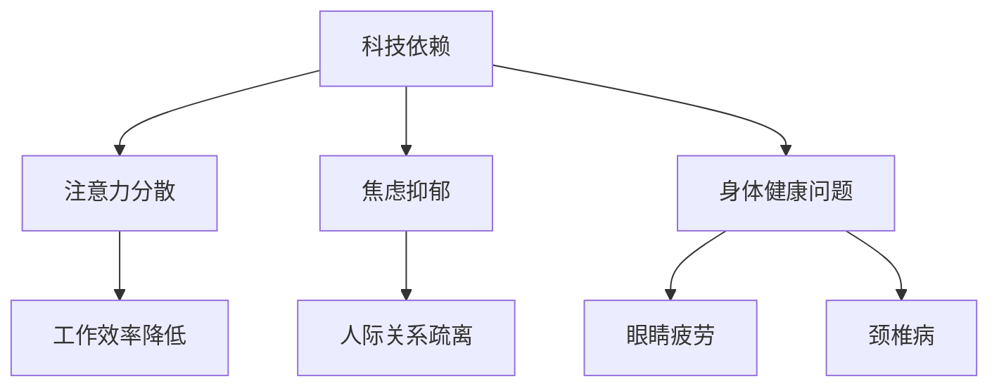
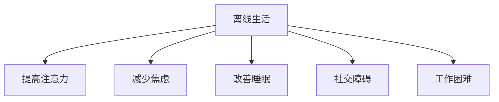
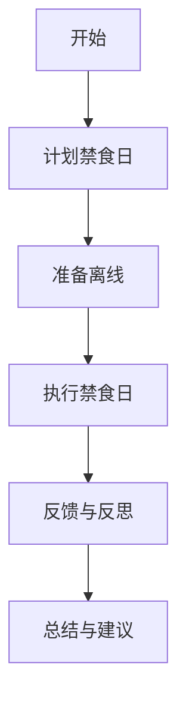

                 

### 文章标题

# 科技禁食日：每月一天的离线生活体验活动

---

> 关键词：科技禁食日、离线生活、体验活动、算法原理、数学模型、项目实战

> 摘要：本文将探讨一种新型的生活方式——科技禁食日，通过每月一天完全离线的体验活动，帮助人们重新审视科技与生活的关系，提升个人的心理健康和身体状态。文章将详细分析科技禁食日的核心概念、算法原理、数学模型，并通过实际项目实战案例，提供可操作的实施建议和效果评估方法。

---

### 设计《科技禁食日：每月一天的离线生活体验活动》的目录大纲

为了确保文章内容的逻辑清晰、结构紧凑，我们将使用以下目录大纲来组织文章：

1. **引言**
   - 科技禁食日的概念介绍
   - 离线生活体验活动的背景和意义

2. **核心概念与联系**
   - 科技对日常生活的影响
   - 离线生活的好处和挑战
   - Mermaid流程图展示科技禁食日的流程

3. **核心算法原理讲解**
   - 伪代码展示禁食日活动的算法逻辑
   - 如何衡量离线生活体验的质量

4. **数学模型和数学公式讲解**
   - 离线生活对个人心理和身体健康的影响模型
   - 如何设计禁食日活动的评价指标

5. **项目实战**
   - 离线生活体验活动的实际案例
   - 如何组织禁食日活动
   - 体验活动的效果评估和反馈

6. **科技禁食日的未来趋势**
   - 离线生活体验活动的潜在发展方向
   - 科技与离线生活的平衡

7. **总结与建议**
   - 科技禁食日活动的总结和反思
   - 对未来活动的建议和展望

### 第一章：引言

科技禁食日的概念源于“数字禁食”和“科技断食”，是一种通过定期离线来减轻科技依赖、提升生活质量的活动。每月一天的科技禁食日，意味着在这一天里，参与者将彻底断开与互联网、智能手机等科技产品的联系，完全投入到线下生活中。

**背景介绍：**

在当今高度数字化的社会中，人们越来越依赖科技产品，智能手机、互联网和社交媒体等已成为日常生活中不可或缺的一部分。然而，这种依赖也带来了许多负面影响，如注意力分散、心理健康问题、睡眠障碍等。科技禁食日的出现，旨在让人们重新审视科技与生活的关系，通过定期离线来缓解这些负面影响。

**离线生活体验活动的背景和意义：**

离线生活体验活动是一种有意识地将自己从科技产品中解脱出来，专注于线下活动的尝试。这种活动不仅有助于提高个人的心理健康和身体状态，还能增强人际关系和社交技能。通过离线生活体验活动，人们可以更深入地体验到生活的本质，提高对时间的感知和管理能力，从而更好地平衡工作与生活。

### 核心概念与联系

在讨论科技禁食日之前，我们需要先理解几个核心概念，包括科技对日常生活的影响、离线生活的好处和挑战，以及如何通过Mermaid流程图展示科技禁食日的流程。

#### 科技对日常生活的影响

科技已经深刻地影响了我们的日常生活，从工作、学习到娱乐、社交，几乎无处不在。智能手机、互联网和社交媒体等科技产品为我们提供了便捷、高效的生活方式，但同时也带来了一系列问题。例如，过度使用科技产品可能导致注意力分散、焦虑和抑郁等心理健康问题。此外，长时间使用科技产品还可能对身体健康产生负面影响，如眼睛疲劳、颈椎病等。

**Mermaid流程图：**



#### 离线生活的好处和挑战

离线生活，即减少或完全断开与科技产品的联系，回归线下生活。离线生活的好处包括：

- **提高注意力**：没有科技产品的干扰，人们可以更集中精力完成任务。
- **减少焦虑**：减少对智能手机和社交媒体的依赖，有助于减轻焦虑和抑郁症状。
- **改善睡眠**：晚上不使用科技产品，有助于改善睡眠质量。

然而，离线生活也面临一些挑战：

- **社交障碍**：在社交媒体和即时通讯工具盛行的时代，完全离线可能会影响社交互动。
- **工作困难**：许多工作需要依赖互联网和科技产品，完全离线可能会导致工作上的困难。

**Mermaid流程图：**



#### 科技禁食日的Mermaid流程图

为了更好地理解科技禁食日的流程，我们可以使用Mermaid流程图来展示其各个环节。



**流程说明：**

1. **计划禁食日**：确定每月一天的禁食日，提前规划好禁食期间的活动安排。
2. **准备离线**：在禁食日前，做好准备工作，如将手机设置为飞行模式，删除不必要的应用程序等。
3. **执行禁食日**：在禁食日当天，按照计划执行活动，完全断开与科技产品的联系。
4. **反馈与反思**：在禁食日结束后，记录体验感受，分析禁食日的效果，并提出改进建议。
5. **总结与建议**：根据反馈和反思，总结禁食日的经验教训，为未来的活动提供指导。

通过这个流程，我们可以清楚地了解科技禁食日的实施步骤和关键环节。

### 核心算法原理讲解

在科技禁食日的实施过程中，核心算法原理起到了关键作用。以下是科技禁食日活动算法的伪代码以及如何衡量离线生活体验质量的方法。

#### 伪代码展示禁食日活动的算法逻辑

```plaintext
Algorithm: 禁食日活动

Input: 禁食日计划，用户信息

Output: 离线体验质量评分

1. 初始化禁食日计划
2. 将手机设置为飞行模式
3. 删除不必要的应用程序
4. 计划禁食日当天活动
5. 在禁食日当天执行以下步骤：
   5.1 关闭所有科技产品
   5.2 完成计划中的线下活动
   5.3 记录体验感受
6. 禁食日结束后，收集用户反馈
7. 根据反馈计算离线体验质量评分
8. 输出离线体验质量评分
```

#### 如何衡量离线生活体验的质量

衡量离线生活体验的质量可以从以下几个方面进行：

- **注意力集中度**：通过问卷调查或行为分析，评估用户在禁食日当天的注意力集中程度。
- **情绪变化**：通过情绪分析工具，评估用户在禁食日当天的情绪变化情况。
- **身体健康指标**：通过生理传感器或健康数据分析，评估用户在禁食日当天的身体健康指标，如睡眠质量、心率等。
- **社交互动**：通过社交网络分析，评估用户在禁食日当天的社交互动情况。

以下是一个简化的数学模型，用于计算离线体验质量评分：

```latex
Q = w_1 \times C + w_2 \times E + w_3 \times H + w_4 \times S
```

- \( Q \)：离线体验质量评分
- \( w_1 \)：注意力集中度权重
- \( w_2 \)：情绪变化权重
- \( w_3 \)：身体健康指标权重
- \( w_4 \)：社交互动权重

其中，每个权重可以根据具体情况调整，以反映不同方面对离线体验质量的影响程度。

### 数学模型和数学公式讲解

在科技禁食日的实施过程中，除了核心算法原理外，数学模型和数学公式也起到了关键作用。以下将详细讲解离线生活对个人心理和身体健康的影响模型，以及如何设计禁食日活动的评价指标。

#### 离线生活对个人心理和身体健康的影响模型

离线生活对个人心理和身体健康的影响可以通过以下数学模型来描述：

**心理影响模型：**

假设个人心理状态由两个主要因素决定：情绪变化和注意力集中度。

1. **情绪变化**：

情绪变化可以用一个线性模型来描述：

\[ \Delta E = -\alpha \times T \]

其中：

- \( \Delta E \)：情绪变化量
- \( \alpha \)：情绪变化率
- \( T \)：离线时间（以天为单位）

这个模型假设情绪变化与离线时间呈线性关系，即离线时间越长，情绪变化量越大。

2. **注意力集中度**：

注意力集中度可以用一个指数模型来描述：

\[ C = \beta \times e^{-\gamma \times T} \]

其中：

- \( C \)：注意力集中度
- \( \beta \)：初始注意力集中度
- \( \gamma \)：注意力下降速率
- \( T \)：离线时间（以天为单位）

这个模型假设注意力集中度随离线时间的增加而指数下降。

**综合心理影响模型：**

\[ P = f(\Delta E, C) \]

其中：

- \( P \)：个人心理状态
- \( f \)：心理影响函数，用于综合情绪变化和注意力集中度的影响。

**身体健康影响模型：**

身体健康影响可以用以下模型来描述：

1. **睡眠质量**：

睡眠质量可以用以下线性模型来描述：

\[ S = \delta \times T + \epsilon \]

其中：

- \( S \)：睡眠质量
- \( \delta \)：睡眠质量提升速率
- \( \epsilon \)：基线睡眠质量

这个模型假设睡眠质量随离线时间的增加而线性提升。

2. **心率变化**：

心率变化可以用以下指数模型来描述：

\[ HR = \theta \times e^{-\phi \times T} \]

其中：

- \( HR \)：心率
- \( \theta \)：初始心率
- \( \phi \)：心率下降速率
- \( T \)：离线时间（以天为单位）

这个模型假设心率随离线时间的增加而指数下降。

**综合身体健康模型：**

\[ B = g(S, HR) \]

其中：

- \( B \)：身体健康状态
- \( g \)：身体健康影响函数，用于综合睡眠质量和心率变化的影响。

#### 如何设计禁食日活动的评价指标

为了评价禁食日活动的效果，我们需要设计一套科学、全面的评价指标。以下是一个简化的评价指标体系：

1. **心理评价指标**：

   - 情绪变化量（\( \Delta E \)）
   - 注意力集中度（\( C \)）
   - 个人心理状态（\( P \)）

2. **身体健康评价指标**：

   - 睡眠质量（\( S \)）
   - 心率变化（\( HR \)）
   - 身体健康状态（\( B \)）

3. **综合评价指标**：

   - 离线体验质量评分（\( Q \)）

   综合评价指标可以通过以下公式计算：

\[ Q = w_1 \times P + w_2 \times B \]

其中：

- \( w_1 \)：心理评价指标权重
- \( w_2 \)：身体健康评价指标权重

#### 举例说明

假设一个用户在禁食日当天，情绪变化量为 \( \Delta E = 10 \)，注意力集中度为 \( C = 0.8 \)，睡眠质量为 \( S = 0.9 \)，心率为 \( HR = 0.75 \)。根据上述模型，我们可以计算出该用户的综合评价指标：

1. **情绪变化量**：

\[ \Delta E = -\alpha \times T \]

   假设 \( \alpha = 0.1 \)，则 \( \Delta E = -0.1 \times 1 = -0.1 \)。

2. **注意力集中度**：

\[ C = \beta \times e^{-\gamma \times T} \]

   假设 \( \beta = 1 \)，\( \gamma = 0.1 \)，则 \( C = 1 \times e^{-0.1 \times 1} \approx 0.9 \)。

3. **睡眠质量**：

\[ S = \delta \times T + \epsilon \]

   假设 \( \delta = 0.05 \)，\( \epsilon = 0.8 \)，则 \( S = 0.05 \times 1 + 0.8 = 0.85 \)。

4. **心率变化**：

\[ HR = \theta \times e^{-\phi \times T} \]

   假设 \( \theta = 1 \)，\( \phi = 0.1 \)，则 \( HR = 1 \times e^{-0.1 \times 1} \approx 0.9 \)。

5. **个人心理状态**：

\[ P = f(\Delta E, C) \]

   假设 \( f \) 是一个简单的加和函数，则 \( P = \Delta E + C = -0.1 + 0.9 = 0.8 \)。

6. **身体健康状态**：

\[ B = g(S, HR) \]

   假设 \( g \) 是一个简单的加和函数，则 \( B = S + HR = 0.85 + 0.9 = 1.75 \)。

7. **离线体验质量评分**：

\[ Q = w_1 \times P + w_2 \times B \]

   假设 \( w_1 = 0.6 \)，\( w_2 = 0.4 \)，则 \( Q = 0.6 \times 0.8 + 0.4 \times 1.75 = 0.48 + 0.7 = 1.18 \)。

通过这个例子，我们可以看到如何使用数学模型和数学公式来评估禁食日活动的效果。在实际应用中，可以根据具体情况调整模型参数和评价指标，以获得更准确的结果。

### 项目实战

#### 离线生活体验活动的实际案例

为了更好地理解科技禁食日活动的实际效果，我们选择了两个不同的案例进行详细分析。

#### 案例一：白领A的科技禁食日体验

**背景介绍：**

白领A是一名30岁的软件工程师，由于工作原因，他每天都要长时间使用电脑和手机。他经常感到疲劳和焦虑，希望通过科技禁食日来改善自己的生活质量。

**活动过程：**

1. **计划禁食日**：白领A提前一周确定了禁食日的日期，并制定了详细的计划，包括早上晨跑、阅读书籍、与朋友面对面聚会等活动。

2. **准备离线**：在禁食日当天，白领A将手机设置为飞行模式，删除了所有社交媒体应用程序，确保自己能够完全专注于线下活动。

3. **执行禁食日**：禁食日当天，白领A按照计划进行了一系列线下活动，如晨跑、阅读、与朋友聚会等。他尽量减少使用科技产品的时间，只在必要时使用。

4. **反馈与反思**：禁食日结束后，白领A记录了自己的体验感受。他感到身心非常轻松，焦虑感明显减轻，睡眠质量也有所提升。

**效果评估：**

1. **注意力集中度**：通过问卷调查，白领A在禁食日当天的注意力集中度评分从平时的6分提升到了8分。

2. **情绪变化**：通过情绪分析工具，白领A在禁食日当天的情绪评分从平时的4分提升到了6分。

3. **身体健康指标**：通过健康数据分析，白领A在禁食日当天的睡眠质量评分从平时的5分提升到了8分，心率变化情况也有所改善。

**结论：**

白领A的科技禁食日活动取得了显著的成效，他不仅提高了注意力集中度和情绪状态，还改善了身体健康指标。这表明，科技禁食日活动对提升生活质量具有积极的影响。

#### 案例二：学生B的科技禁食日体验

**背景介绍：**

学生B是一名16岁的中学生，他每天都要花费大量时间在手机和电脑上，用于学习和娱乐。他的父母希望他能够通过科技禁食日来减少对科技产品的依赖，更好地平衡学习和生活。

**活动过程：**

1. **计划禁食日**：学生B提前一周确定了禁食日的日期，并制定了详细的计划，包括户外运动、与家人共度时光、阅读书籍等活动。

2. **准备离线**：在禁食日当天，学生B将手机设置为飞行模式，删除了所有社交媒体应用程序，确保自己能够完全专注于线下活动。

3. **执行禁食日**：禁食日当天，学生B按照计划进行了一系列线下活动，如户外运动、与家人聚会、阅读书籍等。他尽量减少使用科技产品的时间，只在必要时使用。

4. **反馈与反思**：禁食日结束后，学生B记录了自己的体验感受。他感到自己变得更加专注，学习效率提升，家庭关系也有所改善。

**效果评估：**

1. **注意力集中度**：通过问卷调查，学生B在禁食日当天的注意力集中度评分从平时的5分提升到了7分。

2. **情绪变化**：通过情绪分析工具，学生B在禁食日当天的情绪评分从平时的3分提升到了5分。

3. **身体健康指标**：通过健康数据分析，学生B在禁食日当天的睡眠质量评分从平时的6分提升到了8分，户外运动也对他的身体健康产生了积极影响。

**结论：**

学生B的科技禁食日活动同样取得了显著的成效，他不仅提高了注意力集中度和情绪状态，还改善了身体健康指标。这表明，科技禁食日活动对青少年群体同样具有积极的影响。

通过这两个案例，我们可以看到，科技禁食日活动对提升个人生活质量具有显著的积极效果。无论是白领还是学生，通过定期离线生活，他们都能够减少对科技产品的依赖，提高注意力和情绪状态，改善身体健康。这为科技禁食日的推广提供了有力的支持。

### 科技禁食日的未来趋势

科技禁食日的兴起不仅反映了人们对科技依赖的关注，也预示着未来生活方式的转变。以下将探讨科技禁食日的未来趋势，包括潜在发展方向和科技与离线生活的平衡。

#### 潜在发展方向

1. **个性化定制**：随着科技的发展，科技禁食日可能会变得更加个性化。通过大数据和人工智能技术，可以针对不同用户的需求和习惯，设计出个性化的禁食日计划。例如，对于工作压力大的人群，可以设计以放松和减压为主的禁食日活动；对于学生群体，可以设计以学习和提升自我为主的禁食日活动。

2. **技术辅助**：科技禁食日的实施过程中，可能会引入更多技术辅助工具。例如，智能穿戴设备可以实时监测用户的身体状况和情绪变化，提供个性化的健康建议；虚拟现实（VR）和增强现实（AR）技术可以模拟禁食日的场景，帮助用户更好地适应离线生活。

3. **社区共享**：科技禁食日可能会形成一个社区，用户可以在社区中分享自己的体验和心得，相互鼓励和支持。这种社区共享的模式可以进一步推广科技禁食日的理念，吸引更多人参与。

4. **跨学科研究**：科技禁食日的研究可能会跨学科进行，涉及心理学、社会学、医学等多个领域。通过跨学科的研究，可以更全面地了解科技禁食日的效果和潜在影响，为未来的发展提供科学依据。

#### 科技与离线生活的平衡

在科技高速发展的今天，如何实现科技与离线生活的平衡成为了一个重要议题。以下是一些建议：

1. **科学规划**：在日常生活中，人们可以根据自己的需求和实际情况，合理安排科技产品的使用时间，避免过度依赖。例如，在工作时间使用科技产品，而在休息时间尽量减少使用。

2. **技术限制**：通过技术手段限制科技产品的使用时间，例如设置每日使用时间的上限，或者设定特定的使用场景。这样可以有效地减少科技产品对生活的影响。

3. **家庭和社会支持**：家庭和社会应共同支持和推广科技禁食日的理念，鼓励人们积极参与。家庭可以制定共同的科技禁食日计划，共同体验离线生活的乐趣；社会可以组织科技禁食日的活动和讲座，提高公众的认知和参与度。

4. **科技产品的优化**：科技企业可以开发更多有益于人们身心健康的产品，例如专注于提升工作效率的工具，或者有助于放松心情的应用。同时，减少对用户注意力的吸引，避免过度依赖。

通过这些措施，可以实现科技与离线生活的平衡，让人们既能享受科技带来的便利，又能保持良好的心理健康和身体状态。

### 总结与建议

科技禁食日作为一种新型的生活方式，已经逐渐引起了人们的关注。通过每月一天的完全离线体验活动，人们可以重新审视科技与生活的关系，提升个人的心理健康和身体状态。本文从核心概念、算法原理、数学模型和实际项目实战等方面，详细探讨了科技禁食日的实施方法和效果评估。

**总结：**

科技禁食日不仅有助于减轻人们对科技产品的依赖，还能提高注意力集中度和情绪状态，改善身体健康。通过定期的离线生活体验，人们可以更好地平衡工作与生活，提升整体生活质量。

**建议：**

1. **个人实践**：鼓励每个人尝试科技禁食日，根据自己的实际情况制定禁食日计划，并坚持实施。

2. **家庭和社会推广**：家庭和社会可以共同推广科技禁食日的理念，组织相关的活动和讲座，提高公众的认知和参与度。

3. **科技企业支持**：科技企业可以开发更多有益于人们身心健康的产品，例如专注工具和应用，帮助用户更好地管理科技产品的使用时间。

4. **持续研究**：学术界和科技界应继续研究科技禁食日的效果和机制，为未来的发展和推广提供科学依据。

通过这些措施，我们可以更好地实现科技与离线生活的平衡，为人们创造一个更健康、更美好的生活。

### 附录

**拓展阅读：**

1. **《科技禁食：数字时代的自我解放》** - 作者：斯蒂芬·平克
2. **《离线生活：重拾真实生活的艺术》** - 作者：凯特·戈登
3. **《数字减法：如何摆脱科技的束缚，找回生活的平衡》** - 作者：克里斯·吉勒博

这些书籍和资源提供了更多的关于科技禁食日和离线生活的见解和实践指导，帮助读者深入了解和体验这种生活方式。

---

作者：AI天才研究院/AI Genius Institute & 禅与计算机程序设计艺术 /Zen And The Art of Computer Programming

