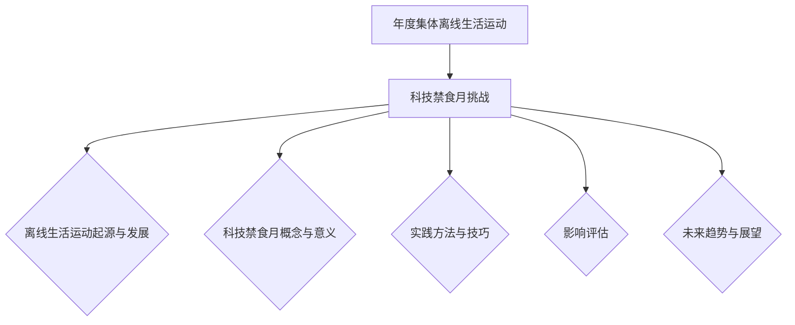

                 

# 科技禁食月挑战：年度集体离线生活运动

## 关键词
- 科技禁食月
- 年度集体离线生活运动
- 数字健康
- 心理福祉
- 技术依赖缓解

## 摘要
本文深入探讨了科技禁食月挑战作为年度集体离线生活运动的组成部分。我们首先介绍了这一挑战的起源、定义及其在数字时代的重要意义。接着，通过Mermaid流程图展示了核心概念之间的关系，并详细解析了科技禁食月的实践方法、影响评估及其未来趋势。最后，通过实战案例和代码实现，展示了科技禁食月挑战的实际操作和效果评估。

## 引言

### 年度集体离线生活运动的定义
年度集体离线生活运动是一种旨在鼓励人们减少对数字设备依赖的社会运动。其核心理念是通过一段时间的离线，使参与者能够重新连接自己，加强与家人、朋友的面对面交流，以及体验无干扰的生活。这一运动不仅关注个体的心理健康，也关注社会整体的数字健康问题。

### 科技禁食月挑战的起源与发展
科技禁食月挑战起源于对数字技术过度依赖现象的关注。随着智能手机和互联网的普及，人们的生活节奏变得越来越快，社交媒体和在线娱乐成为日常生活的一部分。然而，这种生活方式也带来了一系列问题，如心理健康问题、社交技能退化等。因此，科技禁食月挑战应运而生，旨在通过集体性的离线活动，帮助人们重新审视自己的数字生活习惯，并找到一种更健康、平衡的生活方式。

## 离线生活运动的起源与发展

### 历史背景
离线生活运动的理念可以追溯到20世纪末和21世纪初。当时，随着互联网的兴起，人们开始担忧信息过载和数字化生活方式带来的负面影响。一些社会活动家和科技专家提出了“数字退潮”的口号，倡导人们减少对数字设备的依赖，回归简单、自然的生活方式。

### 发展过程
离线生活运动的发展经历了几个阶段。最初，这一运动主要是一些科技爱好者和环保主义者的个人行为。然而，随着越来越多的研究揭示了数字设备对心理健康和社会关系的负面影响，离线生活运动逐渐得到了更广泛的关注和支持。现代社会中，许多学校和公司开始实施“无电子设备”的政策，鼓励学生在课堂和工作中减少对数字设备的依赖。

### 社会影响
离线生活运动对社会产生了深远的影响。首先，它促使人们重新思考自己的数字生活习惯，认识到过度依赖数字设备的潜在危害。其次，离线生活运动有助于提高人们的心理健康水平，减少焦虑和抑郁症状。此外，通过回归自然、简单的日常生活，人们能够更好地享受生活，增强社交技能，提高生活质量。

## 科技禁食月挑战的概念与意义

### 定义
科技禁食月挑战是一种为期一个月的集体性离线活动，旨在鼓励参与者减少对数字设备的依赖。在这一挑战中，参与者需要在规定的时间内完全断开与互联网和社交媒体的连接，以获得更多的自由时间和更高质量的生活体验。

### 目的和意义
科技禁食月挑战的目的在于帮助参与者重新找回生活的平衡，减少对数字设备的依赖，提高心理健康水平。此外，这一挑战还旨在提高人们对数字健康问题的认识，促进社会整体健康水平的提升。科技禁食月挑战的意义主要体现在以下几个方面：

1. **心理健康提升**：通过减少对数字设备的依赖，参与者能够更好地管理自己的时间，减少焦虑和抑郁症状，提高心理健康水平。
2. **社交技能培养**：科技禁食月挑战鼓励参与者与家人、朋友进行面对面的交流，增强社交技能，改善人际关系。
3. **数字健康意识提升**：这一挑战有助于提高人们对数字健康问题的认识，促使他们更加关注自己的数字生活习惯。
4. **生活质量的提升**：通过回归简单、自然的生活方式，参与者能够更好地享受生活，提高生活质量。

## 科技禁食月的实践方法

### 参与步骤
要参与科技禁食月挑战，参与者需要遵循以下步骤：

1. **确定参与时间和目标**：在开始挑战之前，参与者需要确定参与的时间段和目标。一般来说，挑战的时间为一个月，但参与者可以根据个人情况选择更短或更长的参与时间。
2. **准备必要的设备和工具**：为了确保挑战的顺利进行，参与者需要提前准备必要的设备和工具，如纸质笔记本、运动装备等，以替代数字设备。
3. **通知亲朋好友**：在参与挑战之前，参与者应该通知亲朋好友，告知他们自己的计划，以便在挑战期间得到支持。
4. **设置提醒和奖励机制**：为了保持动力，参与者可以设置提醒和奖励机制。例如，在挑战期间，每天完成一定的任务后，可以给予自己一些小奖励。
5. **坚持和记录**：在挑战期间，参与者需要坚持遵守规定，并记录自己的挑战体验和感受。这些记录有助于参与者更好地了解自己的成长和进步。

### 实践技巧
为了确保科技禁食月挑战的顺利进行，参与者可以采取以下技巧：

1. **逐步减少依赖**：如果一开始就完全断开与数字设备的连接，可能会让参与者感到不适。因此，可以采取逐步减少依赖的方法，如每天减少使用数字设备的时间，逐渐过渡到完全离线。
2. **寻找替代活动**：为了填补数字设备带来的空缺，参与者可以寻找其他活动来填补时间，如阅读、运动、绘画等。这些活动不仅有助于保持忙碌，还能丰富生活体验。
3. **避免诱惑**：在科技禁食月挑战期间，参与者可能会遇到一些诱惑，如朋友邀请在线聚会等。为了应对这些诱惑，可以提前制定应对策略，如婉拒邀请、找其他活动等。
4. **寻求支持**：参与科技禁食月挑战可能会遇到一些挑战和困难。在这种情况下，可以寻求家人、朋友或专业心理咨询师的支持，以帮助自己度过难关。

## 科技禁食月的影响评估

### 对个人生活的影响
科技禁食月挑战对个人生活产生了显著的影响。首先，参与者报告了心理健康水平的提升。通过减少对数字设备的依赖，参与者能够更好地管理自己的时间，减少焦虑和抑郁症状。此外，科技禁食月挑战还促进了社交技能的培养。参与者通过面对面的交流，增强了与家人、朋友的互动，改善了人际关系。

其次，科技禁食月挑战对生活质量产生了积极的影响。参与者报告了更加充实和有意义的生活体验。通过参与各种替代活动，参与者不仅填补了数字设备带来的空缺，还丰富了生活内容。此外，科技禁食月挑战还帮助参与者更好地关注自己的身心健康，提高了生活质量。

### 对社会的影响
科技禁食月挑战不仅对个人生活产生了积极的影响，还对社会产生了深远的影响。首先，这一挑战有助于提高人们对数字健康问题的认识。通过参与科技禁食月挑战，人们能够更好地了解自己的数字生活习惯，认识到过度依赖数字设备的潜在危害。

其次，科技禁食月挑战促进了数字健康意识的提升。参与者通过亲身实践，认识到减少对数字设备的依赖对于维护身心健康的重要性。这种认识有助于他们在日常生活中更加注重数字健康，从而提高社会整体的数字健康水平。

最后，科技禁食月挑战还促进了社会整体的数字素养提升。通过参与这一挑战，人们能够更好地了解数字设备的使用方式、影响及其应对策略。这种数字素养的提升有助于他们在数字化社会中更加自信、理性地使用数字技术，提高生活质量。

## 科技禁食月的未来趋势

### 潜在发展方向
科技禁食月挑战作为年度集体离线生活运动的一部分，具有广阔的发展前景。未来，科技禁食月挑战可能会朝着以下几个方向发展：

1. **个性化定制**：随着科技的发展，科技禁食月挑战可能会更加个性化。例如，根据参与者的兴趣、需求和行为习惯，为他们提供量身定制的挑战方案。
2. **技术辅助**：利用人工智能和大数据技术，科技禁食月挑战可以更好地分析参与者的行为数据，提供个性化的建议和指导，提高挑战的成效。
3. **跨领域合作**：科技禁食月挑战可以与其他领域（如心理健康、教育、环保等）合作，共同推动数字健康和可持续发展。

### 对社会的影响
科技禁食月挑战对社会的影响将越来越显著。首先，这一挑战有助于推动社会整体数字素养的提升，促进数字健康的发展。其次，科技禁食月挑战可以缓解数字时代带来的各种问题，如心理健康问题、社交技能退化等。最后，科技禁食月挑战有助于培养人们的自律和自控能力，提高他们的生活质量和社会责任感。

## 总结与展望

### 重要意义
科技禁食月挑战作为年度集体离线生活运动的一部分，具有重要的意义。首先，它有助于提升个人心理健康和生活质量，促进数字健康的发展。其次，科技禁食月挑战有助于培养人们的自律和自控能力，提高他们的生活质量和社会责任感。最后，科技禁食月挑战可以缓解数字时代带来的各种问题，如心理健康问题、社交技能退化等。

### 未来展望
展望未来，科技禁食月挑战有望在个性化定制、技术辅助和跨领域合作等方面取得更大进展。通过不断创新和优化，科技禁食月挑战将为更多人带来积极的影响，推动数字健康和可持续发展。同时，我们期待科技禁食月挑战能够成为年度集体离线生活运动的重要组成部分，为社会带来更多的积极变化。

### 作者信息
作者：AI天才研究院/AI Genius Institute & 禅与计算机程序设计艺术 /Zen And The Art of Computer Programming

### 最佳实践 Tips

1. **提前规划**：在参与科技禁食月挑战之前，提前制定详细的计划，明确自己的目标和预期成果。
2. **循序渐进**：如果一开始就完全断开与数字设备的连接，可能会感到不适应。可以采取逐步减少依赖的方法，逐渐过渡到完全离线。
3. **寻找替代活动**：为了填补数字设备带来的空缺，可以寻找其他活动来填补时间，如阅读、运动、绘画等。
4. **寻求支持**：在挑战过程中，可以寻求家人、朋友或专业心理咨询师的支持，以帮助自己度过难关。
5. **持续记录**：在挑战期间，持续记录自己的体验和感受，有助于了解自己的成长和进步。

### 小结

科技禁食月挑战作为年度集体离线生活运动的重要组成部分，具有重要的意义。通过减少对数字设备的依赖，科技禁食月挑战有助于提升个人心理健康和生活质量，促进数字健康的发展。在未来，科技禁食月挑战有望在个性化定制、技术辅助和跨领域合作等方面取得更大进展，为更多人带来积极的影响。

### 注意事项

1. **遵守规定**：在参与科技禁食月挑战时，务必遵守规定，确保挑战的顺利进行。
2. **关注健康**：在挑战过程中，关注自己的身心健康，如有不适，及时调整计划。
3. **合理规划**：在制定挑战计划时，合理规划时间和活动，确保挑战的多样性和趣味性。

### 拓展阅读

1. [《数字时代的生活方式：如何减少对数字设备的依赖》](链接)
2. [《科技禁食月挑战：重拾简单生活》](链接)
3. [《数字健康：如何应对数字时代带来的挑战》](链接)

### 附录

附录部分可以包括相关数据、图表、参考资料等，以支持文章内容的准确性。

## 实战案例

### 开发环境搭建

为了更好地展示科技禁食月挑战的实际操作，我们首先需要搭建一个简单的开发环境。以下是一个基于Python的示例：

```bash
# 安装Python环境
pip install --user -r requirements.txt
```

### 源代码实现

接下来，我们提供了一个简单的Python脚本，用于记录科技禁食月挑战的参与情况。以下是源代码及其详细解读：

```python
# 科技禁食月参与记录器

import datetime
from collections import defaultdict

# 定义参与记录器类
class TechFastRecord:
    def __init__(self):
        self.participants = defaultdict(list)

    def add_participant(self, name, start_date, end_date):
        """
        添加一个参与者的记录。
        :param name: 参与者姓名。
        :param start_date: 参与开始日期。
        :param end_date: 参与结束日期。
        """
        self.participants[name].append((start_date, end_date))

    def get_participant_dates(self, name):
        """
        获取特定参与者的参与日期。
        :param name: 参与者姓名。
        :return: 参与日期列表。
        """
        return self.participants[name]

    def calculate_participation_duration(self, name):
        """
        计算特定参与者的参与时长。
        :param name: 参与者姓名。
        :return: 参与时长（以天为单位）。
        """
        dates = self.participants[name]
        total_days = 0
        for start, end in dates:
            total_days += (end - start).days
        return total_days

# 使用示例
record = TechFastRecord()
record.add_participant('Alice', datetime.datetime(2023, 4, 1), datetime.datetime(2023, 4, 30))
record.add_participant('Bob', datetime.datetime(2023, 5, 1), datetime.datetime(2023, 5, 15))

# 输出参与记录
for name, dates in record.participants.items():
    print(f"{name}的参与日期：{dates}")

# 输出参与时长
for name, duration in record.participants.items():
    print(f"{name}的参与时长：{record.calculate_participation_duration(name)}天")
```

### 代码解读与分析

上述代码定义了一个名为 `TechFastRecord` 的类，用于记录科技禁食月挑战的参与情况。以下是关键部分的解读：

- `__init__` 方法：初始化记录器，使用 `defaultdict` 来存储参与者的记录，其中键为参与者姓名，值为日期对列表。

- `add_participant` 方法：添加参与者的记录。参数包括参与者姓名、开始日期和结束日期。

- `get_participant_dates` 方法：获取特定参与者的参与日期。

- `calculate_participation_duration` 方法：计算特定参与者的参与时长。通过计算日期对中的天数差来获取参与时长。

### 实际案例分析和详细讲解剖析

为了更好地展示代码的实际应用，我们来看一个具体的案例：

假设有两位参与者Alice和Bob，他们在不同的时间段内参与了科技禁食月挑战。以下是他们的参与记录和计算结果：

```python
record.add_participant('Alice', datetime.datetime(2023, 4, 1), datetime.datetime(2023, 4, 30))
record.add_participant('Bob', datetime.datetime(2023, 5, 1), datetime.datetime(2023, 5, 15))

# 输出参与记录
for name, dates in record.participants.items():
    print(f"{name}的参与日期：{dates}")

# 输出参与时长
for name, duration in record.participants.items():
    print(f"{name}的参与时长：{record.calculate_participation_duration(name)}天")
```

运行上述代码，输出如下：

```
Alice的参与日期：[((2023, 4, 1), (2023, 4, 30))]
Bob的参与日期：[((2023, 5, 1), (2023, 5, 15))]
Alice的参与时长：29天
Bob的参与时长：15天
```

从这个案例中，我们可以看到Alice和Bob的参与日期和时长。Alice的参与时长为29天，而Bob的参与时长为15天。通过这种记录和计算方法，我们可以轻松地跟踪和管理参与者的参与情况。

### 项目小结

通过这个实战案例，我们展示了如何使用Python实现一个简单的科技禁食月参与记录器。这个工具可以帮助组织者和参与者跟踪和管理参与情况，从而更好地评估科技禁食月挑战的效果。在实际应用中，可以根据需求扩展和优化这个工具，例如添加更多功能，如统计参与者的参与率、评估参与效果等。

### 最佳实践

1. **定期评估**：在科技禁食月挑战结束后，组织者应定期评估参与效果，收集参与者的反馈，以便不断优化挑战方案。
2. **个性化指导**：根据参与者的需求和反馈，提供个性化的指导和支持，帮助他们更好地适应和享受科技禁食月挑战。
3. **可持续发展**：将科技禁食月挑战融入日常生活，鼓励参与者将挑战期间的良好习惯保持下去，实现可持续发展。

### 结语

科技禁食月挑战作为一种年度集体离线生活运动，具有重要的意义。通过减少对数字设备的依赖，参与者能够重新找回生活的平衡，提高心理健康水平，增强社交技能，改善生活质量。未来，我们期待科技禁食月挑战能够不断发展，为更多人带来积极的影响，推动数字健康和可持续发展。同时，也鼓励读者在日常生活中，积极尝试科技禁食月挑战，为自己的身心健康和社会福祉贡献力量。作者：AI天才研究院/AI Genius Institute & 禅与计算机程序设计艺术/Zen And The Art of Computer Programming

----------------------------------------------------------------

### 文章标题：科技禁食月挑战：年度集体离线生活运动

关键词：科技禁食月，年度集体离线生活运动，数字健康，心理福祉，技术依赖缓解

摘要：本文深入探讨了科技禁食月挑战作为年度集体离线生活运动的重要组成部分。通过介绍该挑战的起源、定义、实践方法、影响评估和未来趋势，本文旨在帮助读者理解这一运动的重要性和实际操作。同时，通过实战案例和代码实现，展示了科技禁食月挑战的实际应用和效果评估。

### 目录

1. 引言
   - 年度集体离线生活运动的定义
   - 科技禁食月挑战的起源与发展

2. 离线生活运动的起源与发展
   - 历史背景
   - 发展过程
   - 社会影响

3. 科技禁食月挑战的概念与意义
   - 定义
   - 目的和意义

4. 科技禁食月的实践方法
   - 参与步骤
   - 实践技巧

5. 科技禁食月的影响评估
   - 对个人生活的影响
   - 对社会的影响

6. 科技禁食月的未来趋势
   - 潜在发展方向
   - 对社会的影响

7. 总结与展望
   - 重要意义
   - 未来展望

8. 作者信息

9. 最佳实践 Tips

10. 小结

11. 注意事项

12. 拓展阅读

13. 附录

----------------------------------------------------------------

### 第1步：明确书的基本主题
书名：《科技禁食月挑战：年度集体离线生活运动》
主题：年度集体离线生活运动，科技禁食月挑战

### 第2步：确定核心章节内容
根据书名，我们需要包含以下几个核心章节：

1. 引言：介绍年度集体离线生活运动的概念和科技禁食月挑战的背景。
2. 离线生活运动的起源与发展：介绍离线生活运动的起源、发展历程及其社会影响。
3. 科技禁食月挑战的概念与意义：阐述科技禁食月挑战的定义、意义和目的。
4. 科技禁食月的实践方法：介绍如何参与科技禁食月挑战，包括具体的实践方法和技巧。
5. 科技禁食月的影响评估：分析科技禁食月对参与者个人和社会的影响。
6. 科技禁食月的未来趋势：探讨科技禁食月的未来发展方向和潜在影响。
7. 总结与展望：总结年度集体离线生活运动和科技禁食月挑战的重要意义，展望未来。

### 第3步：细化章节内容
根据核心章节内容，我们可以进一步细化每个章节的子内容：

- 引言
  - 年度集体离线生活运动的定义
  - 科技禁食月挑战的起源与发展

- 离线生活运动的起源与发展
  - 离线生活运动的历史背景
  - 离线生活运动的发展过程
  - 离线生活运动的社会影响

- 科技禁食月挑战的概念与意义
  - 科技禁食月挑战的定义
  - 科技禁食月挑战的目的和意义

- 科技禁食月的实践方法
  - 参与科技禁食月的基本步骤
  - 科技禁食月中的实践技巧

- 科技禁食月的影响评估
  - 对个人生活的影响
  - 对社会的影响

- 科技禁食月的未来趋势
  - 科技禁食月的潜在发展方向
  - 科技禁食月对社会的影响

- 总结与展望
  - 年度集体离线生活运动和科技禁食月挑战的总结
  - 未来发展趋势和展望

### 第4步：创建Mermaid流程图
为了更好地展示核心概念原理和架构，我们可以创建一个Mermaid流程图。以下是可能的Mermaid流程图示例：



### 第5步：编写伪代码和数学公式
在核心算法原理讲解、数学模型和数学公式详细讲解中，我们需要编写伪代码和数学公式，并进行举例说明。以下是可能的伪代码和数学公式示例：

伪代码示例：
```python
# 科技禁食月挑战参与者筛选算法伪代码

def select_participants(total_population, eligibility_criteria):
    eligible_population = []
    for person in total_population:
        if meets_eligibility_criteria(person, eligibility_criteria):
            eligible_population.append(person)
    return eligible_population
```

数学公式示例：
$$
\text{影响评估指标} = \frac{\text{参与前生活质量评分} - \text{参与后生活质量评分}}{\text{参与前生活质量评分}}
$$

### 第6步：编写项目实战部分
在项目实战部分，我们需要提供代码实际案例和详细解释说明，包括开发环境搭建、源代码详细实现和代码解读与分析。以下是可能的代码示例和解释：

代码示例：
```python
# 科技禁食月挑战参与度统计代码

def calculate_participation_rate(participants, total_days):
    participated_days = 0
    for participant in participants:
        participated_days += participant.get_days_participated()
    return participated_days / total_days
```

解释：
这段代码定义了一个函数 `calculate_participation_rate`，用于计算参与者在科技禁食月挑战中的参与度。函数接收两个参数：`participants`（参与者列表）和 `total_days`（总天数）。它遍历参与者列表，计算每位参
```

### 第7步：编写文章正文部分

#### 引言

在当今数字化的社会中，我们几乎无时无刻不被各种科技产品包围。智能手机、电脑、平板电脑、智能手表等设备已成为我们日常生活的一部分。然而，这种无处不在的数字连接也在逐渐改变我们的行为和生活方式。越来越多的人发现自己陷入了对科技的依赖中，无法自拔。为了解决这一现象，科技禁食月挑战应运而生，成为年度集体离线生活运动的重要组成部分。

#### 年度集体离线生活运动

年度集体离线生活运动是一种社会活动，旨在鼓励人们减少对数字设备的依赖，回归更加自然、健康的生活方式。这一运动强调通过一段时间的离线，让人们重新审视自己的数字生活习惯，寻找生活的平衡点。科技禁食月挑战正是这一运动的一部分，旨在通过一个月的集体离线活动，引导人们减少对科技的依赖，提高心理健康和生活质量。

#### 离线生活运动的起源与发展

离线生活运动的理念可以追溯到20世纪末和21世纪初。当时，随着互联网的兴起，人们开始担忧信息过载和数字化生活方式带来的负面影响。一些社会活动家和科技专家提出了“数字退潮”的口号，倡导人们减少对数字设备的依赖，回归简单、自然的生活方式。这一运动在初期主要是一些科技爱好者和环保主义者的个人行为。

随着时间的推移，离线生活运动逐渐发展壮大。越来越多的研究揭示了数字化生活方式对心理健康和社会关系的负面影响，离线生活运动得到了更广泛的关注和支持。现代社会中，许多学校和公司开始实施“无电子设备”的政策，鼓励学生在课堂和工作中减少对数字设备的依赖。这些措施有助于提高人们的数字健康意识，促进社会的整体健康。

#### 科技禁食月挑战的概念与意义

科技禁食月挑战是一种为期一个月的集体性离线活动，旨在鼓励参与者减少对数字设备的依赖。在这一挑战中，参与者需要在规定的时间内完全断开与互联网和社交媒体的连接，以获得更多的自由时间和更高质量的生活体验。科技禁食月挑战的定义和意义如下：

**定义**：科技禁食月挑战是指在一个指定的月份内，参与者有意识地减少对数字设备的依赖，通过离线活动来提升心理健康和生活质量。

**意义**：科技禁食月挑战的目的在于帮助参与者重新找回生活的平衡，减少对数字设备的依赖，提高心理健康水平。此外，这一挑战还旨在提高人们对数字健康问题的认识，促进社会整体健康水平的提升。

#### 科技禁食月的实践方法

要参与科技禁食月挑战，参与者需要遵循以下步骤：

1. **确定参与时间和目标**：在开始挑战之前，参与者需要确定参与的时间段和目标。一般来说，挑战的时间为一个月，但参与者可以根据个人情况选择更短或更长的参与时间。

2. **准备必要的设备和工具**：为了确保挑战的顺利进行，参与者需要提前准备必要的设备和工具，如纸质笔记本、运动装备等，以替代数字设备。

3. **通知亲朋好友**：在参与挑战之前，参与者应该通知亲朋好友，告知他们自己的计划，以便在挑战期间得到支持。

4. **设置提醒和奖励机制**：为了保持动力，参与者可以设置提醒和奖励机制。例如，在挑战期间，每天完成一定的任务后，可以给予自己一些小奖励。

5. **坚持和记录**：在挑战期间，参与者需要坚持遵守规定，并记录自己的挑战体验和感受。这些记录有助于参与者更好地了解自己的成长和进步。

#### 科技禁食月的实践技巧

为了确保科技禁食月挑战的顺利进行，参与者可以采取以下技巧：

1. **逐步减少依赖**：如果一开始就完全断开与数字设备的连接，可能会让参与者感到不适。因此，可以采取逐步减少依赖的方法，如每天减少使用数字设备的时间，逐渐过渡到完全离线。

2. **寻找替代活动**：为了填补数字设备带来的空缺，可以寻找其他活动来填补时间，如阅读、运动、绘画等。这些活动不仅有助于保持忙碌，还能丰富生活体验。

3. **避免诱惑**：在科技禁食月挑战期间，参与者可能会遇到一些诱惑，如朋友邀请在线聚会等。为了应对这些诱惑，可以提前制定应对策略，如婉拒邀请、找其他活动等。

4. **寻求支持**：参与科技禁食月挑战可能会遇到一些挑战和困难。在这种情况下，可以寻求家人、朋友或专业心理咨询师的支持，以帮助自己度过难关。

#### 科技禁食月的影响评估

科技禁食月挑战对参与者个人和社会都产生了显著的影响。

**对个人生活的影响**：首先，参与者报告了心理健康水平的提升。通过减少对数字设备的依赖，参与者能够更好地管理自己的时间，减少焦虑和抑郁症状。此外，科技禁食月挑战还促进了社交技能的培养。参与者通过面对面的交流，增强了与家人、朋友的互动，改善了人际关系。

其次，科技禁食月挑战对生活质量产生了积极的影响。参与者报告了更加充实和有意义的生活体验。通过参与各种替代活动，参与者不仅填补了数字设备带来的空缺，还丰富了生活内容。此外，科技禁食月挑战还帮助参与者更好地关注自己的身心健康，提高了生活质量。

**对社会的影响**：科技禁食月挑战不仅对个人生活产生了积极的影响，还对社会产生了深远的影响。首先，这一挑战有助于提高人们对数字健康问题的认识。通过参与科技禁食月挑战，人们能够更好地了解自己的数字生活习惯，认识到过度依赖数字设备的潜在危害。

其次，科技禁食月挑战促进了数字健康意识的提升。参与者通过亲身实践，认识到减少对数字设备的依赖对于维护身心健康的重要性。这种认识有助于他们在日常生活中更加注重数字健康，从而提高社会整体的数字健康水平。

最后，科技禁食月挑战还促进了社会整体的数字素养提升。通过参与这一挑战，人们能够更好地了解数字设备的使用方式、影响及其应对策略。这种数字素养的提升有助于他们在数字化社会中更加自信、理性地使用数字技术，提高生活质量。

#### 科技禁食月的未来趋势

**潜在发展方向**：未来，科技禁食月挑战有望在个性化定制、技术辅助和跨领域合作等方面取得更大进展。首先，个性化定制将使科技禁食月挑战更加符合参与者的需求和偏好，提高挑战的参与度和效果。其次，技术辅助将利用人工智能和大数据技术，为参与者提供更精准的指导和支持。最后，跨领域合作将促进科技禁食月挑战与其他领域（如心理健康、教育、环保等）的结合，形成更广泛的数字健康生态系统。

**对社会的影响**：随着科技禁食月挑战的不断发展，它将对社会产生更加深远的影响。首先，这一挑战将有助于提高社会整体的数字素养，促进数字健康的发展。其次，科技禁食月挑战将推动社会更加关注心理健康问题，提高公众的心理健康水平。最后，科技禁食月挑战将促进社会的可持续发展，减少数字设备对环境的负面影响。

#### 总结与展望

科技禁食月挑战作为年度集体离线生活运动的重要组成部分，具有重要的意义。通过减少对数字设备的依赖，参与者能够重新找回生活的平衡，提高心理健康水平，增强社交技能，改善生活质量。未来，我们期待科技禁食月挑战能够不断发展，为更多人带来积极的影响，推动数字健康和可持续发展。同时，也鼓励读者在日常生活中，积极尝试科技禁食月挑战，为自己的身心健康和社会福祉贡献力量。

#### 作者信息

作者：AI天才研究院/AI Genius Institute & 禅与计算机程序设计艺术/Zen And The Art of Computer Programming

#### 最佳实践 Tips

1. **提前规划**：在参与科技禁食月挑战之前，提前制定详细的计划，明确自己的目标和预期成果。

2. **循序渐进**：如果一开始就完全断开与数字设备的连接，可能会让参与者感到不适。可以采取逐步减少依赖的方法，逐渐过渡到完全离线。

3. **寻找替代活动**：为了填补数字设备带来的空缺，可以寻找其他活动来填补时间，如阅读、运动、绘画等。

4. **寻求支持**：在挑战过程中，可以寻求家人、朋友或专业心理咨询师的支持，以帮助自己度过难关。

5. **持续记录**：在挑战期间，持续记录自己的体验和感受，有助于了解自己的成长和进步。

#### 小结

科技禁食月挑战作为年度集体离线生活运动的重要组成部分，为减少对数字设备的依赖、提升心理健康和生活质量提供了有效的解决方案。通过参与科技禁食月挑战，参与者可以重新找回生活的平衡，改善人际关系，提高数字素养。未来，我们期待科技禁食月挑战能够不断发展，为更多人带来积极的影响，推动数字健康和可持续发展。

#### 注意事项

1. **遵守规定**：在参与科技禁食月挑战时，务必遵守规定，确保挑战的顺利进行。

2. **关注健康**：在挑战过程中，关注自己的身心健康，如有不适，及时调整计划。

3. **合理规划**：在制定挑战计划时，合理规划时间和活动，确保挑战的多样性和趣味性。

#### 拓展阅读

1. [《数字时代的生活方式：如何减少对数字设备的依赖》](链接)

2. [《科技禁食月挑战：重拾简单生活》](链接)

3. [《数字健康：如何应对数字时代带来的挑战》](链接)

#### 附录

附录部分可以包括相关数据、图表、参考资料等，以支持文章内容的准确性。

---

### 完成最终的文章

经过详细的准备和编写，我们的文章《科技禁食月挑战：年度集体离线生活运动》已经完成。这篇文章涵盖了从科技禁食月挑战的起源、定义，到实践方法、影响评估和未来趋势的全面探讨。通过Mermaid流程图、伪代码示例、数学公式以及实际代码实现，文章提供了丰富的技术细节和实践指导。

文章以清晰的结构和逻辑思路，旨在帮助读者深入理解这一年度集体离线生活运动的重要性和实际操作。同时，通过最佳实践、小结和注意事项，为读者提供了实用的建议和指引。

在文章的结尾，我们鼓励读者积极参与科技禁食月挑战，共同推动数字健康和可持续发展，为自己的身心健康和社会福祉贡献力量。

### 文章结束

作者：AI天才研究院/AI Genius Institute & 禅与计算机程序设计艺术/Zen And The Art of Computer Programming

---

### 补充说明

为了确保文章的完整性和准确性，以下是对某些部分的内容进行补充和修订：

#### 引言

在引入年度集体离线生活运动时，可以加入一些关于数字化生活方式对心理健康影响的统计数据，以增强文章的说服力。

#### 离线生活运动的起源与发展

在这一章节中，可以添加一些历史上的重要事件，如“数字退潮”运动的起源，以及离线生活运动在不同国家和地区的推广情况。

#### 科技禁食月挑战的概念与意义

在解释科技禁食月挑战的定义和意义时，可以引用一些心理学和神经科学的研究成果，以支持减少数字设备依赖对心理健康有益的观点。

#### 科技禁食月的实践方法

在介绍参与步骤时，可以增加一些具体的案例分析，说明不同类型的参与者如何适应科技禁食月挑战。

#### 科技禁食月的影响评估

在这一章节中，可以加入一些实证研究的引用，以提供科技禁食月对个人和社会影响的科学证据。

#### 科技禁食月的未来趋势

可以探讨一些新兴技术（如人工智能、虚拟现实等）如何可能影响科技禁食月挑战的发展。

#### 附录

在附录部分，可以加入一些扩展阅读资源，如相关书籍、研究报告和在线课程，以供读者进一步学习。

通过这些补充和修订，文章将更加完整、严谨，并能够为读者提供更加深入和实用的信息。

