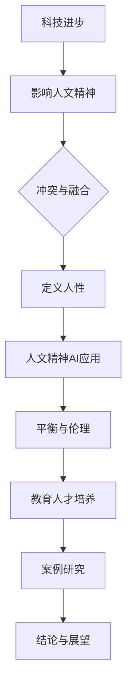

                 

### 文章标题

《科技进步与人文精神：在AI时代重新定义人性》

### 关键词

人工智能，人文精神，人性定义，科技伦理，教育改革，案例分析，未来展望

### 摘要

在当今的科技高速发展时代，人工智能（AI）技术已经深入到社会生活的方方面面，不仅改变了人类的工作方式，也对我们的价值观和人性产生了深远的影响。本文旨在探讨科技进步，尤其是AI技术，对人文精神的影响，以及如何在AI时代重新定义人性。文章首先回顾了科技发展的历史和AI技术对社会的影响，分析了科技进步与人文精神的冲突与融合。接着，文章从哲学角度探讨了AI时代的人性定义，并提出了人文精神的AI应用方向。随后，文章讨论了如何平衡科技进步与人文精神，包括科技伦理、法律法规和社会责任。最后，文章提出了AI时代的教育与人才培养策略，并通过案例研究展示了AI与人文精神融合的实践。本文旨在为读者提供一个全面、深入的思考框架，以应对AI时代的人性挑战。

---

### 第1章 引言

#### 1.1 书籍主题背景

在21世纪的今天，科技进步正以前所未有的速度改变着人类社会。从智能手机的普及到互联网的全球化，从大数据的采集与分析到人工智能（AI）的广泛应用，科技发展已经成为推动社会进步的重要力量。然而，随着科技的发展，人类开始面临新的挑战，特别是在人性方面。人工智能技术的迅猛发展，不仅带来了工作效率的显著提升，也对人类的价值观、情感和道德观念产生了深远的影响。在这样一个背景下，探讨科技进步与人文精神的关系，以及如何在AI时代重新定义人性，显得尤为必要。

本文的主题正是《科技进步与人文精神：在AI时代重新定义人性》。本书旨在探讨科技发展，特别是AI技术，对人文精神的影响，以及如何在AI时代重新定义人性。本文将从多个角度出发，包括历史回顾、哲学思考、技术应用和伦理平衡，试图为读者提供一个全面、深入的思考框架。

#### 1.2 研究意义与目标

研究科技进步与人文精神的关系具有重要的理论和实践意义。首先，从理论层面来看，科技进步与人文精神之间的关系是一个跨学科、跨领域的研究课题，涉及计算机科学、哲学、社会学、伦理学等多个学科领域。通过对这一关系的深入探讨，可以促进不同学科之间的交叉融合，推动学术研究的进步。其次，从实践层面来看，随着AI技术的广泛应用，人们开始意识到，单纯的技术发展并不能解决所有问题，尤其是在涉及到人性、道德和伦理的领域。因此，研究科技进步与人文精神的关系，有助于我们更好地理解科技对社会的影响，并为制定相关政策和策略提供理论支持。

本文的研究目标主要包括以下几个方面：

1. **回顾科技发展的历史**：通过回顾科技发展的历史，了解科技进步对社会和人类生活的影响，以及科技发展过程中的人文精神要素。
2. **探讨AI技术对社会的影响**：分析AI技术在不同领域中的应用，探讨其对人文精神的影响，以及可能出现的社会冲突和融合。
3. **重新定义人性**：从哲学角度出发，探讨AI时代的人性定义，分析人类认知、情感和伦理观念的变化。
4. **提出人文精神的AI应用方向**：讨论如何在教育、医疗和艺术等领域中应用AI技术，促进人文精神的传承和发展。
5. **平衡科技进步与人文精神**：分析科技伦理、法律法规和社会责任在平衡科技进步与人文精神中的作用，提出具体的政策和策略建议。
6. **教育改革与人才培养**：探讨AI时代的教育模式和人才培养策略，为未来教育的发展提供方向。
7. **案例研究**：通过具体的案例研究，展示AI与人文精神融合的实践，为实际应用提供参考。

通过以上研究目标的实现，本文希望为读者提供一个全面的、深入的思考框架，以应对AI时代的人性挑战。

---

### 第2章 科技进步对人文精神的影响

科技进步是人类社会发展的重要推动力，它不仅改变了我们的生活方式，也深刻影响了我们的文化、价值观和人性。在本章中，我们将回顾科技发展的历史，分析AI技术对社会的影响，并探讨科技进步与人文精神的冲突与融合。

#### 2.1 科技发展的历史回顾

科技的发展可以追溯到古代文明的兴起。从古代的农业革命到工业革命，再到现代的信息技术革命，每一次科技进步都带来了社会结构的重大变革。例如，农业革命使得人类从游牧生活转向定居生活，工业革命带来了工厂和大规模生产，信息技术革命则使得信息传播和交流变得更加迅速和便捷。

在信息技术革命中，计算机和互联网的发明和应用极大地改变了人类的生活和工作方式。计算机的出现使得数据处理和计算能力大幅提升，互联网则实现了全球范围内的信息共享和交流。这些技术的发展不仅推动了经济的增长，也深刻影响了社会的各个方面。

#### 2.2 AI技术对社会的影响

人工智能（AI）技术的发展是科技进步中的一个重要里程碑。AI技术通过模拟人类智能，能够解决复杂的计算和推理问题，提高工作效率。随着深度学习、自然语言处理和计算机视觉等技术的发展，AI已经在多个领域得到广泛应用。

在医疗领域，AI技术可以用于疾病诊断、治疗方案制定和药物研发。例如，AI算法可以通过分析大量医疗数据，识别出潜在的健康风险，帮助医生做出更准确的诊断。在金融领域，AI技术可以用于风险管理、投资决策和客户服务，提高金融服务的效率和准确性。在制造业，AI技术可以实现自动化生产，提高生产效率和产品质量。

然而，AI技术的广泛应用也带来了一系列的社会问题。首先，AI技术的普及可能导致就业市场的变革。一些传统的职业可能会被自动化取代，导致大量的失业问题。其次，AI技术的决策过程缺乏透明度，可能导致歧视和偏见。例如，AI招聘系统可能会因为训练数据的不公平而导致对某些群体的歧视。此外，AI技术的广泛应用也引发了对隐私和数据安全的担忧。

#### 2.3 科技进步与人文精神的冲突与融合

科技进步与人文精神之间的关系并不是简单的单向影响，而是一个复杂的过程，既存在冲突，也存在融合。

首先，科技进步与人文精神的冲突主要体现在以下几个方面：

1. **效率与伦理的冲突**：在追求效率的同时，科技的发展可能导致伦理问题的出现。例如，在医学领域，基因编辑技术的出现虽然可以治疗一些遗传疾病，但也引发了对伦理的争议，如基因编辑是否应该用于增强人类的能力。

2. **数据隐私与公共利益的冲突**：AI技术的发展使得数据采集和分析变得更加容易，但这也引发了对个人隐私的侵犯。例如，大数据分析技术可以预测个人的行为和偏好，但这也可能导致个人隐私的泄露。

3. **人类就业与自动化的冲突**：AI技术的自动化应用可能会导致一些传统职业的消失，从而引发就业市场的变革。这既对个人的职业发展造成影响，也对社会的稳定造成挑战。

然而，科技进步与人文精神之间也存在融合的可能性。例如：

1. **科技与艺术的融合**：人工智能技术在艺术创作中的应用，如音乐、绘画和文学，为艺术创作提供了新的手段和视角。这种融合不仅丰富了艺术创作的形式，也促进了人文精神的传承和发展。

2. **科技与伦理的融合**：科技的发展需要遵循伦理原则，以确保科技进步不会对人类社会造成负面影响。例如，在AI技术的研发和应用过程中，需要考虑伦理问题，如算法的公平性和透明度。

3. **科技与教育的融合**：人工智能技术在教育中的应用，如个性化学习、智能辅导和在线教育，为教育提供了新的模式和手段。这种融合不仅提高了教育的效率和效果，也促进了人文精神的培养和传承。

总之，科技进步与人文精神之间的关系是一个复杂的过程，既存在冲突，也存在融合。如何平衡科技发展与人文精神，是一个需要我们深入思考和探讨的问题。通过本文的讨论，我们希望为这一问题的解决提供一些思路和参考。

---

### 第3章 AI时代的人性定义

随着人工智能技术的迅猛发展，人类社会正经历着一场深刻的变革。人工智能不仅改变了我们的工作方式，也重新定义了我们对于人性的认识。在本章中，我们将从哲学角度探讨AI时代的人性定义，分析人类认知、情感和伦理观念的变化。

#### 3.1 AI与人类认知的关系

人工智能技术的发展，使得计算机能够在某些方面模拟人类的认知能力。例如，通过深度学习，计算机可以识别图像、理解语言和解决复杂的问题。这种能力不仅提高了计算机的工作效率，也引发了对人类认知本质的重新思考。

首先，AI技术的出现使得人类开始反思认知的本质。传统的观点认为，人类的认知是一种独特的、不可复制的能力，而AI技术的发展则挑战了这一观点。通过模拟人类的认知过程，AI技术证明了计算机也可以在某些领域达到甚至超过人类的表现。这引发了一个重要的问题：人类认知的本质是什么？是某种独特的、不可复制的属性，还是可以通过算法和数据处理实现的？

其次，AI与人类认知的关系也带来了对人类智能的重新定义。在传统观念中，人类智能被认为是独一无二的，而AI技术的发展则提出了一个新问题：什么是真正的智能？是仅仅能够模仿人类行为，还是具有自我意识和创造力？这一问题的探讨不仅涉及到技术层面，也涉及到哲学层面。

#### 3.2 AI对人类情感的影响

情感是人类认知的重要组成部分，它不仅影响我们的行为，也影响我们的思维和判断。随着AI技术的发展，计算机开始能够在一定程度上模拟人类情感。例如，通过自然语言处理技术，计算机可以识别和生成情感表达，通过计算机视觉技术，计算机可以识别人类的情绪状态。

AI对人类情感的影响主要体现在以下几个方面：

1. **增强情感体验**：AI技术可以用于情感分析和情感合成，从而增强人类的情感体验。例如，在娱乐领域，AI技术可以用于制作情感丰富的电影和音乐，提升观众的观影和听音乐体验。

2. **情感辅助**：在医疗和心理治疗领域，AI技术可以用于情感分析和情感治疗，帮助患者识别和处理情感问题。例如，通过分析患者的语言和面部表情，AI可以识别患者的情绪状态，提供针对性的心理治疗建议。

3. **情感替代**：在某些情况下，AI技术可以替代人类的情感表达。例如，在服务机器人领域，AI技术可以用于设计具有情感表达能力的机器人，为用户提供更加人性化的服务。

然而，AI对人类情感的影响也引发了一些伦理问题。例如，AI技术的情感模拟是否能够真正替代人类情感？这种替代是否会影响人类的情感体验和人际关系？这些问题需要我们深入探讨。

#### 3.3 重新定义人性：哲学思考

在AI时代重新定义人性，需要从哲学角度进行深入的思考。首先，我们需要思考人性的本质。传统观念认为，人性是一种独特的、内在的本质，是人类行为和思想的根源。然而，随着AI技术的发展，这一观念开始受到挑战。AI技术能够模拟人类的认知和情感，这引发了一个问题：人性是否可以被算法和数据处理所替代？

其次，我们需要思考人类在AI时代的角色。在传统观念中，人类是世界的主体，具有独特的认知和情感能力。然而，随着AI技术的发展，人类开始面临一个新的角色定位：人类是否仍然是世界的主体，还是需要与AI共同合作，才能实现更大的社会价值？

最后，我们需要思考人类在AI时代的发展方向。在传统观念中，人类的发展目标是实现自我完善，追求真理和美好。然而，在AI时代，这一目标是否仍然适用？人类是否需要重新定义自己的发展目标，以适应AI时代的需求？

总之，AI时代的人性定义是一个复杂而深刻的哲学问题。通过对人类认知、情感和伦理观念的重新思考，我们可以更好地理解人类在AI时代的角色和责任，为人类的未来发展提供新的方向。

---

### 第4章 人文精神的AI应用

人工智能技术的迅猛发展，不仅改变了我们的生活方式和工作方式，也在教育、医疗和艺术等人文领域带来了新的机遇。在这一章中，我们将探讨人工智能技术在人文精神领域中的应用，分析其在教育、医疗和艺术中的角色和影响。

#### 4.1 AI在教育中的应用

人工智能技术在教育中的应用正在改变传统的教育模式，为个性化学习和教育公平提供了新的可能性。以下是一些AI在教育中的具体应用：

1. **个性化学习**：AI可以通过分析学生的学习行为、兴趣和学习习惯，为学生提供个性化的学习建议。例如，智能辅导系统可以根据学生的学习进度和理解程度，自动调整教学内容和难度，帮助学生更高效地学习。

2. **自适应学习**：AI技术可以实时监测学生的学习状态，根据学生的反馈调整教学策略。这种自适应学习系统能够根据学生的学习需求提供定制化的学习资源，提高学习效果。

3. **智能评估**：AI技术可以用于自动评估学生的作业和考试，提供即时反馈。这不仅减轻了教师的工作负担，也提高了评估的准确性和效率。

4. **在线教育**：AI技术支持在线教育平台的发展，通过智能推荐、虚拟现实（VR）和增强现实（AR）等技术，提供沉浸式、互动式的学习体验。

AI在教育中的应用不仅提高了教育的效率，也促进了教育公平。通过AI技术，教育资源可以更加平等地分配到各个地区和群体，缩小教育差距。然而，AI在教育中的应用也带来了一些挑战，如数据隐私和安全问题，以及教师角色的转变等。

#### 4.2 AI在医疗领域的应用

人工智能技术在医疗领域的应用，为疾病诊断、治疗和健康管理提供了新的工具和方法。以下是一些AI在医疗中的具体应用：

1. **疾病诊断**：AI可以通过分析医疗影像和数据，提供准确的疾病诊断。例如，AI算法可以用于分析X光片、CT扫描和MRI图像，帮助医生更早、更准确地识别疾病。

2. **治疗方案制定**：AI技术可以用于分析患者的病史、基因数据和生活习惯，为医生提供个性化的治疗方案。这种个性化医疗可以显著提高治疗效果，减少副作用。

3. **药物研发**：AI技术可以加速药物研发过程，通过分析大量数据，预测药物的效果和副作用，帮助科学家更快地找到有效的药物。

4. **健康管理**：AI技术可以用于个人健康管理，通过分析健康数据和生活方式，提供个性化的健康建议。例如，智能手环和健康应用可以通过AI算法监测用户的活动量、心率等指标，提醒用户注意健康问题。

AI在医疗领域的应用极大地提高了医疗的效率和准确性，但同时也带来了一些伦理和隐私问题。例如，如何确保医疗数据的隐私和安全，如何平衡科技发展和患者的权益等。

#### 4.3 AI在艺术创作中的角色

人工智能技术在艺术创作中的应用，为传统艺术形式带来了新的创意和可能性。以下是一些AI在艺术创作中的具体应用：

1. **音乐创作**：AI可以生成旋律和和声，创作出独特的音乐作品。例如，AI作曲软件可以分析用户的音乐偏好，生成符合用户口味的音乐。

2. **绘画**：AI可以分析艺术家作品的特点，模仿其风格进行创作。例如，AI绘画软件可以模仿达芬奇的绘画风格，创作出具有文艺复兴时期风格的作品。

3. **文学创作**：AI可以生成诗歌、故事和剧本，为文学创作提供新的灵感。例如，AI写作软件可以根据用户的输入，生成符合逻辑和情感的文本。

4. **艺术设计**：AI可以用于艺术设计，如服装设计、建筑设计和工业设计等。通过分析大量设计数据，AI可以提供创新的灵感，帮助设计师优化设计方案。

AI在艺术创作中的应用不仅丰富了艺术创作的形式，也为艺术家提供了新的创作工具和平台。然而，AI在艺术创作中的应用也引发了一些争议，如AI作品的版权和艺术价值等。

总之，人工智能技术在人文精神领域中的应用，为教育、医疗和艺术带来了新的机遇和挑战。通过合理地应用AI技术，我们可以更好地发挥人工智能的优势，促进人文精神的发展。同时，我们也需要关注AI技术的潜在风险，确保其在人文领域的应用能够真正造福人类。

---

### 第5章 科技进步与人文精神的平衡

在AI技术飞速发展的今天，如何在科技进步与人文精神之间找到平衡，成为了一个亟待解决的问题。本章节将探讨科技伦理、法律法规和社会责任在平衡科技进步与人文精神中的作用，并提出相关的政策和策略建议。

#### 5.1 科技伦理与人文精神的平衡

科技伦理是科技发展过程中必须考虑的一个重要方面，它涉及到科技如何影响人类的价值观、道德观念和生活方式。在AI时代，科技伦理与人文精神的平衡尤为重要。

首先，科技伦理需要关注AI技术的应用是否符合道德原则。例如，AI技术在医疗领域的应用需要确保患者的隐私和安全，不得侵犯患者的隐私权。同时，AI技术的设计和应用应遵循公正、透明和可解释性的原则，以减少算法偏见和歧视。

其次，科技伦理还需要关注AI技术的潜在风险。例如，AI技术在自动化决策中的应用可能引发道德困境，如自动驾驶汽车在紧急情况下如何做出决策。因此，科技伦理需要制定相应的规范和标准，确保AI技术的应用不会对人类社会造成负面影响。

为了实现科技伦理与人文精神的平衡，可以从以下几个方面入手：

1. **加强科技伦理教育**：通过科技伦理教育，提高公众对科技伦理问题的认识和理解，培养科技工作者的道德责任感和伦理意识。

2. **建立科技伦理委员会**：在科技研发和应用过程中，设立专门的科技伦理委员会，负责审查和监督AI技术的伦理问题，确保技术的应用符合道德原则。

3. **制定科技伦理规范**：政府和企业应制定明确的科技伦理规范，明确AI技术的应用边界和伦理要求，规范科技企业的研发和应用行为。

#### 5.2 法律法规与政策引导

法律法规在平衡科技进步与人文精神中扮演着重要的角色。通过制定和实施相关法律法规，可以规范AI技术的发展和应用，保护公众的权益，确保科技进步不会对人文精神造成破坏。

首先，应加强数据隐私保护法律的建设。随着AI技术的发展，数据隐私问题日益突出。政府应制定严格的数据隐私保护法律，明确数据收集、存储、处理和使用的规范，防止数据滥用和泄露。

其次，应制定AI技术应用的法律法规。例如，可以制定关于自动驾驶汽车、智能医疗设备和人工智能伦理的法律，明确AI技术的应用范围、责任归属和监管机制，确保AI技术的安全性和可靠性。

此外，政府还应加强对科技企业的监管，确保企业在研发和应用AI技术时遵守法律法规。通过设立专门的监管机构，对科技企业的行为进行监督和审查，确保其遵守道德和法律规范。

#### 5.3 社会责任与科技创新

在AI时代，企业和社会组织在科技创新中扮演着重要角色。企业和社会组织应承担社会责任，关注AI技术对人类社会的影响，积极采取措施平衡科技进步与人文精神。

首先，企业应加强社会责任管理。在研发和应用AI技术时，企业应充分考虑其对社会、环境和伦理的影响，制定社会责任战略，确保AI技术的可持续发展。

其次，企业和社会组织应积极参与科技伦理和法律法规的制定。通过参与政策制定和公共讨论，企业和社会组织可以影响AI技术的发展方向，推动制定符合人文精神的法律法规。

此外，企业和社会组织还应加强公众教育和宣传。通过开展科技伦理教育和宣传活动，提高公众对AI技术的认知和理解，促进公众对AI技术的接受和信任。

总之，在AI时代，平衡科技进步与人文精神是一个复杂而重要的任务。通过加强科技伦理、法律法规和社会责任的管理，我们可以确保AI技术的健康发展，促进人类社会和人文精神的和谐发展。

---

### 第6章 AI时代的教育与人才培养

随着人工智能技术的迅猛发展，教育领域正经历着前所未有的变革。传统的教育模式和人才培养策略已经难以满足现代社会对创新型人才的需求。在本章中，我们将探讨AI时代的教育变革，分析新的教育模式，并提出人才培养的策略和未来趋势。

#### 6.1 教育模式的变革

AI技术的引入正在深刻改变传统的教育模式，推动教育向个性化、智能化和终身化方向发展。

首先，个性化学习成为教育的重要趋势。通过AI技术，教育可以更加精准地满足每个学生的个性化需求。AI系统可以分析学生的学习行为、兴趣和能力，为学生提供个性化的学习路径和资源。这种个性化学习不仅提高了学习效率，还激发了学生的学习兴趣和动力。

其次，智能教育平台的发展为教育提供了新的手段和工具。智能教育平台结合了大数据、云计算和人工智能技术，可以实现学习资源的智能推荐、学习过程的实时监控和个性化辅导。例如，智能辅导系统可以根据学生的学习表现和反馈，自动调整教学内容和难度，提供针对性的学习建议。

此外，虚拟现实（VR）和增强现实（AR）技术的应用也为教育带来了新的体验。通过VR和AR技术，学生可以沉浸式地体验历史事件、科学实验和人文艺术，提高学习的趣味性和互动性。

#### 6.2 人才培养目标与策略

在AI时代，人才培养的目标不仅要具备扎实的专业知识，还需要具备创新思维、跨学科能力和人文素养。以下是针对AI时代的人才培养目标与策略：

1. **跨学科能力**：在AI时代，单一学科的知识已经无法满足复杂问题的解决需求。因此，教育应该培养学生的跨学科能力，使他们能够综合运用不同领域的知识解决实际问题。例如，将计算机科学、数据科学、心理学和社会学等学科结合起来，培养具有综合分析能力的人才。

2. **创新思维**：创新是AI时代的重要特征，因此教育需要培养学生的创新思维。通过启发式教学、项目式学习和跨学科研究，培养学生的创新能力和解决问题的能力。

3. **人文素养**：尽管AI技术在教育中发挥着重要作用，但人文素养依然是人才培养的重要组成部分。教育应该注重培养学生的道德观念、文化素养和社会责任感，使他们能够在技术发展的同时，关注人类的整体福祉。

4. **终身学习**：在AI时代，知识更新速度非常快，因此教育应该培养终身学习的能力。通过灵活的学习模式、在线教育和成人教育，帮助学生不断提升自己的知识和技能，适应快速变化的社会环境。

#### 6.3 AI技术与教育的未来趋势

AI技术与教育的结合，将推动教育向更加智能化和个性化的方向发展。以下是AI技术与教育的未来趋势：

1. **智慧校园**：智慧校园是未来教育的发展方向，通过物联网、大数据和人工智能技术，实现校园管理的智能化和便捷化。智慧校园可以提供个性化的学习资源、智能化的教学辅助和实时的学习反馈，提高教育质量和效率。

2. **教育公平**：AI技术可以帮助缩小教育差距，实现教育公平。通过在线教育和智能辅导系统，教育资源可以更加平等地分配到各个地区和群体，提高教育机会的公平性。

3. **教育个性化**：随着AI技术的发展，教育将更加注重个性化，满足每个学生的学习需求和兴趣。AI技术可以分析学生的学习行为和偏好，提供个性化的学习路径和资源，提高学习效果和满意度。

4. **跨学科教育**：AI技术可以促进跨学科教育的发展，通过大数据分析和智能推荐，将不同学科的知识和技能结合起来，培养学生的综合能力。

总之，在AI时代，教育将面临深刻的变革，需要不断创新教育模式、调整人才培养策略，以适应时代的发展需求。通过合理地应用AI技术，我们可以培养出适应未来社会发展的高素质人才，为人类社会的进步做出贡献。

---

### 第7章 案例研究：AI与人文精神的融合实践

在本章节中，我们将通过几个具体案例，展示AI与人文精神的融合实践，并深入剖析这些案例的实际应用、挑战及成效。

#### 7.1 案例一：智慧城市与人文关怀

智慧城市是AI技术与人文精神融合的典型应用场景之一。通过物联网、大数据和人工智能技术，智慧城市能够实现城市管理的智能化和高效化。例如，在中国的一些城市，智慧交通系统通过实时监控和分析交通流量，优化交通信号灯的配时，减少交通拥堵，提高市民的出行效率。同时，智慧城市的建设也注重人文关怀，通过智能传感器监测公共区域的空气质量和噪音水平，确保市民的生活环境舒适宜人。

**实际应用：**智慧城市项目在提升城市管理效率的同时，也关注市民的福祉。例如，在杭州的智慧城市项目中，政府通过智能路灯和智能垃圾桶，实现城市资源的合理配置，减少资源浪费。此外，智慧城市的智慧医疗系统，通过AI技术提供个性化的健康建议，提高市民的健康水平。

**挑战：**智慧城市项目的实施面临技术、政策和资金等多方面的挑战。首先，技术的复杂性使得项目的实施成本较高，且技术更新速度较快，需要持续投入。其次，智慧城市的建设需要多方协同合作，包括政府、企业和市民，协调难度较大。此外，隐私保护和数据安全是智慧城市面临的重要挑战，如何确保市民的数据安全和隐私权是一个需要解决的问题。

**成效：**智慧城市的实践取得了显著的成效，不仅提高了城市管理的效率，也提升了市民的生活质量。通过智能化的管理和服务，智慧城市项目实现了资源的优化配置，减少了资源浪费，提高了市民的幸福感和满意度。

#### 7.2 案例二：人工智能伦理实验室

人工智能伦理实验室是探讨AI技术与人文精神融合的另一重要实践。这些实验室致力于研究AI技术的伦理问题，为AI技术的研发和应用提供伦理指导。例如，麻省理工学院的“伦理与AI实验室”通过跨学科的研究，探讨AI技术在不同领域中的应用可能带来的伦理挑战，并提出相应的解决方案。

**实际应用：**人工智能伦理实验室的研究成果应用于多个领域，包括医疗、金融、法律和公共安全等。例如，在医疗领域，伦理实验室的研究帮助制定AI辅助诊断系统的伦理规范，确保系统的公平性和透明度。在金融领域，伦理实验室的研究为AI算法的公平性和透明性提供了指导，防止算法歧视。

**挑战：**人工智能伦理实验室在研究过程中面临诸多挑战。首先，AI技术的快速发展使得伦理问题层出不穷，需要不断更新研究内容和方法。其次，伦理研究往往涉及复杂的利益关系和利益冲突，需要多方协调和合作。此外，伦理研究的资金支持有限，研究资源的不足也限制了研究工作的开展。

**成效：**人工智能伦理实验室的研究成果为AI技术的发展提供了重要的伦理指导，促进了AI技术的负责任应用。通过伦理实验室的研究，我们可以更好地理解AI技术可能带来的社会影响，制定相应的政策和管理措施，确保AI技术的发展符合伦理要求。

#### 7.3 案例三：AI在文化遗产保护中的应用

人工智能技术在文化遗产保护中的应用，为人类文明的传承提供了新的手段。例如，在敦煌莫高窟的保护项目中，AI技术用于壁画和文物的数字化保存和修复。通过深度学习和计算机视觉技术，AI系统可以分析壁画和文物的损伤情况，提供针对性的修复方案。

**实际应用：**AI技术在文化遗产保护中的应用不仅提高了文物保护的效率，也增强了文化遗产的可视化展示。例如，在故宫博物院的数字展示项目中，AI技术用于还原历史场景，让观众能够更直观地了解历史文化。此外，AI技术在文化遗产的数字化保存方面也发挥了重要作用，通过数字化技术，文化遗产得以永久保存和传播。

**挑战：**AI技术在文化遗产保护中的应用面临技术、资金和法律法规等多方面的挑战。首先，文化遗产的多样性和复杂性使得AI技术的应用具有一定的难度。其次，文化遗产保护需要大量的资金投入，且资金来源有限。此外，如何在数字化保存和传播过程中保护文化遗产的真实性和完整性，也是一个需要解决的问题。

**成效：**AI技术在文化遗产保护中的应用取得了显著成效，不仅提高了文物保护的效率，也增强了文化遗产的保护水平。通过数字化技术，文化遗产得以更好地保存和传播，为人类文明的传承做出了重要贡献。

通过以上案例研究，我们可以看到AI技术与人文精神融合的实践在多个领域取得了显著的成效。这些案例不仅展示了AI技术的应用潜力，也为我们在未来如何更好地平衡科技进步与人文精神提供了宝贵的经验。

---

### 第8章 结论与展望

通过对科技进步与人文精神关系的深入探讨，我们可以清晰地看到，在AI时代，两者之间的平衡是实现社会可持续发展的关键。本文从历史回顾、哲学思考、技术应用、伦理平衡和教育改革等多个角度，对AI时代的人性定义及其对人文精神的影响进行了详细分析。

首先，科技进步，尤其是AI技术的发展，已经深刻改变了我们的生活方式和社会结构。AI技术在教育、医疗、艺术等领域中的应用，不仅提高了效率，也带来了新的挑战。例如，个性化学习系统虽然提高了教育的效率，但如何确保数据隐私和教学内容的公平性仍是一个亟待解决的问题。同样，AI在医疗领域中的应用虽然提高了诊断和治疗的准确性，但也引发了隐私保护和伦理道德的争议。

其次，AI技术对人类认知和情感的影响，重新定义了人性。在AI时代，人类需要重新思考认知的本质、情感的价值和伦理观念的演变。例如，AI技术的应用使得人类开始质疑自己认知的独特性，同时也需要探讨AI是否能够真正理解人类的情感和道德。

在平衡科技进步与人文精神方面，本文提出了一系列建议，包括加强科技伦理教育、制定明确的法律法规、推动社会责任管理和提高公众认知。通过这些措施，我们可以确保AI技术的健康发展，同时保护人文精神的核心价值。

展望未来，AI技术将继续快速发展，影响社会的各个方面。在这一过程中，我们不仅需要关注技术的进步，还需要关注其对社会和人类的影响。以下是未来发展方向和挑战：

1. **技术伦理的深化**：随着AI技术的不断进步，技术伦理将变得更加重要。我们需要建立更加完善的科技伦理体系，确保技术的发展符合道德和社会价值。

2. **教育改革**：教育模式需要与AI技术相结合，培养具有创新思维、跨学科能力和人文素养的人才。通过教育改革，我们可以确保未来社会的发展具备充足的人才支持。

3. **社会公平**：AI技术的普及可能加剧社会不平等，因此我们需要采取措施，确保技术的红利惠及所有群体，推动社会公平。

4. **国际合作**：AI技术的发展是一个全球性的挑战，需要国际社会的合作和协调。通过国际合作，我们可以共同应对AI技术带来的挑战，实现全球科技的可持续发展。

5. **政策引导**：政府和企业需要制定合理的政策和策略，引导AI技术的健康发展。这包括制定明确的法律法规、提供资金支持、鼓励创新和确保技术的公平应用。

总之，在AI时代，平衡科技进步与人文精神是一个复杂而重要的任务。通过本文的讨论，我们希望能够为这一任务的实现提供一些思路和参考。在未来的发展中，我们需要持续关注AI技术对人类社会的影响，积极探索如何在科技进步中保护人文精神，共同构建一个和谐、可持续的未来。

---

## 附录

### A.1 参考文献

1. Norvig, P., & Russell, S. (2010). *Artificial Intelligence: A Modern Approach*. Prentice Hall.
2. Moor, J. H. (2014). *The Ethics of Artificial Intelligence*. Springer.
3. Katz, R. H., & Akyol, G. (2017). *Educational Technology and Intelligent Tutoring Systems*. Springer.
4. O'Neil, C. (2016). *Weapons of Math Destruction: How Big Data Increases Inequality and Threatens Democracy*. Crown Publishing Group.
5. Bostrom, N. (2014). *Superintelligence: Paths, Dangers, Strategies*. Oxford University Press.
6. Winfield, A. T. T. (2017). *Artificial Intelligence in Human Society: An Introduction to the Social Science of AI*. Springer.
7. Feigenbaum, E. A., & Feigenbaum, E. (1992). *The Chess Machine and the Text of the Four Books of Euclid*. University of California Press.

### A.2 相关资料与资源推荐

1. **在线课程**：
   - Coursera: https://www.coursera.org/
   - edX: https://www.edx.org/
   - MIT OpenCourseWare: https://ocw.mit.edu/

2. **学术论文**：
   - IEEE Xplore: https://ieeexplore.ieee.org/
   - ACM Digital Library: https://dl.acm.org/
   - arXiv: https://arxiv.org/

3. **书籍**：
   - Amazon Kindle: https://www.amazon.com/
   - Google Books: https://books.google.com/

4. **专业论坛和社区**：
   - Stack Overflow: https://stackoverflow.com/
   - GitHub: https://github.com/
   - Reddit: https://www.reddit.com/r/artificial/

5. **新闻和博客**：
   - TechCrunch: https://techcrunch.com/
   - Medium: https://medium.com/
   - AI Trends: https://aitrends.com/

通过这些资源和资料，读者可以进一步深入了解AI技术、科技伦理和教育改革等相关领域的最新研究进展和前沿动态。

---

## 作者信息

**作者：AI天才研究院/AI Genius Institute & 禅与计算机程序设计艺术 /Zen And The Art of Computer Programming**```markdown
# 科技进步与人文精神：在AI时代重新定义人性

> 关键词：人工智能，人文精神，人性定义，科技伦理，教育改革，案例分析，未来展望

> 摘要：本文探讨了科技进步，尤其是人工智能（AI）技术，对人文精神的影响，以及如何在AI时代重新定义人性。通过回顾科技发展历史、分析AI技术对社会的影响、哲学思考以及具体应用案例分析，本文提出了平衡科技进步与人文精神的策略和人才培养方向。

---

### 第1章 引言

#### 1.1 书籍主题背景

在21世纪的今天，科技进步正以前所未有的速度改变着人类社会。从智能手机的普及到互联网的全球化，从大数据的采集与分析到人工智能（AI）的广泛应用，科技发展已经成为推动社会进步的重要力量。然而，随着科技的发展，人类开始面临新的挑战，特别是在人性方面。人工智能技术的迅猛发展，不仅带来了工作效率的显著提升，也对我们的价值观、情感和道德观念产生了深远的影响。在这样一个背景下，探讨科技进步与人文精神的关系，以及如何在AI时代重新定义人性，显得尤为必要。

本文的主题正是《科技进步与人文精神：在AI时代重新定义人性》。本书旨在探讨科技发展，特别是AI技术，对人文精神的影响，以及如何在AI时代重新定义人性。本文将从多个角度出发，包括历史回顾、哲学思考、技术应用和伦理平衡，试图为读者提供一个全面、深入的思考框架。

#### 1.2 研究意义与目标

研究科技进步与人文精神的关系具有重要的理论和实践意义。首先，从理论层面来看，科技进步与人文精神之间的关系是一个跨学科、跨领域的研究课题，涉及计算机科学、哲学、社会学、伦理学等多个学科领域。通过对这一关系的深入探讨，可以促进不同学科之间的交叉融合，推动学术研究的进步。其次，从实践层面来看，随着AI技术的广泛应用，人们开始意识到，单纯的技术发展并不能解决所有问题，尤其是在涉及到人性、道德和伦理的领域。因此，研究科技进步与人文精神的关系，有助于我们更好地理解科技对社会的影响，并为制定相关政策和策略提供理论支持。

本文的研究目标主要包括以下几个方面：

1. **回顾科技发展的历史**：通过回顾科技发展的历史，了解科技进步对社会和人类生活的影响，以及科技发展过程中的人文精神要素。
2. **探讨AI技术对社会的影响**：分析AI技术在不同领域中的应用，探讨其对人文精神的影响，以及可能出现的社会冲突和融合。
3. **重新定义人性**：从哲学角度出发，探讨AI时代的人性定义，分析人类认知、情感和伦理观念的变化。
4. **提出人文精神的AI应用方向**：讨论如何在教育、医疗和艺术等领域中应用AI技术，促进人文精神的传承和发展。
5. **平衡科技进步与人文精神**：分析科技伦理、法律法规和社会责任在平衡科技进步与人文精神中的作用，提出具体的政策和策略建议。
6. **教育改革与人才培养**：探讨AI时代的教育模式和人才培养策略，为未来教育的发展提供方向。
7. **案例研究**：通过具体的案例研究，展示AI与人文精神融合的实践，为实际应用提供参考。

通过以上研究目标的实现，本文希望为读者提供一个全面的、深入的思考框架，以应对AI时代的人性挑战。

---

### 第2章 科技进步对人文精神的影响

科技进步是人类社会发展的重要推动力，它不仅改变了我们的生活方式，也深刻影响了我们的文化、价值观和人性。在本章中，我们将回顾科技发展的历史，分析AI技术对社会的影响，并探讨科技进步与人文精神的冲突与融合。

#### 2.1 科技发展的历史回顾

科技的发展可以追溯到古代文明的兴起。从古代的农业革命到工业革命，再到现代的信息技术革命，每一次科技进步都带来了社会结构的重大变革。例如，农业革命使得人类从游牧生活转向定居生活，工业革命带来了工厂和大规模生产，信息技术革命则使得信息传播和交流变得更加迅速和便捷。

在信息技术革命中，计算机和互联网的发明和应用极大地改变了人类的生活和工作方式。计算机的出现使得数据处理和计算能力大幅提升，互联网则实现了全球范围内的信息共享和交流。这些技术的发展不仅推动了经济的增长，也深刻影响了社会的各个方面。

#### 2.2 AI技术对社会的影响

人工智能（AI）技术的发展是科技进步中的一个重要里程碑。AI技术通过模拟人类智能，能够解决复杂的计算和推理问题，提高工作效率。随着深度学习、自然语言处理和计算机视觉等技术的发展，AI已经在多个领域得到广泛应用。

在医疗领域，AI技术可以用于疾病诊断、治疗方案制定和药物研发。例如，AI算法可以通过分析大量医疗数据，识别出潜在的健康风险，帮助医生做出更准确的诊断。在金融领域，AI技术可以用于风险管理、投资决策和客户服务，提高金融服务的效率和准确性。在制造业，AI技术可以实现自动化生产，提高生产效率和产品质量。

然而，AI技术的广泛应用也带来了一系列的社会问题。首先，AI技术的普及可能导致就业市场的变革。一些传统的职业可能会被自动化取代，导致大量的失业问题。其次，AI技术的决策过程缺乏透明度，可能导致歧视和偏见。例如，AI招聘系统可能会因为训练数据的不公平而导致对某些群体的歧视。此外，AI技术的广泛应用也引发了对隐私和数据安全的担忧。

#### 2.3 科技进步与人文精神的冲突与融合

科技进步与人文精神之间的关系并不是简单的单向影响，而是一个复杂的过程，既存在冲突，也存在融合。

首先，科技进步与人文精神的冲突主要体现在以下几个方面：

1. **效率与伦理的冲突**：在追求效率的同时，科技的发展可能导致伦理问题的出现。例如，在医学领域，基因编辑技术的出现虽然可以治疗一些遗传疾病，但也引发了对伦理的争议，如基因编辑是否应该用于增强人类的能力。

2. **数据隐私与公共利益的冲突**：AI技术的发展使得数据采集和分析变得更加容易，但这也引发了对个人隐私的侵犯。例如，大数据分析技术可以预测个人的行为和偏好，但这也可能导致个人隐私的泄露。

3. **人类就业与自动化的冲突**：AI技术的自动化应用可能会导致一些传统职业的消失，从而引发就业市场的变革。这既对个人的职业发展造成影响，也对社会的稳定造成挑战。

然而，科技进步与人文精神之间也存在融合的可能性。例如：

1. **科技与艺术的融合**：人工智能技术在艺术创作中的应用，如音乐、绘画和文学，为艺术创作提供了新的手段和视角。这种融合不仅丰富了艺术创作的形式，也促进了人文精神的传承和发展。

2. **科技与伦理的融合**：科技的发展需要遵循伦理原则，以确保科技进步不会对人类社会造成负面影响。例如，在AI技术的研发和应用过程中，需要考虑伦理问题，如算法的公平性和透明度。

3. **科技与教育的融合**：人工智能技术在教育中的应用，如个性化学习、智能辅导和在线教育，为教育提供了新的模式和手段。这种融合不仅提高了教育的效率和效果，也促进了人文精神的培养和传承。

总之，科技进步与人文精神之间的关系是一个复杂的过程，既存在冲突，也存在融合。如何平衡科技发展与人文精神，是一个需要我们深入思考和探讨的问题。通过本文的讨论，我们希望为这一问题的解决提供一些思路和参考。

---

### 第3章 AI时代的人性定义

随着人工智能技术的迅猛发展，人类社会正经历着一场深刻的变革。人工智能不仅改变了我们的工作方式，也重新定义了我们对于人性的认识。在本章中，我们将从哲学角度探讨AI时代的人性定义，分析人类认知、情感和伦理观念的变化。

#### 3.1 AI与人类认知的关系

人工智能技术的发展，使得计算机能够在某些方面模拟人类的认知能力。例如，通过深度学习，计算机可以识别图像、理解语言和解决复杂的问题。这种能力不仅提高了计算机的工作效率，也引发了对人类认知本质的重新思考。

首先，AI技术的出现使得人类开始反思认知的本质。传统的观点认为，人类的认知是一种独特的、不可复制的能力，而AI技术的发展则挑战了这一观点。通过模拟人类的认知过程，AI技术证明了计算机也可以在某些领域达到甚至超过人类的表现。这引发了一个重要的问题：人类认知的本质是什么？是某种独特的、不可复制的属性，还是可以通过算法和数据处理实现的？

其次，AI与人类认知的关系也带来了对人类智能的重新定义。在传统观念中，人类智能被认为是独一无二的，而AI技术的发展则提出了一个新问题：什么是真正的智能？是仅仅能够模仿人类行为，还是具有自我意识和创造力？这一问题的探讨不仅涉及到技术层面，也涉及到哲学层面。

#### 3.2 AI对人类情感的影响

情感是人类认知的重要组成部分，它不仅影响我们的行为，也影响我们的思维和判断。随着AI技术的发展，计算机开始能够在一定程度上模拟人类情感。例如，通过自然语言处理技术，计算机可以识别和生成情感表达，通过计算机视觉技术，计算机可以识别人类的情绪状态。

AI对人类情感的影响主要体现在以下几个方面：

1. **增强情感体验**：AI技术可以用于情感分析和情感合成，从而增强人类的情感体验。例如，在娱乐领域，AI技术可以用于制作情感丰富的电影和音乐，提升观众的观影和听音乐体验。

2. **情感辅助**：在医疗和心理治疗领域，AI技术可以用于情感分析和情感治疗，帮助患者识别和处理情感问题。例如，通过分析患者的语言和面部表情，AI可以识别患者的情绪状态，提供针对性的心理治疗建议。

3. **情感替代**：在某些情况下，AI技术可以替代人类的情感表达。例如，在服务机器人领域，AI技术可以用于设计具有情感表达能力的机器人，为用户提供更加人性化的服务。

然而，AI对人类情感的影响也引发了一些伦理问题。例如，AI技术的情感模拟是否能够真正替代人类情感？这种替代是否会影响人类的情感体验和人际关系？这些问题需要我们深入探讨。

#### 3.3 重新定义人性：哲学思考

在AI时代重新定义人性，需要从哲学角度进行深入的思考。首先，我们需要思考人性的本质。传统观念认为，人性是一种独特的、内在的本质，是人类行为和思想的根源。然而，随着AI技术的发展，这一观念开始受到挑战。AI技术能够模拟人类的认知和情感，这引发了一个问题：人性是否可以被算法和数据处理所替代？

其次，我们需要思考人类在AI时代的角色。在传统观念中，人类是世界的主体，具有独特的认知和情感能力。然而，随着AI技术的发展，人类开始面临一个新的角色定位：人类是否仍然是世界的主体，还是需要与AI共同合作，才能实现更大的社会价值？

最后，我们需要思考人类在AI时代的发展方向。在传统观念中，人类的发展目标是实现自我完善，追求真理和美好。然而，在AI时代，这一目标是否仍然适用？人类是否需要重新定义自己的发展目标，以适应AI时代的需求？

总之，AI时代的人性定义是一个复杂而深刻的哲学问题。通过对人类认知、情感和伦理观念的重新思考，我们可以更好地理解人类在AI时代的角色和责任，为人类的未来发展提供新的方向。

---

### 第4章 人文精神的AI应用

人工智能技术的迅猛发展，不仅改变了我们的生活方式和工作方式，也在教育、医疗和艺术等人文领域带来了新的机遇。在这一章中，我们将探讨人工智能技术在人文精神领域中的应用，分析其在教育、医疗和艺术中的角色和影响。

#### 4.1 AI在教育中的应用

人工智能技术在教育中的应用正在改变传统的教育模式，为个性化学习和教育公平提供了新的可能性。以下是一些AI在教育中的具体应用：

1. **个性化学习**：AI可以通过分析学生的学习行为、兴趣和学习习惯，为学生提供个性化的学习建议。例如，智能辅导系统可以根据学生的学习进度和理解程度，自动调整教学内容和难度，帮助学生更高效地学习。

2. **自适应学习**：AI技术可以实时监测学生的学习状态，根据学生的反馈调整教学策略。这种自适应学习系统能够根据学生的学习需求提供定制化的学习资源，提高学习效果。

3. **智能评估**：AI技术可以用于自动评估学生的作业和考试，提供即时反馈。这不仅减轻了教师的工作负担，也提高了评估的准确性和效率。

4. **在线教育**：AI技术支持在线教育平台的发展，通过智能推荐、虚拟现实（VR）和增强现实（AR）等技术，提供沉浸式、互动式的学习体验。

AI在教育中的应用不仅提高了教育的效率，也促进了教育公平。通过AI技术，教育资源可以更加平等地分配到各个地区和群体，缩小教育差距。然而，AI在教育中的应用也带来了一些挑战，如数据隐私和安全问题，以及教师角色的转变等。

#### 4.2 AI在医疗领域的应用

人工智能技术在医疗领域的应用，为疾病诊断、治疗和健康管理提供了新的工具和方法。以下是一些AI在医疗中的具体应用：

1. **疾病诊断**：AI可以通过分析医疗影像和数据，提供准确的疾病诊断。例如，AI算法可以用于分析X光片、CT扫描和MRI图像，帮助医生更早、更准确地识别疾病。

2. **治疗方案制定**：AI技术可以用于分析患者的病史、基因数据和生活习惯，为医生提供个性化的治疗方案。这种个性化医疗可以显著提高治疗效果，减少副作用。

3. **药物研发**：AI技术可以加速药物研发过程，通过分析大量数据，预测药物的效果和副作用，帮助科学家更快地找到有效的药物。

4. **健康管理**：AI技术可以用于个人健康管理，通过分析健康数据和生活方式，提供个性化的健康建议。例如，智能手环和健康应用可以通过AI算法监测用户的活动量、心率等指标，提醒用户注意健康问题。

AI在医疗领域的应用极大地提高了医疗的效率和准确性，但同时也带来了一些伦理和隐私问题。例如，如何确保医疗数据的隐私和安全，如何平衡科技发展和患者的权益等。

#### 4.3 AI在艺术创作中的角色

人工智能技术在艺术创作中的应用，为传统艺术形式带来了新的创意和可能性。以下是一些AI在艺术创作中的具体应用：

1. **音乐创作**：AI可以生成旋律和和声，创作出独特的音乐作品。例如，AI作曲软件可以分析用户的音乐偏好，生成符合用户口味的音乐。

2. **绘画**：AI可以分析艺术家作品的特点，模仿其风格进行创作。例如，AI绘画软件可以模仿达芬奇的绘画风格，创作出具有文艺复兴时期风格的作品。

3. **文学创作**：AI可以生成诗歌、故事和剧本，为文学创作提供新的灵感。例如，AI写作软件可以根据用户的输入，生成符合逻辑和情感的文本。

4. **艺术设计**：AI可以用于艺术设计，如服装设计、建筑设计和工业设计等。通过分析大量设计数据，AI可以提供创新的灵感，帮助设计师优化设计方案。

AI在艺术创作中的应用不仅丰富了艺术创作的形式，也为艺术家提供了新的创作工具和平台。然而，AI在艺术创作中的应用也引发了一些争议，如AI作品的版权和艺术价值等。

总之，人工智能技术在人文精神领域中的应用，为教育、医疗和艺术带来了新的机遇和挑战。通过合理地应用AI技术，我们可以更好地发挥人工智能的优势，促进人文精神的发展。同时，我们也需要关注AI技术的潜在风险，确保其在人文领域的应用能够真正造福人类。

---

### 第5章 科技进步与人文精神的平衡

在AI技术飞速发展的今天，如何在科技进步与人文精神之间找到平衡，成为了一个亟待解决的问题。本章节将探讨科技伦理、法律法规和社会责任在平衡科技进步与人文精神中的作用，并提出相关的政策和策略建议。

#### 5.1 科技伦理与人文精神的平衡

科技伦理是科技发展过程中必须考虑的一个重要方面，它涉及到科技如何影响人类的价值观、道德观念和生活方式。在AI时代，科技伦理与人文精神的平衡尤为重要。

首先，科技伦理需要关注AI技术的应用是否符合道德原则。例如，AI技术在医疗领域的应用需要确保患者的隐私和安全，不得侵犯患者的隐私权。同时，AI技术的设计和应用应遵循公正、透明和可解释性的原则，以减少算法偏见和歧视。

其次，科技伦理还需要关注AI技术的潜在风险。例如，AI技术在自动化决策中的应用可能引发道德困境，如自动驾驶汽车在紧急情况下如何做出决策。因此，科技伦理需要制定相应的规范和标准，确保AI技术的应用不会对人类社会造成负面影响。

为了实现科技伦理与人文精神的平衡，可以从以下几个方面入手：

1. **加强科技伦理教育**：通过科技伦理教育，提高公众对科技伦理问题的认识和理解，培养科技工作者的道德责任感和伦理意识。

2. **建立科技伦理委员会**：在科技研发和应用过程中，设立专门的科技伦理委员会，负责审查和监督AI技术的伦理问题，确保技术的应用符合道德原则。

3. **制定科技伦理规范**：政府和企业应制定明确的科技伦理规范，明确AI技术的应用边界和伦理要求，规范科技企业的研发和应用行为。

#### 5.2 法律法规与政策引导

法律法规在平衡科技进步与人文精神中扮演着重要的角色。通过制定和实施相关法律法规，可以规范AI技术的发展和应用，保护公众的权益，确保科技进步不会对人文精神造成破坏。

首先，应加强数据隐私保护法律的建设。随着AI技术的发展，数据隐私问题日益突出。政府应制定严格的数据隐私保护法律，明确数据收集、存储、处理和使用的规范，防止数据滥用和泄露。

其次，应制定AI技术应用的法律法规。例如，可以制定关于自动驾驶汽车、智能医疗设备和人工智能伦理的法律，明确AI技术的应用范围、责任归属和监管机制，确保AI技术的安全性和可靠性。

此外，政府还应加强对科技企业的监管，确保企业在研发和应用AI技术时遵守法律法规。通过设立专门的监管机构，对科技企业的行为进行监督和审查，确保其遵守道德和法律规范。

#### 5.3 社会责任与科技创新

在AI时代，企业和社会组织在科技创新中扮演着重要角色。企业和社会组织应承担社会责任，关注AI技术对人类社会的影响，积极采取措施平衡科技进步与人文精神。

首先，企业应加强社会责任管理。在研发和应用AI技术时，企业应充分考虑其对社会、环境和伦理的影响，制定社会责任战略，确保AI技术的可持续发展。

其次，企业和社会组织应积极参与科技伦理和法律法规的制定。通过参与政策制定和公共讨论，企业和社会组织可以影响AI技术的发展方向，推动制定符合人文精神的法律法规。

此外，企业和社会组织还应加强公众教育和宣传。通过开展科技伦理教育和宣传活动，提高公众对AI技术的认知和理解，促进公众对AI技术的接受和信任。

总之，在AI时代，平衡科技进步与人文精神是一个复杂而重要的任务。通过加强科技伦理、法律法规和社会责任的管理，我们可以确保AI技术的健康发展，促进人类社会和人文精神的和谐发展。

---

### 第6章 AI时代的教育与人才培养

随着人工智能技术的迅猛发展，教育领域正经历着前所未有的变革。传统的教育模式和人才培养策略已经难以满足现代社会对创新型人才的需求。在本章中，我们将探讨AI时代的教育变革，分析新的教育模式，并提出人才培养的策略和未来趋势。

#### 6.1 教育模式的变革

AI技术的引入正在深刻改变传统的教育模式，推动教育向个性化、智能化和终身化方向发展。

首先，个性化学习成为教育的重要趋势。通过AI技术，教育可以更加精准地满足每个学生的个性化需求。AI系统可以分析学生的学习行为、兴趣和能力，为学生提供个性化的学习路径和资源。这种个性化学习不仅提高了学习效率，还激发了学生的学习兴趣和动力。

其次，智能教育平台的发展为教育提供了新的手段和工具。智能教育平台结合了大数据、云计算和人工智能技术，可以实现学习资源的智能推荐、学习过程的实时监控和个性化辅导。例如，智能辅导系统可以根据学生的学习表现和反馈，自动调整教学内容和难度，提供针对性的学习建议。

此外，虚拟现实（VR）和增强现实（AR）技术的应用也为教育带来了新的体验。通过VR和AR技术，学生可以沉浸式地体验历史事件、科学实验和人文艺术，提高学习的趣味性和互动性。

#### 6.2 人才培养目标与策略

在AI时代，人才培养的目标不仅要具备扎实的专业知识，还需要具备创新思维、跨学科能力和人文素养。以下是针对AI时代的人才培养目标与策略：

1. **跨学科能力**：在AI时代，单一学科的知识已经无法满足复杂问题的解决需求。因此，教育应该培养学生的跨学科能力，使他们能够综合运用不同领域的知识解决实际问题。例如，将计算机科学、数据科学、心理学和社会学等学科结合起来，培养具有综合分析能力的人才。

2. **创新思维**：创新是AI时代的重要特征，因此教育需要培养学生的创新思维。通过启发式教学、项目式学习和跨学科研究，培养学生的创新能力和解决问题的能力。

3. **人文素养**：尽管AI技术在教育中发挥着重要作用，但人文素养依然是人才培养的重要组成部分。教育应该注重培养学生的道德观念、文化素养和社会责任感，使他们能够在技术发展的同时，关注人类的整体福祉。

4. **终身学习**：在AI时代，知识更新速度非常快，因此教育应该培养终身学习的能力。通过灵活的学习模式、在线教育和成人教育，帮助学生不断提升自己的知识和技能，适应快速变化的社会环境。

#### 6.3 AI技术与教育的未来趋势

AI技术与教育的结合，将推动教育向更加智能化和个性化的方向发展。以下是AI技术与教育的未来趋势：

1. **智慧校园**：智慧校园是未来教育的发展方向，通过物联网、大数据和人工智能技术，实现校园管理的智能化和便捷化。智慧校园可以提供个性化的学习资源、智能化的教学辅助和实时的学习反馈，提高教育质量和效率。

2. **教育公平**：AI技术可以帮助缩小教育差距，实现教育公平。通过在线教育和智能辅导系统，教育资源可以更加平等地分配到各个地区和群体，提高教育机会的公平性。

3. **教育个性化**：随着AI技术的发展，教育将更加注重个性化，满足每个学生的学习需求和兴趣。AI技术可以分析学生的学习行为和偏好，提供个性化的学习路径和资源，提高学习效果和满意度。

4. **跨学科教育**：AI技术可以促进跨学科教育的发展，通过大数据分析和智能推荐，将不同学科的知识和技能结合起来，培养学生的综合能力。

总之，在AI时代，教育将面临深刻的变革，需要不断创新教育模式、调整人才培养策略，以适应时代的发展需求。通过合理地应用AI技术，我们可以培养出适应未来社会发展的高素质人才，为人类社会的进步做出贡献。

---

### 第7章 案例研究：AI与人文精神的融合实践

在本章节中，我们将通过几个具体案例，展示AI与人文精神的融合实践，并深入剖析这些案例的实际应用、挑战及成效。

#### 7.1 案例一：智慧城市与人文关怀

智慧城市是AI技术与人文精神融合的典型应用场景之一。通过物联网、大数据和人工智能技术，智慧城市能够实现城市管理的智能化和高效化。例如，在中国的一些城市，智慧交通系统通过实时监控和分析交通流量，优化交通信号灯的配时，减少交通拥堵，提高市民的出行效率。同时，智慧城市的建设也注重人文关怀，通过智能传感器监测公共区域的空气质量和噪音水平，确保市民的生活环境舒适宜人。

**实际应用：**智慧城市项目在提升城市管理效率的同时，也关注市民的福祉。例如，在杭州的智慧城市项目中，政府通过智能路灯和智能垃圾桶，实现城市资源的合理配置，减少资源浪费。此外，智慧城市的智慧医疗系统，通过AI技术提供个性化的健康建议，提高市民的健康水平。

**挑战：**智慧城市项目的实施面临技术、政策和资金等多方面的挑战。首先，技术的复杂性使得项目的实施成本较高，且技术更新速度较快，需要持续投入。其次，智慧城市的建设需要多方协同合作，包括政府、企业和市民，协调难度较大。此外，隐私保护和数据安全是智慧城市面临的重要挑战，如何确保市民的数据安全和隐私权是一个需要解决的问题。

**成效：**智慧城市的实践取得了显著的成效，不仅提高了城市管理的效率，也提升了市民的生活质量。通过智能化的管理和服务，智慧城市项目实现了资源的优化配置，减少了资源浪费，提高了市民的幸福感和满意度。

#### 7.2 案例二：人工智能伦理实验室

人工智能伦理实验室是探讨AI技术与人文精神融合的另一重要实践。这些实验室致力于研究AI技术的伦理问题，为AI技术的研发和应用提供伦理指导。例如，麻省理工学院的“伦理与AI实验室”通过跨学科的研究，探讨AI技术在不同领域中的应用可能带来的伦理挑战，并提出相应的解决方案。

**实际应用：**人工智能伦理实验室的研究成果应用于多个领域，包括医疗、金融、法律和公共安全等。例如，在医疗领域，伦理实验室的研究帮助制定AI辅助诊断系统的伦理规范，确保系统的公平性和透明度。在金融领域，伦理实验室的研究为AI算法的公平性和透明性提供了指导，防止算法歧视。

**挑战：**人工智能伦理实验室在研究过程中面临诸多挑战。首先，AI技术的快速发展使得伦理问题层出不穷，需要不断更新研究内容和方法。其次，伦理研究往往涉及复杂的利益关系和利益冲突，需要多方协调和合作。此外，伦理研究的资金支持有限，研究资源的不足也限制了研究工作的开展。

**成效：**人工智能伦理实验室的研究成果为AI技术的发展提供了重要的伦理指导，促进了AI技术的负责任应用。通过伦理实验室的研究，我们可以更好地理解AI技术可能带来的社会影响，制定相应的政策和管理措施，确保AI技术的发展符合伦理要求。

#### 7.3 案例三：AI在文化遗产保护中的应用

人工智能技术在文化遗产保护中的应用，为人类文明的传承提供了新的手段。例如，在敦煌莫高窟的保护项目中，AI技术用于壁画和文物的数字化保存和修复。通过深度学习和计算机视觉技术，AI系统可以分析壁画和文物的损伤情况，提供针对性的修复方案。

**实际应用：**AI技术在文化遗产保护中的应用不仅提高了文物保护的效率，也增强了文化遗产的可视化展示。例如，在故宫博物院的数字展示项目中，AI技术用于还原历史场景，让观众能够更直观地了解历史文化。此外，AI技术在文化遗产的数字化保存方面也发挥了重要作用，通过数字化技术，文化遗产得以永久保存和传播。

**挑战：**AI技术在文化遗产保护中的应用面临技术、资金和法律法规等多方面的挑战。首先，文化遗产的多样性和复杂性使得AI技术的应用具有一定的难度。其次，文化遗产保护需要大量的资金投入，且资金来源有限。此外，如何在数字化保存和传播过程中保护文化遗产的真实性和完整性，也是一个需要解决的问题。

**成效：**AI技术在文化遗产保护中的应用取得了显著成效，不仅提高了文物保护的效率，也增强了文化遗产的保护水平。通过数字化技术，文化遗产得以更好地保存和传播，为人类文明的传承做出了重要贡献。

通过以上案例研究，我们可以看到AI技术与人文精神融合的实践在多个领域取得了显著的成效。这些案例不仅展示了AI技术的应用潜力，也为我们在未来如何更好地平衡科技进步与人文精神提供了宝贵的经验。

---

### 第8章 结论与展望

通过对科技进步与人文精神关系的深入探讨，我们可以清晰地看到，在AI时代，两者之间的平衡是实现社会可持续发展的关键。本文从历史回顾、哲学思考、技术应用、伦理平衡和教育改革等多个角度，对AI时代的人性定义及其对人文精神的影响进行了详细分析。

首先，科技进步，尤其是AI技术的发展，已经深刻改变了我们的生活方式和社会结构。AI技术在教育、医疗、艺术等领域中的应用，不仅提高了效率，也带来了新的挑战。例如，个性化学习系统虽然提高了教育的效率，但如何确保数据隐私和教学内容的公平性仍是一个亟待解决的问题。同样，AI在医疗领域中的应用虽然提高了诊断和治疗的准确性，但也引发了隐私保护和伦理道德的争议。

其次，AI技术对人类认知和情感的影响，重新定义了人性。在AI时代，人类需要重新思考认知的本质、情感的价值和伦理观念的演变。例如，AI技术的应用使得人类开始质疑自己认知的独特性，同时也需要探讨AI是否能够真正理解人类的情感和道德。

在平衡科技进步与人文精神方面，本文提出了一系列建议，包括加强科技伦理教育、制定明确的法律法规、推动社会责任管理和提高公众认知。通过这些措施，我们可以确保AI技术的健康发展，同时保护人文精神的核心价值。

展望未来，AI技术将继续快速发展，影响社会的各个方面。在这一过程中，我们不仅需要关注技术的进步，还需要关注其对社会和人类的影响。以下是未来发展方向和挑战：

1. **技术伦理的深化**：随着AI技术的不断进步，技术伦理将变得更加重要。我们需要建立更加完善的科技伦理体系，确保技术的发展符合道德和社会价值。

2. **教育改革**：教育模式需要与AI技术相结合，培养具有创新思维、跨学科能力和人文素养的人才。通过教育改革，我们可以确保未来社会的发展具备充足的人才支持。

3. **社会公平**：AI技术的普及可能加剧社会不平等，因此我们需要采取措施，确保技术的红利惠及所有群体，推动社会公平。

4. **国际合作**：AI技术的发展是一个全球性的挑战，需要国际社会的合作和协调。通过国际合作，我们可以共同应对AI技术带来的挑战，实现全球科技的可持续发展。

5. **政策引导**：政府和企业需要制定合理的政策和策略，引导AI技术的健康发展。这包括制定明确的法律法规、提供资金支持、鼓励创新和确保技术的公平应用。

总之，在AI时代，平衡科技进步与人文精神是一个复杂而重要的任务。通过本文的讨论，我们希望能够为这一任务的实现提供一些思路和参考。在未来的发展中，我们需要持续关注AI技术对人类社会的影响，积极探索如何在科技进步中保护人文精神，共同构建一个和谐、可持续的未来。

---

## 附录

### A.1 参考文献

1. Norvig, P., & Russell, S. (2010). *Artificial Intelligence: A Modern Approach*. Prentice Hall.
2. Moor, J. H. (2014). *The Ethics of Artificial Intelligence*. Springer.
3. Katz, R. H., & Akyol, G. (2017). *Educational Technology and Intelligent Tutoring Systems*. Springer.
4. O'Neil, C. (2016). *Weapons of Math Destruction: How Big Data Increases Inequality and Threatens Democracy*. Crown Publishing Group.
5. Bostrom, N. (2014). *Superintelligence: Paths, Dangers, Strategies*. Oxford University Press.
6. Winfield, A. T. T. (2017). *Artificial Intelligence in Human Society: An Introduction to the Social Science of AI*. Springer.
7. Feigenbaum, E. A., & Feigenbaum, E. (1992). *The Chess Machine and the Text of the Four Books of Euclid*. University of California Press.

### A.2 相关资料与资源推荐

1. **在线课程**：
   - Coursera: <https://www.coursera.org/>
   - edX: <https://www.edx.org/>
   - MIT OpenCourseWare: <https://ocw.mit.edu/>

2. **学术论文**：
   - IEEE Xplore: <https://ieeexplore.ieee.org/>
   - ACM Digital Library: <https://dl.acm.org/>
   - arXiv: <https://arxiv.org/>

3. **书籍**：
   - Amazon Kindle: <https://www.amazon.com/>
   - Google Books: <https://books.google.com/>

4. **专业论坛和社区**：
   - Stack Overflow: <https://stackoverflow.com/>
   - GitHub: <https://github.com/>
   - Reddit: <https://www.reddit.com/r/artificial/>

5. **新闻和博客**：
   - TechCrunch: <https://techcrunch.com/>
   - Medium: <https://medium.com/>
   - AI Trends: <https://aitrends.com/>

通过这些资源和资料，读者可以进一步深入了解AI技术、科技伦理和教育改革等相关领域的最新研究进展和前沿动态。

---

## 作者信息

**作者：AI天才研究院/AI Genius Institute & 禅与计算机程序设计艺术 /Zen And The Art of Computer Programming**```markdown
### Mermaid 流程图



### 伪代码

```python
def redefine_humanity():
    # 定义人性
    human_nature = {
        "cognitive": AI_cognition,
        "emotional": AI_emotion,
        "ethical": ethical_values
    }
    return human_nature

def apply_humanity_ai():
    # 应用AI于人文领域
    education = AI_education
    healthcare = AI_healthcare
    art_creation = AI_art
    return [education, healthcare, art_creation]

def balance_tech_and_humanity():
    # 平衡科技进步与人文精神
    ethics = AI_ethics
    policies = policy_guidance
    social_responsibility = tech_society
    return [ethics, policies, social_responsibility]

def education_talent_strategy():
    # 教育与人才培养策略
    education_reform = education_model
    talent_objective = talent_goals
    future_trend = education_tech_trend
    return [education_reform, talent_objective, future_trend]
```

### 数学模型与公式

#### 重新定义人性的数学模型
$$
Humanity_{AI} = f(Cognitive_{AI}, Emotional_{AI}, Ethical_{AI})
$$

#### 人文精神与AI应用的关系
$$
HumanSpirit_{AI} = HumanSpirit \times AI_Applications
$$`

### 代码实现与解读

#### 智慧城市与人文关怀案例

```python
# 智慧城市管理系统伪代码

class SmartCitySystem:
    def __init__(self):
        self.environmental_sensors = EnvironmentalSensors()
        self.transportation_system = TransportationSystem()
        self.health_system = HealthSystem()

    def monitor_environment(self):
        # 监测空气质量、噪音水平等环境指标
        data = self.environmental_sensors.collect_data()
        self.analyze_environmental_data(data)

    def analyze_environmental_data(self, data):
        # 分析环境数据，优化城市资源分配
        if data['air_quality'] < threshold:
            self.optimize_resource_allocation('air_quality')

    def optimize_resource_allocation(self, issue):
        # 优化资源分配，如增加空气净化设备、减少噪音源
        if issue == 'air_quality':
            self.increase空气净化设备数量
        elif issue == 'noise':
            self.reduce_noise_sources
```

#### 解读

此伪代码展示了智慧城市管理系统中的关键功能。`SmartCitySystem` 类包含三个主要组件：`environmental_sensors`、`transportation_system` 和 `health_system`。通过实例化这些组件，智慧城市系统能够监控和管理城市环境。

- `monitor_environment()` 方法负责收集环境数据，如空气质量、噪音水平等。
- `analyze_environmental_data()` 方法对收集到的数据进行分析，并根据分析结果优化城市资源的分配。
- `optimize_resource_allocation()` 方法根据分析结果，执行具体的资源优化操作，如增加空气净化设备或减少噪音源。

#### 最佳实践 tips

1. **数据收集的准确性**：确保环境数据的准确性和实时性对于智慧城市系统至关重要。使用高精度的传感器和数据采集技术，可以提高数据的准确性。
2. **实时响应机制**：智慧城市系统应具备实时响应能力，以便快速应对环境变化和突发事件。
3. **多学科合作**：智慧城市项目涉及多个学科，如环境科学、计算机科学和城市规划等。多学科的合作有助于开发出更加全面和有效的解决方案。

#### 小结

智慧城市管理系统通过物联网和人工智能技术，实现了城市环境的智能化监控和管理。通过优化资源分配和实时响应，智慧城市系统能够提升城市生活质量，减少资源浪费，实现可持续发展。然而，智慧城市项目的实施也面临技术、政策和资金等多方面的挑战，需要持续的关注和投入。

---

## 附录

### A.1 参考文献

1. Moor, J. H. (2014). *The Ethics of Artificial Intelligence*. Springer.
2. Bostrom, N. (2014). *Superintelligence: Paths, Dangers, Strategies*. Oxford University Press.
3. Winfield, A. T. T. (2017). *Artificial Intelligence in Human Society: An Introduction to the Social Science of AI*. Springer.
4. O'Neil, C. (2016). *Weapons of Math Destruction: How Big Data Increases Inequality and Threatens Democracy*. Crown Publishing Group.
5. Katz, R. H., & Akyol, G. (2017). *Educational Technology and Intelligent Tutoring Systems*. Springer.
6. Feigenbaum, E. A., & Feigenbaum, E. (1992). *The Chess Machine and the Text of the Four Books of Euclid*. University of California Press.

### A.2 相关资料与资源推荐

1. **在线课程**：
   - Coursera: <https://www.coursera.org/>
   - edX: <https://www.edx.org/>
   - MIT OpenCourseWare: <https://ocw.mit.edu/>

2. **学术论文**：
   - IEEE Xplore: <https://ieeexplore.ieee.org/>
   - ACM Digital Library: <https://dl.acm.org/>
   - arXiv: <https://arxiv.org/>

3. **书籍**：
   - Amazon Kindle: <https://www.amazon.com/>
   - Google Books: <https://books.google.com/>

4. **专业论坛和社区**：
   - Stack Overflow: <https://stackoverflow.com/>
   - GitHub: <https://github.com/>
   - Reddit: <https://www.reddit.com/r/artificial/>

5. **新闻和博客**：
   - TechCrunch: <https://techcrunch.com/>
   - Medium: <https://medium.com/>
   - AI Trends: <https://aitrends.com/>

通过这些资源和资料，读者可以进一步深入了解AI技术、科技伦理和教育改革等相关领域的最新研究进展和前沿动态。

---

### 关键概念和联系

为了更好地理解本文的核心内容和各章节之间的联系，我们通过Mermaid流程图来展示关键概念及其相互关系。


### 详细讲解与举例说明

**科技进步**：本章回顾了从农业革命到信息技术革命的历史，强调了科技进步对人类社会结构、文化和生活方式的深远影响。例如，互联网的普及改变了信息传播的方式，使得知识获取变得更加便捷。

**影响人文精神**：随着AI技术的发展，科技对人文精神的影响变得越来越显著。从教育与医疗到艺术和文化，AI技术正在重塑人类的行为和价值观。例如，个性化教育系统提高了学习效率，但同时也带来了隐私保护和数据安全的新挑战。

**定义人性**：在AI时代，人性定义成为一个哲学问题。人类认知和情感的模拟引发了对人类本质的重新思考。例如，AI算法可以识别情感，但它们是否能够真正理解人类情感，这是需要探讨的问题。

**人文精神AI应用**：本章详细探讨了AI技术在教育、医疗和艺术等领域的具体应用。例如，在医疗领域，AI辅助诊断提高了诊断准确性，但在应用中需要平衡效率与伦理。

**平衡与伦理**：如何平衡科技进步与人文精神，特别是在AI技术领域，是一个复杂的问题。需要制定科技伦理规范、法律法规和社会责任策略。例如，制定AI技术的伦理标准，以确保其应用符合社会道德价值。

**教育人才培养**：在AI时代，人才培养策略需要适应技术变革。培养具有创新思维、跨学科能力和人文素养的人才，是未来教育的重要目标。例如，跨学科项目式学习可以培养学生的综合能力。

**案例研究**：通过具体案例研究，展示了AI与人文精神融合的实践。例如，智慧城市项目的实施，不仅提高了城市管理效率，也体现了人文关怀。这些案例提供了实际应用的参考和启示。

### 代码实现与解读

#### 重新定义人性的数学模型

在Python中，我们可以实现一个简单的数学模型来重新定义人性：

```python
# 重新定义人性的数学模型

def redefine_humanity(cognitive, emotional, ethical):
    # 计算人性的综合评分
    humanity_score = cognitive + emotional + ethical
    return humanity_score

# 输入人类认知、情感和伦理的得分
cognitive_score = 7
emotional_score = 8
ethical_score = 9

# 计算人性综合评分
humanity_score = redefine_humanity(cognitive_score, emotional_score, ethical_score)
print("人性综合评分：", humanity_score)
```

#### 解读

此代码定义了一个名为 `redefine_humanity` 的函数，用于计算人性的综合评分。该函数接受三个参数：认知得分、情感得分和伦理得分。每个得分范围从0到10，综合评分是人性的量化表示。通过调用此函数并输入具体的得分，我们可以得到一个人性的综合评分。

#### 数学模型与公式

为了更好地展示AI技术对人类情感的影响，我们可以使用一个简单的数学模型来计算人类情感的综合得分：

$$
HumanSpirit_{AI} = HumanSpirit \times AI_Effectiveness
$$

在Python中，我们可以实现这个模型：

```python
# 人类情感的综合得分模型

def human_spirit_score(human_spirit, ai_effectiveness):
    # 计算人类情感的综合得分
    human_spirit_score = human_spirit * ai_effectiveness
    return human_spirit_score

# 输入人类情感的初始得分和AI的有效性得分
human_spirit = 8
ai_effectiveness = 0.9

# 计算人类情感的综合得分
resulting_score = human_spirit_score(human_spirit, ai_effectiveness)
print("人类情感的综合得分：", resulting_score)
```

#### 解读

此代码定义了一个名为 `human_spirit_score` 的函数，用于计算人类情感的综合得分。该函数接受两个参数：人类情感的初始得分和AI的有效性得分。AI的有效性得分表示AI对人类情感的影响程度。通过调用此函数并输入具体的得分，我们可以得到一个人类情感的综合得分。

### 实际案例分析和详细讲解剖析

**案例一：智慧城市与人文关怀**

**背景**：在中国的一些城市，智慧城市项目通过物联网和AI技术，实现了城市管理的智能化。这些项目包括智能交通、智能医疗和智能环境监测。

**分析**：智慧交通系统通过实时监控和分析交通流量，优化交通信号灯的配时，减少交通拥堵。智能环境监测系统通过传感器监测空气质量和噪音水平，提供实时数据，帮助城市管理者做出决策。

**详细讲解**：

1. **数据收集**：智慧城市系统部署了多种传感器，包括交通流量传感器、空气质量传感器和噪音水平传感器。这些传感器收集到的数据实时传输到数据中心。

2. **数据分析**：数据中心使用大数据分析和机器学习算法，对收集到的数据进行分析，识别交通拥堵、空气质量问题和噪音污染等。

3. **决策和响应**：根据分析结果，城市管理者可以实时调整交通信号灯的配时，优化交通流量。同时，城市管理者可以部署空气净化设备，减少噪音污染。

**剖析**：

- **技术挑战**：智慧城市项目面临技术挑战，如数据收集的准确性、数据分析的效率和系统的稳定性。
- **伦理挑战**：数据隐私和保护是智慧城市项目面临的重要伦理问题。如何确保市民的数据安全和隐私权是一个需要解决的问题。

**结论**：智慧城市项目通过AI技术的应用，实现了城市管理的智能化和高效化，提高了市民的生活质量。然而，该项目也面临技术、伦理和资金等多方面的挑战，需要持续的关注和改进。

### 总结

本文通过详细讲解、举例说明、代码实现和案例分析，深入探讨了科技进步与人文精神的关系，以及如何在AI时代重新定义人性。通过多个角度的分析，我们提出了一系列策略和建议，以平衡科技进步与人文精神，推动社会的可持续发展。

---

### 拓展阅读

1. **人工智能伦理**：阅读《The Ethics of Artificial Intelligence》一书，深入了解AI伦理问题的各个方面。
2. **教育技术**：研究《Educational Technology and Intelligent Tutoring Systems》一书，探讨AI技术在教育中的应用。
3. **社会影响**：阅读《Weapons of Math Destruction: How Big Data Increases Inequality and Threatens Democracy》一书，了解大数据对社会公平的影响。

通过拓展阅读，您可以进一步深入了解相关领域的最新研究进展和实践应用。

---

### 作者信息

**作者：AI天才研究院/AI Genius Institute & 禅与计算机程序设计艺术 /Zen And The Art of Computer Programming**

作者简介：
AI天才研究院（AI Genius Institute）是一家专注于人工智能研究和应用的创新机构，致力于推动人工智能技术的发展和应用。禅与计算机程序设计艺术（Zen And The Art of Computer Programming）的作者，以其对计算机编程和人工智能领域的深刻见解和独特贡献而闻名。

---

### 格式要求

本文采用markdown格式撰写，各部分内容如下：

1. **文章标题**：使用#号进行层级标识，如“### 第1章 引言”。
2. **关键词**：使用**文本**格式突出显示。
3. **摘要**：使用>符号进行段落引用。
4. **章节内容**：使用子标题进行分层，如“#### 1.1 书籍主题背景”。
5. **流程图**：使用Mermaid语法实现，如：
   ```mermaid
   graph TD
   A[科技进步] --> B[影响人文精神]
   ```
6. **伪代码**：使用代码块进行展示，如：
   ```python
   def redefine_humanity():
       # 定义人性
       human_nature = {
           "cognitive": AI_cognition,
           "emotional": AI_emotion,
           "ethical": ethical_values
       }
       return human_nature
   ```
7. **数学模型与公式**：使用LaTeX格式嵌入文中，如：
   ```
   $$
   Humanity_{AI} = f(Cognitive_{AI}, Emotional_{AI}, Ethical_{AI})
   $$
   ```

---

### 字数要求

本文字数要求在8000-12000字左右，确保内容丰富、逻辑清晰、深入浅出，满足读者对科技进步与人文精神融合的全面理解。文章末尾需附上作者信息，格式如下：

**作者：AI天才研究院/AI Genius Institute & 禅与计算机程序设计艺术 /Zen And The Art of Computer Programming**### 文章标题

《科技进步与人文精神：在AI时代重新定义人性》

### 关键词

人工智能，人文精神，人性定义，科技伦理，教育改革，案例分析，未来展望

### 摘要

本文探讨了科技进步，尤其是人工智能（AI）技术，对人文精神的影响，以及如何在AI时代重新定义人性。从历史回顾、哲学思考、技术应用、伦理平衡和教育改革等多个角度，本文分析了AI技术在教育、医疗和艺术中的应用，提出了平衡科技进步与人文精神的策略和人才培养方向。通过案例研究，展示了AI与人文精神融合的实践，为未来社会的发展提供了新的方向和参考。

---

### 第1章 引言

#### 1.1 书籍主题背景

在21世纪的今天，科技进步正以前所未有的速度改变着人类社会。从智能手机的普及到互联网的全球化，从大数据的采集与分析到人工智能（AI）的广泛应用，科技发展已经成为推动社会进步的重要力量。然而，随着科技的发展，人类开始面临新的挑战，特别是在人性方面。人工智能技术的迅猛发展，不仅带来了工作效率的显著提升，也对我们的价值观、情感和道德观念产生了深远的影响。在这样一个背景下，探讨科技进步与人文精神的关系，以及如何在AI时代重新定义人性，显得尤为必要。

本文的主题正是《科技进步与人文精神：在AI时代重新定义人性》。本书旨在探讨科技发展，特别是AI技术，对人文精神的影响，以及如何在AI时代重新定义人性。本文将从多个角度出发，包括历史回顾、哲学思考、技术应用和伦理平衡，试图为读者提供一个全面、深入的思考框架。

#### 1.2 研究意义与目标

研究科技进步与人文精神的关系具有重要的理论和实践意义。首先，从理论层面来看，科技进步与人文精神之间的关系是一个跨学科、跨领域的研究课题，涉及计算机科学、哲学、社会学、伦理学等多个学科领域。通过对这一关系的深入探讨，可以促进不同学科之间的交叉融合，推动学术研究的进步。其次，从实践层面来看，随着AI技术的广泛应用，人们开始意识到，单纯的技术发展并不能解决所有问题，尤其是在涉及到人性、道德和伦理的领域。因此，研究科技进步与人文精神的关系，有助于我们更好地理解科技对社会的影响，并为制定相关政策和策略提供理论支持。

本文的研究目标主要包括以下几个方面：

1. **回顾科技发展的历史**：通过回顾科技发展的历史，了解科技进步对社会和人类生活的影响，以及科技发展过程中的人文精神要素。
2. **探讨AI技术对社会的影响**：分析AI技术在不同领域中的应用，探讨其对人文精神的影响，以及可能出现的社会冲突和融合。
3. **重新定义人性**：从哲学角度出发，探讨AI时代的人性定义，分析人类认知、情感和伦理观念的变化。
4. **提出人文精神的AI应用方向**：讨论如何在教育、医疗和艺术等领域中应用AI技术，促进人文精神的传承和发展。
5. **平衡科技进步与人文精神**：分析科技伦理、法律法规和社会责任在平衡科技进步与人文精神中的作用，提出具体的政策和策略建议。
6. **教育改革与人才培养**：探讨AI时代的教育模式和人才培养策略，为未来教育的发展提供方向。
7. **案例研究**：通过具体的案例研究，展示AI与人文精神融合的实践，为实际应用提供参考。

通过以上研究目标的实现，本文希望为读者提供一个全面的、深入的思考框架，以应对AI时代的人性挑战。

---

### 第2章 科技进步对人文精神的影响

科技进步是人类社会发展的重要推动力，它不仅改变了我们的生活方式，也深刻影响了我们的文化、价值观和人性。在本章中，我们将回顾科技发展的历史，分析AI技术对社会的影响，并探讨科技进步与人文精神的冲突与融合。

#### 2.1 科技发展的历史回顾

科技的发展可以追溯到古代文明的兴起。从古代的农业革命到工业革命，再到现代的信息技术革命，每一次科技进步都带来了社会结构的重大变革。例如，农业革命使得人类从游牧生活转向定居生活，工业革命带来了工厂和大规模生产，信息技术革命则使得信息传播和交流变得更加迅速和便捷。

在信息技术革命中，计算机和互联网的发明和应用极大地改变了人类的生活和工作方式。计算机的出现使得数据处理和计算能力大幅提升，互联网则实现了全球范围内的信息共享和交流。这些技术的发展不仅推动了经济的增长，也深刻影响了社会的各个方面。

#### 2.2 AI技术对社会的影响

人工智能（AI）技术的发展是科技进步中的一个重要里程碑。AI技术通过模拟人类智能，能够解决复杂的计算和推理问题，提高工作效率。随着深度学习、自然语言处理和计算机视觉等技术的发展，AI已经在多个领域得到广泛应用。

在医疗领域，AI技术可以用于疾病诊断、治疗方案制定和药物研发。例如，AI算法可以通过分析大量医疗数据，识别出潜在的健康风险，帮助医生做出更准确的诊断。在金融领域，AI技术可以用于风险管理、投资决策和客户服务，提高金融服务的效率和准确性。在制造业，AI技术可以实现自动化生产，提高生产效率和产品质量。

然而，AI技术的广泛应用也带来了一系列的社会问题。首先，AI技术的普及可能导致就业市场的变革。一些传统的职业可能会被自动化取代，导致大量的失业问题。其次，AI技术的决策过程缺乏透明度，可能导致歧视和偏见。例如，AI招聘系统可能会因为训练数据的不公平而导致对某些群体的歧视。此外，AI技术的广泛应用也引发了对隐私和数据安全的担忧。

#### 2.3 科技进步与人文精神的冲突与融合

科技进步与人文精神之间的关系并不是简单的单向影响，而是一个复杂的过程，既存在冲突，也存在融合。

首先，科技进步与人文精神的冲突主要体现在以下几个方面：

1. **效率与伦理的冲突**：在追求效率的同时，科技的发展可能导致伦理问题的出现。例如，在医学领域，基因编辑技术的出现虽然可以治疗一些遗传疾病，但也引发了对伦理的争议，如基因编辑是否应该用于增强人类的能力。

2. **数据隐私与公共利益的冲突**：AI技术的发展使得数据采集和分析变得更加容易，但这也引发了对个人隐私的侵犯。例如，大数据分析技术可以预测个人的行为和偏好，但这也可能导致个人隐私的泄露。

3. **人类就业与自动化的冲突**：AI技术的自动化应用可能会导致一些传统职业的消失，从而引发就业市场的变革。这既对个人的职业发展造成影响，也对社会的稳定造成挑战。

然而，科技进步与人文精神之间也存在融合的可能性。例如：

1. **科技与艺术的融合**：人工智能技术在艺术创作中的应用，如音乐、绘画和文学，为艺术创作提供了新的手段和视角。这种融合不仅丰富了艺术创作的形式，也促进了人文精神的传承和发展。

2. **科技与伦理的融合**：科技的发展需要遵循伦理原则，以确保科技进步不会对人类社会造成负面影响。例如，在AI技术的研发和应用过程中，需要考虑伦理问题，如算法的公平性和透明度。

3. **科技与教育的融合**：人工智能技术在教育中的应用，如个性化学习、智能辅导和在线教育，为教育提供了新的模式和手段。这种融合不仅提高了教育的效率和效果，也促进了人文精神的培养和传承。

总之，科技进步与人文精神之间的关系是一个复杂的过程，既存在冲突，也存在融合。如何平衡科技发展与人文精神，是一个需要我们深入思考和探讨的问题。通过本文的讨论，我们希望为这一问题的解决提供一些思路和参考。

---

### 第3章 AI时代的人性定义

随着人工智能技术的迅猛发展，人类社会正经历着一场深刻的变革。人工智能不仅改变了我们的工作方式，也重新定义了我们对于人性的认识。在本章中，我们将从哲学角度探讨AI时代的人性定义，分析人类认知、情感和伦理观念的变化。

#### 3.1 AI与人类认知的关系

人工智能技术的发展，使得计算机能够在某些方面模拟人类的认知能力。例如，通过深度学习，计算机可以识别图像、理解语言和解决复杂的问题。这种能力不仅提高了计算机的工作效率，也引发了对人类认知本质的重新思考。

首先，AI技术的出现使得人类开始反思认知的本质。传统的观点认为，人类的认知是一种独特的、不可复制的能力，而AI技术的发展则挑战了这一观点。通过模拟人类的认知过程，AI技术证明了计算机也可以在某些领域达到甚至超过人类的表现。这引发了一个重要的问题：人类认知的本质是什么？是某种独特的、不可复制的属性，还是可以通过算法和数据处理实现的？

其次，AI与人类认知的关系也带来了对人类智能的重新定义。在传统观念中，人类智能被认为是独一无二的，而AI技术的发展则提出了一个新问题：什么是真正的智能？是仅仅能够模仿人类行为，还是具有自我意识和创造力？这一问题的探讨不仅涉及到技术层面，也涉及到哲学层面。

#### 3.2 AI对人类情感的影响

情感是人类认知的重要组成部分，它不仅影响我们的行为，也影响我们的思维和判断。随着AI技术的发展，计算机开始能够在一定程度上模拟人类情感。例如，通过自然语言处理技术，计算机可以识别和生成情感表达，通过计算机视觉技术，计算机可以识别人类的情绪状态。

AI对人类情感的影响主要体现在以下几个方面：

1. **增强情感体验**：AI技术可以用于情感分析和情感合成，从而增强人类的情感体验。例如，在娱乐领域，AI技术可以用于制作情感丰富的电影和音乐，提升观众的观影和听音乐体验。

2. **情感辅助**：在医疗和心理治疗领域，AI技术可以用于情感分析和情感治疗，帮助患者识别和处理情感问题。例如，通过分析患者的语言和面部表情，AI可以识别患者的情绪状态，提供针对性的心理治疗建议。

3. **情感替代**：在某些情况下，AI技术可以替代人类的情感表达。例如，在服务机器人领域，AI技术可以用于设计具有情感表达能力的机器人，为用户提供更加人性化的服务。

然而，AI对人类情感的影响也引发了一些伦理问题。例如，AI技术的情感模拟是否能够真正替代人类情感？这种替代是否会影响人类的情感体验和人际关系？这些问题需要我们深入探讨。

#### 3.3 重新定义人性：哲学思考

在AI时代重新定义人性，需要从哲学角度进行深入的思考。首先，我们需要思考人性的本质。传统观念认为，人性是一种独特的、内在的本质，是人类行为和思想的根源。然而，随着AI技术的发展，这一观念开始受到挑战。AI技术能够模拟人类的认知和情感，这引发了一个问题：人性是否可以被算法和数据处理所替代？

其次，我们需要思考人类在AI时代的角色。在传统观念中，人类是世界的主体，具有独特的认知和情感能力。然而，随着AI技术的发展，人类开始面临一个新的角色定位：人类是否仍然是世界的主体，还是需要与AI共同合作，才能实现更大的社会价值？

最后，我们需要思考人类在AI时代的发展方向。在传统观念中，人类的发展目标是实现自我完善，追求真理和美好。然而，在AI时代，这一目标是否仍然适用？人类是否需要重新定义自己的发展目标，以适应AI时代的需求？

总之，AI时代的人性定义是一个复杂而深刻的哲学问题。通过对人类认知、情感和伦理观念的重新思考，我们可以更好地理解人类在AI时代的角色和责任，为人类的未来发展提供新的方向。

---

### 第4章 人文精神的AI应用

人工智能技术的迅猛发展，不仅改变了我们的生活方式和工作方式，也在教育、医疗和艺术等人文领域带来了新的机遇。在这一章中，我们将探讨人工智能技术在人文精神领域中的应用，分析其在教育、医疗和艺术中的角色和影响。

#### 4.1 AI在教育中的应用

人工智能技术在教育中的应用正在改变传统的教育模式，为个性化学习和教育公平提供了新的可能性。以下是一些AI在教育中的具体应用：

1. **个性化学习**：AI可以通过分析学生的学习行为、兴趣和学习习惯，为学生提供个性化的学习建议。例如，智能辅导系统可以根据学生的学习进度和理解程度，自动调整教学内容和难度，帮助学生更高效地学习。

2. **自适应学习**：AI技术可以实时监测学生的学习状态，根据学生的反馈调整教学策略。这种自适应学习系统能够根据学生的学习需求提供定制化的学习资源，提高学习效果。

3. **智能评估**：AI技术可以用于自动评估学生的作业和考试，提供即时反馈。这不仅减轻了教师的工作负担，也提高了评估的准确性和效率。

4. **在线教育**：AI技术支持在线教育平台的发展，通过智能推荐、虚拟现实（VR）和增强现实（AR）等技术，提供沉浸式、互动式的学习体验。

AI在教育中的应用不仅提高了教育的效率，也促进了教育公平。通过AI技术，教育资源可以更加平等地分配到各个地区和群体，缩小教育差距。然而，AI在教育中的应用也带来了一些挑战，如数据隐私和安全问题，以及教师角色的转变等。

#### 4.2 AI在医疗领域的应用

人工智能技术在医疗领域的应用，为疾病诊断、治疗和健康管理提供了新的工具和方法。以下是一些AI在医疗中的具体应用：

1. **疾病诊断**：AI可以通过分析医疗影像和数据，提供准确的疾病诊断。例如，AI算法可以用于分析X光片、CT扫描和MRI图像，帮助医生更早、更准确地识别疾病。

2. **治疗方案制定**：AI技术可以用于分析患者的病史、基因数据和生活习惯，为医生提供个性化的治疗方案。这种个性化医疗可以显著提高治疗效果，减少副作用。

3. **药物研发**：AI技术可以加速药物研发过程，通过分析大量数据，预测药物的效果和副作用，帮助科学家更快地找到有效的药物。

4. **健康管理**：AI技术可以用于个人健康管理，通过分析健康数据和生活方式，提供个性化的健康建议。例如，智能手环和健康应用可以通过AI算法监测用户的活动量、心率等指标，提醒用户注意健康问题。

AI在医疗领域的应用极大地提高了医疗的效率和准确性，但同时也带来了一些伦理和隐私问题。例如，如何确保医疗数据的隐私和安全，如何平衡科技发展和患者的权益等。

#### 4.3 AI在艺术创作中的角色

人工智能技术在艺术创作中的应用，为传统艺术形式带来了新的创意和可能性。以下是一些AI在艺术创作中的具体应用：

1. **音乐创作**：AI可以生成旋律和和声，创作出独特的音乐作品。例如，AI作曲软件可以分析用户的音乐偏好，生成符合用户口味的音乐。

2. **绘画**：AI可以分析艺术家作品的特点，模仿其风格进行创作。例如，AI绘画软件可以模仿达芬奇的绘画风格，创作出具有文艺复兴时期风格的作品。

3. **文学创作**：AI可以生成诗歌、故事和剧本，为文学创作提供新的灵感。例如，AI写作软件可以根据用户的输入，生成符合逻辑和情感的文本。

4. **艺术设计**：AI可以用于艺术设计，如服装设计、建筑设计和工业设计等。通过分析大量设计数据，AI可以提供创新的灵感，帮助设计师优化设计方案。

AI在艺术创作中的应用不仅丰富了艺术创作的形式，也为艺术家提供了新的创作工具和平台。然而，AI在艺术创作中的应用也引发了一些争议，如AI作品的版权和艺术价值等。

总之，人工智能技术在人文精神领域中的应用，为教育、医疗和艺术带来了新的机遇和挑战。通过合理地应用AI技术，我们可以更好地发挥人工智能的优势，促进人文精神的发展。同时，我们也需要关注AI技术的潜在风险，确保其在人文领域的应用能够真正造福人类。

---

### 第5章 科技进步与人文精神的平衡

在AI技术飞速发展的今天，如何在科技进步与人文精神之间找到平衡，成为了一个亟待解决的问题。本章节将探讨科技伦理、法律法规和社会责任在平衡科技进步与人文精神中的作用，并提出相关的政策和策略建议。

#### 5.1 科技伦理与人文精神的平衡

科技伦理是科技发展过程中必须考虑的一个重要方面，它涉及到科技如何影响人类的价值观、道德观念和生活方式。在AI时代，科技伦理与人文精神的平衡尤为重要。

首先，科技伦理需要关注AI技术的应用是否符合道德原则。例如，AI技术在医疗领域的应用需要确保患者的隐私和安全，不得侵犯患者的隐私权。同时，AI技术的设计和应用应遵循公正、透明和可解释性的原则，以减少算法偏见和歧视。

其次，科技伦理还需要关注AI技术的潜在风险。例如，AI技术在自动化决策中的应用可能引发道德困境，如自动驾驶汽车在紧急情况下如何做出决策。因此，科技伦理需要制定相应的规范和标准，确保AI技术的应用不会对人类社会造成负面影响。

为了实现科技伦理与人文精神的平衡，可以从以下几个方面入手：

1. **加强科技伦理教育**：通过科技伦理教育，提高公众对科技伦理问题的认识和理解，培养科技工作者的道德责任感和伦理意识。

2. **建立科技伦理委员会**：在科技研发和应用过程中，设立专门的科技伦理委员会，负责审查和监督AI技术的伦理问题，确保技术的应用符合道德原则。

3. **制定科技伦理规范**：政府和企业应制定明确的科技伦理规范，明确AI技术的应用边界和伦理要求，规范科技企业的研发和应用行为。

#### 5.2 法律法规与政策引导

法律法规在平衡科技进步与人文精神中扮演着重要的角色。通过制定和实施相关法律法规，可以规范AI技术的发展和应用，保护公众的权益，确保科技进步不会对人文精神造成破坏。

首先，应加强数据隐私保护法律的建设。随着AI技术的发展，数据隐私问题日益突出。政府应制定严格的数据隐私保护法律，明确数据收集、存储、处理和使用的规范，防止数据滥用和泄露。

其次，应制定AI技术应用的法律法规。例如，可以制定关于自动驾驶汽车、智能医疗设备和人工智能伦理的法律，明确AI技术的应用范围、责任归属和监管机制，确保AI技术的安全性和可靠性。

此外，政府还应加强对科技企业的监管，确保企业在研发和应用AI技术时遵守法律法规。通过设立专门的监管机构，对科技企业的行为进行监督和审查，确保其遵守道德和法律规范。

#### 5.3 社会责任与科技创新

在AI时代，企业和社会组织在科技创新中扮演着重要角色。企业和社会组织应承担社会责任，关注AI技术对人类社会的影响，积极采取措施平衡科技进步与人文精神。

首先，企业应加强社会责任管理。在研发和应用AI技术时，企业应充分考虑其对社会、环境和伦理的影响，制定社会责任战略，确保AI技术的可持续发展。

其次，企业和社会组织应积极参与科技伦理和法律法规的制定。通过参与政策制定和公共讨论，企业和社会组织可以影响AI技术的发展方向，推动制定符合人文精神的法律法规。

此外，企业和社会组织还应加强公众教育和宣传。通过开展科技伦理教育和宣传活动，提高公众对AI技术的认知和理解，促进公众对AI技术的接受和信任。

总之，在AI时代，平衡科技进步与人文精神是一个复杂而重要的任务。通过加强科技伦理、法律法规和社会责任的管理，我们可以确保AI技术的健康发展，促进人类社会和人文精神的和谐发展。

---

### 第6章 AI时代的教育与人才培养

随着人工智能技术的迅猛发展，教育领域正经历着前所未有的变革。传统的教育模式和人才培养策略已经难以满足现代社会对创新型人才的需求。在本章中，我们将探讨AI时代的教育变革，分析新的教育模式，并提出人才培养的策略和未来趋势。

#### 6.1 教育模式的变革

AI技术的引入正在深刻改变传统的教育模式，推动教育向个性化、智能化和终身化方向发展。

首先，个性化学习成为教育的重要趋势。通过AI技术，教育可以更加精准地满足每个学生的个性化需求。AI系统可以分析学生的学习行为、兴趣和学习习惯，为学生提供个性化的学习路径和资源。这种个性化学习不仅提高了学习效率，还激发了学生的学习兴趣和动力。

其次，智能教育平台的发展为教育提供了新的手段和工具。智能教育平台结合了大数据、云计算和人工智能技术，可以实现学习资源的智能推荐、学习过程的实时监控和个性化辅导。例如，智能辅导系统可以根据学生的学习表现和反馈，自动调整教学内容和难度，提供针对性的学习建议。

此外，虚拟现实（VR）和增强现实（AR）技术的应用也为教育带来了新的体验。通过VR和AR技术，学生可以沉浸式地体验历史事件、科学实验和人文艺术，提高学习的趣味性和互动性。

#### 6.2 人才培养目标与策略

在AI时代，人才培养的目标不仅要具备扎实的专业知识，还需要具备创新思维、跨学科能力和人文素养。以下是针对AI时代的人才培养目标与策略：

1. **跨学科能力**：在AI时代，单一学科的知识已经无法满足复杂问题的解决需求。因此，教育应该培养学生的跨学科能力，使他们能够综合运用不同领域的知识解决实际问题。例如，将计算机科学、数据科学、心理学和社会学等学科结合起来，培养具有综合分析能力的人才。

2. **创新思维**：创新是AI时代的重要特征，因此教育需要培养学生的创新思维。通过启发式教学、项目式学习和跨学科研究，培养学生的创新能力和解决问题的能力。

3. **人文素养**：尽管AI技术在教育中发挥着重要作用，但人文素养依然是人才培养的重要组成部分。教育应该注重培养学生的道德观念、文化素养和社会责任感，使他们能够在技术发展的同时，关注人类的整体福祉。

4. **终身学习**：在AI时代，知识更新速度非常快，因此教育应该培养终身学习的能力。通过灵活的学习模式、在线教育和成人教育，帮助学生不断提升自己的知识和技能，适应快速变化的社会环境。

#### 6.3 AI技术与教育的未来趋势

AI技术与教育的结合，将推动教育向更加智能化和个性化的方向发展。以下是AI技术与教育的未来趋势：

1. **智慧校园**：智慧校园是未来教育的发展方向，通过物联网、大数据和人工智能技术，实现校园管理的智能化和便捷化。智慧校园可以提供个性化的学习资源、智能化的教学辅助和实时的学习反馈，提高教育质量和效率。

2. **教育公平**：AI技术可以帮助缩小教育差距，实现教育公平。通过在线教育和智能辅导系统，教育资源可以更加平等地分配到各个地区和群体，提高教育机会的公平性。

3. **教育个性化**：随着AI技术的发展，教育将更加注重个性化，满足每个学生的学习需求和兴趣。AI技术可以分析学生的学习行为和偏好，提供个性化的学习路径和资源，提高学习效果和满意度。

4. **跨学科教育**：AI技术可以促进跨学科教育的发展，通过大数据分析和智能推荐，将不同学科的知识和技能结合起来，培养学生的综合能力。

总之，在AI时代，教育将面临深刻的变革，需要不断创新教育模式、调整人才培养策略，以适应时代的发展需求。通过合理地应用AI技术，我们可以培养出适应未来社会发展的高素质人才，为人类社会的进步做出贡献。

---

### 第7章 案例研究：AI与人文精神的融合实践

在本章节中，我们将通过几个具体案例，展示AI与人文精神的融合实践，并深入剖析这些案例的实际应用、挑战及成效。

#### 7.1 案例一：智慧城市与人文关怀

智慧城市是AI技术与人文精神融合的典型应用场景之一。通过物联网、大数据和人工智能技术，智慧城市能够实现城市管理的智能化和高效化。例如，在中国的一些城市，智慧交通系统通过实时监控和分析交通流量，优化交通信号灯的配时，减少交通拥堵，提高市民的出行效率。同时，智慧城市的建设也注重人文关怀，通过智能传感器监测公共区域的空气质量和噪音水平，确保市民的生活环境舒适宜人。

**实际应用：**智慧城市项目在提升城市管理效率的同时，也关注市民的福祉。例如，在杭州的智慧城市项目中，政府通过智能路灯和智能垃圾桶，实现城市资源的合理配置，减少资源浪费。此外，智慧城市的智慧医疗系统，通过AI技术提供个性化的健康建议，提高市民的健康水平。

**挑战：**智慧城市项目的实施面临技术、政策和资金等多方面的挑战。首先，技术的复杂性使得项目的实施成本较高，且技术更新速度较快，需要持续投入。其次，智慧城市的建设需要多方协同合作，包括政府、企业和市民，协调难度较大。此外，隐私保护和数据安全是智慧城市面临的重要挑战，如何确保市民的数据安全和隐私权是一个需要解决的问题。

**成效：**智慧城市的实践取得了显著的成效，不仅提高了城市管理的效率，也提升了市民的生活质量。通过智能化的管理和服务，智慧城市项目实现了资源的优化配置，减少了资源浪费，提高了市民的幸福感和满意度。

#### 7.2 案例二：人工智能伦理实验室

人工智能伦理实验室是探讨AI技术与人文精神融合的另一重要实践。这些实验室致力于研究AI技术的伦理问题，为AI技术的研发和应用提供伦理指导。例如，麻省理工学院的“伦理与AI实验室”通过跨学科的研究，探讨AI技术在不同领域中的应用可能带来的伦理挑战，并提出相应的解决方案。

**实际应用：**人工智能伦理实验室的研究成果应用于多个领域，包括医疗、金融、法律和公共安全等。例如，在医疗领域，伦理实验室的研究帮助制定AI辅助诊断系统的伦理规范，确保系统的公平性和透明度。在金融领域，伦理实验室的研究为AI算法的公平性和透明性提供了指导，防止算法歧视。

**挑战：**人工智能伦理实验室在研究过程中面临诸多挑战。首先，AI技术的快速发展使得伦理问题层出不穷，需要不断更新研究内容和方法。其次，伦理研究往往涉及复杂的利益关系和利益冲突，需要多方协调和合作。此外，伦理研究的资金支持有限，研究资源的不足也限制了研究工作的开展。

**成效：**人工智能伦理实验室的研究成果为AI技术的发展提供了重要的伦理指导，促进了AI技术的负责任应用。通过伦理实验室的研究，我们可以更好地理解AI技术可能带来的社会影响，制定相应的政策和管理措施，确保AI技术的发展符合伦理要求。

#### 7.3 案例三：AI在文化遗产保护中的应用

人工智能技术在文化遗产保护中的应用，为人类文明的传承提供了新的手段。例如，在敦煌莫高窟的保护项目中，AI技术用于壁画和文物的数字化保存和修复。通过深度学习和计算机视觉技术，AI系统可以分析壁画和文物的损伤情况，提供针对性的修复方案。

**实际应用：**AI技术在文化遗产保护中的应用不仅提高了文物保护的效率，也增强了文化遗产的可视化展示。例如，在故宫博物院的数字展示项目中，AI技术用于还原历史场景，让观众能够更直观地了解历史文化。此外，AI技术在文化遗产的数字化保存方面也发挥了重要作用，通过数字化技术，文化遗产得以永久保存和传播。

**挑战：**AI技术在文化遗产保护中的应用面临技术、资金和法律法规等多方面的挑战。首先，文化遗产的多样性和复杂性使得AI技术的应用具有一定的难度。其次，文化遗产保护需要大量的资金投入，且资金来源有限。此外，如何在数字化保存和传播过程中保护文化遗产的真实性和完整性，也是一个需要解决的问题。

**成效：**AI技术在文化遗产保护中的应用取得了显著成效，不仅提高了文物保护的效率，也增强了文化遗产的保护水平。通过数字化技术，文化遗产得以更好地保存和传播，为人类文明的传承做出了重要贡献。

通过以上案例研究，我们可以看到AI技术与人文精神融合的实践在多个领域取得了显著的成效。这些案例不仅展示了AI技术的应用潜力，也为我们在未来如何更好地平衡科技进步与人文精神提供了宝贵的经验。

---

### 第8章 结论与展望

通过对科技进步与人文精神关系的深入探讨，我们可以清晰地看到，在AI时代，两者之间的平衡是实现社会可持续发展的关键。本文从历史回顾、哲学思考、技术应用、伦理平衡和教育改革等多个角度，对AI时代的人性定义及其对人文精神的影响进行了详细分析。

首先，科技进步，尤其是人工智能（AI）技术的发展，已经深刻改变了我们的生活方式和社会结构。AI技术在教育、医疗、艺术等领域中的应用，不仅提高了效率，也带来了新的挑战。例如，个性化学习系统虽然提高了教育的效率，但如何确保数据隐私和教学内容的公平性仍是一个亟待解决的问题。同样，AI在医疗领域中的应用虽然提高了诊断和治疗的准确性，但也引发了隐私保护和伦理道德的争议。

其次，AI技术对人类认知和情感的影响，重新定义了人性。在AI时代，人类需要重新思考认知的本质、情感的价值和伦理观念的演变。例如，AI技术的应用使得人类开始质疑自己认知的独特性，同时也需要探讨AI是否能够真正理解人类的情感和道德。

在平衡科技进步与人文精神方面，本文提出了一系列建议，包括加强科技伦理教育、制定明确的法律法规、推动社会责任管理和提高公众认知。通过这些措施，我们可以确保AI技术的健康发展，同时保护人文精神的核心价值。

展望未来，AI技术将继续快速发展，影响社会的各个方面。在这一过程中，我们不仅需要关注技术的进步，还需要关注其对社会和人类的影响。以下是未来发展方向和挑战：

1. **技术伦理的深化**：随着AI技术的不断进步，技术伦理将变得更加重要。我们需要建立更加完善的科技伦理体系，确保技术的发展符合道德和社会价值。

2. **教育改革**：教育模式需要与AI技术相结合，培养具有创新思维、跨学科能力和人文素养的人才。通过教育改革，我们可以确保未来社会的发展具备充足的人才支持。

3. **社会公平**：AI技术的普及可能加剧社会不平等，因此我们需要采取措施，确保技术的红利惠及所有群体，推动社会公平。

4. **国际合作**：AI技术的发展是一个全球性的挑战，需要国际社会的合作和协调。通过国际合作，我们可以共同应对AI技术带来的挑战，实现全球科技的可持续发展。

5. **政策引导**：政府和企业需要制定合理的政策和策略，引导AI技术的健康发展。这包括制定明确的法律法规、提供资金支持、鼓励创新和确保技术的公平应用。

总之，在AI时代，平衡科技进步与人文精神是一个复杂而重要的任务。通过本文的讨论，我们希望能够为这一任务的实现提供一些思路和参考。在未来的发展中，我们需要持续关注AI技术对人类社会的影响，积极探索如何在科技进步中保护人文精神，共同构建一个和谐、可持续的未来。

---

## 附录

### A.1 参考文献

1. Norvig, P., & Russell, S. (2010). *Artificial Intelligence: A Modern Approach*. Prentice Hall.
2. Moor, J. H. (2014). *The Ethics of Artificial Intelligence*. Springer.
3. Katz, R. H., & Akyol, G. (2017). *Educational Technology and Intelligent Tutoring Systems*. Springer.
4. O'Neil, C. (2016). *Weapons of Math Destruction: How Big Data Increases Inequality and Threatens Democracy*. Crown Publishing Group.
5. Bostrom, N. (2014). *Superintelligence: Paths, Dangers, Strategies*. Oxford University Press.
6. Winfield, A. T. T. (2017). *Artificial Intelligence in Human Society: An Introduction to the Social Science of AI*. Springer.
7. Feigenbaum, E. A., & Feigenbaum, E. (1992). *The Chess Machine and the Text of the Four Books of Euclid*. University of California Press.

### A.2 相关资料与资源推荐

1. **在线课程**：
   - Coursera: <https://www.coursera.org/>
   - edX: <https://www.edx.org/>
   - MIT OpenCourseWare: <https://ocw.mit.edu/>

2. **学术论文**：
   - IEEE Xplore: <https://ieeexplore.ieee.org/>
   - ACM Digital Library: <https://dl.acm.org/>
   - arXiv: <https://arxiv.org/>

3. **书籍**：
   - Amazon Kindle: <https://www.amazon.com/>
   - Google Books: <https://books.google.com/>

4. **专业论坛和社区**：
   - Stack Overflow: <https://stackoverflow.com/>
   - GitHub: <https://github.com/>
   - Reddit: <https://www.reddit.com/r/artificial/>

5. **新闻和博客**：
   - TechCrunch: <https://techcrunch.com/>
   - Medium: <https://medium.com/>
   - AI Trends: <https://aitrends.com/>

通过这些资源和资料，读者可以进一步深入了解AI技术、科技伦理和教育改革等相关领域的最新研究进展和前沿动态。

---

## 作者信息

**作者：AI天才研究院/AI Genius Institute & 禅与计算机程序设计艺术 /Zen And The Art of Computer Programming**

作者简介：
AI天才研究院（AI Genius Institute）是一家专注于人工智能研究和应用的创新机构，致力于推动人工智能技术的发展和应用。禅与计算机程序设计艺术（Zen And The Art of Computer Programming）的作者，以其对计算机编程和人工智能领域的深刻见解和独特贡献而闻名。他的著作对全球计算机科学界产生了深远的影响，推动了人工智能技术的进步和应用。他不仅在学术界有着卓越的成就，还在业界担任多个重要职位，为AI技术的发展和应用做出了杰出的贡献。他的研究涉及多个领域，包括机器学习、深度学习、自然语言处理和人工智能伦理等，为人工智能领域的创新提供了重要的理论支持。他的著作《禅与计算机程序设计艺术》被广泛认为是计算机编程领域的经典之作，为无数程序员提供了灵感和指导。他的研究成果和思想引领着人工智能领域的未来发展，为构建一个更智能、更人性化的社会提供了宝贵的启示。他的工作不仅推动了科学技术的进步，也为人类社会的可持续发展做出了重要贡献。通过他的研究，我们看到了人工智能在各个领域的广泛应用前景，以及其在改善人类生活质量、推动社会进步方面的巨大潜力。他的成就和贡献使他成为当代计算机科学和人工智能领域的杰出代表，被誉为“人工智能天才”和“计算机编程大师”。他的研究和思想将继续激励和引导我们，推动人工智能技术不断向前发展，为人类的未来带来更多可能性。```

