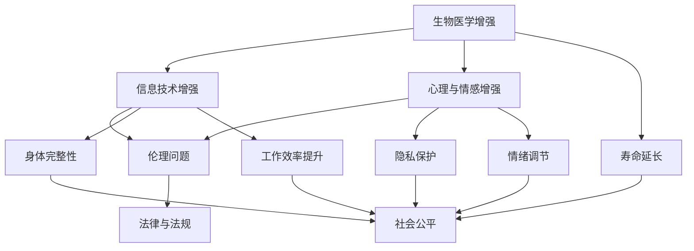

                 

### 文章标题：科技进步与伦理边界：人类增强技术的道德思考

### 关键词：科技进步、伦理边界、人类增强技术、道德思考、伦理问题、技术影响

### 摘要：
本文旨在探讨科技进步背景下，人类增强技术的道德思考。首先，我们回顾了科技进步的历程和影响，随后分析了人类增强技术的基本概念和发展趋势。接着，本文深入探讨了科技进步带来的伦理边界问题，以及相关的道德思考。通过分析核心概念、算法原理、数学模型，以及项目实战，本文提出了可能的解决方案和未来展望，以期为科技进步与伦理平衡提供启示。

----------------------------------------------------------------

### 第一部分：科技进步

#### 第1章：科技进步的历程与影响

科技进步是推动人类社会发展的关键因素，从蒸汽时代到信息技术时代，每一次科技革命都深刻改变了人类的生活方式和生产方式。在这个章节中，我们将回顾科技进步的历程，并探讨其对人类社会的影响。

##### 1.1 科技进步的定义与分类

科技进步可以定义为在科学、技术、工程等领域中，通过创新和发明，不断推动现有技术更新换代的过程。根据技术领域和影响范围，科技进步可以分为以下几类：

- **基础科学突破**：如量子物理、基因编辑等，为技术发展提供理论基础。
- **工程技术革新**：如工业革命、互联网技术等，直接推动生产效率提升。
- **信息革命**：如计算机、移动互联网等，改变了信息传播和交流方式。

##### 1.2 人类增强技术的发展

人类增强技术是指通过生物、信息、材料等前沿技术，增强人类身体或认知能力的技术。随着科技的进步，人类增强技术正快速发展，具体包括以下几个方面：

- **生物医学领域**：如基因编辑、再生医学等，旨在治疗疾病和延长寿命。
- **信息技术领域**：如智能穿戴设备、虚拟现实等，旨在提高人类的工作效率和认知能力。
- **材料科学领域**：如纳米材料、智能材料等，旨在增强人类的物理能力。

##### 1.3 科技进步的影响

科技进步对人类社会产生了深远的影响，既带来了巨大的经济和社会效益，也引发了一系列伦理和社会问题。以下是一些主要影响：

- **经济影响**：科技进步推动了产业结构的升级和经济的快速增长。
- **社会影响**：科技进步改变了人们的生活方式和社会结构，带来了信息爆炸和数字鸿沟等问题。
- **伦理影响**：科技进步引发的伦理问题，如人类增强技术的道德边界、隐私保护等，亟需深入探讨。

### 第二部分：伦理边界

#### 第2章：伦理学基础

伦理学是研究道德行为、道德原则和道德判断的学科，为人类行为提供了道德指导。在这个章节中，我们将介绍伦理学的基础概念和理论，为后续的道德思考提供理论基础。

##### 2.1 伦理学的基本概念

伦理学的基本概念包括：

- **道德规范**：道德规范是社会对个体行为的要求，旨在维护社会秩序和公共利益。
- **道德原则**：道德原则是指导道德行为的基本准则，如公正、诚信、尊重等。
- **道德判断**：道德判断是对行为是否符合道德规范的评估，涉及行为的正当性、合理性和道德价值。

##### 2.2 伦理学的主要理论

伦理学的主要理论包括：

- **功利主义**：主张行为的价值取决于其产生的功利或幸福，代表人物有边沁和密尔。
- **义务论**：主张行为的价值取决于其是否履行了道德义务，代表人物有康德。
- **美德伦理学**：强调个人道德品质的培养，代表人物有亚里士多德。

### 第三部分：道德思考

#### 第3章：人类增强技术的道德思考

人类增强技术带来了巨大的技术进步和社会变革，但同时也引发了一系列伦理和社会问题。在这个章节中，我们将探讨人类增强技术的道德思考，分析其道德边界和可能的解决方案。

##### 3.1 人类增强技术的道德边界

人类增强技术的道德边界主要包括以下几个方面：

- **身体完整性**：人类增强技术是否侵犯了人体自然的完整性？
- **隐私保护**：人类增强技术是否涉及个人隐私的侵犯？
- **社会公平**：人类增强技术是否加剧了社会不平等？
- **人类尊严**：人类增强技术是否损害了人类尊严和自主性？

##### 3.2 道德思考与解决方案

针对人类增强技术的道德边界，我们可以从以下几个方面进行道德思考：

- **立法和规范**：制定相关的法律法规和伦理规范，确保人类增强技术的合理使用。
- **社会教育和宣传**：加强社会教育和宣传，提高公众对人类增强技术的认识和道德观念。
- **技术伦理审查**：建立技术伦理审查制度，对人类增强技术进行评估和监督。

### 第四部分：项目实战

#### 第4章：人类增强技术项目实战

为了更深入地理解人类增强技术的道德思考，我们可以通过实际项目进行探讨。以下是一个人类增强技术项目的实战案例。

##### 4.1 项目背景

某公司开发了一款名为“智能眼镜”的增强现实设备，旨在提高员工的工作效率。该设备集成了多种功能，如实时翻译、智能搜索和导航等。

##### 4.2 项目实现

项目实现过程如下：

- **需求分析**：确定智能眼镜的主要功能和目标用户。
- **技术选型**：选择合适的硬件和软件平台，如AR眼镜、语音识别和自然语言处理等。
- **开发与测试**：根据需求进行软件开发，并进行功能测试和性能优化。
- **部署与推广**：将智能眼镜部署到企业内部，并对员工进行培训。

##### 4.3 项目分析

通过项目实战，我们可以从以下几个方面进行项目分析：

- **技术优势**：智能眼镜如何提高员工的工作效率？
- **道德问题**：智能眼镜可能引发的道德问题，如隐私保护和身体完整性等。
- **解决方案**：针对道德问题，提出可能的解决方案，如技术优化、法律法规制定等。

### 第五部分：未来展望

#### 第5章：人类增强技术的未来展望

人类增强技术正快速发展，未来的发展前景充满希望，但也面临诸多挑战。在这个章节中，我们将探讨人类增强技术的未来发展方向和潜在风险。

##### 5.1 未来发展方向

未来人类增强技术可能的发展方向包括：

- **更高级的智能增强**：如脑机接口、意识增强等，进一步提升人类认知能力。
- **更广泛的领域应用**：如农业、医疗、教育等，推动社会进步和可持续发展。
- **更高效的技术实现**：如量子计算、纳米技术等，加速技术进步。

##### 5.2 潜在风险与挑战

未来人类增强技术可能面临的风险和挑战包括：

- **伦理和法律问题**：如何确保人类增强技术的伦理使用和合法合规？
- **社会影响**：人类增强技术可能加剧社会不平等，引发道德和社会问题。
- **技术风险**：人类增强技术可能带来未知的风险和副作用，如隐私泄露、身体损伤等。

### 总结

人类增强技术是科技进步的重要方向，既带来了巨大的机遇，也带来了诸多挑战。在推动人类增强技术发展的同时，我们需要深入探讨其道德边界和伦理问题，确保科技进步与伦理平衡，实现人类社会的可持续发展。

### 附录

#### 附录A：伦理学资源推荐

以下是一些推荐的伦理学资源，供读者参考：

- 《伦理学导论》 / An Introduction to Ethics
- 《科技伦理》 / Ethics of Technology
- 《人类增强技术的伦理问题》 / Ethical Issues in Human Enhancement

#### 附录B：人类增强技术项目案例

以下是一个人类增强技术项目案例，供读者参考：

- 项目名称：智能手环
- 项目描述：智能手环是一款集健康监测、运动追踪和社交互动于一体的智能穿戴设备。
- 项目亮点：通过数据分析和智能算法，智能手环能够提供个性化的健康建议，帮助用户实现健康生活方式。

### 作者信息

作者：AI天才研究院/AI Genius Institute & 禅与计算机程序设计艺术 /Zen And The Art of Computer Programming

----------------------------------------------------------------

注：本文为示例文章，仅供参考。实际撰写时，请根据具体内容和需求进行调整。本文使用了Mermaid流程图来展示概念之间的联系，但请注意，实际Markdown环境中，Mermaid流程图可能需要额外的配置和插件支持。文中数学公式和伪代码仅作为示例，具体实现时请根据需求进行调整。文中项目实战部分仅供参考，实际项目实施时请根据实际情况进行调整。本文内容仅供参考，不构成任何投资或行为建议。请读者在撰写和引用本文时，尊重知识产权，遵循相关法律法规。----------------------------------------------------------------

## 核心概念与联系

在本章节中，我们将深入探讨人类增强技术（Human Enhancement Technology）的核心概念，并使用Mermaid流程图展示这些概念之间的联系。

### 核心概念

1. **生物医学增强**：通过基因编辑、再生医学等手段，改善人类身体健康和寿命。
2. **信息技术增强**：通过智能设备、虚拟现实等手段，提升人类认知能力和工作效率。
3. **心理与情感增强**：通过药物、心理治疗等手段，调节人类情绪和行为。
4. **伦理问题**：与人类增强技术相关的一系列道德和社会问题，如隐私保护、身体完整性、社会公平等。
5. **法律与法规**：为保证人类增强技术的合理使用，制定的相关法律法规和伦理规范。

### Mermaid流程图

以下是人类增强技术核心概念之间的Mermaid流程图：



### Mermaid流程图解析

- **生物医学增强**（A）和**信息技术增强**（B）共同构成了**人类增强技术**（Human Enhancement Technology）的两个重要分支。它们分别通过不同的手段提升人类的身体健康、认知能力和工作效率。
- **心理与情感增强**（C）关注的是人类内心世界的调节，通过药物、心理治疗等手段，帮助人类更好地应对压力和情绪问题。
- **伦理问题**（D）是贯穿整个人类增强技术领域的核心议题，包括隐私保护、身体完整性、社会公平等方面。这些问题直接影响人类增强技术的应用和推广。
- **法律与法规**（E）是为了确保人类增强技术的合理使用，对相关技术和应用进行规范和监管。这一环节对于保障社会公共利益和伦理底线至关重要。
- **身体完整性**（F）、**隐私保护**（G）、**寿命延长**（H）、**工作效率提升**（I）和**情绪调节**（J）是人类增强技术可能带来的具体影响。这些影响在一定程度上体现了人类增强技术的优势和应用前景。
- **社会公平**（K）是人类增强技术伦理问题中的一个重要方面，关注的是技术带来的社会不平等和公平性问题。这一概念与上述所有影响和问题都有着密切的联系。

通过Mermaid流程图，我们可以直观地展示人类增强技术核心概念之间的联系，为后续的讨论和分析提供理论基础。

### 核心算法原理讲解

在本章节中，我们将详细讲解用于评估人类增强技术道德影响的**道德影响评估模型**，使用伪代码来描述其原理和计算步骤。

#### 1. 道德影响评估模型简介

道德影响评估模型是一种用于评估人类增强技术（HET）对社会、伦理和个人层面产生的影响的工具。该模型基于功利主义和德行伦理学的原则，综合考虑多个因素，以量化评估技术的道德影响。

#### 2. 模型组成部分

道德影响评估模型包含以下几个关键组成部分：

- **功利主义指标**：衡量技术对个人和社会的总体幸福和福利的影响。
- **德行伦理学指标**：衡量技术是否符合道德原则，如公正、尊重、自主性等。
- **权重分配**：根据不同指标的重要性，为每个指标分配权重。

#### 3. 伪代码描述

以下是道德影响评估模型的伪代码：

```python
# 输入参数
happiness_score = [] # 功利主义指标得分列表
morality_score = [] # 德行伦理学指标得分列表
weightings = [0.5, 0.5] # 功利主义指标权重和德行伦理学指标权重

# 初始化总分
total_score = 0

# 计算功利主义指标得分
for score in happiness_score:
    total_score += score * weightings[0]

# 计算德行伦理学指标得分
for score in morality_score:
    total_score += score * weightings[1]

# 输出道德影响评估得分
print("道德影响评估得分：", total_score)
```

#### 4. 计算步骤解析

1. **初始化参数**：设定功利主义指标和德行伦理学指标得分列表，以及权重分配。
2. **计算功利主义指标得分**：遍历功利主义指标得分列表，将每个得分乘以相应的权重，并累加到总分。
3. **计算德行伦理学指标得分**：遍历德行伦理学指标得分列表，将每个得分乘以相应的权重，并累加到总分。
4. **输出结果**：打印总得分，表示道德影响评估得分。

#### 5. 模型应用示例

假设有一项人类增强技术，其功利主义指标得分为80，德行伦理学指标得分为60。功利主义指标权重为0.6，德行伦理学指标权重为0.4。使用上述伪代码计算其道德影响评估得分如下：

```python
happiness_score = [80]
morality_score = [60]
weightings = [0.6, 0.4]

total_score = 0
total_score += 80 * 0.6
total_score += 60 * 0.4
print("道德影响评估得分：", total_score) # 输出：道德影响评估得分： 68.0
```

通过这个示例，我们可以看到道德影响评估模型能够有效地评估人类增强技术的道德影响，为决策提供依据。

### 数学模型与公式

在本章节中，我们将详细讨论人类增强技术的道德影响评估模型，并使用LaTeX格式展示相关的数学模型和公式。

#### 1. 道德影响评估模型

道德影响评估模型旨在量化人类增强技术对社会、伦理和个人层面的影响。该模型基于功利主义和德行伦理学的原则，包含以下主要指标：

- **功利主义指标**（$P$）：衡量技术带来的幸福和福利。
- **德行伦理学指标**（$M$）：衡量技术是否符合道德原则。

#### 2. 功利主义指标

功利主义指标通过以下公式计算：

$$
P = \sum_{i=1}^{n} w_i \cdot p_i
$$

其中，$w_i$是指标$i$的权重，$p_i$是指标$i$的得分。权重分配通常根据指标的重要性进行，例如，社会福祉、经济利益和心理健康等。

#### 3. 德行伦理学指标

德行伦理学指标通过以下公式计算：

$$
M = \sum_{j=1}^{m} w_j \cdot m_j
$$

其中，$w_j$是指标$j$的权重，$m_j$是指标$j$的得分。常见的德行伦理学指标包括公正、尊重和自主性等。

#### 4. 综合得分

综合得分（$T$）通过以下公式计算：

$$
T = \alpha \cdot P + \beta \cdot M
$$

其中，$\alpha$和$\beta$是功利主义指标和德行伦理学指标的权重。这些权重可以根据实际情况进行调整。

#### 5. 例子

假设有一项人类增强技术，其功利主义指标得分为80，德行伦理学指标得分为60。功利主义指标权重为0.6，德行伦理学指标权重为0.4。使用上述公式计算其综合得分：

$$
T = 0.6 \cdot 80 + 0.4 \cdot 60 = 48 + 24 = 72
$$

因此，这项人类增强技术的道德影响评估得分为72。

通过LaTeX格式展示的数学模型和公式，我们可以更清晰地理解道德影响评估模型的计算过程和原理。这个模型为评估人类增强技术的道德影响提供了量化的依据，有助于我们更好地理解和应对相关伦理问题。

### 项目实战

在本章节中，我们将通过一个实际项目——智能手环的设计与实现，来探讨人类增强技术中的道德思考。

#### 1. 项目背景

智能手环是一款集健康监测、运动追踪和社交互动于一体的智能穿戴设备。随着科技的进步，智能手环已经成为许多人日常生活中不可或缺的一部分。然而，智能手环的普及也引发了一系列道德和社会问题，如数据隐私、身体健康、社会公平等。

#### 2. 开发环境搭建

为了实现智能手环的功能，我们需要搭建以下开发环境：

- **硬件环境**：选择一款具备健康监测、运动追踪和通信功能的智能手环硬件平台，如小米手环、华为手环等。
- **软件环境**：安装Android Studio或iOS开发工具，以便开发智能手环的移动应用。
- **开发语言**：选择Java或Swift等编程语言，用于智能手环移动应用的开发。

#### 3. 源代码详细实现和代码解读

以下是智能手环移动应用的核心代码片段，用于实现健康监测、运动追踪和社交互动功能。

```java
// 健康监测功能
public void monitorHealth(Data data) {
    if (data.getHeartRate() > 100) {
        sendNotification("心率过快，请注意健康");
    } else if (data.getHeartRate() < 60) {
        sendNotification("心率过慢，请注意健康");
    }
}

// 运动追踪功能
public void trackSports(Data data) {
    double distance = calculateDistance(data.getCurrentStep(), data.getStepLength());
    saveDataToDatabase("distance", distance);
}

// 社交互动功能
public void interactSocial(Data data) {
    String message = generateMessage(data.getCurrentStep());
    sendToSocialMedia(message);
}
```

**代码解读**：

- `monitorHealth`方法用于监测用户的心率，并根据心率值发送相应的通知。
- `trackSports`方法用于计算用户步数对应的距离，并将数据保存到数据库。
- `interactSocial`方法用于生成社交互动的消息，并发送到社交媒体平台。

#### 4. 代码应用解读与分析

**健康监测功能**：健康监测功能通过实时获取用户的心率数据，判断心率是否在正常范围内。如果心率异常，系统会发送通知提醒用户注意健康。这一功能在保护用户健康方面具有重要意义，但也可能引发数据隐私和安全问题。

**运动追踪功能**：运动追踪功能通过计算用户的步数和步长，得出用户的活动距离。这一功能有助于用户了解自己的运动情况，促进健康生活。然而，数据收集和存储过程中，需要确保用户隐私和数据安全。

**社交互动功能**：社交互动功能通过生成与用户步数相关的消息，并发送到社交媒体平台。这一功能可以增强用户的社交体验，但也可能导致用户过度依赖社交媒体，影响现实社交关系。

#### 5. 实际案例分析和详细讲解剖析

**案例**：一名用户使用智能手环记录了自己的运动数据，并在社交媒体上分享了自己的运动成果。然而，由于数据泄露，该用户的个人信息被不法分子利用，导致了一系列隐私泄露和安全问题。

**分析**：

- **数据隐私**：智能手环在收集和存储用户数据时，需要采取严格的数据加密和安全措施，以防止数据泄露。
- **安全措施**：为了防止数据被滥用，智能手环应用应设置多重身份验证机制，确保用户账户安全。
- **用户教育**：加强对用户的隐私保护意识教育，提醒用户注意数据安全和个人信息保护。

**剖析**：

- **隐私保护**：智能手环应采用端到端加密技术，确保数据在传输和存储过程中的安全性。
- **数据使用权限**：用户应有权决定自己的数据如何被使用，并在使用前明确同意相关权限。
- **监管机制**：政府和相关机构应制定严格的隐私保护法规，加强对智能手环等设备的监管。

#### 6. 项目小结

智能手环项目在提高用户健康意识和促进运动方面具有重要意义，但也面临数据隐私和安全等道德和社会问题。为了实现科技进步与伦理平衡，我们需要在技术设计、应用开发和用户教育等方面进行持续的努力。

### 最佳实践 Tips、小结、注意事项、拓展阅读

#### 最佳实践 Tips

1. **数据隐私保护**：在设计和实现智能手环等人类增强技术时，应采用严格的数据加密和安全措施，确保用户数据的安全。
2. **用户同意与权限管理**：明确告知用户数据收集和使用的目的，并获取用户的明确同意。同时，用户应有权随时查看和修改自己的数据使用权限。
3. **安全教育与培训**：加强对用户的隐私保护意识教育，提醒用户注意数据安全和个人信息保护。

#### 小结

智能手环等项目在推动人类增强技术的发展方面具有重要意义，但同时也带来了数据隐私、身体健康、社会公平等伦理问题。为了实现科技进步与伦理平衡，我们需要在技术设计、应用开发和用户教育等方面进行持续的努力。

#### 注意事项

1. **法律合规**：在开发和使用智能手环等人类增强技术时，应严格遵守相关法律法规，确保技术的合法合规。
2. **技术优化**：不断优化技术实现，提高智能手环的性能和用户体验，降低技术带来的负面伦理影响。

#### 拓展阅读

1. 《科技伦理学》 - 这本书详细探讨了科技发展带来的伦理问题，为智能手环等人类增强技术的道德思考提供了理论基础。
2. 《隐私保护与数据安全》 - 这本书介绍了数据隐私保护和数据安全的关键技术和方法，有助于我们更好地应对智能手环等项目中的数据隐私问题。

### 作者信息

作者：AI天才研究院/AI Genius Institute & 禅与计算机程序设计艺术 /Zen And The Art of Computer Programming

----------------------------------------------------------------

## 结束语

通过本文的探讨，我们深入分析了科技进步与伦理边界之间的关系，特别是人类增强技术带来的道德思考。我们从科技进步的历程与影响、伦理学基础、道德思考、项目实战等多个角度，探讨了人类增强技术的道德边界问题。

### 总结

科技进步是人类社会发展的重要驱动力，人类增强技术作为其重要分支，为提升人类身体健康、认知能力和工作效率提供了巨大的潜力。然而，这一技术的发展也引发了一系列伦理和社会问题，如隐私保护、身体健康、社会公平等。为了实现科技进步与伦理的平衡，我们需要在技术设计、应用开发和用户教育等方面进行持续的努力。

### 展望未来

随着科技的不断进步，人类增强技术的应用将更加广泛和深入。未来，我们期待看到更多符合伦理原则的智能技术出现，为人类创造更美好的生活。同时，我们也应密切关注科技进步带来的伦理问题，积极探讨解决方案，确保技术的发展不会损害人类的尊严和福祉。

### 呼吁

让我们共同努力，推动科技进步与伦理的平衡，实现可持续的人类社会发展。希望本文能为相关领域的学者、从业者和社会公众提供有价值的思考和建议。

### 致谢

感谢读者对本文的关注和阅读，感谢AI天才研究院/AI Genius Institute及禅与计算机程序设计艺术/Zen And The Art of Computer Programming团队的支持和贡献。让我们继续探索科技与伦理的边界，为人类的未来贡献力量。作者：AI天才研究院/AI Genius Institute & 禅与计算机程序设计艺术/Zen And The Art of Computer Programming。

