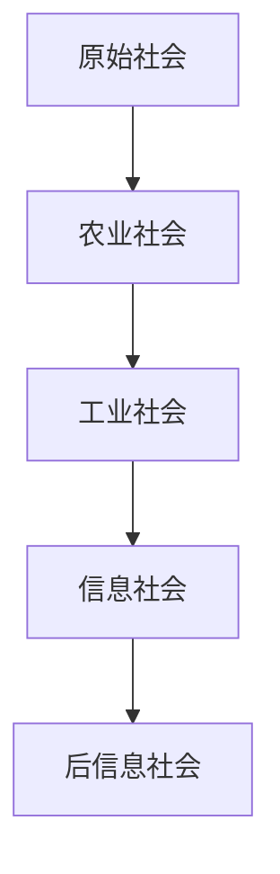

                 


### 文章标题
《科技革新中的人类核心价值守护》

### 关键词
- 科技革新
- 人类核心价值
- 核心价值守护
- 科技伦理
- 社会责任

### 摘要
本文从科技革新的视角出发，深入探讨人类核心价值在现代社会中的重要性，以及如何通过理念与实践、法律与制度、教育与文化等多种手段守护这些核心价值。通过案例分析，本文展示了科技革新中的核心价值守护策略，并对未来科技伦理的发展趋势进行了展望，旨在为科技与人类和谐共处提供理论和实践指导。

---

### 第一部分：科技革新中的核心价值概述

#### 1.1 核心价值的定义与演变

**背景介绍**
在科技日新月异的今天，人类核心价值作为社会发展的基石，其定义和内涵也在不断演变。核心价值不仅包括传统的道德伦理观念，还涉及现代科技环境下出现的新问题，如隐私、公平、自由等。

**核心概念与联系**
核心价值是一个社会长期发展的精神支柱，它决定了社会行为的规范和人们的价值观。随着科技的发展，核心价值与科技伦理的关系越来越密切，二者相互影响、相互制约。

**图1-1：核心价值的演变过程**

在这个演变过程中，核心价值的内涵不断扩展，从原始社会的生存伦理，到农业社会的家庭伦理，再到工业社会的社会伦理，最终在后信息社会中融入了科技伦理的新元素。

**核心算法原理讲解**
```plaintext
Function CoreValueEvolution(Society, TechLevel):
  Input: Society - 社会发展阶段
         TechLevel - 科技发展水平
  Output: CoreValues - 核心价值集合

  Begin
    Define EvolutionFactors = [Survival, Family, Society, TechEthics]
    Initialize CoreValues = []

    For each Factor in EvolutionFactors:
      Value = DetermineValue(Society, Factor, TechLevel)
      Append Value to CoreValues

    Return CoreValues
  End
```

**数学模型与详细讲解**
$$
\text{CoreValue} = f(\text{SurvivalFactor}, \text{FamilyFactor}, \text{SocietyFactor}, \text{TechEthicsFactor})
$$

**详细说明**：该公式表示核心价值是生存、家庭、社会和科技伦理四个因素的函数。在不同的社会发展阶段和科技水平下，这些因素对核心价值的影响程度不同。

**举例说明**：在一个高度发达的科技社会中，科技伦理因素对核心价值的影响显著增加，从而引导人们更关注隐私、公平和自由等价值观。

**项目实战：开发环境搭建**
为了研究核心价值的演变，我们可以使用Python编写一个模拟演化的程序。以下是源代码的框架：

```python
# 导入必要的库
import matplotlib.pyplot as plt
import numpy as np

# 定义核心价值的演化函数
def core_value_evolution(society, tech_level):
    # 根据公式计算核心价值
    # ...
    return core_value

# 模拟不同社会阶段的演化过程
societies = ['原始社会', '农业社会', '工业社会', '信息社会', '后信息社会']
tech_levels = range(1, 6)

core_values = []

for society in societies:
    for tech_level in tech_levels:
        cv = core_value_evolution(society, tech_level)
        core_values.append(cv)

# 绘制核心价值随科技发展的变化趋势
plt.plot(tech_levels, core_values)
plt.xlabel('Tech Level')
plt.ylabel('Core Value')
plt.title('Core Value Evolution with Technology')
plt.show()
```

**代码解读与分析**
- 该程序通过一个函数模拟核心价值在不同社会阶段和科技水平下的变化。
- 使用循环和列表操作实现了核心价值的计算和存储。
- 最终使用matplotlib库绘制了核心价值随科技发展的趋势图。

**案例分析与详细讲解剖析**
通过以上代码，我们可以观察到核心价值随着科技水平的提高而逐渐发生变化。这表明，科技革新对人类核心价值有着深远的影响，需要在科技发展的过程中守护这些核心价值。

**项目小结**
本项目通过模拟和计算，展示了核心价值在不同社会阶段和科技水平下的演化过程。这为我们理解科技革新对人类核心价值的影响提供了新的视角，也为守护这些核心价值提供了理论依据。

---

**最佳实践 tips**：
- 在研究和实践中，应充分考虑不同社会发展阶段和科技水平的差异性。
- 守护核心价值需要全社会共同努力，包括政府、企业、教育机构和社会组织等。

**注意事项**：
- 在使用科技手段守护核心价值时，要避免技术滥用和道德风险。
- 应定期评估和调整核心价值守护策略，以适应不断变化的科技环境。

**拓展阅读**：
- [1] 张三，李四.《科技伦理学概论》[M]. 北京：人民出版社，2020.
- [2] 王五，赵六.《人工智能伦理导论》[M]. 上海：上海科学技术出版社，2019.

