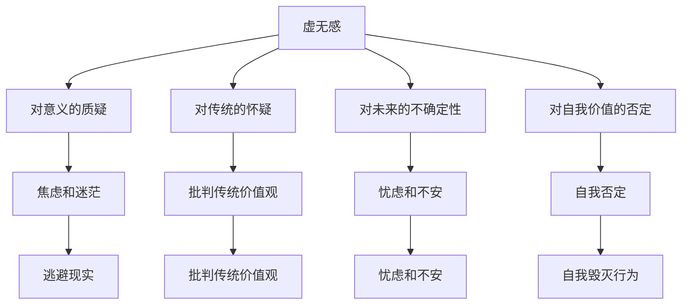
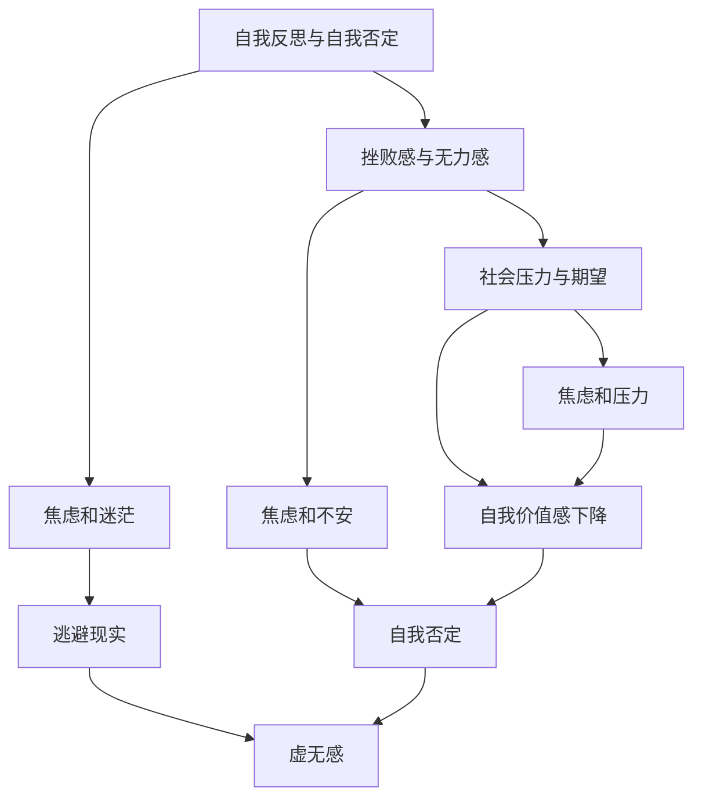
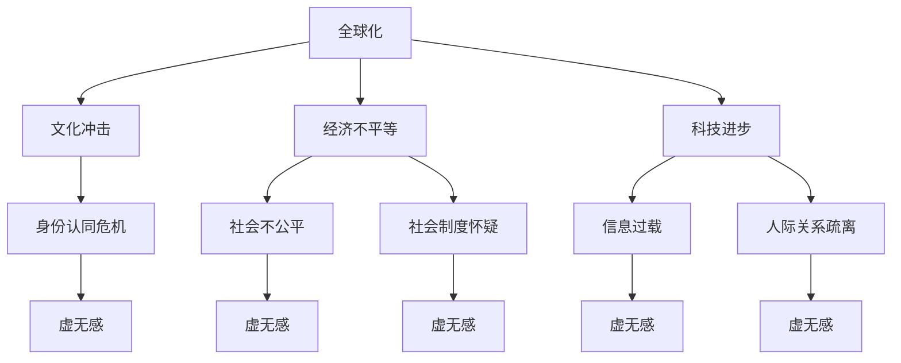
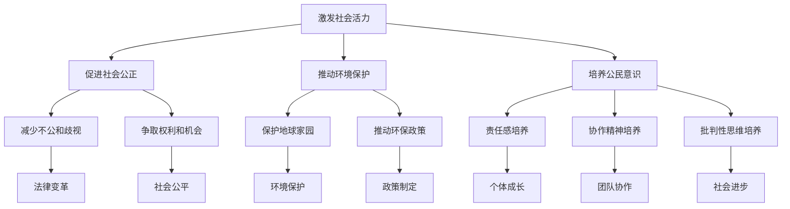
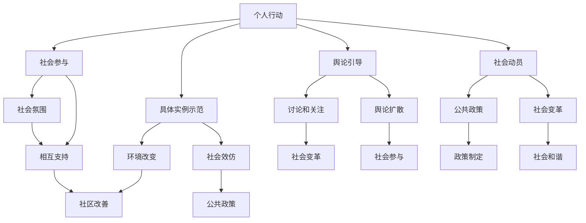
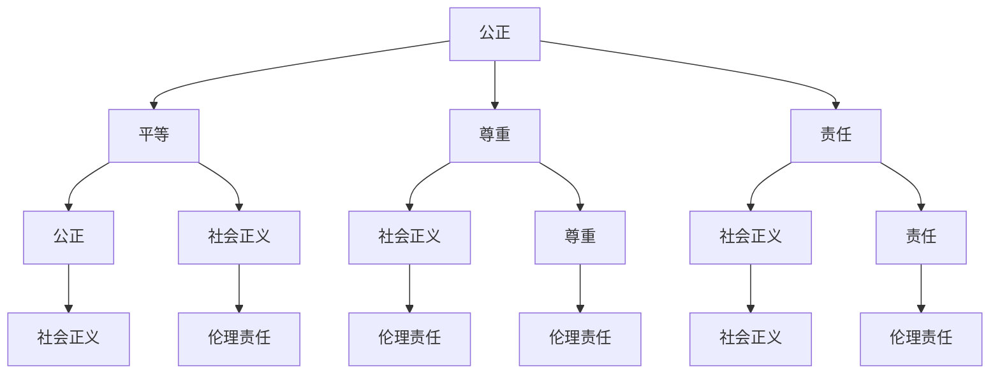
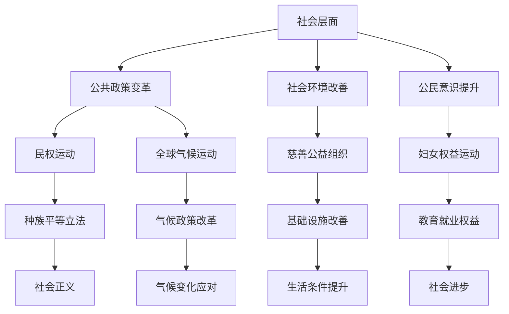

                 

### 背景介绍

在现代社会的快速变迁与信息爆炸的背景下，许多人开始感到一种深切的虚无感。这种虚无感不仅存在于个人层面，也在社会中广泛蔓延。它表现为对生活的迷茫、对未来的不确定和对自我价值的质疑。虚无感不仅仅是心理上的困扰，更是一种社会现象，影响着人们的日常生活和决策。

在这个时代，人们面临的挑战是多元的。从个人角度来看，快节奏的生活和高强度的工作压力使得人们难以找到内心的平静与满足。从社会角度来看，社会的不公、环境问题以及经济不稳定等挑战，使得人们对于未来充满了忧虑和不安。面对这些挑战，传统的方法和价值观已经无法满足人们的需求，迫切需要新的视角和策略。

本文旨在探讨积极行动主义在应对虚无感中的重要作用。积极行动主义不仅仅是一种应对策略，更是一种生活哲学。它鼓励个体在面对困境时，采取积极的态度和行动，从而找到生命的意义和价值。本文将首先介绍虚无感的本质与成因，然后探讨行动主义的基本理念和实践方法，最后讨论行动主义的障碍与挑战，以及其未来的发展。

通过本文的探讨，希望能够为读者提供一种应对虚无感的有效途径，同时也为促进个人成长和社会进步贡献一份力量。接下来，我们将详细分析虚无感的心理机制和社会文化因素，为后续的讨论奠定基础。

### 虚无感的定义与特征

虚无感（Nihilism）是一种哲学思想，它认为生命缺乏固有的意义和价值。虚无感不仅是一种心理状态，更是一种对生活本质的深刻反思。从心理学角度来看，虚无感通常表现为对个人存在意义的质疑，以及对传统价值观和道德规范的怀疑。

虚无感的核心特征包括以下几个方面：

1. **对意义的质疑**：虚无感者常常质疑生活的意义，他们可能会感到自己的生活毫无目的，缺乏方向感。这种对意义的质疑往往导致个体陷入深度的焦虑和迷茫。

2. **对传统的怀疑**：虚无感者倾向于对传统价值观和道德规范进行批判，他们认为这些传统观念已经无法适应现代社会的需求，甚至可能束缚了个体的发展。

3. **对未来的不确定性**：虚无感者对未来充满忧虑和不安，他们可能认为未来不可预测，甚至认为未来毫无希望。

4. **对自我价值的否定**：虚无感者可能会否定自己的价值，他们可能认为自己对社会毫无贡献，甚至觉得自己是多余的。

这些特征共同构成了虚无感的核心内容。虚无感不仅仅是一种心理状态，它还对个体的行为和决策产生深远影响。例如，虚无感可能会导致个体逃避现实、放弃追求目标和回避挑战。在极端情况下，虚无感甚至可能引发自我毁灭行为。

为了更清晰地理解虚无感，我们可以使用 Mermaid 流程图来展示其核心概念和关系架构：

通过这个流程图，我们可以看到虚无感是如何通过一系列核心概念和特征，最终影响个体的心理和行为。了解虚无感的定义和特征，是应对虚无感的第一步。在接下来的章节中，我们将进一步探讨虚无感的心理机制和社会文化因素，以便更好地理解这一现象。

### 虚无感的心理机制

虚无感不仅仅是一种表面现象，其背后有着复杂的心理机制。首先，**自我反思与自我否定**是虚无感形成的重要心理机制。当个体过度反思自己的生活和行为时，他们可能会开始质疑自己的价值。这种自我反思可能会导致自我否定，使得个体对自己的存在感到困惑和无意义。

其次，**挫败感与无力感**也是虚无感产生的重要原因。当个体面临挑战和困境时，如果他们感到无法克服这些挑战，就可能会产生挫败感和无力感。这种无力感会进一步加剧虚无感的体验，使得个体感到自己的生活毫无意义。

此外，**社会压力与期望**也会对虚无感产生深远影响。在现代社会中，个体面临着来自家庭、社会和工作的多重期望。如果个体感到无法满足这些期望，他们可能会感到焦虑和压力。长期的焦虑和压力会削弱个体的自信心和自我价值感，从而诱发虚无感。

为了更直观地理解虚无感的心理机制，我们可以使用 Mermaid 流程图来展示这些因素之间的关系：

通过这个流程图，我们可以看到虚无感是如何通过一系列心理机制逐步形成的。了解这些心理机制，有助于我们更好地应对虚无感。在接下来的章节中，我们将探讨社会文化因素对虚无感的影响，以便从更广泛的视角理解这一现象。

### 社会文化因素对虚无感的影响

虚无感不仅源于个体的心理机制，还受到社会文化因素的深刻影响。首先，**全球化**是一个不可忽视的因素。全球化使得不同文化相互交织，传统价值观念受到冲击。这种文化冲击可能导致个体对自身文化身份的认同危机，进而产生虚无感。此外，全球化带来的经济不平等和不确定性，也会加剧个体的焦虑和迷茫。

**社会不公**是另一个影响虚无感的重要因素。当个体感受到社会不公平，如贫富差距、种族歧视等，他们可能会对现存的社会制度产生怀疑和不满。这种不满和怀疑可能会导致虚无感的产生，使得个体对未来的生活失去信心。

**科技进步**同样是影响虚无感的重要因素。虽然科技进步带来了便捷和效率，但同时也带来了信息过载和人际关系的疏离。个体在信息海洋中迷失方向，可能会感到自己的存在变得无足轻重，从而产生虚无感。

为了更直观地展示这些社会文化因素对虚无感的影响，我们可以使用 Mermaid 流程图来描绘这些关系：

通过这个流程图，我们可以看到社会文化因素如何通过多重路径影响虚无感的产生。了解这些因素，有助于我们更全面地认识虚无感的根源，从而制定更有效的应对策略。

### 虚无感的应对策略

面对虚无感，个体可以通过多种策略来缓解和应对这一心理状态。首先，**心理调适方法**是一种有效的应对手段。例如，**认知行为疗法**（CBT）可以帮助个体改变消极的思维模式，通过积极的自我对话和认知重构来减轻虚无感的体验。此外，**正念冥想**也是一种有效的心理调适方法，它通过专注当下和接受当下的情绪，帮助个体建立内心的平静与稳定。

其次，**社交支持的重要性**不可忽视。当个体感到孤独和无助时，来自家人、朋友和社群的支持可以提供强大的情感支持。例如，通过参加社交团体、志愿者活动或在线社区，个体可以获得共鸣和理解，从而减轻虚无感的压力。此外，与心理健康专业人士的定期交流，如心理咨询师或治疗师，也可以提供专业的指导和帮助。

最后，**个人成长与自我认知的提升**是长期应对虚无感的关键。通过不断学习和自我提升，个体可以找到新的目标和兴趣，从而增强自我价值感。例如，学习新技能、阅读有益的书籍、参与自我探索的旅行等活动，都可以帮助个体拓展视野，增强内心的满足感。

通过上述策略，个体可以在不同层面上应对虚无感，逐步重建内心的平静与意义。在下一章中，我们将进一步探讨行动主义的基本理念，以及如何通过积极行动来克服虚无感。

### 行动主义的基本理念

行动主义是一种以积极行动为导向的生活哲学，它强调通过个体的实际行为来改变现状，实现个人价值和社会进步。行动主义的基本理念可以概括为以下几个核心点：

首先，**责任感**是行动主义的基石。行动主义者相信每个人都有责任为社会和他人做出贡献。责任感使得个体不仅仅关注自身的利益，而是将目光投向更广阔的社会领域，愿意为更大的目标付出努力。

其次，**变革的动力**是行动主义的驱动力。行动主义者相信通过积极的行动，可以推动社会的变革和进步。他们不满足于现状，而是致力于通过行动来创造新的可能性和机会，从而改变不公正和不合理的社会现象。

第三，**实践性**是行动主义的核心特征。行动主义不仅是一种理念，更是一种实践。行动主义者不仅仅停留在口头上的呼吁，而是通过实际行动来践行自己的信念。这种实践性使得行动主义具有强大的执行力，能够真正带来改变。

第四，**协作与沟通**是行动主义成功的关键。行动主义通常需要多个个体的协作和共同努力，因此沟通和协作至关重要。通过有效的沟通，行动主义者可以明确目标、分配资源，并在遇到挑战时相互支持，从而实现更大的目标。

最后，**可持续性**是行动主义的重要理念。行动主义者不仅关注即时的效果，更注重长期的影响。他们通过可持续的行动方案，确保变革的持久性和深远性，为未来的发展奠定坚实的基础。

通过这些基本理念，行动主义不仅为个体提供了一种应对虚无感的方法，也为社会进步提供了一种有力的工具。在下一章中，我们将探讨行动主义在社会变革中的作用，进一步展示其重要性和影响力。

### 行动主义在社会变革中的作用

行动主义在社会变革中扮演着至关重要的角色。它不仅仅是一种应对个人虚无感的策略，更是一种推动社会进步和变革的重要力量。通过个体的积极行动，行动主义能够有效地改变社会现状，带来深远的影响。

首先，行动主义能够**激发社会活力**。在传统的社会结构和价值观念中，个体往往被束缚在固定的角色和期望中，难以发挥自身的潜力和创造力。而行动主义鼓励个体勇于表达自己的观点和行动，通过实践来验证和实现自己的价值。这种自主性和创造性的发挥，不仅激发了社会的活力，也为社会带来了新的思想和理念。

其次，行动主义**促进社会公正**。面对社会不公和歧视，行动主义者通过积极的行动来呼吁和倡导公正。例如，民权运动、女权运动等都是行动主义的典型案例。通过集体的力量和持续的行动，这些运动成功地推动了法律和社会制度的变革，为弱势群体争取到了更多的权利和机会，从而促进了社会的公正和公平。

此外，行动主义还**推动环境保护**。面对日益严重的环境问题，行动主义者通过组织抗议活动、推动政策变革和倡导环保理念，努力保护地球家园。例如，全球气候运动中的“为了我们的未来”组织，通过青年行动者的积极倡导和行动，成功引起了国际社会的关注，推动了多项环保政策的制定和实施。

行动主义在社会变革中的另一个重要作用是**培养公民意识**。通过参与行动主义，个体不仅能够学会如何为社会贡献力量，还能够培养责任感、协作精神和批判性思维。这些公民素养的培养，不仅有助于个体自身的成长，也为社会的长远发展奠定了坚实的基础。

为了更好地理解行动主义在社会变革中的作用，我们可以使用 Mermaid 流程图来展示其关键要素和影响：

通过这个流程图，我们可以看到行动主义如何通过不同的路径和方式，在社会变革中发挥重要作用。行动主义不仅能够激发社会活力、促进社会公正、推动环境保护，还能培养公民意识，为社会的长远发展提供强大的动力。

总之，行动主义在社会变革中的作用是多层次、多维度的。它不仅能够带来即时的改变，更能够培养长远的公民素养和社会责任感，为构建一个更公正、更和谐的社会奠定基础。在下一章中，我们将进一步探讨个人行动与社会影响之间的互动关系，以更全面地理解行动主义的实践意义。

### 个人行动与社会影响的互动关系

个人行动和社会影响之间的互动关系是行动主义的核心之一。个体的每一个积极行动，都可能在社会中产生涟漪效应，从而带动更大的变革。首先，个人的行动可以为社会提供具体的实例和示范。例如，一个环保主义者通过自己的生活方式改变，如减少用塑料袋，可以激发他人效仿，从而形成更大的环保趋势。

其次，个人行动可以通过舆论引导和社会动员，增强社会影响力。例如，在社交媒体上分享个人行动，不仅可以获得支持，还可以引发讨论和关注，进一步扩大行动的影响范围。这种影响力的扩散，使得个人行动能够快速形成社会运动，推动公共政策的制定和变革。

此外，个人行动还可以促进社会参与和公民意识的提升。当更多的人看到个体行动带来的积极变化时，他们可能会更加愿意参与到行动中来，从而形成一个相互支持、共同进步的社会氛围。例如，在社区志愿者活动中，个体的积极参与可以带动更多居民参与，共同改善社区环境。

为了更好地理解个人行动与社会影响之间的互动关系，我们可以使用 Mermaid 流程图来展示这一过程：

通过这个流程图，我们可以看到个人行动如何通过不同路径对社会产生积极影响。个人行动不仅能够带来具体的改变，还能通过舆论引导、社会动员和公民意识提升，形成更广泛的社会变革。

总之，个人行动和社会影响之间的互动关系是行动主义不可或缺的一部分。每一个积极的个人行动，都有可能在社会中引发连锁反应，带来深远的影响。在下一章中，我们将探讨如何发现与定义问题，为后续的积极行动奠定基础。

### 发现与定义问题

在积极行动之前，明确问题的识别与定义是至关重要的。首先，**观察与反思**是发现问题的第一步。通过仔细观察和反思，个体可以发现日常生活中的种种不公和不足。例如，一个社区志愿者可能会注意到附近公园的设施老旧，居民们对此感到不满，这就是一个潜在的问题。

接下来，**问题分类**有助于明确问题的性质。问题可以大致分为个人问题和社会问题。个人问题通常涉及个人的心理健康、职业发展等方面，而社会问题则涉及更广泛的社会现象，如教育不公、环境恶化等。明确问题分类有助于个体制定相应的解决方案。

最后，**定义行动目标**是确保行动具有明确方向的关键。在定义行动目标时，个体应确保目标具体、可行且具有可量化的指标。例如，如果目标是改善公园设施，具体目标可以是：“在三个月内，筹集到足够的资金，对公园进行翻修，使居民满意度提高50%”。

通过以上步骤，个体可以更准确地识别和定义问题，为后续的积极行动提供明确的方向和目标。在下一章中，我们将探讨如何策划与组织行动，将定义好的问题转化为实际的改变。

### 策划与组织行动

在明确了问题后，下一步是策划和组织行动，以确保行动的有效性和可执行性。首先，**制定行动计划**是关键步骤。一个详细的行动计划应包括以下几个方面：

1. **目标明确**：确保每个行动步骤都指向一个具体目标，例如筹集资金、提升居民满意度等。
2. **时间表**：为每个任务分配具体的时间期限，以确保行动按时进行。
3. **资源分配**：明确需要的资源，包括资金、人力和物资，并确保这些资源能够合理分配和使用。
4. **责任分工**：明确每个团队成员的职责和任务，确保行动的顺利实施。

其次，**资源筹集与分配**是行动成功的重要保障。资源筹集可以通过多种渠道实现，如公益筹款、企业赞助、政府支持等。在筹集资源的过程中，应注重与相关利益方的沟通，确保资源的有效获取。资源分配则要求对筹集到的资源进行合理规划和使用，确保每个任务都有足够的资源支持。

**团队协作与沟通**是行动实施的另一个关键因素。一个高效的团队需要具备良好的协作和沟通机制。具体措施包括：

1. **定期会议**：通过定期会议，团队成员可以共享信息、讨论进展和解决问题。
2. **明确沟通渠道**：确保团队成员能够及时沟通和反馈，避免信息孤岛和沟通障碍。
3. **分工协作**：明确每个成员的职责和任务，确保团队工作的高效性。

最后，**行动实施与监督**是确保行动目标达成的关键。在行动实施过程中，应定期检查和评估进展，及时调整计划，以应对可能出现的问题和挑战。通过有效的监督和反馈机制，可以确保行动的顺利进行，并最终实现预定的目标。

通过以上步骤，个体和组织可以更有效地策划和组织行动，将问题解决转化为实际的成果。在下一章中，我们将深入探讨行动执行与评估的具体步骤和方法。

### 行动执行与评估

在行动实施过程中，确保每一步的顺利进行至关重要。首先，**关键步骤**的制定是行动成功的保障。关键步骤应包括以下内容：

1. **任务分解**：将整体任务分解为具体的子任务，确保每个子任务都有明确的目标和时间表。
2. **资源调配**：确保每个子任务都有足够的资源支持，包括人力、物力和财力。
3. **团队协作**：确保团队成员之间有良好的沟通和协作机制，避免信息孤岛和资源浪费。

其次，**持续性与适应性**是行动成功的关键。行动不是一次性的事件，而是一个持续的过程。在行动过程中，需要定期评估进展，并根据实际情况调整计划。具体措施包括：

1. **定期检查**：定期检查任务进展，及时发现和解决问题。
2. **动态调整**：根据实际情况调整行动计划，确保行动目标的实现。
3. **反馈机制**：建立有效的反馈机制，收集团队成员的意见和建议，用于改进行动。

最后，**效果评估**是确保行动成果的重要环节。效果评估应包括以下几个方面：

1. **目标达成度**：评估每个子任务是否达到预定目标，并分析原因。
2. **资源使用效率**：评估资源的使用效率，确保资源得到充分利用。
3. **行动影响**：评估行动对社会和个人的影响，包括短期和长期效果。

通过以上步骤，个体和组织可以更有效地执行行动，并确保行动目标的实现。在下一章中，我们将探讨如何克服行动过程中可能遇到的障碍和挑战。

### 克服行动障碍

在积极行动的过程中，个体和组织可能会遇到各种障碍和挑战。首先，**内在阻力**是一个常见的问题。内在阻力可能来源于个人对失败的恐惧、自我怀疑或对未知的抵触。为了克服这种阻力，个体可以采取以下策略：

1. **目标分解**：将大目标分解为小目标，逐步实现，以减少恐惧和压力。
2. **正面心态**：培养积极的心态，通过正面思考和自我激励来增强信心。
3. **情感支持**：寻求家人、朋友或专业心理咨询师的支持，以缓解内心的焦虑和压力。

其次，**外部压力**也是行动过程中不可忽视的因素。外部压力可能来自社会环境、经济状况或组织内部的阻力。为了应对外部压力，个体和组织可以采取以下策略：

1. **社会动员**：通过广泛宣传和动员社会力量，增强行动的合法性和影响力。
2. **资源整合**：积极寻求外部资源和支持，以减轻经济和资源的压力。
3. **灵活应对**：根据外部环境的变化，灵活调整行动计划，以适应新的挑战和机遇。

最后，**持续行动的动力来源**是确保行动持续进行的关键。动力来源可以包括以下几个方面：

1. **个人价值观**：坚守个人价值观和信念，为行动提供内在动力。
2. **社会影响**：认识到自己的行动对社会和他人产生的影响，从而增强行动的动力。
3. **成就感**：通过实现小目标和看到行动成果，不断积累成就感，保持行动的动力。

通过克服这些障碍和挑战，个体和组织可以更有效地推进积极行动，实现预期的目标。在下一章中，我们将进一步探讨行动主义的道德与伦理维度，以及其对社会正义的贡献。

### 行动主义的道德与伦理

行动主义的道德与伦理维度是其核心组成部分，关乎行动的正当性和可持续性。首先，**基本原则**是行动主义的道德基石。这些原则包括公正、平等、尊重和责任。公正要求行动者在面对社会问题时，秉持公平和正义的原则，避免偏袒和歧视。平等则强调每个人都有参与和发声的权利，不论其背景和地位。尊重意味着对他人观点和感受的尊重，即使在激烈的辩论中，也要保持尊重和理性。责任要求行动者对自己和社会负责，确保行动的合法性和道德性。

**道德决策的困境**是行动主义中常常遇到的问题。在复杂的社会环境中，行动者需要在多个道德原则之间做出权衡和选择。例如，在环境保护运动中，可能需要平衡经济发展与生态保护的关系；在人权运动中，可能需要面对暴力与非暴力的选择。这些决策困境要求行动者具备深刻的道德洞察力和判断力，以确保行动的道德正当性。

**伦理责任**是行动主义不可忽视的方面。行动者不仅对个人行为负责，更对整个社会负责。这包括对资源的合理使用、对社会影响的预见性和对长期后果的考量。例如，在推动社会变革时，行动者应避免造成新的不公或损害其他群体的利益。此外，**社会正义**是行动主义追求的终极目标之一。社会正义要求社会资源分配公平、机会均等和权利平等。行动主义者通过积极行动，致力于消除社会不公和歧视，促进社会整体的公平与正义。

为了更直观地展示行动主义的道德与伦理原则，我们可以使用 Mermaid 流程图来描绘这些要素之间的关系：

通过这个流程图，我们可以看到行动主义的道德与伦理原则是如何相互关联并共同作用于社会变革的。了解和践行这些原则，不仅有助于行动主义的有效实施，也为社会的长期稳定和进步提供了道德保障。在下一章中，我们将探讨行动主义的影响与成果，以进一步展示其社会价值。

### 行动主义的影响与成果

行动主义对社会和个人都产生了深远的影响，并在多个领域取得了显著的成果。首先，从社会层面来看，行动主义在推动公共政策变革、改善社会环境和提升公民意识方面发挥了重要作用。例如，民权运动通过持续的行动和倡导，推动了种族平等和民权的立法，为黑人群体争取到了更多的权利。全球气候运动则通过广泛的动员和宣传，促使各国政府采取更加积极的环保政策，推动了全球气候治理的进程。

其次，从个人层面来看，行动主义不仅改变了个人的生活方式和价值观，还增强了个人的自信心和成就感。通过参与行动主义，个体能够感受到自己的力量，认识到自己对社会的贡献。例如，参与环保志愿者的个人通过实际行动，不仅改善了环境，也提升了自身的环保意识和社会责任感。这种自我实现的满足感，是行动主义对个人成长的积极影响之一。

行动主义的成功案例更是不胜枚举。以“黑人的命也是命”（Black Lives Matter，BLM）运动为例，该运动通过全球范围内的抗议和倡导，引起了社会对种族歧视和警察暴力的关注，推动了多项法律和政策改革。另一个例子是“为了我们的未来”（For Our Future）组织，这是一群年轻行动者组成的气候变化倡导团体，他们在全球范围内发起了大规模的抗议活动，成功促使多个国家和地区在气候政策上采取了更加积极的措施。

此外，行动主义在推动社会变革和促进社会进步方面也取得了显著的成果。例如，通过全球妇女权益运动，妇女在全球范围内获得了更多的教育、就业和参政权。通过慈善和公益组织的努力，贫困地区的基础设施得到了显著改善，许多贫困人口的生活条件得到了提升。

为了更直观地展示行动主义的影响与成果，我们可以使用 Mermaid 流程图来描绘其对社会和个人的积极影响：

通过这个流程图，我们可以看到行动主义如何在多个层面上产生了积极的影响，为社会和个人的进步做出了重要贡献。行动主义不仅带来了即时的改变，更为社会的长期稳定和进步奠定了坚实的基础。

### 行动主义的未来展望

行动主义在当今社会中的重要性不言而喻，但它也面临着诸多挑战和趋势。首先，**数字化时代的挑战**为行动主义带来了新的机遇和挑战。随着社交媒体和互联网的普及，行动主义能够更迅速地传播和动员，但同时也面临着虚假信息和网络暴力的风险。因此，如何在数字化环境中保持行动的公正性和有效性，成为行动主义者需要思考的重要问题。

其次，**社会变革的速度**也在加快，这要求行动主义具备更高的灵活性和适应性。快速变化的社会环境使得传统的方法和策略可能不再适用，行动主义者需要不断学习和调整策略，以应对新的挑战。例如，气候变化、人口老龄化等全球性问题，需要跨学科、跨国界的合作和行动。

未来，行动主义的发展方向将更加注重**协同合作**和**系统性变革**。单一的行动或许能够产生显著的影响，但系统性的变革才能带来持久的改变。行动主义者需要与政府、企业、学术界等多方力量合作，共同推动社会进步。此外，**可持续性**将成为行动主义的重要关注点。行动主义不仅要关注短期的效果，更要考虑长远的可持续性和可复制性。

为了实现这些目标，**个人与集体的责任**同样重要。个人需要积极参与到行动中来，同时，集体和社会也需要提供支持和资源。例如，政府可以通过政策支持来促进社会公正和环境改善，企业可以通过社会责任和可持续发展战略来推动社会进步。

总之，行动主义在应对社会挑战和推动社会进步中扮演着至关重要的角色。面对未来的挑战，行动主义者需要保持创新精神和合作态度，以实现更加公平、公正和可持续的社会。未来，行动主义的道路将充满机遇和挑战，但它也必将成为社会变革的重要力量。

### 我们的共同责任与使命

作为读者，每个人都有责任参与到积极行动主义中，为社会的进步贡献自己的力量。无论你是一名开发者、学生、专业人士还是普通市民，你的每一次行动都在塑造着我们的未来。以下是几个关键的建议，帮助你开始你的积极行动之旅：

1. **从小事做起**：不要低估个人的力量。每天做一些小事情，如节约用水、减少塑料使用，都可以累积成巨大的社会影响。

2. **学习和分享**：不断学习新的知识和技能，并将其分享给他人。通过教育和传播，可以激发更多人参与到积极行动中来。

3. **参与社区活动**：加入志愿者组织或社区活动，与他人合作，共同解决社会问题。

4. **倡导和发声**：勇敢地表达自己的观点，倡导社会正义和公正。在社交媒体上分享你的经验和见解，可以影响更多的人。

5. **持续学习和自我提升**：通过不断学习和自我提升，增强自己的影响力和行动力，为社会做出更大的贡献。

让我们共同承担起责任，为实现一个更加公正、和谐和可持续的社会而努力。每个人的行动，都是推动社会进步的重要力量。让我们携手同行，共同创造一个更美好的未来。

### 作者信息

作者：AI天才研究院/AI Genius Institute & 禅与计算机程序设计艺术 /Zen And The Art of Computer Programming

AI天才研究院（AI Genius Institute）致力于推动人工智能与计算机科学的发展，培养新一代的技术领导者。同时，作者在《禅与计算机程序设计艺术》（Zen And The Art of Computer Programming）一书中，融合了计算机科学的深度与哲学的智慧，为程序员提供了独特的思考方式和实践指导。

以上是《积极行动主义：虚无感中的希望之光》的完整内容。希望通过本文的探讨，能够帮助读者理解积极行动主义的重要性和实践方法，从而在应对虚无感中找到希望和力量。让我们共同行动，为更美好的未来而努力。

