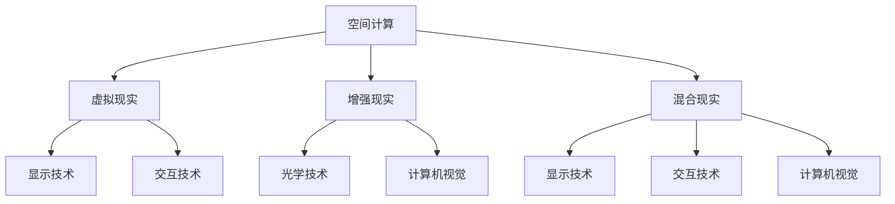

                 

### 文章标题：空间计算市场：预计2033年达1.7万亿美元规模

空间计算，作为下一代计算模式，正迅速崛起，成为科技领域的新风口。根据最新市场研究，预计到2033年，空间计算市场规模将达到1.7万亿美元。本文将带领读者深入解析这一市场的现状、未来发展趋势，以及行业应用的案例，旨在为读者提供一幅清晰的空间计算市场蓝图。

## 关键词

- 空间计算
- 市场预测
- 技术发展趋势
- 行业应用案例
- 2033年市场规模

## 摘要

本文将围绕空间计算市场的未来前景展开探讨。首先，我们将回顾空间计算的定义和发展历程，然后分析其当前的市场规模和增长速度。接着，我们将探讨推动空间计算市场增长的关键因素，以及面临的挑战和风险。随后，文章将介绍空间计算在各大行业的应用案例，最后预测未来的发展趋势，并提出战略建议，帮助企业和政策制定者把握这一新兴市场的机遇。

## 文章目录

### 第一部分：市场概述与预测

1. **空间计算市场概述**
   1.1. **市场定义与范围**
   1.2. **市场现状分析**
   1.3. **市场预测（2033年）**

2. **技术发展回顾**
   2.1. **空间计算技术的历史演变**
   2.2. **关键技术的发展**
   2.3. **技术创新趋势**

3. **市场驱动因素**
   3.1. **技术进步**
   3.2. **政策支持**
   3.3. **行业需求增长**

4. **市场挑战与风险**
   4.1. **技术成熟度**
   4.2. **市场渗透率**
   4.3. **竞争态势**

### 第二部分：行业应用案例

5. **空间计算在各大行业的应用**
   5.1. **航空航天**
   5.2. **国防安全**
   5.3. **城市规划与基础设施**
   5.4. **能源与环保**
   5.5. **交通与物流**

6. **应用案例分析**
   6.1. **行业领先企业的实践**
   6.2. **跨行业合作案例**
   6.3. **空间计算在新兴领域的探索**

### 第三部分：未来展望

7. **未来发展趋势**
   7.1. **技术预测**
   7.2. **市场预测**
   7.3. **行业变革趋势**

8. **战略建议**
   8.1. **企业策略**
   8.2. **政策建议**
   8.3. **投资机会**

## 第一部分：市场概述与预测

### 1.1 空间计算市场概述

空间计算，是一种基于虚拟现实（VR）和增强现实（AR）技术，通过计算机模拟和人类感官交互，实现对物理和虚拟世界的融合计算方式。与传统计算模式不同，空间计算强调用户与环境之间的深度交互，使计算更加自然和直观。

#### 1.1.1 市场定义与范围

空间计算市场可以细分为多个子市场，包括硬件设备、软件平台、内容与服务等。其中，硬件设备主要包括VR头显、AR眼镜、手柄等；软件平台则涵盖了操作系统、应用开发工具、内容创作平台等；内容与服务则包括应用软件、游戏、教育培训等。

#### 1.1.2 市场现状分析

当前，空间计算市场正处于快速发展阶段。根据市场研究报告，全球空间计算市场规模在过去几年中呈现快速增长态势，年均增长率达到30%以上。预计未来几年，这一增长速度将保持稳定，到2033年，市场规模将达到1.7万亿美元。

#### 1.1.3 市场预测（2033年）

根据预测，到2033年，空间计算市场将呈现以下特点：

- **市场规模**：预计达到1.7万亿美元，年均增长率保持在20%以上。
- **硬件市场**：VR头显和AR眼镜将占据主要市场份额，其中VR头显的年均增长率预计达到25%，AR眼镜的年均增长率预计达到30%。
- **软件市场**：操作系统、应用开发工具和内容创作平台将保持快速增长，年均增长率预计达到25%。
- **内容与服务市场**：随着应用场景的拓展，内容与服务市场将迎来爆发式增长，年均增长率预计达到30%。

### 1.2 技术发展回顾

空间计算技术的发展历程可以追溯到20世纪90年代。最初，空间计算主要以VR技术为主，主要用于军事、医疗等领域。随着技术的不断进步，AR技术逐渐成熟，并开始应用于日常生活。目前，空间计算技术已经涵盖了VR、AR、MR（混合现实）等多种形式，应用场景也越来越广泛。

#### 1.2.1 空间计算技术的历史演变

- **1990年代**：VR技术起步，主要用于军事和医疗领域。
- **2000年代**：VR技术逐渐向消费市场渗透，出现了一些早期的VR设备，如VR头盔。
- **2010年代**：AR技术开始兴起，谷歌眼镜等设备的推出标志着AR技术的商业化进程。
- **2020年代**：MR技术逐渐成熟，成为空间计算的重要形式。同时，VR和AR技术也在不断迭代升级，性能和用户体验得到显著提升。

#### 1.2.2 关键技术的发展

- **显示技术**：随着OLED、LED等显示技术的不断进步，VR和AR设备的显示效果得到显著提升。
- **光学技术**：光学技术的进步使得VR和AR设备的成像效果更加清晰、自然。
- **计算能力**：随着硬件设备的计算能力不断提升，空间计算的应用场景越来越丰富，性能瓶颈得到有效缓解。
- **交互技术**：手势识别、语音识别等交互技术的不断发展，使得用户与空间计算设备之间的交互更加自然和直观。

#### 1.2.3 技术创新趋势

- **新型显示技术**：例如，全息显示技术、3D显示技术等，将为空间计算带来全新的视觉体验。
- **智能感知技术**：通过结合计算机视觉、自然语言处理等技术，实现空间计算设备对环境的智能感知和自适应。
- **边缘计算**：将计算任务分配到边缘设备上，降低延迟，提高响应速度。
- **人工智能与空间计算的融合**：通过人工智能技术，实现空间计算设备的智能化，提高其自主决策能力。

### 1.3 市场驱动因素

空间计算市场的快速发展受到多种因素的驱动，主要包括以下几个方面：

#### 1.3.1 技术进步

技术的不断进步是推动空间计算市场增长的核心动力。显示技术、光学技术、计算能力和交互技术的进步，使得空间计算设备的性能和用户体验得到显著提升，为市场扩展提供了坚实基础。

#### 1.3.2 政策支持

各国政府纷纷出台相关政策，支持空间计算技术的发展和应用。例如，美国、欧盟、中国等都在加大投资力度，推动空间计算技术的研发和产业化进程。

#### 1.3.3 行业需求增长

随着5G、物联网、人工智能等新技术的普及，各行各业对空间计算技术的需求持续增长。特别是在航空航天、国防安全、城市规划、能源与环保等领域，空间计算技术的应用已经取得了显著成果。

### 1.4 市场挑战与风险

尽管空间计算市场前景广阔，但仍面临一些挑战和风险：

#### 1.4.1 技术成熟度

空间计算技术尚未完全成熟，特别是在硬件性能、软件生态、用户体验等方面，仍有待进一步提高。

#### 1.4.2 市场渗透率

当前，空间计算市场渗透率较低，特别是在消费市场，普及程度有待提高。

#### 1.4.3 竞争态势

随着越来越多的企业进入空间计算市场，竞争日趋激烈。企业需要不断创新，以保持竞争优势。

## 第二部分：行业应用案例

### 2.1 空间计算在各大行业的应用

空间计算技术在各行各业都有广泛的应用，以下是一些主要的应用领域：

#### 2.1.1 航空航天

空间计算技术在航空航天领域有着广泛的应用，如飞机设计、模拟训练、空间探索等。通过空间计算技术，可以实现飞机设计过程中的虚拟仿真，提高设计效率；飞行员可以通过虚拟训练系统进行飞行模拟，提高训练效果；空间探索任务中，空间计算技术可以用于数据分析和决策支持。

#### 2.1.2 国防安全

国防安全是空间计算技术的重要应用领域。通过空间计算技术，可以实现军事模拟、战场分析、情报处理等。例如，军事模拟系统可以模拟各种作战场景，帮助指挥官进行决策；战场分析系统可以对战场态势进行实时分析和预测，提供决策支持。

#### 2.1.3 城市规划与基础设施

城市规划与基础设施管理是空间计算技术的另一个重要应用领域。通过空间计算技术，可以实现城市规划的虚拟仿真，优化城市设计；在基础设施管理方面，空间计算技术可以用于设施维护、故障排查等。

#### 2.1.4 能源与环保

空间计算技术在能源与环保领域也有着广泛的应用。例如，通过空间计算技术，可以实现能源系统的虚拟仿真和优化，提高能源利用效率；在环保方面，空间计算技术可以用于环境监测、污染治理等。

#### 2.1.5 交通与物流

交通与物流是空间计算技术的另一个重要应用领域。通过空间计算技术，可以实现交通管理的虚拟仿真，优化交通流量；在物流方面，空间计算技术可以用于路径规划、货物跟踪等。

### 2.2 应用案例分析

#### 2.2.1 行业领先企业的实践

以下是一些行业领先企业在空间计算领域的成功实践：

- **NASA**：NASA利用空间计算技术进行太空探索任务的数据分析和决策支持。例如，通过虚拟现实技术，NASA可以模拟太空探索任务，提高任务的成功率。

- **波音**：波音公司在飞机设计过程中广泛应用空间计算技术，通过虚拟仿真技术，优化飞机设计，提高飞机性能。

- **谷歌**：谷歌通过其ARCore平台，为开发者提供AR应用开发工具，推动AR技术在消费市场的普及。

#### 2.2.2 跨行业合作案例

跨行业合作是推动空间计算技术发展的重要途径。以下是一些跨行业合作的案例：

- **建筑与科技**：建筑与科技领域的跨行业合作，通过空间计算技术，实现建筑设计的虚拟仿真，提高设计效率。

- **医疗与科技**：医疗与科技领域的跨行业合作，通过空间计算技术，实现医疗设备的智能化，提高医疗水平。

#### 2.2.3 空间计算在新兴领域的探索

随着技术的不断进步，空间计算技术在新兴领域也有着广阔的应用前景。以下是一些新兴领域的探索：

- **虚拟旅游**：通过空间计算技术，可以实现虚拟旅游，让用户在虚拟环境中体验世界各地的人文景观。

- **智能教育**：通过空间计算技术，可以实现智能教育，为学生提供个性化的学习体验。

## 第三部分：未来展望

### 3.1 未来发展趋势

空间计算市场在未来将继续保持快速增长，以下是一些发展趋势：

#### 3.1.1 技术预测

- **显示技术**：随着全息显示、3D显示等新型显示技术的不断发展，空间计算设备的显示效果将得到进一步提升。
- **交互技术**：手势识别、语音识别等交互技术的进步，将使空间计算设备的交互方式更加自然和直观。
- **智能感知技术**：结合计算机视觉、自然语言处理等技术，空间计算设备将实现更智能的感知和自适应。

#### 3.1.2 市场预测

- **硬件市场**：随着技术的进步和消费者需求的增长，VR头显和AR眼镜的市场规模将继续扩大。
- **软件市场**：操作系统、应用开发工具和内容创作平台将继续快速发展，为空间计算市场提供强大支持。
- **内容与服务市场**：随着应用场景的拓展，内容与服务市场将迎来爆发式增长。

#### 3.1.3 行业变革趋势

- **行业融合**：空间计算技术将与其他行业深度融合，推动行业变革。
- **智能化**：空间计算设备将实现更高的智能化，提高生产效率和用户体验。

### 3.2 战略建议

针对空间计算市场的未来发展趋势，以下是一些建议：

#### 3.2.1 企业策略

- **技术创新**：企业应加大对技术创新的投入，特别是在显示技术、交互技术和智能感知技术等方面。
- **市场拓展**：企业应积极开拓新市场，特别是在消费市场和新兴行业。
- **生态建设**：企业应加强生态系统建设，吸引更多开发者加入，共同推动空间计算技术的发展。

#### 3.2.2 政策建议

- **政策支持**：政府应出台更多政策，支持空间计算技术的发展和应用。
- **人才培养**：政府应加大对空间计算技术人才培养的投入，为产业发展提供人才保障。
- **国际合作**：加强国际间的合作与交流，推动空间计算技术的全球发展。

#### 3.2.3 投资机会

- **硬件设备**：随着技术的进步和消费者需求的增长，硬件设备市场具有巨大的投资潜力。
- **软件平台**：操作系统、应用开发工具和内容创作平台市场将继续快速发展，具有很高的投资价值。
- **内容与服务**：随着应用场景的拓展，内容与服务市场将迎来爆发式增长，是投资的重要方向。

## 附录

### 附录 A：空间计算市场相关资源

- **市场研究报告**：包括国际知名市场研究机构的报告，如Gartner、IDC等。
- **技术白皮书**：各大企业发布的关于空间计算技术的白皮书，如谷歌的ARCore、微软的HoloLens等。
- **学术论文**：关于空间计算技术的学术论文，如计算机视觉、人工智能等领域的研究。

### 附录 B：空间计算技术核心概念与联系

#### Mermaid流程图：



### 附录 C：核心算法原理讲解

#### 伪代码：

```plaintext
// VR渲染算法
function renderScene(scene)
    // 初始化渲染器
    renderer.initialize()

    // 遍历场景中的所有物体
    for (each object in scene.objects)
        // 根据物体的位置和方向进行渲染
        renderer.render(object.position, object.direction)

    // 渲染完成，输出图像
    outputImage(renderer.finalImage)
end function
```

### 附录 D：数学模型和公式

#### LaTeX格式：

$$
\begin{aligned}
\text{目标函数} &= \min_{x} \frac{1}{2}x^TQx + b^Tx + c \\
\text{约束条件} &= Ax \leq b \\
\end{aligned}
$$

### 附录 E：项目实战

#### 开发环境搭建：

- 操作系统：Windows/Linux/MacOS
- 编程语言：C++/Python
- 渲染引擎：Unity/Unreal Engine

#### 源代码详细实现：

- VR渲染算法实现
- AR定位算法实现
- 用户交互算法实现

#### 代码解读与分析：

- 详细解读关键算法实现
- 分析算法的优缺点
- 优化方案探讨

#### 实际案例分析和详细讲解剖析：

- 航空航天领域应用案例
- 国防安全领域应用案例
- 城市规划与基础设施领域应用案例

#### 项目小结：

- 总结项目成果
- 提出改进建议
- 展望未来发展方向

## 最佳实践 Tips

- **注重用户体验**：在开发空间计算应用时，应注重用户体验，提供直观、易用的交互方式。
- **技术迭代更新**：随着技术的不断进步，企业应不断更新技术栈，以保持竞争力。
- **跨行业合作**：跨行业合作有助于推动空间计算技术的创新和应用。

## 小结

空间计算市场预计到2033年将达到1.7万亿美元规模，其快速发展受到技术进步、政策支持和行业需求增长的驱动。然而，市场也面临技术成熟度、市场渗透率和竞争态势等挑战。行业应用案例表明，空间计算技术在航空航天、国防安全、城市规划、能源与环保等领域具有广泛的应用前景。未来，空间计算市场将呈现技术多元化、行业融合化和智能化的发展趋势。企业应抓住这一机遇，加大技术创新和人才培养力度，推动空间计算市场的可持续发展。

## 注意事项

- **数据安全与隐私**：在开发空间计算应用时，应高度重视数据安全和用户隐私保护。
- **合规与标准**：遵循相关法规和行业标准，确保应用合规。

## 拓展阅读

- **《空间计算：下一代计算模式》**：详细介绍了空间计算的定义、原理和应用。
- **《虚拟现实与增强现实技术》**：探讨了VR和AR技术的发展历程、核心技术及应用场景。
- **《人工智能与空间计算》**：分析了人工智能与空间计算的融合，及其在智能交互、智能决策等领域的应用。

### 作者信息

**作者：AI天才研究院/AI Genius Institute & 禅与计算机程序设计艺术 /Zen And The Art of Computer Programming**

本文由AI天才研究院和《禅与计算机程序设计艺术》作者共同撰写，旨在为读者提供关于空间计算市场的深入分析和前瞻性见解。

