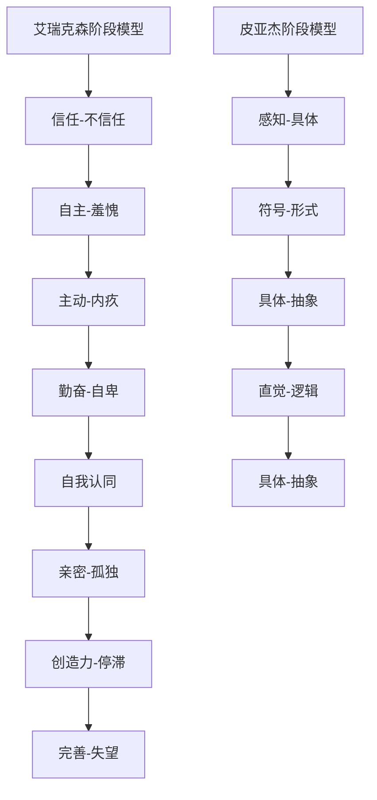
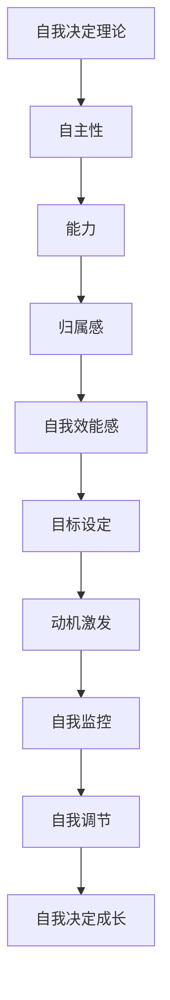
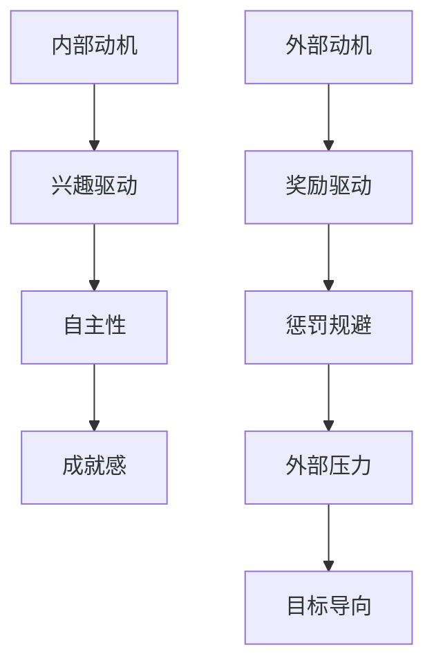
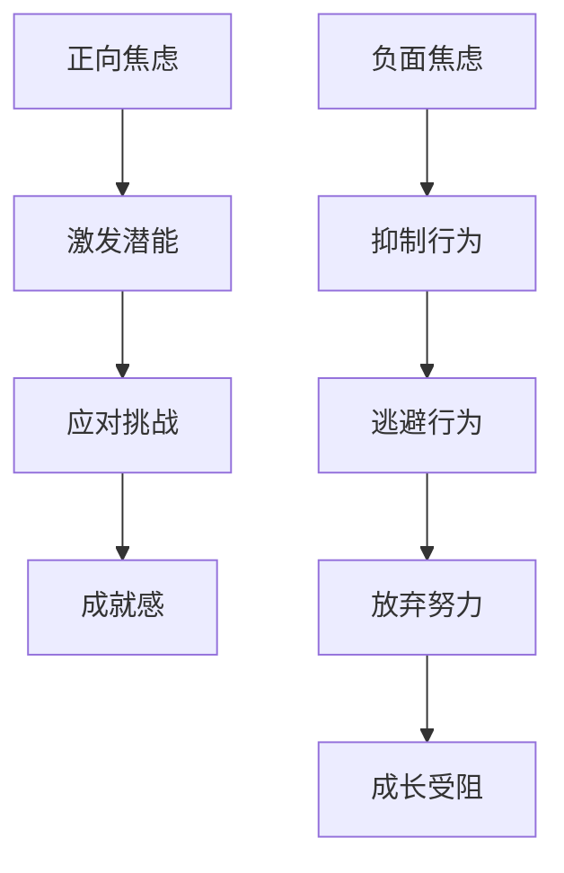

                 

### 引言：个人成长的重要性与舒适区的挑战

在信息技术日新月异的今天，个人成长已经成为每一个专业人士追求的目标。无论是在职场中提升自己的专业技能，还是在生活中不断丰富自己的知识体系，成长都是不可或缺的。而在这其中，如何突破舒适区，通过持续挑战实现个人成长，成为了一个关键的问题。

**什么是舒适区？** 舒适区（Comfort Zone）指的是个体习惯性的行为模式和生活环境，这个区域内的活动让人感到安全和熟悉，不需要面对任何新的挑战和压力。虽然舒适区能够提供暂时的安全感，但长期停留在这个区域会限制个人的发展和进步。

**成长的重要性** 个人成长不仅意味着知识和技能的积累，更是心理素质和认知能力的提升。在不断变化的世界中，只有不断成长，才能保持竞争力，适应新的环境，实现人生的目标。

**挑战与个人成长的联系** 挑战是成长的外在动力，通过面对新的挑战，个体能够突破舒适区，拓展自己的能力和视野。挑战可以是学习新的技能、解决复杂的问题、面对未知的情境等，它们都是促使个人成长的有效途径。

**本文目的** 本文旨在探讨如何通过持续挑战来突破舒适区，实现个人成长。我们将从理论层面分析成长的心理学原理，到实践层面探讨挑战的策略与方法，再到成功案例的分享，全面覆盖个人成长和挑战舒适区的方方面面。

通过本文的阅读，读者将了解到：

1. **成长的心理学原理**：了解成长动机、成长与焦虑的关系等，从而明确个人成长的内在动力。
2. **挑战的必要性**：认识到持续挑战对个人成长的重要性，学会识别和利用成长的机会。
3. **挑战策略与实践**：掌握制定挑战计划、克服恐惧、管理时间和资源等实际操作方法。
4. **持续反馈与调整**：了解反馈的重要性，学会如何获取和利用反馈来推动个人成长。

### 关键词

- 个人成长
- 舒适区
- 持续挑战
- 心理学原理
- 成长动机
- 焦虑管理
- 挑战计划
- 时间管理
- 资源配置
- 反馈与调整

### 摘要

本文将探讨如何在现代信息技术环境中通过持续挑战来突破个人舒适区，实现个人成长。首先，我们从心理学原理出发，分析成长的内在动机和焦虑管理。接着，探讨持续挑战的必要性及其对个人成长的推动作用。然后，通过详细阐述制定挑战计划、克服恐惧、管理时间和资源等策略，提供实践指导。最后，通过成功案例分享和总结，为读者提供实用的成长方法论，帮助他们在面对挑战时能够持续成长，实现人生目标。

### 背景介绍：成长与舒适区的概念

在深入探讨如何通过持续挑战实现个人成长之前，有必要首先明确两个核心概念：成长和舒适区。

**成长** 个人成长是一个复杂而多维的过程，它不仅仅包括知识和技能的积累，还涉及到心理素质、认知能力和社会技能的提升。在信息技术领域，成长意味着不断学习新的编程语言、框架和工具，掌握更高效的问题解决方法，以及更新知识库以适应快速变化的技术环境。此外，成长还包括提升个人领导力、沟通能力和团队合作精神，这些软技能在职场中同样至关重要。

**舒适区** 舒适区是一个心理学概念，指的是个体习惯性的行为模式和生活环境，这个区域内的活动让人感到安全和熟悉，不需要面对任何新的挑战和压力。例如，一个程序员可能习惯于使用某种编程语言进行日常开发，而不愿意尝试学习新的编程语言或工具，因为改变意味着需要付出额外的学习成本和面对未知的挑战。在这种情况下，舒适区提供了暂时的安全感，但长期停留在这个区域会限制个人的发展和进步。

**舒适区的负面影响** 长期停留在舒适区内，个体可能会面临以下几个负面影响：

1. **技能固化**：由于不接触新的挑战，个人的技能和知识可能会逐渐固化，无法适应快速变化的环境。
2. **认知局限**：舒适区的限制使得个体难以接受新的观点和思维方式，限制了认知能力的拓展。
3. **缺乏动力**：舒适区内的活动往往缺乏新鲜感，容易导致个体产生懈怠情绪，缺乏成长动力。
4. **竞争力下降**：在竞争激烈的职场环境中，不成长意味着竞争力会逐渐下降，难以应对新的职业挑战。

**成长的重要性** 成长不仅是为了适应变化，更是为了实现个人潜力。在信息技术领域，随着技术的迅猛发展，只有不断学习和进步，才能跟上时代的步伐，保持竞争力。此外，个人成长还能带来以下几方面的好处：

1. **知识积累**：通过学习新的知识和技能，个体能够不断提升自己的专业水平，成为领域内的专家。
2. **认知拓展**：面对新的挑战，个体需要不断拓展自己的认知边界，从而提高解决问题的能力。
3. **心理素质提升**：通过克服挑战和困难，个体能够增强自信心，提升抗压能力和适应能力。
4. **职业发展**：个人成长能够为职业发展提供更多的机会，提高在职场中的竞争力和升职空间。

综上所述，成长和舒适区是个人发展中不可忽视的两个方面。通过明确成长的概念和重要性，以及认识到舒适区的负面影响，我们可以更好地理解如何通过持续挑战来实现个人成长，从而在信息技术领域中不断进步，迎接未来的挑战。

### 核心概念与联系：成长的心理学原理

在探讨如何通过持续挑战实现个人成长时，了解成长的心理学原理至关重要。这些原理不仅为我们提供了理论基础，还能帮助我们更有效地应对挑战，推动个人成长。以下是几个关键的心理学术语及其关系架构。

#### 心理发展的阶段理论

**艾瑞克森的心理社会发展阶段模型** 艾瑞克森提出了心理社会发展阶段模型，将人的成长分为八个阶段，每个阶段都有特定的成长任务和危机。以下是模型的简化版本：

1. **婴儿期（0-1岁）**：成长任务是建立信任感，危机是信任与不信任。
2. **幼儿期（1-3岁）**：成长任务是自主性，危机是自主与羞愧。
3. **学龄前期（3-6岁）**：成长任务是主动与内疚，危机是主动与内疚。
4. **学龄期（6-12岁）**：成长任务是勤奋与自卑，危机是勤奋与自卑。
5. **青年期（12-18岁）**：成长任务是自我认同，危机是角色混乱。
6. **成年早期（18-40岁）**：成长任务是亲密与孤独，危机是亲密与孤独。
7. **成年中期（40-65岁）**：成长任务是创造力与停滞，危机是创造力与停滞。
8. **成年晚期（65岁以上）**：成长任务是完善与失望，危机是完善与失望。

**皮亚杰的认知发展理论** 皮亚杰提出了认知发展的阶段模型，认为个体的认知发展分为四个主要阶段：

1. **感知运动阶段（0-2岁）**：个体通过感知和运动来理解世界。
2. **前运算阶段（2-7岁）**：个体开始使用符号，但思维仍然是直觉性的。
3. **具体运算阶段（7-11岁）**：个体能够进行逻辑思维，但仍需要具体事物的支持。
4. **形式运算阶段（11岁以上）**：个体能够进行抽象思维，逻辑推理能力达到顶峰。

**关系架构（Mermaid流程图）**

#### 自我决定理论

**自我决定理论** 由心理学家瑞恩和德西提出，强调个体的自主性、能力和关系在成长中的重要性。该理论认为，个体在追求成长时，需要满足三个基本心理需求：自主性、能力和归属感。

1. **自主性**：个体需要自由选择和掌控自己的行为，实现自我目标。
2. **能力**：个体需要感到自己有能力应对挑战，完成任务。
3. **归属感**：个体需要与他人建立积极的关系，获得社会支持。

**关系架构（Mermaid流程图）**

#### 成长动机

**内部动机** 与 **外部动机**

内部动机是指个体因对活动本身感兴趣而参与其中，如对学习、创作和探索的热爱。外部动机则是指个体因外部奖励或惩罚而参与活动，如为了获得好成绩或避免惩罚。

**关系架构（Mermaid流程图）**

#### 成长与焦虑的关系

**正向焦虑** 指适当的焦虑可以激发个体的潜能，促进成长。这种焦虑是健康的，有助于个体面对挑战。

**负面焦虑** 指过度的焦虑，它会抑制个体的行为，阻碍成长。负面焦虑可能会导致逃避行为或放弃努力。

**关系架构（Mermaid流程图）**

通过上述核心概念及其关系的详细解释和Mermaid流程图的展示，我们可以更好地理解个人成长的心理学原理。这些原理不仅帮助我们识别和应对成长中的各种挑战，还为我们提供了实用的方法和策略，以实现持续的个人成长。

### 成长动机分析：内部动机与外部动机

在探讨个人成长时，成长动机是一个关键因素。动机不仅驱动个体采取行动，还决定了个体在面对挑战时的坚持程度和成果。根据心理学的研究，动机主要分为内部动机和外部动机。

**内部动机** 是指个体因对活动本身感兴趣而参与其中。这种动机来源于个体的内在需求和兴趣，而不是外在的奖励或惩罚。例如，一个程序员可能会因为对编程的热爱而自发地学习新的编程语言或框架，而不依赖于任何外部奖励。内部动机的特点是持久和自发，能够激发个体深层次的学习和创造。

**内部动机的例子**：
- **学习新技能**：因为对技术本身感兴趣，而不是为了通过考试或获得奖金。
- **解决问题**：在面对复杂问题时，个体会感到兴奋和满足，因为他们享受解决问题的过程。
- **创作**：对于艺术家或作家来说，创作本身就是一种乐趣，而不是为了商业成功或社会认可。

**外部动机** 是指个体因外部奖励或惩罚而参与活动。这种动机来源于外部环境的要求或激励，如金钱奖励、社会认可或避免惩罚。例如，一个程序员可能因为项目奖金或领导的认可而努力工作，而不是因为他对编程本身有热情。

**外部动机的例子**：
- **奖金**：为了获得年终奖或绩效奖金而努力工作。
- **职业发展**：为了晋升或获得更好的工作机会而不断提升自己的技能。
- **避免惩罚**：为了避免被解雇或批评，个体会努力完成任务。

**内部动机与外部动机的比较**

- **持久性**：内部动机往往比外部动机更持久。当外部奖励消失时，外部动机可能会减弱或消失，而内部动机仍能驱动个体继续努力。
- **自主性**：内部动机更多地体现个体的自主性，外部动机则受到外部环境的影响。
- **成就感**：内部动机的成就感更多来源于活动本身，外部动机的成就感则更多地依赖于外部评价。

**如何激发和维持内部动机？**

1. **找到内在兴趣**：明确自己真正热爱的事物，并围绕这些兴趣设定目标。
2. **设定有挑战性的目标**：适度的挑战能够激发内部动机，但目标不能过于艰难，以免导致挫败感。
3. **自主控制**：允许个体自主选择如何完成任务，增加他们的控制感。
4. **内在反馈**：通过自我评价和反思，个体能够更好地理解自己的进步，从而维持内部动机。

**如何利用外部动机？**

1. **明确外部奖励**：设定清晰的外部奖励机制，激励个体为实现目标而努力。
2. **短期目标**：利用外部动机来达成短期目标，然后再通过内部动机推动长期成长。
3. **社会认可**：通过他人的认可和鼓励，增强外部动机。

**实际应用**：在一个软件开发项目中，团队可以通过设定明确的绩效奖金来激励成员完成关键任务。同时，通过项目反馈会鼓励团队成员分享他们的学习经历和成长，从而激发内部动机。这样，团队成员在享受外部奖励的同时，也能够获得内在的成长和满足。

通过深入分析内部动机和外部动机，我们可以更好地理解它们在个人成长中的作用。了解如何激发和利用这两种动机，可以帮助我们更有效地推动个人成长，实现自己的目标。

### 成长与焦虑的关系：正向焦虑与负面焦虑

在探讨个人成长的过程中，焦虑是一个不可忽视的因素。适度的焦虑可以激发个体的潜能，促进成长，而过度的焦虑则会阻碍个人的发展。心理学家将焦虑分为正向焦虑和负面焦虑，分别分析它们在成长中的影响。

**正向焦虑** 是一种积极的、有助于成长的心理状态。正向焦虑通常表现为适度的紧张和兴奋，这种焦虑能够激发个体的潜能，增加他们对挑战的关注和投入。正向焦虑能够带来以下几个方面的好处：

1. **激发潜能**：适度的焦虑可以激发个体的潜能，使他们在面对挑战时能够发挥出更高的水平。例如，当程序员面对一个复杂的项目时，适度的紧张感可以促使他们集中注意力，快速找到解决方案。

2. **增加专注力**：正向焦虑有助于提高个体的专注力，使他们能够更加集中精力完成任务。这种专注力不仅有助于提高工作效率，还能帮助个体在短时间内解决问题。

3. **增强动力**：适度的焦虑可以增加个体的动力，使他们更有决心去实现目标。例如，在考试前感到紧张的学生可能会更加努力地复习，从而提高考试成绩。

**正向焦虑的例子**：
- **考试前的紧张感**：适度的紧张感可以激发学生的潜力，使他们在考试中发挥出更好的水平。
- **演讲前的紧张**：演讲者通过适度的紧张来保持紧张感，从而提高演讲的效果。
- **工作任务的紧迫感**：面对紧迫的任务，程序员可能会更加专注和高效地解决问题。

**负面焦虑** 则是一种消极的、有害的心理状态。负面焦虑通常表现为过度的紧张和担忧，这种焦虑会抑制个体的行为，阻碍他们的成长。负面焦虑可能带来以下几个方面的负面影响：

1. **抑制行为**：过度的焦虑会抑制个体的行为，使他们无法正常发挥。例如，一个程序员可能会因为担心项目失败而迟迟不敢开始编程，导致项目进度延误。

2. **影响健康**：长期的负面焦虑会对个体的身心健康产生负面影响，如失眠、焦虑症等。

3. **导致逃避行为**：负面焦虑可能导致个体逃避挑战，放弃成长的机会。例如，一个学生可能会因为考试焦虑而选择放弃考试，从而错失提升自己的机会。

**负面焦虑的例子**：
- **考试前的过度紧张**：过度的紧张可能导致学生出现失眠、头痛等生理反应，甚至放弃考试。
- **公开演讲的恐惧**：过度的恐惧可能导致演讲者无法正常表达，甚至放弃演讲机会。
- **面对未知的挑战**：过度的焦虑可能导致个体在面对新挑战时选择逃避，从而错失成长的机会。

**如何管理焦虑**：

1. **认知重构**：通过改变对事物的看法，减少负面思维。例如，将“我必须完美”改为“我可以尽力而为”。
2. **呼吸训练**：通过深呼吸来放松身体，减轻焦虑感。
3. **放松训练**：通过瑜伽、冥想等方式来放松身心，减轻焦虑。
4. **积极面对**：勇敢面对挑战，相信自己的能力，减少对失败的恐惧。

**实际应用**：在一个软件项目中，项目经理可能会适当地增加任务的紧迫感，以激发团队成员的正向焦虑，从而提高工作效率。例如，设置一个近期的交付日期，并明确任务的优先级，促使团队成员集中精力完成任务。然而，如果项目经理过于强调任务的紧迫性，导致团队成员感到过度焦虑，可能会产生负面效果，影响项目质量。

通过理解正向焦虑和负面焦虑在成长中的作用，我们可以更好地管理自己的焦虑水平，使其成为促进个人成长的积极力量。适度的焦虑能够激发我们的潜能，帮助我们克服挑战，实现个人成长；而过度的焦虑则可能阻碍我们的进步，因此我们需要学会有效地管理焦虑，以实现最佳的成长效果。

### 持续挑战的必要性

持续挑战是个人成长的核心驱动力，它能够激发个体的潜能，促进技能提升和认知拓展。在快速变化的信息技术领域，持续挑战不仅有助于跟上技术发展的步伐，还能提升个体的适应能力和竞争力。以下是持续挑战对个人成长的重要作用。

**持续挑战与技能提升**

持续挑战能够促使个体不断提升自己的技能水平。通过面对新的任务和项目，个体需要不断学习新的知识和技能，以应对不断变化的挑战。这种学习过程不仅包括技术层面的提升，还包括软技能的拓展，如沟通能力、团队合作能力和解决问题的能力。

**案例**：一个软件开发工程师在刚开始工作的时候，可能只会使用一种编程语言。但随着职业生涯的发展，他需要学习更多的编程语言、框架和工具。例如，从最初的Java和Python扩展到JavaScript和Go语言。这种持续的挑战和学习过程，使得工程师的技能水平不断提升，能够胜任更加复杂和高级的项目。

**持续挑战与认知拓展**

持续挑战不仅有助于技能提升，还能拓展个体的认知能力。面对新的挑战，个体需要不断地思考、分析和解决问题，这有助于他们拓展思维边界，提高逻辑思维和创新能力。

**案例**：一个数据科学家在处理一个复杂的数据分析项目时，需要运用统计学、机器学习和数据可视化等多方面的知识。通过这个过程，数据科学家不仅提高了自己的技术能力，还学会了如何将不同领域的知识结合起来，解决实际问题。

**如何识别成长的机会**

识别成长的机会是持续挑战的关键。以下是一些方法可以帮助个体识别和利用成长的机会：

1. **设定具体目标**：明确自己的成长目标，有助于个体识别需要提升的技能和知识领域。
2. **主动寻求反馈**：通过向同事、导师或专家寻求反馈，个体可以了解自己的不足之处，并找到改进的方向。
3. **关注行业趋势**：了解当前行业的发展趋势和新技术，可以帮助个体识别潜在的成长机会。
4. **积极参与项目**：积极参与公司内外部的项目，尤其是那些具有挑战性的项目，有助于个体拓展自己的能力。

**如何利用成长机会**

1. **制定学习计划**：根据识别到的成长机会，制定详细的学习计划，包括学习内容、时间安排和资源准备。
2. **实践与反思**：通过实际操作和项目实践，个体可以将所学知识应用到实际中，并通过反思不断提升自己的能力。
3. **持续反馈与调整**：在学习和实践过程中，及时获取反馈，并根据反馈调整学习计划和实践方法。

**持续挑战的重要性**

持续挑战不仅能够推动个人成长，还能提升个体的适应能力和竞争力。在信息技术领域，技术发展日新月异，只有不断学习和进步，才能保持竞争力。此外，持续挑战还能够增强个体的自信心和抗压能力，使其在面对未知和变化时更加从容。

**结论**

通过持续挑战，个体能够不断提升自己的技能和认知能力，拓展自己的思维边界。识别和利用成长的机会，制定有效的学习计划，并在实践中不断反思和调整，是实现个人成长的关键。在快速变化的信息技术领域，持续挑战是推动个人成长的重要力量，它不仅有助于个体跟上时代的步伐，还能提升他们的综合素质和竞争力。

### 如何制定挑战计划

要实现持续成长，制定一个有效的挑战计划至关重要。一个明确的计划能够帮助个体有条不紊地面对新的挑战，确保每一个成长目标都能得到落实。以下是制定挑战计划的步骤和方法。

#### 第一步：设定明确的目标

明确的目标是挑战计划的基础。设定目标时，需要遵循以下原则：

1. **具体性**：目标要具体、明确，而不是模糊的。例如，"提高编程技能"不如"学习并掌握Python编程语言"具体。
2. **可测量性**：目标需要具备可测量性，以便跟踪进度。例如，"掌握Python编程语言"可以转化为"在3个月内通过Python编程语言的能力测试"。
3. **实现性**：目标要具有可实现性，避免设定过高或不切实际的目标。例如，"一年内成为顶尖程序员"可能过于理想化。
4. **时限性**：为每一个目标设定明确的完成时限，有助于保持动力和进度。

**例子**：如果目标是学习Python编程语言，可以将目标设定为：
- 在接下来的3个月内完成Python基础课程的学习。
- 在接下来的6个月内完成一个实际项目，应用所学的Python知识。

#### 第二步：制定具体的行动计划

一旦目标明确，下一步是制定具体的行动计划。以下是一些关键点：

1. **分解目标**：将大目标分解为小步骤，每个步骤都是一个具体的行动。例如，将学习Python的目标分解为：学习基本语法、数据类型、流程控制等。
2. **资源准备**：准备所需的资源，包括书籍、在线课程、工具等。例如，可以购买一本Python入门书籍，报名一个在线Python课程，并安装Python开发环境。
3. **时间规划**：为每一个行动设定具体的时间，确保有足够的时间来完成。例如，每天分配1小时的时间来学习Python。
4. **优先级排序**：根据目标的优先级排序，确保最重要的行动得到优先处理。

**例子**：制定一个学习Python的行动计划：
- **步骤1**：每周完成一个Python基础语法模块的学习。
- **步骤2**：每两周完成一个小项目，如编写一个简单的计算器程序。
- **步骤3**：每个月进行一次自我评估，检查进度并调整计划。

#### 第三步：实施与跟踪

实施行动计划是实现目标的关键。以下是一些实施与跟踪的建议：

1. **坚持执行**：按照计划执行每一个行动，保持持续性和一致性。例如，每天坚持学习1小时Python。
2. **记录进度**：记录每天的学习进度和成果，这有助于跟踪进展并保持动力。例如，在日记中记录每天的学习内容和完成情况。
3. **定期评估**：定期评估计划的执行情况，并根据实际情况进行调整。例如，每两周进行一次评估，检查是否达到了预定目标，并根据需要调整后续计划。
4. **寻求反馈**：向导师、同事或朋友寻求反馈，了解自己的进步和需要改进的地方。例如，可以定期与导师讨论学习进度，获取专业指导。

**例子**：在执行学习Python的计划过程中：
- **坚持执行**：每天晚上7点到8点进行Python学习，不受外界干扰。
- **记录进度**：在每周日的晚上，回顾一周的学习内容，记录在笔记本上，并总结经验教训。
- **定期评估**：每月底进行一次全面评估，检查是否完成了所有的小项目，并根据评估结果调整下个月的学习计划。
- **寻求反馈**：每月与导师进行一次面对面交流，讨论学习进度，获取指导和建议。

通过以上步骤，个体可以制定并实施一个有效的挑战计划，确保在新的挑战中能够持续成长。明确的计划、具体的行动、坚持的执行和定期的评估，都是实现成长目标的关键。

### 实践挑战的技巧：克服恐惧

在实现个人成长的过程中，克服恐惧是至关重要的一步。恐惧不仅会阻碍我们面对挑战，还会抑制我们的潜力和创造力。以下是一些实用的技巧，帮助我们克服恐惧，更好地迎接挑战。

#### **技巧一：认知行为疗法（CBT）**

认知行为疗法是一种心理治疗方法，通过改变思维模式来应对恐惧。以下是一些步骤：

1. **识别恐惧思维**：首先，明确是什么让你感到恐惧。例如，你害怕公开演讲，可能是因为担心被评判或忘记演讲内容。
2. **质疑恐惧思维**：用理性的思维来质疑恐惧。例如，你可以问自己：“真的有那么多人在评判我吗？我是否真的需要每次都完美无缺？”
3. **替换恐惧思维**：用积极的思维来替换恐惧。例如，你可以告诉自己：“我准备好了，我的演讲内容已经练习了很多次，我可以做到。”

#### **技巧二：逐步暴露**

逐步暴露是一种通过逐步面对恐惧来减少恐惧感的技巧。以下是一个步骤：

1. **制定暴露计划**：从最小的恐惧开始，逐渐增加难度。例如，如果你害怕公开演讲，可以从在小组中分享开始，逐步过渡到在更大的人群中演讲。
2. **实践暴露**：每次暴露都要在舒适的范围内，逐渐增加恐惧的刺激。例如，每次在小组中分享时，可以逐渐增加演讲的时间和难度。
3. **记录进步**：记录每次暴露的情况，观察自己的恐惧如何减少。例如，记录每次演讲后的感受，以及你的改进和进步。

#### **技巧三：深呼吸和冥想**

深呼吸和冥想可以帮助我们放松身体，减少紧张感。以下是一些方法：

1. **深呼吸**：坐下来，慢慢吸气，让腹部鼓起，再慢慢呼气，重复几次。这可以帮助你放松身体和心灵。
2. **冥想**：找一个安静的地方，闭上眼睛，专注于呼吸。当你感到紧张时，回到呼吸的节奏，专注于呼吸的感觉。
3. **练习**：每天花几分钟进行深呼吸和冥想，这可以帮助你提高专注力和控制恐惧的能力。

#### **技巧四：寻求社会支持**

社会支持可以提供情感上的支持和实际上的帮助。以下是一些方法：

1. **找朋友或家人**：与信任的人分享你的恐惧，他们可以给你提供支持和鼓励。
2. **加入团体**：加入一个相关的团体，如公开演讲俱乐部，与其他人分享经验和技巧。
3. **找专业心理咨询师**：如果恐惧严重影响了你的日常生活，可以寻求专业心理咨询师的帮助。

**例子**：假设你是一名程序员，你害怕在新项目中使用一种新的编程语言。以下是如何应用上述技巧：

1. **认知行为疗法**：认识到你的恐惧，并质疑这种恐惧是否合理。例如，你可以告诉自己：“我可以学会这种语言，只要我愿意投入时间和精力。”
2. **逐步暴露**：首先，通过在线课程学习语言的基础，然后逐渐在实际项目中使用这种语言。每次使用时，记录你的进步和感受。
3. **深呼吸和冥想**：在开始新项目前，花几分钟进行深呼吸和冥想，以放松身体和心灵。
4. **寻求社会支持**：与同事分享你的恐惧，并请教他们如何应对新语言的学习。加入编程社区，与其他程序员交流经验和技巧。

通过以上技巧，你可以更好地克服恐惧，迎接新的挑战，实现个人成长。记住，面对恐惧并不可怕，可怕的是不敢面对。通过积极的方法，你可以逐步克服恐惧，成为更好的自己。

### 实践挑战的技巧：时间管理和资源配置

在实践挑战的过程中，有效的时间管理和资源配置是确保任务成功的关键。以下是一些实用的技巧，帮助你在面对新挑战时，充分利用时间和资源。

#### **技巧一：时间管理**

1. **制定时间表**：首先，为每天的工作和学习制定详细的时间表。将任务分解为小部分，并为每个任务分配具体的时间。例如，每天早上9点到10点专注于学习新技能，下午2点到3点用于完成具体的项目任务。

2. **优先级排序**：根据任务的紧急程度和重要性，对任务进行优先级排序。将最重要的任务放在时间表的前半部分，确保有足够的时间去完成。

3. **避免干扰**：在执行任务时，尽量减少干扰。关闭手机通知，避免与同事进行不必要的交谈，专注于当前任务。

4. **定期回顾**：每周定期回顾时间表的执行情况，检查是否按计划完成了任务。根据实际情况调整时间表，优化时间分配。

#### **技巧二：资源配置**

1. **明确资源需求**：在开始一个项目或任务前，明确所需的资源，包括人力、设备、资金等。确保所有资源都在计划内，避免在执行过程中出现资源不足的情况。

2. **合理分配资源**：根据任务的优先级和资源需求，合理分配资源。确保重要的任务有足够的资源支持，避免资源浪费。

3. **灵活调整**：在执行过程中，根据实际情况灵活调整资源分配。例如，如果某个任务进度滞后，可以适当调整资源，确保关键任务能够按时完成。

4. **共享资源**：充分利用共享资源，提高资源利用效率。例如，共享办公设备、共享文件存储系统等。

#### **技巧三：时间管理和资源配置的实际应用**

1. **案例一**：假设你正在学习一种新的编程语言，制定一个学习计划：

   - **时间管理**：每天分配2小时的时间学习新语言，设定具体的学习目标，如每天掌握一个新语法模块。
   - **资源配置**：购买一本相关的书籍或在线课程，确保有足够的时间进行学习。在家庭环境中创造一个安静的学习环境，避免干扰。

2. **案例二**：在一个团队项目中，确保项目成功完成：

   - **时间管理**：制定详细的项目计划，明确每个团队成员的职责和时间表。每周进行一次项目进度会议，确保任务按时完成。
   - **资源配置**：确保团队成员有足够的工具和支持，如开发环境、文档资料等。根据任务需求，合理分配团队成员，确保每个任务都有人负责。

通过以上技巧，你可以更有效地管理时间和资源配置，确保在新的挑战中能够充分利用资源和时间，实现任务目标。记住，良好的时间管理和资源配置是成功的一半，它能够帮助你更好地应对挑战，实现个人和团队的目标。

### 如何处理失败

在个人成长的过程中，失败是一个不可避免的经历。如何处理失败，不仅决定了我们是否能从失败中学习，还影响我们未来的成长和发展。以下是一些策略，帮助我们更好地处理失败。

**策略一：接受失败是成长的一部分**

首先，我们需要认识到失败是成长过程中的一部分。每一次失败都是一次学习和进步的机会。接受失败，意味着我们能够从错误中汲取教训，而不是被失败所打击。这种心态的转变是处理失败的第一步。

**例子**：假设你在学习Python编程语言时遇到了困难，无法完成一个具体的项目。不要因为失败而气馁，相反，应该认识到这是学习过程中的一部分，是提升技能的机会。

**策略二：分析失败的原因**

在失败之后，我们需要深入分析失败的原因。这包括：

1. **技能不足**：是否有某个特定的技能或知识点不足，导致无法完成任务。
2. **计划不周**：是否因为计划不周密，导致时间管理和资源配置出现问题。
3. **心理因素**：是否有心理上的恐惧、焦虑等负面情绪，影响了任务的执行。

通过分析失败的原因，我们可以找到具体的改进方向。

**例子**：在上述Python编程学习的例子中，如果失败是因为对某些语法不熟悉，可以针对性地加强这些部分的学习。

**策略三：从失败中学习**

从失败中学习是处理失败的核心。以下是一些学习方法：

1. **回顾过程**：回顾整个任务的过程，从开始到结束，分析每个步骤中的问题和不足。
2. **反思总结**：写反思日记，记录失败的原因和从中得到的教训。
3. **实践应用**：通过模拟或者重新执行任务，将学到的教训应用到实际中。

**例子**：在学习Python的过程中，通过反思和总结，发现对某些数据类型的使用不够熟练，可以专门进行相关练习，提高这一部分的能力。

**策略四：制定改进计划**

在找到失败的原因和教训之后，下一步是制定改进计划。以下是一些步骤：

1. **设定具体目标**：根据失败的原因，设定具体的改进目标。例如，提高某个技能或完善某个计划。
2. **制定行动计划**：为每个目标制定具体的行动计划，包括学习内容、时间安排和资源准备。
3. **持续跟踪**：持续跟踪改进计划的执行情况，确保目标得到实现。

**例子**：在Python学习的过程中，设定目标为提高数据处理能力，可以制定一个详细的学习计划，包括学习相关课程、练习数据处理项目等。

**策略五：寻求支持**

在面对失败时，寻求他人的支持和建议也是重要的。以下是一些方法：

1. **请教他人**：向同事、导师或专家请教失败的原因和改进方法。
2. **参与社群**：加入相关的学习社群，与其他学习者分享经验和教训，互相支持。
3. **专业咨询**：如果失败对个人影响较大，可以寻求专业心理咨询师的帮助。

**例子**：在编程学习过程中，可以加入编程社区，与其他程序员交流学习经验和解决方法，获取更多的支持。

通过以上策略，我们可以更好地处理失败，将其转化为成长的机会。记住，失败并不可怕，可怕的是不敢面对失败。通过积极的态度和正确的方法，我们可以从失败中学习，不断提升自己的能力，实现个人成长。

### 持续反馈与调整

在个人成长的过程中，持续反馈是至关重要的。反馈不仅能够帮助我们识别自身的不足，还能提供改进的方向，促使我们不断提升。以下是如何获取、利用反馈以及进行持续调整的详细步骤。

#### **获取反馈**

1. **自我反馈**：自我反馈是一种简单而有效的方法，通过自我反思和自我评估来识别自身的不足。以下是一些步骤：

   - **定期反思**：每天或每周花几分钟时间回顾自己的行为和表现，思考哪些做得好，哪些需要改进。
   - **自我评价**：为自己设定一些具体的评价标准，定期评估自己的表现，如完成任务的效率、项目质量等。
   - **记录日志**：记录自己的行为和反思结果，这有助于追踪进步和发现持续的问题。

2. **他人反馈**：他人的反馈可以帮助我们从不同的角度看待自己的行为和表现。以下是一些获取他人反馈的方法：

   - **同事和导师**：向同事或导师请教他们对你的工作或学习的看法，他们可以提供专业的意见和建议。
   - **同事和团队成员**：在团队项目中，定期进行团队反馈会，分享各自的见解和反馈，这有助于集体成长。
   - **朋友和家人**：朋友和家人可以提供更加客观的反馈，帮助他们识别那些可能被忽视的问题。

3. **工具反馈**：利用技术工具进行反馈，如项目管理系统、学习跟踪工具等。这些工具可以提供定量数据，帮助识别和评估表现。

#### **利用反馈**

1. **分析反馈**：获取反馈后，我们需要仔细分析其内容，识别出真正有价值的信息。以下是一些分析方法：

   - **归类整理**：将反馈按照主题或问题进行归类，这有助于我们集中精力解决主要问题。
   - **优先级排序**：根据反馈的重要性和影响，将问题进行优先级排序，确保解决最重要的问题。
   - **具体化**：将抽象的反馈具体化，明确具体的问题和行为，这有助于我们更有针对性地进行改进。

2. **制定改进计划**：基于分析后的反馈，制定具体的改进计划。以下是一些步骤：

   - **设定目标**：根据反馈中的问题，设定明确的改进目标。这些目标应该是具体、可衡量的，如提高某项技能或改进工作方法。
   - **分解任务**：将大目标分解为小步骤，确保每一个任务都有明确的执行计划和时间表。
   - **资源分配**：根据改进计划，分配所需的资源，包括时间、工具和培训等。

3. **执行与跟踪**：执行改进计划，并持续跟踪进度。以下是一些建议：

   - **定期回顾**：定期回顾改进计划的执行情况，检查是否达到了预期的目标，并根据实际情况进行调整。
   - **持续反馈**：在执行过程中，继续获取反馈，这有助于我们及时了解改进的效果，并进行必要的调整。
   - **记录进展**：记录每次改进的进展和结果，这有助于我们积累经验，为未来的改进提供参考。

#### **持续调整**

持续调整是个人成长的关键，以下是一些策略：

1. **动态调整**：根据反馈和实际情况，动态调整计划和目标。这有助于我们灵活应对变化，保持成长的动力。

2. **适应变化**：成长过程中，我们需要不断适应新的环境和挑战。通过持续学习和调整，我们可以更好地适应这些变化。

3. **保持开放心态**：开放心态是持续成长的基础。保持对新的观点和方法的接受和尝试，有助于我们不断进步。

4. **定期复盘**：定期进行复盘，总结过去的经验教训，识别成功和失败的原因，为未来的成长提供指导。

通过持续反馈与调整，我们可以更好地识别自身的不足，制定有效的改进计划，并持续调整以适应新的挑战。这种动态的、持续的过程，是个人成长不可或缺的一部分。

### 成长故事与启示

在个人成长的道路上，许多人通过挑战自我、突破舒适区，最终取得了显著的成就。以下是一些真实的成长故事，它们为我们提供了宝贵的经验和启示。

#### **故事一：从程序员到创业者的转变**

**背景**：李先生是一名经验丰富的程序员，在一家大公司工作多年。尽管他工作稳定，但内心渴望更大的挑战和成就感。

**挑战**：李先生决定辞职，创办自己的科技公司。这对他来说是一个巨大的挑战，不仅涉及到技术问题，还包括市场营销、团队管理等多个方面。

**过程**：

1. **自我挑战**：在创业初期，李先生不断学习新的知识和技能，如市场营销、项目管理等，以应对各种挑战。
2. **团队建设**：他积极招募并培养优秀的团队成员，共同面对市场和技术上的挑战。
3. **持续反馈**：李先生经常与团队成员和行业专家交流，获取反馈并进行调整，确保公司的发展方向正确。

**结果**：通过不断努力和调整，李先生的科技公司逐渐取得成功，成为行业内的重要参与者。

**启示**：

- **持续学习**：面对新的挑战，不断学习和提升自己的能力至关重要。
- **团队协作**：一个优秀的团队能够帮助个体克服困难，实现共同目标。
- **灵活调整**：在面对变化时，及时获取反馈并调整策略，能够更好地应对挑战。

#### **故事二：从职场新人到技术专家**

**背景**：张小姐是一名计算机科学专业的大学生，毕业后进入了一家知名互联网公司。

**挑战**：初入职场，张小姐感到压力巨大，需要迅速提升自己的专业技能和经验。

**过程**：

1. **设定目标**：张小姐为自己设定了明确的学习目标，如掌握多种编程语言、熟悉新技术等。
2. **实践应用**：她积极参与公司的项目，通过实际操作不断提升自己的技术水平。
3. **持续反馈**：张小姐定期与导师和同事交流，获取反馈并不断调整自己的学习计划。

**结果**：经过几年的努力，张小姐成为公司的一名技术专家，获得了同事和领导的认可。

**启示**：

- **明确目标**：设定具体、明确的目标，有助于我们集中精力和资源进行学习。
- **实践应用**：通过实际项目和实践，将所学知识应用到实际中，是提升技能的有效途径。
- **定期反馈**：通过获取反馈和调整计划，我们能够更好地适应新的挑战和变化。

#### **故事三：跨越专业边界的创新者**

**背景**：王先生是一名软件工程师，对人工智能领域充满兴趣。

**挑战**：为了深入学习人工智能，王先生决定跨界学习相关领域的知识，如数学、统计学和机器学习。

**过程**：

1. **跨学科学习**：王先生通过自学和参加线上课程，系统学习了数学和机器学习的基础知识。
2. **项目实践**：他参与了多个与人工智能相关的项目，通过实践不断提升自己的技能。
3. **持续反思**：王先生定期反思自己的学习过程，找出不足之处并不断改进。

**结果**：凭借在人工智能领域的突出表现，王先生获得了业界的认可，并在一家知名科技公司担任重要职位。

**启示**：

- **跨学科学习**：在快速发展的信息技术领域，跨学科学习能够帮助我们拓展知识面，提升竞争力。
- **实践创新**：通过实际项目，将所学知识应用到实际问题中，能够加速我们的成长。
- **持续反思**：定期反思和调整自己的学习过程，有助于我们不断进步。

通过这些成长故事，我们可以看到，通过持续挑战和不断学习，每个人都可以实现个人成长，突破自己的舒适区。这些故事不仅为我们提供了具体的经验和启示，还鼓舞我们勇敢面对挑战，不断追求卓越。

### 结论

本文通过深入探讨如何通过持续挑战实现个人成长，帮助读者理解了成长的心理学原理、挑战的必要性以及实践挑战的策略和方法。以下是本文的主要观点和结论：

1. **成长的重要性**：个人成长不仅仅是知识和技能的积累，更是心理素质、认知能力和社交技能的提升。在快速变化的信息技术领域，持续成长是保持竞争力的关键。

2. **舒适区的负面影响**：长期停留在舒适区内会限制个人发展，导致技能固化、认知局限和动力缺乏。因此，突破舒适区是实现个人成长的重要一步。

3. **持续挑战的必要性**：持续挑战能够激发个体的潜能，提升技能和认知能力，促进个人成长。通过识别和利用成长机会，我们可以不断提升自己。

4. **挑战策略与实践**：制定明确的挑战计划、克服恐惧、管理时间和资源以及处理失败，都是实现个人成长的关键步骤。通过持续反馈与调整，我们可以更好地应对挑战，实现目标。

5. **成功案例的启示**：通过分析真实的成长故事，我们看到了从程序员到创业者、从职场新人到技术专家的不同成长路径，这些案例为我们提供了宝贵的经验和启示。

**持续挑战的意义**：持续挑战不仅能够推动个人成长，还能增强自信心、提升抗压能力和适应能力。在快速变化的环境中，持续挑战是保持竞争力和实现个人目标的关键。

**保持成长的动力**：通过设定具体目标、制定行动计划、获取反馈和持续调整，我们可以保持成长的动力。同时，利用内部动机和外部动机，激发自己的学习热情和动力。

**总结**：通过本文的探讨，我们认识到持续挑战是实现个人成长的重要途径。在信息技术领域中，持续学习和进步不仅是为了适应变化，更是为了实现个人潜力。让我们勇敢面对挑战，不断突破自我，成就更加卓越的未来。

### 作者信息

**作者：AI天才研究院/AI Genius Institute & 禅与计算机程序设计艺术 /Zen And The Art of Computer Programming**

