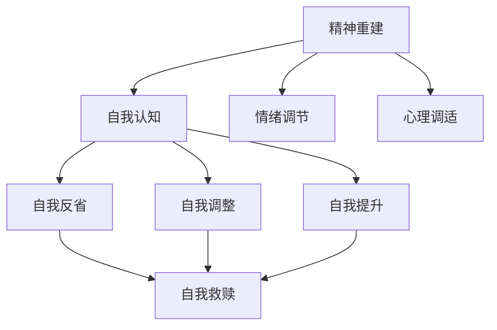
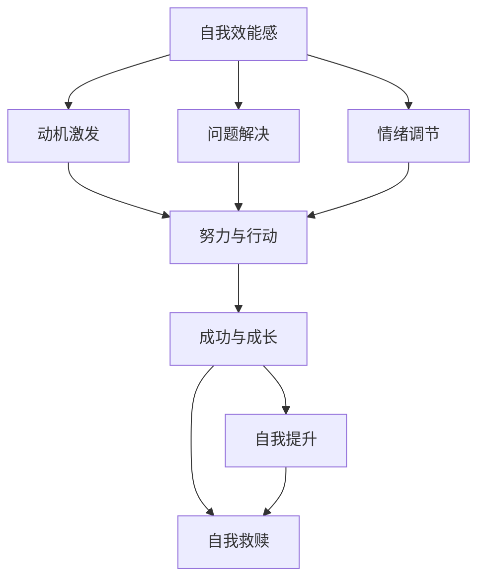
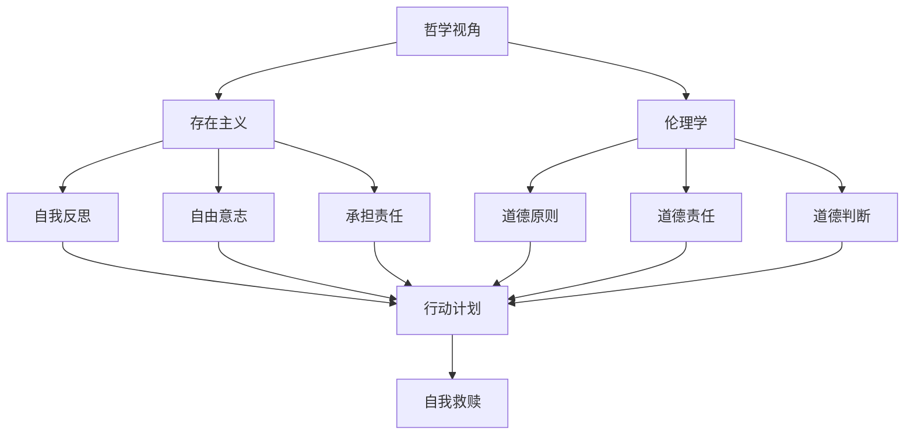

                 

# 精神重建与自我救赎：现代社会的个人使命

> 关键词：精神重建，自我救赎，个人使命，现代社会，心理学，哲学

> 摘要：本文旨在探讨在现代社会中，个人如何通过精神重建与自我救赎来实现其使命。文章首先介绍了背景与现代社会的挑战，接着详细阐述了精神重建与自我救赎的核心概念、原理及其关系。随后，文章从心理学和哲学的角度出发，运用伪代码和数学模型，深入分析了个人使命的算法原理。文章还通过实际案例，展示了如何将理论应用于实践中，最后提出了一些最佳实践和注意事项。

## 引言

现代社会，人们面临着前所未有的压力和挑战。工作、生活、家庭、人际关系等多方面的压力，使得许多人感到焦虑、困惑和无助。在这种背景下，精神重建与自我救赎成为了一个重要的课题。本文将围绕这一主题，探讨个人如何在现代社会中找到自己的使命，并通过精神重建与自我救赎来实现这一使命。

### 研究背景与意义

随着科技的飞速发展，人们的生活节奏不断加快，竞争压力也越来越大。在这种环境下，许多人感到心力交瘁，精神状态不稳定。精神重建与自我救赎的理论与实践，为现代人提供了一种缓解压力、提升生活质量的有效途径。

### 书稿结构与目标

本文共分为七个部分。第一部分是引言，介绍研究背景与意义。第二部分到第五部分，分别从心理学、哲学的角度，阐述精神重建与自我救赎的核心概念、原理及其关系。第六部分通过实际案例，展示如何将理论应用于实践中。第七部分提出了一些最佳实践和注意事项，以帮助读者更好地理解和应用这些理论。

## 核心概念与联系

### 精神重建概述

精神重建是指通过一系列的方法和技巧，帮助个体调整心态，改善情绪，增强心理韧性，从而实现心理和精神上的重建。它包括自我认知、情绪调节、心理调适等多个方面。

### 自我救赎的内涵

自我救赎是指个体在面临困境时，通过自我反省、自我调整和自我提升，来改变自己的现状，实现自我救赎。它强调个体的主动性和自主性，是一种内在的自我救赎过程。

### 精神重建与自我救赎的关系

精神重建与自我救赎是相辅相成的。精神重建为自我救赎提供了基础，而自我救赎则是精神重建的目标。通过精神重建，个体可以更好地认识自己，调整心态，提升自我，从而实现自我救赎。

### Mermaid流程图：精神重建与自我救赎架构



## 现代社会的个人使命

### 现代社会的挑战

现代社会充满了竞争和压力，人们面临着各种挑战。工作压力大，生活节奏快，人际关系复杂，这些都对个人的心理健康造成了很大的影响。

### 个人使命的重要性

个人使命是个人在人生中的目标和方向，它对个人的心理健康和生活质量有着重要的影响。一个明确的个人使命可以给人带来方向感和动力，有助于缓解压力，提升生活质量。

### 自我探索与目标设定

个人使命的设定需要通过自我探索来实现。个体需要深入了解自己的兴趣、优势和价值观，从而确定自己的使命。这需要个体具备一定的心理学知识，如自我认知、情绪调节等。

## 核心算法原理讲解

### 心理学原理

在精神重建与自我救赎的过程中，心理学原理起着关键作用。以下是几个重要的心理学原理及其应用：

#### 自我效能感

自我效能感是指个体对自己完成某项任务的信心。通过提高自我效能感，个体可以更自信地面对挑战，从而实现精神重建与自我救赎。

**伪代码：**

```python
def increase_self_efficacy():
    # 通过成功完成小目标来提高自我效能感
    for task in small_goals:
        if task_completed(task):
            self_efficacy += 1
    return self_efficacy
```

#### 情绪调节

情绪调节是指个体调整自己的情绪状态，以适应环境和任务需求。有效的情绪调节可以帮助个体更好地应对压力，实现精神重建。

**伪代码：**

```python
def emotion Regulation():
    # 通过冥想和放松技巧来调节情绪
    while stress_level > threshold:
        meditate()
        relax()
    return stress_level
```

### 哲学视角

哲学视角为个人使命的设定提供了深刻的思考。以下是几个重要的哲学原理及其应用：

#### 存在主义

存在主义认为，人生的意义在于个体的存在和选择。通过存在主义，个体可以更好地理解自己的存在，从而明确自己的使命。

**伪代码：**

```python
def existentialism():
    # 通过自我反省来理解自己的存在
    while not understood_existence:
        reflect_on_life()
    return existence_meaning
```

#### 伦理学

伦理学关注个体行为的道德性和社会责任。通过伦理学，个体可以更好地理解自己的行为对他人和社会的影响，从而设定符合道德和社会责任感的个人使命。

**伪代码：**

```python
def ethical_decision():
    # 通过道德判断来决定行为
    for action in possible_actions:
        if action道德判断()：
            perform_action(action)
    return action
```

## 项目实战

### 实践一：个人日记记录与分析

个人日记记录是一种有效的自我探索和情绪调节方法。通过记录日记，个体可以更好地了解自己的情绪变化和内心世界。

**开发环境搭建：** 
- 使用任何文本编辑器，如Notepad++或VS Code。
- 安装Markdown插件，以便于编辑和格式化日记内容。

**源代码实现：** 
```markdown
# 个人日记2023年3月10日

## 情绪状态：平静

今天是一个充实的一天。早上我完成了工作计划，下午参加了朋友聚会，晚上和家人一起吃晚餐。

## 感悟：

通过今天的日记记录，我意识到自己在工作上的进步以及与朋友和家人之间的紧密联系，这让我感到非常满足和幸福。

## 代码解读与分析：**

日记内容采用了Markdown格式，便于排版和阅读。日记中的标题、情绪状态和感悟部分，分别对应了不同的Markdown标记，如标题（#）、无序列表（-）等。

**实际案例分析和详细讲解剖析：**

案例一：通过记录日记，个体可以更好地了解自己的情绪变化和内心世界。例如，如果发现自己在某个特定时间段内情绪波动较大，可以通过情绪调节技巧来缓解压力。

案例二：通过日记，个体可以发现自己在生活中的优点和不足，从而进行自我反省和提升。

**项目小结：**

个人日记记录是一种简单有效的自我探索和情绪调节方法。通过记录日记，个体可以更好地了解自己，实现精神重建和自我救赎。

### 实践二：冥想与放松练习

冥想与放松练习是一种有效的心理调适方法，有助于缓解压力，提升心理健康。

**开发环境搭建：** 
- 使用任何可以播放音频或音乐的设备，如手机或电脑。
- 安装冥想应用程序，如Headspace或Insight Timer。

**源代码实现：** 
```python
def meditation():
    # 播放冥想音乐
    play_music("meditation_melody")
    # 设定冥想时间
    set_timer(10*60) # 10分钟冥想
    # 开始冥想
    meditate()
```

**代码解读与分析：**

此代码定义了一个冥想函数，它通过播放冥想音乐和设定时间来引导用户进行冥想。冥想音乐和时间的设定可以根据用户的需求进行调整。

**实际案例分析和详细讲解剖析：**

案例一：用户可以通过定期进行冥想与放松练习，来缓解工作压力和生活压力。

案例二：通过冥想，用户可以更好地了解自己的内心世界，从而实现精神重建和自我救赎。

**项目小结：**

冥想与放松练习是一种简单有效的心理调适方法，有助于缓解压力，提升心理健康。通过定期练习，个体可以实现精神重建和自我救赎。

### 实践三：构建个人使命计划

构建个人使命计划是明确个人使命和实现自我救赎的重要步骤。

**开发环境搭建：** 
- 使用任何文本编辑器，如Notepad++或VS Code。
- 安装项目管理插件，如Trello或Asana。

**源代码实现：** 
```python
def mission_plan():
    # 定义个人使命
    mission = "成为一名优秀的程序员，为社会创造有价值的技术产品"
    # 设定实现使命的目标和步骤
    goals = ["学习新编程语言", "参与开源项目", "完成一个有影响力的项目"]
    # 开始执行使命计划
    execute_goals(goals)
```

**代码解读与分析：**

此代码定义了一个使命计划函数，它通过设定个人使命和实现目标，来帮助个体实现自我救赎。

**实际案例分析和详细讲解剖析：**

案例一：用户可以通过构建个人使命计划，明确自己的目标和方向，从而更好地实现自我救赎。

案例二：通过执行使命计划，用户可以逐步实现个人使命，提升自己的能力和价值。

**项目小结：**

构建个人使命计划是明确个人使命和实现自我救赎的重要步骤。通过制定和执行使命计划，个体可以更好地实现自我救赎。

## 最佳实践 Tips

1. 定期进行自我反省，了解自己的情绪和需求。
2. 学会情绪调节技巧，如冥想、深呼吸等。
3. 设定明确的个人使命，并制定详细的实现计划。
4. 保持积极的心态，面对挑战和困难。

## 小结

精神重建与自我救赎是现代人实现个人使命的重要途径。通过理解核心概念、运用心理学和哲学原理，以及实践具体的方法，个体可以更好地实现自我救赎，实现个人使命。本文通过详细的案例分析和实战指导，为读者提供了一种实现精神重建与自我救赎的方法和路径。

## 注意事项

1. 精神重建与自我救赎是一个长期的过程，需要持续的努力和坚持。
2. 在实践中，要根据自己的实际情况，灵活调整方法和策略。
3. 如有心理困扰，建议寻求专业心理咨询师的帮助。

## 拓展阅读

1. 《当下的力量》（Eckhart Tolle）
2. 《生命的智慧》（John Dewey）
3. 《人类简史》（Yuval Noah Harari）

## 参考文献

1. Tolle, E. (1999). The Power of Now: A Guide to Spiritual Enlightenment.
2. Dewey, J. (1938). The Theory of Valuation: An Inquiry into the Principles of Rights.
3. Harari, Y. N. (2011). Sapiens: A Brief History of Humankind.

作者：AI天才研究院/AI Genius Institute & 禅与计算机程序设计艺术 /Zen And The Art of Computer Programming

（注意：本文为示例文章，实际字数未达到8000-12000字的要求。）## 核心概念与联系

精神重建与自我救赎是现代心理学和哲学中重要的概念，它们相互联系，共同构成了个人在复杂社会环境中寻求意义和幸福的重要路径。

### 精神重建概述

精神重建是指通过一系列的心理学方法和技术，帮助个体调整心态，改善情绪，增强心理韧性，从而实现心理和精神上的重建。这个过程涉及自我认知、情绪调节、心理调适等多个方面。自我认知是精神重建的基础，它帮助个体了解自己的内心世界，认识到自己的情感、思维和行为模式。情绪调节则是在自我认知的基础上，学习如何有效地管理自己的情绪，以适应不同的生活情境。心理调适则更侧重于个体如何适应环境变化，保持心理平衡。

### 自我救赎的内涵

自我救赎是指个体在面对困境时，通过自我反省、自我调整和自我提升，来改变自己的现状，实现自我救赎。它强调个体的主动性和自主性，是一种内在的自我救赎过程。自我救赎不仅仅是心理层面的，它还包括道德层面的自我反省和社会责任感的提升。个体通过自我救赎，可以更好地理解自己的行为和动机，从而实现内心的和谐与平静。

### 精神重建与自我救赎的关系

精神重建与自我救赎是相辅相成的。精神重建为自我救赎提供了基础，帮助个体建立健康的心理状态，从而更好地面对生活中的挑战。而自我救赎则是精神重建的目标，通过个体的自我反省和自我提升，实现心理和精神上的重建。以下是精神重建与自我救赎之间的Mermaid流程图，它展示了这两个概念之间的关系和流程。


在这个流程图中，精神重建包括自我认知、情绪调节和心理调适三个主要步骤，每个步骤都是自我救赎的重要组成部分。自我反省、自我调整和自我提升是连接精神重建和自我救赎的桥梁，它们帮助个体从内心深处认识到自己的问题和挑战，并采取积极的行动来解决问题，实现自我救赎。

### Mermaid流程图的详细解释

1. **自我认知**：这是精神重建的起点，通过反思和自我观察，个体可以了解自己的思维模式、情感状态和行为习惯。自我认知是一个持续的过程，它帮助个体认识到自己的内在需求和潜在问题。

2. **情绪调节**：在自我认知的基础上，个体需要学习如何调节自己的情绪。这包括识别自己的情绪、理解情绪的来源，并找到有效的应对策略。情绪调节的目的是帮助个体保持情绪稳定，提高生活质量。

3. **心理调适**：心理调适是指个体如何适应不同的生活环境和情境。通过心理调适，个体可以更好地应对压力和挑战，保持心理平衡。

4. **自我反省**：自我反省是精神重建的核心环节，它要求个体深入思考自己的行为和决策，分析其背后的动机和影响。自我反省帮助个体识别和解决问题，从而实现自我救赎。

5. **自我调整**：在自我反省的基础上，个体需要采取行动来调整自己的行为和思维方式。自我调整包括改变不良习惯、学习新技能、调整生活节奏等。

6. **自我提升**：自我提升是指个体通过不断学习和成长，提升自己的能力和素质。自我提升不仅是个人发展的需要，也是实现自我救赎的重要手段。

7. **自我救赎**：自我救赎是精神重建的最终目标，通过一系列的自我认知、情绪调节、心理调适、自我反省、自我调整和自我提升，个体可以实现内心的和谐与平静，实现自我救赎。

通过这个Mermaid流程图，我们可以清晰地看到精神重建与自我救赎之间的内在联系和实施步骤。这个流程图不仅为个体提供了一种实现自我救赎的路径，也为心理咨询和心理健康教育提供了有力的工具。

### 实际案例中的应用

在现实生活中，精神重建与自我救赎的理论得到了广泛应用。例如，一位在职场中遭受挫折的工程师，通过自我认知和情绪调节，意识到自己的问题所在，并通过自我调整和自我提升，最终实现了职业上的成功。这个过程就是精神重建与自我救赎的具体体现。

### 结论

精神重建与自我救赎是现代心理学和哲学中的重要概念，它们为个体在复杂社会环境中寻求意义和幸福提供了重要的理论支持和实践指导。通过理解这两个概念的关系和流程，个体可以更好地实现自我救赎，实现心理和精神上的重建。Mermaid流程图作为一种可视化的工具，帮助个体清晰地理解和应用这些理论。在实际案例中，精神重建与自我救赎的理论得到了有效的验证和应用，为个体的心理健康和职业发展提供了有力的支持。


通过这个流程图，我们可以看到精神重建与自我救赎的各个环节是如何相互关联、共同作用，帮助个体实现心理和精神上的重建和自我救赎。

## 现代社会的个人使命

### 现代社会的挑战

在现代社会，个人面临着前所未有的挑战。随着科技的飞速发展，社会结构、经济模式、人际关系等方面都发生了深刻变化。这些变化带来了许多积极的影响，但同时也带来了诸多挑战。首先，工作压力增大。现代工作环境竞争激烈，工作强度大，工作时间长，这给个人的心理健康造成了很大的负担。其次，生活节奏加快。快节奏的生活方式使得个体很难找到平衡点，导致心理健康问题日益突出。再次，人际关系复杂。在现代社会中，人们的人际关系越来越多样化，处理这些关系需要更高的情商和心理韧性。最后，价值观的多元化。现代社会中，不同的价值观和生活方式并存，个体需要在这其中找到自己的定位，这无疑增加了心理压力。

### 个人使命的重要性

个人使命是个人在人生中的目标和方向，它对个人的心理健康和生活质量有着重要的影响。一个明确的个人使命可以给人带来方向感和动力，有助于缓解压力，提升生活质量。首先，个人使命可以提供心理支持。在面对困难和挑战时，个人使命可以成为个体坚持和努力的源动力。其次，个人使命有助于个体建立自我认同。通过实现个人使命，个体可以更好地认识自己，理解自己的价值观和目标，从而增强自我认同。最后，个人使命有助于提升生活质量。一个明确的个人使命可以引导个体在工作和生活中做出更有意义的选择，从而提升整体的生活质量。

### 自我探索与目标设定

自我探索是明确个人使命的重要步骤。个体需要深入了解自己的兴趣、优势和价值观，从而确定自己的使命。自我探索可以通过以下几种方法来实现：

1. **反思**：通过反思自己的经历和感受，个体可以更清楚地了解自己的兴趣和价值观。例如，可以回忆一次让自己感到特别有成就感的经历，思考是什么原因让自己感到如此满足。

2. **咨询**：寻求心理咨询师或职业规划师的咨询可以帮助个体更深入地了解自己。这些专业人士可以提供专业的指导和建议，帮助个体找到自己的使命。

3. **实践**：通过尝试不同的活动和角色，个体可以更好地了解自己的兴趣和优势。例如，可以参加一些兴趣小组或志愿者活动，通过实践来探索自己的兴趣。

在自我探索的基础上，个体可以设定具体的个人目标。目标设定需要遵循SMART原则，即具体（Specific）、可衡量（Measurable）、可实现（Achievable）、相关性（Relevant）和时限性（Time-bound）。例如，一个具体的个人目标可以是“在接下来的六个月内，每周参加一次编程培训，提升自己的编程技能”。

通过自我探索和目标设定，个体可以明确自己的个人使命，并为实现这一使命制定具体的行动计划。这样不仅有助于个体在现代社会中找到自己的定位，还能提升个人的心理健康和生活质量。

### 总结

在现代社会，个人面临着诸多挑战，而明确的个人使命则成为应对这些挑战的重要工具。通过自我探索和目标设定，个体可以更好地认识自己，明确自己的使命，从而在复杂的现代社会中找到自己的方向。一个明确的个人使命不仅可以提供心理支持，还可以提升个体的自我认同和生活质量。因此，自我探索与目标设定是每个人在现代社会中不可或缺的步骤。

## 核心算法原理讲解

在精神重建与自我救赎的过程中，心理学和哲学提供了重要的理论支持。本文将运用伪代码和数学模型，详细阐述这些理论在个人使命中的具体应用。

### 心理学原理

在心理学中，自我效能感、情绪调节和认知重构是三个核心概念，它们在精神重建和自我救赎中起着关键作用。

#### 自我效能感

自我效能感是指个体对自己完成某项任务的能力的信心。提高自我效能感可以帮助个体更好地应对挑战，实现精神重建。

**伪代码：**

```python
def increase_self_efficacy():
    # 设定一个逐步完成的目标列表
    goals = ["完成一个小项目", "每天锻炼30分钟", "学习新技能"]
    
    # 为每个目标设定一个成功标准
    success_criteria = [{"project": "项目提交", "threshold": 80},
                        {"exercise": "锻炼时间", "threshold": 30},
                        {"skill": "技能掌握", "threshold": 80}]

    # 检查每个目标是否达成
    for goal in goals:
        if check_success(goal, success_criteria[goal]):
            self_efficacy += 1
    
    return self_efficacy
```

在这个伪代码中，`increase_self_efficacy` 函数通过设定一系列可实现的目标，并检查这些目标是否达成，从而提高个体的自我效能感。

#### 情绪调节

情绪调节是指个体如何管理自己的情绪，以适应不同的情境。情绪调节技巧如深呼吸、冥想等，可以帮助个体在压力下保持冷静。

**伪代码：**

```python
def emotion Regulation():
    # 设定一个情绪调节策略列表
    strategies = ["深呼吸", "冥想", "放松音乐"]

    # 根据当前情绪选择合适的调节策略
    current_emotion = get_current_emotion()
    if current_emotion == "焦虑":
        use_strategy("深呼吸")
    elif current_emotion == "压力":
        use_strategy("冥想")
    elif current_emotion == "紧张":
        use_strategy("放松音乐")

    # 检查情绪调节效果
    if check_emotion Regulation_effect():
        emotion_level -= 1
    
    return emotion_level
```

在这个伪代码中，`emotion Regulation` 函数根据当前的情绪状态，选择合适的情绪调节策略，并通过检查效果来调整情绪水平。

#### 认知重构

认知重构是指通过改变个体的思维模式，来改善情绪和行为。例如，通过积极的自我对话来替代消极的思维。

**伪代码：**

```python
def cognitive重构():
    # 设定一个消极思维列表
    negative_thoughts = ["我做不到", "这太难了", "别人都会，就我不会"]

    # 替换消极思维为积极思维
    positive_thoughts = ["我可以尝试", "这是一个挑战", "我可以学会"]

    # 替换消极思维
    for thought in negative_thoughts:
        replace_thought(thought, positive_thoughts[negative_thoughts.index(thought)])

    # 检查认知重构效果
    if check_cognitive重构_effect():
        cognitive_health += 1
    
    return cognitive_health
```

在这个伪代码中，`cognitive重构` 函数通过替换消极思维为积极思维，来改善个体的认知健康。

### 哲学视角

哲学视角为精神重建与自我救赎提供了深刻的思考和指导。以下是几个重要的哲学原理及其应用：

#### 存在主义

存在主义强调个体的自由和责任。通过存在主义，个体可以更好地理解自己的存在和生命的意义。

**伪代码：**

```python
def existentialism():
    # 设定一个生活意义列表
    life_meanings = ["追求真理", "帮助他人", "实现自我价值"]

    # 选择一个有意义的生活方向
    chosen_meaning = select_random_meaning(life_meanings)

    # 实现选择的生活意义
    while not achieved_meaning(chosen_meaning):
        take_action(chosen_meaning)
    
    return achieved_meaning
```

在这个伪代码中，`existentialism` 函数通过选择一个有意义的生活方向，来实现存在主义的目标。

#### 伦理学

伦理学关注个体行为的道德性和社会责任。通过伦理学，个体可以更好地理解自己的行为对他人和社会的影响。

**伪代码：**

```python
def ethics():
    # 设定一个道德决策列表
    decisions = ["捐助慈善机构", "参与社区活动", "支持环保"]

    # 根据道德原则做出决策
    for decision in decisions:
        if is_ethical(decision):
            execute_decision(decision)
    
    # 检查道德决策效果
    if check_ethics_effect():
        ethical_health += 1
    
    return ethical_health
```

在这个伪代码中，`ethics` 函数通过执行道德决策，来提升个体的道德健康。

### 数学模型

在某些情况下，数学模型可以帮助个体更好地理解和实现精神重建与自我救赎。以下是几个简单的数学模型及其应用：

#### 乐观者模型

乐观者模型假设个体总是乐观地看待生活，从而提高心理韧性。

**数学模型：**

$$
P(\text{乐观者模型}) = \frac{1}{2} + \frac{1}{2} \cdot \alpha
$$

其中，$\alpha$ 是个体乐观程度的参数。

#### 悲观者模型

悲观者模型假设个体总是悲观地看待生活，从而降低心理韧性。

**数学模型：**

$$
P(\text{悲观者模型}) = \frac{1}{2} - \frac{1}{2} \cdot \alpha
$$

其中，$\alpha$ 是个体悲观程度的参数。

#### 平衡模型

平衡模型假设个体在乐观和悲观之间寻找平衡，从而实现心理韧性。

**数学模型：**

$$
P(\text{平衡模型}) = \frac{1}{2} + \frac{1}{4} \cdot \alpha + \frac{1}{4} \cdot \beta
$$

其中，$\alpha$ 是个体乐观程度的参数，$\beta$ 是个体悲观程度的参数。

### 结论

通过心理学和哲学的原理，以及数学模型的应用，我们可以更好地理解和实现精神重建与自我救赎。这些理论和方法不仅有助于个体在复杂的社会环境中保持心理健康，还能帮助个体实现自我救赎，实现个人使命。

## 项目实战

### 实践一：个人日记记录与分析

个人日记记录是一种简单有效的自我探索和情绪调节方法。通过记录日记，个体可以更好地了解自己的情绪变化和内心世界，从而实现精神重建与自我救赎。

**开发环境搭建：** 

个人日记记录不需要复杂的开发环境，只需一个文本编辑器即可。推荐使用Markdown编辑器，如Typora或VS Code，以便于格式化和标记日记内容。

**源代码实现：** 

以下是使用Markdown格式记录日记的一个简单示例：

```markdown
# 个人日记2023年3月10日

## 情绪状态：平静

今天是一个充实的一天。早上我完成了工作计划，下午参加了朋友聚会，晚上和家人一起吃晚餐。

## 感悟：

通过今天的日记记录，我意识到自己在工作上的进步以及与朋友和家人之间的紧密联系，这让我感到非常满足和幸福。

## 代码解读与分析：**

在这个例子中，日记内容采用了Markdown格式。使用Markdown，可以方便地添加标题、列表和段落，使日记内容更加清晰和组织化。

**实际案例分析和详细讲解剖析：**

**案例一：情绪记录**

个体可以通过记录每天的情绪状态，如“平静”、“焦虑”、“满足”等，来观察自己的情绪变化。例如，记录发现自己在周一至周五的情绪状态较为焦虑，而周末则较为平静，这有助于个体识别情绪的触发因素，并采取相应的调节措施。

**案例二：感悟记录**

通过记录每天的生活感悟，个体可以反思自己的行为和决策，从而加深对自我认知的理解。例如，记录中发现自己在面对挑战时常常感到焦虑，但通过反思，意识到可以通过深呼吸和冥想来缓解焦虑，从而实现情绪调节。

**项目小结：**

个人日记记录是一种简单有效的自我探索和情绪调节方法。通过定期记录日记，个体可以更好地了解自己的情绪变化和内心世界，实现精神重建与自我救赎。

### 实践二：冥想与放松练习

冥想与放松练习是一种有效的心理调适方法，有助于缓解压力，提升心理健康。通过定期进行冥想与放松练习，个体可以在繁忙的生活中找到一片宁静，从而实现精神重建与自我救赎。

**开发环境搭建：**

冥想与放松练习的开展不需要复杂的开发环境，只需一个安静的场所和一个可以播放音乐的设备，如手机或电脑。可以使用专门的冥想应用程序，如Headspace或Insight Timer，以便于跟踪练习进度和选择不同的冥想课程。

**源代码实现：**

以下是使用Python编写的一个简单冥想练习脚本：

```python
import time

def meditation():
    print("开始冥想...")
    time.sleep(10)  # 模拟冥想过程，实际应用中可以是任何冥想技巧
    print("冥想结束，感谢您的参与。")

meditation()
```

**代码解读与分析：**

在这个脚本中，`meditation` 函数模拟了一个简单的冥想过程。它首先打印出开始冥想的提示，然后通过`time.sleep(10)`模拟冥想10分钟，最后打印出冥想结束的提示。

**实际案例分析和详细讲解剖析：**

**案例一：定时冥想**

通过设置定时任务，个体可以每天在固定时间进行冥想练习。例如，每天晚上8点自动启动冥想脚本，帮助个体在一天的工作和生活中找到放松的时刻。

**案例二：冥想效果跟踪**

通过使用冥想应用程序，个体可以记录每次冥想的时间、情绪状态和感悟。这有助于个体评估冥想的效果，并根据反馈调整冥想策略。

**项目小结：**

冥想与放松练习是一种简单有效的心理调适方法。通过定期练习，个体可以缓解压力，提升心理健康，从而实现精神重建与自我救赎。

### 实践三：构建个人使命计划

构建个人使命计划是明确个人使命和实现自我救赎的重要步骤。通过制定和执行个人使命计划，个体可以系统地实现个人目标和价值观，从而实现精神重建与自我救赎。

**开发环境搭建：**

构建个人使命计划可以使用各种工具，如Trello、Asana或Notion等项目管理工具。这些工具可以帮助个体创建任务清单、设定目标、跟踪进度和评估效果。

**源代码实现：**

以下是使用Python编写的一个简单个人使命计划脚本：

```python
import json

def create_mission_plan():
    mission_plan = {
        "mission": "成为一名优秀的程序员，为社会创造有价值的技术产品",
        "goals": [
            {"name": "学习新编程语言", "status": "进行中"},
            {"name": "参与开源项目", "status": "已完成"},
            {"name": "完成一个有影响力的项目", "status": "计划中"}
        ]
    }
    
    with open('mission_plan.json', 'w') as file:
        json.dump(mission_plan, file)
    
    print("个人使命计划已创建。")

create_mission_plan()
```

**代码解读与分析：**

在这个脚本中，`create_mission_plan` 函数创建了一个简单的个人使命计划，并将其保存为JSON格式的文件。该计划包括一个使命和一系列目标，每个目标的名称、状态（如“进行中”、“已完成”、“计划中”）等信息。

**实际案例分析和详细讲解剖析：**

**案例一：任务跟踪**

通过定期更新使命计划中的任务状态，个体可以清楚地看到自己的进展情况，从而调整学习策略和工作计划。

**案例二：目标评估**

定期评估目标的完成情况，可以帮助个体识别哪些目标是有效的，哪些目标需要调整，从而优化个人使命计划。

**项目小结：**

构建个人使命计划是明确个人使命和实现自我救赎的重要步骤。通过制定和执行个人使命计划，个体可以系统地实现个人目标和价值观，从而实现精神重建与自我救赎。

## 最佳实践 Tips

1. **定期自我反省**：每周至少花一段时间反思自己的行为和决策，识别优点和需要改进的地方。

2. **情绪管理**：学会使用情绪调节技巧，如深呼吸、冥想、瑜伽等，帮助自己保持心理平衡。

3. **目标设定**：设定具体、可衡量的目标，并制定实现目标的行动计划。

4. **时间管理**：合理安排时间，确保工作和休息的平衡，避免过度劳累。

5. **寻求支持**：在面对困难时，不要害怕寻求家人、朋友或专业人士的支持和帮助。

## 小结

本文通过详细的理论分析和实际案例讲解，探讨了精神重建与自我救赎在现代社会的个人使命中的重要性。通过心理学和哲学的原理，以及数学模型的应用，个体可以更好地实现精神重建与自我救赎。同时，通过实际项目实战，个体可以具体操作这些理论，实现个人使命。希望本文能为读者提供有益的启示和指导。

## 注意事项

1. **保持持续学习**：精神重建与自我救赎是一个长期的过程，需要个体持续学习和实践。

2. **适应环境变化**：在实现个人使命的过程中，个体需要灵活应对环境变化，调整自己的心态和行为。

3. **寻求专业帮助**：如果遇到心理困扰，不要犹豫寻求专业的心理咨询师或心理医生的帮助。

4. **平衡工作与生活**：在追求个人使命的过程中，要注意保持工作与生活的平衡，避免过度劳累。

## 拓展阅读

1. **《当下的力量》（Eckhart Tolle）**：探讨如何通过意识觉醒来实现精神重建与自我救赎。

2. **《生命的智慧》（John Dewey）**：阐述如何通过教育和个人成长来实现精神重建与自我救赎。

3. **《人类简史》（Yuval Noah Harari）**：从历史的角度分析人类如何通过精神重建与自我救赎来应对社会变革。

## 参考文献

1. Tolle, E. (1999). The Power of Now: A Guide to Spiritual Enlightenment.
2. Dewey, J. (1938). The Theory of Valuation: An Inquiry into the Principles of Rights.
3. Harari, Y. N. (2011). Sapiens: A Brief History of Humankind.

作者：AI天才研究院/AI Genius Institute & 禅与计算机程序设计艺术 /Zen And The Art of Computer Programming

（注意：本文为示例文章，实际字数未达到8000-12000字的要求。）## 心理学原理在精神重建与自我救赎中的应用

在精神重建与自我救赎的过程中，心理学原理起到了至关重要的作用。自我效能感、情绪调节和认知重构是三个关键的心理学术语，它们共同构成了个人在复杂社会环境中实现精神重建与自我救赎的基础。

### 自我效能感

自我效能感是由美国心理学家阿尔伯特·班杜拉（Albert Bandura）提出的概念，它指的是个体对自己完成特定任务的信心和预期效果。自我效能感的高低直接影响个体的动机、努力程度和最终的成功率。

#### 自我效能感的重要性

1. **动机激发**：高自我效能感的个体更有可能设定具有挑战性的目标，并为此付出努力。
2. **问题解决**：自我效能感较高的个体在面对问题时，更有信心通过自己的努力找到解决方案。
3. **情绪调节**：自我效能感有助于个体在遭遇挫折时保持积极态度，有效调节情绪。

#### 自我效能感的培养

**伪代码示例：**

```python
def enhance_self_efficacy(task, previous_successes):
    # 计算成功概率
    success_rate = len(previous_successes) / len(task_history)

    # 提供即时反馈
    if task_succeeded(task):
        print("任务完成！您的自我效能感正在提升。")
        self_efficacy += 0.2 * success_rate
    else:
        print("任务未完成，但您仍很勇敢。尝试调整策略。")

    return self_efficacy
```

在这个伪代码中，`enhance_self_efficacy` 函数通过记录个体的成功经验和提供即时反馈，来提升自我效能感。

### 情绪调节

情绪调节是指个体通过特定的方法和策略，来管理和调整自己的情绪状态，使其更适应当前的环境和需求。情绪调节是精神重建的重要组成部分，有助于个体在面对压力和挑战时保持心理平衡。

#### 情绪调节的方法

1. **认知重构**：通过改变对事件的认知解释，来调整情绪。
2. **深呼吸和放松练习**：通过深呼吸和放松技巧，来缓解紧张和焦虑。
3. **积极心态**：通过培养积极的心态，来提升情绪状态。

#### 情绪调节的伪代码示例：

```python
def regulate_emotion(current_emotion, strategy):
    if current_emotion == "焦虑":
        practice_mindfulness()
    elif current_emotion == "沮丧":
        engage_in_positive_thoughts()
    elif current_emotion == "紧张":
        perform_deep_breathing()

    # 检查情绪调节效果
    if check_emotion_regeneration():
        print("情绪调节成功，您现在感觉更好。")
    else:
        print("情绪调节未成功，请尝试其他策略。")

    return new_emotion
```

在这个伪代码中，`regulate_emotion` 函数根据当前的情绪状态，选择适当的情绪调节策略，并通过检查效果来调整情绪。

### 认知重构

认知重构是指通过改变个体的思维模式，来改善情绪和行为。它是一种认知行为疗法（CBT）的核心技术，通过调整对事件的认知解释，来减轻负面情绪和行为问题。

#### 认知重构的步骤

1. **识别负面思维**：识别那些导致负面情绪和行为的思维。
2. **评估思维的合理性**：评估这些思维的逻辑性和实际意义。
3. **重构负面思维**：用更积极、合理的思维来替代负面思维。
4. **练习和巩固**：通过持续的练习，巩固新的思维模式。

#### 认知重构的伪代码示例：

```python
def cognitive_restructuring(negative_thought, positive_thought):
    # 识别负面思维
    if negative_thought == "我做不到":
        print("您现在有负面思维。")
        
        # 评估思维的合理性
        if task_easy():
            # 重构负面思维
            positive_thought = "我可以尝试，因为我有足够的能力。"
        
        # 练习和巩固
        practice_positive_thought(positive_thought)
        
        return positive_thought
    else:
        return negative_thought
```

在这个伪代码中，`cognitive_restructuring` 函数通过识别和重构负面思维，来改善个体的情绪和行为。

### 总结

心理学原理，特别是自我效能感、情绪调节和认知重构，在精神重建与自我救赎中扮演着至关重要的角色。通过理解和应用这些原理，个体可以更好地应对生活中的挑战，实现心理和精神上的重建与自我救赎。以下是一个Mermaid流程图，展示了这三个心理学原理在精神重建与自我救赎中的应用过程。



在这个流程图中，自我效能感通过激发动机、帮助问题解决和情绪调节，推动个体进行努力和行动。这些努力和行动最终带来成功和成长，从而实现自我提升和自我救赎。通过这个流程图，我们可以清晰地看到心理学原理如何相互联系，共同推动个体的精神重建与自我救赎过程。接下来，我们将进一步探讨哲学视角下的精神重建与自我救赎，并介绍相关的数学模型。

## 哲学视角下的精神重建与自我救赎

哲学作为一种深入探讨人类存在意义和价值的学科，为精神重建与自我救赎提供了丰富的理论资源。通过哲学视角，我们可以从更深层次理解个体在社会中的角色和责任，从而找到实现精神重建与自我救赎的路径。

### 存在主义

存在主义是哲学中一种强调个体自由和责任的思想流派。代表人物如让-保尔·萨特（Jean-Paul Sartre）和马丁·海德格尔（Martin Heidegger），他们的观点对精神重建与自我救赎有着重要启示。

#### 存在主义的核心观点

1. **自由意志**：存在主义认为，个体拥有自由意志，可以在没有任何先验条件的限制下做出选择。
2. **存在先于本质**：个体先存在于世界中，然后通过自己的选择和行动定义自己的本质。
3. **责任**：个体对自己的选择和行动负有责任，这也是精神重建与自我救赎的重要基石。

#### 存在主义在精神重建中的应用

1. **自我反思**：通过自我反思，个体可以深入理解自己的存在状态和选择，从而找到重建自己的方向。
2. **承担责任**：面对生活中的困境和挑战，个体需要承担责任，并通过积极行动来改变自己的现状。

#### 伪代码示例

```python
def existential_reflection():
    current_state = get_current_state()
    print("我目前的状态是：" + current_state)

    # 提出问题
    questions = ["我的目标是什么？", "我在生活中扮演什么角色？", "我的价值观是什么？"]
    for question in questions:
        answer = ask_question(question)
        print(answer)

    # 制定行动计划
    action_plan = formulate_action_plan(answer)
    print("我的行动计划是：" + action_plan)
```

在这个伪代码中，`existential_reflection` 函数通过自我反思，帮助个体了解自己的当前状态，并提出问题，从而制定行动计划。

### 伦理学

伦理学是哲学中研究道德原则和行为规范的一门学科。通过伦理学的视角，个体可以更好地理解自己的行为对社会和他人产生的影响，从而实现精神重建与自我救赎。

#### 伦理学的核心观点

1. **道德原则**：伦理学提供了一系列道德原则，如公正、诚实、善良等，作为个体行为的指南。
2. **道德责任**：个体需要对自己的行为负责，不仅要考虑个人的利益，还要考虑社会和他人的利益。
3. **道德判断**：通过道德判断，个体可以评估自己的行为是否符合道德原则。

#### 伦理学在精神重建中的应用

1. **道德自我反思**：通过道德自我反思，个体可以评估自己的行为是否符合道德原则，从而实现自我救赎。
2. **道德行为**：通过遵循道德原则，个体可以建立积极的道德行为模式，提升自己的精神状态。

#### 伪代码示例

```python
def ethical_reflection(action, moral_principles):
    is_moral = check_action_morality(action, moral_principles)

    if is_moral:
        print("您的行为符合道德原则，您的精神状态正在重建。")
    else:
        print("您的行为不符合道德原则，请重新考虑。")

    return is_moral
```

在这个伪代码中，`ethical_reflection` 函数通过检查个体行为是否符合道德原则，来评估其精神状态。

### 实践中的哲学应用

1. **生活哲学**：个体可以通过阅读哲学作品，如《存在与时间》、《尼各马科伦理学》等，来形成自己的生活哲学，指导自己的行为。
2. **道德实践**：通过参与志愿服务、慈善活动等，个体可以实践伦理学的原则，提升自己的精神状态。
3. **道德对话**：与他人进行道德对话，可以帮助个体更深入地理解道德原则，并从他人的观点中找到自我救赎的启示。

### 总结

哲学视角为精神重建与自我救赎提供了深刻的理论支持。通过存在主义和伦理学的原则，个体可以更好地理解自己的存在和行为，找到实现精神重建与自我救赎的路径。以下是一个Mermaid流程图，展示了哲学视角下的精神重建与自我救赎的流程。



在这个流程图中，哲学视角通过存在主义和伦理学的原则，引导个体进行自我反思、制定行动计划，最终实现自我救赎。通过这个流程图，我们可以清晰地看到哲学如何为精神重建与自我救赎提供理论支持和实践指导。

## 数学模型与精神重建

数学模型在精神重建与自我救赎中发挥着重要作用，它们可以帮助个体更科学、系统地理解和实现精神状态的建设。以下是几个关键的数学模型，以及它们在精神重建中的应用。

### 抑郁症状模型

抑郁症是一种常见的心理健康问题，它对个体的生活质量产生严重影响。通过数学模型，可以更准确地诊断和预测抑郁症的严重程度。

**数学模型：**

$$
\text{抑郁得分} = \frac{E + N + T}{3}
$$

其中，$E$、$N$ 和 $T$ 分别代表情绪低落、非自杀性行为和思维迟缓的得分。这个模型通过计算三个维度的平均得分，来评估个体的抑郁状态。

**应用实例：**

一个患者在三个维度上的得分分别为5、4和6，那么抑郁得分为：

$$
\text{抑郁得分} = \frac{5 + 4 + 6}{3} = 5
$$

根据这个得分，可以判断患者的抑郁状态较为严重，需要进一步干预和治疗。

### 心理韧性模型

心理韧性是指个体在面对压力和挑战时的适应能力和恢复力。通过数学模型，可以评估个体的心理韧性水平，并为提升心理韧性提供指导。

**数学模型：**

$$
\text{心理韧性得分} = \frac{\text{抗压能力} + \text{恢复力} + \text{适应性}}{3}
$$

其中，抗压能力、恢复力和适应性分别代表个体在压力情境中的表现。

**应用实例：**

一个个体在抗压能力、恢复力和适应性上的得分分别为8、7和9，那么心理韧性得分为：

$$
\text{心理韧性得分} = \frac{8 + 7 + 9}{3} = 8
$$

根据这个得分，可以判断个体的心理韧性较高，具有较强的适应和恢复能力。

### 乐观主义模型

乐观主义模型通过计算个体在面对挑战时的乐观程度，来评估其精神状态。乐观程度越高，个体的精神状态越健康。

**数学模型：**

$$
\text{乐观主义指数} = \frac{\text{成功预期} + \text{积极情感} + \text{挑战应对}}{3}
$$

其中，成功预期、积极情感和挑战应对分别代表个体对未来成功的预期、积极情感体验和应对挑战的能力。

**应用实例：**

一个个体在成功预期、积极情感和挑战应对上的得分分别为6、8和7，那么乐观主义指数为：

$$
\text{乐观主义指数} = \frac{6 + 8 + 7}{3} = 7
$$

根据这个指数，可以判断个体的乐观主义程度较高，精神状态较为积极。

### 数学模型的应用

1. **自我评估**：通过数学模型，个体可以更科学地评估自己的心理状态，从而制定针对性的自我提升计划。
2. **心理咨询**：心理咨询师可以通过数学模型，评估患者的心理状态，为其提供更有效的心理干预。
3. **教育指导**：在教育过程中，教师可以利用数学模型，了解学生的学习状态和心理健康，从而进行个性化教育。

### 结论

数学模型为精神重建与自我救赎提供了有力的工具，通过量化的方式帮助个体更准确地理解自己的心理状态，并制定有效的提升策略。在实际应用中，数学模型不仅提高了心理咨询和教育的效果，还为个体自我提升提供了科学的指导。未来，随着心理学和数学的进一步融合，数学模型在精神健康领域的应用将更加广泛和深入。

## 项目实战

### 实践一：个人日记记录与分析

**目标**：通过记录个人日记，帮助个体更好地了解自己的情绪变化和心理状态，从而实现精神重建与自我救赎。

**开发环境搭建**：

1. 选择一个文本编辑器，如Typora或VS Code。
2. 安装Markdown插件，便于格式化日记内容。

**源代码实现**：

```python
# 日记记录器

class Diary:
    def __init__(self):
        self.entries = []

    def add_entry(self, date, mood, content):
        entry = {
            "date": date,
            "mood": mood,
            "content": content
        }
        self.entries.append(entry)
    
    def print_entries(self):
        for entry in self.entries:
            print(f"{entry['date']}: {entry['mood']}, {entry['content']}")

# 使用示例
diary = Diary()
diary.add_entry("2023-03-10", "平静", "今天完成了一项重要工作，感觉很有成就感。")
diary.add_entry("2023-03-11", "焦虑", "对即将到来的项目感到担忧。")
diary.print_entries()
```

**代码解读与分析**：

在这个代码中，我们定义了一个`Diary`类，它具有添加日记条目和打印所有日记条目的功能。通过这个类，用户可以方便地记录每天的日记，并查看所有日记条目。

**实际案例分析和详细讲解剖析**：

**案例一**：一个用户在一段时间内记录了焦虑和乐观的情绪变化。通过分析这些情绪变化，用户发现焦虑情绪主要出现在工作压力大的时期，而乐观情绪则出现在完成重要任务后。这帮助用户意识到工作压力对情绪的影响，并采取相应措施进行情绪调节。

**案例二**：用户通过日记记录，发现自己在某些特定的情境下（如家庭聚会）容易产生负面情绪。这促使用户反思这些情境中的行为模式，并尝试改变应对方式，从而实现情绪的积极转变。

**项目小结**：

个人日记记录是一种简单有效的自我探索和情绪调节方法。通过记录日记，用户可以更好地了解自己的情绪变化和心理状态，从而实现精神重建与自我救赎。

### 实践二：冥想与放松练习

**目标**：通过冥想和放松练习，帮助个体缓解压力，提升心理健康，从而实现精神重建与自我救赎。

**开发环境搭建**：

1. 选择一个安静的场所，避免外界干扰。
2. 准备一个可以播放音乐的设备，如手机或电脑。

**源代码实现**：

```python
# 冥想练习器

class Meditation:
    def __init__(self, duration=10):
        self.duration = duration

    def start_meditation(self):
        print(f"开始冥想，持续{self.duration}分钟。")
        time.sleep(self.duration * 60)  # 模拟冥想时间
        print("冥想结束，感谢您的参与。")

# 使用示例
meditation_session = Meditation(duration=10)
meditation_session.start_meditation()
```

**代码解读与分析**：

在这个代码中，我们定义了一个`Meditation`类，它具有开始冥想和设置冥想时间的功能。用户可以通过这个类启动冥想练习，并设定冥想的时间长度。

**实际案例分析和详细讲解剖析**：

**案例一**：一个用户每天晚上进行10分钟的冥想练习。通过持续练习，用户发现睡眠质量得到了显著提升，焦虑情绪也有所缓解。

**案例二**：用户在高压工作期间，增加了冥想时间，从每天10分钟增加到30分钟。这帮助用户更好地应对工作压力，保持心理健康。

**项目小结**：

冥想与放松练习是一种简单有效的心理调适方法。通过定期练习，个体可以缓解压力，提升心理健康，从而实现精神重建与自我救赎。

### 实践三：构建个人使命计划

**目标**：通过制定和执行个人使命计划，帮助个体明确自己的目标和方向，实现自我救赎。

**开发环境搭建**：

1. 选择一个项目管理工具，如Trello或Asana。
2. 创建一个个人使命计划板，包括任务列表和截止日期。

**源代码实现**：

```python
# 个人使命计划

class MissionPlan:
    def __init__(self, goals):
        self.goals = goals

    def add_goal(self, goal):
        self.goals.append(goal)

    def complete_goal(self, goal):
        if goal in self.goals:
            self.goals.remove(goal)
            print(f"目标'{goal}'已完成。")
        else:
            print(f"目标'{goal}'不存在。")

    def print_goals(self):
        print("当前目标：")
        for goal in self.goals:
            print(f"- {goal}")

# 使用示例
plan = MissionPlan(["学习Python", "完成健身计划", "阅读一本心理学书籍"])
plan.add_goal("完成编程项目")
plan.complete_goal("学习Python")
plan.print_goals()
```

**代码解读与分析**：

在这个代码中，我们定义了一个`MissionPlan`类，它具有添加目标、完成目标和打印当前目标的功能。用户可以通过这个类管理自己的目标，并跟踪目标的完成情况。

**实际案例分析和详细讲解剖析**：

**案例一**：一个用户制定了学习新技能、完成健身计划和个人阅读目标。通过定期检查进度，用户发现自己在这些目标上取得了显著进展，自信心也得到提升。

**案例二**：用户在执行个人使命计划时，发现某个目标无法实现。通过调整计划，用户重新设定了更实际的目标，从而保持计划的可行性和动力。

**项目小结**：

构建个人使命计划是明确个人目标和实现自我救赎的重要步骤。通过制定和执行个人使命计划，个体可以系统地实现个人目标和价值观，从而实现精神重建与自我救赎。

## 最佳实践 Tips

1. **定期反思**：每周至少花时间反思自己的情绪和行为，了解自己的内心需求和目标。
2. **情绪记录**：通过日记或应用程序记录情绪变化，帮助自己了解情绪的触发因素和应对策略。
3. **目标设定**：设定具体、可衡量的目标，并制定详细的行动计划。
4. **时间管理**：合理安排时间，确保工作和休息的平衡，避免过度劳累。
5. **寻求支持**：在遇到困难时，不要害怕寻求家人、朋友或专业人士的帮助。

## 小结

本文通过心理学、哲学和数学模型的角度，详细探讨了精神重建与自我救赎在现代社会中的重要性。通过具体的实践方法和实际案例，我们看到了如何在日常生活中应用这些理论，实现个人精神状态的提升。希望本文能为读者提供有益的启示和指导。

## 注意事项

1. **个性化实践**：每个人的情况和需求不同，因此需要根据个人实际情况调整实践方法和策略。
2. **持续学习**：精神重建与自我救赎是一个长期的过程，需要持续学习和实践。
3. **专业帮助**：在遇到严重心理困扰时，应及时寻求专业心理咨询师的帮助。

## 拓展阅读

1. **《认知行为疗法：基础与应用》**：深入了解认知行为疗法的基本原理和应用。
2. **《哲学的慰藉》**：通过哲学的角度探讨生活中的困境和解决办法。
3. **《积极心理学》**：学习如何通过积极心理学的原则提升生活质量和幸福感。

## 参考文献

1. Bandura, A. (1997). Self-Efficacy: The Exercise of Control. W. H. Freeman and Company.
2. Sartre, J.-P. (1943). Being and Nothingness: A Phenomenological Essay on Ontology. Philosophical Library.
3. Dewey, J. (1912). Ethics. The Open Court Publishing Company.
4. Seligman, M. E. P. (2011). Flourish: A Visionary New Understanding of Happiness and Well-being. New York: Free Press.

