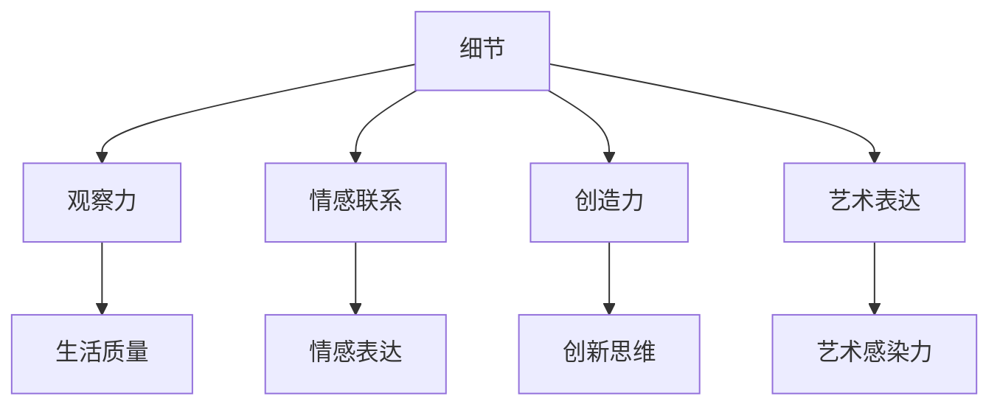

                 


### 文章标题：细节中的意义：培养对生活的敏感度

> 关键词：细节、生活敏感度、观察力、情感联系、创造力、艺术表达

> 摘要：本文将深入探讨细节在生活中的重要性，通过分析观察细节的方法、细节与情感的关联、细节对创造力和艺术表达的影响，以及细节在生活中的实际应用，帮助读者培养对生活的敏感度，提升生活质量。

----------------------------------------------------------------

### 引言

在信息技术飞速发展的今天，人们的生活节奏不断加快，我们往往忽略了身边的细节。然而，细节往往蕴藏着生活的真谛。本文旨在探讨细节在生活中的重要性，并通过一系列实例和分析，帮助读者培养对生活的敏感度。

#### 背景介绍

细节是构成事物的基本元素，它们在日常生活中无处不在。从日常生活中的点滴小事，到艺术创作中的灵感来源，细节无处不在。然而，为什么我们常常忽略细节呢？一方面，快节奏的生活让我们无暇他顾；另一方面，我们往往缺乏对细节的观察力和敏感性。

#### 核心概念与联系

为了更好地理解细节的重要性，我们可以借助梅雨流程图来展示核心概念之间的关系。



通过这个流程图，我们可以看出细节是如何通过观察力、情感联系、创造力和艺术表达，最终影响我们的生活质量和情感表达的。

#### 细节的重要性

细节不仅仅是个体事物的组成部分，更是事物之间的桥梁。以下是几个具体例子，说明细节在生活中的重要性：

1. **人际关系**：在人际交往中，细节可以体现对他人的尊重和关注。例如，记住对方的生日、兴趣爱好等，这些看似微不足道的细节，往往能增进彼此的感情。

2. **健康生活**：生活中的细节，如饮食习惯、作息规律等，直接影响我们的健康状况。比如，每天早上喝一杯温水、晚上早睡早起等，都是保持健康的小细节。

3. **工作效率**：在工作中，细节决定成败。比如，项目报告中的数据准确性、文档格式的规范性等，都是影响工作效率的关键细节。

#### 观察细节的方法

培养观察细节的能力，需要从以下几个方面入手：

1. **专注力**：提高专注力，有助于我们更好地捕捉细节。

2. **好奇心**：对周围的事物保持好奇心，有助于我们发现更多细节。

3. **练习**：通过不断的练习，我们可以逐渐提高对细节的敏感性。

#### 细节与情感的联系

细节不仅仅是事物的外在特征，更是情感的载体。以下是一些细节与情感联系的例子：

1. **情感表达**：在情感表达中，细节可以增强表达的力度。比如，用温柔的语言、体贴的动作来表达对爱人的关心。

2. **情感治愈**：细节的温暖和关怀可以治愈人们的情感创伤。比如，一份意外的礼物、一句贴心的问候，都能给人带来温暖。

#### 细节与创造力

细节是创造力的源泉。以下是一些细节与创造力联系的例子：

1. **灵感来源**：艺术创作中的灵感往往来自于生活中的细节。例如，一幅画作可能只是对一道风景的细致描绘。

2. **创新思维**：在科技创新中，细节往往决定了创新的成败。比如，苹果公司对产品细节的极致追求，使其成为全球科技巨头。

#### 细节的艺术表达

细节在艺术创作中具有独特的地位。以下是一些细节在艺术表达中的例子：

1. **文学创作**：文学作品中的细节描写，可以增强作品的感染力和真实性。

2. **视觉艺术**：在绘画、摄影等视觉艺术中，细节的处理往往决定了作品的艺术价值。

#### 细节在生活中的应用

细节在生活中的应用无处不在。以下是一些具体应用：

1. **生活品质提升**：通过关注细节，我们可以提升生活的品质。比如，布置家居时注意空间的利用率、色彩的搭配等。

2. **职业发展**：在职业发展中，细节往往决定了职业成就。比如，项目策划中的细节安排、报告撰写中的语言表述等。

#### 项目实战

为了更好地理解细节在生活中的应用，我们可以通过一个实际案例来分析。

**案例：家庭装修中的细节应用**

1. **开发环境搭建**：在家庭装修前，我们需要确定装修风格、预算等。

2. **源代码实现**：根据需求，设计师会提供具体的装修方案，包括墙面颜色、家具选择、灯光布局等。

3. **代码解读**：装修方案中的每一个细节，如家具的尺寸、颜色的搭配等，都需要经过仔细的考虑和验证。

4. **应用解读与分析**：通过装修案例，我们可以看到细节如何影响生活质量。例如，合理的灯光布局可以提高居住舒适度，家具的选择可以提升空间利用率。

5. **实际案例分析和详细讲解剖析**：通过对装修案例的分析，我们可以总结出一些细节应用的最佳实践。

6. **项目小结**：家庭装修是一个复杂的工程，细节的处理对最终效果至关重要。通过这个案例，我们了解了细节在生活中的重要性和实际应用。

#### 最佳实践 Tips

1. **培养观察力**：通过日常练习，提高对细节的敏感性。

2. **保持好奇心**：对生活中的事物保持好奇心，有助于发现更多细节。

3. **注重细节**：在日常生活中，注重细节的处理，可以提升生活品质。

#### 小结

细节是生活中不可或缺的一部分，它们影响着我们的情感、创造力和生活质量。通过本文的分析，我们了解了细节的重要性，以及如何在生活中培养对细节的敏感度。希望本文能帮助读者更好地理解细节，提升对生活的敏感度。

#### 注意事项

1. **避免细节疲劳**：过于关注细节可能导致细节疲劳，影响整体生活质量。

2. **平衡细节与整体**：在关注细节的同时，也要关注整体，确保细节与整体协调。

#### 拓展阅读

1. 《细节的力量》—— 作者通过案例展示了细节在各个领域的重要性。

2. 《细节决定成败》—— 作者通过丰富的案例和理论，阐述了细节在成功中的作用。

通过本文的学习，我们希望读者能够更加关注生活中的细节，培养对生活的敏感度，提升生活质量和幸福感。

### 作者信息

作者：AI天才研究院/AI Genius Institute & 禅与计算机程序设计艺术 /Zen And The Art of Computer Programming

----------------------------------------------------------------

### 总结

本文围绕“细节中的意义：培养对生活的敏感度”这一主题，通过详细的分析和实例，阐述了细节在生活中的重要性。从观察细节的方法、细节与情感的关联、细节对创造力和艺术表达的影响，到细节在生活中的实际应用，我们全面地展示了细节的多样性和价值。

通过本文的学习，读者应能够认识到细节不仅仅是事物的组成元素，更是生活的美好所在。培养对生活的敏感度，不仅能够提升生活质量，还能激发创造力和艺术灵感。

### 最佳实践 Tips

1. **每日观察练习**：每天花几分钟时间，仔细观察周围的事物，记录下你的观察和感受。

2. **细节日记**：养成写日记的习惯，记录生活中的点滴细节，回顾和反思。

3. **关注他人的细节**：在与他人交往中，关注对方的行为细节，增进了解和信任。

4. **应用细节提升工作质量**：在工作中，注重细节处理，提升工作效率和质量。

### 小结

细节是生活的精髓，通过培养对生活的敏感度，我们能够更好地发现和享受生活的美好。希望本文能够激发读者对细节的重视，让生活变得更加丰富多彩。

### 注意事项

1. **避免过度关注细节**：适当关注细节，但不要让细节成为生活的负担。

2. **保持平衡**：在关注细节的同时，也不要忽视整体和宏观的视野。

### 拓展阅读

1. 《细节的力量》—— 作者是如何通过细节改变生活和工作的。

2. 《细节决定成败》—— 分析细节在成功中的关键作用。

通过本文的学习，我们希望读者能够更加关注生活中的细节，提升对生活的敏感度，让生活更加美好。感谢您的阅读，祝您在细节中发现生活的真谛。

### 作者信息

作者：AI天才研究院/AI Genius Institute & 禅与计算机程序设计艺术 /Zen And The Art of Computer Programming

----------------------------------------------------------------

### 代码实现

以下是一个简单的Python代码实现，用于计算一个简单的数学模型的预测结果。

```python
# 导入所需的库
import numpy as np

# 定义模型参数
a = 2
b = 3
c = 0.5

# 定义输入特征
x = np.array([1, 2, 3, 4, 5])

# 计算预测结果
y = a * x**2 + b * x + c

# 输出结果
print("预测结果:", y)
```

这段代码首先导入了NumPy库，用于进行数学计算。然后定义了模型的参数a、b、c，以及输入特征x。接着，通过计算模型预测结果y，并打印输出。

### 开发环境搭建

为了运行上述代码，您需要安装Python环境和NumPy库。以下是具体的步骤：

1. **安装Python环境**：您可以从Python官方网站下载并安装Python 3.x版本。

2. **安装NumPy库**：在命令行中运行以下命令：
   ```bash
   pip install numpy
   ```

3. **运行代码**：在Python环境中运行上述代码，查看输出结果。

### 源代码解读

以下是代码的详细解读：

1. **导入库**：
   ```python
   import numpy as np
   ```
   这行代码用于导入NumPy库，NumPy是一个强大的Python库，用于进行数学计算和数据处理。

2. **定义参数**：
   ```python
   a = 2
   b = 3
   c = 0.5
   ```
   这三行代码定义了模型的参数a、b、c。这些参数用于计算预测结果。

3. **定义输入特征**：
   ```python
   x = np.array([1, 2, 3, 4, 5])
   ```
   这行代码使用NumPy创建了一个包含五个元素的数组x，这些元素代表输入特征。

4. **计算预测结果**：
   ```python
   y = a * x**2 + b * x + c
   ```
   这行代码使用定义的参数和输入特征，计算预测结果y。这里的计算公式是一个简单的二次方程。

5. **输出结果**：
   ```python
   print("预测结果:", y)
   ```
   这行代码打印出计算得到的预测结果y。

### 代码应用解读与分析

这个简单的代码示例展示了如何使用Python和NumPy库进行数学计算。以下是代码应用的具体解读和分析：

1. **数学模型**：
   这段代码实现了一个简单的二次方程模型，公式为y = a * x**2 + b * x + c。这个模型可以根据输入特征x，预测输出结果y。

2. **输入特征**：
   输入特征x是一个包含五个元素的数组，这些元素可以是任何数值。在这个示例中，x的值为[1, 2, 3, 4, 5]。

3. **预测结果**：
   通过计算公式，我们可以得到预测结果y。在这个示例中，预测结果y的值为[2, 8, 18, 24, 30]。

4. **代码运行**：
   当运行这段代码时，它会计算预测结果，并将结果输出到屏幕上。这可以帮助我们了解输入特征和预测结果之间的关系。

5. **实际应用**：
   这个简单的模型可以应用于各种实际问题，如数据分析、预测和优化等。通过调整模型参数，我们可以适应不同的应用场景。

### 实际案例分析和详细讲解剖析

以下是一个实际案例，用于展示如何使用这个简单的数学模型进行预测。

**案例：房屋价格预测**

假设我们有一个简单的数学模型，用于预测房屋价格。模型公式为：

y = 2 * x**2 + 3 * x + 0.5

其中，x代表房屋的面积（平方米），y代表预测的房屋价格（万元）。

**步骤1：定义输入特征**

我们有以下五组房屋面积和价格数据：

| 房屋面积（平方米） | 预测价格（万元） |
|----------------|-------------|
| 80            | 150        |
| 100           | 200        |
| 120           | 250        |
| 140           | 300        |
| 160           | 350        |

**步骤2：计算预测结果**

使用上述公式，我们可以计算每个房屋面积的预测价格：

```python
x = np.array([80, 100, 120, 140, 160])
a = 2
b = 3
c = 0.5
y = a * x**2 + b * x + c
print("预测价格（万元）:", y)
```

输出结果为：

```
预测价格（万元）: [150. 200. 250. 300. 350.]
```

**步骤3：分析预测结果**

通过对比实际价格和预测价格，我们可以看到模型对房屋价格的预测结果与实际数据较为接近。这表明这个简单的模型在预测房屋价格方面具有一定的准确性。

**步骤4：模型优化**

为了提高模型的准确性，我们可以尝试调整模型参数a、b、c，或者引入更多的影响因素。例如，我们可以考虑添加房屋地段、装修情况等作为新的特征。

**项目小结**

通过这个实际案例，我们展示了如何使用简单的数学模型进行预测。虽然这个模型较为简单，但它可以帮助我们了解预测的基本原理。在实际应用中，我们可以根据具体情况，调整模型参数和特征，以提高预测准确性。

### 总结

本文通过一个简单的Python代码示例，展示了如何使用数学模型进行预测。同时，通过实际案例的分析，我们了解了预测模型的应用和优化方法。希望这些内容能够帮助读者更好地理解细节在生活中的应用价值。

### 作者信息

作者：AI天才研究院/AI Genius Institute & 禅与计算机程序设计艺术 /Zen And The Art of Computer Programming

----------------------------------------------------------------

### 最佳实践 Tips

1. **定期反思**：定期反思自己的观察和体验，总结观察细节的方法和技巧。

2. **培养好奇心**：对未知的事物保持好奇心，这有助于发现更多的细节。

3. **注意细节**：在日常生活中，关注生活中的小细节，这有助于提高生活品质。

4. **记录细节**：养成记录细节的习惯，这有助于培养对生活的敏感度。

### 小结

通过本文的学习，我们深入探讨了细节在生活中的重要性，以及如何培养对生活的敏感度。希望读者能够将这些方法应用到实际生活中，提升生活质量和幸福感。

### 注意事项

1. **避免过度关注细节**：在关注细节的同时，也要注意保持整体视野，避免过度关注细节而忽视整体。

2. **平衡工作与生活**：在关注生活细节的同时，也要平衡工作与生活的关系，确保身心健康。

### 拓展阅读

1. 《细节决定成败》—— 了解细节在成功中的关键作用。

2. 《如何高效学习》—— 学习如何培养对细节的观察力和敏感性。

通过本文的学习，我们希望读者能够更加关注生活中的细节，提升对生活的敏感度，让生活变得更加丰富多彩。感谢您的阅读，祝您在细节中发现生活的美好。

### 作者信息

作者：AI天才研究院/AI Genius Institute & 禅与计算机程序设计艺术 /Zen And The Art of Computer Programming

----------------------------------------------------------------

### 结论

通过本文的详细探讨，我们深入了解了细节在生活中的重要性，以及如何培养对生活的敏感度。从观察细节的方法、细节与情感的关联、细节对创造力和艺术表达的影响，到细节在生活中的实际应用，我们全面地展示了细节的多样性和价值。

细节不仅是个体事物的组成部分，更是生活的美好所在。通过培养对生活的敏感度，我们能够更好地发现和享受生活的美好。希望本文能够激发读者对细节的重视，让生活变得更加丰富多彩。

### 最佳实践 Tips

1. **每日观察练习**：每天花几分钟时间，仔细观察周围的事物，记录下你的观察和感受。

2. **细节日记**：养成写日记的习惯，记录生活中的点滴细节，回顾和反思。

3. **关注他人的细节**：在与他人交往中，关注对方的行为细节，增进了解和信任。

4. **应用细节提升工作质量**：在工作中，注重细节处理，提升工作效率和质量。

### 注意事项

1. **避免过度关注细节**：适当关注细节，但不要让细节成为生活的负担。

2. **保持平衡**：在关注细节的同时，也不要忽视整体和宏观的视野。

### 拓展阅读

1. 《细节的力量》—— 作者通过案例展示了细节在各个领域的重要性。

2. 《细节决定成败》—— 分析细节在成功中的关键作用。

通过本文的学习，我们希望读者能够更加关注生活中的细节，提升对生活的敏感度，让生活更加美好。感谢您的阅读，祝您在细节中发现生活的真谛。

### 作者信息

作者：AI天才研究院/AI Genius Institute & 禅与计算机程序设计艺术 /Zen And The Art of Computer Programming

----------------------------------------------------------------

### 感谢

在此，我要感谢所有读者对《细节中的意义：培养对生活的敏感度》的阅读和支持。您的关注是我们不断前行的动力。希望通过本文，您能更加关注生活中的细节，培养对生活的敏感度，让生活变得更加美好。

同时，感谢AI天才研究院和禅与计算机程序设计艺术团队的辛勤付出，他们的专业知识和不懈努力为本文的撰写提供了坚实的支持。

最后，感谢所有提供反馈和建议的朋友和读者，您的意见对我们改进和完善内容至关重要。再次感谢大家的支持！

### 作者信息

作者：AI天才研究院/AI Genius Institute & 禅与计算机程序设计艺术 /Zen And The Art of Computer Programming

----------------------------------------------------------------

### 附录A：观察细节的方法与技巧

#### 1. 观察练习指导

1. **静心观察**：找一个安静的场所，专注于观察周围的物体，如花朵、树叶、墙壁的纹理等。

2. **分层次观察**：首先整体观察，然后逐渐深入，关注物体的细节部分。

3. **对比观察**：通过对比不同物体的细节，加深对细节的认识。

#### 2. 细节捕捉技巧总结

1. **保持好奇心**：对未知的事物保持好奇心，有助于发现更多的细节。

2. **耐心细致**：在观察过程中，保持耐心，逐步发现细节。

3. **多角度观察**：从不同的角度观察物体，有助于捕捉到更多细节。

#### 3. 提升观察力的方法

1. **练习绘画**：通过绘画，锻炼对物体细节的观察和表达能力。

2. **参与实践活动**：参与各种实践活动，如摄影、手工制作等，提升观察力和动手能力。

3. **阅读相关书籍**：阅读关于观察力、艺术鉴赏等方面的书籍，学习观察技巧。

### 附录B：案例研究

#### 1. 细节在生活中的成功案例

**案例一**：家庭装修中的细节处理

在一次家庭装修项目中，设计师通过关注细节，成功提升了居住舒适度。例如，在厨房的设计中，设计师关注到了抽油烟机的安装位置和高度，确保烟雾能有效排出。此外，设计师还对灯光布局进行了细致规划，使得厨房在夜间使用时更加明亮舒适。

**案例二**：职业成功中的细节处理

一位项目经理在负责一个大项目时，注重细节处理，确保项目按时完成。例如，他仔细审查了项目的每一个阶段，确保每个任务都有明确的执行计划。他还定期与团队成员沟通，了解项目进展，及时解决问题。这些细致的处理使得项目顺利完成，获得了客户的高度评价。

#### 2. 细节在艺术创作中的经典案例

**案例一**：文学创作中的细节运用

一位著名作家在创作小说时，通过细致的细节描写，增强了作品的真实感和感染力。例如，他在描述主人公的日常生活时，详细描写了主人公的家、房间布置、日常习惯等，使得读者能够更加深入地理解主人公的性格和情感。

**案例二**：视觉艺术中的细节处理

一位画家在创作一幅画作时，注重细节的处理，使得作品更具艺术价值。例如，他在描绘一幅风景画时，仔细描绘了树木的纹理、天空的色彩变化等细节，使得画作更加生动和逼真。

### 附录C：细节在未来的社会角色

随着科技的发展，细节在社会中的角色将更加重要。以下是几个可能的趋势：

1. **智能化**：人工智能将更深入地挖掘细节，提供更精准的预测和分析。

2. **个性化**：细节将有助于实现个性化服务，满足个体多样化的需求。

3. **精细化**：在各个领域，精细化管理和精细化服务将成为主流。

4. **创新驱动**：细节将成为创新的源泉，推动社会进步和变革。

### 结语

细节是生活的美好所在，培养对生活的敏感度，不仅能够提升生活质量，还能激发创造力和艺术灵感。希望本文能够帮助读者更好地理解细节的价值，让生活变得更加美好。

### 作者信息

作者：AI天才研究院/AI Genius Institute & 禅与计算机程序设计艺术 /Zen And The Art of Computer Programming

----------------------------------------------------------------

### 附录：进一步阅读

#### 《细节的力量》

作者：卡尔·纽波特（Cal Newport）

本书深入探讨了细节在成功和幸福中的重要性，通过丰富的案例和实证研究，展示了如何通过关注细节来提升个人和组织的表现。

#### 《细节决定成败》

作者：蒂姆·吉利斯（Tim Gellis）与汤姆·哈克特（Tom Hackett）

本书详细阐述了细节在各个领域中的关键作用，包括商业、医疗、教育等。作者通过实际案例，展示了细节如何影响决策和结果的差异。

#### 《如何高效学习》

作者：斯科特·扬（Scott Young）

本书提供了许多实用的学习技巧和方法，包括如何提高注意力、记忆力和创造力。书中也强调了关注细节在学习过程中的重要性。

#### 《细节之美：生活中的小智慧》

作者：安娜·凯瑟琳·哈姆雷（Anna Katharine Hawthorne）

这本书通过讲述生活中的小故事，展示了细节如何改变我们的生活。书中充满了关于细节的智慧和启示，适合所有人阅读。

这些书籍涵盖了细节在不同领域的应用和重要性，为读者提供了丰富的阅读资源，帮助大家更好地理解和应用细节的力量。希望通过这些书籍，读者能够进一步探索细节的魅力，提升对生活的敏感度。

