                 

### 引言与背景

在当今全球化的知识经济时代，终身学习已成为个体维持竞争力、实现自我价值的关键。随着信息技术的飞速发展和互联网的普及，知识的更新速度越来越快，传统的教育模式难以满足人们不断变化的学习需求。因此，终身学习成为了一个必要且迫切的议题。本文旨在探讨终身学习的意义，分析其在知识经济时代的重要性和应对策略，帮助读者理解终身学习对于个人成长和职业发展的深远影响。

终身学习不仅仅是一种学习方式，它更是一种生活态度和价值观。在知识爆炸的时代，不断学习、更新知识、适应变化，成为保持竞争力的关键。本文将从以下几个方面进行深入探讨：

1. **终身学习的定义与重要性**：介绍终身学习的概念，探讨其在知识经济时代的影响和对职业发展的重要性，以及终身学习对个人成长的意义。
2. **知识经济时代的特点与挑战**：分析知识经济时代的定义和特点，讨论知识经济时代的挑战，并探讨终身学习如何应对这些挑战。
3. **终身学习的策略与方法**：提供终身学习的策略和方法，包括目标设定、学习资源的选择与利用等。

通过本文的探讨，希望读者能够认识到终身学习的重要性，掌握终身学习的策略，从而在知识经济时代中保持竞争力，实现个人价值和职业发展。

## 第1章 终身学习的定义与重要性

### 1.1 终身学习的概念

终身学习（Lifelong Learning）这一概念最早由联合国教科文组织在20世纪60年代提出，并随着社会的发展逐步演变。它不仅仅指在学校教育结束后继续学习，更强调个体在整个生命过程中不断获取新知识、技能和态度的过程。终身学习不仅是教育的一个阶段，而是贯穿于人的一生。

**Mermaid流程图：**
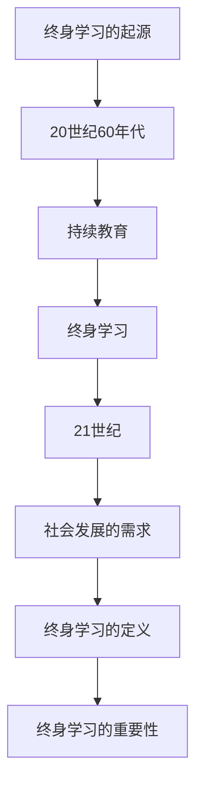

在现代社会，终身学习被赋予了新的内涵。它不仅仅是学习知识，还包括培养创新思维、批判性思维和适应能力。终身学习使个体能够不断适应社会的快速变化，保持竞争力。

### 1.2 终身学习的重要性

#### 1.2.1 在知识经济时代的影响

知识经济时代的特征是信息爆炸和知识更新速度加快。在这个时代，知识的更新速度非常快，新的技术和理论层出不穷。这意味着，如果停止学习，个体将很快被淘汰。因此，终身学习成为知识经济时代的重要应对策略。

**Mermaid流程图：**
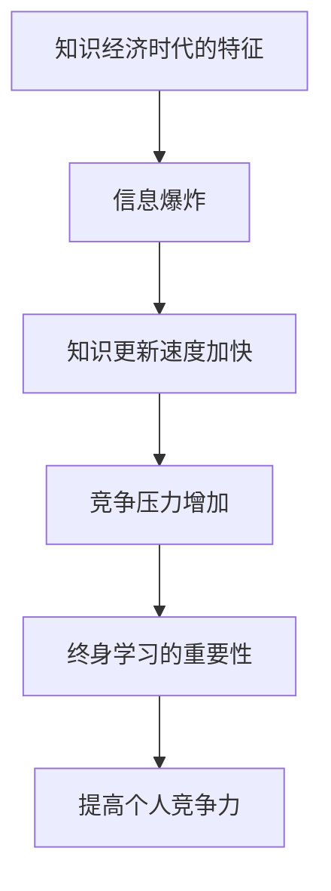

在知识经济时代，终身学习不仅能够帮助个体更新知识，还能提升其创新能力。通过持续学习，个体能够掌握最新的技术和工具，从而在竞争激烈的职场中脱颖而出。

#### 1.2.2 对职业发展的影响

终身学习对职业发展有着深远的影响。随着职业的不断变化，技能需求也在不断变化。终身学习使个体能够及时更新技能，适应新的工作环境。同时，终身学习还能提升个体的职业素养和思维能力，使其在职业发展中更具竞争力。

**Mermaid流程图：**
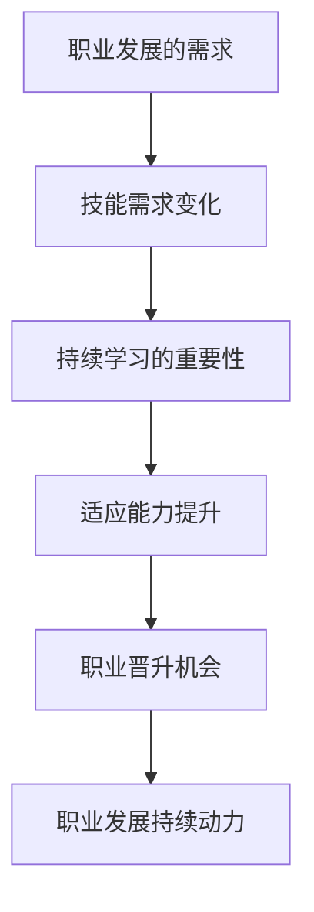

终身学习不仅帮助个体应对职业发展的挑战，还能为其提供持续的职业发展动力。通过不断学习，个体能够保持对职业的热爱和热情，从而在职业道路上走得更远。

#### 1.2.3 对个人成长的影响

终身学习对个人成长也有着重要的影响。通过终身学习，个体能够不断扩展自己的知识领域，提升个人素养。终身学习还能培养个体的批判性思维和创新能力，使其在解决问题和应对挑战时更加得心应手。

**Mermaid流程图：**
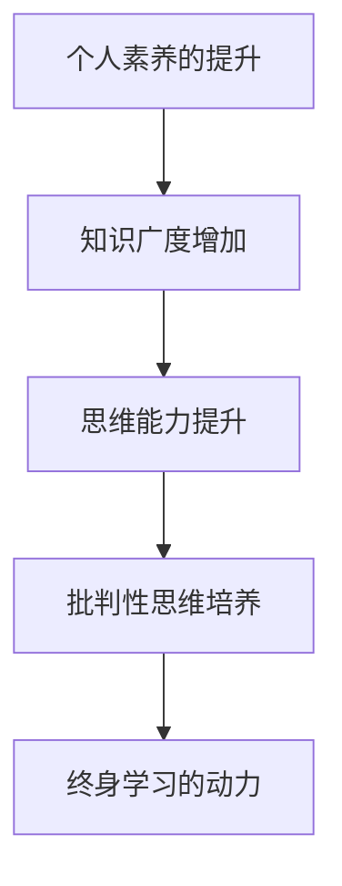

终身学习不仅有助于个体的职业发展，还能促进其个人成长。通过不断学习，个体能够实现自我价值，追求更高的成就和目标。

### 1.3 终身学习与个人成长

#### 1.3.1 提升个人素养

终身学习能够显著提升个人素养。通过不断学习，个体能够扩展自己的知识领域，提升对世界的认知和理解。终身学习还能培养个体的思维能力，使其在面对复杂问题时能够更全面、更深入地思考。

**Mermaid流程图：**

终身学习不仅能够提升个体的知识水平和思维能力，还能培养其批判性思维。批判性思维使个体能够独立思考，不盲目接受信息，从而更好地理解和应对复杂的社会现象。

#### 1.3.2 促进自我实现

终身学习是促进自我实现的重要途径。通过终身学习，个体能够发掘自己的潜能，实现自我价值。终身学习使个体能够不断挑战自我，追求更高的目标和成就。

**Mermaid流程图：**
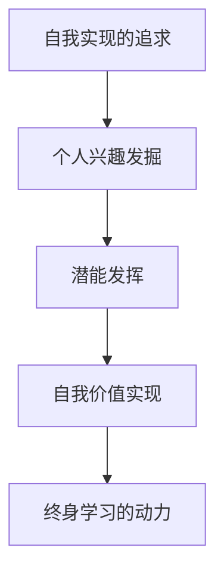

终身学习不仅能够帮助个体实现自我价值，还能激发其对生活的热情和动力。通过不断学习，个体能够更好地理解自己和世界，从而过上更加充实和有意义的生活。

### 总结

终身学习在知识经济时代具有非常重要的意义。它不仅能够提升个人的职业竞争力和个人素养，还能促进自我实现。终身学习使个体能够适应社会的快速变化，保持竞争力。因此，每个人都应该将终身学习作为一种生活方式和价值观，不断追求知识和成长。

## 第2章 知识经济时代的特点与挑战

### 2.1 知识经济时代的定义

知识经济（Knowledge Economy）是相对于传统农业经济和工业经济而言的一种新的经济形态。知识经济以知识和信息为核心资源，通过知识的生产、分配和使用来创造价值。它强调创新、技术和信息的重要性，认为知识是经济增长的主要驱动力。

知识经济的起源可以追溯到20世纪80年代，随着信息技术的飞速发展和互联网的普及，知识经济逐渐成为全球经济的主要形态。在这一时代，知识不仅是生产力的核心要素，更是社会发展的关键资源。

**Mermaid流程图：**
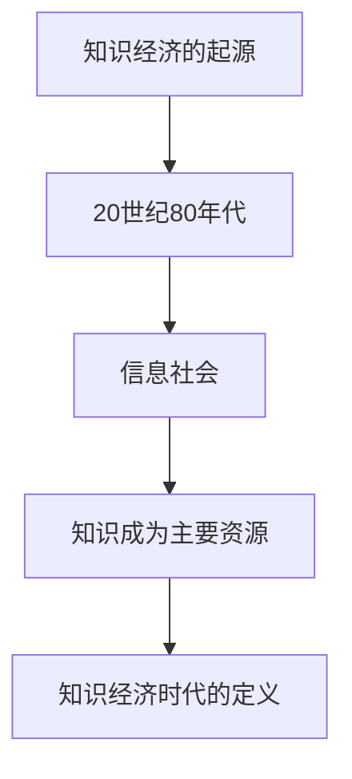

知识经济时代的定义具有以下关键特征：

1. **知识创造价值**：知识成为企业和社会创造价值的主要资源，知识的生产、传播和应用成为经济增长的核心。
2. **创新能力关键**：知识经济的发展依赖于持续的创新，创新成为企业和社会竞争力的关键。
3. **知识传播迅速**：互联网和信息技术的发展使得知识的传播速度大大加快，知识的获取和分享变得更加便捷。

### 2.2 知识经济的特点

#### 2.2.1 知识型经济模式

知识型经济模式是知识经济时代的主要特征之一。在这种模式下，知识的生产、传播和应用成为经济增长的主要驱动力。知识型经济模式具有以下特点：

1. **知识创造价值**：知识成为企业和社会创造价值的主要资源。通过知识的生产和应用，企业能够提高生产效率，创造更多的经济价值。
2. **创新能力关键**：知识经济的发展依赖于持续的创新。创新不仅是企业发展的关键，也是社会进步的重要动力。
3. **知识传播迅速**：互联网和信息技术的发展使得知识的传播速度大大加快，知识的获取和分享变得更加便捷。这为知识的传播和利用提供了广阔的空间。

**Mermaid流程图：**
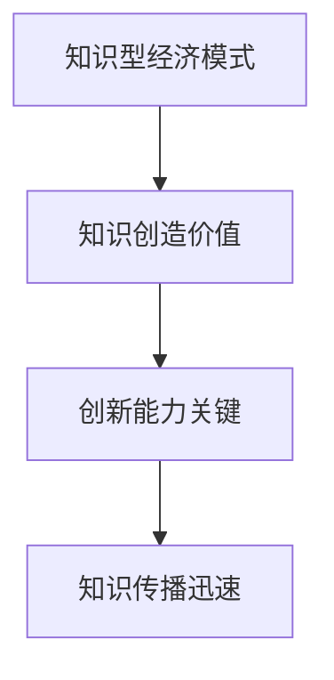

#### 2.2.2 知识经济的挑战

尽管知识经济为经济增长提供了新的机遇，但也带来了许多挑战。知识经济时代的挑战主要表现在以下几个方面：

1. **信息过载**：随着信息的爆炸式增长，个体和组织面临着信息过载的挑战。如何在大量信息中筛选出有价值的信息，成为知识经济时代的重要问题。
2. **知识更新速度**：知识更新速度加快，传统的学习模式难以满足个体和组织的学习需求。如何及时更新知识和技能，保持竞争力，成为知识经济时代的重要挑战。
3. **技能需求多样化**：知识经济时代，技能需求呈现出多样化、专业化的趋势。个体需要不断学习新技能，以适应不断变化的工作环境。

**Mermaid流程图：**
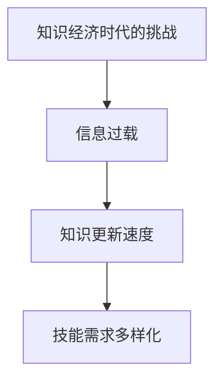

### 2.3 终身学习在知识经济时代的应对策略

终身学习是应对知识经济时代挑战的重要策略。通过终身学习，个体和组织能够及时更新知识和技能，保持竞争力。以下是一些应对策略：

#### 2.3.1 提升学习能力

提升学习能力是终身学习的重要目标之一。个体和组织需要培养主动学习、自主学习的能力，以应对快速变化的知识环境。

**Mermaid流程图：**
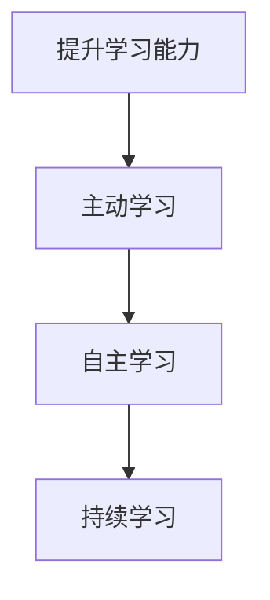

#### 2.3.2 培养适应能力

培养适应能力是终身学习的关键。个体和组织需要具备灵活性、适应性，能够快速适应环境的变化。

**Mermaid流程图：**
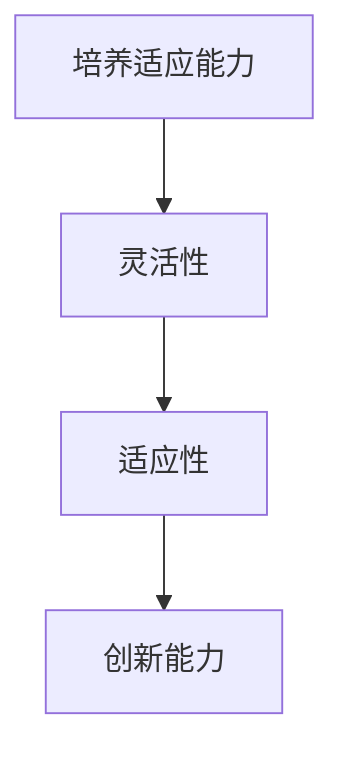

#### 2.3.3 利用学习资源

利用学习资源是终身学习的重要手段。个体和组织需要充分利用各种学习资源，如在线课程、教育机构资源和社会资源，以提高学习效率。

**Mermaid流程图：**
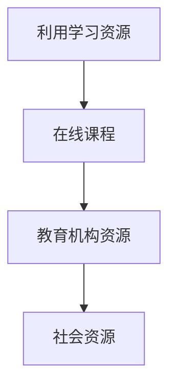

### 总结

知识经济时代为经济增长提供了新的机遇，但同时也带来了许多挑战。终身学习是应对这些挑战的重要策略。通过终身学习，个体和组织能够及时更新知识和技能，保持竞争力。终身学习不仅能够提升个人的职业素养和思维能力，还能促进个人成长和实现自我价值。因此，每个人都应该重视终身学习，将其作为生活方式和价值观，不断追求知识和成长。

## 第3章 终身学习的策略与方法

终身学习是一种持续的过程，它需要我们有明确的目标、有效的策略和高效的方法。在这一章节中，我们将探讨终身学习的具体策略和方法，帮助您在知识经济时代中更好地保持竞争力。

### 3.1 终身学习的目标设定

设定终身学习的目标是非常重要的，因为明确的目标能够引导我们进行有针对性的学习。设定目标可以分为长期目标和短期目标，以下是一些具体的建议：

#### 3.1.1 设定长期与短期目标

**长期目标**：
- 深入理解某一领域的专业知识，成为该领域的专家。
- 拓展知识广度，对多个领域有所了解。
- 培养批判性思维和创新能力。

**短期目标**：
- 学习一门新的编程语言或工具。
- 完成一门在线课程或参加一个研讨会。
- 阅读几本经典的专业书籍。

**Mermaid流程图：**
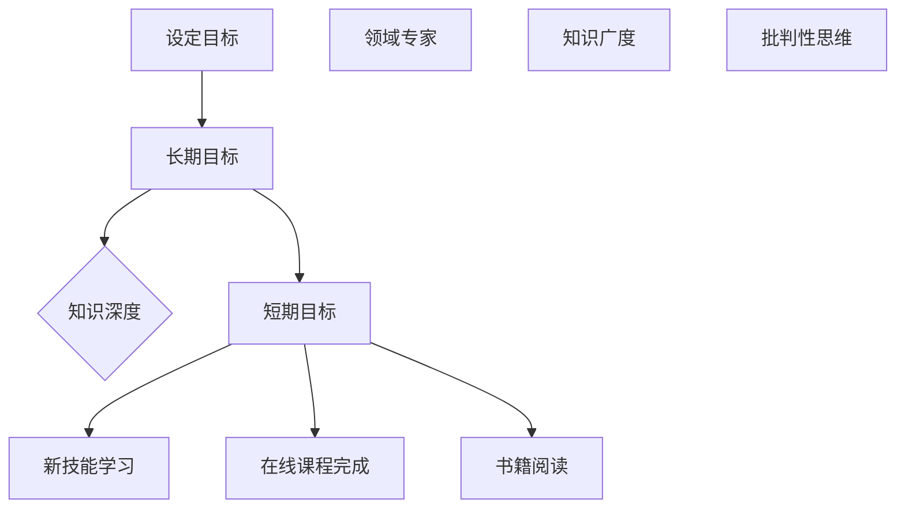

#### 3.1.2 明确学习重点

在设定了目标之后，我们需要明确学习重点。这可以通过以下步骤来实现：

1. **分析知识需求**：根据长期和短期目标，分析自己需要掌握的知识点。
2. **制定学习计划**：将需要学习的知识点列出来，并制定详细的学习计划。
3. **资源整合与利用**：利用各种学习资源，如在线课程、图书、研讨会等，来满足学习需求。

**Mermaid流程图：**
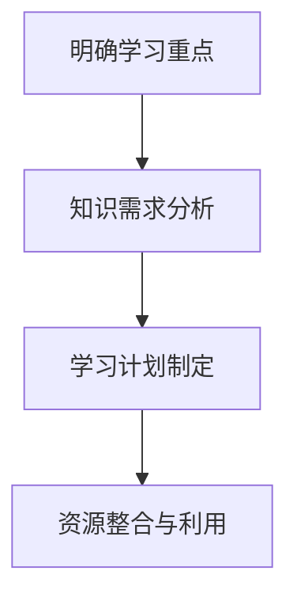

### 3.2 学习资源的选择与利用

选择合适的学习资源是终身学习的重要环节。以下是一些常见的学习资源及其利用方法：

#### 3.2.1 教育机构资源

**在线课程**：
- **利用方法**：选择适合自己的在线课程，制定学习计划，坚持学习。
- **推荐平台**：Coursera、edX、Udemy等。

**研讨会与讲座**：
- **利用方法**：积极参加各类研讨会和讲座，拓宽视野，了解行业动态。
- **推荐平台**：各大高校和研究机构的官方网站。

**学术会议**：
- **利用方法**：关注学术会议，参加相关会议，与专家学者交流。
- **推荐平台**：学术会议官方网站、学术社交平台。

**Mermaid流程图：**
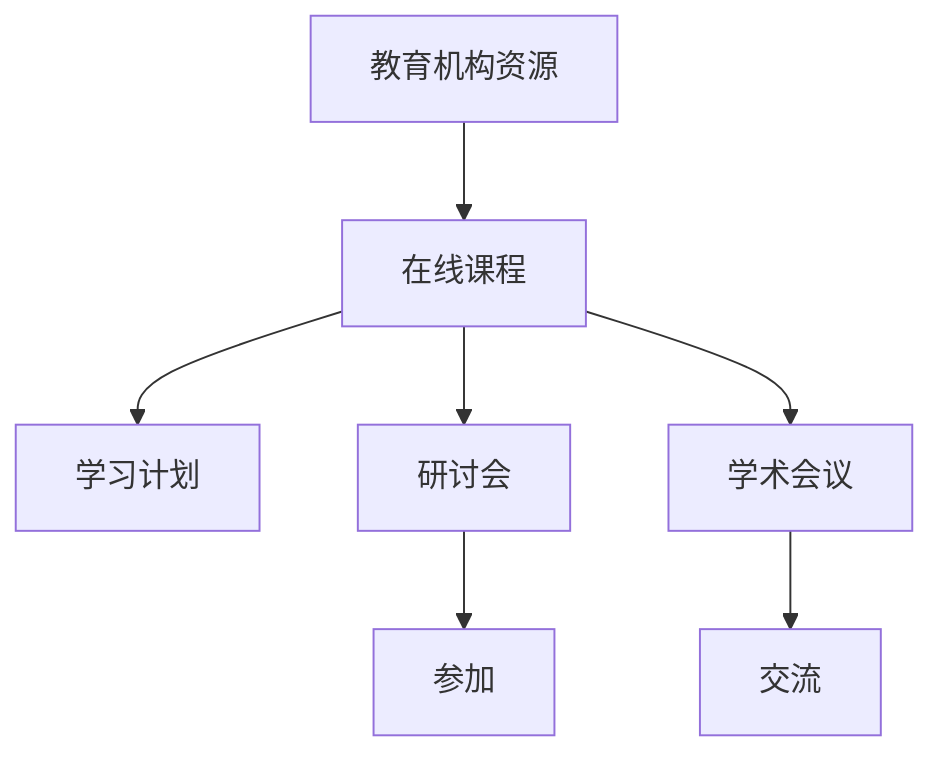

#### 3.2.2 社会资源

**图书与期刊**：
- **利用方法**：定期阅读专业书籍和期刊，获取最新研究成果。
- **推荐平台**：图书馆、在线书店。

**专业社群**：
- **利用方法**：加入专业社群，参与讨论，分享经验。
- **推荐平台**：LinkedIn、GitHub、Stack Overflow等。

**实践项目**：
- **利用方法**：参与实践项目，将所学知识应用于实际工作中。
- **推荐平台**：开源项目、公司内部项目。

**Mermaid流程图：**
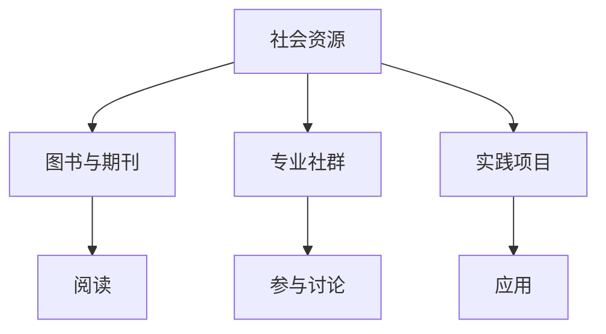

### 3.3 提升学习效率的方法

提升学习效率是终身学习的关键。以下是一些提升学习效率的方法：

#### 3.3.1 时间管理

- **制定时间表**：合理安排学习时间，避免时间浪费。
- **番茄工作法**：将学习时间划分为25分钟的学习和5分钟的休息，提高学习效率。

**Mermaid流程图：**
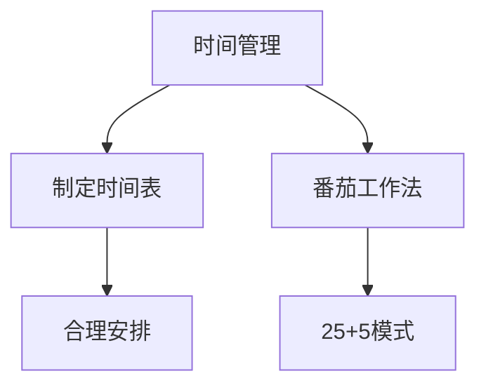

#### 3.3.2 学习环境

- **选择良好的学习环境**：避免干扰，保持专注。
- **利用技术工具**：利用各种学习工具，如笔记软件、在线词典等，提高学习效率。

**Mermaid流程图：**
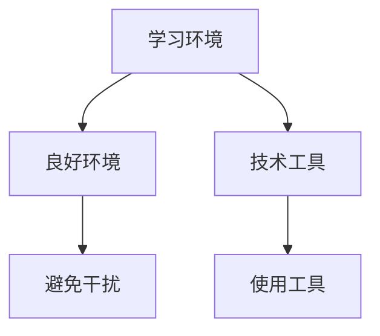

#### 3.3.3 反思与总结

- **定期反思**：定期反思学习过程，总结学习成果，找出不足。
- **持续改进**：根据反思结果，调整学习策略，提高学习效果。

**Mermaid流程图：**
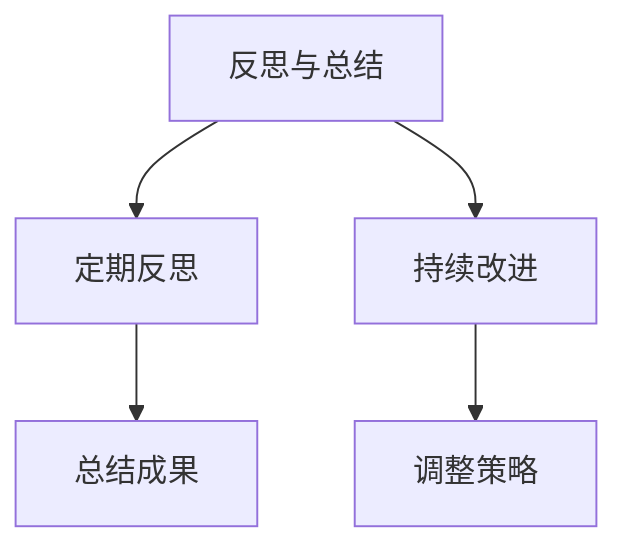

### 总结

终身学习是一种持续的过程，需要我们有明确的目标、有效的策略和高效的方法。通过设定明确的目标、选择合适的学习资源、提升学习效率，我们可以在知识经济时代中更好地保持竞争力，实现个人成长和职业发展。

## 结论

终身学习在知识经济时代的重要性不言而喻。随着技术的飞速发展和知识的不断更新，个体和组织必须具备持续学习的能力，才能在激烈的市场竞争中立于不败之地。本文从多个角度探讨了终身学习的意义，包括其在个人成长、职业发展以及社会进步中的重要作用。

首先，终身学习能够提升个人的职业竞争力和素养，帮助个体适应不断变化的工作环境。其次，终身学习是个人成长的重要途径，通过不断扩展知识广度和深度，个体能够实现自我价值，追求更高的目标。最后，终身学习有助于社会的发展和进步，推动知识的传播和创新，为经济增长提供源源不断的动力。

然而，终身学习并非易事，它需要我们有明确的目标、有效的策略和高效的方法。设定清晰的学习目标、选择合适的学习资源、提升学习效率，这些都是实现终身学习的关键。同时，我们还需要保持持续的热情和动力，不断反思和调整学习策略。

在这个知识爆炸的时代，终身学习已成为一种生活方式和价值观。每个人都应该认识到终身学习的重要性，将其融入日常生活中，不断追求知识和成长。只有这样，我们才能在知识经济时代中保持竞争力，实现个人和社会的可持续发展。

### 作者信息

作者：AI天才研究院/AI Genius Institute & 禅与计算机程序设计艺术 /Zen And The Art of Computer Programming

AI天才研究院（AI Genius Institute）专注于人工智能领域的前沿研究和应用，致力于推动人工智能技术的创新和发展。作者作为该研究院的核心成员，在人工智能、机器学习、自然语言处理等领域具有深厚的理论基础和丰富的实践经验。

《禅与计算机程序设计艺术》（Zen And The Art of Computer Programming）是一本经典的计算机科学著作，作者以其独特的视角和深刻的洞察力，阐述了计算机编程中的哲学和艺术。本书不仅涵盖了计算机编程的核心原理，还融入了禅宗思想，为读者提供了全新的编程思维和哲学观点。作者作为此书的创作者，在计算机科学和教育领域享有极高的声誉。

通过本文，作者希望与广大读者分享终身学习的意义和实践方法，帮助大家更好地理解和应用终身学习理念，在知识经济时代中保持竞争力，实现个人和职业的全面发展。

