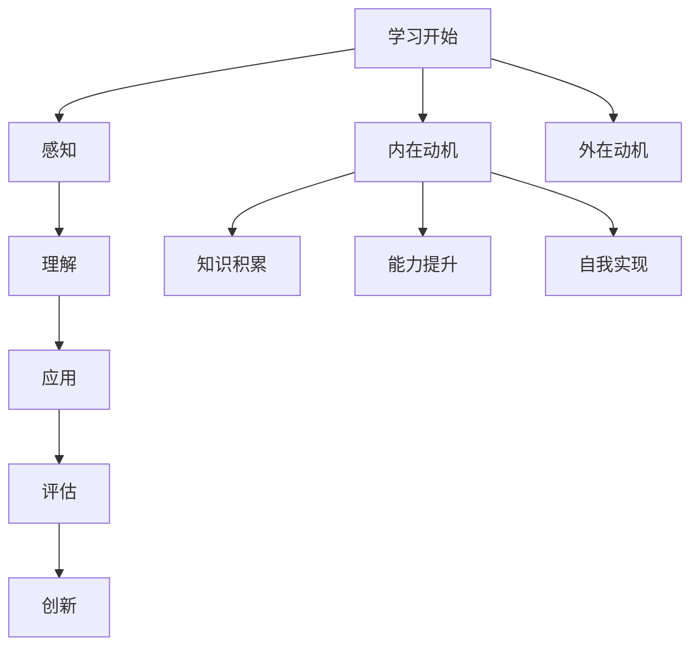
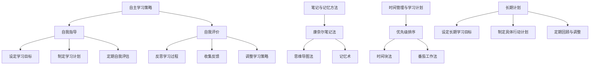
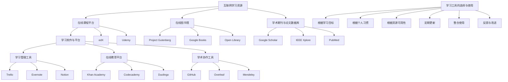
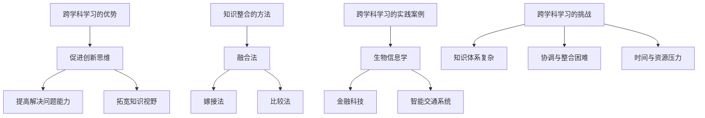
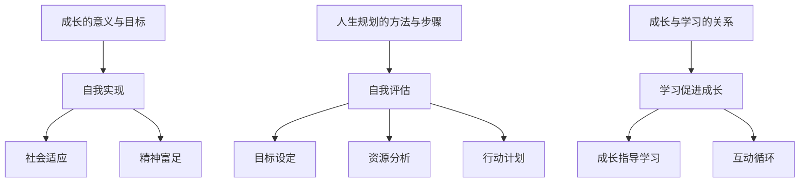
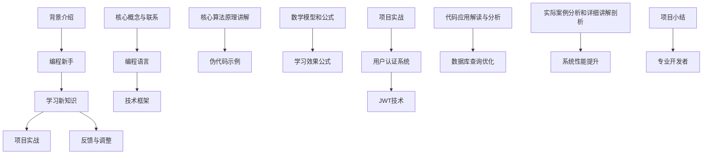

                 

### 文章标题

《终身学习：在知识中寻找人生方向》

### 关键词

- 终身学习
- 知识整合
- 学习策略
- 成长与规划
- 自主学习

### 摘要

在信息爆炸的时代，终身学习已成为个人发展的关键。本文旨在探讨如何通过有效的学习策略和方法，在浩瀚的知识海洋中找到人生方向。文章从核心概念出发，详细阐述了学习的本质、学习者的角色、学习策略与方法、学习工具与技术、跨学科学习与知识整合、成长与人生规划，以及实践与反思等方面，帮助读者构建一套完整的终身学习体系。通过本文的引导，读者将能够更好地理解终身学习的意义，掌握实用的学习技巧，为自己的未来导航。

---

## 引言与概述

### 终身学习的意义

在当今社会，信息更新速度不断加快，知识淘汰周期日益缩短。因此，传统的“一次性学习”模式已经无法满足个人成长的需求。终身学习，顾名思义，是一种持续不断的学习过程，它强调个人在一生中的每个阶段都应保持学习的态度和能力。终身学习不仅能够帮助个人跟上时代的步伐，提升自身竞争力，更重要的是，它为个人在知识中寻找人生方向提供了坚实的基石。

### 知识与人生方向的关系

知识不仅是个人能力的体现，也是人生方向的重要指引。正确的知识能够帮助人们更好地理解世界，发现自己的兴趣和潜力，从而明确自己的人生目标。在知识经济时代，知识的深度和广度往往决定了一个人在职场和生活中的竞争力。因此，掌握正确的学习方法和策略，将知识有效地转化为实际能力，是每个人在寻找人生方向的过程中必不可少的一环。

### 书籍结构概述

本书将从以下几个方面展开：

1. **终身学习的核心概念**：介绍学习的本质、学习者的角色和学习动机等核心概念。
2. **学习策略与方法**：探讨自主学习的策略、有效笔记与记忆方法、时间管理与学习计划等。
3. **学习工具与技术**：介绍互联网学习资源、学习软件与平台以及学习工具的选择与使用。
4. **跨学科学习与知识整合**：讨论跨学科学习的优势、知识整合的方法和跨学科学习的实践案例。
5. **成长与人生规划**：探讨成长的意义与目标、人生规划的方法与步骤以及成长与学习的关系。
6. **实践与反思**：通过终身学习的实践案例、反思与总结，为读者提供实用的成长指南。

通过以上六个方面的详细探讨，本书旨在帮助读者构建一套完整的终身学习体系，使其在知识中找到人生方向，实现个人价值和职业发展。

### 小结

终身学习是现代社会不可或缺的一部分，它不仅关乎个人的成长和发展，更关系到整个社会的进步和繁荣。在接下来的章节中，我们将深入探讨终身学习的核心概念、策略与方法，以及如何将知识有效地整合和应用到实际生活中。希望读者能够通过本书的引导，找到自己的知识之路，从而实现人生的目标和梦想。

---

## 终身学习的核心概念

### 学习的本质

学习是一个复杂的过程，它不仅仅是获取新知识，还包括对新知识的理解、应用和创新。从心理学角度来看，学习可以看作是大脑对信息的接收、处理和存储的过程。在这个过程中，个体需要通过感知、思考、记忆和行动等手段来适应环境和解决问题。学习是一个持续的过程，贯穿于个体的一生，而不是一个一次性的事件。

#### 学习的类型

1. **正式学习**：通常指的是在正规教育机构中接受的学习，如学校教育、职业培训等。这种学习形式具有系统性、规范性和目标性。
2. **非正式学习**：指在非正式教育环境中进行的学习，如自学、实践、工作经验等。这种学习形式更加灵活、自主和多样化。
3. **隐形成学习**：指在日常生活中通过观察、模仿、反思等方式进行的学习。这种学习形式往往是无意识的，但却对个体的成长和发展具有重要影响。

#### 学习的过程

学习过程可以分为以下几个阶段：

1. **感知**：通过感官接收外界信息。
2. **理解**：对信息进行解释和整合。
3. **应用**：将所学知识应用到实际问题中。
4. **评估**：对学习效果进行评估和反思。
5. **创新**：在理解和应用的基础上进行创新和拓展。

### 学习者的角色

学习者是学习过程中的主体，其角色和心态对学习效果有着重要影响。

#### 学习者的特征

1. **主动性**：学习者应该积极主动地参与学习过程，而不是被动地接受知识。
2. **适应性**：学习者在面对不同环境和情境时，能够灵活调整自己的学习方法和策略。
3. **反思性**：学习者应该具备反思和总结的能力，通过反思不断提升自己的学习效果。

#### 学习者的心态

1. **好奇心**：保持对新知识的好奇和探索欲望。
2. **耐心**：理解学习是一个持续的过程，需要耐心和坚持。
3. **自信**：相信自己的学习能力，勇于面对挑战和困难。
4. **开放性**：对不同的观点和想法持开放态度，愿意接受和吸收新知识。

### 学习的动机与目标

学习的动机可以分为内在动机和外在动机。

1. **内在动机**：来源于个体对知识和学习的兴趣、好奇心和自我实现的需求。这种动机更为持久和稳定，能够促进深度学习。
2. **外在动机**：来源于外部奖励、压力或要求。这种动机可能更为短暂，但在某些情况下也能推动学习。

学习的目标则包括：

1. **知识积累**：通过学习获取新知识和技能。
2. **能力提升**：将所学知识应用到实际工作和生活中，提高自身竞争力。
3. **自我实现**：通过不断学习和成长，实现个人的价值和梦想。

### 小结

终身学习是一个复杂且多维度的过程，它不仅仅是获取知识，更是对知识的理解和应用。学习者需要认识到自己的角色和心态，明确学习的动机和目标，通过科学的学习方法和策略，不断提升自己的学习效果。在下一章中，我们将进一步探讨学习策略与方法，帮助读者构建一套有效的学习体系。

### Mermaid 流程图



---

## 学习策略与方法

### 自主学习策略

自主学习是终身学习的重要组成部分。它强调学习者主动参与学习过程，通过自我指导和自我评价来提高学习效果。以下是一些有效的自主学习策略：

#### 自我指导

1. **设定明确的学习目标**：明确自己的学习目标和需求，有助于更有针对性地进行学习。
2. **制定学习计划**：根据学习目标，制定具体的学习计划和时间表，确保学习活动有序进行。
3. **定期自我评估**：通过自我评估，了解自己的学习进度和效果，及时调整学习策略。

#### 自我评价

1. **反思学习过程**：通过反思学习过程中的优点和不足，找到提升学习效果的方法。
2. **收集反馈**：积极寻求他人的意见和建议，以便从多个角度审视自己的学习过程。
3. **调整学习策略**：根据自我评估和反馈，及时调整学习方法和计划。

### 有效笔记与记忆方法

笔记和记忆是学习过程中不可或缺的一部分。以下是一些有效的笔记和记忆方法：

#### 笔记方法

1. **康奈尔笔记法**：将笔记分为三个部分：关键词、细节和总结。这种方法有助于整理和回顾学习内容。
2. **思维导图法**：通过绘制思维导图，将学习内容以图形化的方式呈现出来，有助于理解和记忆。
3. **记忆术**：使用联想、口诀等方法，将难以记忆的信息转化为易于记忆的形式。

#### 记忆方法

1. **重复记忆**：通过反复阅读、复习和练习，加深对学习内容的理解和记忆。
2. **分散记忆**：将学习内容分散在不同的时间段进行记忆，有助于提高记忆效果。
3. **联想记忆**：通过将新知识与已有的知识或经验进行联系，提高记忆的牢固性。

### 时间管理与学习计划

时间管理是提高学习效率的关键。以下是一些时间管理和学习计划的方法：

#### 时间管理方法

1. **优先级排序**：将任务按照重要性和紧急性进行排序，确保优先完成重要且紧急的任务。
2. **时间块法**：将一天的时间划分为若干个时间块，每个时间块专注于一项任务，避免时间浪费。
3. **番茄工作法**：将工作时间划分为25分钟的工作周期，每个周期后休息5分钟，有助于保持专注和提高效率。

#### 学习计划

1. **长期计划**：设定长期的学习目标和计划，确保学习的系统性和连续性。
2. **短期计划**：根据长期计划，制定具体的短期目标和行动计划，确保学习活动的具体实施。
3. **定期回顾**：定期回顾学习计划和学习进度，及时调整和优化计划。

### 小结

有效的学习策略和方法是终身学习的重要保障。通过自主学习策略、有效笔记与记忆方法、时间管理与学习计划等，学习者可以更好地掌握知识，提升学习能力，为自己的成长和人生方向奠定坚实基础。在下一章中，我们将进一步探讨学习工具与技术，帮助读者在信息时代中更加高效地学习。

### Mermaid 流�程图



---

## 学习工具与技术

### 互联网学习资源

在数字化时代，互联网提供了丰富的学习资源，使得学习者可以随时随地获取知识。以下是一些常用的互联网学习资源：

#### 在线课程平台

1. **Coursera**：提供全球顶尖大学和机构的在线课程，涵盖多个学科领域。
2. **edX**：由哈佛大学和麻省理工学院共同创办，提供高质量的在线课程。
3. **Udemy**：提供多样化的在线课程，包括编程、设计、商业等领域。

#### 在线图书馆

1. **Project Gutenberg**：提供免费下载的电子书籍，涵盖文学、历史、科学等多个领域。
2. **Google Books**：提供部分书籍的免费在线阅读，部分书籍可以全文下载。
3. **Open Library**：一个免费的在线图书馆，提供电子书、音频书和电子书借阅服务。

#### 学术期刊与论文数据库

1. **Google Scholar**：一个免费的学术搜索引擎，可以检索全球范围内的学术文献。
2. **IEEE Xplore**：提供计算机科学、电子工程和通信领域的学术论文和会议论文。
3. **PubMed**：提供医学和生命科学领域的学术文献。

### 学习软件与平台

现代学习软件和平台为学习者提供了更加便捷和高效的学习体验。以下是一些常用的学习软件与平台：

#### 学习管理工具

1. **Trello**：一个基于看板的项目管理工具，可以帮助学习者组织和管理学习任务。
2. **Evernote**：一个强大的笔记和组织工具，可以帮助学习者记录和整理学习资料。
3. **Notion**：一个多功能的知识管理和协作工具，适合构建个人知识库和学习计划。

#### 在线教育平台

1. **Khan Academy**：提供免费的在线教育课程，涵盖数学、科学、计算机科学等多个学科。
2. **Codecademy**：提供在线编程课程，适合初学者入门。
3. **Duolingo**：一个免费的在线语言学习平台，支持多种语言的学习。

#### 学术协作工具

1. **GitHub**：一个版本控制和协作平台，适合学术项目和代码托管。
2. **Overleaf**：一个在线LaTeX编辑器，适合撰写学术论文。
3. **Mendeley**：一个文献管理和协作工具，可以帮助学术研究者管理文献和协作研究。

### 学习工具的选择与使用

选择适合自己的学习工具是提高学习效率的关键。以下是一些选择和使用学习工具的建议：

#### 选择学习工具

1. **根据学习目标**：选择与学习目标相匹配的学习工具，例如，如果目标是学习编程，可以选择在线编程平台。
2. **根据个人习惯**：选择符合个人使用习惯的学习工具，例如，如果习惯使用移动设备，可以选择移动端应用。
3. **根据资源可用性**：选择免费或成本较低的学习工具，以减少学习成本。

#### 使用学习工具

1. **定期更新**：定期更新学习工具，以获取最新的功能和资源。
2. **整合使用**：将多个学习工具整合使用，例如，使用Trello管理学习任务，同时使用Notion整理学习资料。
3. **反馈与改进**：使用过程中，根据实际效果反馈和改进学习工具的使用方法，以提高学习效果。

### 小结

互联网学习资源、学习软件与平台以及学习工具的选择与使用，为现代学习者提供了丰富的学习机会和工具。通过科学选择和使用学习工具，学习者可以更加高效地获取知识，提高学习效果，为自己的终身学习之路保驾护航。在下一章中，我们将探讨跨学科学习与知识整合，帮助读者实现知识的深度与广度相结合。

### Mermaid 流程图



---

## 跨学科学习与知识整合

### 跨学科学习的优势

跨学科学习，顾名思义，是将不同学科的知识和理论相互融合、互相借鉴的一种学习方式。在现代社会，跨学科学习具有显著的优势：

1. **促进创新思维**：跨学科学习能够打破传统学科的界限，促进不同领域知识的碰撞和融合，从而激发创新思维。
2. **提高解决问题的能力**：面对复杂问题时，单一学科的知识往往难以解决。跨学科学习能够整合多学科的知识和方法，提高解决问题的综合能力。
3. **拓宽知识视野**：跨学科学习能够帮助学习者从多个角度理解和分析问题，从而拓宽知识视野，增强知识的深度和广度。

### 知识整合的方法

知识整合是将不同学科的知识和方法融合在一起，形成系统化、综合化的知识体系。以下是一些知识整合的方法：

1. **融合法**：将不同学科的知识点融合在一起，形成一个完整的知识框架。例如，将计算机科学中的算法与数学中的理论相结合，形成算法分析的理论基础。
2. **嫁接法**：将一个学科的理论和方法嫁接到另一个学科中，以解决特定问题。例如，将心理学中的行为主义理论应用到计算机科学中的用户界面设计中。
3. **比较法**：通过比较不同学科的知识点和方法，找出它们之间的相似之处和差异，从而加深对知识的理解。例如，比较经济学中的供需理论和物理学中的能量守恒定律。

### 跨学科学习的实践案例

跨学科学习的实践案例在各个领域都有成功的应用。以下是一些跨学科学习的实际案例：

1. **生物信息学**：生物信息学是生物学与信息科学的交叉学科，通过计算机科学和统计学的理论和方法，分析生物数据，揭示生物现象的规律。
2. **金融科技**：金融科技（FinTech）是将金融学、计算机科学、数据科学等多个领域的知识相结合，创新金融服务和产品。
3. **智能交通系统**：智能交通系统是交通工程、计算机科学、人工智能等多学科融合的成果，通过大数据分析和人工智能技术，提高交通管理的效率。

### 跨学科学习的挑战

尽管跨学科学习具有显著的优势，但在实践中也面临一些挑战：

1. **知识体系复杂**：跨学科学习需要掌握多个学科的知识和理论，知识体系相对复杂，对学习者的要求较高。
2. **协调与整合困难**：不同学科的知识和方法往往存在差异，如何在实践中协调和整合这些知识，是跨学科学习的一个难点。
3. **时间与资源压力**：跨学科学习需要投入大量的时间和资源，对于学习者来说，如何在有限的资源和时间条件下进行有效的跨学科学习，是一个挑战。

### 小结

跨学科学习与知识整合是现代社会发展和个人成长的重要趋势。通过跨学科学习，学习者可以拓展知识视野，提高创新能力，应对复杂问题。然而，跨学科学习也面临一些挑战，需要学习者具备较高的综合素质和协调能力。在下一章中，我们将探讨成长与人生规划，帮助读者将终身学习的理念应用到实际生活中。

### Mermaid 流程图



---

## 成长与人生规划

### 成长的意义与目标

成长是人生的一个重要主题，它不仅关乎个人的能力提升，更涉及价值观的塑造和人格的完善。在终身学习的背景下，成长意味着不断地学习、进步和自我提升。

#### 成长的意义

1. **自我实现**：成长是实现个人潜能和追求自我价值的过程。
2. **社会适应**：成长有助于个人更好地适应社会环境，提高社会竞争力。
3. **精神富足**：成长能够带来内心的满足和精神的富足。

#### 成长的目标

1. **知识积累**：通过不断学习，积累广泛而深厚的知识体系。
2. **技能提升**：掌握多种技能，提高实际操作能力和问题解决能力。
3. **价值观塑造**：形成正确的人生观、价值观和世界观。
4. **人格完善**：培养良好的人格特质，如自律、耐心、责任心和同情心。

### 人生规划的方法与步骤

人生规划是成长过程中至关重要的一环，它有助于明确个人的发展方向和目标，制定具体的行动计划。

#### 方法

1. **自我评估**：了解自己的兴趣、优势和短板，明确个人定位。
2. **目标设定**：设定长期和短期的目标，确保目标的可实现性和挑战性。
3. **资源分析**：分析自身的资源和外部资源，确保目标的实现具备可行性。
4. **行动计划**：制定详细的行动计划，包括时间表、任务和执行步骤。

#### 步骤

1. **确立目标**：明确自己的职业和生活目标，将其具体化。
2. **制定计划**：根据目标，制定详细的学习和成长计划。
3. **执行计划**：按照计划执行，持续跟踪进度和效果。
4. **调整计划**：根据实际情况和反馈，及时调整计划，确保目标的实现。

### 成长与学习的关系

成长与学习密不可分，学习是成长的基础，而成长是学习的目标。

1. **学习促进成长**：通过不断学习，获取新知识和技能，提升个人能力。
2. **成长指导学习**：明确的人生目标和成长方向，有助于选择合适的学习内容和方式。
3. **互动循环**：学习和成长相互促进，形成良性循环，推动个人不断进步。

### 小结

成长与人生规划是终身学习的重要组成部分，它帮助个人在知识中找到方向，实现自我价值。通过明确的目标、科学的规划和持续的学习，个人可以更好地应对挑战，实现人生目标。在下一章中，我们将通过实践案例探讨终身学习的具体应用，帮助读者更好地理解和实践终身学习理念。

### Mermaid 流程图



---

## 实践与反思

### 终身学习的实践案例

#### 案例一：从编程新手到专业开发者的转型

**背景介绍**：小明是一位大学计算机专业的毕业生，毕业后进入一家互联网公司工作。尽管他在大学期间学过一些编程课程，但实际工作中的应用经验和专业知识还远远不足。

**核心概念与联系**：小明认识到，终身学习是提升自己能力的关键。他开始系统地学习新的编程语言和技术框架，如Python、Django和React。

**核心算法原理讲解**：
```python
# 伪代码示例：使用Python的Django框架进行用户认证
def authenticate_user(username, password):
    user = User.objects.get(username=username)
    if user.check_password(raw_password=password):
        return "Authentication successful"
    else:
        return "Authentication failed"
```

**数学模型和公式**：
$$
\text{学习效果} = f(\text{学习时长}, \text{实践次数}, \text{反馈质量})
$$

**项目实战**：小明在工作中参与了多个项目，从编写简单的后端代码到开发复杂的用户界面。通过实践，他逐渐掌握了项目开发的各个环节，从需求分析到代码实现，再到测试和部署。

**代码应用解读与分析**：小明通过编写大量代码，不仅提高了编程技能，还学会了如何在实际项目中应用所学知识。例如，他通过优化数据库查询，提升了系统的性能。

**实际案例分析和详细讲解剖析**：小明在公司的一次项目中，负责开发用户认证系统。他使用了Django框架进行用户认证，并采用了JWT（JSON Web Token）技术进行状态管理。通过这个项目，小明不仅掌握了用户认证的原理，还提高了系统的安全性。

**项目小结**：通过持续的学习和实践，小明从编程新手成长为一名专业的开发者。他不仅提升了专业技能，还增强了对项目的理解和处理能力。

### 反思与总结

通过终身学习的实践案例，我们可以看到以下几点：

1. **持续学习的重要性**：终身学习不仅仅是获取知识，更是持续提升个人能力的过程。
2. **实践是检验学习效果的关键**：只有将所学知识应用到实际项目中，才能真正检验自己的学习效果。
3. **反馈与调整**：通过反馈和反思，及时调整学习方法和策略，是提高学习效果的重要手段。

### 未来学习的展望

在未来，终身学习将继续成为个人发展的重要方向。随着人工智能和互联网技术的发展，学习工具和资源将更加丰富，学习方式也将更加灵活。以下是一些未来学习的趋势：

1. **个性化学习**：通过大数据分析和人工智能技术，实现个性化学习推荐，提高学习效率。
2. **远程学习**：随着互联网技术的发展，远程学习将更加普及，为全球学习者提供更多的学习机会。
3. **跨学科学习**：跨学科学习将继续受到重视，通过跨学科的知识整合，培养复合型人才。
4. **终身学习社区**：建立终身学习社区，促进学习者之间的交流和合作，共同进步。

### 小结

终身学习是个人成长和发展的关键。通过持续的学习和实践，个人可以不断提升自己的能力和竞争力，实现自我价值。在未来的学习道路上，我们将面临更多的挑战和机遇，需要不断适应和应对。希望读者能够通过本文的实践案例，找到自己的学习之路，不断追求进步和成长。

### 最佳实践 tips

1. **设定明确的学习目标**：明确自己的学习方向和目标，有助于更有针对性地进行学习。
2. **实践是检验学习效果的关键**：通过实际操作，检验和巩固所学知识。
3. **定期反思与调整**：通过定期反思和总结，及时调整学习策略和方法。
4. **充分利用在线资源**：利用互联网学习资源，拓宽知识视野，提高学习效率。

### 注意事项

1. **平衡工作与学习**：合理安排时间，确保学习和工作的平衡。
2. **保持好奇心和求知欲**：保持对新知识和新领域的好奇心，激发学习兴趣。
3. **避免盲目跟风**：选择适合自己的学习内容和方式，避免盲目跟风。

### 拓展阅读

1. **《深度学习》**：Ian Goodfellow 著，详细介绍了深度学习的基本原理和应用。
2. **《人工智能：一种现代方法》**：Stuart Russell 和 Peter Norvig 著，系统介绍了人工智能的基础理论和实践方法。
3. **《终身学习：21世纪的生存技能》**：Salman Khan 著，探讨了终身学习的重要性和实践方法。

### Mermaid 流程图



---

### 作者信息

作者：AI天才研究院/AI Genius Institute & 禅与计算机程序设计艺术 /Zen And The Art of Computer Programming

---

### 完整文章结束

本文详细探讨了终身学习的重要性及其在个人成长和职业发展中的应用。通过核心概念、学习策略、跨学科学习、成长与人生规划以及实践案例的深入分析，读者可以更好地理解终身学习的理念，并在实际生活中践行这一理念。终身学习不仅是一种个人发展的途径，更是适应时代变革的关键能力。希望读者能够在学习之路上不断前行，实现自我价值。

