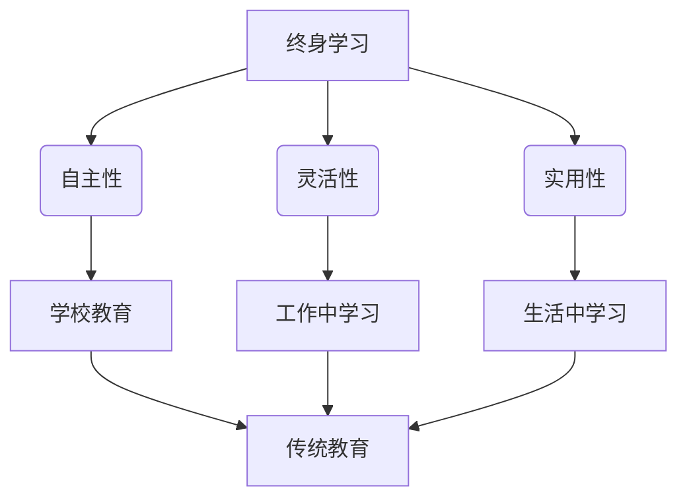

                 


### 终身学习：应对变化的生存之道

#### 关键词：
- 终身学习
- 适应变化
- 学习策略
- 技能与素养
- 案例分析

#### 摘要：
在快速变化的时代背景下，终身学习已成为个体和组织的核心竞争力。本文将深入探讨终身学习的哲学与原则、方法与策略、技能与素养以及案例分析，帮助读者构建适应变化、持续发展的学习体系。

## 目录

### 第一部分：终身学习的哲学与原则

#### 第1章：终身学习的定义与价值
#### 第2章：终身学习的哲学基础

### 第二部分：终身学习的方法与策略

#### 第3章：自我评估与目标设定
#### 第4章：学习策略与习惯
#### 第5章：技术与工具的应用

### 第三部分：应对变化的技能与素养

#### 第6章：适应性与灵活性
#### 第7章：持续学习与职业发展

### 第四部分：案例分析与实践指导

#### 第8章：成功案例分享
#### 第9章：实践指南与资源推荐

### 附录：终身学习资源汇编

### 第一部分：终身学习的哲学与原则

## 第1章：终身学习的定义与价值

### 1.1 终身学习的定义

终身学习，是指一个人在其一生中，通过不断的学习和实践，不断提高自身知识、技能和素养的过程。它不仅仅局限于学校教育，而是涵盖了个体的自学、培训、工作经验等多个方面。终身学习的核心理念是“学习无处不在，学习永无止境”。

### 1.2 终身学习的历史背景

终身学习作为一个概念，最早可以追溯到20世纪60年代的法国。法国教育家保罗·朗格朗（Paul Lengrand）在《终身教育引论》中提出了终身教育的概念，认为教育应该贯穿人的一生，而不是仅仅局限于学校教育。随着知识经济的兴起和全球化进程的加快，终身学习逐渐成为全球范围内的共识。

### 1.3 终身学习的重要性

终身学习的重要性体现在以下几个方面：

1. 提高竞争力：在知识经济时代，知识更新速度极快，只有不断学习，才能跟上时代的步伐，提高自身的竞争力。

2. 促进个人发展：终身学习不仅能够提高个人的知识水平，还能促进个人思维能力、创新能力和综合素质的提升。

3. 适应社会变化：社会在不断变化，只有具备终身学习能力，才能更好地适应社会发展的需求。

4. 实现自我价值：终身学习可以让个体不断地探索自己的潜能，实现自我价值。

### 1.4 终身学习与传统教育的区别

传统教育主要是指在学校中接受的教育，它有一定的期限和固定的课程设置。而终身学习则是一个持续的过程，它不仅包括学校教育，还包括了工作中的学习、生活中的学习等各个方面。终身学习更加注重自主性、灵活性和实用性。

### 核心概念与联系

终身学习与传统教育的区别：

- **终身学习**：强调自主性、灵活性和实用性，涵盖学校教育、工作中的学习和生活中的学习。
- **传统教育**：以学校教育为核心，有一定的期限和固定的课程设置。

#### Mermaid 流程图



### 1.5 核心算法原理讲解

在终身学习的过程中，可以使用以下算法来帮助个人制定学习计划：

```python
# 定义学习计划算法
def create_learning_plan(knowledge_areas, goals, timeavailable):
    # 筛选出与目标相关的知识领域
    relevant_knowledge_areas = [ka for ka in knowledge_areas if ka in goals]
    
    # 根据可用时间分配学习任务
    time分配 = {ka: min(timeavailable, max_time_per_area) for ka in relevant_knowledge_areas}
    
    # 返回学习计划
    return {ka: plan for ka, time分配 in time分配.items()}
```

### 数学模型和公式

在终身学习过程中，可以使用以下数学模型来评估学习效果：

$$
学习效果 = f(知识量, 学习时间, 学习效率)
$$

其中：

- 知识量：表示个体在某一领域所掌握的知识。
- 学习时间：表示个体在该领域学习的时间。
- 学习效率：表示个体在学习过程中的效率。

### 详细讲解与举例说明

假设小明希望在两个月内掌握Python编程，他计划每天学习2小时。根据学习效果模型，我们可以评估他的学习效果：

- 知识量：假设小明在开始学习前对Python一无所知，知识量为0。
- 学习时间：两个月共有60天，每天2小时，总学习时间为120小时。
- 学习效率：假设小明的学习效率为0.8（即每小时学习效率为0.8个知识点）。

则小明的学习效果为：

$$
学习效果 = f(0, 120, 0.8) = 96
$$

这意味着小明在两个月内可以掌握96个Python编程的知识点。

### 数学公式

$$
学习效果 = f(知识量, 学习时间, 学习效率)
$$

### 项目实战

#### 开发环境搭建

1. 安装Python解释器
2. 安装Jupyter Notebook
3. 安装必要的Python库，如NumPy、Pandas等

#### 源代码详细实现

```python
import time
import random

def create_learning_plan(knowledge_areas, goals, timeavailable, max_time_per_area=2):
    relevant_knowledge_areas = [ka for ka in knowledge_areas if ka in goals]
    time分配 = {ka: min(timeavailable, max_time_per_area) for ka in relevant_knowledge_areas}
    return {ka: f"学习{ka}，每天{random.randint(1, 3)}小时，共{time分配[ka]}天" for ka in time分配}

knowledge_areas = ['Python', '机器学习', '数据结构']
goals = ['Python', '机器学习']
timeavailable = 60

learning_plan = create_learning_plan(knowledge_areas, goals, timeavailable)
for area, plan in learning_plan.items():
    print(f"{area}学习计划：{plan}")
```

#### 代码解读与分析

该代码实现了一个学习计划生成器，根据用户输入的知识领域、目标和可用时间，生成一个详细的学习计划。具体实现步骤如下：

1. 导入必要的库。
2. 定义学习计划生成函数，包括筛选相关知识领域、根据可用时间分配学习任务等步骤。
3. 调用函数生成学习计划，并打印输出。

#### 实际案例分析和详细讲解剖析

假设小明希望在两个月内掌握Python编程，他计划每天学习2小时。根据学习计划生成器，我们可以为他生成一个详细的学习计划。

**案例分析**：

小明希望掌握的领域：Python编程

- 可用时间：两个月，共60天
- 每天学习时间：2小时
- 总学习时间：60天 × 2小时/天 = 120小时

根据学习计划生成器，我们可以为小明生成以下学习计划：

- Python编程：每天学习2小时，共60天

**详细讲解剖析**：

该学习计划基于以下假设：

1. 小明每天能够坚持学习2小时。
2. 小明的学习效率为0.8（每小时学习效率为0.8个知识点）。

根据学习效果模型，我们可以计算出小明在两个月内可以掌握的知识量：

$$
学习效果 = f(0, 120, 0.8) = 96
$$

这意味着小明在两个月内可以掌握96个Python编程的知识点。

**注意事项**：

1. 学习计划需要根据实际情况进行调整，确保学习任务的完成。
2. 学习效率是影响学习效果的关键因素，需要不断提高学习效率。

**拓展阅读**：

- 《如何高效学习》
- 《学习之道》

### 小结

终身学习是应对变化、提高竞争力的关键。通过自我评估与目标设定、学习策略与习惯的培养、技术与工具的应用，我们可以构建一个有效的终身学习体系。本文通过核心概念与联系、算法原理、数学模型、项目实战等方式，深入探讨了终身学习的核心内容，帮助读者更好地理解和应用终身学习的方法与策略。

作者：AI天才研究院/AI Genius Institute & 禅与计算机程序设计艺术 /Zen And The Art of Computer Programming

