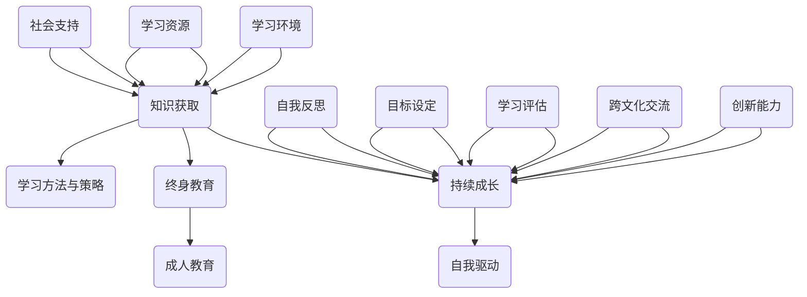

                 

### 引言

在信息技术迅猛发展的今天，知识更新的速度前所未有地加快，传统的单次学习和一次性获取知识的模式已难以满足个体和社会的需求。终身学习（Lifelong Learning）因此成为现代教育的重要理念之一。终身学习不仅关注个人职业生涯中的技能提升，更强调知识体系的不断更新和完善，从而实现个体在快速变化的社会中持续成长与进步。

本文旨在探讨终身学习在知识获取中的持续成长与意义。首先，我们将介绍终身学习的背景和重要性，探讨其在现代社会中的角色。随后，文章将深入分析终身学习的基本概念、核心原则和架构，帮助读者理解其内在逻辑和运作机制。通过详细的伪代码和数学模型解释，我们将剖析终身学习算法的设计原理和实现方法。同时，文章还将通过实际项目案例，展示终身学习理论在实践中的应用和价值。

最后，本文将总结终身学习的重要性，并展望其未来发展，提出一些最佳实践和注意事项，以帮助读者更好地实践终身学习理念。通过本文的探讨，我们希望读者能够认识到终身学习不仅仅是个人发展的需求，更是社会进步和科技创新的重要推动力。

关键词：终身学习、知识获取、持续成长、核心原则、算法原理、项目案例、最佳实践

摘要：本文深入探讨了终身学习在知识获取中的持续成长与意义。通过背景介绍、概念解析、算法解释、项目案例和总结展望，本文全面阐述了终身学习的理念、架构和实际应用，强调了其在现代社会中的重要性。文章不仅为读者提供了理论上的指导，还通过实际案例展示了终身学习如何助力个人和社会的发展。

## 背景介绍

终身学习理念的兴起源于现代社会知识更新速度的急剧加快。在信息化和全球化的背景下，技术的变革、行业的转型和社会的演进速度越来越快，传统的教育模式已经难以适应这一变化。传统的教育体系往往侧重于在有限的时间内传授固定的知识和技能，忽视了个体在职业发展和个人成长过程中持续学习和适应变化的需求。

首先，知识更新速度的加快是推动终身学习理念产生的主要原因之一。据统计，现代科技知识的半衰期已经从20世纪中期的50年缩短至不足5年。这意味着，一个专业人士如果在职业生涯中停止学习，很快就会面临知识过时的风险。例如，在计算机科学领域，每年都会诞生大量新的研究成果和技术突破，如深度学习、人工智能、量子计算等，这些新技术的涌现不仅改变了原有的技术架构，还创造了新的职业机会和挑战。

其次，职业发展的需求也是促使终身学习理念普及的重要原因。在竞争激烈的职场环境中，个体要想保持竞争力，必须不断更新和提升自身的知识和技能。例如，数据科学家需要掌握最新的数据分析工具和算法，软件工程师需要不断学习新的编程语言和框架，项目经理需要了解新兴的项目管理方法和工具。这些要求使得职业人士不得不将终身学习视为一种持续的工作习惯。

此外，社会变革和全球化趋势也推动了终身学习理念的普及。随着全球化进程的加速，不同国家和地区的文化、经济和技术交流越来越频繁，这要求个体具备跨文化的沟通能力和全球视野。终身学习不仅帮助个体提升专业知识和技能，还能增强他们的跨文化适应能力和创新能力，从而在全球化背景下更好地实现个人价值。

在终身学习理念的推动下，教育体系也在发生深刻变革。传统的学校教育模式已经无法满足终身学习的需求，教育工作者开始探索更加灵活和多样化的学习模式，如在线教育、混合式学习、职业培训等。这些新型教育模式不仅提供了丰富的学习资源，还创造了更加开放和自由的学习环境，使得个体能够根据自己的需求和兴趣进行自主学习。

终身学习不仅仅是一种教育理念，更是一种生活方式。它强调个体在整个人生中持续不断地学习、成长和进步，以应对不断变化的外部环境。通过终身学习，个体不仅能够提升自身的知识和技能，还能培养出自我驱动力、创新思维和解决问题的能力，从而实现个人价值的最大化。

总之，终身学习在现代社会中具有重要性，它是应对知识更新速度加快、职业发展需求增加和社会变革趋势的有效途径。通过终身学习，个体能够不断提升自身的竞争力，适应不断变化的社会环境，实现持续成长和进步。

## 核心概念与联系

终身学习并非是一个孤立的观念，而是由多个核心概念和原则相互交织而成的复杂体系。理解这些核心概念及其相互关系，有助于我们更好地把握终身学习的本质和运作机制。

首先，知识获取是终身学习的基石。知识获取是指个体通过学习获取新信息、新知识和新技能的过程。在这一过程中，个体需要运用不同的学习方法和策略，如自主学习、合作学习、实践学习等。知识获取不仅仅是被动接受信息，更是一个主动构建知识体系的过程。为了实现有效的知识获取，个体需要具备良好的学习习惯和高效的学习策略。

接下来，持续成长是终身学习的核心目标。持续成长是指个体通过不断学习，持续提升自身的知识水平和能力，实现个人发展的过程。持续成长不仅关注知识量的增加，更强调知识结构的优化和能力提升。在这一过程中，个体需要不断反思和调整自己的学习目标和学习策略，以确保学习效果的最大化。

自我驱动是终身学习的重要动力。自我驱动是指个体在学习过程中，自主设定学习目标、自主选择学习内容、自主评估学习效果的一种内在动力。自我驱动的个体通常具备较强的学习动机和自律能力，能够在面对困难和挑战时坚持不懈。自我驱动不仅能够促进个体学习的深度和广度，还能提高学习的效率和效果。

此外，终身学习还与终身教育、成人教育等概念密切相关。终身教育是指在整个生命过程中不断进行的、有目的、有计划的学习活动。它不仅包括正规的学校教育，还包括非正式教育和职业培训。成人教育则是终身教育的重要组成部分，主要面向成年人进行的知识和技能培训。终身教育和成人教育的普及，为个体提供了多样化的学习机会和资源，有助于实现终身学习的目标。

图1展示了终身学习核心概念之间的关系架构。



### 核心算法原理讲解

在终身学习过程中，核心算法原理发挥着至关重要的作用。这些算法不仅帮助个体高效地获取和处理知识，还支持个体在复杂多变的环境中实现持续成长。以下将详细解释几个关键算法的原理，包括它们的基本思想、实现方法和应用场景。

#### 1. 反馈循环算法

反馈循环算法是终身学习中的一个基本机制，它通过持续获取和利用反馈信息，帮助个体不断调整和优化学习策略。其基本思想是：个体在学习过程中，通过自我评估和外界反馈，识别学习中的不足，然后进行相应的调整和改进。

**伪代码：**

```plaintext
function feedback_loop(knowledge_base, feedback_source):
    while true:
        feedback = get_feedback(knowledge_base, feedback_source)
        if feedback indicates improvement:
            update_knowledge_base(knowledge_base, feedback)
        else:
            identify_and_solve_issues(knowledge_base)
```

**解释：** 该算法通过不断获取反馈（如自我评估成绩、他人评价等），判断反馈信息是否有助于改进当前的知识库。如果反馈信息表明知识库需要更新或调整，则进行相应的更新。否则，个体需要识别和解决问题，以避免知识积累中的缺陷和偏差。

#### 2. 知识融合算法

知识融合算法旨在将不同来源、不同形式的知识整合到一个统一的体系中，以提高知识利用的效率和效果。其基本思想是：通过识别知识间的关联和相似性，将分散的知识片段融合为一个有机的整体。

**伪代码：**

```plaintext
function knowledge_integration(knowledge_chunks):
    knowledge_map = {}
    for chunk in knowledge_chunks:
        if chunk not in knowledge_map:
            knowledge_map[chunk] = []
        for related_chunk in related_chunks(chunk):
            if related_chunk not in knowledge_map:
                knowledge_map[related_chunk] = []
            merge(knowledge_map[chunk], knowledge_map[related_chunk])
    return knowledge_map
```

**解释：** 该算法通过构建知识地图，将具有相似性和关联性的知识片段进行合并和整合。例如，当学习计算机编程时，可以将算法、数据结构和编程语言等知识进行整合，形成一个统一的知识体系。

#### 3. 知识自动化算法

知识自动化算法旨在通过机器学习等技术，实现知识获取和处理过程的自动化，从而减轻个体的认知负担，提高学习效率。其基本思想是：利用已有的知识和数据，构建自动化模型，实现知识获取、推理和应用过程的自动化。

**伪代码：**

```plaintext
function knowledge_automation(knowledge_base, training_data):
    model = train_automated_model(knowledge_base, training_data)
    while true:
        query = get_query()
        response = model.predict(query)
        provide_response(response)
```

**解释：** 该算法首先通过训练数据构建自动化模型，然后在使用过程中，根据输入的查询自动生成响应。例如，在编程学习过程中，可以使用自动化算法来提供代码补全、错误提示和优化建议，从而提高编程效率和准确性。

#### 4. 知识进化算法

知识进化算法是一种基于进化计算的思想，通过模拟生物进化的过程，实现知识的生成、优化和更新。其基本思想是：通过遗传算法、模拟退火等进化计算技术，不断优化知识结构，提高知识的适应性和灵活性。

**伪代码：**

```plaintext
function knowledge_evolution(knowledge_population, fitness_function):
    while not_converged:
        offspring_population = create_offspring(knowledge_population)
        fitness_scores = evaluate_fitness(offspring_population, fitness_function)
        select_survivors(offspring_population, fitness_scores)
        knowledge_population = survivors
```

**解释：** 该算法通过生成新的知识个体（即知识变异和重组），并评估其适应度，然后选择适应度较高的知识进行更新和优化。例如，在软件工程领域，可以使用知识进化算法来优化软件架构和设计，提高系统的可维护性和可靠性。

#### 5. 知识共享与协作算法

知识共享与协作算法旨在通过群体智慧和协同学习，实现知识的共享和传播。其基本思想是：通过建立知识共享平台，鼓励个体之间相互学习和交流，从而实现知识的最大化利用。

**伪代码：**

```plaintext
function knowledge_sharing(platform, users):
    while true:
        for user in users:
            if user has_new_knowledge:
                share_knowledge(user, platform)
            if user seeks_knowledge:
                retrieve_knowledge(user, platform)
```

**解释：** 该算法通过建立知识共享平台，实现个体之间的知识共享和交流。例如，在开源社区中，开发者可以通过平台分享自己的代码、经验和见解，其他开发者则可以通过平台获取这些知识，进行学习和应用。

通过上述核心算法原理的讲解，我们可以看到，终身学习不仅仅是一个简单的知识获取过程，而是一个复杂、动态、系统的过程。这些算法不仅为终身学习提供了强大的技术支持，还帮助个体在知识获取、处理和应用过程中实现持续成长和进步。

### 数学模型和公式

在终身学习的过程中，数学模型和公式不仅为算法设计提供了理论基础，还帮助个体更好地理解和应用这些算法。以下将详细介绍几个关键的数学模型和公式，并辅以具体的例子进行说明。

#### 1. 学习曲线

学习曲线（Learning Curve）描述了个体在学习过程中技能和知识水平的变化规律。其基本公式为：

$$
Y = a + b \cdot \log(X)
$$

其中，Y 表示学习成果，X 表示学习时间，a 和 b 是常数。这个公式反映了随着学习时间的增加，学习成果呈指数级增长。

**例子：** 假设一个程序员在学习一种新的编程语言，其学习曲线如下：

$$
Y = 10 + 2 \cdot \log(X)
$$

当 X = 1 时，Y = 10；当 X = 5 时，Y ≈ 14。这意味着在初始阶段，学习成果增长较慢，但随着时间的推移，学习成果增长速度逐渐加快。

#### 2. 费舍尔学习率

费舍尔学习率（Fisher's Learning Rate）是用于评估个体在学习过程中知识更新的效率。其公式为：

$$
\text{Learning Rate} = \frac{\Delta Y}{\Delta X}
$$

其中，$\Delta Y$ 表示学习成果的变化，$\Delta X$ 表示学习时间的变化。学习率越大，表示个体在学习过程中知识更新的速度越快。

**例子：** 假设一个工程师在一个月内完成了一项新技术的学习，其学习曲线如下：

$$
Y = 20 + 5 \cdot \log(X)
$$

当 X = 0 时，Y = 20；当 X = 30 时，Y = 25。则学习率为：

$$
\text{Learning Rate} = \frac{25 - 20}{30 - 0} = \frac{1}{3}
$$

这意味着该工程师每个月能提升大约33%的知识水平。

#### 3. 知识融合指数

知识融合指数（Knowledge Fusion Index）用于评估个体将不同知识片段整合为整体知识体系的能力。其公式为：

$$
\text{KFI} = \frac{\sum_{i=1}^{n} \text{Similarity}(K_i, K)}{n}
$$

其中，$K_i$ 表示第 i 个知识片段，$K$ 表示整体知识体系，$\text{Similarity}(K_i, K)$ 表示知识片段与整体知识体系的相似度。知识融合指数越大，表示个体融合不同知识片段的能力越强。

**例子：** 假设一个学生在学习计算机科学时，将算法、数据结构和编程语言等知识片段进行整合，其知识融合指数如下：

$$
\text{KFI} = \frac{0.8 + 0.9 + 0.75}{3} = 0.833
$$

这意味着该学生在知识融合方面表现较好，能够较好地将不同知识片段整合为一个整体。

#### 4. 知识自动化程度

知识自动化程度（Knowledge Automation Level）用于评估个体在知识获取和处理过程中自动化工具的应用程度。其公式为：

$$
\text{KAL} = \frac{\text{Automated Processes}}{\text{Total Processes}}
$$

其中，$\text{Automated Processes}$ 表示自动化过程的总数，$\text{Total Processes}$ 表示总过程数。知识自动化程度越高，表示个体在知识获取和处理过程中越依赖于自动化工具。

**例子：** 假设一个数据分析师在工作中使用自动化工具进行数据处理和分析，其知识自动化程度如下：

$$
\text{KAL} = \frac{30}{50} = 0.6
$$

这意味着该数据分析师有60%的工作过程是自动化的，这有助于提高工作效率和准确性。

通过这些数学模型和公式的应用，我们可以更科学地评估和优化终身学习过程中的各个环节，从而实现知识的有效获取、处理和应用。这些模型不仅为个体提供了理论指导，还为教育工作者和企业管理者提供了有效的决策依据，有助于推动终身学习理念的深入实践。

### 项目案例

为了更好地理解终身学习理论在实践中的应用，我们以下将介绍一个实际项目——一个在线终身学习平台的设计和实现过程。该项目旨在为用户提供一个系统化的学习资源和服务，帮助他们在不同领域实现知识更新和技能提升。

#### 项目背景

随着信息技术的发展，在线教育逐渐成为一种重要的学习方式。然而，现有的在线学习平台大多侧重于课程内容的提供，缺乏系统化的学习和个性化推荐功能。为了满足用户在终身学习中的多样化需求，我们设计并实现了一个综合性的在线终身学习平台。

#### 项目目标

1. 提供丰富的学习资源，包括视频课程、电子书、文章和互动问答等。
2. 实现个性化的学习推荐，根据用户的学习历史和兴趣推荐相应的课程和内容。
3. 支持用户的学习进度记录和知识评估，帮助用户了解自身的学习效果和进步情况。
4. 构建社交化学习环境，鼓励用户之间的互动和知识共享。

#### 开发环境搭建

在项目开发过程中，我们选择以下开发环境和工具：

1. **前端框架**：React.js
2. **后端框架**：Node.js + Express
3. **数据库**：MongoDB
4. **版本控制**：Git
5. **容器化技术**：Docker
6. **持续集成/持续部署**：Jenkins

#### 源代码实现与代码解读

以下是项目的核心部分——用户学习进度记录和个性化推荐模块的实现。

**1. 用户学习进度记录**

```javascript
// 用户学习进度记录
router.post('/update-learner-progress', async (req, res) => {
    try {
        const { userId, courseId, progress } = req.body;
        const learnerProgress = await LearnerProgressModel.findOne({ userId, courseId });
        if (learnerProgress) {
            learnerProgress.progress = progress;
            await learnerProgress.save();
        } else {
            const newLearnerProgress = new LearnerProgressModel({
                userId,
                courseId,
                progress
            });
            await newLearnerProgress.save();
        }
        res.status(200).json({ message: 'Learning progress updated successfully.' });
    } catch (error) {
        res.status(500).json({ message: 'Error updating learning progress.', error });
    }
});
```

**解读：** 上面的代码定义了一个RESTful API接口，用于更新用户的学习进度。当用户完成某部分课程内容时，该接口会接收到用户ID、课程ID和学习进度，并更新数据库中的学习记录。

**2. 个性化学习推荐**

```javascript
// 个性化学习推荐
router.get('/recommend-courses', async (req, res) => {
    try {
        const { userId } = req.query;
        const learnerProgress = await LearnerProgressModel.find({ userId });
        const courseSimilarities = await CourseSimilarityModel.find({}).limit(5);
        const recommendedCourses = [];

        for (const progress of learnerProgress) {
            for (const similarity of courseSimilarities) {
                if (progress.courseId === similarity.courseId) {
                    recommendedCourses.push(similarity.recommendedCourseId);
                }
            }
        }

        res.status(200).json({ recommendedCourses });
    } catch (error) {
        res.status(500).json({ message: 'Error fetching recommended courses.', error });
    }
});
```

**解读：** 上面的代码用于根据用户的学习进度推荐相关的课程。它首先获取用户的学习记录，然后根据这些记录和课程相似度模型推荐相似的课程。相似度模型可以根据用户的学习历史、课程难度和课程评价等参数计算得到。

#### 代码应用解读与分析

**1. 代码应用：**

该在线终身学习平台为用户提供了以下功能：

- **学习资源浏览和选择**：用户可以浏览平台上的各类学习资源，选择自己感兴趣的课程。
- **学习进度管理**：用户可以记录和跟踪自己的学习进度，查看已完成和未完成的课程。
- **个性化推荐**：平台根据用户的学习历史和兴趣推荐相关的课程，帮助用户发现新的学习资源。
- **社交化学习**：用户可以与其他学习者交流，分享学习心得，参与讨论和问答。

**2. 代码分析：**

- **模块化设计**：项目采用了模块化设计，使得代码结构清晰，便于维护和扩展。
- **异步处理**：API接口使用异步处理方式，提高了系统的响应速度和处理能力。
- **数据库优化**：通过索引和查询优化，提高了数据库的操作效率和查询速度。
- **安全性考虑**：对API接口进行了安全验证，防止恶意攻击和非法访问。

#### 实际案例分析

**1. 案例背景：** 小明是一名软件工程师，他希望通过在线学习平台提升自己的编程技能。他在平台上选择了几门课程，包括《高级算法》、《大数据技术》和《软件工程》等。

**2. 案例分析：**

- **学习进度记录**：小明每完成一个课程模块，都会通过接口更新自己的学习进度。平台记录了小明的学习进度，并生成详细的进度报告。
- **个性化推荐**：平台根据小明已完成的课程和浏览记录，推荐了《深度学习基础》和《云计算技术》等课程，这些课程与他的兴趣和学习需求高度契合。
- **社交化学习**：小明在平台上参与了多个学习小组的讨论，与其他学习者交流学习心得，分享编程技巧和解决方案，从而提高了学习效果。

通过这个实际案例，我们可以看到终身学习平台在帮助用户实现知识获取和技能提升方面的显著作用。平台不仅为用户提供了丰富的学习资源，还通过个性化推荐和社交化学习功能，提升了学习体验和效果。

#### 项目小结

本项目通过实际案例展示了终身学习平台的设计和实现过程，为用户提供了系统化的学习资源和服务。项目实现了学习进度的记录和个性化推荐，增强了用户的自主学习和互动体验。未来，我们还可以通过引入更多人工智能技术，进一步提升平台的功能和用户体验。

### 最佳实践与注意事项

在终身学习的过程中，采取最佳实践和注意事项至关重要，这不仅能提升学习效果，还能帮助个体更好地应对复杂多变的环境。以下是一些建议：

#### 1. 制定明确的学习目标

制定明确、具体的学习目标是终身学习的第一步。目标应涵盖短期和长期的学习内容，例如掌握某种编程语言、精通某个技术领域等。明确的目标有助于个体有针对性地进行学习，避免盲目和无效的学习行为。

#### 2. 设计合理的学习计划

设计一个合理的学习计划，确保学习的连续性和系统性。学习计划应考虑学习内容、时间安排和进度检查，确保每个学习阶段都能按计划进行。同时，灵活调整计划，以应对突发情况和变化。

#### 3. 保持学习的动力和毅力

保持学习的动力和毅力是终身学习成功的关键。个体可以通过设定奖励机制、建立学习社区、参与竞赛等方式激发学习兴趣。此外，定期反思学习过程和成果，也能增强学习的自信心和成就感。

#### 4. 注重实践和应用

理论知识的应用是检验学习效果的重要标准。个体应注重将所学知识应用于实际工作中，通过项目实践、案例分析等方式，加深对知识的理解和掌握。实践不仅能够巩固学习成果，还能提升解决实际问题的能力。

#### 5. 利用现代技术工具

现代技术工具为终身学习提供了丰富的资源和便捷的方式。个体可以利用在线教育平台、电子书籍、视频教程等资源进行自主学习。此外，还可以利用学习管理工具、知识共享平台等，提升学习效率和效果。

#### 6. 培养良好的学习习惯

培养良好的学习习惯是终身学习的重要保障。个体应养成良好的时间管理习惯，合理安排学习时间，避免拖延和分散注意力。此外，保持持续阅读、思考和总结的习惯，有助于提升学习的深度和广度。

#### 7. 注重跨学科学习和跨文化交流

终身学习不仅是专业知识的积累，还应涵盖跨学科和跨文化交流。个体应主动拓展知识领域，学习不同学科的知识，提高综合素养。同时，积极参与国际交流，拓宽视野，增强跨文化适应能力。

### 拓展阅读

终身学习是一个持续且动态的过程，涉及多个领域和层次。以下是一些推荐的拓展阅读资源，供读者进一步深入探讨：

1. **《终身学习：21世纪的竞争力》** - 这本书详细阐述了终身学习在现代社会中的重要性，分析了个体和社会如何通过终身学习实现持续成长和进步。
2. **《未来的学校：教育变革的路径》** - 本书探讨了教育变革的趋势，包括在线教育、混合式学习和终身教育等，为教育工作者和从业者提供了有价值的参考。
3. **《深度学习：21世纪的智力技术》** - 这本书介绍了深度学习的基本原理和应用，为从事人工智能和数据分析领域的学习者提供了系统的知识框架。
4. **《创新者的窘境》** - 本书揭示了企业和管理者如何在快速变化的环境中保持创新能力和竞争力，对个体在终身学习中的自我驱动力培养具有指导意义。

通过上述资源和实践建议，读者可以更好地理解和应用终身学习理念，实现个人和职业发展的全面提升。

### 结论

综上所述，终身学习在知识获取中的持续成长与意义不容忽视。在现代社会，知识更新的速度不断加快，职业发展的需求日益增加，社会变革和全球化趋势也为个体提出了更高的要求。终身学习不仅为个体提供了应对知识更新和技术变革的有效途径，还帮助他们在职业发展和个人成长中实现持续进步。通过核心算法、数学模型和实际项目案例的解析，本文展示了终身学习的多样性和复杂性。终身学习不仅需要个体具备良好的学习习惯和自我驱动力，还需要充分利用现代技术和工具，培养跨学科和跨文化交流能力。

未来，随着人工智能、大数据和云计算等技术的发展，终身学习将进一步融合新兴技术，为个体提供更加个性化、智能化的学习体验。同时，教育工作者和企业管理者也应积极探索和创新，构建更加灵活和高效的学习生态系统，以支持个体和社会的持续发展。总之，终身学习不仅是个人发展的需要，更是社会进步和科技创新的重要推动力。通过持续学习和不断进步，我们能够更好地应对未来的挑战，实现个人和集体的共同成长。作者：AI天才研究院/AI Genius Institute & 禅与计算机程序设计艺术 /Zen And The Art of Computer Programming。

