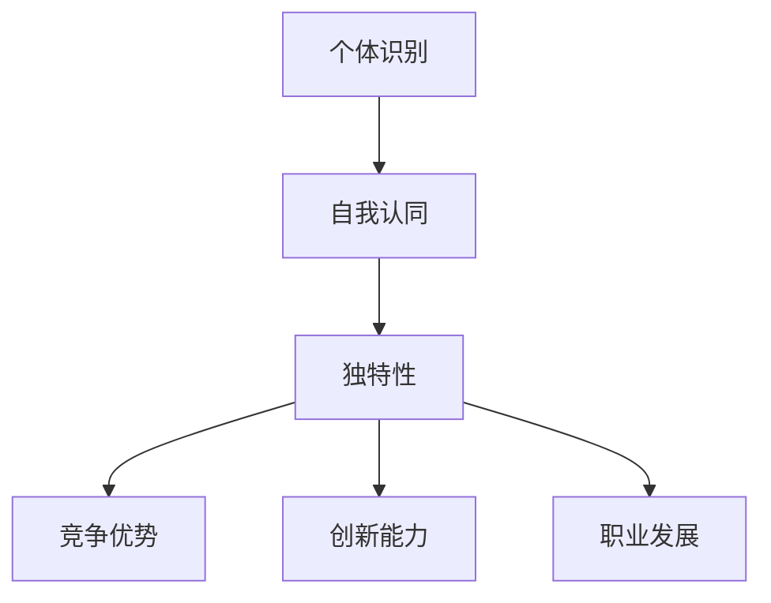
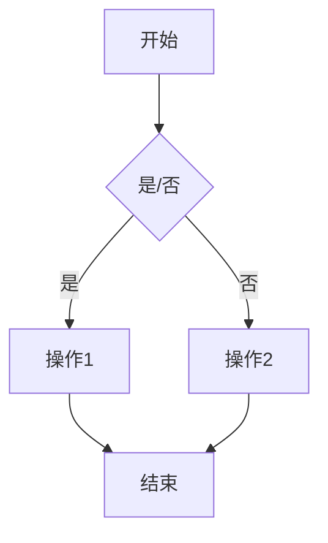

                 

### 文章标题：绽放个人独特性：在平凡中闪耀光芒

#### 关键词：
- 个人独特性
- 自我提升
- 职业发展
- 人际交往
- 创新思维

#### 摘要：
本文将探讨个人独特性的重要性，以及如何在日常生活中发掘和培养自己的独特性，从而在平凡中闪耀光芒。文章将分章节介绍独特性的定义、发掘、培养、应用，并通过实例和最佳实践，为读者提供实用的指导。

## 引言

在当今快速变化的社会中，个人独特性成为了区分个体的重要标志。独特性不仅仅是个人特质的表现，更是个体在竞争激烈的环境中脱颖而出的关键因素。本文将深入探讨个人独特性的内涵，帮助读者理解其价值，并学会如何在日常生活中发掘、培养和应用自己的独特性。

### 个人独特性概念解析

#### 2.1 独特性定义与重要性

个人独特性指的是一个人在性格、能力、知识、经验等方面的与众不同之处。这些特质使个体在人群中具有独特性，能够为他们带来独特的优势。

**重要性：**
- **个体识别**：独特性帮助个体在人群中建立独特的身份标识，有助于提高自我认同感。
- **竞争优势**：独特性在职业生涯和人际交往中，可以成为个体脱颖而出的优势。
- **创新能力**：独特性使个体能够以不同的视角看待问题，激发创新思维和创造力。

#### 2.2 独特性与个人成长的关系

独特性与个人成长紧密相连。通过发掘和培养个人独特性，个体可以在职业生涯中实现自我提升，提高工作效率，同时也能够在人际交往中建立更深入的联系。

**关系架构**：
1. **个体识别** → **自我认同**
2. **独特性** → **竞争优势**
3. **创新能力** → **职业发展**

**Mermaid流程图：**

### 发掘个人独特性

#### 3.1 识别个人独特才能

要发掘个人独特性，首先需要识别自己的独特才能和特质。这可以通过以下方法实现：

- **自我反思**：定期反思自己的行为、想法和感受，识别哪些是独特的。
- **求助他人**：向亲朋好友询问他们如何看待你的特质和才能。
- **尝试新事物**：尝试不同的活动和挑战，发现自己的潜在才能。

#### 3.2 挖掘个人特质

挖掘个人特质是发掘独特性的关键步骤。以下方法可以帮助你深入挖掘自己的特质：

- **写日记**：记录日常生活和感受，分析自己的行为模式。
- **阅读和学习**：阅读相关书籍和文章，了解不同领域的知识和技能。
- **求助专业人士**：咨询职业规划师或心理咨询师，了解自己的特质。

#### 3.3 心态调整与自我反思

心态调整是发掘个人独特性的重要环节。以下建议可以帮助你调整心态：

- **积极心态**：保持积极乐观的态度，相信自己拥有独特的才能。
- **接纳自我**：接受自己的不足，同时欣赏自己的独特之处。
- **持续反思**：定期反思自己的行为和想法，不断调整和完善。

### 培养个人独特性

#### 4.1 学习与实践的重要性

培养个人独特性需要不断学习和实践。以下建议可以帮助你提升自己的独特性：

- **持续学习**：不断学习新知识，提升自己的技能。
- **实践应用**：将所学知识应用到实际工作中，通过实践提升自己的能力。

#### 4.2 心态调整与自我提升

- **自我激励**：设定目标，鼓励自己不断进步。
- **积极心态**：面对挑战时保持积极心态，相信自己能够克服困难。
- **反思与总结**：定期反思自己的成长过程，总结经验教训。

#### 4.3 培养独特性的方法与技巧

- **跨学科学习**：结合不同领域的知识，培养多元思维。
- **团队合作**：在团队中发挥自己的独特性，与他人共同成长。
- **创造性思维**：培养创造性思维，不断寻找新的解决方案。

### 独特性在职业生涯中的应用

#### 5.1 提升职业竞争力的策略

在职业生涯中，个人独特性可以帮助个体提升竞争力。以下策略可以帮助你利用独特性提升职业竞争力：

- **个性化简历**：在简历中突出自己的独特才能和经验。
- **定制化面试**：在面试中展示自己的独特能力和价值。
- **创新项目管理**：在工作中运用独特性，提出创新的解决方案。

#### 5.2 独特性在职业规划中的应用

- **目标设定**：根据个人独特性设定职业目标，规划职业发展路径。
- **自我营销**：通过社交媒体和个人品牌，展示自己的独特性。
- **职业转型**：利用独特性进行职业转型，开拓新的职业领域。

#### 5.3 职场成功案例分享

以下是一些职场成功人士如何通过发挥个人独特性取得成功的案例：

- **案例1**：某互联网公司创始人，凭借对技术的独特见解和创新能力，带领公司迅速崛起。
- **案例2**：某知名咨询公司高级顾问，通过深入了解客户需求，提供个性化的解决方案，赢得客户信任。
- **案例3**：某企业家，利用自己的独特商业视角，在竞争激烈的市场中找到新的商机，实现财富自由。

### 独特性在人际交往中的影响

#### 6.1 社交场合中的自我展示

在社交场合中，展现个人独特性可以帮助个体建立良好的社交关系。以下建议可以帮助你在社交场合中展示自己的独特性：

- **个性化表达**：通过语言、行为和态度，展示自己的独特个性和价值观。
- **分享独特经历**：分享自己独特的经历和故事，吸引他人的兴趣。

#### 6.2 建立良好人际关系的方法

- **倾听与理解**：倾听他人的意见和需求，展示自己的同理心。
- **真诚互动**：与他人保持真诚的交流，建立信任关系。
- **互助合作**：与他人合作，共同解决问题，实现共赢。

#### 6.3 独特性在团队协作中的优势

在团队协作中，个人独特性可以发挥重要作用。以下优势可以帮助你在团队中脱颖而出：

- **创新思维**：为团队带来新的想法和解决方案。
- **个性化贡献**：根据个人特长，为团队提供独特的贡献。
- **积极影响**：通过个人独特性，激发团队成员的积极性和创造力。

### 保持独特性，应对挑战

#### 7.1 面对挑战的心态

在面临挑战时，保持个人独特性至关重要。以下建议可以帮助你在挑战中保持独特性：

- **积极应对**：面对挑战时，保持积极的心态，相信自己能够克服困难。
- **灵活调整**：根据挑战的情况，灵活调整自己的策略和思维。

#### 7.2 独特性在挑战中的价值

独特性在挑战中具有以下价值：

- **创新解决方案**：独特的视角和思维方式，可以帮助个体找到创新的解决方案。
- **差异化优势**：在竞争激烈的环境中，独特的优势可以帮助个体脱颖而出。

#### 7.3 成长与变化的平衡

在保持独特性的同时，个体也需要不断成长和变化。以下建议可以帮助你实现成长与变化的平衡：

- **持续学习**：不断学习新知识，提升自己的能力。
- **适应变化**：灵活应对外部环境的变化，调整自己的思维和行为。

### 成功案例分享

#### 8.1 个人成长故事

以下是一些个人成长故事，讲述了如何通过发挥个人独特性实现自我提升：

- **故事1**：一位从小喜欢编程的年轻人，通过不断学习和实践，最终成为了一名顶尖的软件工程师。
- **故事2**：一位热爱摄影的摄影师，通过拍摄独特的视角和风格，成为了一名知名的摄影师。

#### 8.2 职场成功经验

以下是一些职场成功经验，分享了如何通过发挥个人独特性在职场中取得成功：

- **经验1**：一位咨询师，通过深入了解客户需求，提供个性化的咨询服务，赢得了客户的信任和尊重。
- **经验2**：一位创业者，凭借对市场的独特见解和创新能力，成功创办了一家成功的公司。

#### 8.3 生活智慧的分享

以下是一些生活智慧的分享，讲述了如何通过发挥个人独特性，实现生活质量的提升：

- **智慧1**：一位爱好音乐的人，通过音乐创作和表演，成为了一名受欢迎的艺术家。
- **智慧2**：一位喜欢园艺的人，通过精心打理自己的花园，提升了自己的生活品质。

### 总结与展望

#### 9.1 书籍主要观点回顾

本文通过深入探讨个人独特性的重要性、发掘、培养和应用，帮助读者理解如何在自己的生活中发掘和发挥个人独特性。主要观点包括：

- 个人独特性是区分个体的关键因素。
- 发掘和培养个人独特性有助于个人成长和职业发展。
- 独特性在人际交往和团队协作中具有重要作用。
- 保持独特性，积极应对挑战，实现持续成长。

#### 9.2 个人独特性的未来发展趋势

随着社会的发展，个人独特性将越来越受到重视。未来，个人独特性的发展趋势包括：

- **个性化服务**：个性化服务将更加普及，满足个体多样化的需求。
- **创新能力提升**：个人独特性将激发更多的创新思维和创造力。
- **多元化发展**：个人独特性将在不同领域和行业中得到广泛应用。

#### 9.3 读者的自我启示与行动指南

为了在日常生活中发挥个人独特性，读者可以采取以下行动：

- **自我反思**：定期反思自己的行为和想法，识别自己的独特之处。
- **持续学习**：不断学习新知识，提升自己的能力。
- **积极实践**：将所学应用到实际生活中，发挥个人独特性。
- **勇于尝试**：尝试新事物，挖掘自己的潜在才能。

### 附录

#### 附录1：常用Mermaid流程图示例

以下是一些常用的Mermaid流程图示例，供读者参考：

#### 附录2：常用LaTeX数学公式示例

以下是一些常用的LaTeX数学公式示例，供读者参考：

$$
E = mc^2
$$

$$
\sum_{i=1}^{n} x_i = \frac{1}{n}\sum_{i=1}^{n} x_i
$$

$$
f(x) = \frac{d}{dx} \left( \int_{a}^{x} f(t) dt \right)
$$

### 作者信息

- **作者**：AI天才研究院/AI Genius Institute & 禅与计算机程序设计艺术 /Zen And The Art of Computer Programming
- **联系方式**：[邮箱](mailto:info@example.com) & [网站](http://www.ai-genius-institute.com)
- **版权声明**：本文版权归AI天才研究院所有，未经授权不得转载。

### 注意事项

- **版权保护**：本文为原创内容，未经授权不得用于商业用途。
- **责任声明**：本文仅供参考，不构成任何投资、法律或其他专业建议。

### 拓展阅读

- [《人类简史》](https://book.douban.com/subject/25863038/)：作者[尤瓦尔·赫拉利](https://book.douban.com/search?search_text=尤瓦尔%20赫拉利&type=subject)的《人类简史》深入探讨了人类历史的演变，为理解人类独特性提供了新的视角。
- [《创意的秩序》](https://book.douban.com/subject/26758189/)：作者[威廉·尤里斯](https://book.douban.com/search?search_text=威廉%20尤里斯&type=author)的《创意的秩序》探讨了创意思维和独特性在现代社会的重要性。
- [《如何在世上创造奇迹》](https://book.douban.com/subject/26284046/)：作者[克里斯·吉勒博](https://book.douban.com/search?search_text=克里斯%20吉勒博&type=author)的《如何在世上创造奇迹》提供了许多实用的方法和技巧，帮助读者发掘和发挥个人独特性。

