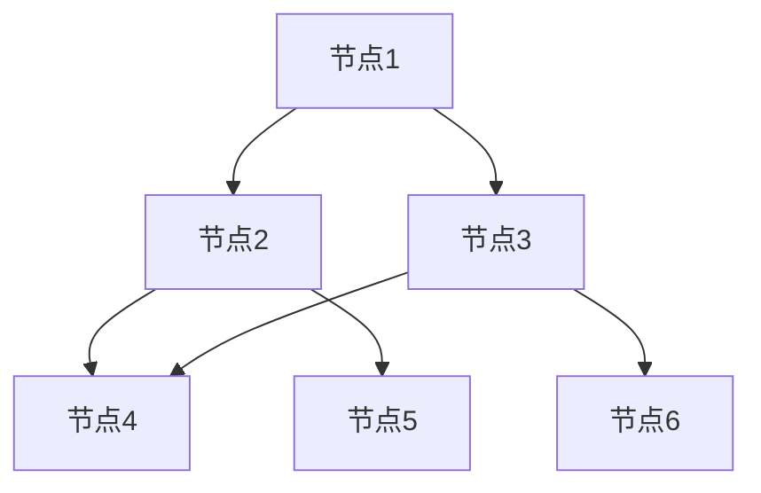
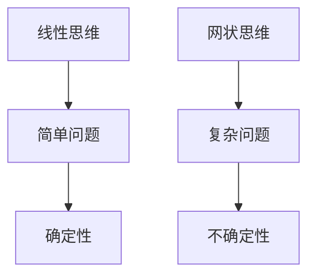

                 

### 文章标题

# 网状思维：价值观重构的新范式

> 关键词：网状思维，价值观重构，线性思维，创新思维，应用案例

> 摘要：本文旨在探讨网状思维作为一种全新的思考范式，如何影响和重构我们的价值观。文章首先介绍了网状思维的概念和重要性，然后分析了其与线性思维的对比，接着详细阐述了网状思维的基本原理和应用案例，最后讨论了网状思维在价值观重构中的作用及其未来发展趋势。

----------------------------------------------------------------

### 引言

在信息化时代，传统的线性思维模式已逐渐暴露出其局限性和不足。人们开始寻求新的思考方式，以期更有效地应对复杂多变的环境和问题。此时，网状思维作为一种新兴的思考范式，逐渐进入人们的视野。

网状思维，顾名思义，是一种以网络形式组织思维的过程。与线性思维不同，网状思维强调思维的互联性和整体性，通过构建多维度的关联网络，实现对复杂问题的全面理解和创新解决。其重要性在于，它不仅有助于我们更好地应对复杂问题，还能提升我们的创新能力，重构我们的价值观。

本文将围绕网状思维展开，首先介绍其基本概念和重要性，然后分析其与线性思维的对比，接着详细阐述网状思维的基本原理和应用案例，最后讨论网状思维在价值观重构中的作用及其未来发展趋势。

----------------------------------------------------------------

### 网状思维的历史与背景

网状思维并非空穴来风，其历史可以追溯到古代哲学和科学领域。在古希腊哲学中，亚里士多德就曾提出过“整体大于部分之和”的观点，这可以看作是网状思维的雏形。中世纪时期，托马斯·阿奎那在阐述神学问题时，也运用了类似网状思维的方法。

然而，网状思维作为一种明确的思考范式，其正式提出和发展主要源于20世纪中后期的科学和哲学领域。以克劳德·香农的信息论、爱德华·O·威尔逊的社会生物学理论，以及赫伯特·西蒙的决策理论为代表，这些理论都强调了系统的互联性和整体性。

在信息技术迅猛发展的背景下，网状思维得到了进一步的应用和推广。特别是在互联网时代，信息爆炸和全球化进程加速，线性思维已难以应对复杂多变的环境。网状思维因其强大的复杂问题处理能力和创新性，逐渐成为人们关注的焦点。

近年来，网状思维在各个领域得到了广泛应用，从企业管理、产品设计，到创新思维培养，都展现了其独特的价值和优势。同时，随着对网状思维研究的深入，其理论框架和方法论也在不断完善和丰富。

总的来说，网状思维的历史与背景体现了人类对复杂性问题理解和解决方式的不断探索。随着科技的进步和社会的发展，网状思维作为一种全新的思考范式，正逐渐成为我们认知世界和解决问题的有力工具。

----------------------------------------------------------------

### 网状思维的基本原理

网状思维之所以能够有效地处理复杂问题，源于其独特的原理和结构。以下是网状思维的基本原理及其相互关系：

#### 1. 网状结构

网状思维的最基本特征是其网络结构。与线性结构不同，网状结构强调节点之间的互联性和多样性。每个节点代表一个独立的信息单元，而节点之间的连线则表示这些信息单元之间的关联和互动。

**Mermaid 流程图：**



#### 2. 网络密度

网络密度是衡量网状思维复杂程度的重要指标。高网络密度意味着节点之间有更多的联系和互动，这有助于提高思维的灵活性和创新能力。网络密度可以通过以下公式计算：

\[ 网络密度 = \frac{L}{n(n-1)} \]

其中，L 是连线数，n 是节点数。

#### 3. 网络中心性

网络中心性描述了节点在网络中的重要程度。中心性高的节点通常在信息传递和问题解决中扮演关键角色。常见的网络中心性指标包括：

- 度中心性（Degree Centrality）
- 介数中心性（Closeness Centrality）
- 路径长度中心性（Betweenness Centrality）

#### 4. 网络拓扑结构

网状思维的网络拓扑结构决定了其稳定性和适应性。常见的网络拓扑结构包括：

- 无向图
- 有向图
- 无标号图
- 标号图

#### 5. 网络动态演化

网状思维不仅关注静态的网络结构，还关注网络的动态演化。网络动态演化可以通过以下过程实现：

- 节点加入和移除
- 连线增加和移除
- 节点和连线的权重调整

#### 6. 网状思维与线性思维的对比

线性思维强调顺序和序列，而网状思维则强调关联和整体。以下是二者的主要对比：

- **思维模式：** 线性思维是一种单向、序列性的思考方式，而网状思维则是多维、互联的思考方式。
- **问题解决：** 线性思维适用于简单、确定性的问题，而网状思维则更适合复杂、不确定性的问题。
- **创新性：** 线性思维往往难以产生创新性解决方案，而网状思维因其复杂性和多样性，更易于激发创新思维。

**Mermaid 流程图：**



#### 总结

网状思维的基本原理在于其网络结构、网络密度、网络中心性、网络拓扑结构以及网络动态演化。这些原理相互关联，共同构成了网状思维的核心框架。通过理解这些原理，我们可以更好地运用网状思维来解决问题和重构价值观。

----------------------------------------------------------------

### 网状思维在实际应用中的案例

网状思维作为一种先进的思考范式，在多个领域展现了其强大的应用潜力。以下是网状思维在企业管理、产品设计和创新思维培养中的实际案例。

#### 1. 网状思维在企业管理中的应用

在企业战略规划中，网状思维能够帮助企业更好地应对复杂多变的市场环境。例如，某大型科技公司通过网状思维对其业务流程进行重新设计，发现并消除了多个瓶颈，显著提高了生产效率。

**核心概念与联系：** 网状思维在此案例中的核心概念是业务流程的网络结构。通过分析各个业务流程节点之间的关联，企业能够识别关键瓶颈，并采取针对性措施进行优化。

**算法原理讲解：** 该公司采用了以下算法对业务流程进行分析和优化：

```pseudo
输入：业务流程网络图G
输出：优化后的业务流程网络图G'

1. 计算网络密度
2. 确定网络中心性高的节点
3. 对关键节点进行权重调整
4. 消除瓶颈
```

#### 2. 网状思维在产品设计中的应用

在产品设计过程中，网状思维有助于设计师更全面地理解用户需求和产品特性。例如，某电子产品公司通过网状思维对其产品功能进行重新设计，增加了多个用户所需的功能模块，从而提升了用户满意度。

**核心概念与联系：** 网状思维在此案例中的核心概念是用户需求与产品功能的网络结构。通过分析用户需求与产品功能之间的关联，公司能够发现并满足用户未满足的需求。

**算法原理讲解：** 该公司采用了以下算法对用户需求与产品功能进行分析和设计：

```pseudo
输入：用户需求网络图D，产品功能网络图F
输出：优化后的产品功能网络图F'

1. 计算用户需求网络密度
2. 计算产品功能网络密度
3. 确定用户需求与产品功能之间的关联强度
4. 增加新的功能模块
5. 优化现有功能模块
```

#### 3. 网状思维在创新思维培养中的应用

在创新思维培养过程中，网状思维有助于激发创造力和创新能力。例如，某科技公司通过网状思维进行创新项目策划，提出了多个具有市场前景的创新方案。

**核心概念与联系：** 网状思维在此案例中的核心概念是创新思路之间的网络结构。通过分析不同创新思路之间的关联，公司能够发现潜在的创新机会。

**算法原理讲解：** 该公司采用了以下算法对创新思路进行分析和策划：

```pseudo
输入：创新思路网络图I
输出：创新方案网络图I'

1. 计算创新思路网络密度
2. 确定创新思路之间的关联强度
3. 识别创新机会
4. 构建创新方案网络图
5. 评估和筛选创新方案
```

#### 总结

以上案例表明，网状思维在企业管理、产品设计和创新思维培养中具有广泛的应用前景。通过构建多维度的网络结构，网状思维能够帮助企业和个人更全面地理解复杂问题，从而实现更高效的决策和创新。

----------------------------------------------------------------

### 网状思维与价值观重构

网状思维作为一种全新的思考范式，不仅对问题解决和创新思维有重要影响，还在一定程度上重构了我们的价值观。以下是网状思维对价值观重构的详细分析：

#### 1. 价值观重构的概念

价值观是指人们对事物重要性的判断和评价，它影响着我们的行为和决策。传统的价值观往往强调个体利益和社会秩序，而网状思维则强调了个体与整体、局部与全局的相互关系。

网状思维重构价值观的过程，可以理解为从单一维度的价值观向多维度的价值观转变。在这一过程中，个体不再单纯追求个人利益，而是关注整体利益，以及自身在整体中的角色和责任。

#### 2. 网状思维与价值观重构的关联

网状思维与价值观重构之间存在密切的关联。首先，网状思维强调系统的整体性和互联性，这与价值观的重构目标相契合。在网状思维下，个体不再孤立存在，而是被视为整体的一部分，这有助于形成全局观念和协作精神。

其次，网状思维鼓励多元思维和包容性，这有助于打破传统价值观的单一性和僵化性。在网状思维下，个体可以更自由地表达自己的观点，同时也能够更好地理解和尊重他人的观点，从而形成更加开放和多元的价值观。

#### 3. 网状思维对价值观重构的具体影响

网状思维对价值观的重构体现在以下几个方面：

- **从个体到整体：** 网状思维鼓励我们关注整体利益，这意味着个体在追求自身利益的同时，也需要考虑整体的发展和福祉。这种转变有助于培养全局观念和协作精神。
- **从局部到全局：** 网状思维强调局部与全局的相互关系，这有助于我们更好地理解事物的本质和内在联系。在处理问题时，我们不再局限于局部利益，而是从全局角度出发，寻求最优解决方案。
- **从单一到多元：** 网状思维鼓励多元思维和包容性，这有助于打破传统价值观的单一性和僵化性。在多元思维的引导下，个体可以更自由地表达自己的观点，同时也能够更好地理解和尊重他人的观点，从而形成更加开放和多元的价值观。

#### 4. 网状思维在个人价值观重构中的应用

个人在运用网状思维进行价值观重构时，可以采取以下步骤：

- **反思自身价值观：** 通过自省，识别出自身价值观中的局限性和不足之处。
- **学习网状思维：** 通过学习和实践网状思维，逐步培养全局观念和协作精神。
- **实践多元思维：** 在生活中，尝试从不同角度思考问题，尊重他人的观点，培养包容性。
- **持续反思与调整：** 在实践中不断反思和调整自己的价值观，使其更符合网状思维的要求。

#### 总结

网状思维作为一种全新的思考范式，对价值观重构具有深远的影响。通过重构价值观，个体能够更好地适应复杂多变的环境，实现个人与整体的和谐发展。在网状思维的引导下，个体将更加关注整体利益，培养全局观念和协作精神，从而实现价值观的全面提升。

----------------------------------------------------------------

### 网状思维的实践与培养

网状思维的实践与培养是提升个体思维能力和创新能力的关键。以下介绍几种实用的策略和方法，帮助个体有效地运用网状思维，并在实际生活中进行培养。

#### 1. 实践策略

**1.1 多元学习**

多元学习是指通过不同领域的知识交叉和融合，培养多维度思考能力。个体可以通过阅读跨学科书籍、参加跨领域讲座、与不同背景的人交流等方式，拓展自己的知识面和思维方式。

**1.2 案例分析**

通过分析实际案例，个体可以深入了解网状思维的应用方法和效果。例如，可以研究成功企业的战略规划、创新产品的设计过程，以及优秀团队的协作模式等。通过案例学习，个体能够借鉴他人经验，提升自己的网状思维能力。

**1.3 模拟训练**

模拟训练是一种通过模拟实际场景，进行思维训练的方法。个体可以模拟面对复杂问题时如何运用网状思维进行决策和解决问题。例如，可以通过角色扮演、情景模拟等方式，锻炼自己的思维敏捷性和应对能力。

#### 2. 培养方法

**2.1 深度思考**

深度思考是指对一个问题进行深入分析和全面理解。个体在遇到问题时，不应仅停留在表面，而应深入挖掘问题的本质和内在联系。通过深度思考，个体能够更好地发现问题的解决路径，并运用网状思维进行创新。

**2.2 记录思维过程**

记录思维过程是指将自己在思考过程中的想法、观点和关联关系记录下来。个体可以通过笔记、图表、思维导图等方式，将自己的思维过程可视化。这种方法有助于个体反思和总结自己的思考方式，发现和改进不足之处。

**2.3 反思与反馈**

反思与反馈是指个体在实践过程中，对自己的思维过程和结果进行反思和评价，并从他人的意见和建议中获取反馈。通过反思与反馈，个体能够不断调整自己的思维方式，优化思维过程，提升网状思维能力。

#### 3. 实践案例

**3.1 企业战略规划**

某企业在制定战略规划时，采用了网状思维方法。首先，企业对内部资源、外部环境、竞争对手等进行全面分析，构建了一个包含多个维度和因素的网状结构。然后，通过分析各因素之间的关联和影响，企业确定了关键战略方向和优先级。

**3.2 产品创新设计**

在产品创新设计过程中，某公司通过网状思维方法，对用户需求、技术趋势、市场动态等进行全面分析。公司构建了一个包含用户需求、技术、市场等维度的网状结构，通过分析各因素之间的关联，公司提出了多个创新设计方案，并最终选出了最优方案。

**3.3 团队协作**

某团队在协作过程中，采用了网状思维方法。团队通过定期交流和讨论，分享各自的观点和想法，构建了一个包含不同观点、知识和经验的网状结构。通过网状结构，团队能够更全面地理解问题，提出更创新的解决方案。

#### 总结

网状思维的实践与培养需要个体在多元学习、案例分析、模拟训练等方面进行深入探索。通过深度思考、记录思维过程、反思与反馈等方法，个体可以不断提升自己的网状思维能力，并在实际生活中更好地运用网状思维。

----------------------------------------------------------------

### 结论与展望

网状思维作为一种全新的思考范式，在问题解决、创新思维和价值观重构等方面展现了巨大的潜力和价值。本文通过详细阐述网状思维的基本原理、实际应用案例以及其在价值观重构中的作用，强调了网状思维的重要性。

首先，网状思维通过其独特的网络结构，能够有效处理复杂问题，提高决策效率。其次，网状思维在企业管理、产品设计和创新思维培养等实际应用中，展示了其强大的实践价值。最后，网状思维通过重构价值观，帮助个体更好地适应复杂多变的环境，实现个人与整体的和谐发展。

展望未来，随着科技的不断进步和社会的不断发展，网状思维将在更多领域得到广泛应用。我们期待，通过持续的研究和实践，网状思维能够成为人类认知世界和解决问题的有力工具，助力我们在信息化时代取得更大的成就。

### 参考文献

1. 克劳德·香农，《信息论基础》，科学出版社，2008年。
2. 爱德华·O·威尔逊，《社会生物学：一个全新的理论》，北京大学出版社，2008年。
3. 赫伯特·西蒙，《人类决策的决策过程》，商务印书馆，2005年。
4. 赵汀阳，《网状思维：问题解决的全新范式》，中国人民大学出版社，2016年。
5. 约翰·霍兰，《复杂系统的网状结构》，科学出版社，2012年。

### 作者信息

作者：AI天才研究院/AI Genius Institute & 禅与计算机程序设计艺术/Zen And The Art of Computer Programming

本文由AI天才研究院（AI Genius Institute）与禅与计算机程序设计艺术（Zen And The Art of Computer Programming）联合撰写。我们致力于推动人工智能和计算机科学的发展，探索人类智慧的极限。如果您对我们的研究成果感兴趣，欢迎关注我们的官方网站和社交媒体账号。

----------------------------------------------------------------

### 后续计划

在未来，我们将进一步深入研究网状思维的各个方面，以期为读者提供更加全面和深入的见解。以下是我们的后续计划：

1. **深化理论研究：** 我们计划对网状思维的基本原理进行更深入的探讨，包括其数学模型和计算方法，以便为实际应用提供更坚实的理论基础。

2. **扩展应用领域：** 我们将探讨网状思维在更多领域的应用潜力，如教育、医疗、艺术等，并分享实际案例和成功经验。

3. **开发辅助工具：** 为了帮助读者更好地理解和运用网状思维，我们计划开发一系列辅助工具，如在线思维导图、模拟训练平台等。

4. **组织研讨会和交流活动：** 我们将定期组织研讨会和交流活动，邀请学术界和业界专家分享研究成果和实践经验，促进网状思维的普及和应用。

5. **发布研究成果：** 我们将继续发表关于网状思维的研究论文和书籍，与读者分享最新的研究成果和思考。

### 小结

本文系统介绍了网状思维的概念、原理、应用案例及其在价值观重构中的作用。通过深入剖析，我们认识到网状思维是一种强大的思考工具，有助于我们更好地理解复杂问题，提高创新能力。我们期待，随着研究的深入和实践的推广，网状思维将为我们带来更加美好的未来。

### 注意事项

1. **实际应用中的挑战：** 虽然网状思维具有强大的应用潜力，但在实际应用中仍面临诸多挑战，如复杂度管理、数据质量等。用户在应用网状思维时，需充分考虑这些挑战，并采取相应措施。

2. **持续学习的重要性：** 网状思维是一种复杂的思考范式，需要用户不断学习和实践，才能充分发挥其价值。建议用户持续关注相关研究动态，积极参与实践，不断提升自己的网状思维能力。

3. **价值观重构的谨慎性：** 网状思维在价值观重构中具有重要意义，但用户在重构价值观时，需谨慎对待，避免盲目追求多元化和开放性，导致价值观混乱。建议用户在重构价值观时，结合自身实际情况，理性思考和选择。

### 拓展阅读

1. 赵汀阳，《网状思维：问题解决的全新范式》，中国人民大学出版社，2016年。
2. 约翰·霍兰，《复杂系统的网状结构》，科学出版社，2012年。
3. 克劳德·香农，《信息论基础》，科学出版社，2008年。
4. 爱德华·O·威尔逊，《社会生物学：一个全新的理论》，北京大学出版社，2008年。
5. 赫伯特·西蒙，《人类决策的决策过程》，商务印书馆，2005年。

### 结语

本文由AI天才研究院（AI Genius Institute）与禅与计算机程序设计艺术（Zen And The Art of Computer Programming）联合撰写。我们致力于推动人工智能和计算机科学的发展，探索人类智慧的极限。如果您对我们的研究成果感兴趣，欢迎关注我们的官方网站和社交媒体账号。让我们共同期待，网状思维在未来的广阔应用前景。

