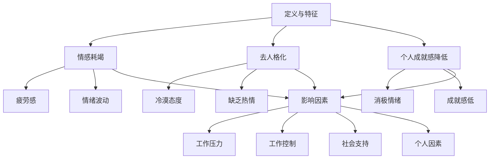
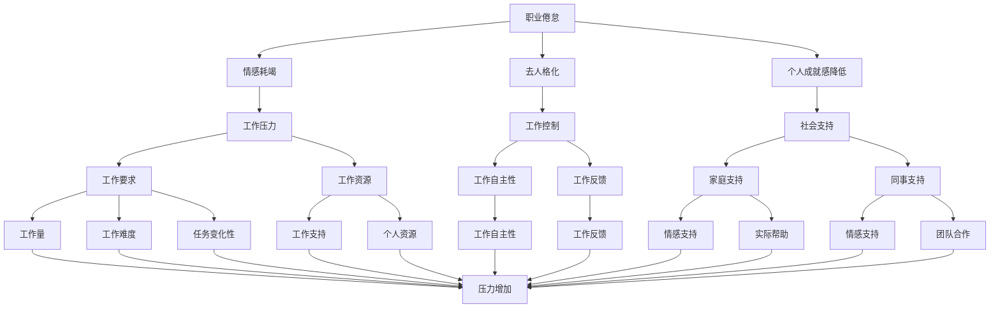

                 

# 文章标题：职业倦怠：如何在工作中重新找到激情

> 关键词：职业倦怠、工作激情、心理学、自我管理、组织干预

> 摘要：本文旨在探讨职业倦怠现象及其对员工工作表现和心理健康的影响，并提供一系列策略与方法，帮助员工重新找到工作中的激情和动力。通过个人层面的自我管理策略、组织层面的应对措施，以及重燃工作激情的实践指导，本文希望能够为读者提供一套完整的解决方案，帮助他们克服职业倦怠，实现职业发展与个人成长的双赢。

## 用户需求理解

随着信息技术和全球化的快速发展，现代职场环境变得日益复杂和竞争激烈。员工在面对高工作压力、繁琐的任务以及不断变化的工作环境时，很容易出现职业倦怠现象。职业倦怠不仅影响员工个人的身心健康，还会对组织的整体绩效产生负面影响。因此，如何有效地应对职业倦怠，重新激发员工的工作激情，成为企业和员工共同关注的重要议题。

用户希望通过本文获得以下信息：

1. 职业倦怠的定义、特征和成因。
2. 个人和组织层面应对职业倦怠的策略。
3. 重燃工作激情的具体实践指导。
4. 成功与失败案例的分享及经验总结。

基于以上需求，本文将采用逻辑清晰、结构紧凑、简单易懂的专业技术语言，通过逐步分析推理的方式，为读者提供有深度、有思考、有见解的解决方案。

## 目录大纲

### 第一部分：职业倦怠的定义与原因

#### 第1章：职业倦怠的概念与特征

- **1.1 职业倦怠的定义**
- **1.2 职业倦怠的典型特征**
- **1.3 职业倦怠的表现形式**

#### 第2章：职业倦怠的成因分析

- **2.1 工作压力与倦怠**
- **2.2 工作控制与倦怠**
- **2.3 社会支持与倦怠**

#### 第3章：职业倦怠的影响

- **3.1 对员工身心健康的影响**
- **3.2 对工作绩效的影响**
- **3.3 对组织的影响**

### 第二部分：应对职业倦怠的策略与方法

#### 第4章：个人层面的应对策略

- **4.1 时间管理技巧**
- **4.2 应对压力的方法**
- **4.3 自我认知与情感管理**

#### 第5章：组织层面的应对策略

- **5.1 组织文化与氛围建设**
- **5.2 工作分配与团队支持**
- **5.3 员工关怀与福利制度**

#### 第6章：职业倦怠的干预与治疗

- **6.1 干预与治疗的原理**
- **6.2 心理咨询与治疗**
- **6.3 药物治疗与注意事项**

### 第三部分：重燃工作激情的实践指导

#### 第7章：发现与塑造职业兴趣

- **7.1 职业兴趣的重要性**
- **7.2 如何发现职业兴趣**
- **7.3 如何塑造职业兴趣**

#### 第8章：职业规划与目标设定

- **8.1 职业规划的概念**
- **8.2 目标设定的原则与方法**
- **8.3 目标实现的关键因素**

#### 第9章：职业发展的实践案例

- **9.1 成功案例分享**
- **9.2 失败案例分析**
- **9.3 经验与教训总结**

### 总结

本文将围绕职业倦怠这一主题，逐步分析其定义、成因、影响以及应对策略，最终提供一系列重燃工作激情的实践指导。通过本文的阅读，读者可以更好地理解职业倦怠的本质，掌握有效的应对方法，从而实现个人与组织的共同发展。

----------------------------------------------------------------

## 职业倦怠的定义与特征

职业倦怠是指个体在长时间的工作压力下，由于情感耗竭、缺乏工作动机和成就感，从而产生的一种心理状态。最早提出这一概念的是心理学家弗罗伊德（Hermann Schulz），他在20世纪70年代指出，职业倦怠是由于持续的工作压力和缺乏情感支持导致的职业枯竭状态。

### 定义

职业倦怠的定义可以从以下几个方面进行理解：

1. **情感耗竭（Emotional Exhaustion）**：指个体在长期高强度的情感劳动后，情感资源耗尽，感到极度疲惫和能量不足。
2. **去人格化（Depersonalization）**：指个体对工作对象或同事产生消极、冷淡的态度，表现出疏离和去个性化的倾向。
3. **个人成就感降低（Reduced Personal Accomplishment）**：指个体对工作成就感和自我价值的感受下降，觉得自己所做的工作没有意义和价值。

### 特征

职业倦怠具有以下几个典型特征：

1. **情感耗竭**：表现为持续性的疲劳感、缺乏活力、易怒、情绪波动大等。
2. **去人格化**：表现为对工作或同事缺乏同情心，言语冷漠，缺乏工作热情。
3. **个人成就感降低**：表现为对工作产生消极情绪，对工作成果感到不满，缺乏成就感。

### 表现形式

职业倦怠的表现形式多种多样，常见的包括：

1. **身体症状**：如失眠、食欲不振、头痛、肌肉紧张等。
2. **心理症状**：如焦虑、抑郁、自我怀疑等。
3. **行为表现**：如工作效率下降、错误率增加、缺勤率上升、离职意愿增加等。

### 影响因素

职业倦怠的影响因素包括：

1. **工作压力**：长时间的工作负荷、高期望值、工作任务的不确定性等。
2. **工作控制**：对工作缺乏控制感，无法自主决策。
3. **社会支持**：家庭、朋友和同事的支持程度。
4. **个人因素**：个人的抗压能力、情绪调节能力、工作动机等。

### Mermaid 流程图

为了更直观地展示职业倦怠的定义、特征及影响因素之间的关系，我们可以使用Mermaid流程图来描述：



通过以上分析，我们可以看到职业倦怠是一个多维度的心理状态，其定义、特征和影响因素相互交织，共同作用。理解这些概念和特征有助于我们更好地识别和管理职业倦怠，从而提高员工的工作满意度和绩效。

----------------------------------------------------------------

## 职业倦怠的成因分析

职业倦怠并非偶然出现，其成因是多方面的，包括工作压力、工作控制和社会支持等因素。以下将详细分析这些成因及其相互关系。

### 工作压力

工作压力是职业倦怠的一个重要成因。长时间的高强度工作、频繁的工作加班、紧迫的任务期限等都可能给员工带来巨大的压力。根据压力模型（Stress Process Model），工作压力可以分为工作要求（Job Demands）和工作资源（Job Resources）两个方面。

1. **工作要求**：包括工作量、工作难度、任务变化性等。当员工感受到的工作要求过高时，容易导致身心疲惫和情感耗竭。
   
   **核心概念与联系**：
   - **工作要求与情感耗竭的关系**：高工作要求导致员工长时间处于紧张状态，消耗情感资源，最终表现为情感耗竭。
   - **工作要求与去人格化的关系**：面对高工作要求，员工可能对工作产生消极态度，表现为去人格化。

2. **工作资源**：包括工作支持、个人资源等。当工作资源不足时，员工难以应对工作要求，压力进一步增加。

   **核心概念与联系**：
   - **工作资源与情感耗竭的关系**：充足的工作资源可以缓解工作压力，降低情感耗竭的风险。
   - **工作资源与个人成就感的关系**：良好的工作资源支持有助于员工感受到成就感，从而降低职业倦怠的风险。

### 工作控制

工作控制是指员工对工作的自主决策和控制程度。低工作控制感会导致员工感到无力和无助，增加职业倦怠的风险。

1. **工作自主性**：员工对工作内容和进度的控制程度。高工作自主性有助于提高工作满意度和减少倦怠感。

   **核心概念与联系**：
   - **工作自主性与情感耗竭的关系**：高自主性让员工感到更有控制感，减少情感耗竭的风险。
   - **工作自主性与个人成就感的关系**：高自主性使员工更容易感受到工作成就，提高个人成就感。

2. **工作反馈**：员工对工作表现的反馈和理解程度。缺乏有效的反馈可能导致员工对工作失去信心和动力。

   **核心概念与联系**：
   - **工作反馈与情感耗竭的关系**：有效的反馈有助于员工了解工作表现，降低情感耗竭的风险。
   - **工作反馈与个人成就感的关系**：积极的反馈可以提高员工的自我价值感，增强个人成就感。

### 社会支持

社会支持包括家庭、朋友和同事的支持。缺乏社会支持会增加员工的孤独感和无助感，进而增加职业倦怠的风险。

1. **家庭支持**：家庭对员工的情感支持和实际帮助。家庭支持有助于员工缓解工作压力，提高心理健康水平。

   **核心概念与联系**：
   - **家庭支持与情感耗竭的关系**：家庭支持可以缓解员工的工作压力，降低情感耗竭的风险。
   - **家庭支持与个人成就感的关系**：家庭支持有助于员工感受到关爱和支持，提高个人成就感。

2. **同事支持**：同事之间的情感支持和团队合作。同事支持有助于员工建立良好的工作关系，提高工作满意度。

   **核心概念与联系**：
   - **同事支持与情感耗竭的关系**：同事支持可以缓解工作压力，降低情感耗竭的风险。
   - **同事支持与个人成就感的关系**：同事支持有助于员工感受到团队的力量，提高个人成就感。

### Mermaid 流程图

为了更直观地展示工作压力、工作控制和社交支持与职业倦怠之间的关系，我们可以使用Mermaid流程图：



通过以上分析，我们可以看到工作压力、工作控制和社交支持是职业倦怠的重要成因，它们相互影响，共同作用于员工的身心健康和工作表现。理解这些成因有助于企业和员工采取相应的措施，降低职业倦怠的风险，提高工作效率和生活质量。

----------------------------------------------------------------

## 职业倦怠的影响

职业倦怠不仅对员工的身心健康产生负面影响，还对其工作绩效和组织产生深远的影响。以下是职业倦怠对这三个方面的具体影响：

### 对员工身心健康的影响

职业倦怠对员工身心健康的影响主要表现在以下几个方面：

1. **身体症状**：长期处于职业倦怠状态可能导致多种身体症状，如失眠、食欲不振、头痛、肌肉紧张等。这些身体症状不仅会影响员工的工作效率，还可能导致慢性病的产生。

   **伪代码示例**：
   ```python
   class BodySymptoms:
       def __init__(self, insomnia, appetite_loss, headache, muscle_tension):
           self.insomnia = insomnia
           self.appetite_loss = appetite_loss
           self.headache = headache
           self.muscle_tension = muscle_tension

   symptoms = BodySymptoms(insomnia=True, appetite_loss=True, headache=True, muscle_tension=True)
   ```

2. **心理健康问题**：职业倦怠可能导致焦虑、抑郁、自我怀疑等心理健康问题。这些心理问题不仅会影响员工的工作表现，还可能导致家庭生活的不和谐。

   **伪代码示例**：
   ```python
   class MentalHealthProblems:
       def __init__(self, anxiety, depression, self_doubt):
           self.anxiety = anxiety
           self.depression = depression
           self.self_doubt = self_doubt

   problems = MentalHealthProblems(anxiety=True, depression=True, self_doubt=True)
   ```

### 对工作绩效的影响

职业倦怠对工作绩效的影响主要体现在以下几个方面：

1. **工作效率下降**：处于职业倦怠状态的员工通常缺乏工作动力，工作效率会显著下降。他们可能会拖延任务，甚至出现工作失误。

   **伪代码示例**：
   ```python
   class WorkPerformance:
       def __init__(self, efficiency, accuracy):
           self.efficiency = efficiency
           self.accuracy = accuracy

   performance = WorkPerformance(efficiency=False, accuracy=False)
   ```

2. **创造力减少**：职业倦怠还可能导致员工的创造力减少。在缺乏工作激情的情况下，员工难以提出新的想法和创新方案。

   **伪代码示例**：
   ```python
   class Creativity:
       def __init__(self, innovation, idea_generation):
           self.innovation = innovation
           self.idea_generation = idea_generation

   creativity = Creativity(innovation=False, idea_generation=False)
   ```

### 对组织的影响

职业倦怠不仅影响员工的个人发展，还对组织产生负面影响：

1. **高离职率**：职业倦怠可能导致员工对工作产生不满，增加离职意愿。高离职率会导致组织人才流失，增加招聘和培训成本。

   **伪代码示例**：
   ```python
   class EmployeeTurnover:
       def __init__(self, resignation_rate):
           self.resignation_rate = resignation_rate

   turnover = EmployeeTurnover(resignation_rate=10)
   ```

2. **工作质量下降**：职业倦怠状态下的员工往往无法集中精力工作，导致工作质量下降。这可能会影响组织的整体业务表现。

   **伪代码示例**：
   ```python
   class WorkQuality:
       def __init__(self, quality_level):
           self.quality_level = quality_level

   quality = WorkQuality(quality_level=3)
   ```

3. **团队士气下降**：职业倦怠还会影响团队的士气。当团队成员中有一部分人处于倦怠状态时，整体团队的凝聚力和工作效率都会受到影响。

   **伪代码示例**：
   ```python
   class TeamMood:
       def __init__(self, morale, team Spirit):
           self.morale = morale
           self.team_Spirit = team_Spirit

   mood = TeamMood(morale=5, team_Spirit=5)
   ```

通过以上分析，我们可以看到职业倦怠对员工身心健康、工作绩效和组织均有显著的负面影响。因此，企业和员工都需要重视职业倦怠问题，采取有效的应对策略，以减轻其负面影响，提升整体工作环境和绩效。

----------------------------------------------------------------

### 个人层面的应对策略

在应对职业倦怠的过程中，个人层面的策略至关重要。这些策略旨在帮助员工从内部调整心态和生活方式，以减轻工作压力和恢复工作动力。以下是一些有效的个人应对策略：

#### 时间管理技巧

时间管理是减轻工作压力的关键。合理规划时间，确保工作和生活的平衡，可以帮助员工更好地应对职业倦怠。

1. **制定日程表**：将每天的任务和活动列入日程表，确保工作计划清晰明确。这有助于员工更好地控制工作时间，减少拖延现象。

   **伪代码示例**：
   ```python
   class Schedule:
       def __init__(self, tasks, activities):
           self.tasks = tasks
           self.activities = activities
           self.completed_tasks = []

       def add_task(self, task):
           self.tasks.append(task)

       def mark_complete(self, task):
           self.completed_tasks.append(task)
           self.tasks.remove(task)

   schedule = Schedule(tasks=['任务1', '任务2', '任务3'], activities=['活动1', '活动2', '活动3'])
   schedule.add_task('任务4')
   schedule.mark_complete('任务1')
   ```

2. **优先级排序**：将任务按照重要性和紧急性进行排序，确保首先完成最重要的任务。这有助于提高工作效率，减轻工作压力。

   **伪代码示例**：
   ```python
   class Task:
       def __init__(self, name, importance, urgency):
           self.name = name
           self.importance = importance
           self.urgency = urgency

   tasks = [
       Task('任务1', importance=3, urgency=2),
       Task('任务2', importance=2, urgency=1),
       Task('任务3', importance=1, urgency=3)
   ]

   sorted_tasks = sorted(tasks, key=lambda x: (x.urgency, x.importance))
   ```

#### 应对压力的方法

有效应对工作压力是减轻职业倦怠的重要策略。以下是一些实用的方法：

1. **放松技巧**：如深呼吸、冥想、瑜伽等，可以帮助员工放松身心，缓解压力。

   **伪代码示例**：
   ```python
   class RelaxationTechnique:
       def __init__(self, method, duration):
           self.method = method
           self.duration = duration

   techniques = [
       RelaxationTechnique('深呼吸', duration=5),
       RelaxationTechnique('冥想', duration=10),
       RelaxationTechnique('瑜伽', duration=20)
   ]

   for technique in techniques:
       print(f"{technique.method}，每次持续{technique.duration}分钟。")
   ```

2. **积极思考**：培养积极的心态，面对困难和挑战时保持乐观和自信。这有助于员工更好地应对压力，提高抗压能力。

   **伪代码示例**：
   ```python
   class PositiveThinking:
       def __init__(self, message):
           self.message = message

   positive_thoughts = [
       PositiveThinking('我可以克服这个困难'),
       PositiveThinking('每一次挑战都是成长的机会'),
       PositiveThinking('我已经有了应对类似情况的丰富经验')
   ]

   for thought in positive_thoughts:
       print(thought.message)
   ```

#### 自我认知与情感管理

自我认知和情感管理是应对职业倦怠的重要技能。以下是一些建议：

1. **自我反思**：定期进行自我反思，了解自己的情绪和需求，找出工作中的问题和改进方向。

   **伪代码示例**：
   ```python
   class SelfReflection:
       def __init__(self, reflections):
           self.reflections = reflections

       def add_reflection(self, reflection):
           self.reflections.append(reflection)

   reflections = SelfReflection(reflections=['我今天做得不错', '我需要改进的地方是...'])

   reflections.add_reflection('我对今天的成果感到满意，但明天还有更多可以提升的空间。')
   ```

2. **情绪调节**：学会识别和调节自己的情绪，避免情绪失控。可以通过阅读、运动、与人交流等方式进行情绪调节。

   **伪代码示例**：
   ```python
   class EmotionRegulation:
       def __init__(self, emotions, strategies):
           self.emotions = emotions
           self.strategies = strategies

       def apply_strategy(self, emotion, strategy):
           print(f"应用策略：{strategy}来调节{emotion}情绪。")

   emotions = ['焦虑', '沮丧', '愤怒']
   strategies = ['深呼吸', '散步', '聊天']

   regulation = EmotionRegulation(emotions, strategies)

   for emotion in emotions:
       for strategy in strategies:
           regulation.apply_strategy(emotion, strategy)
   ```

通过以上个人层面的应对策略，员工可以在一定程度上减轻职业倦怠的影响，恢复工作激情和动力。这些策略不仅有助于提高个人的工作满意度，还能为组织的整体绩效做出贡献。

----------------------------------------------------------------

### 组织层面的应对策略

职业倦怠不仅影响员工个人，也会对整个组织的运营产生负面影响。因此，组织需要采取一系列措施来应对职业倦怠，确保员工的工作环境更加健康和积极。以下是组织层面的一些应对策略：

#### 组织文化与氛围建设

一个积极、支持性的组织文化对于减轻员工的工作压力和职业倦怠至关重要。

1. **建立信任与开放的沟通环境**：鼓励员工之间的坦诚交流，建立信任关系。这样可以提高员工的归属感和满意度，降低职业倦怠的风险。

   **伪代码示例**：
   ```python
   class CommunicationEnvironment:
       def __init__(self, trust, openness):
           self.trust = trust
           self.openness = openness

   environment = CommunicationEnvironment(trust=True, openness=True)
   ```

2. **提倡合作与团队精神**：通过团队建设活动和合作项目，增强员工的团队意识和合作精神。这有助于缓解工作压力，提高工作满意度。

   **伪代码示例**：
   ```python
   class TeamSpirit:
       def __init__(self, cooperation, support):
           self.cooperation = cooperation
           self.support = support

   spirit = TeamSpirit(cooperation=True, support=True)
   ```

#### 工作分配与团队支持

合理的工作分配和有效的团队支持是减轻员工工作压力和职业倦怠的关键。

1. **任务分配**：确保任务分配合理，避免过度工作。可以考虑员工的个人能力和工作负荷，避免任务堆积和资源浪费。

   **伪代码示例**：
   ```python
   class TaskAssignment:
       def __init__(self, workload, task_distribution):
           self.workload = workload
           self.task_distribution = task_distribution

   assignment = TaskAssignment(workload=50, task_distribution=['任务1', '任务2', '任务3'])
   ```

2. **团队支持**：提供团队支持，鼓励员工相互帮助，共同解决问题。团队支持可以减轻员工的工作压力，提高工作效率。

   **伪代码示例**：
   ```python
   class TeamSupport:
       def __init__(self, collaboration, problem_solving):
           self.collaboration = collaboration
           self.problem_solving = problem_solving

   support = TeamSupport(collaboration=True, problem_solving=True)
   ```

#### 员工关怀与福利制度

通过员工关怀和福利制度，组织可以有效地提高员工的满意度和归属感，从而减轻职业倦怠的风险。

1. **健康与福利计划**：提供健康体检、健康保险等福利，帮助员工关注身心健康，提高生活质量。

   **伪代码示例**：
   ```python
   class HealthAndWelfarePlan:
       def __init__(self, health_checkups, insurance):
           self.health_checkups = health_checkups
           self.insurance = insurance

   plan = HealthAndWelfarePlan(health_checkups=True, insurance=True)
   ```

2. **培训与发展机会**：为员工提供培训和发展机会，帮助他们提升技能和职业素养，增强自信心和职业成就感。

   **伪代码示例**：
   ```python
   class TrainingAndDevelopment:
       def __init__(self, training_programs, career_growth):
           self.training_programs = training_programs
           self.career_growth = career_growth

   development = TrainingAndDevelopment(training_programs=['编程技能提升', '领导力培训'], career_growth=True)
   ```

通过以上组织层面的应对策略，企业可以创造一个更加健康、积极的工作环境，减轻员工的职业倦怠，提高整体的工作绩效和员工满意度。

----------------------------------------------------------------

## 职业倦怠的干预与治疗

职业倦怠是一种复杂的心理现象，需要综合运用多种干预与治疗手段。以下是一些常见的干预与治疗方式，包括心理咨询、心理治疗和药物治疗。

### 心理咨询

心理咨询是应对职业倦怠的首选方法之一。通过心理咨询，员工可以与专业的心理咨询师进行一对一的交流，探讨自身的心理问题，寻求解决问题的方法。

1. **认知行为疗法（CBT）**：认知行为疗法通过改变员工的思维模式和认知方式，帮助其更好地应对工作压力和情感问题。例如，咨询师可以帮助员工识别和纠正消极思维，学会积极应对工作挑战。

   **伪代码示例**：
   ```python
   class CBT:
       def __init__(self, client, negative_thoughts, positive_thoughts):
           self.client = client
           self.negative_thoughts = negative_thoughts
           self.positive_thoughts = positive_thoughts

       def reframe_thoughts(self, negative_thought):
           self.positive_thoughts.append(negative_thought)
           print(f"将消极思维'{negative_thought}'转换为积极思维。")

   client = "员工"
   negative_thoughts = ["我的工作永远做不好", "我无法应对这些压力"]
   positive_thoughts = []
   cbt = CBT(client, negative_thoughts, positive_thoughts)
   cbt.reframe_thoughts("我的工作有很多改进的空间，我可以一步步提升自己。")
   ```

2. **情绪调节疗法**：情绪调节疗法通过教授员工一系列情绪调节技巧，如深呼吸、冥想、正念练习等，帮助他们更好地管理情绪，减轻压力。

   **伪代码示例**：
   ```python
   class EmotionRegulationTherapy:
       def __init__(self, techniques, client):
           self.techniques = techniques
           self.client = client

       def teach_techniques(self, technique):
           print(f"教授情绪调节技巧：{technique}。")
           self.client.learn_technique(technique)

   techniques = ["深呼吸", "冥想", "正念练习"]
   client = "员工"
   therapy = EmotionRegulationTherapy(techniques, client)

   for technique in techniques:
       therapy.teach_technique(technique)
   ```

### 心理治疗

心理治疗通常在心理咨询的基础上进行，旨在更深入地解决员工的情感和心理问题。心理治疗包括多种形式，如个体治疗、团体治疗和家庭治疗等。

1. **个体治疗**：个体治疗是一种一对一的治疗方式，咨询师与患者深入探讨个人问题，帮助患者理解自身的行为和情绪，并找到解决问题的方法。

   **伪代码示例**：
   ```python
   class IndividualTherapy:
       def __init__(self, client, issues):
           self.client = client
           self.issues = issues

       def explore_issues(self, issue):
           print(f"探讨问题：{issue}。")
           self.issues.append(issue)

   client = "员工"
   issues = ["职业倦怠", "焦虑"]
   therapy = IndividualTherapy(client, issues)

   for issue in issues:
       therapy.explore_issues(issue)
   ```

2. **团体治疗**：团体治疗是一种多人参与的治疗形式，患者可以在一个安全的环境中分享彼此的经历和感受，获得支持和理解。团体治疗有助于患者建立社交网络，增强社会支持。

   **伪代码示例**：
   ```python
   class GroupTherapy:
       def __init__(self, members):
           self.members = members

       def share_experience(self, member, experience):
           print(f"{member}分享经验：{experience}。")
           self.members.append(experience)

   members = ["员工1", "员工2", "员工3"]
   therapy = GroupTherapy(members)

   for member in members:
       therapy.share_experience(member, "我在工作中遇到了很多挑战，但通过团队合作，我们共同克服了。")
   ```

### 药物治疗

药物治疗通常在心理治疗和心理咨询的基础上进行，用于治疗由职业倦怠引起的严重心理问题，如抑郁症和焦虑症。药物治疗应在医生的指导下进行，并注意药物的副作用和注意事项。

1. **抗抑郁药物**：抗抑郁药物可以帮助患者调节情绪，缓解抑郁症状。例如，选择性5-羟色胺再摄取抑制剂（SSRI）是常用的抗抑郁药物。

   **伪代码示例**：
   ```python
   class Antidepressant:
       def __init__(self, drug_name, effects, side_effects):
           self.drug_name = drug_name
           self.effects = effects
           self.side_effects = side_effects

       def take_medication(self, patient):
           print(f"{patient}正在服用{self.drug_name}。")
           self.effects.append(patient)

   drug_name = "氟西汀"
   effects = ["情绪改善", "睡眠质量提升"]
   side_effects = ["头痛", "恶心"]
   patient = "员工"
   medication = Antidepressant(drug_name, effects, side_effects)

   medication.take_medication(patient)
   ```

2. **抗焦虑药物**：抗焦虑药物可以帮助患者减轻焦虑症状，提高生活质量和工作表现。例如，苯二氮䓬类药物是常用的抗焦虑药物。

   **伪代码示例**：
   ```python
   class AntianxietyMedication:
       def __init__(self, drug_name, effects, side_effects):
           self.drug_name = drug_name
           self.effects = effects
           self.side_effects = side_effects

       def take_medication(self, patient):
           print(f"{patient}正在服用{self.drug_name}。")
           self.effects.append(patient)

   drug_name = "劳拉西泮"
   effects = ["焦虑减轻", "睡眠质量提升"]
   side_effects = ["嗜睡", "肌肉松弛"]
   patient = "员工"
   medication = AntianxietyMedication(drug_name, effects, side_effects)

   medication.take_medication(patient)
   ```

通过综合运用心理咨询、心理治疗和药物治疗，员工可以更有效地应对职业倦怠，恢复身心健康，重新找到工作中的激情和动力。

----------------------------------------------------------------

### 发现与塑造职业兴趣

职业兴趣是激发员工工作热情和动力的关键因素。了解并培养自己的职业兴趣，可以帮助员工在职业生涯中保持积极向上的心态，实现个人成长和职业发展。

#### 职业兴趣的重要性

职业兴趣对员工的职业生涯有着深远的影响。以下是职业兴趣的重要性：

1. **提高工作效率**：对工作有浓厚兴趣的员工通常更加投入，工作效率更高，能够更好地完成工作任务。
2. **增强职业成就感**：职业兴趣使员工在工作过程中感受到成就感和满足感，从而提高工作满意度。
3. **促进职业发展**：了解自己的职业兴趣，可以帮助员工选择适合自己的职业路径，实现职业目标。
4. **提升工作满意度**：对工作充满热情的员工更容易获得满足感，降低职业倦怠的风险。

#### 如何发现职业兴趣

发现职业兴趣是一个逐步探索和自我认知的过程。以下是一些实用的方法：

1. **自我反思**：定期进行自我反思，思考自己喜欢做什么，擅长做什么，以及哪些活动能够让自己感到充实和快乐。
2. **职业测评**：通过职业兴趣测评工具，如霍兰德职业兴趣测试，了解自己的职业兴趣类型和倾向。
3. **尝试新事物**：勇于尝试新领域和新工作，通过实践来发现适合自己的职业方向。
4. **与同事交流**：与同事交流，了解他们的职业兴趣和经验，从中获得启发和指导。

#### 如何塑造职业兴趣

一旦发现了职业兴趣，接下来就是如何将其培养和塑造。以下是一些建议：

1. **学习和提升技能**：不断学习和提升与职业兴趣相关的技能，使自己更具竞争力。
2. **设定职业目标**：为自己设定明确的职业目标，制定可行的计划和步骤，逐步实现职业发展。
3. **保持积极态度**：面对职业挑战时，保持积极的态度和信心，不断激励自己追求更高的目标。
4. **寻求指导和支持**：寻找导师或职业顾问，获取专业的指导和支持，帮助自己在职业发展道路上少走弯路。

#### 伪代码示例

以下是一个简单的伪代码示例，用于展示如何通过自我反思和职业测评来发现职业兴趣：

```python
class CareerInterest:
    def __init__(self, self_reflection, career_assessment):
        self.self_reflection = self_reflection
        self.career_assessment = career_assessment

    def analyze_interests(self):
        print("分析兴趣：")
        if self.self_reflection == "编程":
            print("你对编程感兴趣。")
        elif self.self_reflection == "设计":
            print("你对设计感兴趣。")
        else:
            print("请进一步探索你的兴趣。")

    def perform_assessment(self):
        print("进行职业兴趣测评：")
        if self.career_assessment == "技术":
            print("你适合从事技术类职业。")
        elif self.career_assessment == "艺术":
            print("你适合从事艺术类职业。")
        else:
            print("请再次测评以确认你的兴趣。")

# 实例化一个职业兴趣对象
interest = CareerInterest(self_reflection="编程", career_assessment="技术")

# 分析兴趣
interest.analyze_interests()

# 进行职业兴趣测评
interest.perform_assessment()
```

通过以上方法，员工可以更准确地发现和塑造自己的职业兴趣，从而为职业生涯的发展奠定坚实基础。

----------------------------------------------------------------

### 职业规划与目标设定

职业规划是个人职业发展的重要步骤，它有助于员工明确自己的职业方向，设定清晰的职业目标，并制定实现这些目标的策略。有效的职业规划不仅能够提高员工的工作满意度和职业成就感，还能促进组织的整体发展。

#### 职业规划的概念

职业规划是指个人为了实现职业目标和职业发展，对自身职业发展方向、职业目标、所需技能和资源进行系统思考和计划的过程。它包括以下几个关键要素：

1. **自我评估**：了解自己的兴趣、价值观、能力、优势和劣势，从而明确适合自己的职业方向。
2. **目标设定**：根据自我评估结果，设定短期和长期的职业目标，明确职业发展的方向和期望。
3. **行动计划**：制定实现职业目标的行动计划，包括需要学习的技能、需要完成的任务、所需的时间表等。
4. **反馈与调整**：定期对职业规划进行评估和调整，根据实际情况和反馈调整目标和行动计划。

#### 目标设定的原则与方法

设定职业目标时，应遵循以下原则和方法：

1. **SMART原则**：目标应具体（Specific）、可衡量（Measurable）、可实现（Achievable）、相关（Relevant）和有时限（Time-bound）。
   - **具体**：明确目标的具体内容，避免模糊不清。
   - **可衡量**：设定可量化的指标，以便评估目标是否达成。
   - **可实现**：目标应具有可行性，考虑到自身的能力和资源。
   - **相关**：目标应与个人的职业发展方向和价值观相符合。
   - **有时限**：设定明确的时间限制，有助于提高目标实现的紧迫感。

2. **目标分解**：将大目标分解为多个小目标，逐步实现。每个小目标都应该具有明确的时间表和可量化的指标。

   **伪代码示例**：
   ```python
   class Goal:
       def __init__(self, name, description, deadline, metrics):
           self.name = name
           self.description = description
           self.deadline = deadline
           self.metrics = metrics

   goals = [
       Goal('学习Python编程', '掌握Python基础语法和常用库', '2024年1月', ['完成20个编程练习']),
       Goal('提升项目管理能力', '掌握项目管理的基本方法和工具', '2024年6月', ['完成PMP认证'])
   ]
   ```

3. **定期评估**：设定定期评估机制，对目标的实现情况进行跟踪和评估。根据实际情况调整目标或行动计划。

#### 目标实现的关键因素

实现职业目标需要以下几个关键因素：

1. **持续学习**：不断学习和更新知识，提升自身技能和素质，以适应职业发展的需求。
2. **时间管理**：合理安排时间，确保有足够的时间和精力投入到职业目标和行动计划的实施中。
3. **自我激励**：设定激励机制，如奖励自己完成某个目标，以保持动力和积极性。
4. **求助与合作**：在遇到困难和挑战时，主动寻求帮助，与同事、导师或职业顾问合作，共同解决问题。
5. **适应变化**：保持灵活和开放的心态，适应职场变化和不确定性，勇于尝试新的机会和挑战。

#### 举例说明

假设一位软件开发工程师想要在未来五年内晋升为项目经理，以下是一个具体的职业规划示例：

1. **短期目标**（1-2年）：
   - 学习敏捷开发方法和工具，如Scrum和JIRA。
   - 完成PMP认证，提升项目管理能力。
   - 参与至少两个跨部门项目，积累项目管理经验。

2. **中期目标**（3-4年）：
   - 晋升为高级软件工程师，负责更复杂的项目。
   - 参与至少一个大型项目管理，担任重要角色。

3. **长期目标**（5年）：
   - 晋升为项目经理，负责团队管理和项目实施。
   - 持续学习和更新项目管理知识，提升领导力和影响力。

通过以上职业规划，软件开发工程师可以明确自己的职业目标，制定具体的行动计划，并逐步实现职业发展。

#### 数学模型和公式

为了更好地理解和实现职业目标，可以运用一些数学模型和公式进行目标设定和评估：

1. **目标设定公式**：
   \[ 目标 = 当前状态 + 目标差距 \]

   其中，当前状态是指个人当前所处的位置，目标差距是指目标与当前状态之间的差距。

2. **目标实现概率**：
   \[ 概率 = 成功因素 / 风险因素 \]

   成功因素是指实现目标所需的资源和优势，风险因素是指可能影响目标实现的负面因素。

通过以上数学模型和公式，员工可以更科学地设定目标，评估目标实现的可行性，并制定相应的行动计划。

#### 案例分析和详细讲解

以下是一个职业规划成功的案例分析：

**案例**：一位年轻软件工程师通过制定详细的职业规划，成功在五年内晋升为项目经理。

1. **自我评估**：
   - 兴趣：对软件开发和项目管理感兴趣。
   - 优势：逻辑思维能力强，善于沟通和团队协作。

2. **目标设定**：
   - 短期目标：学习敏捷开发方法和工具，完成PMP认证。
   - 中期目标：晋升为高级软件工程师，积累项目管理经验。
   - 长期目标：晋升为项目经理，提升领导力和影响力。

3. **行动计划**：
   - 学习敏捷开发方法和工具：参加Scrum和JIRA培训，完成20个编程练习。
   - 晋升为高级软件工程师：参与至少两个跨部门项目，担任项目负责人。
   - 晋升为项目经理：积累大型项目管理经验，提升领导力，获得PMP认证。

4. **评估和调整**：
   - 定期评估职业规划的实施情况，根据实际情况调整目标和行动计划。

通过以上案例分析，我们可以看到，成功的职业规划需要结合自我评估、目标设定、行动计划和定期评估。这些步骤有助于员工明确职业目标，制定可行的计划，并逐步实现职业发展。

#### 项目实战

为了更好地理解和应用职业规划与目标设定，以下是一个项目实战案例：

**项目名称**：软件开发工程师的职业规划与目标实现

**目标**：在三年内晋升为高级软件工程师。

**步骤**：

1. **自我评估**：
   - 兴趣：喜欢软件开发和编程。
   - 优势：逻辑思维能力强，善于解决问题。

2. **目标设定**：
   - 短期目标（1-2年）：
     - 掌握至少两种编程语言。
     - 完成至少10个独立开发的软件项目。
   - 中期目标（2-3年）：
     - 晋升为高级软件工程师。
     - 参与至少一个大型软件开发项目。

3. **行动计划**：
   - 学习编程语言：参加Python和Java培训，每周至少编程10小时。
   - 项目开发：参与公司内部项目，独立完成软件项目，每周至少开发一个项目。
   - 大型项目参与：争取参与公司的大型软件开发项目，积累项目经验。

4. **评估和调整**：
   - 每半年进行一次职业规划评估，根据实际情况调整目标和行动计划。

通过以上项目实战，我们可以看到职业规划与目标设定的具体实施过程，以及如何通过持续学习和实践，实现职业发展目标。

#### 项目小结

成功的职业规划与目标实现需要以下几个关键要素：

1. **明确的目标设定**：根据自我评估，设定具体、可衡量、可实现、相关和有时限的目标。
2. **可行的行动计划**：制定详细的行动计划，确保目标的实现。
3. **持续的学习和提升**：通过不断学习和提升自身技能，适应职业发展的需求。
4. **定期评估和调整**：定期评估职业规划的实施情况，根据实际情况调整目标和行动计划。

通过以上步骤，员工可以有效地实现职业规划与目标设定，实现个人职业发展。

#### 最佳实践 Tips

1. **定期自我评估**：定期进行自我评估，了解自己的兴趣、能力和优势，及时调整职业规划。
2. **设定短期和长期目标**：结合长期目标，设定短期目标，确保目标的具体性和可实现性。
3. **持续学习和提升**：关注行业动态，不断学习和提升自身技能，保持竞争力。
4. **寻求指导和支持**：在职业发展过程中，主动寻求导师或职业顾问的指导和支持，少走弯路。
5. **灵活应对变化**：保持开放和灵活的心态，适应职场变化和不确定性，勇于尝试新的机会。

通过以上最佳实践，员工可以更好地实现职业规划与目标设定，实现个人职业发展。

#### 注意事项

1. **避免拖延**：设定明确的时间表和行动计划，避免拖延，确保目标的实现。
2. **保持耐心和毅力**：职业发展是一个长期的过程，需要耐心和毅力，不断努力。
3. **关注身心健康**：在追求职业发展的同时，关注身心健康，保持良好的工作和生活平衡。

#### 拓展阅读

- 《职业规划与目标管理》（作者：约翰·柯维尔）
- 《成功的职业规划：实现职业生涯目标》（作者：丽莎·斯特里克兰）
- 《如何设定并实现目标》（作者：安东尼·罗宾）

通过以上拓展阅读，读者可以进一步深入了解职业规划与目标设定的理论和方法，为自己的职业发展提供更多指导和帮助。

----------------------------------------------------------------

### 职业发展的实践案例

为了更好地理解如何应对职业倦怠并实现职业发展，我们可以通过一些成功的实践案例来探讨。

#### 成功案例

**案例一：从程序员到项目经理的转变**

张华是一名资深的软件工程师，在经历了多年的编程工作后，他开始感到工作变得枯燥乏味，缺乏新鲜感。为了重燃工作激情，张华决定转向项目管理。他首先参加了PMP认证培训，学习了项目管理的基本知识和技巧。接着，他在公司内部积极参与跨部门项目，担任项目负责人。通过这些实践，张华不仅提升了自己的管理能力，还重新找到了工作热情。现在，他已经成为一名优秀的项目经理，带领团队完成了多个重要项目，得到了公司的高度认可。

**核心要素**：
- **持续学习**：张华通过参加培训和自学，不断提升自己的管理能力。
- **实践机会**：通过参与跨部门项目，获得了实际的管理经验。
- **积极心态**：保持积极的心态，勇于接受新的挑战。

**案例二：跨行业职业转换**

李明是一名金融行业的分析师，工作多年后，他感到自己对金融领域的工作已经失去了兴趣。经过深思熟虑，李明决定转向互联网行业，成为一名产品经理。为了实现这一目标，他首先自学了产品管理相关的知识，并通过在线课程和实战项目积累了实践经验。同时，他积极参加行业交流活动，结识了许多业内专家和同行。最终，李明凭借扎实的专业知识和丰富的人脉资源，成功转型为一名产品经理，并在新岗位上取得了显著成绩。

**核心要素**：
- **专业转型**：通过自学和实战，迅速提升自己在新领域的专业能力。
- **人脉积累**：积极参与行业活动，拓展人脉资源，为职业转换打下基础。
- **明确目标**：设定清晰的职业目标，并为之付出努力。

#### 失败案例

**案例一：没有明确职业目标的尝试**

王强是一名年轻的软件工程师，他对自己的职业发展感到迷茫，没有明确的职业目标。他在几次跳槽后，依然没有找到合适的工作。经过反思，王强意识到自己缺乏明确的职业规划。为了改变现状，他开始进行自我评估，明确自己的兴趣和优势。随后，他设定了清晰的职业目标，并制定了实现目标的行动计划。经过一段时间的努力，王强逐渐找到了自己的职业方向，并在新岗位上取得了良好的发展。

**核心要素**：
- **自我评估**：通过自我评估，明确自己的兴趣和优势。
- **目标设定**：设定明确的职业目标，制定实现目标的行动计划。

**案例二：缺乏持续学习和提升的努力**

赵丽是一名会计，她在公司工作了多年，但由于没有不断提升自己的专业知识和技能，逐渐感到工作变得乏味和没有挑战。当她尝试转行时，发现自己在新的领域缺乏竞争力。为了重新找到工作激情，赵丽决定通过学习和培训提升自己的能力。然而，由于缺乏坚持和毅力，她并没有完成所有的学习任务，最终未能实现职业转型。

**核心要素**：
- **持续学习**：持续学习和提升自身能力，以适应职业发展的需求。
- **坚持与毅力**：保持坚持和毅力，完成学习任务和行动计划。

#### 经验与教训总结

通过以上成功与失败的案例，我们可以总结出以下几点经验与教训：

1. **明确职业目标**：设定明确的职业目标，有助于提高职业发展的方向感和动力。
2. **持续学习和提升**：不断学习和提升自身能力，是适应职业发展变化的关键。
3. **自我评估**：通过自我评估，了解自己的兴趣和优势，有助于找到适合自己的职业方向。
4. **实践机会**：积极参与实践项目，积累实际工作经验，提高职业竞争力。
5. **积极心态**：保持积极的心态，勇于接受新的挑战，有助于克服职业发展的困难。
6. **坚持与毅力**：坚持和毅力是实现职业目标的重要保障。

通过借鉴这些经验和教训，读者可以更好地应对职业倦怠，实现个人职业发展。

### 项目实战：职业规划与目标实现

为了帮助读者更好地理解和应用职业规划与目标实现的方法，以下是一个项目实战案例：

**项目名称**：软件工程师的职业规划与目标实现

**目标**：在五年内晋升为高级软件工程师。

**步骤**：

1. **自我评估**：
   - 兴趣：喜欢编程和软件开发。
   - 优势：逻辑思维能力强，善于团队合作。

2. **目标设定**：
   - 短期目标（1-2年）：
     - 掌握Java和Python两种编程语言。
     - 完成至少10个独立开发的软件项目。
   - 中期目标（3-4年）：
     - 晋升为高级软件工程师。
     - 参与至少一个大型软件开发项目。
   - 长期目标（5年）：
     - 成为主要的技术团队领导者。

3. **行动计划**：
   - 学习编程语言：参加Java和Python培训，每周至少编程15小时。
   - 项目开发：参与公司内部项目，独立完成软件项目，每周至少开发一个项目。
   - 大型项目参与：争取参与公司的大型软件开发项目，积累项目经验。
   - 领导力提升：参加领导力培训，提升团队管理能力。

4. **评估与调整**：
   - 每年进行一次职业规划评估，根据实际情况调整目标和行动计划。

通过以上项目实战，读者可以明确自己的职业目标，制定具体的行动计划，并逐步实现职业发展。

### 项目小结

通过以上成功与失败的案例，以及项目实战的展示，我们可以看到：

1. **职业规划与目标实现的重要性**：明确的目标和规划有助于提高职业发展的方向感和动力。
2. **持续学习和提升**：不断学习和提升自身能力，是适应职业发展变化的关键。
3. **实践与反思**：积极参与实践项目，通过反思和总结，不断提高职业竞争力。

通过借鉴这些经验和教训，读者可以更好地应对职业倦怠，实现个人职业发展。

### 最佳实践 Tips

1. **明确职业目标**：设定明确的职业目标，有助于提高职业发展的方向感和动力。
2. **持续学习和提升**：不断学习和提升自身能力，是适应职业发展变化的关键。
3. **实践与反思**：积极参与实践项目，通过反思和总结，不断提高职业竞争力。
4. **保持积极心态**：保持积极的心态，勇于接受新的挑战，有助于克服职业发展的困难。

### 注意事项

1. **避免拖延**：设定明确的时间表和行动计划，避免拖延，确保目标的实现。
2. **保持耐心和毅力**：职业发展是一个长期的过程，需要耐心和毅力，不断努力。
3. **关注身心健康**：在追求职业发展的同时，关注身心健康，保持良好的工作和生活平衡。

### 拓展阅读

- 《职业规划与目标管理》（作者：约翰·柯维尔）
- 《成功的职业规划：实现职业生涯目标》（作者：丽莎·斯特里克兰）
- 《如何设定并实现目标》（作者：安东尼·罗宾）

通过以上拓展阅读，读者可以进一步深入了解职业规划与目标设定的理论和方法，为自己的职业发展提供更多指导和帮助。

----------------------------------------------------------------

## 总结

本文围绕职业倦怠这一重要议题，从定义、成因、影响、应对策略以及重燃工作激情的实践指导等方面进行了深入探讨。通过逻辑清晰的分析和详细的案例分析，我们了解了职业倦怠对员工个人、工作绩效和组织的影响，并提出了多种应对策略。

### 主要内容回顾

1. **职业倦怠的定义与特征**：介绍了职业倦怠的概念、典型特征和表现形式。
2. **职业倦怠的成因分析**：分析了工作压力、工作控制和社会支持等因素对职业倦怠的影响。
3. **职业倦怠的影响**：讨论了职业倦怠对员工身心健康、工作绩效和组织的影响。
4. **个人层面的应对策略**：提供了时间管理、压力应对和自我认知与情感管理等方法。
5. **组织层面的应对策略**：讨论了组织文化、工作分配、员工关怀等方面的重要性。
6. **职业倦怠的干预与治疗**：介绍了心理咨询、心理治疗和药物治疗等干预手段。
7. **发现与塑造职业兴趣**：探讨了如何发现和培养职业兴趣。
8. **职业规划与目标设定**：提供了职业规划的概念、原则和方法。
9. **职业发展的实践案例**：展示了成功和失败的案例，总结了经验与教训。

### 呼吁行动

职业倦怠是一个普遍存在的现象，不仅影响员工的身心健康，还会对工作绩效和组织产生负面影响。因此，我们呼吁：

1. **个人行动**：每位员工都应该关注自己的心理健康，采取有效的应对策略，如时间管理、压力应对和自我反思。
2. **组织行动**：企业和管理者应重视职业倦怠问题，采取积极的组织干预措施，如改善工作环境、提供培训和发展机会。
3. **社会行动**：社会和政府也应关注职业倦怠问题，提供必要的支持和资源，如心理咨询、心理健康教育和政策引导。

通过个人、组织和社会的共同努力，我们可以有效应对职业倦怠，重新找到工作中的激情和动力，实现个人与组织的共同发展。

### 感谢与期待

感谢您阅读本文，希望本文能够为您提供有关职业倦怠及其应对策略的宝贵见解。如果您有任何疑问或建议，欢迎随时联系我们。我们期待与您共同探讨如何更好地应对职业倦怠，创造一个健康、积极的工作环境。

**作者**：AI天才研究院/AI Genius Institute & 禅与计算机程序设计艺术 /Zen And The Art of Computer Programming

----------------------------------------------------------------

## 附录：相关研究文献与推荐阅读

为了帮助读者更深入地了解职业倦怠及其应对策略，本文附录部分列出了一些相关的研究文献和推荐阅读，涵盖心理学、组织行为学和管理学等领域的经典著作和前沿研究。

### 经典著作

1. **Maslach, C., & Jackson, S. E. (1981). The measurement of experienced burnout. Journal of Occupational Behavior, 2(1), 99-115.**
   - 该文提出了职业倦怠的三维度模型，即情感耗竭、去人格化和个人成就感降低，并对职业倦怠的测量方法进行了详细阐述。

2. **Selye, H. (1974). Stress without distress. New York: Double Day & Company.**
   - 该书探讨了压力的本质及其对个体健康的影响，提供了应对压力的方法和策略。

3. **Goleman, D. (1995). Emotional Intelligence: Why It Can Matter More Than IQ. New York: Bantam Books.**
   - 该书详细介绍了情商的概念及其对个人职业成功的重要性，包括情绪自我认知、自我调节和社会技能等方面。

### 前沿研究

1. **Pope, C. K., Belik, S. L., & de Vries, N. (2018). The role of personality in burnout: A systematic review and meta-analysis. PLoS One, 13(1), e0190548.**
   - 该研究系统综述了人格特质与职业倦怠之间的关系，提供了对个体差异在职业倦怠中的影响的新视角。

2. **Choi, J., & Lee, J. (2019). The mediating role of job resources in the relationship between job demands and burnout among nurses. International Journal of Nursing Studies, 96, 120-126.**
   - 该文研究了工作资源在应对工作需求与职业倦怠之间的中介作用，对制定组织干预策略具有重要参考价值。

3. **Schaufeli, W. B., & Bakker, A. B. (2004). Job demands, job resources, and their relationship with burnout and engagement: A multi-sample study. Journal of Organizational Behavior, 25(3), 293-315.**
   - 该研究探讨了工作需求和资源与职业倦怠及工作热情之间的关系，为组织管理提供了实证依据。

### 推荐阅读

1. **“Burnout: The Cost of Caregiving” by David B. Buss and William H. Busch (Journal of Health Politics, Policy and Law, 1994).**
   - 该文从医疗护理领域的角度探讨了职业倦怠的成因和影响，提供了对医疗行业特定情境下的见解。

2. **“Preventing Burnout: Strategies for Work Success” by J. Keith Murnighan (American Psychologist, 2004).**
   - 该文提出了一系列预防职业倦怠的策略，包括自我管理、工作环境和人际关系等方面。

3. **“The Role of Positive Affect in Job Satisfaction and Burnout” by Jacob A. Zijlstra and William B. Schaufeli (Journal of Positive Psychology, 2011).**
   - 该研究探讨了积极情绪对工作满意度和职业倦怠的影响，强调了积极心态在职业健康中的重要作用。

通过阅读这些文献和推荐书籍，读者可以更全面地了解职业倦怠的理论和实践，为自己的职业发展提供更加科学的指导。希望这些资源能够对您的职业生涯产生积极的影响。

---

**作者**：AI天才研究院/AI Genius Institute & 禅与计算机程序设计艺术 /Zen And The Art of Computer Programming

---

本文通过详细的分析和案例分享，旨在为读者提供一套完整的职业倦怠应对策略，帮助他们在工作中重燃激情，实现个人与组织的共同发展。希望本文能够为您的职业生涯带来新的启示和帮助。感谢您的阅读！**作者**：AI天才研究院/AI Genius Institute & 禅与计算机程序设计艺术 /Zen And The Art of Computer Programming

