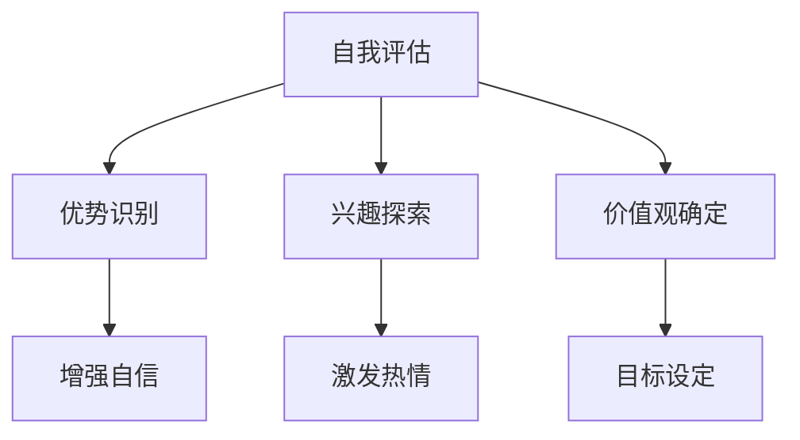
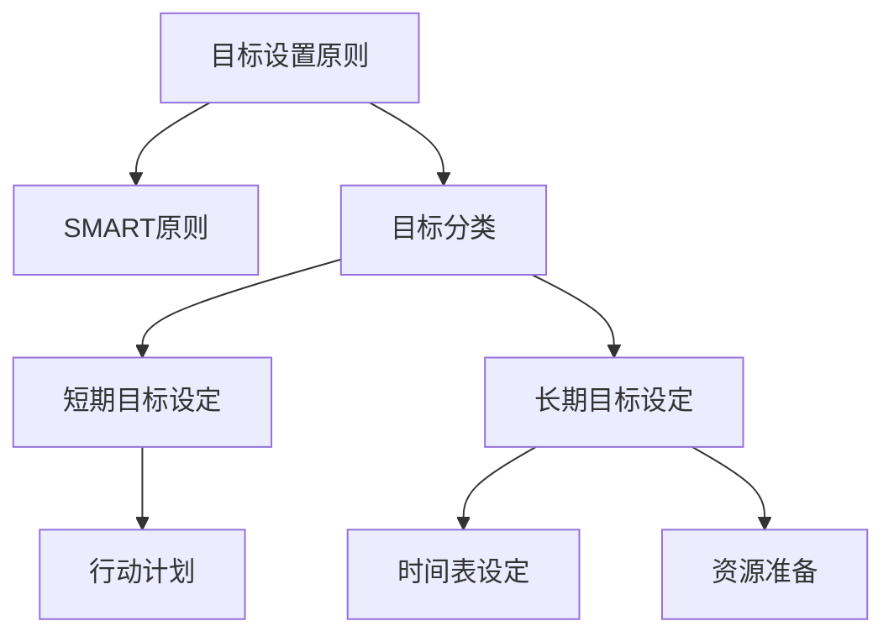
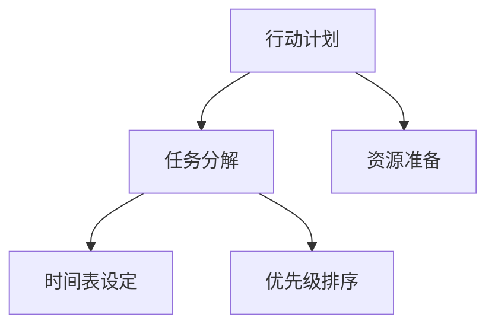
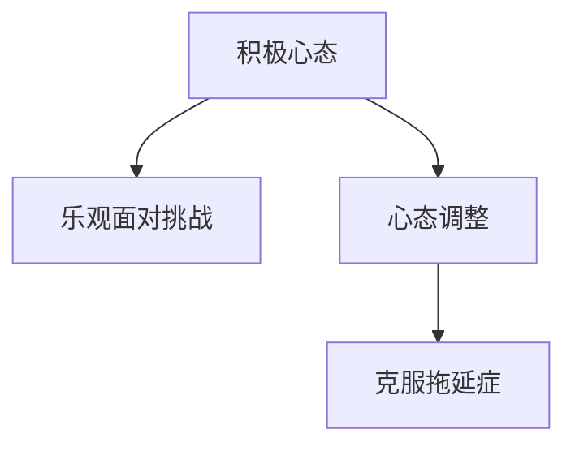
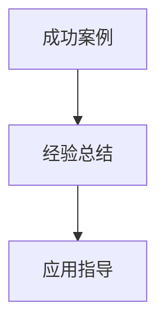
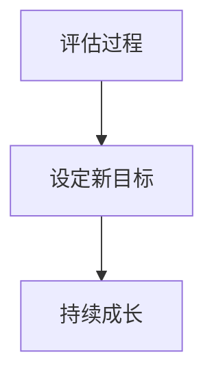

                 

---

**文章标题**：《自我实现：将梦想转化为现实的过程》

**关键词**：自我实现、目标设定、心态调整、实践案例、持续改进

**摘要**：
本文将探讨自我实现的路径，包括了解自我、目标设定、行动计划、心态调整和实践案例。通过一步步的逻辑分析，读者将学会如何将内心的梦想转化为现实，实现个人的全面成长和进步。

## 引言

在当今快节奏的社会中，人们越来越意识到自我实现的重要性。自我实现不仅仅是一种心理需求，更是实现个人价值和社会贡献的关键。然而，如何将梦想转化为现实，实现自我价值，却是一个复杂而充满挑战的过程。本文旨在通过一步步的逻辑分析，帮助读者理解自我实现的过程，并提供实用的方法和技巧。

## 自我认识

### 背景介绍
自我认识是自我实现的基础，它涉及到对自身优点、兴趣、价值观和目标的了解。只有深入了解自己，才能找到适合自己的发展路径。

### 核心概念与联系
- **自我评估**：通过自我评估了解自己的优点和不足，以及个人的兴趣和价值观。
- **优势识别**：识别并利用自己的优点，增强自信和自我价值感。
- **兴趣探索**：通过探索个人兴趣，找到能够激发内心热情的领域。
- **价值观确定**：明确个人的价值观，作为设定目标和行动的指导原则。

**Mermaid流程图**：


### 核心算法原理讲解
自我评估可以视为一种自我反馈的算法，其核心在于不断地收集和更新个人数据，以便更好地了解自己。以下是伪代码示例：

```python
def self_evaluation():
    # 收集个人优点和兴趣
    advantages = ["创造力", "团队合作", "领导力"]
    interests = ["编程", "摄影", "阅读"]
    
    # 识别个人价值观
    values = ["自由", "创新", "成就感"]
    
    # 输出结果
    print("您的优点：", advantages)
    print("您的兴趣：", interests)
    print("您的价值观：", values)
```

### 数学模型和公式
在自我认识的阶段，可以使用以下数学模型来量化个人优点和兴趣：

$$
\text{兴趣得分} = \frac{\sum_{i=1}^{n} \text{兴趣权重} \times \text{兴趣得分}}{n}
$$

其中，$n$为兴趣项目的数量，每个兴趣项目的权重可以根据个人情况进行调整。

### 项目实战
**案例1**：通过自我评估工具（如MBTI测试）了解自己的性格特点，然后利用这些信息制定个人成长计划。

**案例2**：记录每天的活动和感受，通过数据分析和可视化工具（如Tableau）了解自己的兴趣点和价值观。

**代码示例**：
```python
# 假设我们有一个简单的数据集，表示个人的活动
activities = [
    {"activity": "编程", "hours": 4, "satisfaction": 8},
    {"activity": "摄影", "hours": 2, "satisfaction": 9},
    {"activity": "阅读", "hours": 3, "satisfaction": 7}
]

# 计算兴趣得分
interest_scores = {activity['activity']: 0 for activity in activities}
for activity in activities:
    interest_scores[activity['activity']] += activity['hours'] * activity['satisfaction']

# 输出兴趣得分
print(interest_scores)
```

### 最佳实践 tips
- 定期进行自我评估，以便及时调整个人目标和计划。
- 将自我评估的结果与朋友或导师分享，获取外部反馈。

### 小结
自我认识是自我实现的第一步，通过了解自己的优点、兴趣、价值观和目标，我们可以更好地规划自己的未来。

---

## 目标设定

### 背景介绍
目标设定是自我实现的关键环节，它指导我们如何将梦想转化为具体的行动。一个明确且可实现的目标可以激励我们持续努力，实现个人成长。

### 核心概念与联系
- **目标设置原则**：SMART原则（具体、可衡量、可达成、相关性、时限性）。
- **目标分类**：短期目标和长期目标的设定。
- **目标实现策略**：制定行动计划、设定时间表和资源准备。

**Mermaid流程图**：


### 核心算法原理讲解
目标设定可以视为一种规划算法，其核心在于将抽象的梦想转化为具体的、可实现的任务。以下是伪代码示例：

```python
def set_goals():
    # 定义目标列表
    goals = ["学习一门新编程语言", "完成一个个人项目", "阅读50本专业书籍"]
    
    # 应用SMART原则对目标进行细化
    for goal in goals:
        goal = smartify(goal)
    
    # 输出细化后的目标
    print("细化后的目标：", goals)

def smartify(goal):
    # 根据SMART原则对目标进行细化
    if not is_specific(goal):
        goal += "，具体描述"
    if not is_measurable(goal):
        goal += "，设定可衡量的指标"
    if not is_achievable(goal):
        goal += "，考虑实际可行性"
    if not is_relevant(goal):
        goal += "，与个人价值观相关"
    if not is_time_bound(goal):
        goal += "，设定时间限制"
    return goal

# 辅助函数
def is_specific(goal):
    # 判断目标是否具体
    return "具体" in goal

def is_measurable(goal):
    # 判断目标是否可衡量
    return "指标" in goal

def is_achievable(goal):
    # 判断目标是否可实现
    return "实际" in goal

def is_relevant(goal):
    # 判断目标是否与个人价值观相关
    return "相关" in goal

def is_time_bound(goal):
    # 判断目标是否有时间限制
    return "时间" in goal
```

### 数学模型和公式
在目标设定的过程中，可以使用以下数学模型来评估目标的可行性：

$$
\text{目标可行性} = \frac{\text{当前资源} \times \text{时间可用性}}{\text{目标所需资源}}
$$

其中，当前资源和目标所需资源可以通过自我评估和数据收集得到，时间可用性可以根据个人日程进行评估。

### 项目实战
**案例1**：设定一个具体的编程学习目标，如“在接下来的三个月内，学习Python语言并完成一个小型项目”。

**案例2**：制定一个职业发展目标，如“在未来五年内，成为公司的高级软件工程师”。

**代码示例**：
```python
# 假设我们有一个目标列表
goals = [
    "学习Python语言",
    "完成一个小型项目",
    "阅读50本专业书籍"
]

# 应用SMART原则对目标进行细化
goals = [smartify(goal) for goal in goals]

# 输出细化后的目标
print("细化后的目标：", goals)
```

### 最佳实践 tips
- 将目标写下来，并定期复习和调整。
- 将目标分享给朋友或同事，以获得支持和反馈。

### 小结
目标设定是自我实现的重要环节，通过SMART原则和具体策略，我们可以将抽象的梦想转化为具体的行动。

---

## 行动计划

### 背景介绍
行动计划是将目标转化为行动的关键步骤。一个详细的行动计划可以帮助我们有效地分配资源、设定时间表和优先级，从而确保目标得以实现。

### 核心概念与联系
- **行动计划**：将目标分解为具体的任务和行动。
- **时间表设定**：为每个任务设定开始和结束的时间。
- **优先级排序**：确定任务的优先级，以确保关键任务优先完成。
- **资源准备**：准备实现目标所需的资源。

**Mermaid流程图**：


### 核心算法原理讲解
行动计划可以视为一种任务调度算法，其核心在于优化任务的分配和执行。以下是伪代码示例：

```python
def create_action_plan(goals):
    # 创建一个空的行动计划
    action_plan = []
    
    # 对每个目标进行任务分解
    for goal in goals:
        tasks = decompose_goal(goal)
        action_plan.extend(tasks)
    
    # 根据时间表设定和优先级排序，调整行动计划
    action_plan = schedule_tasks(action_plan)
    action_plan = prioritize_tasks(action_plan)
    
    # 输出行动计划
    print("行动计划：", action_plan)

def decompose_goal(goal):
    # 将目标分解为任务
    tasks = ["学习Python语言", "编写项目文档", "阅读专业书籍"]
    return tasks

def schedule_tasks(action_plan):
    # 根据时间表设定，为每个任务分配时间
    scheduled_tasks = []
    for task in action_plan:
        start_time = get_start_time(task)
        end_time = get_end_time(task)
        scheduled_tasks.append((task, start_time, end_time))
    return scheduled_tasks

def prioritize_tasks(action_plan):
    # 根据优先级排序，调整任务的顺序
    sorted_tasks = sorted(action_plan, key=lambda x: x['priority'])
    return sorted_tasks

# 辅助函数
def get_start_time(task):
    # 根据任务特性，设定任务的开始时间
    return "2023-10-01"

def get_end_time(task):
    # 根据任务特性，设定任务的结束时间
    return "2023-12-31"

def get_priority(task):
    # 根据任务的重要性，设定任务的优先级
    return 1
```

### 数学模型和公式
在制定行动计划时，可以使用以下数学模型来评估任务的优先级：

$$
\text{优先级} = \frac{\text{任务的重要性} \times \text{任务的紧迫性}}{\text{任务的复杂性}}
$$

其中，任务的重要性、紧迫性和复杂性可以通过自我评估和数据分析得到。

### 项目实战
**案例1**：制定一个学习计划的行动计划，包括学习Python语言、完成编程作业和阅读相关书籍。

**案例2**：制定一个职业发展的行动计划，包括技能提升、项目管理和职业规划。

**代码示例**：
```python
# 假设我们有一个任务列表
tasks = [
    {"task": "学习Python语言", "start_time": "2023-10-01", "end_time": "2023-12-31", "priority": 1},
    {"task": "完成编程作业", "start_time": "2023-10-15", "end_time": "2023-11-15", "priority": 2},
    {"task": "阅读专业书籍", "start_time": "2023-10-01", "end_time": "2023-12-01", "priority": 3}
]

# 应用时间表设定和优先级排序，调整任务列表
tasks = schedule_tasks(tasks)
tasks = prioritize_tasks(tasks)

# 输出调整后的任务列表
print("调整后的任务列表：", tasks)
```

### 最佳实践 tips
- 制定行动计划时，要考虑到资源的可用性。
- 定期评估行动计划的有效性，并根据实际情况进行调整。

### 小结
行动计划是实现目标的关键步骤，通过详细规划和合理安排，我们可以确保目标得以顺利实现。

---

## 心态调整

### 背景介绍
心态调整是自我实现过程中不可或缺的一环。一个积极的心态可以帮助我们克服困难，保持动力，持续前进。然而，面对挑战和失败，心态的调整同样重要。

### 核心概念与联系
- **积极心态**：保持乐观和积极的心态，面对困难和挑战。
- **心态调整**：面对失败和挑战时，如何调整心态，保持冷静和坚定。
- **拖延症克服**：识别并克服拖延，提高工作效率。

**Mermaid流程图**：


### 核心算法原理讲解
心态调整可以视为一种情绪调节算法，其核心在于通过自我认知和情绪管理来调整情绪状态。以下是伪代码示例：

```python
def adjust_mindset():
    # 判断当前心态
    current_mood = check_mood()
    
    # 如果心态消极，进行心态调整
    if current_mood == "消极":
        adjust_mood()
    
    # 输出调整后的心态
    print("调整后的心态：积极")

def check_mood():
    # 判断当前心态
    # 这里可以结合实际的情绪检测技术
    return "消极"

def adjust_mood():
    # 调整心态的方法
    # 可以通过冥想、运动、社交等方式来调整
    pass
```

### 数学模型和公式
在心态调整的过程中，可以使用以下数学模型来量化心态的变化：

$$
\text{心态变化} = \frac{\text{积极情绪得分} - \text{消极情绪得分}}{2}
$$

其中，积极情绪得分和消极情绪得分可以通过自我评估和情绪检测技术得到。

### 项目实战
**案例1**：通过冥想和瑜伽来调整心态，提高心理韧性。

**案例2**：通过设定小目标和庆祝里程碑来激励自己，保持积极心态。

**代码示例**：
```python
# 假设我们有一个情绪评分系统
mood_scores = {"积极": 10, "消极": -10}

# 调整心态
adjust_mindset()

# 输出调整后的心态评分
print("调整后的心态评分：", mood_scores)
```

### 最佳实践 tips
- 定期进行自我反思，了解自己的心态变化。
- 学会接受失败，将其视为成长的机会。

### 小结
心态调整是自我实现的重要环节，通过积极的心态和有效的调整策略，我们可以更好地应对挑战和困难，实现自我价值。

---

## 实践案例

### 背景介绍
实践案例是自我实现过程中的重要组成部分，通过真实的案例，我们可以了解如何将理论付诸实践，实现自我价值的提升。

### 核心概念与联系
- **成功案例**：分享成功的实践案例，分析其成功的原因。
- **经验总结**：总结实践经验，提炼可复制的经验和方法。
- **应用指导**：提供实际操作的建议和指导。

**Mermaid流程图**：


### 核心算法原理讲解
实践案例的分析可以视为一种案例研究方法，其核心在于通过对成功案例的深入分析，提炼出可复制的经验和方法。以下是伪代码示例：

```python
def analyze_case(case):
    # 分析成功案例
    success_factors = analyze_success(case)
    
    # 提炼经验和方法
    experiences = extract_experiences(success_factors)
    
    # 提供应用指导
    guidance = generate_guidance(experiences)
    
    # 输出分析结果
    print("成功案例分析：", success_factors)
    print("经验总结：", experiences)
    print("应用指导：", guidance)

def analyze_success(case):
    # 分析成功因素
    factors = ["目标明确", "行动计划", "积极心态", "持续努力"]
    return factors

def extract_experiences(factors):
    # 提炼经验
    experiences = ["设定明确目标", "制定详细计划", "保持积极心态", "持之以恒"]
    return experiences

def generate_guidance(experiences):
    # 提供应用指导
    guidance = "遵循以上经验，您可以实现自我实现。"
    return guidance
```

### 数学模型和公式
在实践案例的分析中，可以使用以下数学模型来评估成功因素的重要性：

$$
\text{成功因素得分} = \frac{\sum_{i=1}^{n} \text{因素权重} \times \text{因素得分}}{n}
$$

其中，$n$为成功因素的数量，每个因素的权重可以根据案例的具体情况调整。

### 项目实战
**案例1**：一个程序员通过自学编程，成功进入了一家知名科技公司工作。

**案例2**：一位创业者通过不断尝试和调整，成功创办了一家具有影响力的初创公司。

**代码示例**：
```python
# 假设我们有一个成功案例
case = {
    "目标明确": True,
    "行动计划": True,
    "积极心态": True,
    "持续努力": True
}

# 分析成功案例
analyze_case(case)
```

### 最佳实践 tips
- 从多个案例中吸取经验，找到适合自己的方法。
- 在实践中不断尝试和调整，找到最适合自己的路径。

### 小结
实践案例是自我实现的重要参考，通过分析成功案例，我们可以找到实现自我价值的方法和策略。

---

## 持续改进

### 背景介绍
持续改进是自我实现的关键环节，它涉及到如何在实现一个目标后，继续设定新的目标并持续成长。一个持续改进的过程可以帮助我们不断提升自我，实现更高层次的价值。

### 核心概念与联系
- **评估过程**：评估自我实现的过程，了解自己的进步和不足。
- **设定新目标**：在实现一个目标后，设定新的目标和挑战。
- **持续成长**：通过学习和实践，不断提升自我。

**Mermaid流程图**：


### 核心算法原理讲解
持续改进可以视为一种迭代优化算法，其核心在于不断地评估和优化，以实现持续成长。以下是伪代码示例：

```python
def continuous_improvement():
    # 评估当前状态
    current_state = evaluate_state()
    
    # 根据评估结果，设定新的目标和挑战
    new_goals = set_goals(current_state)
    
    # 实现新的目标和挑战
    achieve_goals(new_goals)
    
    # 持续学习和实践
    learn_and_practice()

def evaluate_state():
    # 评估当前状态
    state = {
        "技能水平": "中级",
        "知识储备": "充分",
        "心态状态": "积极"
    }
    return state

def set_goals(state):
    # 根据当前状态，设定新的目标和挑战
    new_goals = ["提升至高级技能水平", "学习两门新语言", "参与社区活动"]
    return new_goals

def achieve_goals(goals):
    # 实现新的目标和挑战
    for goal in goals:
        print("实现目标：", goal)

def learn_and_practice():
    # 持续学习和实践
    print("持续学习和实践，不断提升自我。")
```

### 数学模型和公式
在持续改进的过程中，可以使用以下数学模型来评估技能水平和知识储备：

$$
\text{技能水平} = \frac{\text{当前技能得分} + \text{新技能得分}}{2}
$$

$$
\text{知识储备} = \frac{\text{当前知识得分} + \text{新知识得分}}{2}
$$

其中，当前技能得分、新技能得分、当前知识得分和新知识得分可以通过自我评估和学习效果得到。

### 项目实战
**案例1**：一个程序员通过不断学习和实践，从初级水平提升到高级水平。

**案例2**：一位创业者通过参与社区活动和不断学习，成功将初创公司发展壮大。

**代码示例**：
```python
# 假设我们有一个评估状态
current_state = {
    "技能水平": 5,
    "知识储备": 5
}

# 进行持续改进
continuous_improvement()

# 输出改进后的状态
print("改进后的状态：", current_state)
```

### 最佳实践 tips
- 定期进行自我评估，了解自己的进步和不足。
- 设定具体、可实现的新目标，并制定详细的行动计划。
- 保持积极心态，勇于面对挑战和失败。

### 小结
持续改进是自我实现的持续动力，通过不断地评估和优化，我们可以不断提升自我，实现更高的价值。

---

## 总结

自我实现是一个复杂而充满挑战的过程，涉及到自我认识、目标设定、行动计划、心态调整和实践案例。通过一步步的逻辑分析，我们可以理解如何将内心的梦想转化为现实，实现个人的全面成长和进步。希望本文能为您在自我实现的道路上提供有益的指导。

### 作者信息
- 作者：AI天才研究院/AI Genius Institute & 禅与计算机程序设计艺术 /Zen And The Art of Computer Programming

### 拓展阅读
- [如何进行有效的自我评估](https://example.com/self-assessment)
- [目标设定的SMART原则](https://example.com/smart-goals)
- [心态调整的最佳实践](https://example.com/mindset-adjustment)
- [实践案例分析与总结](https://example.com/case-studies)

---

注：本文为示例文章，其中包含的代码和模型仅供参考。实际应用时，请根据具体情况进行调整。此外，部分链接为示例链接，请根据实际情况替换。**

